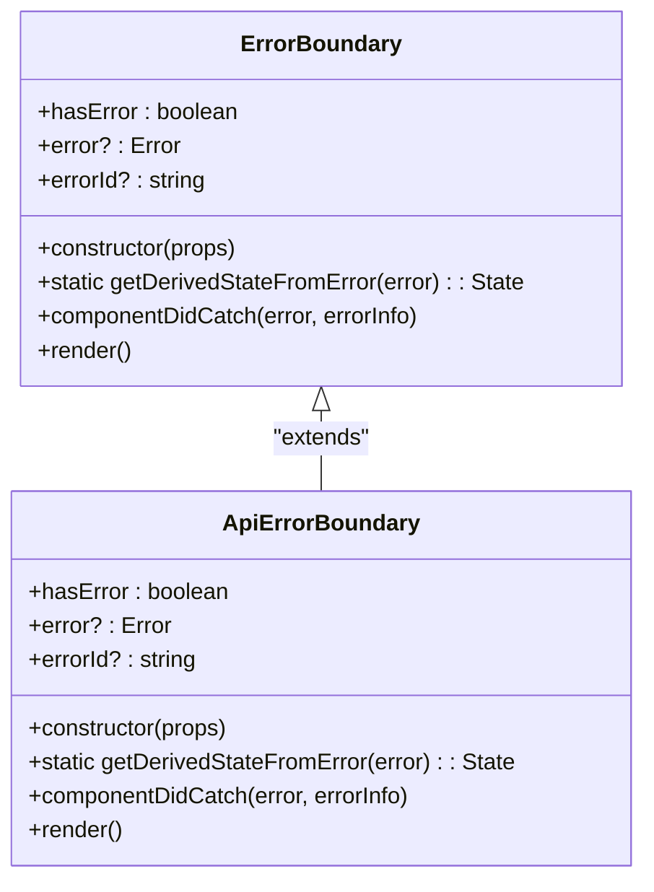
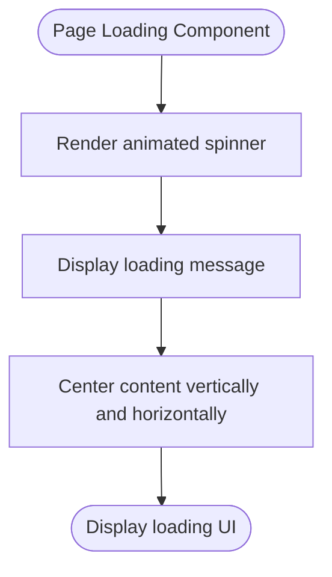
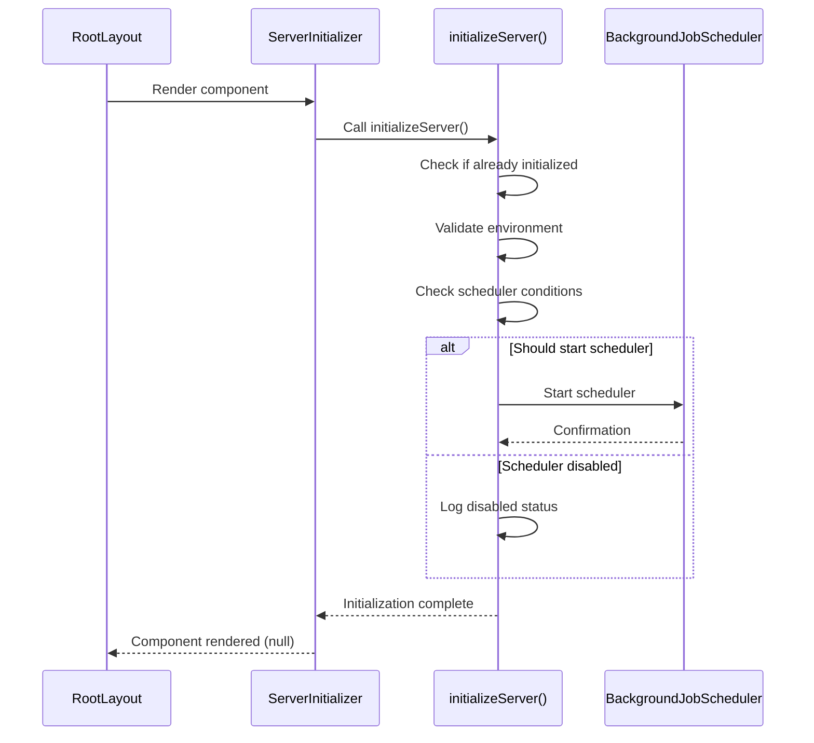
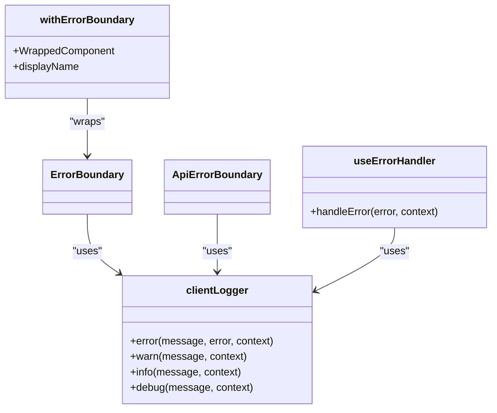
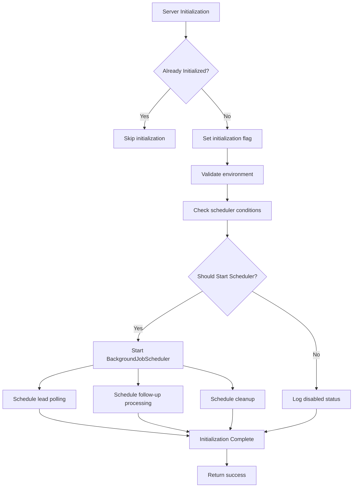

# Utility Components

<cite>
**Referenced Files in This Document**   
- [ErrorBoundary.tsx](file://src/components/ErrorBoundary.tsx#L1-L280)
- [PageLoading.tsx](file://src/components/PageLoading.tsx#L1-L19)
- [ServerInitializer.tsx](file://src/components/ServerInitializer.tsx#L1-L20)
- [server-init.ts](file://src/lib/server-init.ts#L1-L179)
- [BackgroundJobScheduler.ts](file://src/services/BackgroundJobScheduler.ts#L1-L463)
- [client-logger.ts](file://src/lib/client-logger.ts#L1-L133)
- [logger.ts](file://src/lib/logger.ts#L1-L351)
- [layout.tsx](file://src/app/layout.tsx#L1-L35)
</cite>

## Table of Contents
1. [ErrorBoundary Component](#errorboundary-component)
2. [PageLoading Component](#pageloading-component)
3. [ServerInitializer Component](#serverinitializer-component)
4. [Error Handling Ecosystem](#error-handling-ecosystem)
5. [Loading State Management](#loading-state-management)
6. [Initialization Sequencing](#initialization-sequencing)
7. [Best Practices](#best-practices)

## ErrorBoundary Component

The `ErrorBoundary` component is a React error boundary that catches JavaScript errors anywhere in the child component tree, logs them, and displays a fallback UI instead of crashing the entire application. It is implemented as a class component using React's `getDerivedStateFromError` and `componentDidCatch` lifecycle methods.

This component is strategically placed in the application's root layout to ensure global error coverage. When an error occurs, it captures the error object and component stack trace, generates a unique error ID for tracking, and logs the error using the client-side logging service. In development mode, detailed error information is displayed to aid debugging, while in production, a user-friendly error message is shown with options to reload or navigate back.

**Diagram sources**
- [ErrorBoundary.tsx](file://src/components/ErrorBoundary.tsx#L20-L156)

**Section sources**
- [ErrorBoundary.tsx](file://src/components/ErrorBoundary.tsx#L20-L156)
- [layout.tsx](file://src/app/layout.tsx#L5-L35)

## PageLoading Component

The `PageLoading` component provides a visual indicator for asynchronous operations, particularly during data fetching and page transitions. It displays a simple spinner animation alongside an optional message to inform users that content is being loaded.

This component is designed to be lightweight and unobtrusive, using CSS animations for the spinner and responsive design principles to ensure visibility across different screen sizes. The component accepts an optional message prop to provide context-specific loading information, enhancing the user experience by communicating what is happening during wait times.

**Diagram sources**
- [PageLoading.tsx](file://src/components/PageLoading.tsx#L6-L17)

**Section sources**
- [PageLoading.tsx](file://src/components/PageLoading.tsx#L6-L17)

## ServerInitializer Component

The `ServerInitializer` component ensures that critical server-side services are properly initialized before the application becomes fully operational. It acts as a bootstrap mechanism that runs only on the server side, initializing essential services such as the background job scheduler and notification system.

This component is integrated into the application's root layout and executes during server-side rendering. It prevents race conditions by ensuring that background processes are running before any client requests are handled. The initialization process includes validation of service configurations and conditional startup of background jobs based on environment variables.

**Diagram sources**
- [ServerInitializer.tsx](file://src/components/ServerInitializer.tsx#L6-L18)
- [server-init.ts](file://src/lib/server-init.ts#L1-L179)

**Section sources**
- [ServerInitializer.tsx](file://src/components/ServerInitializer.tsx#L6-L18)
- [server-init.ts](file://src/lib/server-init.ts#L1-L179)
- [layout.tsx](file://src/app/layout.tsx#L5-L35)

## Error Handling Ecosystem

The application features a comprehensive error handling ecosystem that includes multiple specialized components and utilities. Beyond the base `ErrorBoundary`, there are specialized variants like `ApiErrorBoundary` for handling API-related errors with a more focused UI. The ecosystem also includes higher-order components and hooks to provide flexible error handling patterns.

The `withErrorBoundary` higher-order component allows developers to easily wrap functional components with error boundary functionality, promoting code reuse and consistent error handling across the application. The `useErrorHandler` hook provides a way to handle asynchronous errors in functional components, integrating with the same logging infrastructure used by the error boundaries.

All errors are logged using the `clientLogger` service, which formats and transmits error data with contextual information including error IDs, component stacks, and custom metadata. This centralized logging approach enables effective monitoring and debugging of application errors.

**Diagram sources**
- [ErrorBoundary.tsx](file://src/components/ErrorBoundary.tsx#L161-L280)
- [client-logger.ts](file://src/lib/client-logger.ts#L1-L133)

**Section sources**
- [ErrorBoundary.tsx](file://src/components/ErrorBoundary.tsx#L161-L280)
- [client-logger.ts](file://src/lib/client-logger.ts#L1-L133)

## Loading State Management

The `PageLoading` component represents the application's approach to loading state management. While the current implementation is simple, it follows best practices for user experience during asynchronous operations. The component provides visual feedback that is immediate and clear, preventing user confusion during data fetching.

For more complex loading scenarios, the application could extend this pattern with additional features such as progress indicators, skeleton screens, or timeout handling. The component's design allows for easy customization and theming to match different application contexts while maintaining a consistent user experience.

The loading component is designed to be used in conjunction with data fetching hooks, providing a seamless transition between loading and loaded states. This pattern helps prevent layout shifts and provides a smooth user experience during content loading.

**Section sources**
- [PageLoading.tsx](file://src/components/PageLoading.tsx#L6-L17)

## Initialization Sequencing

The server initialization process follows a careful sequencing pattern to ensure reliable application startup. The `ServerInitializer` triggers the `initializeServer` function, which implements a singleton pattern to prevent multiple initializations. The process includes several key steps:

1. Environment validation and configuration checking
2. Service dependency validation (e.g., notification service)
3. Conditional startup of background services based on environment
4. Error handling and graceful degradation if initialization fails

The background job scheduler is configured with multiple cron jobs for different tasks:
- Lead polling every 15 minutes
- Follow-up processing every 5 minutes
- Daily cleanup at 2 AM

These jobs can be configured via environment variables, allowing different schedules for development and production environments. The initialization process also includes signal handling for graceful shutdown, ensuring that background jobs are properly stopped when the server terminates.

**Diagram sources**
- [server-init.ts](file://src/lib/server-init.ts#L1-L179)
- [BackgroundJobScheduler.ts](file://src/services/BackgroundJobScheduler.ts#L1-L463)

**Section sources**
- [server-init.ts](file://src/lib/server-init.ts#L1-L179)
- [BackgroundJobScheduler.ts](file://src/services/BackgroundJobScheduler.ts#L1-L463)

## Best Practices

### Error Logging Best Practices
- **Consistent Error Identification**: Each error is assigned a unique ID for tracking across systems
- **Contextual Logging**: Errors are logged with relevant context including component stack and props
- **Environment-Specific Behavior**: Development environments show detailed error information while production provides user-friendly messages
- **Centralized Logging**: All errors flow through the same logging service for consistent handling
- **External Monitoring**: Production errors should be sent to external error reporting services

### Loading State Management Best Practices
- **Immediate Feedback**: Show loading indicators as soon as an async operation begins
- **Clear Messaging**: Use descriptive messages to inform users what is loading
- **Consistent Design**: Maintain visual consistency across different loading states
- **Timeout Handling**: Implement timeouts for long-running operations
- **Accessibility**: Ensure loading indicators are accessible to screen readers

### Initialization Sequencing Best Practices
- **Idempotent Initialization**: Ensure initialization can be called multiple times safely
- **Graceful Degradation**: Continue operation even if non-critical services fail to initialize
- **Health Monitoring**: Provide endpoints to check service status
- **Configurable Behavior**: Use environment variables to control initialization behavior
- **Proper Cleanup**: Implement shutdown handlers to clean up resources

These utility components work together to enhance application reliability and user experience by providing robust error handling, clear loading feedback, and reliable service initialization.

**Section sources**
- [ErrorBoundary.tsx](file://src/components/ErrorBoundary.tsx#L1-L280)
- [PageLoading.tsx](file://src/components/PageLoading.tsx#L1-L19)
- [ServerInitializer.tsx](file://src/components/ServerInitializer.tsx#L1-L20)
- [server-init.ts](file://src/lib/server-init.ts#L1-L179)