# Frontend Architecture

<cite>
**Referenced Files in This Document**   
- [layout.tsx](file://src/app/layout.tsx)
- [page.tsx](file://src/app/page.tsx)
- [LeadList.tsx](file://src/components/dashboard/LeadList.tsx)
- [IntakeWorkflow.tsx](file://src/components/intake/IntakeWorkflow.tsx)
- [SettingsCard.tsx](file://src/components/admin/SettingsCard.tsx)
- [prisma.ts](file://src/lib/prisma.ts)
- [tailwind.config.ts](file://tailwind.config.ts)
- [route.ts](file://src/app/api/leads/route.ts)
- [dashboard/page.tsx](file://src/app/dashboard/page.tsx)
- [admin/settings/page.tsx](file://src/app/admin/settings/page.tsx)
- [types.ts](file://src/components/dashboard/types.ts)
- [route.ts](file://src/app/api/leads/[id]/route.ts)
- [Step1Form.tsx](file://src/components/intake/Step1Form.tsx) - *Updated with SSN and zip code validation*
- [Step3Form.tsx](file://src/components/intake/Step3Form.tsx) - *Added digital signature functionality*
- [route.ts](file://src/app/api/intake/[token]/step3/route.ts) - *Added for digital signature processing*
- [ShareView.tsx](file://src/components/share/ShareView.tsx) - *Enhanced with comprehensive lead details*
- [InputField.tsx](file://src/components/intake/InputField.tsx) - *Updated with field focusing for validation*
- [SelectField.tsx](file://src/components/intake/SelectField.tsx) - *Updated with field focusing for validation*
</cite>

## Update Summary
**Changes Made**   
- Updated Key Component Examples section to include digital signature functionality
- Added documentation for SSN and zip code formatting/validation in Step1Form
- Enhanced IntakeWorkflow diagram to include Step 3 (Digital Signature)
- Added new section for Digital Signature Component
- Updated component hierarchy to reflect new Step3Form component
- Added documentation for enhanced ShareView component with comprehensive lead details
- Updated form validation documentation to include field focusing UX improvements

## Table of Contents
1. [Project Structure](#project-structure)
2. [Next.js App Router and Layout Organization](#nextjs-app-router-and-layout-organization)
3. [Page Routing Conventions](#page-routing-conventions)
4. [Component Hierarchy and Reusability](#component-hierarchy-and-reusability)
5. [State Management and Data Fetching](#state-management-and-data-fetching)
6. [Styling Methodology](#styling-methodology)
7. [Data Flow from API to UI](#data-flow-from-api-to-ui)
8. [Key Component Examples](#key-component-examples)
9. [Responsive Design and Accessibility](#responsive-design-and-accessibility)
10. [Creating New Pages and Components](#creating-new-pages-and-components)

## Project Structure

The fund-track frontend follows a standard Next.js App Router structure with a clear separation of concerns. The application is organized into logical directories that group related functionality.

```mermaid
graph TB
subgraph "src"
subgraph "app"
app_pages["app/"]
subgraph "User Flows"
dashboard["dashboard/"]
admin["admin/"]
intake["intake/[token]/"]
auth["auth/"]
end
subgraph "API Routes"
api["api/"]
end
layout["layout.tsx"]
page["page.tsx"]
end
subgraph "components"
components["components/"]
subgraph "By Feature"
dashboard_components["dashboard/"]
intake_components["intake/"]
admin_components["admin/"]
share_components["share/"]
end
shared_components["shared components"]
end
subgraph "lib"
lib["lib/"]
auth["auth.ts"]
prisma["prisma.ts"]
logger["logger.ts"]
end
services["services/"]
types["types/"]
end
app_pages --> components
app_pages --> lib
components --> lib
api --> services
services --> lib
```

**Diagram sources**
- [layout.tsx](file://src/app/layout.tsx)
- [page.tsx](file://src/app/page.tsx)

**Section sources**
- [layout.tsx](file://src/app/layout.tsx)
- [page.tsx](file://src/app/page.tsx)

## Next.js App Router and Layout Organization

The application uses Next.js App Router for routing and layout management. The root layout is defined in `layout.tsx` and provides global providers and styling.

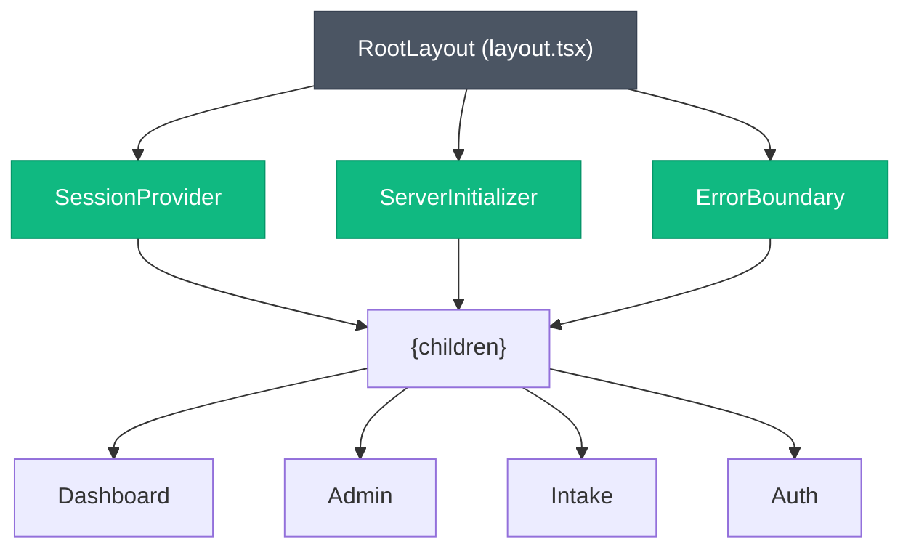

The layout component wraps all pages with essential providers:
- **SessionProvider**: Manages authentication state across the application
- **ServerInitializer**: Initializes server-side dependencies
- **ErrorBoundary**: Catches and handles component-level errors
- **Font Configuration**: Applies Plus Jakarta Sans as the primary font

**Diagram sources**
- [layout.tsx](file://src/app/layout.tsx#L1-L34)

**Section sources**
- [layout.tsx](file://src/app/layout.tsx#L1-L34)

## Page Routing Conventions

The application follows Next.js App Router conventions with a clear routing structure based on user roles and workflows:

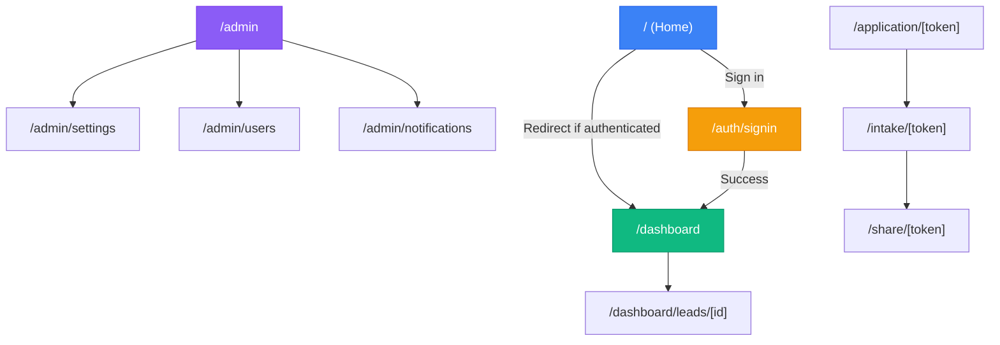

Key routing patterns:
- **Role-based access**: Pages are protected by role guards (e.g., AdminOnly)
- **Dynamic routes**: Use bracket syntax for parameterized routes ([id], [token])
- **API routes**: Follow RESTful patterns under `/api` with clear resource organization
- **Protected routes**: Authentication is enforced via middleware and client-side hooks

**Section sources**
- [page.tsx](file://src/app/page.tsx#L1-L52)
- [dashboard/page.tsx](file://src/app/dashboard/page.tsx#L1-L151)
- [admin/settings/page.tsx](file://src/app/admin/settings/page.tsx#L1-L264)

## Component Hierarchy and Reusability

The component architecture follows a feature-based organization with reusable components across user flows:

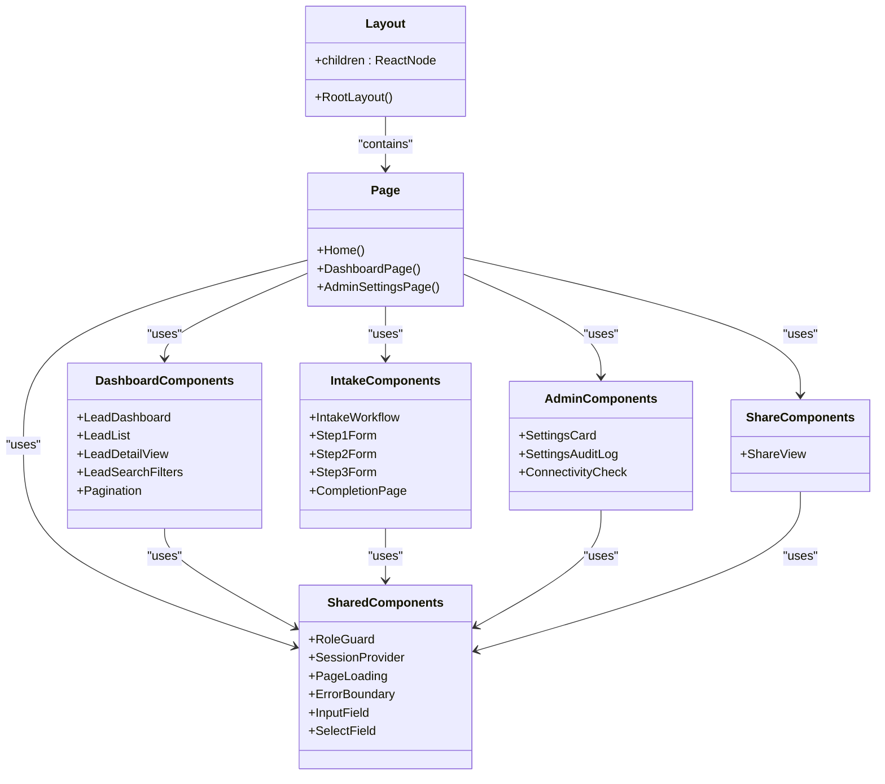

Components are organized by feature area:
- **dashboard/**: Components for the staff dashboard and lead management
- **intake/**: Components for the prospect intake workflow
- **admin/**: Components for administrative functions
- **share/**: Components for secure lead sharing
- **shared**: Reusable components used across multiple flows

**Diagram sources**
- [LeadList.tsx](file://src/components/dashboard/LeadList.tsx#L1-L334)
- [IntakeWorkflow.tsx](file://src/components/intake/IntakeWorkflow.tsx#L1-L134)
- [SettingsCard.tsx](file://src/components/admin/SettingsCard.tsx#L1-L139)
- [Step3Form.tsx](file://src/components/intake/Step3Form.tsx#L1-L277)
- [ShareView.tsx](file://src/components/share/ShareView.tsx#L1-L653)
- [InputField.tsx](file://src/components/intake/InputField.tsx#L1-L57)
- [SelectField.tsx](file://src/components/intake/SelectField.tsx#L1-L59)

**Section sources**
- [LeadList.tsx](file://src/components/dashboard/LeadList.tsx#L1-L334)
- [IntakeWorkflow.tsx](file://src/components/intake/IntakeWorkflow.tsx#L1-L134)
- [SettingsCard.tsx](file://src/components/admin/SettingsCard.tsx#L1-L139)
- [Step3Form.tsx](file://src/components/intake/Step3Form.tsx#L1-L277)
- [ShareView.tsx](file://src/components/share/ShareView.tsx#L1-L653)
- [InputField.tsx](file://src/components/intake/InputField.tsx#L1-L57)
- [SelectField.tsx](file://src/components/intake/SelectField.tsx#L1-L59)

## State Management and Data Fetching

The application uses a combination of React hooks and server-side data fetching patterns:

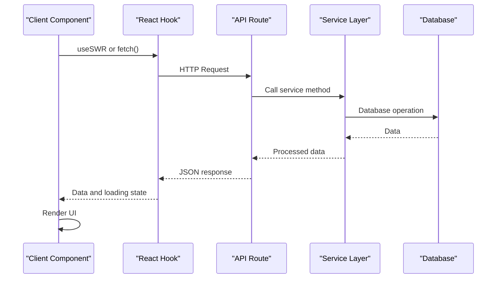

Key patterns:
- **Client-side state**: React useState and useEffect hooks for component state
- **Authentication state**: NextAuth useSession hook for session management
- **Data fetching**: Direct fetch calls to API routes with SWR-like patterns
- **Server components**: API routes handle database operations with Prisma
- **Error boundaries**: Global and component-level error handling

The Prisma client is configured as a singleton with connection pooling:

```typescript
// src/lib/prisma.ts
export const prisma = globalForPrisma.prisma ??
  new PrismaClient({
    log: process.env.NODE_ENV === 'development' ? ['query', 'error', 'warn'] : ['error'],
    errorFormat: 'pretty',
  });
```

**Diagram sources**
- [prisma.ts](file://src/lib/prisma.ts#L1-L60)
- [route.ts](file://src/app/api/leads/route.ts#L1-L166)
- [dashboard/page.tsx](file://src/app/dashboard/page.tsx#L1-L151)

**Section sources**
- [prisma.ts](file://src/lib/prisma.ts#L1-L60)
- [route.ts](file://src/app/api/leads/route.ts#L1-L166)

## Styling Methodology

The application uses Tailwind CSS with a custom design system:

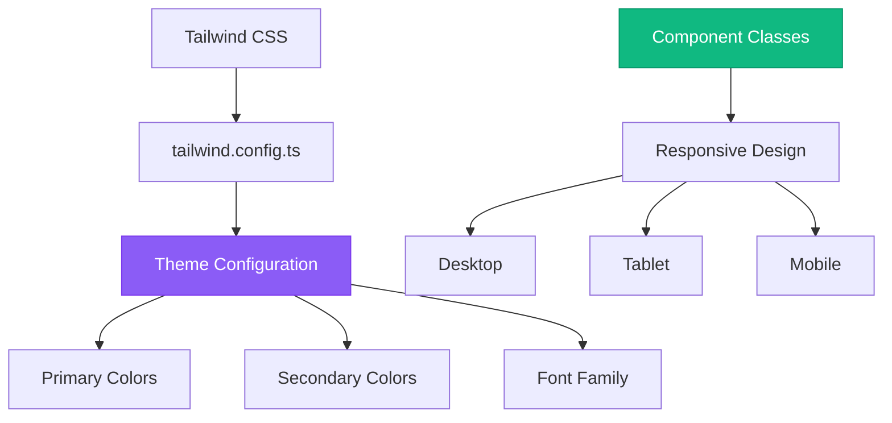

Customizations in `tailwind.config.ts`:
- **Color palette**: Custom primary and secondary color schemes
- **Typography**: Plus Jakarta Sans as the primary font
- **Responsive breakpoints**: Mobile-first design with sm, md, lg breakpoints

Component styling patterns:
- **Utility-first**: Direct application of Tailwind classes
- **Responsive variants**: Different layouts for mobile, tablet, and desktop
- **Consistent spacing**: Standardized padding and margin scales
- **Accessibility**: Focus states and semantic HTML

**Diagram sources**
- [tailwind.config.ts](file://tailwind.config.ts#L1-L43)
- [LeadList.tsx](file://src/components/dashboard/LeadList.tsx#L1-L334)

**Section sources**
- [tailwind.config.ts](file://tailwind.config.ts#L1-L43)

## Data Flow from API to UI

The data flow follows a consistent pattern from API routes to UI components:

```mermaid
flowchart TD
API["API Route (route.ts)"]
Service["Service Layer"]
Database["Prisma/Database"]
Transform["Data Transformation"]
Client["Client Component"]
State["Component State"]
Render["UI Rendering"]
API --> |GET request| Service
Service --> |Query| Database
Database --> |Raw data| Service
Service --> |Process| Transform
Transform --> |JSON| API
API --> |HTTP Response| Client
Client --> |useState| State
State --> |Render| Render
subgraph "Server"
API
Service
Database
end
subgraph "Client"
Client
State
Render
end
```

Example: Lead data flow
1. Client requests `/api/leads` with query parameters
2. API route validates authentication and parameters
3. Service layer queries database with Prisma
4. Data is transformed (BigInt to string) and returned as JSON
5. Client component fetches data and manages loading state
6. Data is rendered in LeadList component with appropriate formatting

**Diagram sources**
- [route.ts](file://src/app/api/leads/route.ts#L1-L166)
- [LeadList.tsx](file://src/components/dashboard/LeadList.tsx#L1-L334)
- [types.ts](file://src/components/dashboard/types.ts#L1-L65)

**Section sources**
- [route.ts](file://src/app/api/leads/route.ts#L1-L166)
- [LeadList.tsx](file://src/components/dashboard/LeadList.tsx#L1-L334)

## Key Component Examples

### LeadList Component

The LeadList component displays leads in a responsive table format:

```mermaid
classDiagram
class LeadList {
+leads : Lead[]
+loading : boolean
+sortBy : string
+sortOrder : "asc" | "desc"
+onSort : (field : string) => void
+LeadList()
}
class Lead {
+id : number
+firstName : string | null
+lastName : string | null
+email : string | null
+status : LeadStatus
+createdAt : Date
+_count : { notes : number, documents : number }
}
LeadList --> Lead : "displays"
LeadList --> SortButton : "uses"
```

Features:
- **Three responsive layouts**: Desktop table, tablet grid, mobile cards
- **Sorting**: Clickable headers with visual indicators
- **Status badges**: Color-coded status indicators
- **Progress tracking**: Visual indicators for intake completion
- **Loading states**: Skeleton screens during data fetching

**Section sources**
- [LeadList.tsx](file://src/components/dashboard/LeadList.tsx#L1-L334)
- [types.ts](file://src/components/dashboard/types.ts#L1-L65)

### IntakeWorkflow Component

The IntakeWorkflow component manages the multi-step intake process:

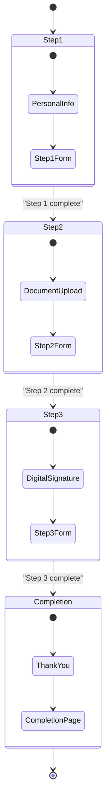

Features:
- **Progress tracking**: Visual indicator showing current step
- **Conditional rendering**: Displays appropriate form based on progress
- **State management**: useState to track current step
- **Callback pattern**: Parent component handles completion events

**Section sources**
- [IntakeWorkflow.tsx](file://src/components/intake/IntakeWorkflow.tsx#L1-L134)

### Digital Signature Component

The Step3Form component implements the digital signature collection functionality:

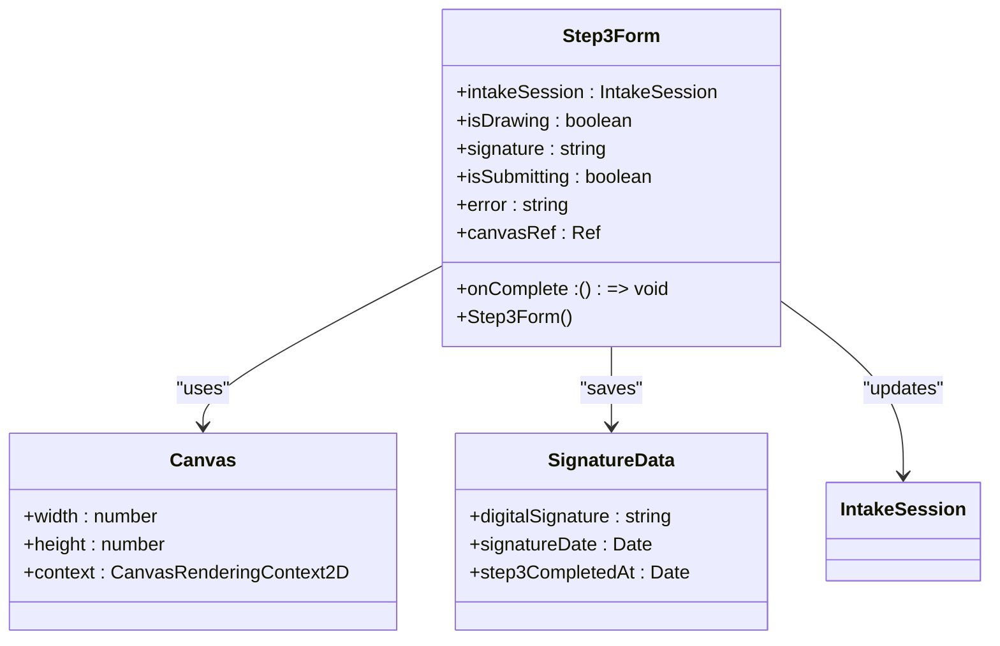

Features:
- **Interactive canvas**: Users can draw their signature with mouse or touch
- **Real-time rendering**: Signature appears as it's drawn with smooth lines
- **Base64 storage**: Signature is stored as PNG data URL in database
- **Validation**: Requires signature before submission
- **Clear functionality**: Users can clear and redraw their signature
- **Responsive design**: Works on desktop and mobile devices

The component integrates with the backend API to store the signature:

```typescript
// API request structure
{
  digitalSignature: "data:image/png;base64,iVBORw0KGgoAAAANSUhEUg..."
}
```

**Section sources**
- [Step3Form.tsx](file://src/components/intake/Step3Form.tsx#L1-L277)
- [route.ts](file://src/app/api/intake/[token]/step3/route.ts#L1-L114)

### Step1Form Component

The Step1Form component has been enhanced with additional validation and formatting:

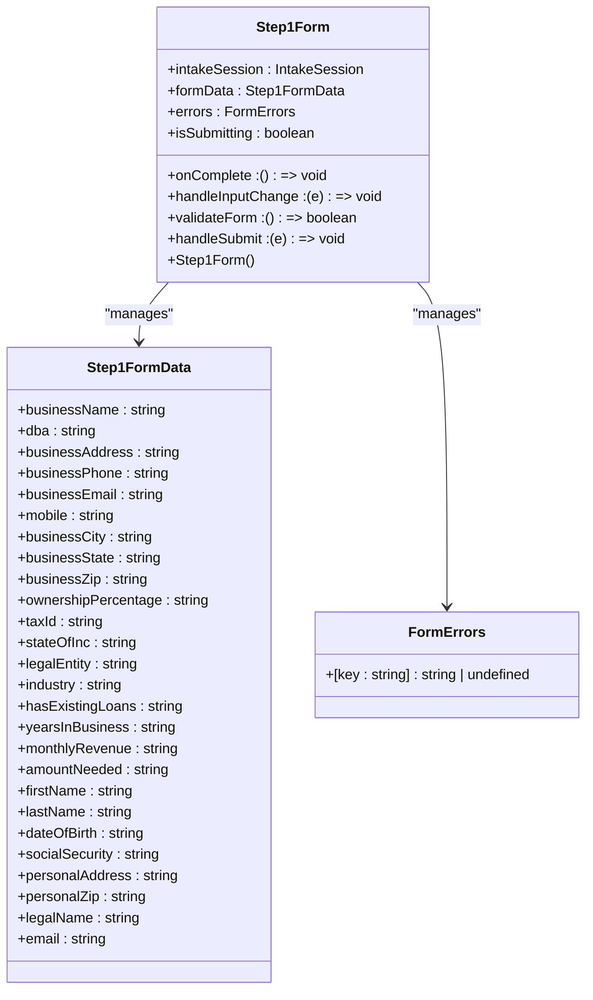

Key enhancements:
- **SSN formatting**: Automatically formats Social Security Number as XXX-XX-XXXX
- **Zip code formatting**: Supports both 5-digit and ZIP+4 formats (12345 or 12345-6789)
- **Real-time validation**: Validates format as user types
- **Error messages**: Clear feedback for invalid formats
- **Input masking**: Visual formatting during data entry
- **Field focusing**: Automatically focuses the first invalid field during validation

Validation rules:
- **SSN**: Must be in XXX-XX-XXXX format (e.g., 123-45-6789)
- **Zip code**: Must be in 12345 or 12345-6789 format
- **Automatic formatting**: Removes non-numeric characters and applies proper formatting

**Section sources**
- [Step1Form.tsx](file://src/components/intake/Step1Form.tsx#L1-L703)
- [InputField.tsx](file://src/components/intake/InputField.tsx#L1-L57)
- [SelectField.tsx](file://src/components/intake/SelectField.tsx#L1-L59)

### SettingsCard Component

The SettingsCard component provides a reusable interface for system settings:

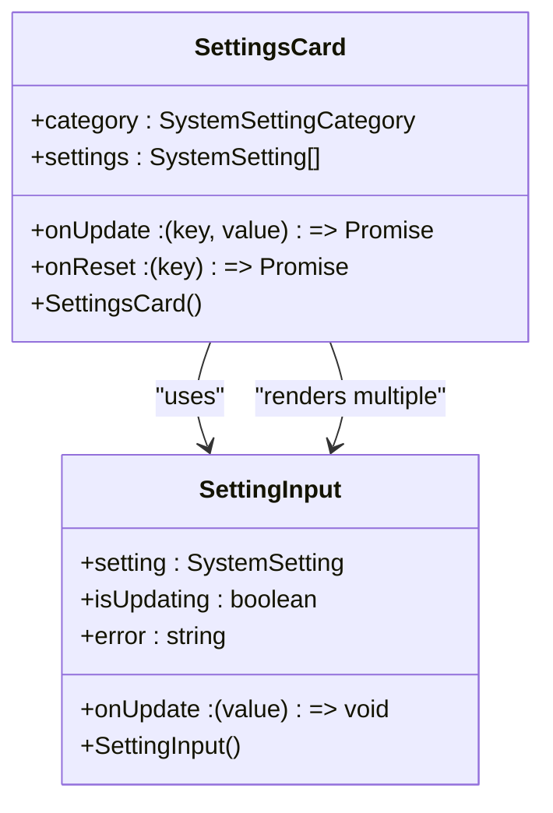

Features:
- **Form state management**: Tracks updating status and errors
- **Async handling**: Manages loading states during API calls
- **Error recovery**: Displays and clears error messages
- **Reset functionality**: Individual setting reset capability

**Section sources**
- [SettingsCard.tsx](file://src/components/admin/SettingsCard.tsx#L1-L139)

### ShareView Component

The ShareView component provides secure access to comprehensive lead information:

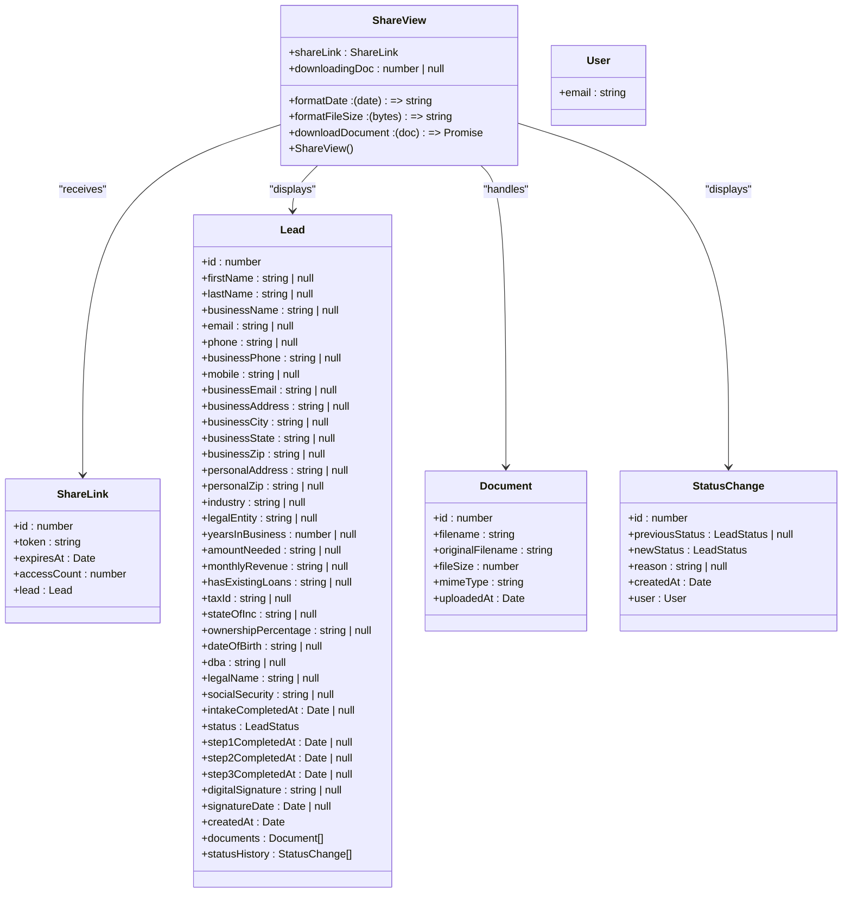

Features:
- **Comprehensive lead details**: Displays all relevant business, personal, financial, and contact information
- **Document management**: Secure download of uploaded documents with loading indicators
- **Status history**: Timeline of recent status changes with timestamps and responsible users
- **Application progress**: Visual timeline showing completion status of intake steps
- **Digital signature**: Display of collected digital signature with signing date
- **Expiration warning**: Visual indicator when share link is nearing expiration
- **Responsive layout**: Three-column grid on desktop, stacked layout on mobile

**Section sources**
- [ShareView.tsx](file://src/components/share/ShareView.tsx#L1-L653)

## Responsive Design and Accessibility

The application implements responsive design with three distinct layouts:

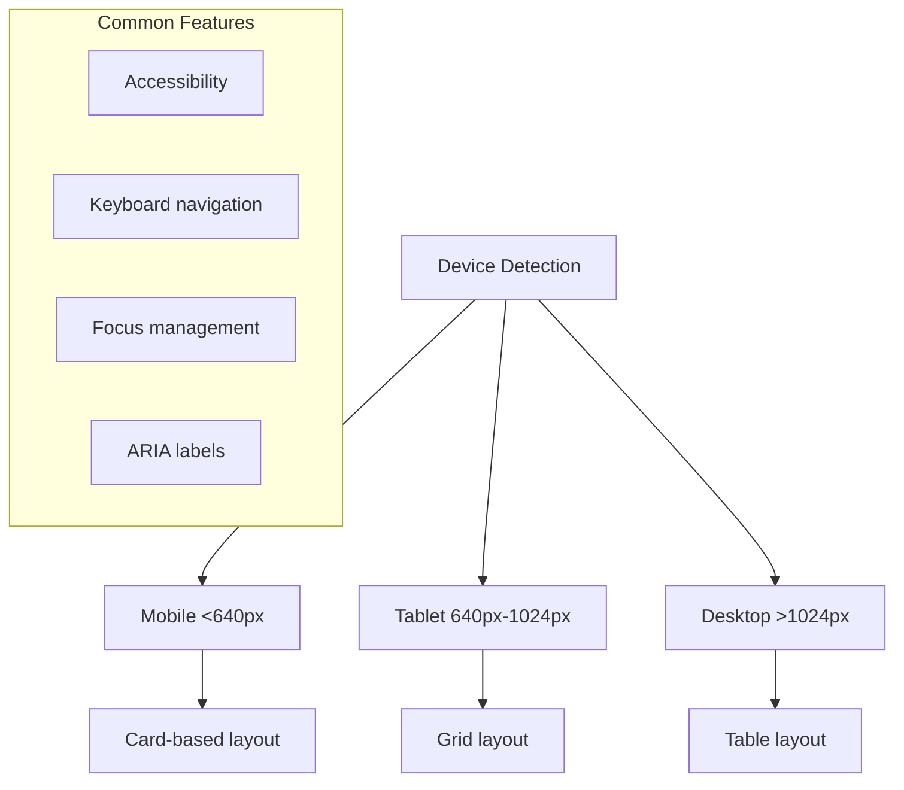

Responsive strategies:
- **Mobile**: Card-based layout with stacked information
- **Tablet**: Grid layout with grouped information
- **Desktop**: Table layout with dense information display

Accessibility practices:
- **Semantic HTML**: Proper use of headings, lists, and landmarks
- **Keyboard navigation**: All interactive elements accessible via keyboard
- **Focus management**: Visual focus indicators and logical tab order
- **ARIA labels**: Screen reader support for interactive elements
- **Color contrast**: Sufficient contrast for text and interactive elements
- **Form validation**: Enhanced UX with automatic field focusing on validation errors

**Section sources**
- [LeadList.tsx](file://src/components/dashboard/LeadList.tsx#L1-L334)
- [InputField.tsx](file://src/components/intake/InputField.tsx#L1-L57)
- [SelectField.tsx](file://src/components/intake/SelectField.tsx#L1-L59)

## Creating New Pages and Components

When creating new pages and components, follow these patterns:

### New Page Creation
1. Create a new directory in the appropriate feature area (dashboard, admin, etc.)
2. Add a `page.tsx` file with the component definition
3. Implement authentication and role guards as needed
4. Use consistent layout and styling patterns

```typescript
// Example new page structure
export default function NewPage() {
  const { data: session, status } = useSession();
  
  if (status === "loading") return <PageLoading />;
  if (!session) return null;
  
  return (
    <div className="min-h-screen bg-gray-50">
      <main className="max-w-7xl mx-auto py-6 sm:px-6 lg:px-8">
        {/* Page content */}
      </main>
    </div>
  );
}
```

### New Component Creation
1. Create a new component file in the appropriate feature directory
2. Define TypeScript interfaces for props
3. Implement responsive design patterns
4. Use consistent styling and accessibility practices

```typescript
// Example component structure
'use client';

interface NewComponentProps {
  items: Item[];
  onAction: (item: Item) => void;
}

export function NewComponent({ items, onAction }: NewComponentProps) {
  return (
    <div className="bg-white shadow rounded-lg">
      {/* Component content with responsive classes */}
    </div>
  );
}
```

Best practices:
- **Reusability**: Design components to be reusable across multiple contexts
- **Accessibility**: Implement keyboard navigation and screen reader support
- **Performance**: Use React.memo for expensive components
- **Testing**: Include unit tests for complex logic
- **Documentation**: Add JSDoc comments for public components
- **Form components**: Implement field focusing for validation errors to improve user experience

**Section sources**
- [page.tsx](file://src/app/page.tsx#L1-L52)
- [LeadList.tsx](file://src/components/dashboard/LeadList.tsx#L1-L334)
- [IntakeWorkflow.tsx](file://src/components/intake/IntakeWorkflow.tsx#L1-L134)
- [InputField.tsx](file://src/components/intake/InputField.tsx#L1-L57)
- [SelectField.tsx](file://src/components/intake/SelectField.tsx#L1-L59)