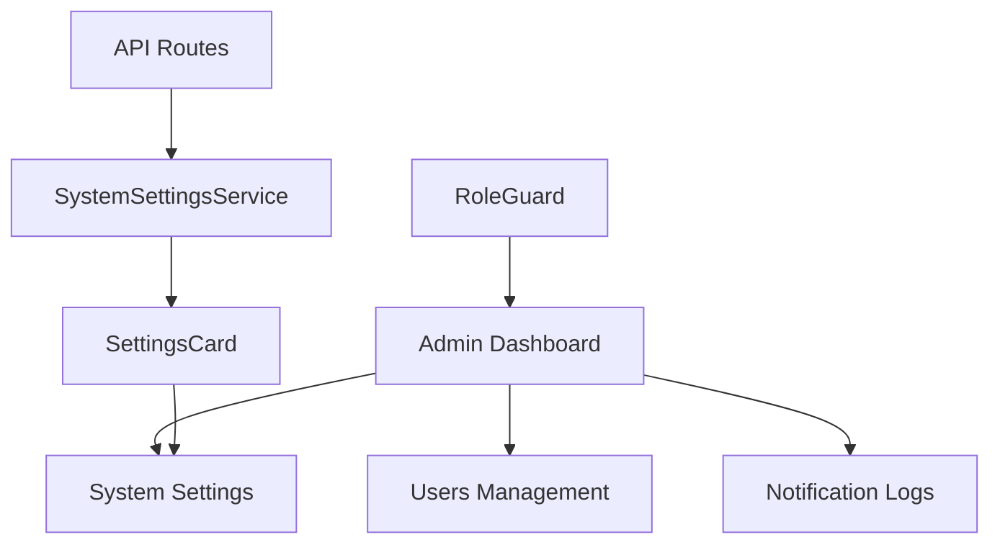
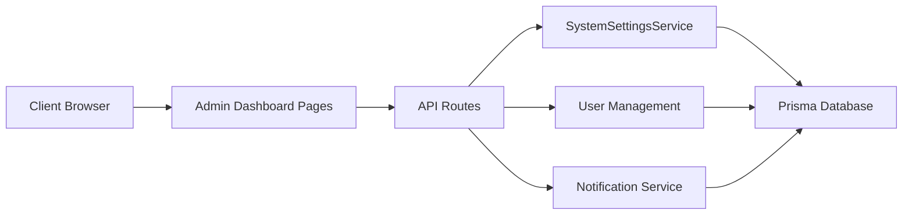
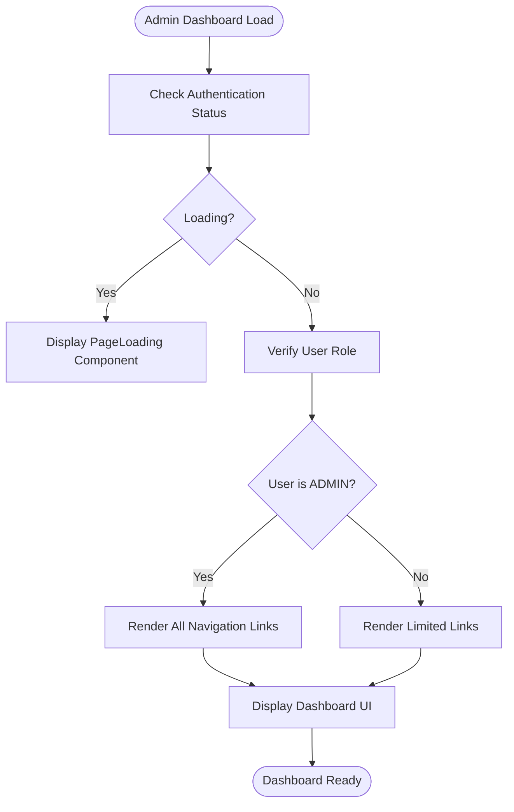
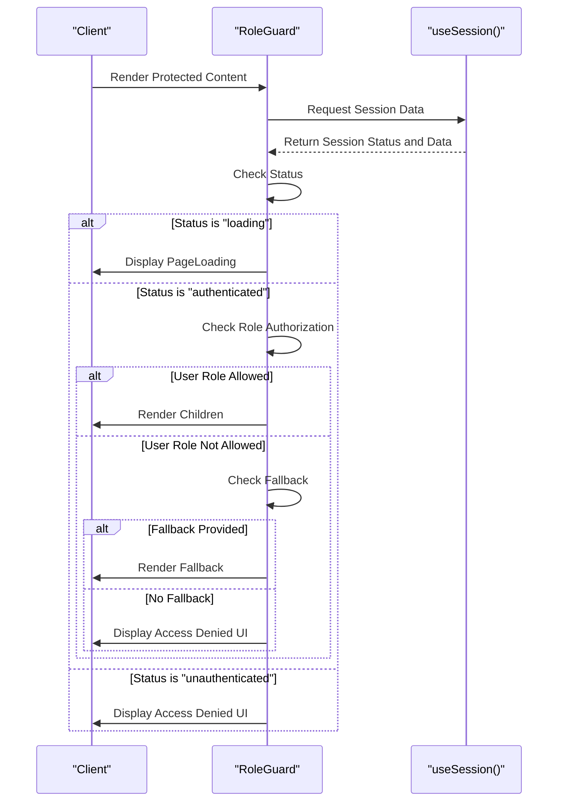
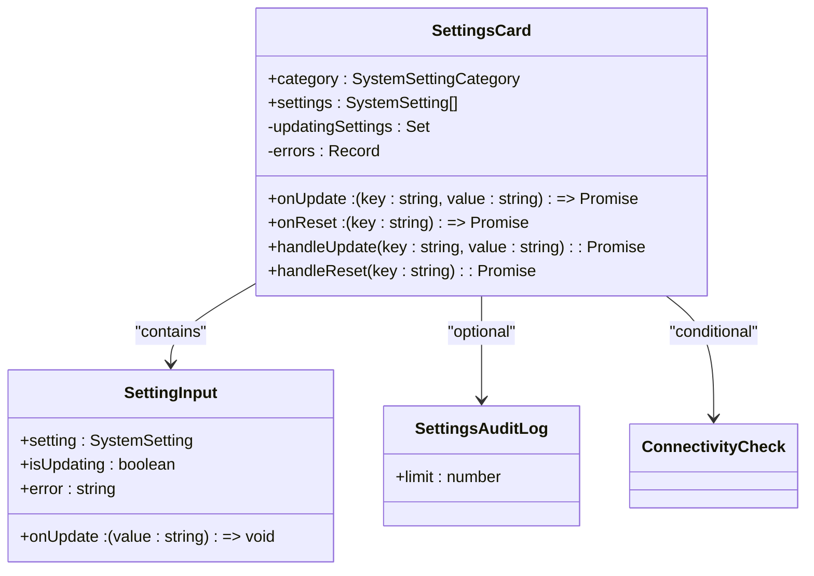
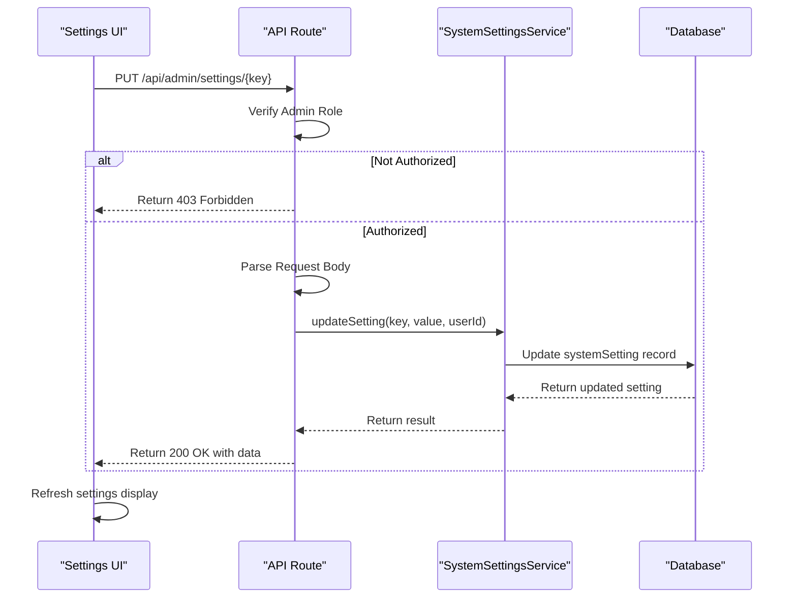
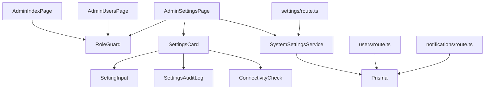

# Admin Dashboard Implementation

<cite>
**Referenced Files in This Document**   
- [AdminIndexPage.tsx](file://src/app/admin/page.tsx)
- [RoleGuard.tsx](file://src/components/auth/RoleGuard.tsx)
- [SettingsCard.tsx](file://src/components/admin/SettingsCard.tsx)
- [AdminSettingsPage.tsx](file://src/app/admin/settings/page.tsx)
- [AdminUsersPage.tsx](file://src/app/admin/users/page.tsx)
- [AdminNotificationsPage.tsx](file://src/app/admin/notifications/page.tsx)
- [settings/route.ts](file://src/app/api/admin/settings/route.ts)
- [settings/[key]/route.ts](file://src/app/api/admin/settings/[key]/route.ts)
- [users/route.ts](file://src/app/api/admin/users/route.ts)
- [notifications/route.ts](file://src/app/api/admin/notifications/route.ts)
- [SystemSettingsService.ts](file://src/services/SystemSettingsService.ts)
</cite>

## Table of Contents
1. [Introduction](#introduction)
2. [Project Structure](#project-structure)
3. [Core Components](#core-components)
4. [Architecture Overview](#architecture-overview)
5. [Detailed Component Analysis](#detailed-component-analysis)
6. [Dependency Analysis](#dependency-analysis)
7. [Performance Considerations](#performance-considerations)
8. [Troubleshooting Guide](#troubleshooting-guide)
9. [Conclusion](#conclusion)

## Introduction
The Admin Dashboard serves as the central navigation hub for administrative functions within the application. It provides access to user management, system settings configuration, and notification logs. The implementation enforces strict access control through role-based permissions, ensuring that only authorized users (specifically administrators) can access sensitive functionality. This document details the layout structure, access control mechanisms, component organization, and integration with backend services.

## Project Structure
The admin dashboard is organized as a feature-based module within the Next.js application structure. It consists of a main index page and three sub-pages: users, settings, and notifications. Each page is implemented as a server-rendered React component with client-side interactivity. The structure follows a clear separation between UI components and business logic, with dedicated services handling data operations.

**Diagram sources**
- [page.tsx](file://src/app/admin/page.tsx)
- [users/page.tsx](file://src/app/admin/users/page.tsx)
- [settings/page.tsx](file://src/app/admin/settings/page.tsx)
- [notifications/page.tsx](file://src/app/admin/notifications/page.tsx)

**Section sources**
- [page.tsx](file://src/app/admin/page.tsx)
- [users/page.tsx](file://src/app/admin/users/page.tsx)
- [settings/page.tsx](file://src/app/admin/settings/page.tsx)
- [notifications/page.tsx](file://src/app/admin/notifications/page.tsx)

## Core Components
The admin dashboard relies on several key components to provide its functionality. The RoleGuard component enforces access control by verifying user roles before rendering protected content. The SettingsCard component displays and allows editing of system configuration settings in a structured format. These components work together with API routes to provide a complete administrative interface.

**Section sources**
- [RoleGuard.tsx](file://src/components/auth/RoleGuard.tsx)
- [SettingsCard.tsx](file://src/components/admin/SettingsCard.tsx)

## Architecture Overview
The admin dashboard follows a client-server architecture with React components on the frontend and API routes on the backend. The frontend components handle user interaction and state management, while the backend routes handle data persistence and business logic. The SystemSettingsService provides a centralized interface for settings management with caching capabilities.

**Diagram sources**
- [settings/route.ts](file://src/app/api/admin/settings/route.ts)
- [users/route.ts](file://src/app/api/admin/users/route.ts)
- [notifications/route.ts](file://src/app/api/admin/notifications/route.ts)
- [SystemSettingsService.ts](file://src/services/SystemSettingsService.ts)

## Detailed Component Analysis

### Admin Dashboard Navigation
The main admin page serves as a navigation hub, displaying cards for each administrative function. Access to these functions is controlled through conditional rendering based on the user's role. The page uses Next.js Link components for client-side navigation between admin sections.

**Diagram sources**
- [page.tsx](file://src/app/admin/page.tsx)

**Section sources**
- [page.tsx](file://src/app/admin/page.tsx)

### Role-Based Access Control
The RoleGuard component implements role-based access control by checking the user's session and role against allowed roles. It provides a flexible interface for specifying allowed roles and fallback content. The AdminOnly convenience component simplifies protection for admin-only routes.

**Diagram sources**
- [RoleGuard.tsx](file://src/components/auth/RoleGuard.tsx)

**Section sources**
- [RoleGuard.tsx](file://src/components/auth/RoleGuard.tsx)

### Settings Management System
The settings management system allows administrators to view, edit, and reset system configuration settings. The SettingsCard component displays settings grouped by category, with individual controls for each setting. The system includes error handling and loading states to provide feedback during operations.

**Diagram sources**
- [SettingsCard.tsx](file://src/components/admin/SettingsCard.tsx)
- [SettingInput.tsx](file://src/components/admin/SettingInput.tsx)
- [SettingsAuditLog.tsx](file://src/components/admin/SettingsAuditLog.tsx)
- [ConnectivityCheck.tsx](file://src/components/admin/ConnectivityCheck.tsx)

**Section sources**
- [SettingsCard.tsx](file://src/components/admin/SettingsCard.tsx)

### Settings API Integration
The settings functionality integrates with backend API routes to persist configuration changes. The frontend makes HTTP requests to update or reset individual settings, with proper error handling and response processing. The API enforces admin-only access and validates input before updating the database.

**Diagram sources**
- [settings/[key]/route.ts](file://src/app/api/admin/settings/[key]/route.ts)
- [SystemSettingsService.ts](file://src/services/SystemSettingsService.ts)

**Section sources**
- [settings/[key]/route.ts](file://src/app/api/admin/settings/[key]/route.ts)
- [SystemSettingsService.ts](file://src/services/SystemSettingsService.ts)

## Dependency Analysis
The admin dashboard components have a clear dependency hierarchy, with UI components depending on services and API routes for data operations. The RoleGuard component is used across multiple admin pages to enforce access control consistently.

**Diagram sources**
- [go.mod](file://package.json)
- [page.tsx](file://src/app/admin/page.tsx)
- [users/page.tsx](file://src/app/admin/users/page.tsx)
- [settings/page.tsx](file://src/app/admin/settings/page.tsx)

**Section sources**
- [package.json](file://package.json)
- [page.tsx](file://src/app/admin/page.tsx)

## Performance Considerations
The admin dashboard implements several performance optimizations. The SystemSettingsService includes a 5-minute cache to reduce database queries for settings retrieval. The notification logs use cursor-based pagination with database indexing for efficient data retrieval. The frontend uses React's useState and useEffect hooks for efficient state management and rendering.

## Troubleshooting Guide
Common issues with the admin dashboard typically involve access control and API connectivity. Unauthorized access attempts return a 403 status code with an "Unauthorized" message. Settings updates may fail due to invalid value formats, which are validated by type (boolean, number, JSON, string). Database connectivity issues are logged through the application's logger service.

**Section sources**
- [RoleGuard.tsx](file://src/components/auth/RoleGuard.tsx)
- [SystemSettingsService.ts](file://src/services/SystemSettingsService.ts)
- [settings/route.ts](file://src/app/api/admin/settings/route.ts)

## Conclusion
The Admin Dashboard provides a comprehensive interface for administrative functions with robust access control and intuitive user experience. The implementation follows modern React patterns with clear separation of concerns between UI components and business logic. The role-based access control ensures security, while the settings management system provides flexible configuration capabilities. The architecture supports efficient data retrieval and modification through well-designed API routes and service layers.