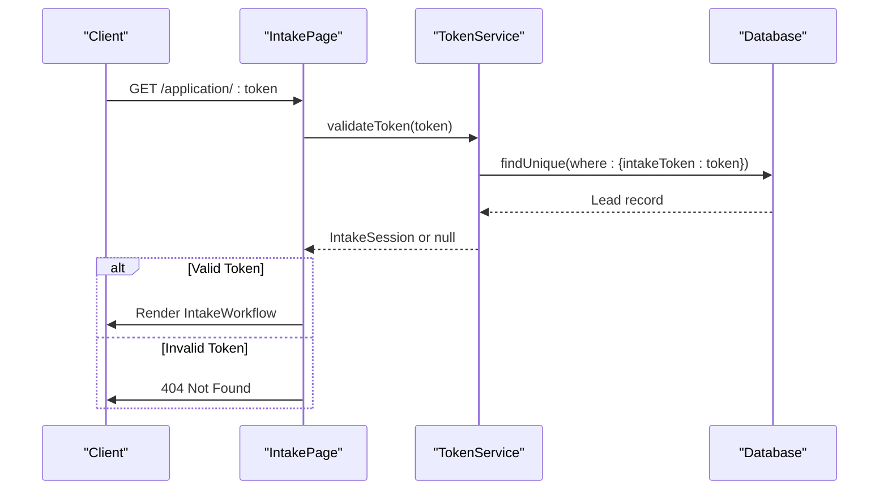
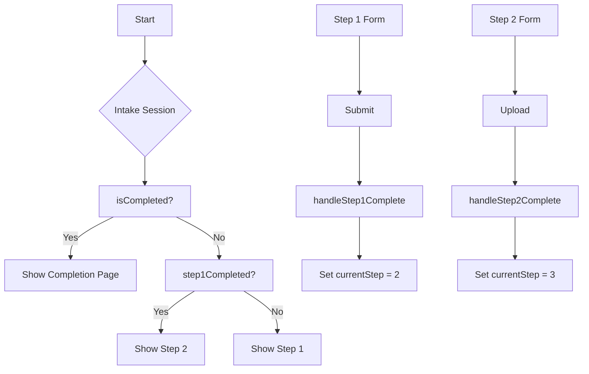
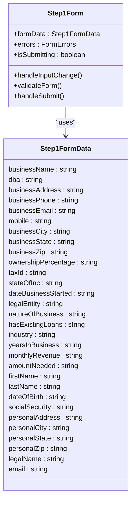
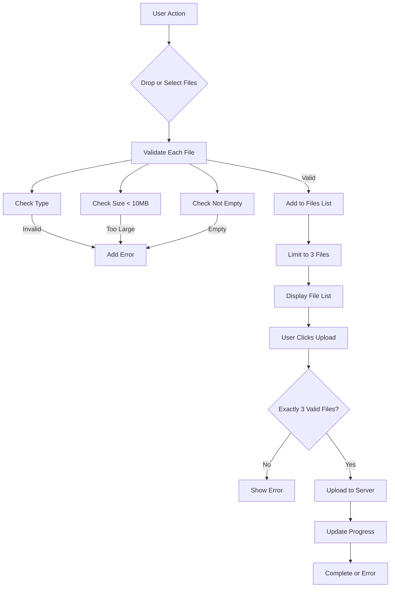
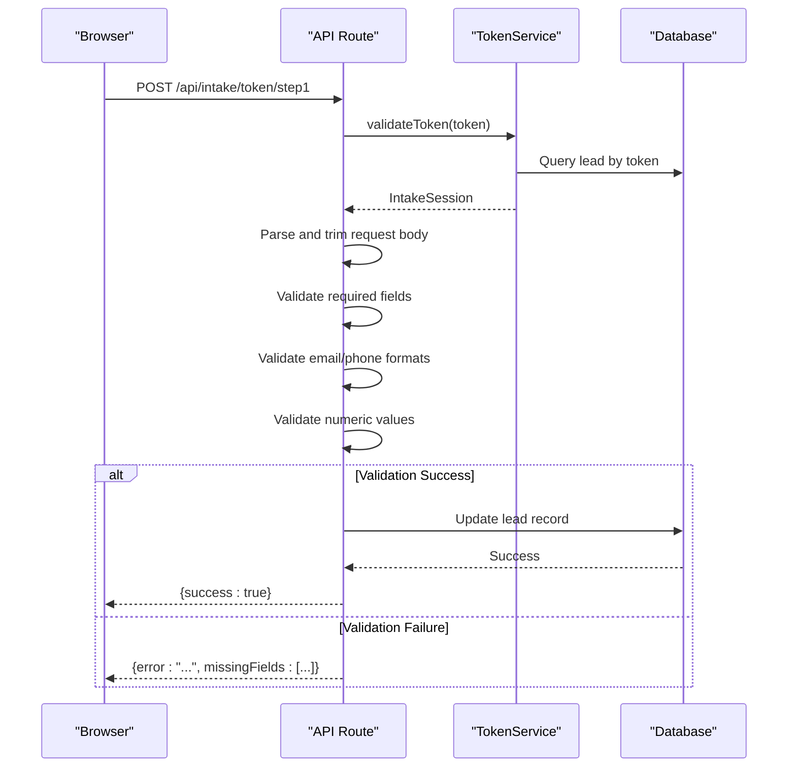

# Application Intake Page Implementation

<cite>
**Referenced Files in This Document**   
- [page.tsx](file://src/app/application/[token]/page.tsx)
- [TokenService.ts](file://src/services/TokenService.ts)
- [IntakeWorkflow.tsx](file://src/components/intake/IntakeWorkflow.tsx)
- [Step1Form.tsx](file://src/components/intake/Step1Form.tsx)
- [Step2Form.tsx](file://src/components/intake/Step2Form.tsx)
- [step1/route.ts](file://src/app/api/intake/[token]/step1/route.ts)
- [step2/route.ts](file://src/app/api/intake/[token]/step2/route.ts)
</cite>

## Table of Contents
1. [Introduction](#introduction)
2. [Token-Based Access Control](#token-based-access-control)
3. [Multi-Step Workflow Orchestration](#multi-step-workflow-orchestration)
4. [Step 1: Business and Personal Information](#step-1-business-and-personal-information)
5. [Step 2: Document Upload](#step-2-document-upload)
6. [API Integration and Data Persistence](#api-integration-and-data-persistence)
7. [Security Considerations](#security-considerations)
8. [Error Handling and Validation](#error-handling-and-validation)
9. [Conclusion](#conclusion)

## Introduction
The Application Intake Page Implementation provides a secure, two-step workflow for business funding applications. The system uses token-based authentication to ensure secure access and maintains applicant context throughout the process. The implementation features a progressive form experience with client-side state management, server-side validation, and file upload capabilities. This document details the architecture, components, and integration points that enable this functionality.

**Section sources**
- [page.tsx](file://src/app/application/[token]/page.tsx)

## Token-Based Access Control
The application implements token-based access control through the TokenService class, which validates URL tokens and retrieves applicant context. When a user accesses the intake page with a token parameter, the server-side `IntakePage` component calls `TokenService.validateToken()` to authenticate the request.

The validation process queries the database for a lead record matching the provided token. If found, it constructs an `IntakeSession` object containing the applicant's pre-filled data and workflow state. If the token is invalid or expired, the service returns null, triggering a 404 response via Next.js's `notFound()` function.

**Diagram sources**
- [page.tsx](file://src/app/application/[token]/page.tsx#L1-L50)
- [TokenService.ts](file://src/services/TokenService.ts#L56-L100)

**Section sources**
- [page.tsx](file://src/app/application/[token]/page.tsx#L1-L50)
- [TokenService.ts](file://src/services/TokenService.ts#L56-L100)

## Multi-Step Workflow Orchestration
The IntakeWorkflow component orchestrates the multi-step application process, managing navigation between steps and displaying progress indicators. It uses React's useState hook to track the current step based on the intake session state.

The workflow determines the initial step by evaluating the intake session:
- If intake is completed, show completion page (Step 3)
- If Step 1 is completed, start at Step 2
- Otherwise, start at Step 1

Navigation between steps is handled through callback functions passed to each step component. The progress indicator visually represents the current state of each step (completed, current, or upcoming).

**Diagram sources**
- [IntakeWorkflow.tsx](file://src/components/intake/IntakeWorkflow.tsx#L1-L50)

**Section sources**
- [IntakeWorkflow.tsx](file://src/components/intake/IntakeWorkflow.tsx#L1-L96)

## Step 1: Business and Personal Information
The Step1Form component collects comprehensive business and personal information through a structured form interface. It implements client-side state management using useState to maintain form data and validation errors.

The form is organized into three sections:
1. **Business Details**: Legal name, address, contact information, financial data
2. **Personal Details**: Applicant's personal information and contact details
3. **Legal Information**: Legal name and email for authorization

Form state is initialized with pre-filled values from the intake session, allowing applicants to resume incomplete applications. The component implements real-time validation feedback, clearing errors when users begin editing fields.

**Diagram sources**
- [Step1Form.tsx](file://src/components/intake/Step1Form.tsx#L1-L50)

**Section sources**
- [Step1Form.tsx](file://src/components/intake/Step1Form.tsx#L1-L399)

## Step 2: Document Upload
The Step2Form component handles document upload functionality with support for drag-and-drop, file selection, and upload progress visualization. It enforces validation rules to ensure data quality and system requirements.

Key features include:
- **File Validation**: Checks file type, size (max 10MB), and emptiness
- **Format Support**: Accepts PDF, JPG, PNG, and DOCX files only
- **Quantity Control**: Limits uploads to exactly 3 documents
- **Progress Feedback**: Visual progress indicators during upload
- **Error Handling**: Clear error messages for invalid files

The component maintains state for uploaded files, including progress tracking and error status. Users can remove files before upload, and the interface provides visual feedback on the upload readiness state.

**Diagram sources**
- [Step2Form.tsx](file://src/components/intake/Step2Form.tsx#L1-L50)

**Section sources**
- [Step2Form.tsx](file://src/components/intake/Step2Form.tsx#L1-L312)

## API Integration and Data Persistence
The application integrates with API routes to persist data across steps. Each step has a dedicated endpoint that validates input and updates the database.

For Step 1, the `/api/intake/[token]/step1` route performs comprehensive validation:
- **Field Validation**: Ensures all required fields are present
- **Format Validation**: Checks email and phone number formats
- **Value Validation**: Validates numeric ranges for ownership percentage and years in business
- **Data Cleaning**: Normalizes phone numbers and converts text to lowercase

The server-side validation mirrors client-side checks, providing defense-in-depth security. Upon successful validation, the route updates the lead record in the database and marks Step 1 as completed.

**Diagram sources**
- [step1/route.ts](file://src/app/api/intake/[token]/step1/route.ts#L1-L50)
- [step2/route.ts](file://src/app/api/intake/[token]/step2/route.ts#L1-L50)

**Section sources**
- [step1/route.ts](file://src/app/api/intake/[token]/step1/route.ts#L1-L304)

## Security Considerations
The implementation incorporates multiple security measures to protect applicant data and prevent abuse:

**Token Security**
- Tokens are generated using cryptographically secure random bytes (32 bytes hex)
- Invalid tokens return 404 responses without revealing token existence
- Completed intakes cannot be modified through the intake workflow

**Input Validation**
- Server-side validation duplicates client-side checks
- Email validation uses regex patterns to prevent injection
- Phone numbers are cleaned and normalized to prevent formatting attacks
- All string inputs are trimmed to prevent whitespace exploits

**Rate Limiting and Abuse Prevention**
- While not explicitly implemented in the analyzed code, the architecture supports rate limiting at the API route level
- File uploads are limited to 3 documents of 10MB each, preventing resource exhaustion
- The system could integrate with middleware for IP-based rate limiting

**Data Protection**
- Sensitive data (SSN, tax ID) is transmitted over HTTPS
- Email addresses are stored in lowercase for consistency
- Phone numbers are normalized to remove formatting characters

**Section sources**
- [TokenService.ts](file://src/services/TokenService.ts#L56-L100)
- [step1/route.ts](file://src/app/api/intake/[token]/step1/route.ts#L1-L304)

## Error Handling and Validation
The application implements comprehensive error handling at both client and server levels:

**Client-Side Validation**
- Real-time feedback when users interact with form fields
- Visual indicators for required fields
- Immediate error clearing when users begin correcting fields
- Form-level validation before submission

**Server-Side Validation**
- Comprehensive field presence checking with detailed missingFields response
- Format validation for emails and phone numbers
- Range validation for numeric inputs
- Structured error responses that client can interpret

**Error Recovery**
- Step 1 submissions preserve form data on validation failure
- File upload errors maintain the file list for correction
- Network errors trigger user-friendly alert messages
- Server errors include development-mode details for debugging

The error handling strategy ensures applicants can easily identify and correct issues while maintaining data integrity and security.

**Section sources**
- [Step1Form.tsx](file://src/components/intake/Step1Form.tsx#L1-L399)
- [step1/route.ts](file://src/app/api/intake/[token]/step1/route.ts#L1-L304)

## Conclusion
The Application Intake Page Implementation demonstrates a robust, secure approach to multi-step form processing. By combining token-based authentication, client-server validation, and progressive disclosure, the system provides a seamless user experience while maintaining data integrity and security. The modular architecture separates concerns effectively, with clear responsibilities for token management, workflow orchestration, form handling, and API integration. This design enables reliable data collection for business funding applications while protecting applicant information through multiple layers of security controls.