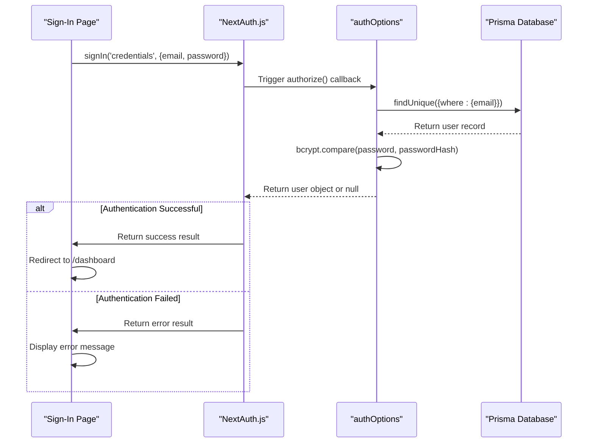
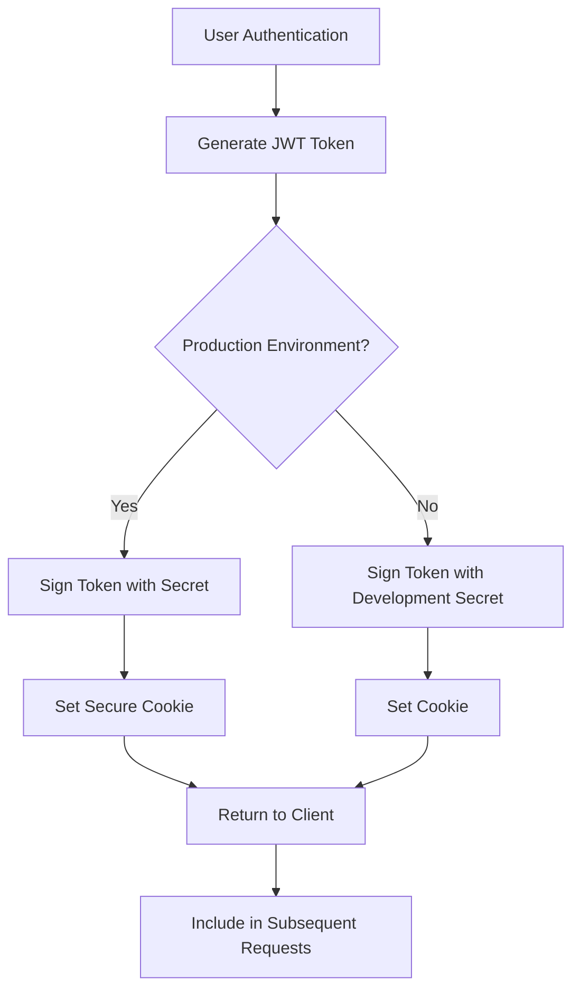

# Authentication Sign-In Implementation

<cite>
**Referenced Files in This Document**   
- [src/app/auth/signin/page.tsx](file://src/app/auth/signin/page.tsx)
- [src/app/api/auth/[...nextauth]/route.ts](file://src/app/api/auth/[...nextauth]/route.ts)
- [src/lib/auth.ts](file://src/lib/auth.ts)
- [src/middleware.ts](file://src/middleware.ts)
- [src/lib/password.ts](file://src/lib/password.ts)
- [next.config.mjs](file://next.config.mjs)
- [src/components/auth/SessionProvider.tsx](file://src/components/auth/SessionProvider.tsx)
</cite>

## Table of Contents
1. [Authentication Sign-In Implementation](#authentication-sign-in-implementation)
2. [Sign-In Page UI and Form Handling](#sign-in-page-ui-and-form-handling)
3. [NextAuth.js Integration and Configuration](#nextauthjs-integration-and-configuration)
4. [Authentication Flows](#authentication-flows)
5. [Security Considerations](#security-considerations)
6. [Error Handling and User Feedback](#error-handling-and-user-feedback)
7. [Session Management and Protection](#session-management-and-protection)
8. [Common Issues and Troubleshooting](#common-issues-and-troubleshooting)

## Sign-In Page UI and Form Handling

The sign-in page provides a clean, user-friendly interface for staff members to authenticate to the Fund Track Staff Portal. The implementation uses React's useState hook to manage form state and validation, with a focus on accessibility and user experience.

The form collects email and password credentials with client-side validation for required fields and email format. Upon submission, the form prevents default behavior and initiates the authentication process through NextAuth.js. The UI provides visual feedback during loading states and displays error messages when authentication fails.

```tsx
export default function SignInPage() {
  const [email, setEmail] = useState("")
  const [password, setPassword] = useState("")
  const [error, setError] = useState("")
  const [isLoading, setIsLoading] = useState(false)
  const router = useRouter()

  const handleSubmit = async (e: React.FormEvent) => {
    e.preventDefault()
    setError("")
    setIsLoading(true)

    // Basic validation
    if (!email || !password) {
      setError("Please fill in all fields")
      setIsLoading(false)
      return
    }

    if (!email.includes("@")) {
      setError("Please enter a valid email address")
      setIsLoading(false)
      return
    }

    try {
      const result = await signIn("credentials", {
        email,
        password,
        redirect: false,
      })

      if (result?.error) {
        setError("Invalid email or password")
      } else {
        // Redirect to dashboard after successful login
        router.push("/dashboard")
      }
    } catch (error) {
      setError("An error occurred. Please try again.")
    } finally {
      setIsLoading(false)
    }
  }
}
```

The page displays error messages in a dedicated alert area with appropriate styling to ensure visibility. The form is disabled during submission to prevent multiple concurrent requests, and loading state is indicated with a "Signing in..." message on the submit button.

**Section sources**
- [src/app/auth/signin/page.tsx](file://src/app/auth/signin/page.tsx#L1-L120)

## NextAuth.js Integration and Configuration

The authentication system is built on NextAuth.js, integrated through the [...nextauth] API route and configured in the authOptions object within lib/auth.ts. This configuration defines the authentication providers, session strategy, and callbacks for token and session management.

The [...nextauth]/route.ts file serves as the entry point for all NextAuth.js operations, exporting both GET and POST handlers for authentication requests:

```ts
import NextAuth from "next-auth"
import { authOptions } from "@/lib/auth"

const handler = NextAuth(authOptions)

export { handler as GET, handler as POST }
```

The core authentication configuration is defined in src/lib/auth.ts, which exports the authOptions object. This configuration uses the Prisma adapter to connect with the application's database and defines a credentials provider for email/password authentication.

```ts
export const authOptions: NextAuthOptions = {
  adapter: PrismaAdapter(prisma),
  providers: [
    CredentialsProvider({
      name: "credentials",
      credentials: {
        email: { label: "Email", type: "email" },
        password: { label: "Password", type: "password" }
      },
      async authorize(credentials) {
        if (!credentials?.email || !credentials?.password) {
          return null
        }

        const user = await prisma.user.findUnique({
          where: {
            email: credentials.email
          }
        })

        if (!user) {
          return null
        }

        const isPasswordValid = await bcrypt.compare(
          credentials.password,
          user.passwordHash
        )

        if (!isPasswordValid) {
          return null
        }

        return {
          id: user.id.toString(),
          email: user.email,
          role: user.role,
        }
      }
    })
  ],
  session: {
    strategy: "jwt",
  },
  callbacks: {
    async jwt({ token, user }) {
      if (user) {
        token.id = user.id
        token.role = user.role
      }
      return token
    },
    async session({ session, token }) {
      if (token) {
        session.user.id = token.id as string
        session.user.role = token.role as UserRole
      }
      return session
    },
  },
  pages: {
    signIn: "/auth/signin",
  },
}
```

The configuration specifies JWT-based session management, which stores session data in an encrypted JWT token rather than server-side storage. This approach improves scalability and reduces database load. The callbacks extend the default session and JWT tokens with custom user data, including the user ID and role, which are used for authorization throughout the application.

**Section sources**
- [src/app/api/auth/[...nextauth]/route.ts](file://src/app/api/auth/[...nextauth]/route.ts#L1-L6)
- [src/lib/auth.ts](file://src/lib/auth.ts#L7-L70)

## Authentication Flows

The system supports credential-based authentication through the credentials provider configured in NextAuth.js. When a user submits their email and password on the sign-in page, the following flow occurs:



**Diagram sources**
- [src/app/auth/signin/page.tsx](file://src/app/auth/signin/page.tsx#L1-L120)
- [src/lib/auth.ts](file://src/lib/auth.ts#L7-L70)

Currently, the system only supports credential-based authentication. Although NextAuth.js has built-in support for OAuth providers like Google, GitHub, and others, the current configuration only includes the CredentialsProvider. The package-lock.json file indicates that openid-client is included as a dependency, suggesting that OAuth support could be implemented in the future, but no OAuth providers are currently configured in the authOptions.

The authentication flow begins when the user submits the sign-in form. The handleSubmit function calls signIn("credentials") with the provided email and password. NextAuth.js invokes the authorize callback defined in the credentials provider, which queries the database for a user with the matching email and verifies the password using bcrypt comparison.

Upon successful authentication, NextAuth.js creates a JWT session token and returns a success result to the client, which then redirects the user to the dashboard. If authentication fails, either due to invalid credentials or other errors, the client displays an appropriate error message.

## Security Considerations

The authentication system implements multiple security measures to protect user credentials and prevent common attacks.

### Password Hashing and Storage

Passwords are securely hashed using bcrypt with 12 salt rounds before storage in the database. The system uses a dedicated password utility module that abstracts the hashing and verification logic:

```ts
import bcrypt from "bcrypt"

const SALT_ROUNDS = 12

export async function hashPassword(password: string): Promise<string> {
  return bcrypt.hash(password, SALT_ROUNDS)
}

export async function verifyPassword(password: string, hashedPassword: string): Promise<boolean> {
  return bcrypt.compare(password, hashedPassword)
}
```

This implementation ensures that plain text passwords are never stored in the database. The SALT_ROUNDS value of 12 provides a good balance between security and performance, making brute force attacks computationally expensive.

### CSRF Protection

NextAuth.js provides built-in CSRF protection for all authentication operations. When using the signIn function with redirect: false, NextAuth.js automatically includes CSRF token validation in the authentication flow. The JWT session tokens also include anti-CSRF measures to prevent cross-site request forgery attacks.

### Secure Session Management

The system uses JWT-based session management with several security enhancements:

1. **Secure Cookies**: In production, cookies are marked as Secure and SameSite=Strict to prevent transmission over insecure connections and mitigate CSRF attacks.

2. **HTTPS Enforcement**: The application enforces HTTPS in production through both Next.js headers configuration and middleware redirects.

3. **Token Signing**: JWT tokens are signed using a secret key (NEXTAUTH_SECRET) to prevent tampering.



**Diagram sources**
- [src/lib/auth.ts](file://src/lib/auth.ts#L7-L70)
- [next.config.mjs](file://next.config.mjs#L45-L80)
- [src/middleware.ts](file://src/middleware.ts#L47-L85)

### Security Headers

The application implements comprehensive security headers through both Next.js configuration and middleware:

```ts
async headers() {
  return [
    {
      source: "/(.*)",
      headers: [
        { key: "X-DNS-Prefetch-Control", value: "on" },
        { key: "Strict-Transport-Security", value: "max-age=63072000; includeSubDomains; preload" },
        { key: "X-XSS-Protection", value: "1; mode=block" },
        { key: "X-Frame-Options", value: "DENY" },
        { key: "X-Content-Type-Options", value: "nosniff" },
        { key: "Referrer-Policy", value: "origin-when-cross-origin" },
        { key: "Content-Security-Policy", value: [
          "default-src 'self'",
          "script-src 'self' 'unsafe-eval' 'unsafe-inline'",
          "style-src 'self' 'unsafe-inline'",
          "img-src 'self' data: https:",
          "font-src 'self'",
          "connect-src 'self' https://*.backblazeb2.com",
          "object-src 'none'",
          "base-uri 'self'",
          "form-action 'self'",
          "frame-ancestors 'none'",
          "upgrade-insecure-requests",
        ].join("; ") },
      ],
    },
  ];
}
```

These headers protect against various attacks including XSS, clickjacking, MIME type sniffing, and protocol downgrade attacks.

**Section sources**
- [src/lib/password.ts](file://src/lib/password.ts#L1-L10)
- [next.config.mjs](file://next.config.mjs#L45-L80)
- [src/middleware.ts](file://src/middleware.ts#L47-L85)

## Error Handling and User Feedback

The authentication system implements comprehensive error handling to provide clear feedback to users while maintaining security.

### Client-Side Error Handling

The sign-in page handles errors through a dedicated error state variable that displays messages to users:

```tsx
{error && (
  <div className="rounded-md bg-red-50 p-4">
    <div className="text-sm text-red-700">{error}</div>
  </div>
)}
```

The form performs client-side validation for required fields and email format, providing immediate feedback without requiring a server round-trip. Server-side authentication errors are handled in the try-catch block of the handleSubmit function, with specific error messages for invalid credentials and generic messages for other errors to avoid information disclosure.

### Server-Side Error Handling

The system uses a standardized error handling approach defined in src/lib/errors.ts, which includes specific error classes for authentication-related issues:

```ts
export class AuthenticationError extends AppError {
  readonly statusCode = 401;
  readonly code = 'AUTHENTICATION_ERROR';
  readonly isOperational = true;

  constructor(message: string = 'Authentication required', context?: Record<string, any>) {
    super(message, context);
  }
}
```

Although the current sign-in implementation doesn't directly use these error classes, they provide a consistent framework for error handling throughout the application.

The API routes implement proper HTTP status codes for different error conditions:
- 400 Bad Request for missing or invalid input
- 401 Unauthorized for authentication failures
- 500 Internal Server Error for unexpected server issues

**Section sources**
- [src/app/auth/signin/page.tsx](file://src/app/auth/signin/page.tsx#L1-L120)
- [src/lib/errors.ts](file://src/lib/errors.ts#L44-L47)

## Session Management and Protection

The application implements robust session management through a combination of NextAuth.js, middleware, and custom components.

### Session Provider

The application wraps its content with a SessionProvider component that enables client-side session handling:

```tsx
"use client"

import { SessionProvider as NextAuthSessionProvider } from "next-auth/react"
import { ReactNode } from "react"

interface SessionProviderProps {
  children: ReactNode
}

export function SessionProvider({ children }: SessionProviderProps) {
  return (
    <NextAuthSessionProvider>
      {children}
    </NextAuthSessionProvider>
  )
}
```

This provider makes the current session available to all components through the useSession hook from next-auth/react, enabling client-side access to session data without requiring additional API calls.

### Route Protection

The application uses Next.js middleware to protect routes that require authentication. The middleware checks for a valid session token and redirects unauthenticated users to the sign-in page:

```ts
// Protect dashboard and API routes (except auth routes)
if (pathname.startsWith("/dashboard") || 
    (pathname.startsWith("/api") && !pathname.startsWith("/api/auth"))) {
  
  if (!token) {
    return NextResponse.redirect(new URL("/auth/signin", req.url));
  }

  // Admin-only routes (if needed in the future)
  if (pathname.startsWith("/admin") && token.role !== "ADMIN") {
    return NextResponse.redirect(new URL("/dashboard", req.url));
  }
}
```

This approach ensures that protected routes cannot be accessed without a valid session, providing a first line of defense against unauthorized access.

### Session Data

The session contains essential user information extended through NextAuth.js callbacks:

```ts
callbacks: {
  async jwt({ token, user }) {
    if (user) {
      token.id = user.id
      token.role = user.role
    }
    return token
  },
  async session({ session, token }) {
    if (token) {
      session.user.id = token.id as string
      session.user.role = token.role as UserRole
    }
    return session
  },
}
```

By including the user ID and role in the session, the application can implement role-based access control throughout the system without requiring additional database queries.

**Section sources**
- [src/components/auth/SessionProvider.tsx](file://src/components/auth/SessionProvider.tsx#L1-L15)
- [src/middleware.ts](file://src/middleware.ts#L128-L162)
- [src/lib/auth.ts](file://src/lib/auth.ts#L7-L70)

## Common Issues and Troubleshooting

### Provider Misconfiguration

One potential issue is provider misconfiguration, particularly if OAuth providers are added in the future. The current implementation only includes the credentials provider, but if additional providers are configured, common issues include:

- Incorrect environment variables for provider credentials
- Misconfigured callback URLs
- Missing provider-specific configuration options

To avoid these issues, ensure that all provider configuration is complete and that environment variables are properly set in all deployment environments.

### Session Persistence Problems

Session persistence issues can occur due to several factors:

1. **Missing NEXTAUTH_SECRET**: The JWT tokens require a secret key for signing. In production, this must be a long, random string set in environment variables.

2. **Cookie Configuration**: In production, ensure that SECURE_COOKIES and FORCE_HTTPS environment variables are set to 'true' to enable secure cookie settings.

3. **Clock Drift**: JWT tokens have an expiration time. Significant clock differences between servers can cause session validation failures.

### Authentication Flow Issues

Common authentication flow issues include:

- **Redirect Loops**: Ensure that the signIn page is properly excluded from route protection in middleware.
- **CORS Issues**: When making API calls from the client, ensure proper CORS configuration.
- **CSRF Token Errors**: These typically indicate issues with the NextAuth.js configuration or deployment environment.

### Debugging Tips

1. Check the browser developer tools for network requests and responses during the authentication process.
2. Verify that NEXTAUTH_URL is correctly set in environment variables.
3. Ensure that the database connection is working and user records exist with properly hashed passwords.
4. Check server logs for authentication-related errors.

The current implementation is robust and follows security best practices, but monitoring authentication success/failure rates and reviewing security headers in production can help identify and resolve issues proactively.

**Section sources**
- [src/lib/auth.ts](file://src/lib/auth.ts#L7-L70)
- [next.config.mjs](file://next.config.mjs#L1-L109)
- [src/middleware.ts](file://src/middleware.ts#L1-L162)