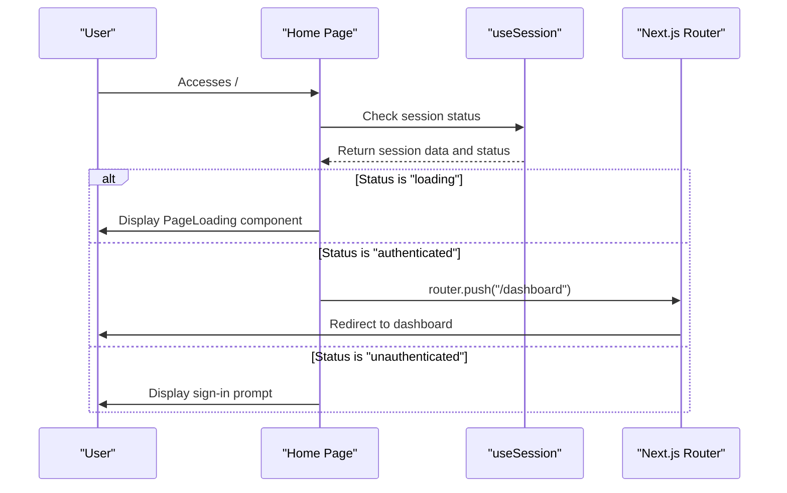
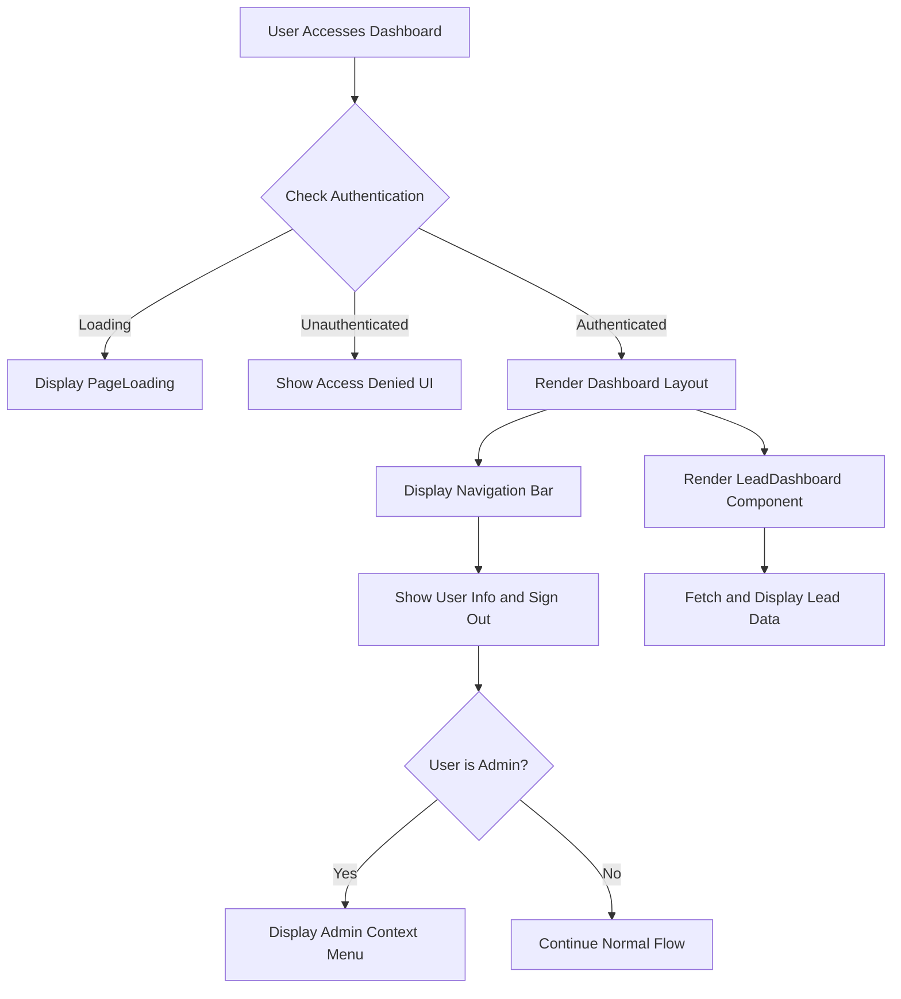
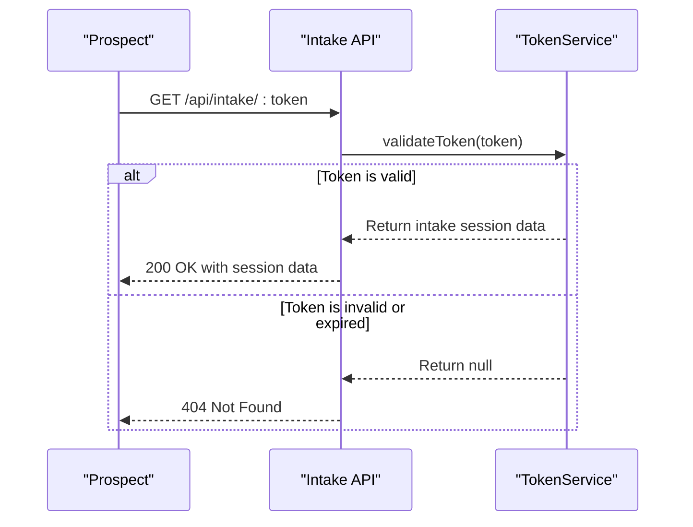
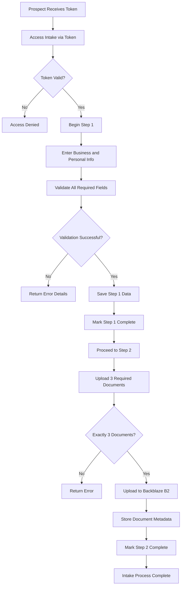
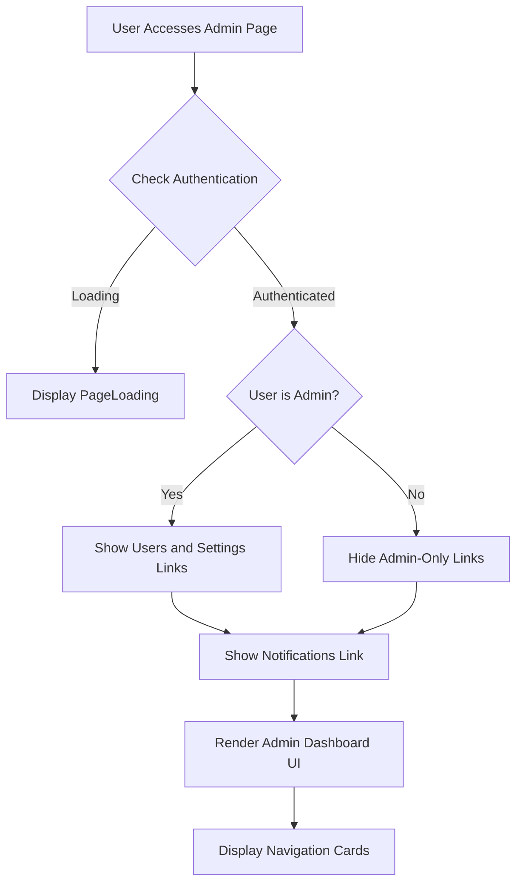
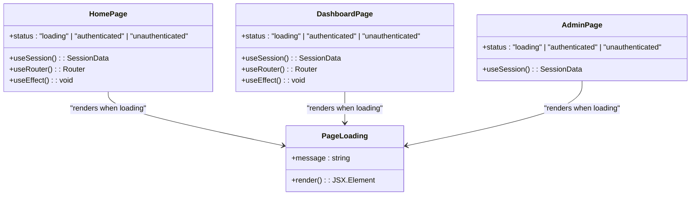
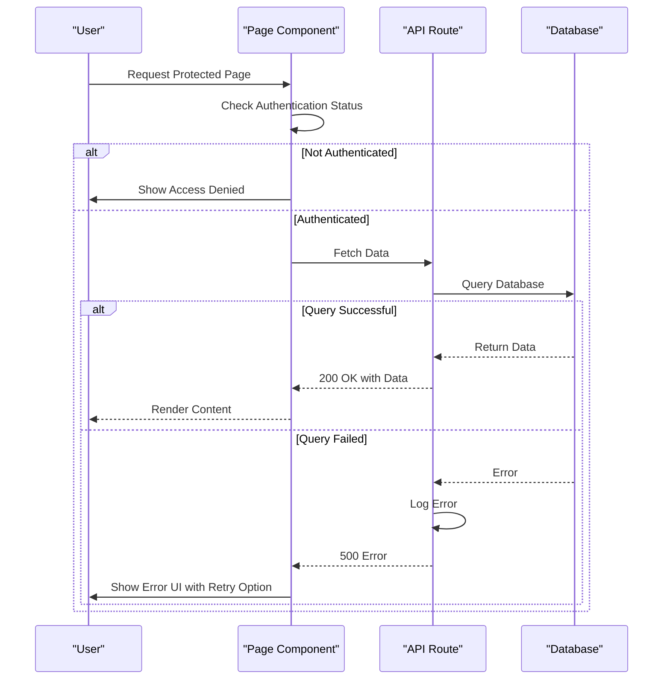

# Core Page Implementations

<cite>
**Referenced Files in This Document**   
- [page.tsx](file://src/app/page.tsx)
- [dashboard/page.tsx](file://src/app/dashboard/page.tsx)
- [admin/page.tsx](file://src/app/admin/page.tsx)
- [PageLoading.tsx](file://src/components/PageLoading.tsx)
- [LeadDashboard.tsx](file://src/components/dashboard/LeadDashboard.tsx)
- [LeadList.tsx](file://src/components/dashboard/LeadList.tsx)
- [api/intake/[token]/route.ts](file://src/app/api/intake/[token]/route.ts)
- [api/intake/[token]/step1/route.ts](file://src/app/api/intake/[token]/step1/route.ts)
- [api/intake/[token]/step2/route.ts](file://src/app/api/intake/[token]/step2/route.ts)
- [api/intake/[token]/save/route.ts](file://src/app/api/intake/[token]/save/route.ts)
</cite>

## Table of Contents
1. [Home Page Implementation](#home-page-implementation)
2. [Dashboard Page Implementation](#dashboard-page-implementation)
3. [Application Intake Workflow](#application-intake-workflow)
4. [Admin Page Implementation](#admin-page-implementation)
5. [Loading State Management](#loading-state-management)
6. [Error Handling and Boundaries](#error-handling-and-boundaries)

## Home Page Implementation

The home page (`/src/app/page.tsx`) serves as the primary entry point for the fund-track application. It implements a client-side authentication check using NextAuth's `useSession` hook to determine user authentication status and redirect accordingly.

When a user accesses the home page, the component checks the session status:
- If the user is authenticated, they are automatically redirected to the `/dashboard` route
- If the session is still loading, a loading spinner is displayed
- If unauthenticated, the user sees a welcome screen with a sign-in option

This implementation ensures that authenticated users are immediately directed to the appropriate application section without requiring manual navigation.

**Diagram sources**
- [page.tsx](file://src/app/page.tsx#L1-L53)

**Section sources**
- [page.tsx](file://src/app/page.tsx#L1-L53)

## Dashboard Page Implementation

The dashboard page (`/src/app/dashboard/page.tsx`) serves as the main interface for authenticated users, providing access to lead management functionality. It implements comprehensive authentication protection and integrates multiple components to deliver a cohesive user experience.

Key implementation features:
- Uses `useSession` to check authentication status
- Implements `AuthenticatedOnly` component as a higher-order wrapper
- Displays a contextual menu for admin users with access to administrative functions
- Integrates the `LeadDashboard` component for lead data visualization
- Handles unauthenticated access with appropriate fallback UI

The page also implements proper navigation controls, displaying the user's email and role, and providing a sign-out functionality that redirects back to the sign-in page.

**Diagram sources**
- [dashboard/page.tsx](file://src/app/dashboard/page.tsx#L1-L151)

**Section sources**
- [dashboard/page.tsx](file://src/app/dashboard/page.tsx#L1-L151)
- [components/auth/RoleGuard.tsx](file://src/components/auth/RoleGuard.tsx)
- [components/dashboard/LeadDashboard.tsx](file://src/components/dashboard/LeadDashboard.tsx)

## Application Intake Workflow

The application intake workflow is a multi-step process that allows prospects to complete their application through a token-based authentication system. The workflow is orchestrated through API routes in the `/api/intake/[token]` directory.

### Token Validation and Initial Access

The GET request to `/api/intake/[token]` validates the provided token using the `TokenService`. This service checks if the token is valid and not expired, returning the associated intake session data if successful. This endpoint serves as the entry point for the intake process, ensuring that only authorized users with valid tokens can access the application.

**Diagram sources**
- [api/intake/[token]/route.ts](file://src/app/api/intake/[token]/route.ts#L1-L38)

### Multi-Step Process Orchestration

The intake process is divided into two main steps, each handled by dedicated API endpoints:

1. **Step 1 (Business and Personal Information)**: The POST request to `/api/intake/[token]/step1` processes the first set of application data, including business details, personal information, and legal information. The endpoint performs comprehensive validation of all required fields, email formats, phone numbers, and numerical values before updating the lead record in the database.

2. **Step 2 (Document Upload)**: The POST request to `/api/intake/[token]/step2` handles document uploads. It validates that exactly three documents are provided, uploads them to Backblaze B2 storage via the `FileUploadService`, and stores metadata in the database. This step also updates the intake session to mark step 2 as completed.

Additionally, a save endpoint (`/api/intake/[token]/save`) allows users to save their progress during step 1, enabling them to resume the application later.

**Diagram sources**
- [api/intake/[token]/step1/route.ts](file://src/app/api/intake/[token]/step1/route.ts#L1-L304)
- [api/intake/[token]/step2/route.ts](file://src/app/api/intake/[token]/step2/route.ts#L1-L152)
- [api/intake/[token]/save/route.ts](file://src/app/api/intake/[token]/save/route.ts#L1-L130)

**Section sources**
- [api/intake/[token]/route.ts](file://src/app/api/intake/[token]/route.ts#L1-L38)
- [api/intake/[token]/step1/route.ts](file://src/app/api/intake/[token]/step1/route.ts#L1-L304)
- [api/intake/[token]/step2/route.ts](file://src/app/api/intake/[token]/step2/route.ts#L1-L152)
- [api/intake/[token]/save/route.ts](file://src/app/api/intake/[token]/save/route.ts#L1-L130)
- [services/TokenService.ts](file://src/services/TokenService.ts)
- [services/FileUploadService.ts](file://src/services/FileUploadService.ts)

## Admin Page Implementation

The admin page (`/src/app/admin/page.tsx`) functions as a navigation hub for administrative functions within the application. It provides conditional access to various administrative tools based on the user's role.

Key features of the admin page:
- Role-based access control using the `UserRole.ADMIN` enum
- Conditional rendering of admin links based on user permissions
- Clean, organized interface with card-based navigation
- Breadcrumb navigation for improved user orientation

The page displays different options depending on the user's role:
- Admin users see links to "Users" and "Settings" management
- All authenticated users can access the "Notifications" section
- Unauthorized users are prevented from seeing admin links entirely

This implementation follows the principle of least privilege, ensuring that users only see functionality they are authorized to access.

**Diagram sources**
- [admin/page.tsx](file://src/app/admin/page.tsx#L1-L111)

**Section sources**
- [admin/page.tsx](file://src/app/admin/page.tsx#L1-L111)
- [@prisma/client](file://node_modules/@prisma/client/index.d.ts)

## Loading State Management

Loading state management is implemented consistently across the application using the `PageLoading` component (`/src/components/PageLoading.tsx`). This reusable component provides visual feedback during data loading operations and ensures a smooth user experience.

The `PageLoading` component features:
- A spinning animation using CSS animation
- Optional message display for context-specific loading states
- Centered positioning in a full-height container
- Responsive design that works across device sizes

Pages implement loading states by checking the `status` from `useSession()` and rendering the `PageLoading` component when the status is "loading". This pattern is used on the home page, dashboard page, and admin page to provide consistent loading feedback.

**Diagram sources**
- [PageLoading.tsx](file://src/components/PageLoading.tsx#L1-L19)
- [page.tsx](file://src/app/page.tsx#L1-L53)
- [dashboard/page.tsx](file://src/app/dashboard/page.tsx#L1-L151)
- [admin/page.tsx](file://src/app/admin/page.tsx#L1-L111)

**Section sources**
- [PageLoading.tsx](file://src/components/PageLoading.tsx#L1-L19)

## Error Handling and Boundaries

The application implements robust error handling at multiple levels to ensure reliability and provide meaningful feedback to users.

### Client-Side Error Handling

The dashboard page includes explicit error handling within the `LeadDashboard` component. When data fetching fails, the component displays an error message with a "Try again" button that allows users to retry the request without refreshing the page. This improves user experience by providing recovery options for transient errors.

### Server-Side Error Handling

API routes implement comprehensive error handling with:
- Try-catch blocks to capture exceptions
- Detailed error logging using the application logger
- Appropriate HTTP status codes for different error types
- User-friendly error messages that don't expose sensitive information

The intake API routes demonstrate sophisticated error handling, returning specific validation errors for missing fields, invalid formats, and business logic constraints (such as requiring exactly three documents in step 2).

### Authentication Boundaries

The application uses role-based guards to protect routes:
- The `AuthenticatedOnly` component wraps the dashboard content
- The admin page conditionally renders links based on user role
- API routes validate tokens before processing requests

These boundaries ensure that users cannot access functionality they are not authorized to use, with clear feedback when access is denied.

**Diagram sources**
- [dashboard/page.tsx](file://src/app/dashboard/page.tsx#L1-L151)
- [components/dashboard/LeadDashboard.tsx](file://src/components/dashboard/LeadDashboard.tsx#L1-L216)
- [api/intake/[token]/step1/route.ts](file://src/app/api/intake/[token]/step1/route.ts#L1-L304)
- [api/intake/[token]/step2/route.ts](file://src/app/api/intake/[token]/step2/route.ts#L1-L152)
- [lib/logger.ts](file://src/lib/logger.ts)

**Section sources**
- [components/dashboard/LeadDashboard.tsx](file://src/components/dashboard/LeadDashboard.tsx#L1-L216)
- [api/intake/[token]/step1/route.ts](file://src/app/api/intake/[token]/step1/route.ts#L1-L304)
- [api/intake/[token]/step2/route.ts](file://src/app/api/intake/[token]/step2/route.ts#L1-L152)
- [lib/logger.ts](file://src/lib/logger.ts)
- [components/auth/RoleGuard.tsx](file://src/components/auth/RoleGuard.tsx)