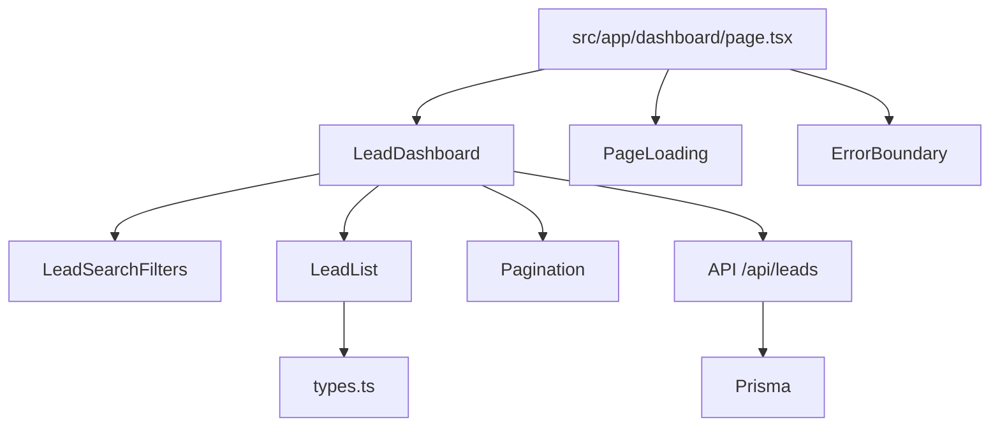
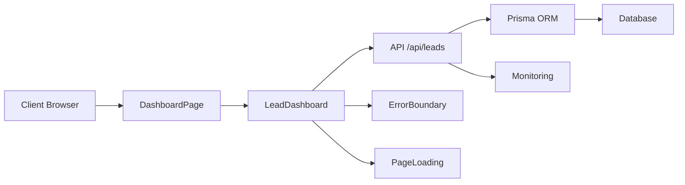
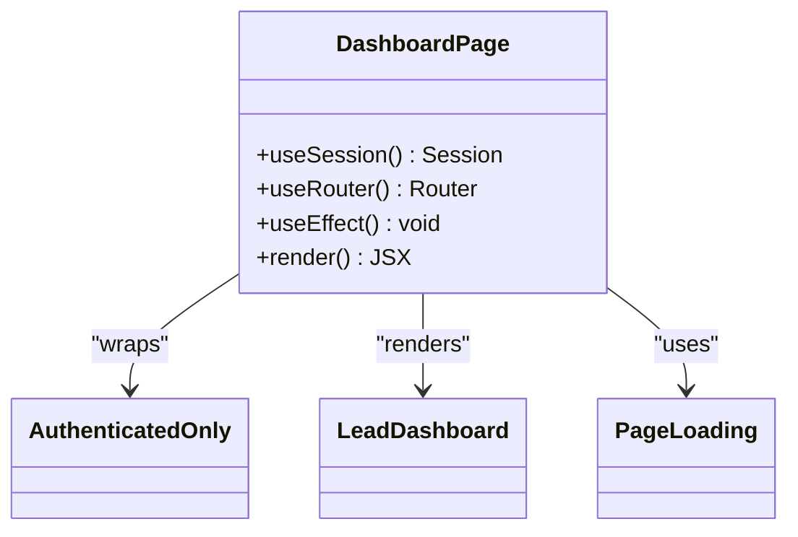
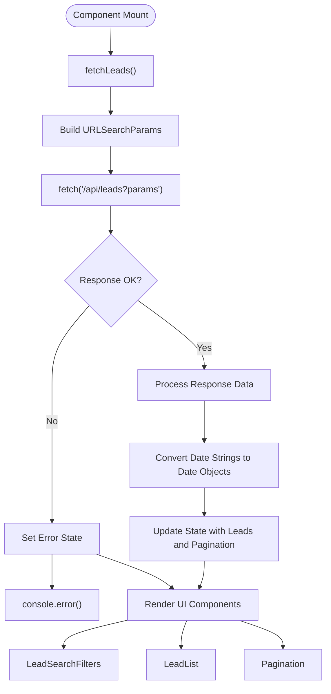
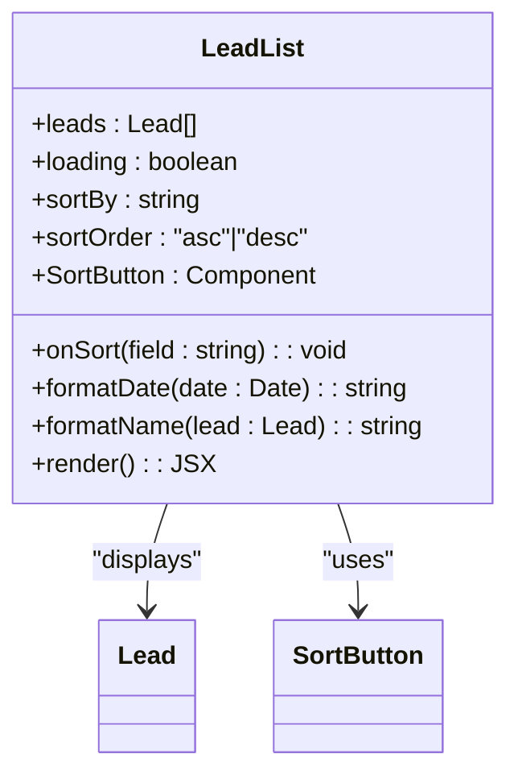
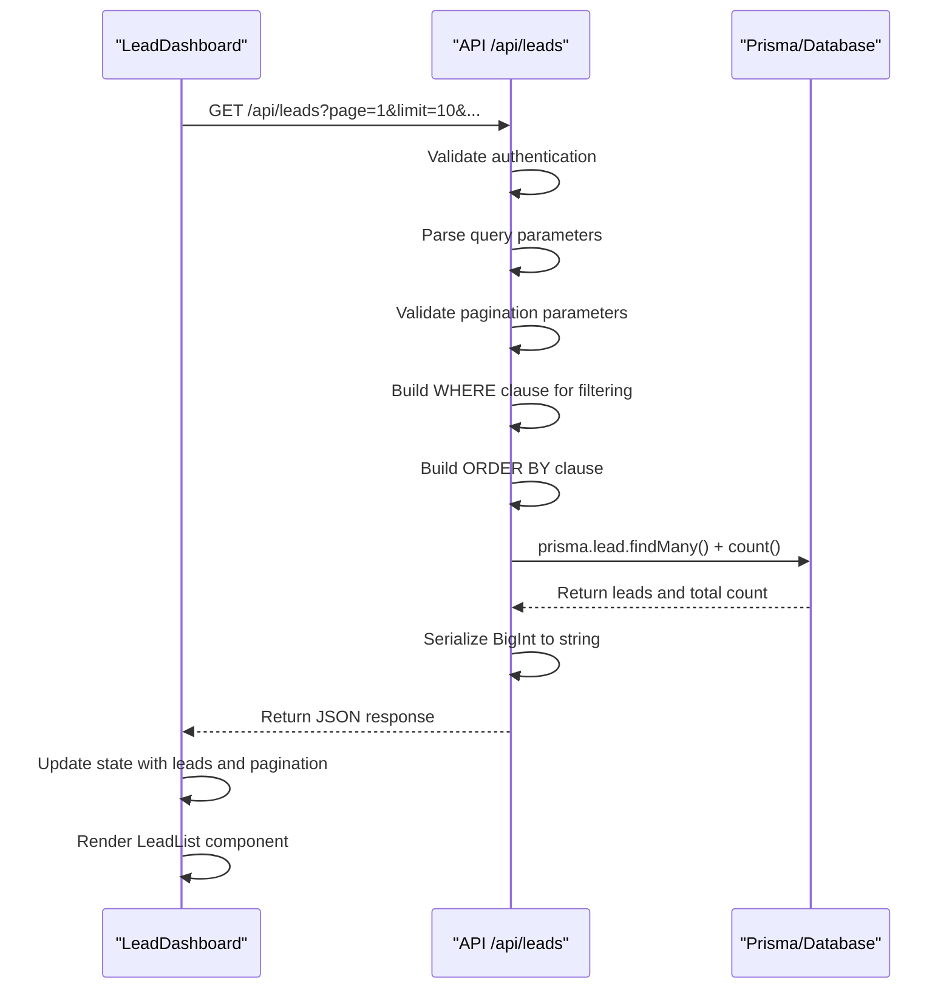
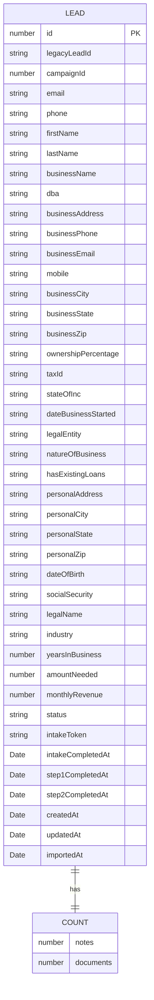
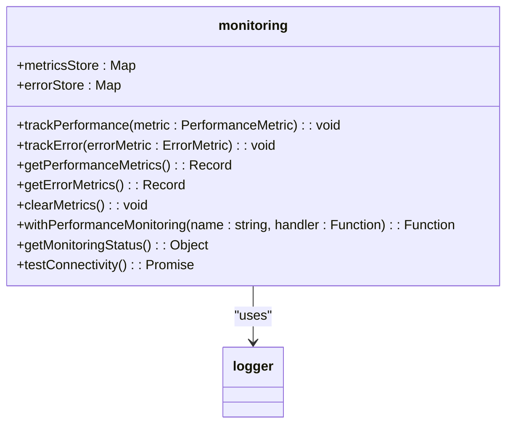
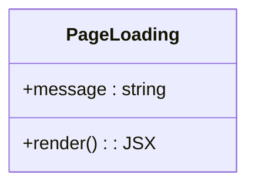

# Dashboard Page Implementation

<cite>
**Referenced Files in This Document**   
- [src/app/dashboard/page.tsx](file://src/app/dashboard/page.tsx)
- [src/components/dashboard/LeadDashboard.tsx](file://src/components/dashboard/LeadDashboard.tsx)
- [src/components/dashboard/LeadList.tsx](file://src/components/dashboard/LeadList.tsx)
- [src/components/dashboard/types.ts](file://src/components/dashboard/types.ts)
- [src/components/PageLoading.tsx](file://src/components/PageLoading.tsx)
- [src/components/ErrorBoundary.tsx](file://src/components/ErrorBoundary.tsx)
- [src/app/api/leads/route.ts](file://src/app/api/leads/route.ts)
- [src/lib/monitoring.ts](file://src/lib/monitoring.ts)
</cite>

## Table of Contents
1. [Introduction](#introduction)
2. [Project Structure](#project-structure)
3. [Core Components](#core-components)
4. [Architecture Overview](#architecture-overview)
5. [Detailed Component Analysis](#detailed-component-analysis)
6. [Data Flow and API Integration](#data-flow-and-api-integration)
7. [Performance and Monitoring](#performance-and-monitoring)
8. [Error Handling and User Experience](#error-handling-and-user-experience)
9. [Conclusion](#conclusion)

## Introduction
The Dashboard Page serves as the central hub for staff users in the FUND TRACK application, providing comprehensive lead management capabilities. This document details the implementation of the dashboard, focusing on its data fetching patterns from the `/api/leads` endpoint, integration with key components like `LeadList` and `LeadDashboard`, and mechanisms for maintaining data freshness. The analysis covers loading states, error boundaries, filtering, pagination, search functionality, and performance considerations for handling large datasets. The dashboard is designed to provide a responsive and intuitive interface for managing merchant funding leads, with robust error handling and monitoring capabilities.

## Project Structure
The dashboard implementation follows a component-based architecture within the Next.js application structure. The main dashboard page is located at `src/app/dashboard/page.tsx` and serves as the entry point. It integrates with several components in the `src/components/dashboard/` directory, including `LeadDashboard.tsx`, `LeadList.tsx`, `LeadSearchFilters.tsx`, and `Pagination.tsx`. The data model is defined in `types.ts`, while API interactions are handled through the `/api/leads/route.ts` endpoint. Loading and error states are managed by dedicated components in the root components directory.



**Diagram sources**
- [src/app/dashboard/page.tsx](file://src/app/dashboard/page.tsx)
- [src/components/dashboard/LeadDashboard.tsx](file://src/components/dashboard/LeadDashboard.tsx)
- [src/components/dashboard/LeadList.tsx](file://src/components/dashboard/LeadList.tsx)
- [src/app/api/leads/route.ts](file://src/app/api/leads/route.ts)

**Section sources**
- [src/app/dashboard/page.tsx](file://src/app/dashboard/page.tsx)
- [src/components/dashboard/LeadDashboard.tsx](file://src/components/dashboard/LeadDashboard.tsx)

## Core Components
The dashboard implementation consists of several core components that work together to provide a comprehensive lead management interface. The `DashboardPage` component serves as the container, handling authentication and rendering the main layout. The `LeadDashboard` component orchestrates data fetching and state management, while `LeadList` handles the display of lead data in multiple responsive layouts. The `PageLoading` component provides visual feedback during data loading, and `ErrorBoundary` components handle unexpected errors gracefully.

**Section sources**
- [src/app/dashboard/page.tsx](file://src/app/dashboard/page.tsx#L1-L150)
- [src/components/dashboard/LeadDashboard.tsx](file://src/components/dashboard/LeadDashboard.tsx#L1-L215)
- [src/components/PageLoading.tsx](file://src/components/PageLoading.tsx#L1-L18)
- [src/components/ErrorBoundary.tsx](file://src/components/ErrorBoundary.tsx#L1-L280)

## Architecture Overview
The dashboard follows a client-server architecture with React components on the client side and API routes on the server side. The client components handle UI rendering and user interactions, while the server-side API routes handle database operations and business logic. Data flows from the Prisma database through the API route to the client components, with appropriate error handling and performance monitoring at each stage.



**Diagram sources**
- [src/app/dashboard/page.tsx](file://src/app/dashboard/page.tsx#L1-L150)
- [src/components/dashboard/LeadDashboard.tsx](file://src/components/dashboard/LeadDashboard.tsx#L1-L215)
- [src/app/api/leads/route.ts](file://src/app/api/leads/route.ts#L1-L166)

## Detailed Component Analysis

### Dashboard Page Analysis
The `DashboardPage` component serves as the entry point for the dashboard, handling authentication and rendering the main layout. It uses NextAuth for session management and redirects unauthenticated users to the sign-in page. The component includes a navigation bar with user information and sign-out functionality, as well as an admin menu for users with appropriate permissions.



**Diagram sources**
- [src/app/dashboard/page.tsx](file://src/app/dashboard/page.tsx#L1-L150)

**Section sources**
- [src/app/dashboard/page.tsx](file://src/app/dashboard/page.tsx#L1-L150)

### Lead Dashboard Analysis
The `LeadDashboard` component is responsible for managing the state and data fetching for the lead list. It maintains state for leads, loading status, errors, filters, pagination, and sorting. The component uses the `useCallback` hook to memoize the `fetchLeads` function, preventing unnecessary re-creations on each render.



**Diagram sources**
- [src/components/dashboard/LeadDashboard.tsx](file://src/components/dashboard/LeadDashboard.tsx#L1-L215)

**Section sources**
- [src/components/dashboard/LeadDashboard.tsx](file://src/components/dashboard/LeadDashboard.tsx#L1-L215)

### Lead List Analysis
The `LeadList` component handles the display of lead data in multiple responsive layouts. It supports desktop, tablet, and mobile views, adapting the presentation based on screen size. The component includes sorting functionality with visual indicators for the current sort field and order.



**Diagram sources**
- [src/components/dashboard/LeadList.tsx](file://src/components/dashboard/LeadList.tsx#L1-L461)

**Section sources**
- [src/components/dashboard/LeadList.tsx](file://src/components/dashboard/LeadList.tsx#L1-L461)

## Data Flow and API Integration

### API Request Flow
The data flow from the client to the server and back follows a structured pattern with comprehensive error handling and validation. The sequence begins with the client requesting data and ends with the rendered UI components.



**Diagram sources**
- [src/components/dashboard/LeadDashboard.tsx](file://src/components/dashboard/LeadDashboard.tsx#L1-L215)
- [src/app/api/leads/route.ts](file://src/app/api/leads/route.ts#L1-L166)

**Section sources**
- [src/components/dashboard/LeadDashboard.tsx](file://src/components/dashboard/LeadDashboard.tsx#L1-L215)
- [src/app/api/leads/route.ts](file://src/app/api/leads/route.ts#L1-L166)

### Data Structure
The lead data structure is defined in the types file and includes comprehensive information about each lead, including personal details, business information, status, and metadata.



**Diagram sources**
- [src/components/dashboard/types.ts](file://src/components/dashboard/types.ts#L1-L65)

**Section sources**
- [src/components/dashboard/types.ts](file://src/components/dashboard/types.ts#L1-L65)

## Performance and Monitoring

### Performance Monitoring
The application includes a comprehensive monitoring system that tracks performance metrics and errors. The `monitoring.ts` library provides functions for tracking performance and errors, with data stored in memory maps for analysis.



**Diagram sources**
- [src/lib/monitoring.ts](file://src/lib/monitoring.ts#L1-L276)

**Section sources**
- [src/lib/monitoring.ts](file://src/lib/monitoring.ts#L1-L276)

### Real-time Update Mechanisms
The dashboard currently uses a polling mechanism to keep data current, with data fetched on component mount and when filters change. There is no WebSocket or server-sent events implementation for real-time updates, relying instead on manual refresh or filter changes to update the data.

```mermaid
flowchart TD
A[Component Mount] --> B[fetchLeads()]
C[Filters Change] --> B
D[Page Change] --> B
E[Limit Change] --> B
F[Sort Change] --> B
B --> G[Set loading state]
G --> H[Fetch data from /api/leads]
H --> I{"Success?"}
I --> |Yes| J[Update state with new data]
I --> |No| K[Set error state]
J --> L[Render updated UI]
K --> L
```

**Diagram sources**
- [src/components/dashboard/LeadDashboard.tsx](file://src/components/dashboard/LeadDashboard.tsx#L1-L215)

**Section sources**
- [src/components/dashboard/LeadDashboard.tsx](file://src/components/dashboard/LeadDashboard.tsx#L1-L215)

## Error Handling and User Experience

### Error Boundary Implementation
The application uses React error boundaries to catch and handle errors that occur during rendering. The `ErrorBoundary` component provides a fallback UI when errors occur, with detailed error information in development mode and a user-friendly message in production.

```mermaid
classDiagram
class ErrorBoundary {
+state : { hasError, error, errorId }
+getDerivedStateFromError(error) : State
+componentDidCatch(error, errorInfo) : void
+render() : JSX
}
class ApiErrorBoundary {
+state : { hasError, error, errorId }
+getDerivedStateFromError(error) : State
+componentDidCatch(error, errorInfo) : void
+render() : JSX
}
ErrorBoundary <|-- ApiErrorBoundary : "extends"
ErrorBoundary --> clientLogger : "uses"
```

**Diagram sources**
- [src/components/ErrorBoundary.tsx](file://src/components/ErrorBoundary.tsx#L1-L280)

**Section sources**
- [src/components/ErrorBoundary.tsx](file://src/components/ErrorBoundary.tsx#L1-L280)

### Loading State Implementation
The `PageLoading` component provides visual feedback during data loading, displaying a spinner and optional message. This component is used in the dashboard page to indicate when the initial data is being fetched.



**Diagram sources**
- [src/components/PageLoading.tsx](file://src/components/PageLoading.tsx#L1-L18)

**Section sources**
- [src/components/PageLoading.tsx](file://src/components/PageLoading.tsx#L1-L18)

## Conclusion
The Dashboard Page Implementation provides a comprehensive lead management interface with robust data fetching, filtering, and display capabilities. The architecture follows a clean separation of concerns, with distinct components handling authentication, data fetching, state management, and UI rendering. The implementation includes comprehensive error handling through ErrorBoundary components and provides visual feedback during loading states. While the current implementation relies on polling for data updates rather than real-time mechanisms, it provides a responsive and intuitive interface for managing leads. The integration with the monitoring system allows for performance tracking and error reporting, ensuring the application remains stable and performant even with large datasets.