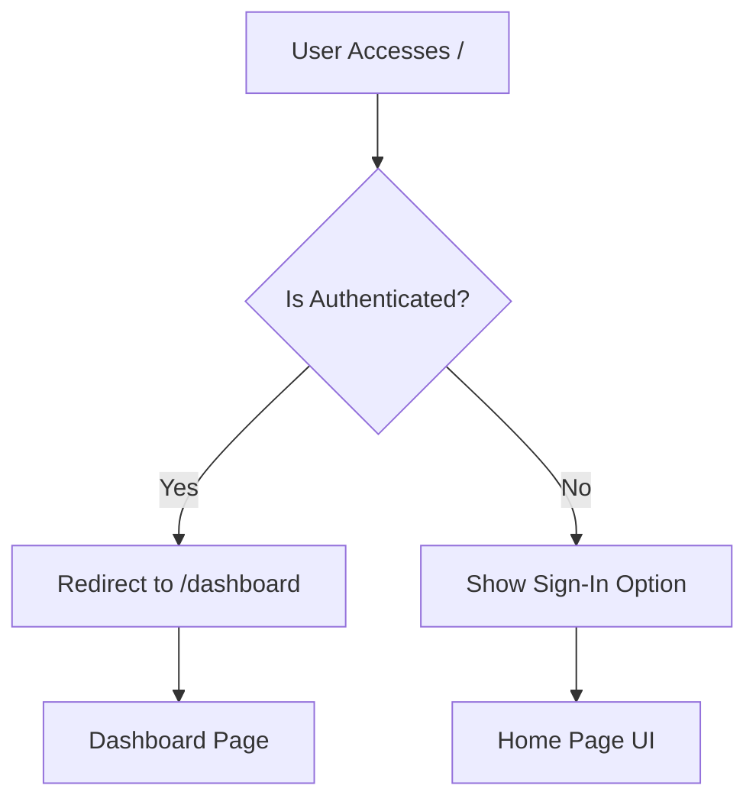
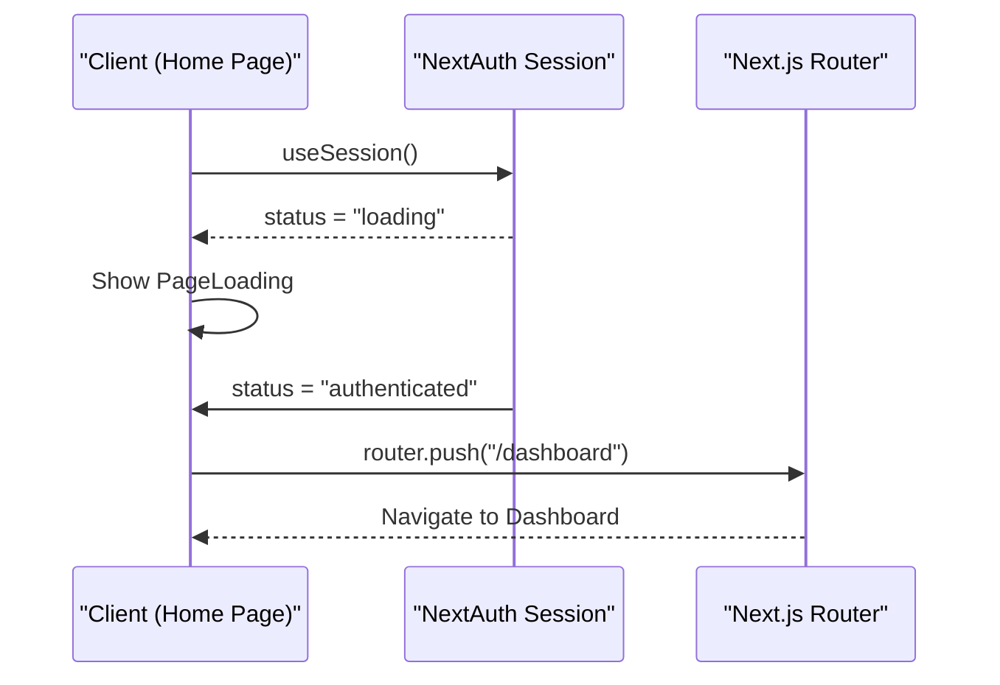
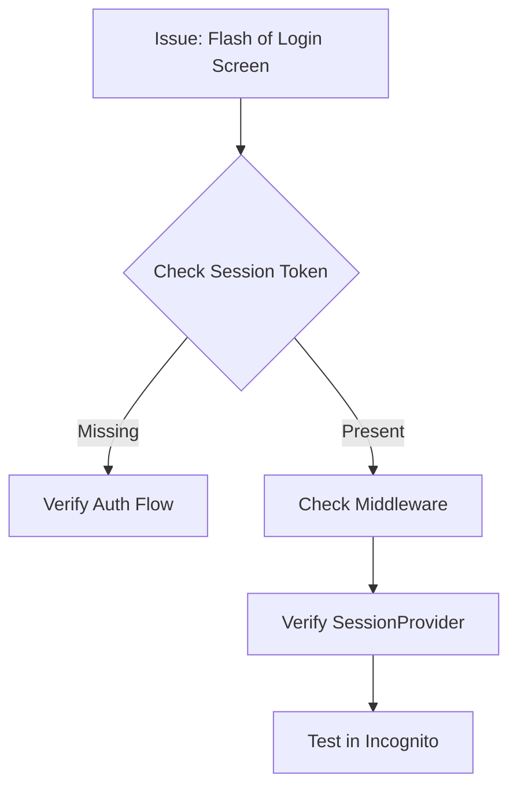

# Home Page Implementation

<cite>
**Referenced Files in This Document**   
- [page.tsx](file://src/app/page.tsx)
- [layout.tsx](file://src/app/layout.tsx)
- [SessionProvider.tsx](file://src/components/auth/SessionProvider.tsx)
- [auth.ts](file://src/lib/auth.ts)
- [PageLoading.tsx](file://src/components/PageLoading.tsx)
- [middleware.ts](file://src/middleware.ts)
- [dashboard/page.tsx](file://src/app/dashboard/page.tsx)
- [signin/page.tsx](file://src/app/auth/signin/page.tsx)
- [RoleGuard.tsx](file://src/components/auth/RoleGuard.tsx)
</cite>

## Table of Contents
1. [Introduction](#introduction)
2. [Project Structure and Entry Point](#project-structure-and-entry-point)
3. [Core Components](#core-components)
4. [Authentication Flow and Redirect Logic](#authentication-flow-and-redirect-logic)
5. [UI Structure and Styling](#ui-structure-and-styling)
6. [Server-Side Authentication Handling](#server-side-authentication-handling)
7. [Common Issues and Troubleshooting](#common-issues-and-troubleshooting)
8. [Conclusion](#conclusion)

## Introduction
The home page (`page.tsx`) in the fund-track application serves as the primary entry point for users. It determines the navigation flow based on the user's authentication state, redirecting authenticated users to the dashboard while presenting a sign-in option to unauthenticated users. This document provides a comprehensive analysis of its implementation, including integration with authentication utilities, UI structure, and handling of edge cases such as loading states and session mismatches.

## Project Structure and Entry Point

The `page.tsx` file located at `src/app/page.tsx` is the root page component rendered when users access the base URL of the application. It operates within Next.js App Router architecture, leveraging client-side React features for dynamic behavior.



**Diagram sources**
- [page.tsx](file://src/app/page.tsx#L1-L53)
- [dashboard/page.tsx](file://src/app/dashboard/page.tsx#L1-L151)

**Section sources**
- [page.tsx](file://src/app/page.tsx#L1-L53)

## Core Components

### Home Page Component
The `Home` component uses NextAuth's `useSession` hook to access the current authentication state and `useRouter` for navigation. It conditionally renders content based on whether the session is loading, authenticated, or unauthenticated.

```tsx
export default function Home() {
  const { data: session, status } = useSession();
  const router = useRouter();

  useEffect(() => {
    if (status === "authenticated") {
      router.push("/dashboard");
    }
  }, [status, router]);

  if (status === "loading") return <PageLoading />;

  if (session) {
    return null; // Will redirect to dashboard
  }

  return (
    <main className="flex min-h-screen flex-col items-center justify-center p-24">
      {/* UI Content */}
    </main>
  );
}
```

**Section sources**
- [page.tsx](file://src/app/page.tsx#L1-L53)

### SessionProvider Integration
The `SessionProvider` wraps the entire application in `layout.tsx`, ensuring that authentication context is available globally.

```tsx
export default function RootLayout({
  children,
}: {
  children: React.ReactNode;
}) {
  return (
    <html lang="en">
      <body>
        <ServerInitializer />
        <ErrorBoundary>
          <SessionProvider>{children}</SessionProvider>
        </ErrorBoundary>
      </body>
    </html>
  );
}
```

**Diagram sources**
- [layout.tsx](file://src/app/layout.tsx#L1-L35)
- [SessionProvider.tsx](file://src/components/auth/SessionProvider.tsx#L1-L16)

**Section sources**
- [layout.tsx](file://src/app/layout.tsx#L1-L35)

## Authentication Flow and Redirect Logic

### Client-Side Authentication Check
The home page uses `useSession()` to retrieve session data and status. The `status` can be `"loading"`, `"authenticated"`, or `"unauthenticated"`.



**Diagram sources**
- [page.tsx](file://src/app/page.tsx#L1-L53)
- [auth.ts](file://src/lib/auth.ts#L1-L71)

**Section sources**
- [page.tsx](file://src/app/page.tsx#L1-L53)

### Server-Side Authentication via Middleware
In addition to client-side checks, the application uses Next.js middleware to enforce authentication at the route level. This prevents unauthorized access even if client-side logic is bypassed.

```ts
if (pathname.startsWith("/dashboard") || 
    (pathname.startsWith("/api") && !pathname.startsWith("/api/auth"))) {
  if (!token) {
    return NextResponse.redirect(new URL("/auth/signin", req.url));
  }
}
```

**Section sources**
- [middleware.ts](file://src/middleware.ts#L128-L162)

## UI Structure and Styling

### Responsive Layout
The home page uses Tailwind CSS for responsive design, centering content vertically and horizontally with flexbox.

```tsx
<main className="flex min-h-screen flex-col items-center justify-center p-24">
  <div className="text-center">
    <h1 className="text-4xl font-bold text-gray-900 mb-8">Fund Track App</h1>
    <p className="text-lg text-gray-600 mb-8">Internal lead management system</p>
    <Link href="/auth/signin" className="bg-indigo-600 hover:bg-indigo-700 text-white font-medium py-3 px-6 rounded-lg">
      Staff Sign In
    </Link>
  </div>
</main>
```

### Loading State Handling
The `PageLoading` component displays a spinner during authentication checks.

```tsx
export default function PageLoading({ message = "" }: PageLoadingProps) {
  return (
    <div className="min-h-screen flex items-center justify-center">
      <div className="flex items-center space-x-3">
        <div className="h-6 w-6 animate-spin rounded-full border-2 border-gray-300 border-t-transparent" />
        <div className="text-lg text-gray-900">{message}</div>
      </div>
    </div>
  );
}
```

**Section sources**
- [page.tsx](file://src/app/page.tsx#L1-L53)
- [PageLoading.tsx](file://src/components/PageLoading.tsx#L1-L19)

## Server-Side Authentication Handling

### Middleware Configuration
The `middleware.ts` file defines route protection rules using `withAuth` from `next-auth/middleware`. It ensures that `/dashboard` and API routes (except auth) require authentication.

```ts
export const config = {
  matcher: [
    "/dashboard/:path*",
    "/api/:path*",
    "/application/:path*",
    "/admin/:path*"
  ]
}
```

This configuration applies the authentication check to all specified routes, redirecting unauthenticated users to `/auth/signin`.

**Section sources**
- [middleware.ts](file://src/middleware.ts#L170-L189)

## Common Issues and Troubleshooting

### Authentication State Mismatch
A common issue occurs when there's a mismatch between client and server authentication states, often due to caching or hydration issues.

**Symptoms:**
- Brief flash of login screen before redirect
- Incorrect redirect behavior

**Solutions:**
1. Ensure `SessionProvider` is correctly wrapped in `layout.tsx`
2. Use middleware as a fallback enforcement layer
3. Avoid server-side rendering of session-dependent content on public pages

### Debugging Steps
1. Check browser cookies for valid `next-auth.session-token`
2. Verify `middleware.ts` is correctly configured
3. Confirm `authOptions` in `auth.ts` are properly set
4. Test with incognito mode to rule out caching issues



**Section sources**
- [middleware.ts](file://src/middleware.ts#L1-L189)
- [auth.ts](file://src/lib/auth.ts#L1-L71)
- [page.tsx](file://src/app/page.tsx#L1-L53)

## Conclusion
The home page implementation in the fund-track application effectively serves as a gateway that intelligently routes users based on their authentication status. By combining client-side session checks with server-side middleware protection, it ensures a secure and seamless user experience. The integration with NextAuth, proper use of React hooks, and responsive Tailwind styling create a robust foundation for the application's authentication flow. Developers should be aware of potential state mismatch issues and use the provided troubleshooting guidance to maintain reliability.