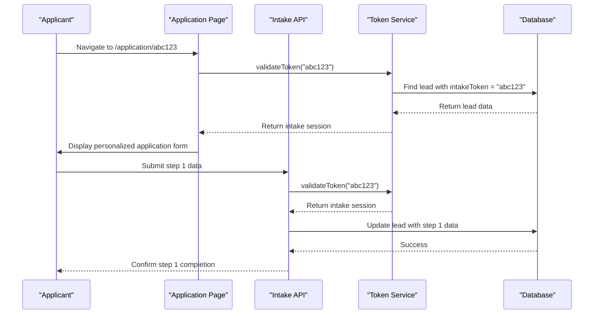
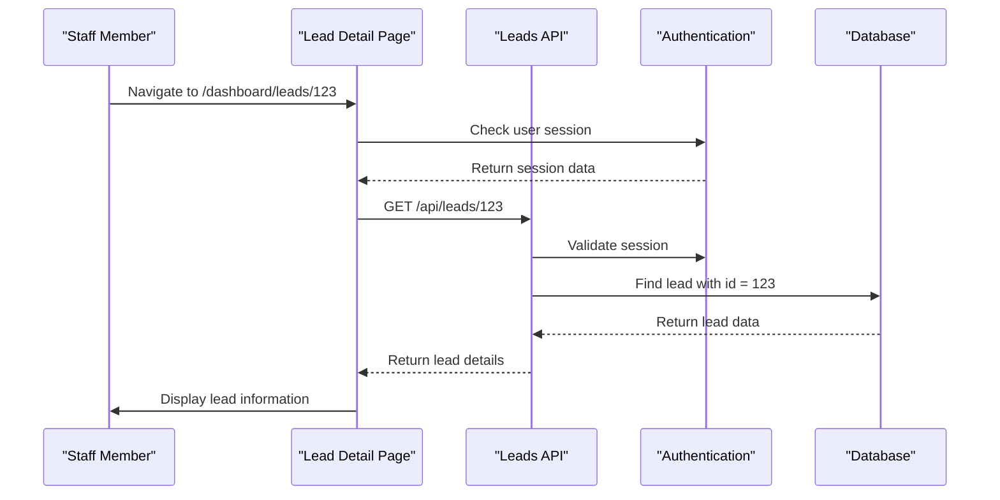
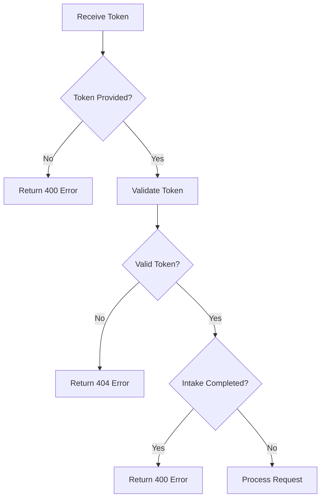

# Dynamic Routes and Parameter Management

<cite>
**Referenced Files in This Document**   
- [route.ts](file://src/app/api/intake/[token]/route.ts)
- [step1/route.ts](file://src/app/api/intake/[token]/step1/route.ts)
- [step2/route.ts](file://src/app/api/intake/[token]/step2/route.ts)
- [save/route.ts](file://src/app/api/intake/[token]/save/route.ts)
- [page.tsx](file://src/app/application/[token]/page.tsx)
- [page.tsx](file://src/app/dashboard/leads/[id]/page.tsx)
- [route.ts](file://src/app/api/leads/[id]/route.ts)
- [TokenService.ts](file://src/services/TokenService.ts)
- [IntakeWorkflow.tsx](file://src/components/intake/IntakeWorkflow.tsx)
- [Step1Form.tsx](file://src/components/intake/Step1Form.tsx)
- [LeadDetailView.tsx](file://src/components/dashboard/LeadDetailView.tsx)
</cite>

## Table of Contents
1. [Introduction](#introduction)
2. [Dynamic Route Implementation](#dynamic-route-implementation)
3. [Token-Based Routing in Application Intake](#token-based-routing-in-application-intake)
4. [ID-Based Routing in Lead Dashboard](#id-based-routing-in-lead-dashboard)
5. [Parameter Extraction and Validation](#parameter-extraction-and-validation)
6. [Security Considerations](#security-considerations)
7. [Error Handling Patterns](#error-handling-patterns)
8. [Performance and Caching](#performance-and-caching)
9. [Conclusion](#conclusion)

## Introduction
The fund-track application implements dynamic routing to enable personalized user experiences for both external applicants and internal staff. This document details the implementation of dynamic route segments using bracket notation ([token], [id]) across page and API routes. The system leverages token-based routing for secure application intake processes and ID-based routing for lead management in the dashboard. Route parameters are extracted and utilized in server components for data fetching, authorization, and personalized content delivery.

**Section sources**
- [route.ts](file://src/app/api/intake/[token]/route.ts#L1-L37)
- [page.tsx](file://src/app/application/[token]/page.tsx#L1-L221)

## Dynamic Route Implementation
The application uses Next.js dynamic routing with bracket notation to create flexible URL patterns. Two primary types of dynamic routes are implemented: token-based routes for secure, time-limited access to application forms, and ID-based routes for accessing specific lead records in the dashboard.

```mermaid
graph TD
A[Dynamic Routes] --> B[Token-Based Routes]
A --> C[ID-Based Routes]
B --> D[/application/[token]]
B --> E[/api/intake/[token]]
C --> F[/dashboard/leads/[id]]
C --> G[/api/leads/[id]]
D --> H[Application Page]
E --> I[Intake API Endpoints]
F --> J[Lead Dashboard]
G --> K[Lead API Endpoints]
```

**Diagram sources**
- [page.tsx](file://src/app/application/[token]/page.tsx#L1-L221)
- [route.ts](file://src/app/api/intake/[token]/route.ts#L1-L37)
- [page.tsx](file://src/app/dashboard/leads/[id]/page.tsx#L1-L18)
- [route.ts](file://src/app/api/leads/[id]/route.ts#L1-L303)

## Token-Based Routing in Application Intake

### Route Structure and Flow
The application intake process uses token-based routing to provide secure, personalized access to funding applications. The token serves as a unique identifier that authenticates the user and retrieves their specific intake session data.



**Diagram sources**
- [page.tsx](file://src/app/application/[token]/page.tsx#L1-L221)
- [route.ts](file://src/app/api/intake/[token]/step1/route.ts#L1-L303)
- [TokenService.ts](file://src/services/TokenService.ts#L1-L312)

### Implementation Details
The token-based routing is implemented across multiple API endpoints that handle different stages of the intake process:

- **GET /api/intake/[token]**: Retrieves the intake session data for a given token
- **POST /api/intake/[token]/step1**: Processes the first step of the application form
- **POST /api/intake/[token]/step2**: Handles document uploads for the second step
- **POST /api/intake/[token]/save**: Saves partial progress of the application

The application page component extracts the token parameter from the URL and uses it to fetch the corresponding intake session:

```typescript
export default async function IntakePage({ params }: IntakePageProps) {
  const { token } = params;
  const intakeSession = await TokenService.validateToken(token);
  // Render form with pre-filled data from intakeSession
}
```

**Section sources**
- [page.tsx](file://src/app/application/[token]/page.tsx#L1-L221)
- [route.ts](file://src/app/api/intake/[token]/route.ts#L1-L37)
- [route.ts](file://src/app/api/intake/[token]/step1/route.ts#L1-L303)

## ID-Based Routing in Lead Dashboard

### Route Structure and Flow
The lead dashboard uses ID-based routing to provide staff members with access to specific lead records. The ID parameter identifies the lead record in the database and enables personalized data fetching and management.



**Diagram sources**
- [page.tsx](file://src/app/dashboard/leads/[id]/page.tsx#L1-L18)
- [route.ts](file://src/app/api/leads/[id]/route.ts#L1-L303)

### Implementation Details
The ID-based routing is implemented in both the page component and API route:

```typescript
// Page component
export default async function LeadDetailPage({ params }: LeadDetailPageProps) {
  const { id } = await params;
  return <RoleGuard allowedRoles={[UserRole.ADMIN, UserRole.USER]}>
    <LeadDetailView leadId={parseInt(id)} />
  </RoleGuard>;
}

// API route
export async function GET(request: NextRequest, { params }: RouteParams) {
  const { id } = await params;
  const leadId = parseInt(id);
  // Fetch lead data from database
}
```

The LeadDetailView component uses the leadId prop to fetch and display the specific lead's information, including contact details, business information, documents, and notes.

**Section sources**
- [page.tsx](file://src/app/dashboard/leads/[id]/page.tsx#L1-L18)
- [route.ts](file://src/app/api/leads/[id]/route.ts#L1-L303)
- [LeadDetailView.tsx](file://src/components/dashboard/LeadDetailView.tsx#L1-L799)

## Parameter Extraction and Validation

### Server-Side Parameter Extraction
Dynamic route parameters are extracted from the URL using Next.js's params object. For both token and ID parameters, the extraction follows a consistent pattern:

```typescript
// Extracting token parameter
export async function GET(
  request: NextRequest,
  { params }: { params: Promise<{ token: string }> }
) {
  const { token } = await params;
  // Use token for further processing
}

// Extracting ID parameter
export async function GET(
  request: NextRequest,
  { params }: { params: Promise<{ id: string }> }
) {
  const { id } = await params;
  const leadId = parseInt(id);
  // Use leadId for further processing
}
```

### Validation and Type Safety
The application implements comprehensive validation for dynamic parameters to ensure data integrity and security:

1. **Presence validation**: Checks if the parameter exists
2. **Type validation**: Ensures the parameter is of the expected type
3. **Format validation**: Validates the parameter format (e.g., email, phone)
4. **Business logic validation**: Applies domain-specific rules

For ID parameters, the application validates that the ID can be parsed as an integer:

```typescript
const leadId = parseInt(id);
if (isNaN(leadId)) {
  return NextResponse.json({ error: "Invalid lead ID" }, { status: 400 });
}
```

For token parameters, the application validates the token through the TokenService:

```typescript
const intakeSession = await TokenService.validateToken(token);
if (!intakeSession) {
  return NextResponse.json(
    { error: "Invalid or expired token" },
    { status: 404 }
  );
}
```

**Section sources**
- [route.ts](file://src/app/api/intake/[token]/route.ts#L1-L37)
- [route.ts](file://src/app/api/leads/[id]/route.ts#L1-L303)
- [TokenService.ts](file://src/services/TokenService.ts#L1-L312)

## Security Considerations

### Token Validation and Authorization
The application implements a robust security model for token-based routes using the TokenService class. The token validation process includes:

1. **Database lookup**: Verifies the token exists in the database
2. **Session validation**: Confirms the token is associated with a valid lead
3. **Status checks**: Ensures the intake process is not already completed



**Diagram sources**
- [TokenService.ts](file://src/services/TokenService.ts#L1-L312)

### Access Control
The application implements role-based access control for ID-based routes in the dashboard:

```typescript
export default async function LeadDetailPage({ params }: LeadDetailPageProps) {
  const { id } = await params;
  return (
    <RoleGuard allowedRoles={[UserRole.ADMIN, UserRole.USER]}>
      <LeadDetailView leadId={parseInt(id)} />
    </RoleGuard>
  );
}
```

The API routes also validate authentication before processing requests:

```typescript
const session = await getServerSession(authOptions);
if (!session) {
  return NextResponse.json({ error: "Unauthorized" }, { status: 401 });
}
```

### Data Sanitization
All user input is sanitized before being stored in the database. The application trims whitespace from string fields and cleans phone numbers by removing special characters:

```typescript
// Trim all string fields
const trimmedData = {
  businessName: body.businessName?.trim() || "",
  // ... other fields
};

// Clean phone numbers
const cleanBusinessPhone = trimmedData.businessPhone.replace(/[\s\-\(\)\.]/g, "");
```

**Section sources**
- [TokenService.ts](file://src/services/TokenService.ts#L1-L312)
- [page.tsx](file://src/app/dashboard/leads/[id]/page.tsx#L1-L18)
- [route.ts](file://src/app/api/leads/[id]/route.ts#L1-L303)
- [step1/route.ts](file://src/app/api/intake/[token]/step1/route.ts#L1-L303)

## Error Handling Patterns

### Client-Side Error Handling
The application implements comprehensive error handling for both successful and failed operations. When errors occur, the system provides meaningful feedback to users:

```typescript
try {
  const response = await fetch(`/api/intake/${intakeSession.token}/step1`, {
    method: 'POST',
    headers: { 'Content-Type': 'application/json' },
    body: JSON.stringify(formData),
  });

  if (!response.ok) {
    const errorData = await response.json();
    if (errorData.missingFields) {
      alert(`Please fill in the following required fields: ${errorData.missingFields.join(', ')}`);
    } else {
      alert(errorData.error || 'Failed to save step 1 data');
    }
    return;
  }

  onComplete();
} catch (error) {
  alert('There was an error saving your information. Please try again.');
}
```

### Server-Side Error Handling
Server components implement try-catch blocks to handle exceptions and return appropriate HTTP status codes:

```typescript
export async function GET(
  request: NextRequest,
  { params }: { params: Promise<{ token: string }> }
) {
  try {
    const { token } = await params;

    if (!token) {
      return NextResponse.json({ error: "Token is required" }, { status: 400 });
    }

    const intakeSession = await TokenService.validateToken(token);

    if (!intakeSession) {
      return NextResponse.json(
        { error: "Invalid or expired token" },
        { status: 404 }
      );
    }

    return NextResponse.json({
      success: true,
      data: intakeSession,
    });
  } catch (error) {
    console.error("Error retrieving intake session:", error);
    return NextResponse.json(
      { error: "Internal server error" },
      { status: 500 }
    );
  }
}
```

The application uses the following HTTP status codes for different error scenarios:
- **400 Bad Request**: Invalid or missing parameters
- **401 Unauthorized**: Authentication required
- **404 Not Found**: Resource not found
- **500 Internal Server Error**: Unexpected server errors

**Section sources**
- [route.ts](file://src/app/api/intake/[token]/route.ts#L1-L37)
- [step1/route.ts](file://src/app/api/intake/[token]/step1/route.ts#L1-L303)
- [Step1Form.tsx](file://src/components/intake/Step1Form.tsx#L1-L398)

## Performance and Caching

### Data Loading Strategies
The application implements efficient data loading strategies to minimize database queries and improve performance:

1. **Server-side rendering**: Data is fetched on the server before the page is rendered
2. **Batched queries**: Related data is fetched in a single query using Prisma's include feature
3. **Client-side caching**: Data is cached on the client to reduce redundant API calls

The lead detail API route uses Prisma's include feature to fetch related data in a single query:

```typescript
const lead = await prisma.lead.findUnique({
  where: { id: leadId },
  include: {
    notes: { include: { user: { select: { id: true, email: true } } } },
    documents: { include: { user: { select: { id: true, email: true } } } },
    statusHistory: { include: { user: { select: { id: true, email: true } } } },
    _count: { select: { notes: true, documents: true, followupQueue: true } },
  },
});
```

### Caching Considerations
While the current implementation does not explicitly implement caching, several patterns support future caching enhancements:

1. **Immutable tokens**: Tokens are not modified after creation, making them suitable for caching
2. **Predictable URLs**: Dynamic routes follow a consistent pattern that can be cached
3. **Stateless API**: API routes do not maintain session state, enabling easier caching

For high-traffic scenarios, implementing Redis or similar caching solutions could significantly improve performance by reducing database load.

**Section sources**
- [route.ts](file://src/app/api/leads/[id]/route.ts#L1-L303)
- [TokenService.ts](file://src/services/TokenService.ts#L1-L312)

## Conclusion
The fund-track application effectively implements dynamic routing using both token-based and ID-based approaches to enable personalized user experiences. Token-based routing provides secure, time-limited access to application forms, while ID-based routing enables staff members to manage specific lead records in the dashboard. The system extracts route parameters consistently across server components, validates them thoroughly, and handles errors gracefully. Security is prioritized through token validation, role-based access control, and data sanitization. The application's data loading strategies are efficient, with opportunities for further performance optimization through caching. This comprehensive approach to dynamic routing supports the application's core functionality while maintaining security and usability.