# Error and Loading State Management

<cite>
**Referenced Files in This Document**   
- [ErrorBoundary.tsx](file://src/components/ErrorBoundary.tsx)
- [PageLoading.tsx](file://src/components/PageLoading.tsx)
- [global-error.tsx](file://src/app/global-error.tsx)
- [layout.tsx](file://src/app/layout.tsx)
- [admin/page.tsx](file://src/app/admin/page.tsx)
- [dashboard/LeadDetailView.tsx](file://src/components/dashboard/LeadDetailView.tsx)
- [auth/RoleGuard.tsx](file://src/components/auth/RoleGuard.tsx)
- [logger.ts](file://src/lib/logger.ts)
- [client-logger.ts](file://src/lib/client-logger.ts)
- [monitoring.ts](file://src/lib/monitoring.ts)
- [api/monitoring/status/route.ts](file://src/app/api/monitoring/status/route.ts)
</cite>

## Table of Contents
1. [Introduction](#introduction)
2. [Core Error and Loading Components](#core-error-and-loading-components)
3. [Global Error Handling](#global-error-handling)
4. [Component-Level Error Boundaries](#component-level-error-boundaries)
5. [Loading State Management](#loading-state-management)
6. [Error Logging and Monitoring](#error-logging-and-monitoring)
7. [Integration and Usage Patterns](#integration-and-usage-patterns)
8. [Best Practices](#best-practices)

## Introduction
The fund-track application implements a comprehensive error and loading state management system to ensure a resilient user experience. This documentation details the implementation of global and component-level error handling, loading state visualization, and monitoring integration. The system combines Next.js 13+ App Router features with custom React components to provide graceful error recovery, meaningful user feedback, and comprehensive error tracking.

**Section sources**
- [ErrorBoundary.tsx](file://src/components/ErrorBoundary.tsx)
- [PageLoading.tsx](file://src/components/PageLoading.tsx)
- [global-error.tsx](file://src/app/global-error.tsx)

## Core Error and Loading Components

### ErrorBoundary Component
The ErrorBoundary component provides a robust mechanism for catching and handling React errors in the component tree. Implemented as a class component, it uses React's error boundary lifecycle methods to intercept errors and render fallback UI.

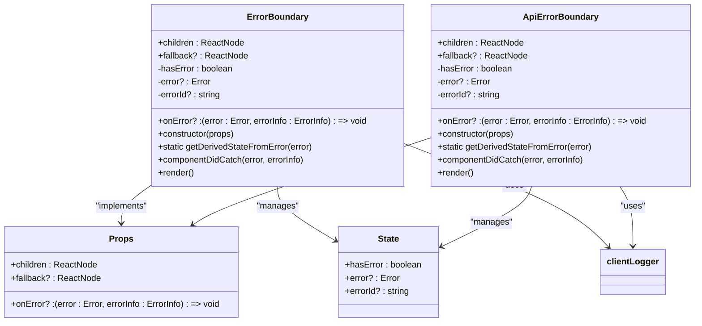

**Diagram sources**
- [ErrorBoundary.tsx](file://src/components/ErrorBoundary.tsx#L0-L280)

**Section sources**
- [ErrorBoundary.tsx](file://src/components/ErrorBoundary.tsx#L0-L280)

### PageLoading Component
The PageLoading component provides visual feedback during data fetching and navigation. It displays a simple spinner animation with an optional message to inform users that content is being loaded.

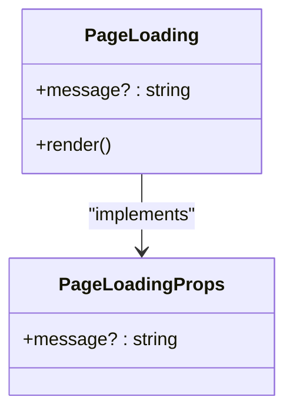

**Diagram sources**
- [PageLoading.tsx](file://src/components/PageLoading.tsx#L0-L18)

**Section sources**
- [PageLoading.tsx](file://src/components/PageLoading.tsx#L0-L18)

## Global Error Handling

### Application-Level Error Boundary
The ErrorBoundary component is integrated at the root layout level, wrapping the entire application to catch unhandled errors in the component tree. This ensures that any uncaught React errors are gracefully handled.

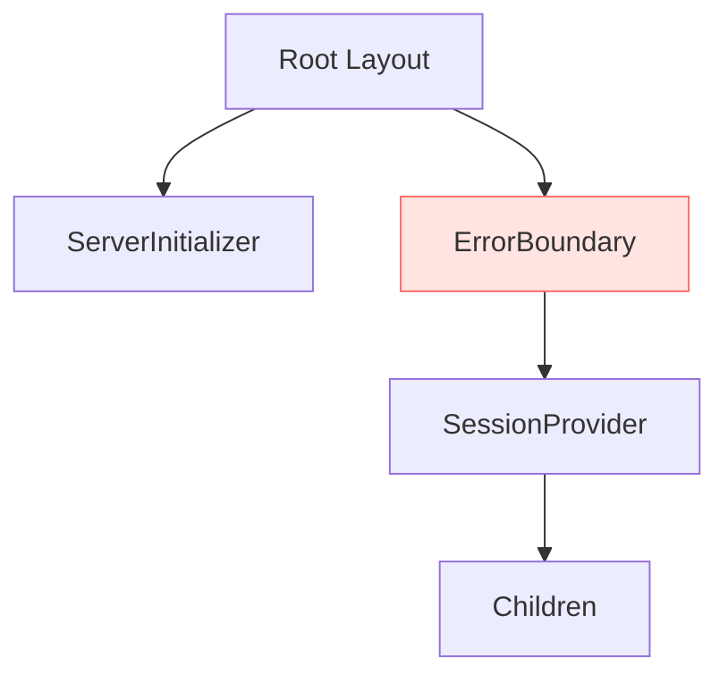

**Diagram sources**
- [layout.tsx](file://src/app/layout.tsx#L5)
- [ErrorBoundary.tsx](file://src/components/ErrorBoundary.tsx)

**Section sources**
- [layout.tsx](file://src/app/layout.tsx#L1-L35)

### Next.js Global Error Page
The application implements Next.js's global-error.tsx file to handle errors that occur during server-side rendering or at the route level. This component renders when an error is thrown in a route segment.

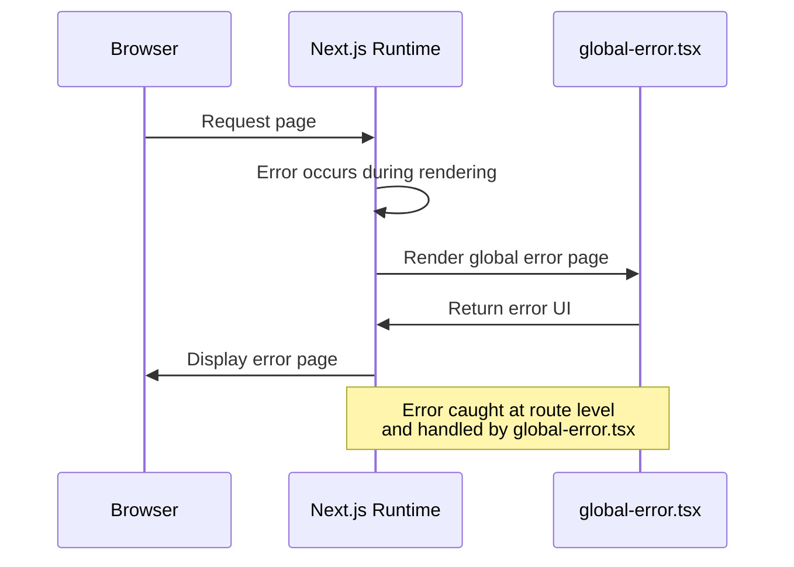

**Diagram sources**
- [global-error.tsx](file://src/app/global-error.tsx#L1-L24)

**Section sources**
- [global-error.tsx](file://src/app/global-error.tsx#L1-L24)

## Component-Level Error Boundaries

### Error Boundary Implementation
The ErrorBoundary component uses React's error boundary pattern to catch JavaScript errors anywhere in the child component tree. When an error occurs, it transitions to an error state and renders a user-friendly fallback UI.

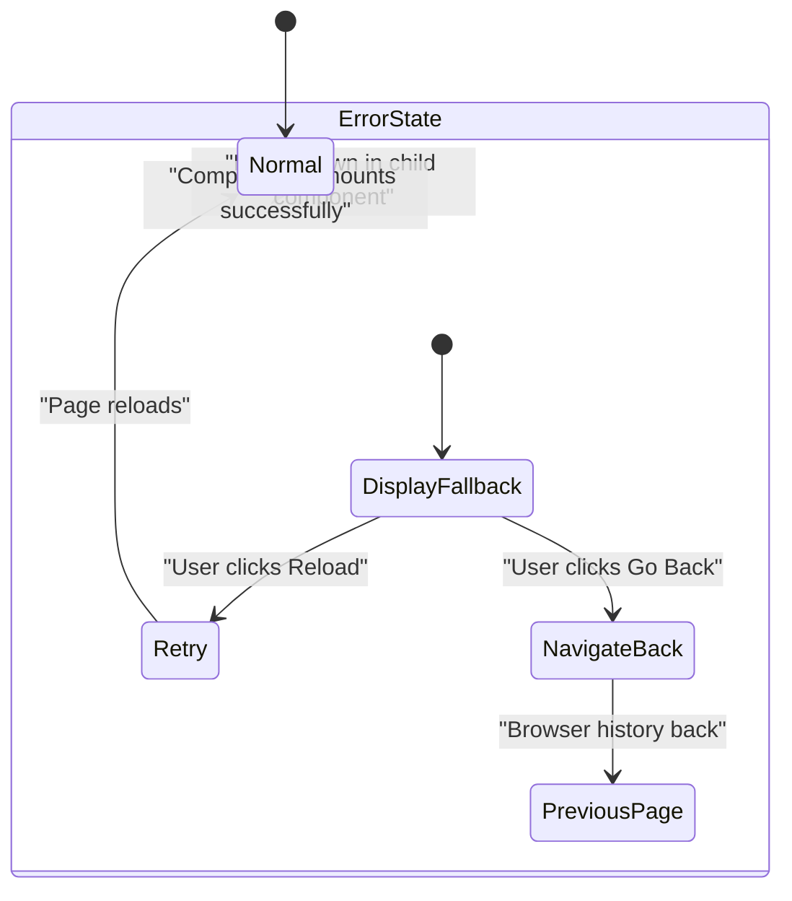

**Diagram sources**
- [ErrorBoundary.tsx](file://src/components/ErrorBoundary.tsx#L0-L280)

**Section sources**
- [ErrorBoundary.tsx](file://src/components/ErrorBoundary.tsx#L0-L280)

### Specialized Error Boundaries
The application includes specialized error boundaries for different contexts:

- **ErrorBoundary**: General-purpose error boundary for any React component errors
- **ApiErrorBoundary**: Specialized for API-related errors with a simpler error UI
- **withErrorBoundary**: Higher-order component for wrapping functional components
- **useErrorHandler**: Hook for handling async errors in functional components

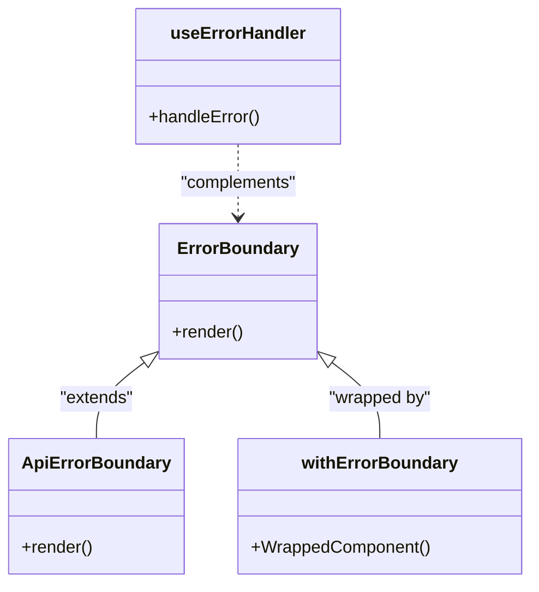

**Diagram sources**
- [ErrorBoundary.tsx](file://src/components/ErrorBoundary.tsx#L0-L280)

**Section sources**
- [ErrorBoundary.tsx](file://src/components/ErrorBoundary.tsx#L0-L280)

## Loading State Management

### PageLoading Implementation
The PageLoading component provides a consistent loading experience across the application. It displays a spinning animation with an optional message to indicate that content is being loaded.

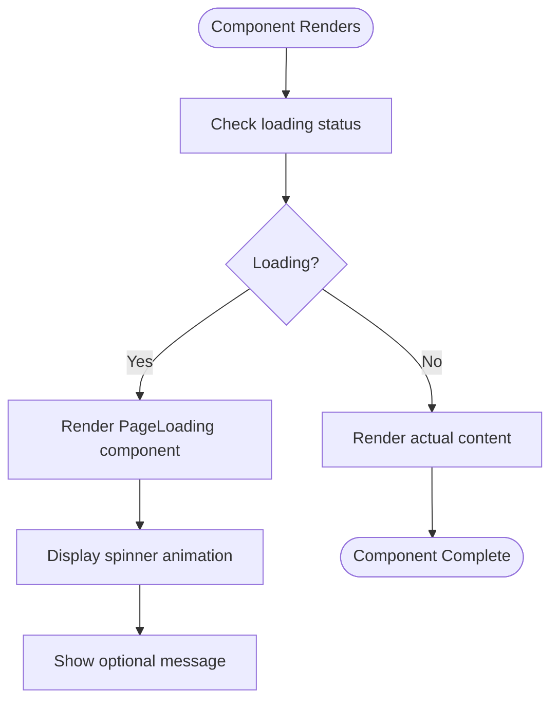

**Diagram sources**
- [PageLoading.tsx](file://src/components/PageLoading.tsx#L0-L18)

**Section sources**
- [PageLoading.tsx](file://src/components/PageLoading.tsx#L0-L18)

### Loading State Usage Patterns
The PageLoading component is used in various contexts throughout the application:

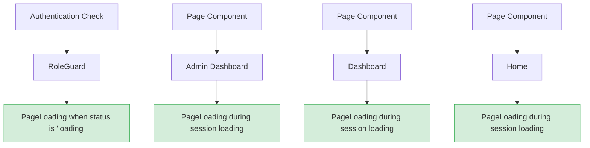

**Diagram sources**
- [PageLoading.tsx](file://src/components/PageLoading.tsx)
- [admin/page.tsx](file://src/app/admin/page.tsx#L5)
- [dashboard/page.tsx](file://src/app/dashboard/page.tsx#L10)
- [page.tsx](file://src/app/page.tsx#L6)
- [auth/RoleGuard.tsx](file://src/components/auth/RoleGuard.tsx#L5)

**Section sources**
- [PageLoading.tsx](file://src/components/PageLoading.tsx#L0-L18)
- [admin/page.tsx](file://src/app/admin/page.tsx#L1-L110)
- [auth/RoleGuard.tsx](file://src/components/auth/RoleGuard.tsx#L1-L75)

## Error Logging and Monitoring

### Client-Side Error Logging
The application uses a custom client logger to capture and report errors. The ErrorBoundary component integrates with clientLogger to record error details including component stack traces.

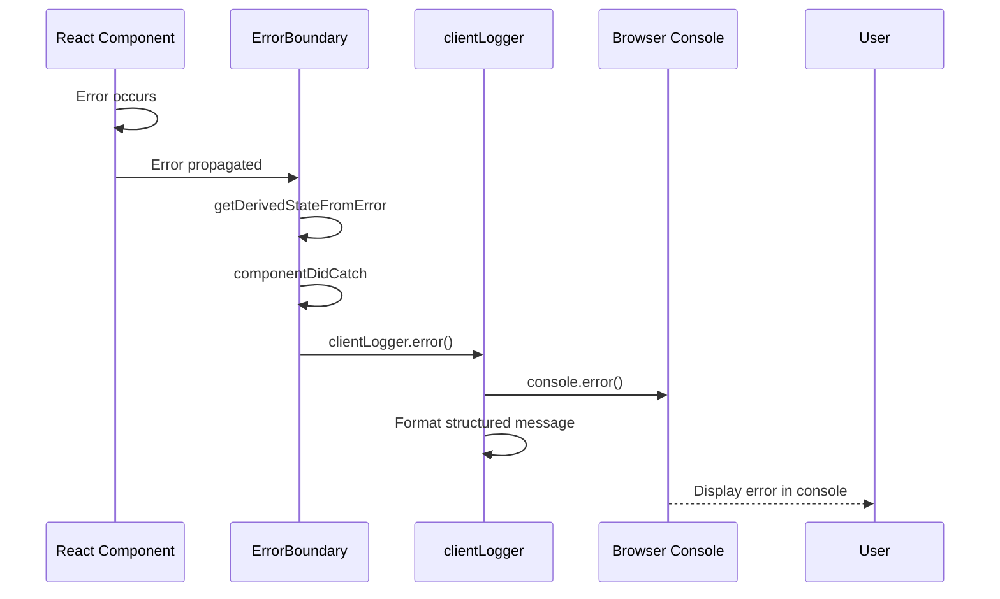

**Diagram sources**
- [ErrorBoundary.tsx](file://src/components/ErrorBoundary.tsx#L40-L60)
- [client-logger.ts](file://src/lib/client-logger.ts#L0-L132)

**Section sources**
- [ErrorBoundary.tsx](file://src/components/ErrorBoundary.tsx#L40-L60)
- [client-logger.ts](file://src/lib/client-logger.ts#L0-L132)

### Server-Side Monitoring
The application implements a comprehensive monitoring system that tracks both performance metrics and errors. The monitoring system stores metrics in memory and provides an API endpoint to retrieve monitoring status.

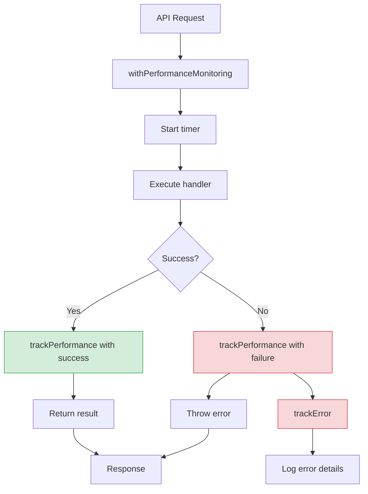

**Diagram sources**
- [monitoring.ts](file://src/lib/monitoring.ts#L0-L276)
- [api/monitoring/status/route.ts](file://src/app/api/monitoring/status/route.ts#L0-L68)

**Section sources**
- [monitoring.ts](file://src/lib/monitoring.ts#L0-L276)
- [api/monitoring/status/route.ts](file://src/app/api/monitoring/status/route.ts#L0-L68)

### Error Tracking Architecture
The monitoring system implements a dual-layer approach to error tracking, capturing both client-side and server-side errors with structured context.

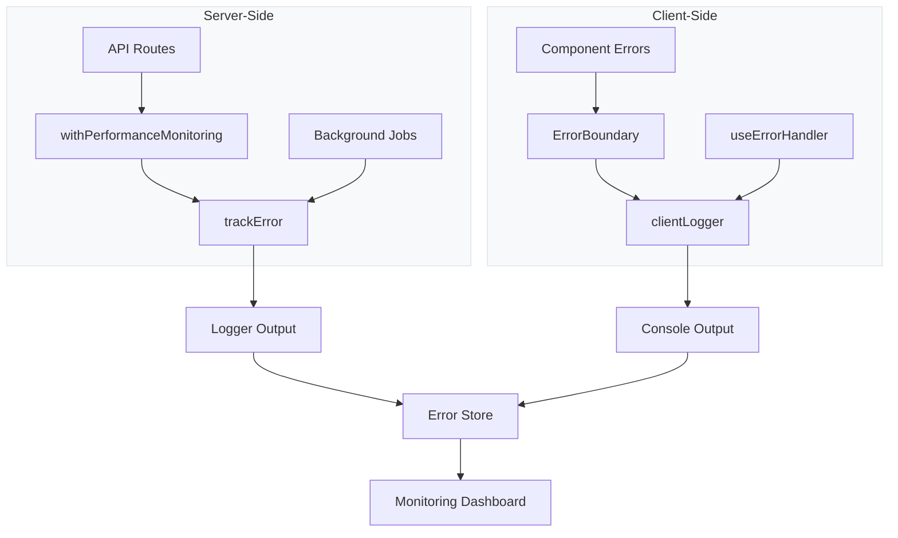

**Diagram sources**
- [monitoring.ts](file://src/lib/monitoring.ts#L0-L276)
- [client-logger.ts](file://src/lib/client-logger.ts#L0-L132)
- [logger.ts](file://src/lib/logger.ts#L0-L350)

**Section sources**
- [monitoring.ts](file://src/lib/monitoring.ts#L0-L276)
- [client-logger.ts](file://src/lib/client-logger.ts#L0-L132)
- [logger.ts](file://src/lib/logger.ts#L0-L350)

## Integration and Usage Patterns

### Error Handling in Page Components
The application demonstrates consistent patterns for handling errors in both page and component contexts. The LeadDetailView component shows a specific implementation of error state handling.

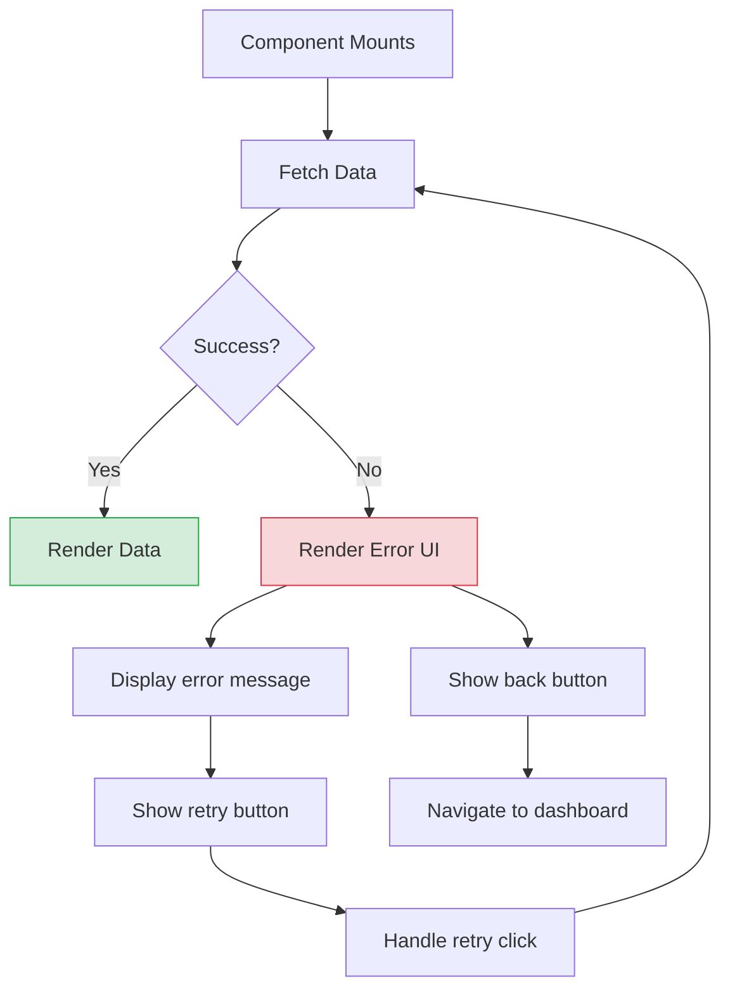

**Section sources**
- [dashboard/LeadDetailView.tsx](file://src/components/dashboard/LeadDetailView.tsx#L330-L372)

### Loading State Integration
The PageLoading component is integrated into multiple page components to provide consistent loading feedback during authentication checks and data fetching.

```typescript
// Example from admin/page.tsx
if (status === "loading") return <PageLoading />;
```

This pattern is consistently applied across the application in:
- Root page components
- Authentication guards
- Data-fetching components

**Section sources**
- [admin/page.tsx](file://src/app/admin/page.tsx#L30-L32)
- [auth/RoleGuard.tsx](file://src/components/auth/RoleGuard.tsx#L15-L17)

## Best Practices

### Error Message Design
The application follows best practices for user-friendly error messages:

- **Clear communication**: "Something went wrong" is simple and non-technical
- **Actionable guidance**: Provides "Reload Page" and "Go Back" options
- **Error identification**: Includes an error ID for support requests
- **Development assistance**: Shows stack traces in development mode only

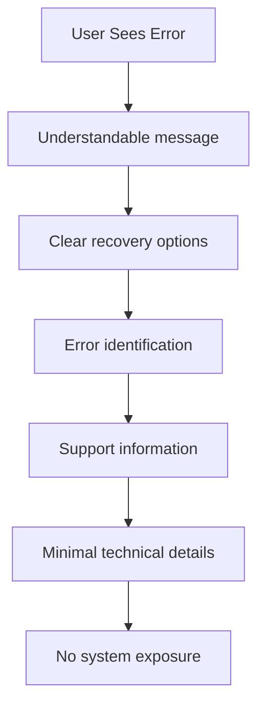

**Section sources**
- [ErrorBoundary.tsx](file://src/components/ErrorBoundary.tsx#L70-L132)

### Performance Optimization
The loading state implementation follows performance best practices:

- **Lightweight component**: Minimal code and dependencies
- **CSS animations**: Uses native CSS animations for smooth performance
- **Conditional rendering**: Only renders when needed
- **Consistent UX**: Same loading pattern across the application

### Monitoring and Logging
The application implements comprehensive monitoring with these best practices:

- **Structured logging**: Consistent format with context
- **Environment awareness**: Different behavior in development vs production
- **Performance tracking**: Measures operation duration
- **Error categorization**: Differentiates error types
- **Memory efficiency**: Uses Map objects for metric storage

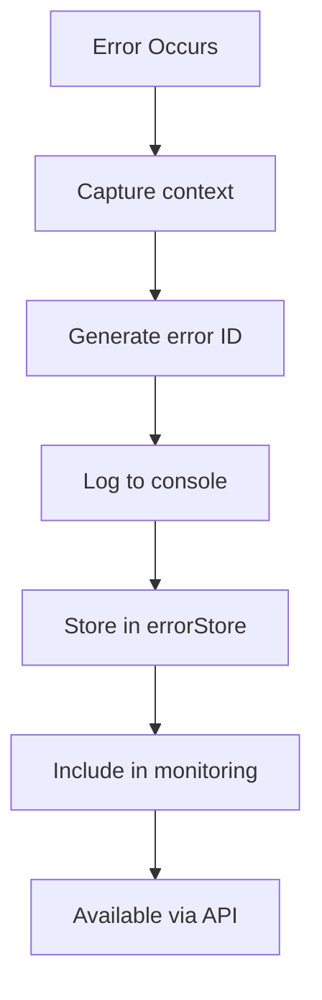

**Section sources**
- [monitoring.ts](file://src/lib/monitoring.ts#L0-L276)
- [logger.ts](file://src/lib/logger.ts#L0-L350)

### Resilient User Experience
The combined error and loading state management creates a resilient user experience by:

1. **Preventing crashes**: Errors are caught and contained
2. **Providing feedback**: Users always know the application state
3. **Enabling recovery**: Clear options to retry or navigate away
4. **Supporting debugging**: Error IDs help diagnose issues
5. **Maintaining consistency**: Uniform patterns across the application

These mechanisms work together to ensure the application remains usable even when errors occur, providing a professional and reliable experience for users.