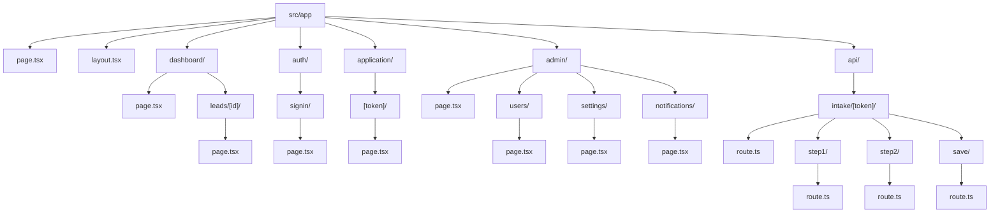
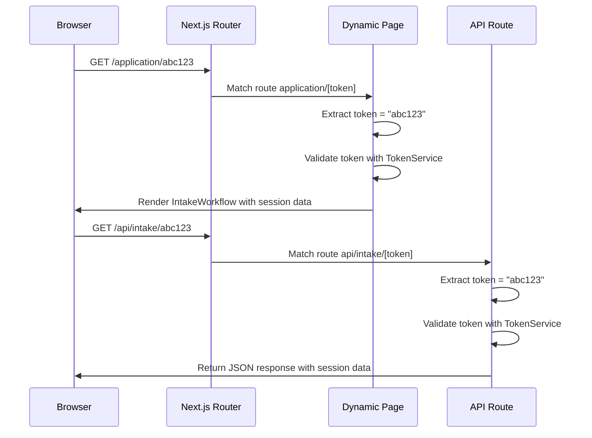
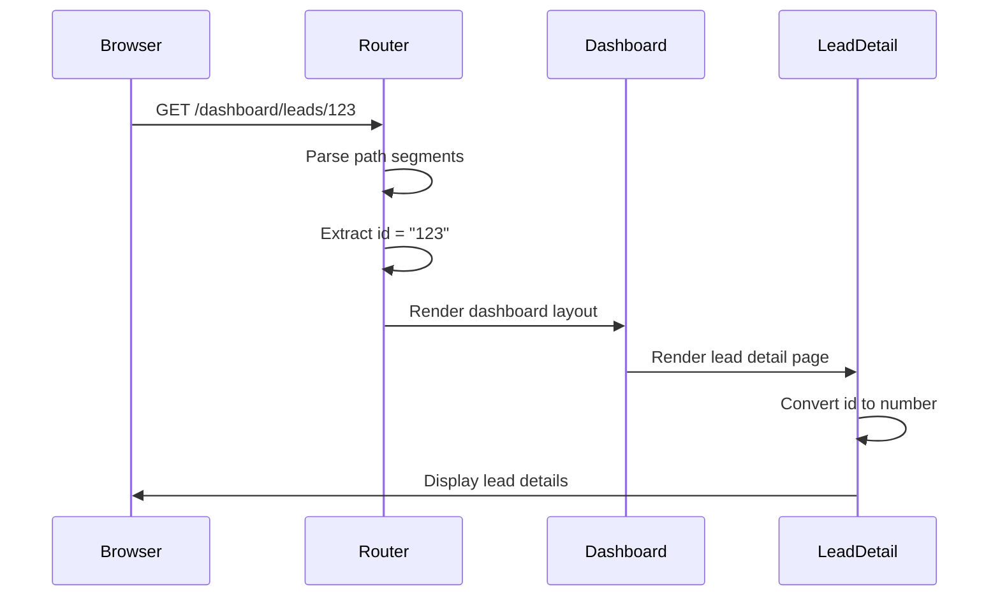
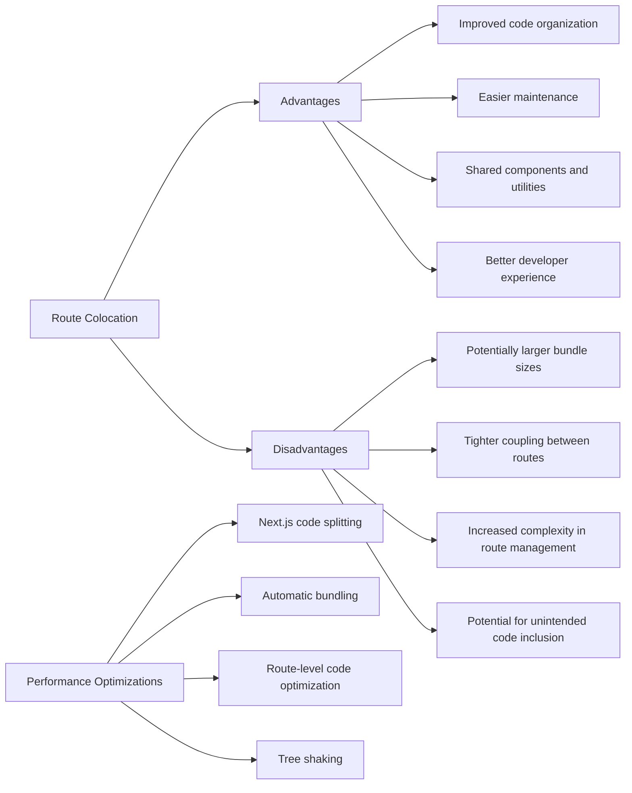

# File-Based Routing System

<cite>
**Referenced Files in This Document**   
- [src/app/page.tsx](file://src/app/page.tsx)
- [src/app/layout.tsx](file://src/app/layout.tsx)
- [src/app/application/[token]/page.tsx](file://src/app/application/[token]/page.tsx)
- [src/app/dashboard/leads/[id]/page.tsx](file://src/app/dashboard/leads/[id]/page.tsx)
- [src/app/admin/page.tsx](file://src/app/admin/page.tsx)
- [src/app/api/intake/[token]/route.ts](file://src/app/api/intake/[token]/route.ts)
- [src/app/global-error.tsx](file://src/app/global-error.tsx)
- [src/middleware.ts](file://src/middleware.ts)
</cite>

## Table of Contents
1. [Introduction](#introduction)
2. [Project Structure](#project-structure)
3. [Core Routing Components](#core-routing-components)
4. [Route Mapping and Directory Structure](#route-mapping-and-directory-structure)
5. [Special Files in Routing](#special-files-in-routing)
6. [Static and Dynamic Routes](#static-and-dynamic-routes)
7. [Route Grouping and Organization](#route-grouping-and-organization)
8. [Route Nesting and Path Resolution](#route-nesting-and-path-resolution)
9. [Performance Implications of Route Colocation](#performance-implications-of-route-colocation)
10. [Best Practices](#best-practices)

## Introduction
The fund-track application implements Next.js App Router's file-based routing system to map the directory structure under `src/app` directly to application routes. This document provides a comprehensive analysis of the routing architecture, explaining how route segments are defined, how UI is rendered, and how special files control layout and error handling. The system supports both static and dynamic routes, with sophisticated patterns for route grouping and organization to isolate private or protected sections.

## Project Structure
The application's routing structure is organized under the `src/app` directory, with clear separation between user-facing pages, API routes, and administrative sections. The structure follows Next.js conventions, using directory names to define routes and special files like `page.tsx` and `route.ts` to define route segments and API endpoints.

```mermaid
graph TB
subgraph "src/app"
ROOT[page.tsx] --> DASHBOARD
ROOT --> AUTH
ROOT --> APPLICATION
ROOT --> ADMIN
ROOT --> API
DASHBOARD[dashboard/page.tsx] --> LEADS[dashboard/leads/[id]/page.tsx]
AUTH[auth/signin/page.tsx] --> SIGNIN
APPLICATION[application/[token]/page.tsx] --> INTAKE
ADMIN[admin/page.tsx] --> USERS[admin/users/page.tsx]
ADMIN --> SETTINGS[admin/settings/page.tsx]
ADMIN --> NOTIFICATIONS[admin/notifications/page.tsx]
API[api/] --> INTAKE_API[api/intake/[token]/route.ts]
API --> LEADS_API[api/leads/[id]/route.ts]
API --> ADMIN_API[api/admin/]
API --> AUTH_API[api/auth/]
API --> CRON[api/cron/]
API --> DEV[api/dev/]
API --> HEALTH[api/health/]
end
```

**Diagram sources**
- [src/app/page.tsx](file://src/app/page.tsx)
- [src/app/admin/page.tsx](file://src/app/admin/page.tsx)
- [src/app/api/intake/[token]/route.ts](file://src/app/api/intake/[token]/route.ts)

## Core Routing Components
The routing system is built around several key components that define how routes are structured and rendered. The `page.tsx` files serve as the primary route definitions, while `layout.tsx` controls the overall UI structure. API routes are defined using `route.ts` files, and middleware handles authentication and authorization.

**Section sources**
- [src/app/page.tsx](file://src/app/page.tsx#L1-L53)
- [src/app/layout.tsx](file://src/app/layout.tsx#L1-L35)
- [src/app/api/intake/[token]/route.ts](file://src/app/api/intake/[token]/route.ts#L1-L38)

## Route Mapping and Directory Structure
The directory structure under `src/app` directly maps to application routes. Each directory represents a route segment, and `page.tsx` files within directories define the UI for that route. For example, the path `src/app/dashboard/leads/[id]/page.tsx` corresponds to the route `/dashboard/leads/[id]`.

The root `page.tsx` serves as the home route, while subdirectories create nested routes. API routes are separated into the `api` directory, with their own subdirectory structure mirroring the URL paths they serve.



**Diagram sources**
- [src/app/page.tsx](file://src/app/page.tsx)
- [src/app/layout.tsx](file://src/app/layout.tsx)
- [src/app/dashboard/leads/[id]/page.tsx](file://src/app/dashboard/leads/[id]/page.tsx)

## Special Files in Routing
The Next.js App Router uses special files to control various aspects of routing behavior. The `layout.tsx` file defines the UI structure that persists across route changes, while `page.tsx` files define the content for specific routes.

The `global-error.tsx` file serves as a global error boundary, catching errors that occur anywhere in the application. This file wraps the entire application in an error boundary, providing a fallback UI when errors occur.

The `middleware.ts` file handles authentication, authorization, and security concerns for routes. It uses the `withAuth` function from NextAuth to protect routes and implements rate limiting and security headers.

```mermaid
classDiagram
class RootLayout {
+children : React.ReactNode
+return : JSX.Element
}
class Home {
+useSession() : Session
+useRouter() : Router
+useEffect() : void
+return : JSX.Element
}
class GlobalError {
+error : Error & { digest? : string }
+useEffect() : void
+return : JSX.Element
}
class Middleware {
+rateLimit(req : NextRequest) : boolean
+addSecurityHeaders(response : NextResponse) : NextResponse
+middleware(req : NextRequest) : NextResponse
+config : { matcher : string[] }
}
RootLayout --> Home : "renders"
RootLayout --> GlobalError : "wraps"
Middleware --> RootLayout : "protects"
Middleware --> Home : "protects"
```

**Diagram sources**
- [src/app/layout.tsx](file://src/app/layout.tsx#L1-L35)
- [src/app/page.tsx](file://src/app/page.tsx#L1-L53)
- [src/app/global-error.tsx](file://src/app/global-error.tsx#L1-L25)
- [src/middleware.ts](file://src/middleware.ts#L1-L189)

## Static and Dynamic Routes
The application implements both static and dynamic routes using Next.js App Router conventions. Static routes are defined by directory names and `page.tsx` files, while dynamic routes use bracket syntax `[parameter]` to capture route parameters.

Dynamic routes are used extensively throughout the application. For example, the intake process uses a token-based dynamic route at `application/[token]/page.tsx`, which captures the token parameter and uses it to retrieve intake session data. Similarly, the dashboard uses dynamic routes for lead details at `dashboard/leads/[id]/page.tsx`, capturing the lead ID parameter.

API routes also use dynamic parameters, such as `api/intake/[token]/route.ts` which handles GET requests for intake sessions by token.



**Diagram sources**
- [src/app/application/[token]/page.tsx](file://src/app/application/[token]/page.tsx#L1-L222)
- [src/app/api/intake/[token]/route.ts](file://src/app/api/intake/[token]/route.ts#L1-L38)

## Route Grouping and Organization
The application uses route grouping and organization patterns to isolate private or protected sections. The `admin` directory contains routes that are restricted to administrators, while the `dashboard` directory contains routes for authenticated users.

The `middleware.ts` file implements authorization logic to protect these routes. Routes under `/dashboard` and `/admin` require authentication, with `/admin` routes requiring ADMIN role. The intake routes under `/application` are publicly accessible, allowing prospects to complete their applications without authentication.

Route groups are also used for API endpoints, with separate directories for `admin`, `auth`, `cron`, `dev`, `health`, and other functional areas. This organization improves code maintainability and makes it easier to understand the purpose of each API endpoint.

```mermaid
flowchart TD
Start([Request]) --> CheckPath["Check Path Prefix"]
CheckPath --> |Starts with /application/| AllowPublic["Allow Public Access"]
CheckPath --> |Starts with /auth/| AllowAuth["Allow Access"]
CheckPath --> |Is /api/health| AllowHealth["Allow Access"]
CheckPath --> |Starts with /api/dev/| CheckEnv["Check Environment"]
CheckEnv --> |Development or ENABLE_DEV_ENDPOINTS| AllowDev["Allow Access"]
CheckEnv --> |Production| DenyDev["Deny Access"]
CheckPath --> |Starts with /dashboard/ or /api/ (except auth)| CheckAuth["Check Authentication"]
CheckAuth --> |No Token| RedirectLogin["Redirect to /auth/signin"]
CheckAuth --> |Has Token| CheckAdmin["Check if /admin route"]
CheckAdmin --> |Is /admin route| CheckRole["Check ADMIN role"]
CheckRole --> |Not ADMIN| RedirectDashboard["Redirect to /dashboard"]
CheckRole --> |Is ADMIN| AllowAccess["Allow Access"]
CheckAdmin --> |Not /admin route| AllowAccess
AllowPublic --> End([Allow])
AllowAuth --> End
AllowHealth --> End
AllowDev --> End
DenyDev --> End
RedirectLogin --> End
RedirectDashboard --> End
AllowAccess --> End
```

**Diagram sources**
- [src/middleware.ts](file://src/middleware.ts#L1-L189)
- [src/app/admin/page.tsx](file://src/app/admin/page.tsx#L1-L111)

## Route Nesting and Path Resolution
The application demonstrates route nesting through the dashboard and lead management sections. The path `/dashboard/leads/[id]` represents a nested route where `dashboard` is the parent route and `leads/[id]` is the child route.

When a user navigates to `/dashboard/leads/123`, the router resolves the path by matching each segment. The `dashboard/page.tsx` file defines the parent route, while `dashboard/leads/[id]/page.tsx` defines the child route. The `[id]` parameter is captured and passed to the page component as a prop.

This nesting pattern allows for shared layout and functionality between related routes. For example, the dashboard layout can include navigation and branding that persists across all dashboard sub-routes, while each sub-route can define its own specific content.



**Diagram sources**
- [src/app/dashboard/page.tsx](file://src/app/dashboard/page.tsx)
- [src/app/dashboard/leads/[id]/page.tsx](file://src/app/dashboard/leads/[id]/page.tsx#L1-L19)

## Performance Implications of Route Colocation
Route colocation in the Next.js App Router has several performance implications. By colocating related routes and their components, the application can optimize bundle size and reduce network requests.

The current structure colocates API routes with their corresponding page routes, which can improve development experience but may impact performance if not carefully managed. For example, the intake API routes are colocated with the intake page routes, allowing shared code and easier maintenance.

However, this colocation pattern means that API route code is included in the same deployment bundle as page routes, potentially increasing bundle size. In production, this is mitigated by Next.js's automatic code splitting, which ensures that only the necessary code is loaded for each route.

The use of middleware for authentication and authorization also has performance implications. The middleware runs on every request to the matched routes, performing rate limiting checks, security header additions, and authentication validation. While this adds a small overhead to each request, it provides important security benefits.



**Diagram sources**
- [src/app/api/intake/[token]/route.ts](file://src/app/api/intake/[token]/route.ts)
- [src/app/application/[token]/page.tsx](file://src/app/application/[token]/page.tsx)
- [src/middleware.ts](file://src/middleware.ts)

## Best Practices
Based on the analysis of the fund-track application's routing system, several best practices emerge for implementing file-based routing in Next.js:

1. **Consistent Naming Conventions**: Use clear, descriptive names for directories and files that reflect their purpose and route structure.

2. **Logical Route Organization**: Group related routes together in directories, such as `admin`, `dashboard`, and `api`, to improve maintainability.

3. **Proper Use of Dynamic Routes**: Use bracket syntax `[parameter]` for dynamic route segments, and ensure proper validation of captured parameters.

4. **Security-First Approach**: Implement middleware for authentication, authorization, and security concerns, protecting sensitive routes while allowing public access to appropriate sections.

5. **Error Handling**: Implement global error boundaries and handle errors gracefully in both page and API routes.

6. **Performance Optimization**: Leverage Next.js's built-in code splitting and optimization features, and be mindful of bundle sizes when colocating routes.

7. **API Route Separation**: Keep API routes separate from page routes in the `api` directory to maintain clear separation of concerns.

8. **Route Protection**: Use role-based access control to protect administrative and sensitive routes, as demonstrated by the `RoleGuard` component.

9. **Middleware Configuration**: Carefully configure the middleware matcher to include only the routes that require the middleware processing, minimizing unnecessary overhead.

10. **Documentation**: Maintain clear documentation of the routing structure and conventions to aid onboarding and maintenance.

**Section sources**
- [src/app/page.tsx](file://src/app/page.tsx)
- [src/app/layout.tsx](file://src/app/layout.tsx)
- [src/app/application/[token]/page.tsx](file://src/app/application/[token]/page.tsx)
- [src/app/dashboard/leads/[id]/page.tsx](file://src/app/dashboard/leads/[id]/page.tsx)
- [src/app/admin/page.tsx](file://src/app/admin/page.tsx)
- [src/app/api/intake/[token]/route.ts](file://src/app/api/intake/[token]/route.ts)
- [src/app/global-error.tsx](file://src/app/global-error.tsx)
- [src/middleware.ts](file://src/middleware.ts)