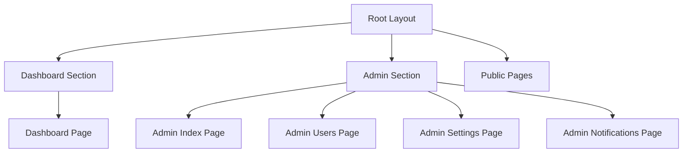
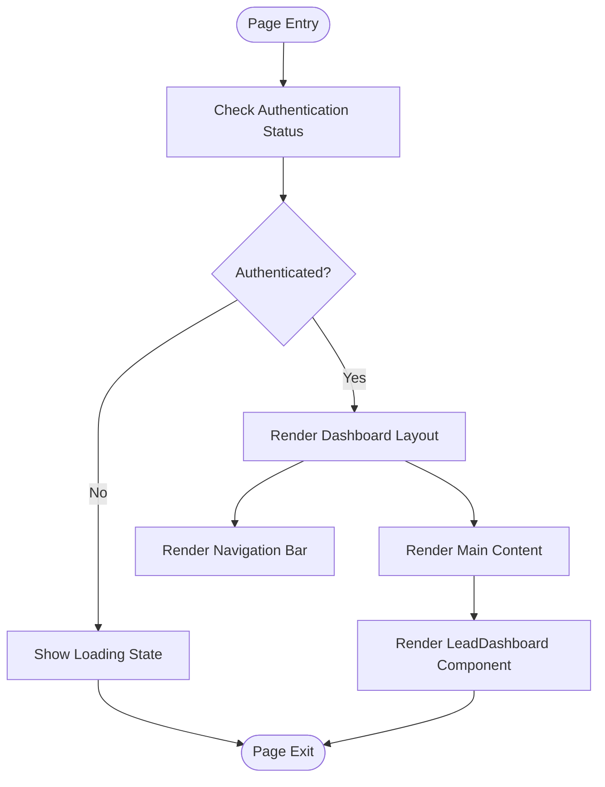
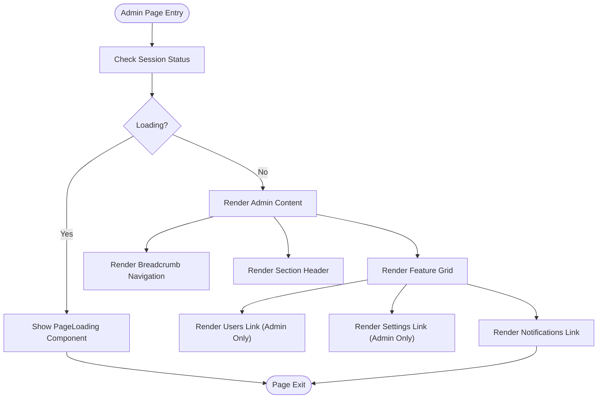
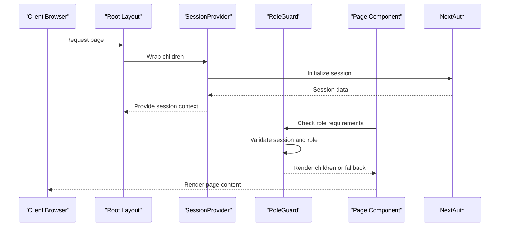

# Layouts and Shared UI Components

<cite>
**Referenced Files in This Document**   
- [layout.tsx](file://src/app/layout.tsx)
- [SessionProvider.tsx](file://src/components/auth/SessionProvider.tsx)
- [RoleGuard.tsx](file://src/components/auth/RoleGuard.tsx)
- [dashboard/page.tsx](file://src/app/dashboard/page.tsx)
- [admin/page.tsx](file://src/app/admin/page.tsx)
</cite>

## Table of Contents
1. [Introduction](#introduction)
2. [Layout System Overview](#layout-system-overview)
3. [Root Layout Structure](#root-layout-structure)
4. [Nested Layout Patterns](#nested-layout-patterns)
5. [Shared UI Components](#shared-ui-components)
6. [Authentication and Role-Based Rendering](#authentication-and-role-based-rendering)
7. [State Management in Layouts](#state-management-in-layouts)
8. [Performance Considerations](#performance-considerations)

## Introduction
This document provides comprehensive documentation for the layout system in the fund-track Next.js application. It details how layout files enable shared UI elements across route segments while maintaining nested layout hierarchies. The documentation covers reusability patterns, authentication integration, and best practices for state management within layouts.

## Layout System Overview
The fund-track application implements a hierarchical layout system using Next.js App Router conventions. The layout structure follows a root-based inheritance pattern where the root layout provides global UI elements and context providers, while specific sections implement their own UI patterns through page-level components rather than dedicated layout files.



**Diagram sources**
- [layout.tsx](file://src/app/layout.tsx)
- [dashboard/page.tsx](file://src/app/dashboard/page.tsx)
- [admin/page.tsx](file://src/app/admin/page.tsx)

**Section sources**
- [layout.tsx](file://src/app/layout.tsx)
- [dashboard/page.tsx](file://src/app/dashboard/page.tsx)
- [admin/page.tsx](file://src/app/admin/page.tsx)

## Root Layout Structure
The root layout serves as the foundation for all pages in the application, providing shared UI elements, global styles, and essential context providers. It is implemented in `src/app/layout.tsx` and wraps all route segments with common functionality.

```mermaid
classDiagram
class RootLayout {
+children : React.ReactNode
-plusJakartaSans : Font
+metadata : Metadata
+RootLayout({children}) : JSX.Element
}
RootLayout --> SessionProvider : "wraps"
RootLayout --> ServerInitializer : "includes"
RootLayout --> ErrorBoundary : "wraps"
SessionProvider --> NextAuthSessionProvider : "composes"
```

**Diagram sources**
- [layout.tsx](file://src/app/layout.tsx)
- [SessionProvider.tsx](file://src/components/auth/SessionProvider.tsx)

**Section sources**
- [layout.tsx](file://src/app/layout.tsx#L1-L35)

The root layout implements several key patterns:
- **Font loading**: Integrates Plus Jakarta Sans font with variable support
- **Global styling**: Applies font-sans class and font variable
- **Context providers**: Wraps children with SessionProvider for authentication state
- **Error boundaries**: Implements ErrorBoundary for global error handling
- **Server initialization**: Includes ServerInitializer for server-side setup

The layout uses the `SessionProvider` component to make authentication state available throughout the application, ensuring that all nested pages can access user session data without requiring individual authentication checks at the page level.

## Nested Layout Patterns
The application implements a flat layout hierarchy with only a root-level layout file. Instead of creating dedicated layout files for dashboard and admin sections, the application uses page-level components to implement section-specific UI patterns.

### Dashboard Layout Pattern
The dashboard section implements its layout within the page component itself, using conditional rendering based on authentication state:



**Diagram sources**
- [dashboard/page.tsx](file://src/app/dashboard/page.tsx#L1-L150)

**Section sources**
- [dashboard/page.tsx](file://src/app/dashboard/page.tsx#L1-L150)

The dashboard page uses the `AuthenticatedOnly` component to guard access, ensuring only authenticated users can view the content. It implements a navigation bar with user information, role-based menu items, and a sign-out button.

### Admin Layout Pattern
The admin section follows a similar pattern, with layout and access control implemented at the page level:



**Diagram sources**
- [admin/page.tsx](file://src/app/admin/page.tsx#L1-L110)

**Section sources**
- [admin/page.tsx](file://src/app/admin/page.tsx#L1-L110)

The admin layout includes breadcrumb navigation that helps users understand their location within the application hierarchy. It conditionally renders feature links based on user role, ensuring that only administrators can access certain functionality.

## Shared UI Components
The application implements shared UI elements through a combination of root layout components and reusable page-level patterns.

### Common UI Elements
The following UI elements are consistently implemented across sections:

- **Navigation**: Breadcrumb trails in admin sections
- **Headers**: Section-specific headers with icons and descriptions
- **Authentication state**: User information and role badges
- **Error handling**: Consistent error boundary implementation

The root layout provides the foundational UI through the `SessionProvider` and global error boundaries, while specific sections implement their own navigation and header patterns.

### Reusability Patterns
The application demonstrates several reusability patterns:

1. **Component composition**: Using `SessionProvider` and `ErrorBoundary` as wrappers
2. **Role-based components**: Implementing `AdminOnly` and `AuthenticatedOnly` convenience components
3. **Consistent styling**: Using Tailwind CSS classes for uniform appearance
4. **Navigation patterns**: Repeating breadcrumb and header patterns across admin pages

## Authentication and Role-Based Rendering
The layout system integrates closely with the application's authentication and authorization system through the `SessionProvider` and `RoleGuard` components.

### Authentication Flow


**Diagram sources**
- [layout.tsx](file://src/app/layout.tsx)
- [SessionProvider.tsx](file://src/components/auth/SessionProvider.tsx)
- [RoleGuard.tsx](file://src/components/auth/RoleGuard.tsx)

**Section sources**
- [SessionProvider.tsx](file://src/components/auth/SessionProvider.tsx#L1-L15)
- [RoleGuard.tsx](file://src/components/auth/RoleGuard.tsx#L1-L75)

### RoleGuard Implementation
The `RoleGuard` component provides fine-grained access control by checking user roles against allowed roles:

```typescript
export function RoleGuard({
  children,
  allowedRoles,
  fallback,
}: RoleGuardProps) {
  const { data: session, status } = useSession();

  if (status === "loading") return <PageLoading />;

  if (!session || !allowedRoles.includes(session.user.role)) {
    if (fallback !== undefined) return <>{fallback}</>;
    return <AccessDeniedUI />;
  }

  return <>{children}</>;
}
```

The component provides convenience wrappers like `AdminOnly` and `AuthenticatedOnly` that pre-configure common role requirements, promoting consistency across the application.

## State Management in Layouts
The application follows React best practices for state management within layout components, minimizing state in higher-level layouts and delegating to page-specific components.

### State Management Patterns
- **Root layout**: No local state, only context providers
- **Page layouts**: Minimal state for UI interactions (e.g., dropdown menus)
- **Loading states**: Centralized in PageLoading component
- **Session state**: Managed by NextAuth through SessionProvider

The dashboard page demonstrates proper state management by using `useState` and `useEffect` hooks only for UI-related state (like the context menu) rather than business logic:

```typescript
function ContextMenuButton() {
  const [open, setOpen] = useState(false);
  const ref = useRef<HTMLDivElement | null>(null);

  useEffect(() => {
    // Handle document clicks and keyboard events
    // to close the menu when clicking outside
  }, []);

  return (
    // Menu JSX
  );
}
```

This approach prevents unnecessary re-renders of the entire layout when UI state changes, as the menu state is contained within its own component.

## Performance Considerations
The layout system has been designed with performance in mind, following Next.js best practices for server-side rendering and client hydration.

### Optimization Strategies
- **Server-side rendering**: Root layout and metadata are rendered server-side
- **Client hydration**: Interactive elements are hydrated on the client
- **Conditional rendering**: Admin features are only rendered for authorized users
- **Code splitting**: Layout components are tree-shaken when not used

The single root layout approach minimizes layout nesting depth, reducing the number of wrapper components that need to be mounted and improving rendering performance. By avoiding deep layout hierarchies, the application reduces the potential for performance bottlenecks related to context propagation and re-renders.

The use of `PageLoading` as a fallback during authentication checks provides a consistent loading experience while minimizing the amount of JavaScript that needs to be downloaded and executed before the user sees content.