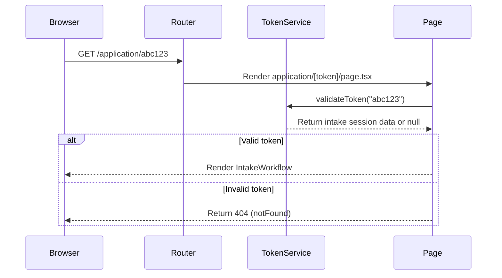
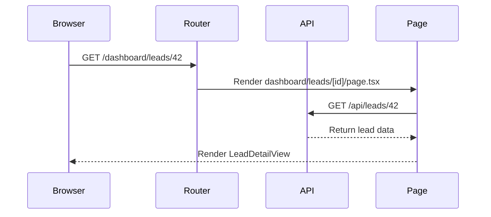
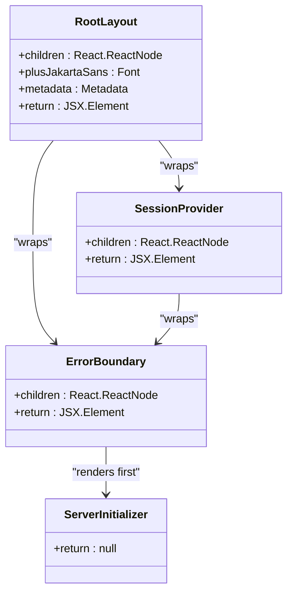
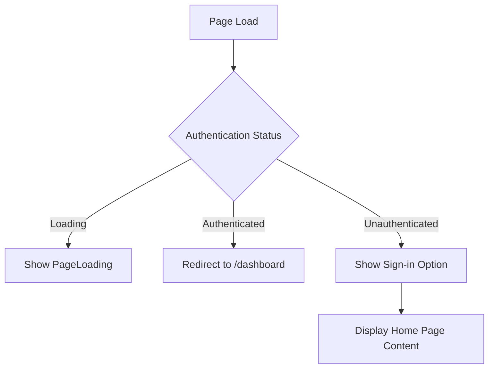
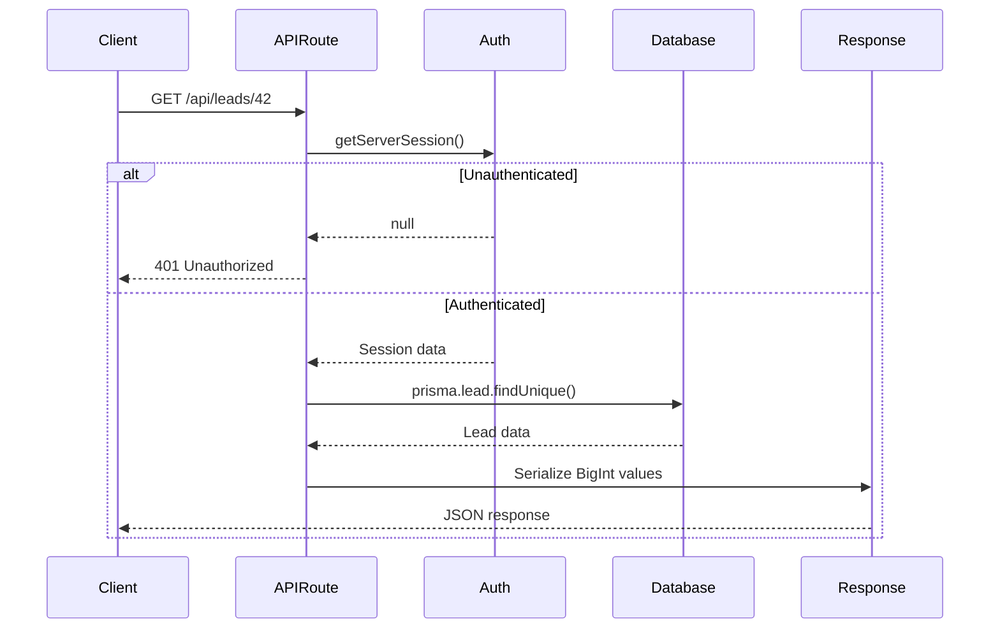
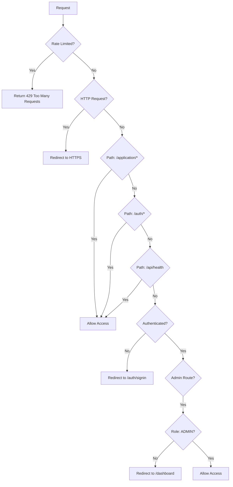
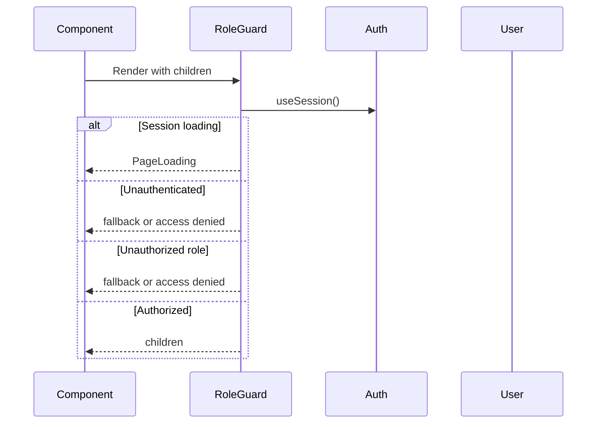

# Page Structure and Routing

<cite>
**Referenced Files in This Document**   
- [layout.tsx](file://src/app/layout.tsx)
- [page.tsx](file://src/app/page.tsx)
- [dashboard/page.tsx](file://src/app/dashboard/page.tsx)
- [admin/page.tsx](file://src/app/admin/page.tsx)
- [application/[token]/page.tsx](file://src/app/application/[token]/page.tsx)
- [dashboard/leads/[id]/page.tsx](file://src/app/dashboard/leads/[id]/page.tsx)
- [global-error.tsx](file://src/app/global-error.tsx)
- [PageLoading.tsx](file://src/components/PageLoading.tsx)
- [RoleGuard.tsx](file://src/components/auth/RoleGuard.tsx)
- [middleware.ts](file://src/middleware.ts)
- [api/leads/[id]/route.ts](file://src/app/api/leads/[id]/route.ts)
- [api/intake/[token]/route.ts](file://src/app/api/intake/[token]/route.ts)
</cite>

## Table of Contents
1. [Introduction](#introduction)
2. [Project Structure](#project-structure)
3. [File-Based Routing System](#file-based-routing-system)
4. [Dynamic Route Handling](#dynamic-route-handling)
5. [Layout Structure and Shared UI](#layout-structure-and-shared-ui)
6. [Key Page Components](#key-page-components)
7. [Server-Side Rendering and Data Fetching](#server-side-rendering-and-data-fetching)
8. [Loading States and Error Handling](#loading-states-and-error-handling)
9. [Route Protection and Authentication](#route-protection-and-authentication)
10. [API Routes and Backend Integration](#api-routes-and-backend-integration)
11. [Best Practices and Performance Optimization](#best-practices-and-performance-optimization)

## Introduction
This document provides a comprehensive overview of the Next.js App Router page structure and routing conventions in the fund-track application. It details the file-based routing system, dynamic route handling, layout architecture, and key components that define the application's navigation and user experience. The analysis covers server-side rendering patterns, data fetching strategies, authentication flows, and error handling mechanisms that ensure a robust and secure application.

## Project Structure
The fund-track application follows the Next.js App Router convention with a clear separation of concerns. The `src/app` directory contains all page components, API routes, and layout files. The structure is organized by feature areas including dashboard, admin, application intake, and development utilities. Shared components are located in the `src/components` directory, while services, utilities, and type definitions are organized in their respective directories.

```mermaid
graph TB
A[src/app] --> B[page.tsx]
A --> C[layout.tsx]
A --> D[dashboard]
A --> E[admin]
A --> F[application]
A --> G[api]
A --> H[auth]
A --> I[dev]
A --> J[global-error.tsx]
D --> K[page.tsx]
D --> L[leads/[id]/page.tsx]
E --> M[page.tsx]
E --> N[users/page.tsx]
E --> O[settings/page.tsx]
E --> P[notifications/page.tsx]
F --> Q[[token]/page.tsx]
G --> R[leads/[id]/route.ts]
G --> S[intake/[token]/route.ts]
G --> T[auth/[...nextauth]/route.ts]
```

**Diagram sources**
- [project_structure](file://README.md)

## File-Based Routing System
The application implements Next.js App Router's file-based routing system where the file structure directly maps to the application's URL routes. Each `page.tsx` file represents a route endpoint that is server-rendered by default. The routing hierarchy is determined by the directory structure within `src/app`.

The root `page.tsx` serves as the home page at the `/` route, while the `dashboard/page.tsx` handles the `/dashboard` route. The `admin` directory contains multiple pages including users, settings, and notifications, each accessible via their respective URLs. Special routes like `api` handle backend API endpoints, while `auth` manages authentication flows.

```mermaid
graph TB
A[/] --> B[page.tsx]
C[/dashboard] --> D[dashboard/page.tsx]
E[/admin] --> F[admin/page.tsx]
G[/admin/users] --> H[admin/users/page.tsx]
I[/admin/settings] --> J[admin/settings/page.tsx]
K[/admin/notifications] --> L[admin/notifications/page.tsx]
M[/auth/signin] --> N[auth/signin/page.tsx]
O[/application/[token]] --> P[application/[token]/page.tsx]
Q[/dashboard/leads/[id]] --> R[dashboard/leads/[id]/page.tsx]
```

**Diagram sources**
- [layout.tsx](file://src/app/layout.tsx)
- [page.tsx](file://src/app/page.tsx)
- [dashboard/page.tsx](file://src/app/dashboard/page.tsx)
- [admin/page.tsx](file://src/app/admin/page.tsx)

**Section sources**
- [layout.tsx](file://src/app/layout.tsx)
- [page.tsx](file://src/app/page.tsx)
- [dashboard/page.tsx](file://src/app/dashboard/page.tsx)
- [admin/page.tsx](file://src/app/admin/page.tsx)

## Dynamic Route Handling
The application extensively uses dynamic routes with bracket notation `[parameter]` to handle variable URL segments. Two primary dynamic route patterns are implemented: `[token]` for application intake and `[id]` for lead management.

The `[token]` parameter is used in the application intake flow at `application/[token]/page.tsx`, allowing prospects to access their personalized application form via a unique token. This token is validated server-side using the `TokenService` to ensure the session is valid and not expired.



**Diagram sources**
- [application/[token]/page.tsx](file://src/app/application/[token]/page.tsx)
- [api/intake/[token]/route.ts](file://src/app/api/intake/[token]/route.ts)

The `[id]` parameter is used in the dashboard for lead detail views at `dashboard/leads/[id]/page.tsx`. This allows staff to view and manage specific leads by their database ID. The dynamic parameter is extracted from the URL and passed to the `LeadDetailView` component for data fetching and display.



**Diagram sources**
- [dashboard/leads/[id]/page.tsx](file://src/app/dashboard/leads/[id]/page.tsx)
- [api/leads/[id]/route.ts](file://src/app/api/leads/[id]/route.ts)

**Section sources**
- [application/[token]/page.tsx](file://src/app/application/[token]/page.tsx)
- [dashboard/leads/[id]/page.tsx](file://src/app/dashboard/leads/[id]/page.tsx)
- [api/leads/[id]/route.ts](file://src/app/api/leads/[id]/route.ts)
- [api/intake/[token]/route.ts](file://src/app/api/intake/[token]/route.ts)

## Layout Structure and Shared UI
The application uses Next.js layout components to define shared UI elements across multiple pages. The root `layout.tsx` file provides the global structure for all pages, including HTML document setup, font loading, and global providers.

The `RootLayout` component wraps all pages with essential providers:
- `SessionProvider` for authentication state management
- `ErrorBoundary` for global error handling
- `ServerInitializer` for server-side initialization tasks



**Diagram sources**
- [layout.tsx](file://src/app/layout.tsx)

The layout implements a consistent typography system using the Plus Jakarta Sans font with CSS variables for easy theming. Metadata for the application is defined at the root level, setting the title and description for SEO purposes.

While the current implementation uses a single root layout, the App Router supports nested layouts that could be implemented for specific sections like admin or dashboard to provide section-specific UI elements while inheriting the global layout structure.

**Section sources**
- [layout.tsx](file://src/app/layout.tsx)

## Key Page Components
The application contains several key page components that serve different user roles and functionality.

### Home Page
The home page at `page.tsx` serves as the entry point for unauthenticated users. It displays the application branding and provides a sign-in link for staff members. The page uses client-side authentication state to redirect authenticated users to the dashboard.



**Section sources**
- [page.tsx](file://src/app/page.tsx)

### Dashboard Page
The dashboard page at `dashboard/page.tsx` is the main interface for authenticated staff members. It features a navigation bar with user information, role-based menu options, and a `LeadDashboard` component that displays lead management functionality.

The page implements client-side authentication checks using `useSession` and `RoleGuard` components to ensure only authenticated users can access the content. Unauthenticated users are redirected to the sign-in page.

**Section sources**
- [dashboard/page.tsx](file://src/app/dashboard/page.tsx)

### Admin Page
The admin page at `admin/page.tsx` provides access to administrative functions. Access to specific admin features is controlled by role-based conditional rendering, ensuring that only users with ADMIN role can see and access certain links like Users and Settings.

The page uses the `useSession` hook to determine the current user's role and conditionally renders admin links accordingly. This approach prevents unauthorized users from even seeing the links to restricted areas.

**Section sources**
- [admin/page.tsx](file://src/app/admin/page.tsx)

### Application Intake Page
The application intake page at `application/[token]/page.tsx` is a server-side rendered component that validates a token and displays a multi-step intake workflow. This page is accessible without authentication, allowing prospects to complete their funding application.

The page uses async/await to validate the token with `TokenService.validateToken()` and returns a 404 error if the token is invalid or expired. The UI emphasizes security with visual indicators for SSL encryption and bank-grade security.

**Section sources**
- [application/[token]/page.tsx](file://src/app/application/[token]/page.tsx)

## Server-Side Rendering and Data Fetching
The application leverages Next.js App Router's server-side rendering capabilities for improved performance and SEO. Pages are rendered on the server by default, with the option to use client-side rendering when needed.

### Server Components
Server components are used for pages that require data fetching before rendering, such as the application intake page. These components can directly import and use server-side code, including database queries and API calls, without exposing sensitive logic to the client.

The `IntakePage` component is a server component that validates the token and fetches intake session data before rendering the UI. This ensures that only valid sessions can access the application form.

### Client Components
Client components are used for interactive elements that require React hooks and browser APIs. The dashboard page uses client components for session management, navigation, and interactive UI elements like the context menu.

The `useEffect` hook is used to handle authentication state changes and perform client-side redirects. The `useState` and `useRef` hooks manage local component state and DOM references for interactive elements.

### Data Fetching Patterns
The application uses async components for server-side data fetching. When a component is marked as async, Next.js automatically handles the promise resolution and renders the component once data is available.

For API routes, the application implements RESTful endpoints that handle specific HTTP methods (GET, POST, PUT, DELETE). These routes use server-side authentication checks with `getServerSession()` to ensure only authorized users can access protected data.



**Diagram sources**
- [api/leads/[id]/route.ts](file://src/app/api/leads/[id]/route.ts)

**Section sources**
- [api/leads/[id]/route.ts](file://src/app/api/leads/[id]/route.ts)
- [application/[token]/page.tsx](file://src/app/application/[token]/page.tsx)

## Loading States and Error Handling
The application implements comprehensive loading and error handling strategies to provide a smooth user experience.

### Loading States
The `PageLoading` component provides a consistent loading indicator across the application. It displays a spinning animation with an optional message, centered in the viewport.

```typescript
export default function PageLoading({ message = "" }: PageLoadingProps) {
  return (
    <div className="min-h-screen flex items-center justify-center">
      <div className="flex items-center space-x-3">
        <div className="h-6 w-6 animate-spin rounded-full border-2 border-gray-300 border-t-transparent" />
        <div className="text-lg text-gray-900">{message}</div>
      </div>
    </div>
  );
}
```

This component is used in multiple places:
- During authentication state loading in the home and dashboard pages
- As a fallback in the `RoleGuard` component during authentication checks
- In various client components during data loading states

**Section sources**
- [PageLoading.tsx](file://src/components/PageLoading.tsx)

### Error Handling
The application implements a multi-layered error handling strategy:

1. **Global Error Boundary**: The `global-error.tsx` file provides a catch-all error handler for client-side errors. It logs errors in development and displays the default Next.js error page.

2. **Route-Level Error Handling**: API routes use try-catch blocks to handle errors and return appropriate HTTP status codes and error messages.

3. **Component-Level Error Handling**: Components like `RoleGuard` provide specific error states for unauthorized access.

The global error component is implemented as a client component that catches errors during client-side rendering:

```typescript
export default function GlobalError({ error }: { error: Error & { digest?: string } }) {
  useEffect(() => {
    if (process.env.NODE_ENV === 'development') {
      console.error('Global error caught:', error);
    }
  }, [error]);

  return (
    <html>
      <body>
        <NextError statusCode={0} />
      </body>
    </html>
  );
}
```

**Section sources**
- [global-error.tsx](file://src/app/global-error.tsx)
- [PageLoading.tsx](file://src/components/PageLoading.tsx)
- [RoleGuard.tsx](file://src/components/auth/RoleGuard.tsx)

## Route Protection and Authentication
The application implements a comprehensive authentication and authorization system using Next.js middleware, role guards, and API route protection.

### Middleware Implementation
The `middleware.ts` file defines application-wide routing rules and security policies. It uses `withAuth` from NextAuth to integrate authentication with the routing system.

Key middleware functions include:
- **Rate Limiting**: Protects against abuse by limiting requests from the same IP address
- **Security Headers**: Adds security headers like X-Robots-Tag and Strict-Transport-Security
- **HTTPS Enforcement**: Redirects HTTP requests to HTTPS in production
- **Route Protection**: Controls access to protected routes based on authentication and role



**Diagram sources**
- [middleware.ts](file://src/middleware.ts)

The middleware configuration matcher includes all protected routes:
```typescript
export const config = {
  matcher: [
    "/dashboard/:path*",
    "/api/:path*",
    "/application/:path*",
    "/admin/:path*"
  ]
}
```

**Section sources**
- [middleware.ts](file://src/middleware.ts)

### Role-Based Access Control
The application implements role-based access control using the `RoleGuard` component. This component checks the user's role against a list of allowed roles and either renders the protected content or a fallback (or access denied UI).

The `RoleGuard` component is used in multiple contexts:
- `AdminOnly`: Restricts access to ADMIN role only
- `AuthenticatedOnly`: Allows access to any authenticated user (ADMIN or USER)
- Custom role checks with specific allowed roles



**Diagram sources**
- [RoleGuard.tsx](file://src/components/auth/RoleGuard.tsx)

**Section sources**
- [RoleGuard.tsx](file://src/components/auth/RoleGuard.tsx)
- [middleware.ts](file://src/middleware.ts)

## API Routes and Backend Integration
The application's API routes provide backend functionality for data management, authentication, and system operations.

### RESTful API Design
API routes follow RESTful conventions with clear URL structures and appropriate HTTP methods:
- `GET /api/leads/[id]` - Retrieve a specific lead
- `PUT /api/leads/[id]` - Update a lead
- `DELETE /api/leads/[id]` - Delete a lead
- `GET /api/intake/[token]` - Validate intake token

The API routes are located in `src/app/api` and use Next.js route handlers to define the request processing logic.

### Data Validation and Security
API routes implement comprehensive data validation and security measures:
- Authentication checks using `getServerSession()`
- Input validation for parameters and request bodies
- Type checking using Prisma and TypeScript
- Error handling with appropriate HTTP status codes

The lead API route demonstrates sophisticated validation logic, particularly for status changes which are handled through a dedicated `LeadStatusService` to ensure proper audit logging and business logic enforcement.

### Integration with External Services
The API routes integrate with various services:
- `prisma` for database operations
- `TokenService` for token validation and management
- `LeadStatusService` for business logic around lead status changes
- `NotificationService` for sending notifications

This service-oriented architecture keeps the API routes focused on request handling while delegating business logic to dedicated service classes.

**Section sources**
- [api/leads/[id]/route.ts](file://src/app/api/leads/[id]/route.ts)
- [api/intake/[token]/route.ts](file://src/app/api/intake/[token]/route.ts)
- [services/](file://src/services/)

## Best Practices and Performance Optimization
The application follows Next.js best practices and implements various performance optimizations.

### Code Organization
The application uses a feature-based organization structure that groups related files together. This improves maintainability and makes it easier to locate related functionality.

The separation between server and client components is clearly defined, with server components handling data fetching and client components managing interactivity.

### Performance Optimizations
Several performance optimizations are implemented:
- **Server-side Rendering**: Critical pages are server-rendered for faster initial load
- **Code Splitting**: Next.js automatically code-splits pages and components
- **Static Assets**: Images and fonts are optimized and served efficiently
- **Caching**: API responses could be cached (though not explicitly shown in the code)

### Security Best Practices
The application implements multiple security layers:
- **HTTPS Enforcement**: Redirects HTTP to HTTPS in production
- **Secure Cookies**: Sets Secure and SameSite attributes on cookies
- **Rate Limiting**: Prevents abuse of API endpoints
- **Input Validation**: Validates all user inputs and parameters
- **Role-Based Access**: Enforces authorization at multiple levels

### Development and Testing
The application includes development utilities in the `dev` directory for testing and debugging:
- `test-legacy-db` - Test connectivity with the legacy database
- `test-notifications` - Test notification system
- Various API endpoints for development testing

These tools help ensure the application functions correctly and can be easily debugged when issues arise.

**Section sources**
- [middleware.ts](file://src/middleware.ts)
- [layout.tsx](file://src/app/layout.tsx)
- [services/](file://src/services/)