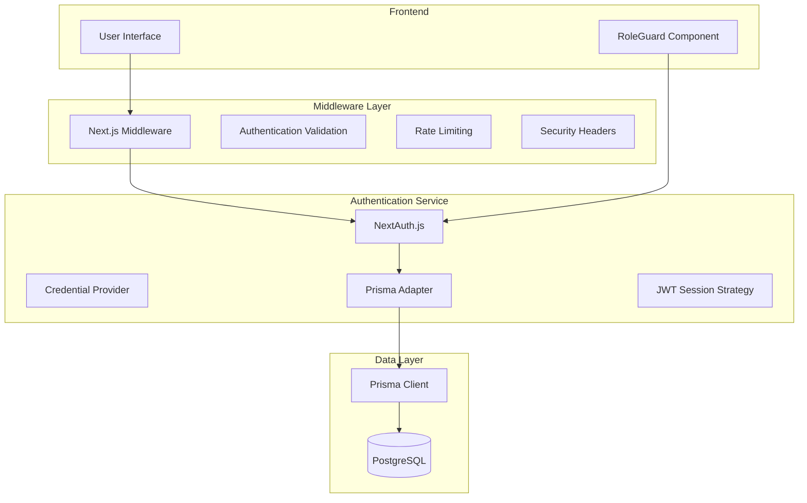
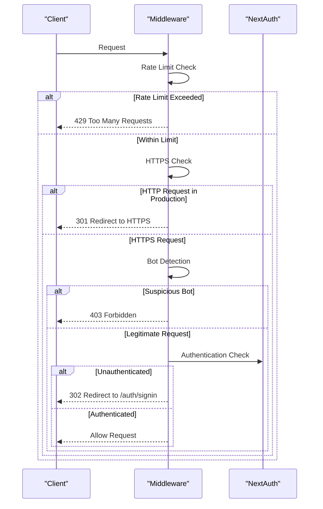
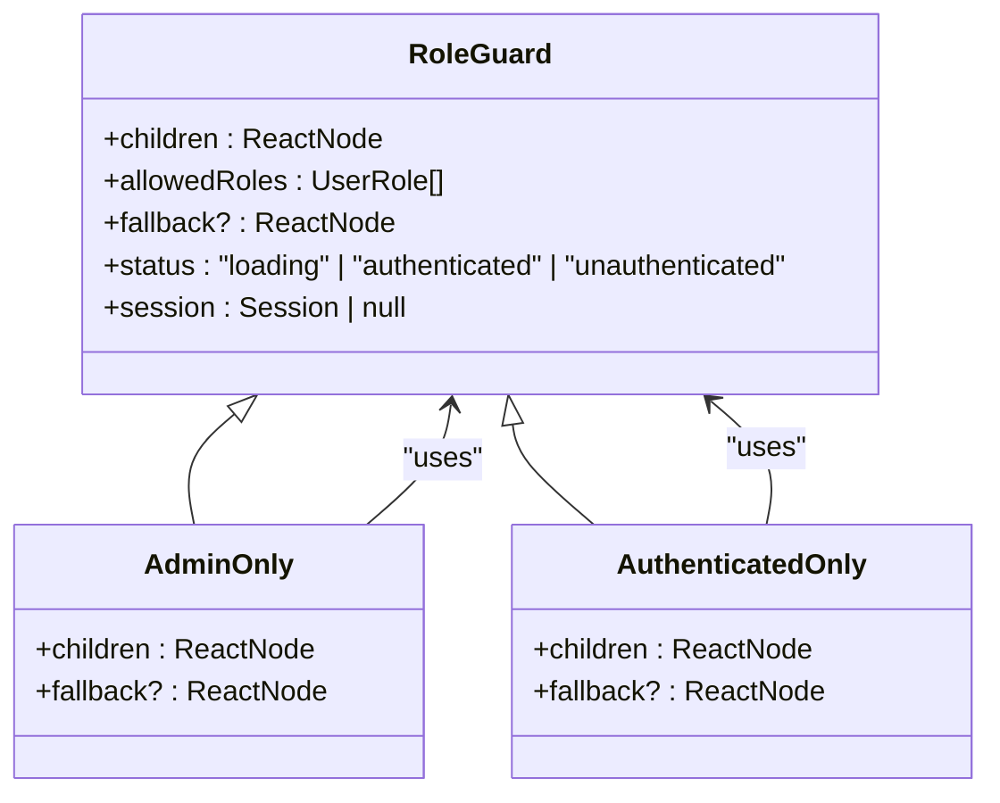
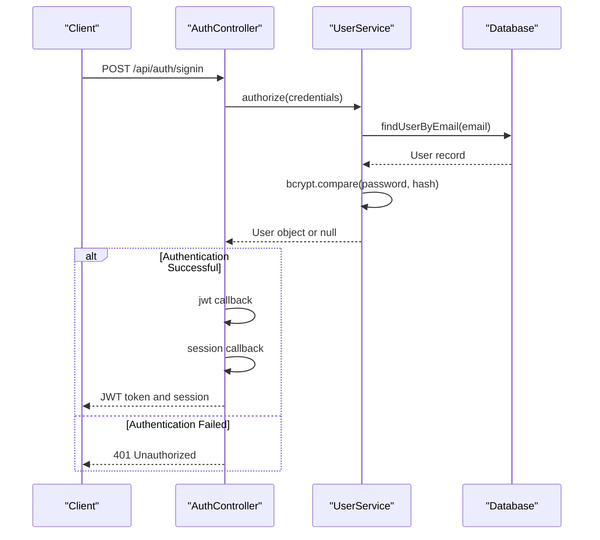
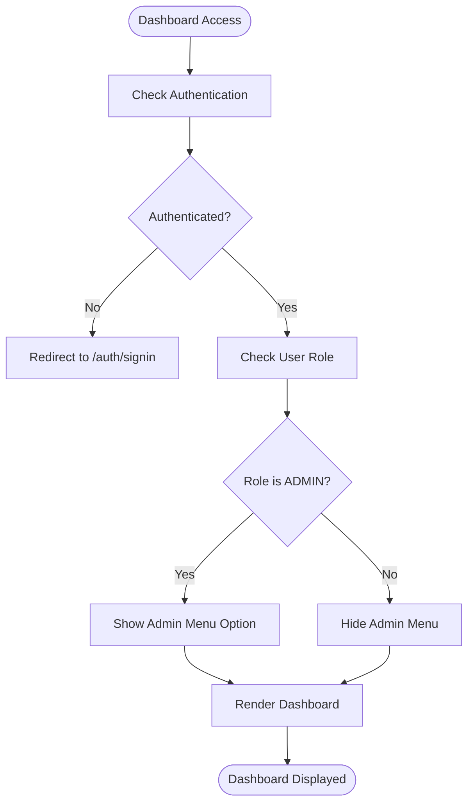
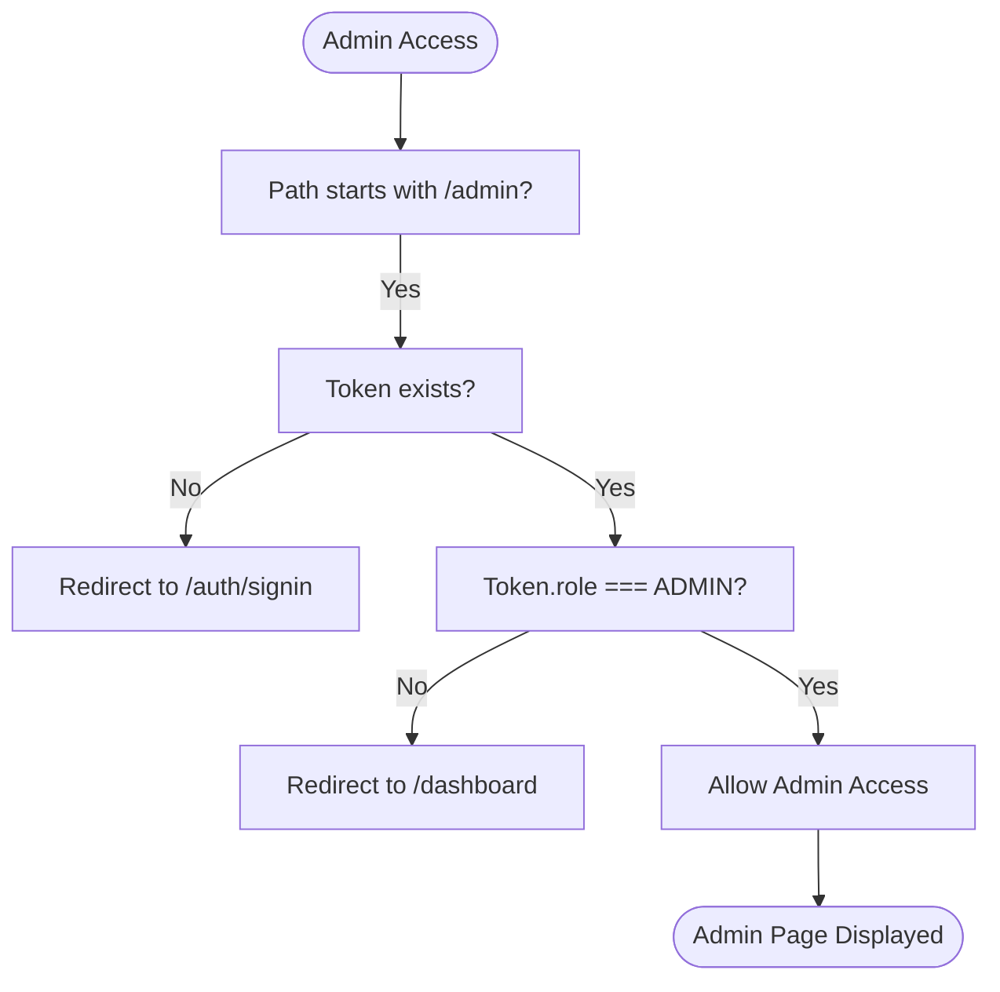
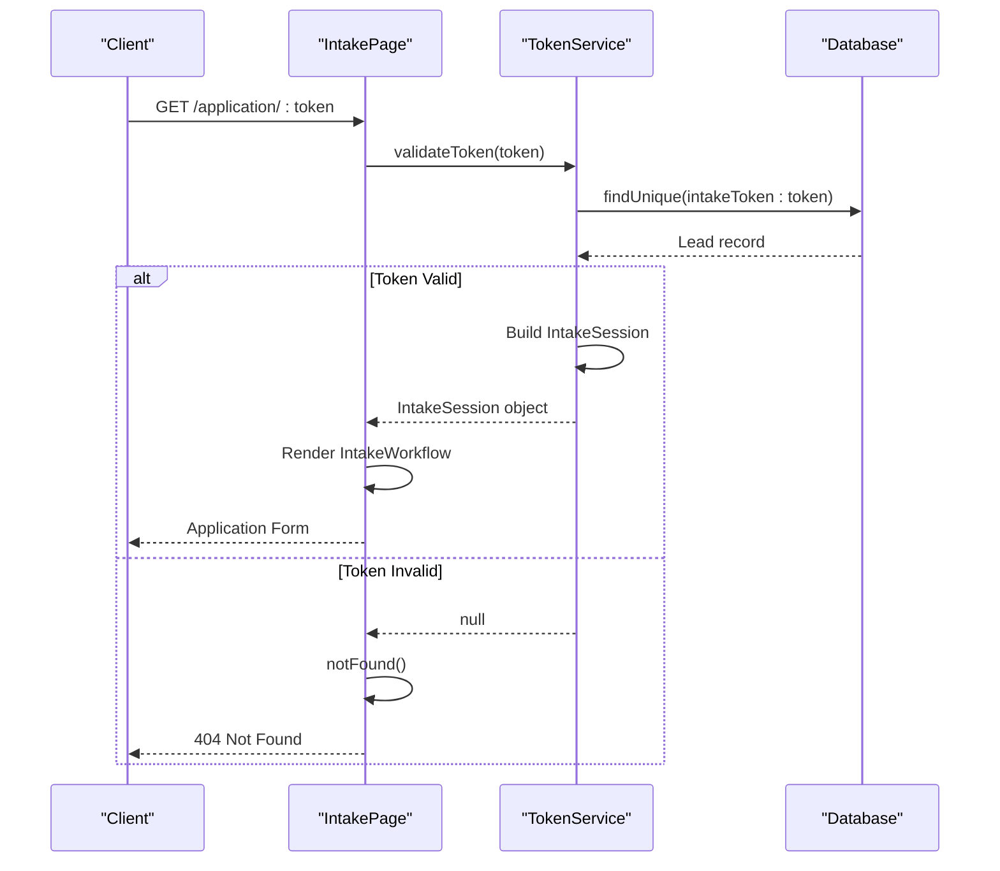

# Route Protection and Authentication

<cite>
**Referenced Files in This Document**   
- [middleware.ts](file://src/middleware.ts)
- [RoleGuard.tsx](file://src/components/auth/RoleGuard.tsx)
- [auth.ts](file://src/lib/auth.ts)
- [page.tsx](file://src/app/dashboard/page.tsx)
- [page.tsx](file://src/app/admin/page.tsx)
- [page.tsx](file://src/app/application/[token]/page.tsx)
- [route.ts](file://src/app/api/intake/[token]/route.ts)
- [TokenService.ts](file://src/services/TokenService.ts)
</cite>

## Table of Contents
1. [Introduction](#introduction)
2. [Authentication Architecture Overview](#authentication-architecture-overview)
3. [Middleware Implementation](#middleware-implementation)
4. [RoleGuard Component](#roleguard-component)
5. [NextAuth.js Integration](#nextauthjs-integration)
6. [Protected Routes Examples](#protected-routes-examples)
7. [Token Validation Process](#token-validation-process)
8. [Security Best Practices](#security-best-practices)
9. [Common Vulnerabilities](#common-vulnerabilities)
10. [Troubleshooting Authentication Issues](#troubleshooting-authentication-issues)
11. [User Experience Considerations](#user-experience-considerations)

## Introduction
The fund-track application implements a comprehensive authentication and route protection system using NextAuth.js, custom middleware, and role-based access control components. This document details the implementation of authentication mechanisms at both the routing and component levels, covering the integration between NextAuth.js, the auth library, middleware, and client-side protection components. The system protects sensitive routes in the dashboard and admin sections while allowing unauthenticated access to application intake flows through secure token-based authentication.

## Authentication Architecture Overview
The authentication system in fund-track follows a multi-layered approach combining server-side middleware protection with client-side role-based access control. The architecture integrates NextAuth.js for authentication management, custom middleware for route-level protection, and React components for UI-level access control.

**Diagram sources**
- [middleware.ts](file://src/middleware.ts)
- [auth.ts](file://src/lib/auth.ts)
- [RoleGuard.tsx](file://src/components/auth/RoleGuard.tsx)

**Section sources**
- [middleware.ts](file://src/middleware.ts)
- [auth.ts](file://src/lib/auth.ts)

## Middleware Implementation
The middleware.ts file implements request interception and authentication validation at the routing level using NextAuth.js's withAuth function. It applies various security measures including rate limiting, HTTPS enforcement, and bot detection.

**Diagram sources**
- [middleware.ts](file://src/middleware.ts#L0-L190)

**Section sources**
- [middleware.ts](file://src/middleware.ts#L0-L190)

The middleware implements several key security features:

**Rate Limiting Configuration**
- Window: 15 minutes (configurable via RATE_LIMIT_WINDOW_MS)
- Maximum requests: 100 per window (configurable via RATE_LIMIT_MAX_REQUESTS)
- Disabled in development by default

**Security Headers**
- X-Robots-Tag: noindex, nofollow
- Strict-Transport-Security: Enabled in production
- Secure cookies with SameSite=Strict in production

**Bot Detection**
- Blocks requests from bots/crawlers/spiders on API routes
- Allows Googlebot for SEO purposes
- Applies only to sensitive API endpoints

## RoleGuard Component
The RoleGuard component provides client-side role-based access control, allowing components to restrict access based on user roles. It works in conjunction with the server-side middleware to provide a comprehensive protection system.

**Diagram sources**
- [RoleGuard.tsx](file://src/components/auth/RoleGuard.tsx#L0-L75)

**Section sources**
- [RoleGuard.tsx](file://src/components/auth/RoleGuard.tsx#L0-L75)

The RoleGuard component has the following key features:

**Props Interface**
- children: Content to render for authorized users
- allowedRoles: Array of UserRole enum values that can access the content
- fallback: Optional content to render for unauthorized users

**Behavior**
- Shows loading state while session is being retrieved
- Denies access if user is not authenticated or role is not in allowedRoles
- Renders fallback content if provided, otherwise shows "Access denied" UI
- Provides convenience components: AdminOnly and AuthenticatedOnly

## NextAuth.js Integration
The authentication system integrates NextAuth.js with the application through a custom configuration that uses credentials-based authentication and JWT session strategy.

**Diagram sources**
- [auth.ts](file://src/lib/auth.ts#L0-L70)

**Section sources**
- [auth.ts](file://src/lib/auth.ts#L0-L70)

The auth.ts file configures NextAuth.js with the following key elements:

**Authentication Options**
- Adapter: PrismaAdapter connected to the application's Prisma client
- Providers: Credentials provider with email and password fields
- Session strategy: JWT (JSON Web Token)
- Pages: Custom sign-in page at /auth/signin

**Callbacks**
- jwt: Adds user ID and role to the JWT token
- session: Transfers ID and role from token to session object

**Credentials Provider**
- Validates email and password inputs
- Retrieves user from database by email
- Compares provided password with stored hash using bcrypt
- Returns user object with id, email, and role on successful authentication

## Protected Routes Examples
The application implements protected routes in both the dashboard and admin sections, using a combination of middleware and component-level protection.

### Dashboard Routes
The dashboard page uses the AuthenticatedOnly component to ensure only authenticated users can access it.

**Diagram sources**
- [page.tsx](file://src/app/dashboard/page.tsx#L0-L150)

**Section sources**
- [page.tsx](file://src/app/dashboard/page.tsx#L0-L150)

### Admin Routes
The admin section implements additional role-based protection, allowing access only to ADMIN users.

**Diagram sources**
- [middleware.ts](file://src/middleware.ts#L108-L115)
- [page.tsx](file://src/app/admin/page.tsx#L0-L110)

**Section sources**
- [middleware.ts](file://src/middleware.ts#L108-L115)
- [page.tsx](file://src/app/admin/page.tsx#L0-L110)

The admin page conditionally renders links based on user role, ensuring that unauthorized users cannot even see admin functionality options.

## Token Validation Process
The application intake flow uses a token-based authentication system that allows unauthenticated users to complete funding applications securely.

**Diagram sources**
- [page.tsx](file://src/app/application/[token]/page.tsx#L0-L221)
- [TokenService.ts](file://src/services/TokenService.ts#L43-L77)
- [route.ts](file://src/app/api/intake/[token]/route.ts#L0-L36)

**Section sources**
- [page.tsx](file://src/app/application/[token]/page.tsx#L0-L221)
- [TokenService.ts](file://src/services/TokenService.ts#L43-L77)

The token validation process involves:

**Token Generation**
- 32-byte cryptographically secure random token
- Generated using Node.js crypto module
- Assigned to a lead record in the database

**Validation Process**
- Queries database for lead with matching intakeToken
- Returns null if no matching lead or token is invalid
- Builds IntakeSession object with lead data and completion status
- Used in both API routes and page components

**Security Features**
- Tokens are not stored in sessions or cookies
- Each token is tied to a specific lead record
- Application form displays security indicators (SSL, encryption)
- No access to other application data through token

## Security Best Practices
The application implements several security best practices to protect user data and prevent common vulnerabilities.

**Security Headers Implementation**
- X-Robots-Tag prevents search engine indexing of sensitive pages
- HSTS (HTTP Strict Transport Security) enforces HTTPS in production
- Secure cookies with SameSite=Strict prevent CSRF attacks
- Rate limiting prevents brute force attacks

**Authentication Security**
- Passwords hashed with bcrypt
- JWT tokens used for session management
- Role information included in JWT for efficient authorization
- Prisma adapter ensures secure database interactions

**Input Validation**
- All API routes validate input parameters
- Token validation checks for existence and format
- Environment variables used for configuration
- Error handling prevents information leakage

**Production Security**
- Dev endpoints disabled in production by default
- Health checks accessible without authentication
- Sensitive routes protected from bot access
- Comprehensive logging for security events

## Common Vulnerabilities
Despite the robust security measures, potential vulnerabilities exist that should be monitored and addressed.

**Token Security Considerations**
- Tokens are long and cryptographically secure
- No expiration time currently implemented
- Tokens could be shared or leaked through insecure channels
- Recommendation: Implement token expiration and refresh mechanism

**Rate Limiting Limitations**
- In-memory rate limiting store not suitable for production
- Does not persist across server restarts
- Not distributed across multiple instances
- Recommendation: Use Redis or similar for distributed rate limiting

**Bot Detection Gaps**
- Relies on user-agent string which can be spoofed
- Only blocks known bot patterns
- Googlebot is explicitly allowed
- Recommendation: Implement additional bot detection methods

**Error Handling Risks**
- Generic error messages prevent information leakage
- Some error details logged to console
- No centralized error monitoring
- Recommendation: Implement comprehensive error tracking

## Troubleshooting Authentication Issues
When authentication issues occur, the following steps can help diagnose and resolve problems.

**Common Issues and Solutions**

**Issue: Users redirected to sign-in page repeatedly**
- Check if authentication token is being properly set
- Verify JWT secret is consistent across deployments
- Ensure secure cookies are properly configured in production
- Confirm session strategy is correctly implemented

**Issue: Admin users cannot access admin pages**
- Verify user role is correctly set in database
- Check if token contains role information
- Ensure middleware is properly configured for admin routes
- Confirm environment variables are correctly set

**Issue: Rate limiting blocking legitimate users**
- Check rate limiting configuration values
- Verify in-memory store is functioning correctly
- Monitor for legitimate bots being incorrectly blocked
- Consider adjusting rate limits for production traffic

**Issue: Token validation failing for valid tokens**
- Verify token exists in database
- Check for typos or encoding issues in token
- Confirm database connection is working
- Validate TokenService implementation

**Debugging Tools**
- Environment variables to enable dev endpoints
- Test scripts for intake completion workflow
- Health check endpoints to verify system status
- Comprehensive logging for authentication events

## User Experience Considerations
The authentication system balances security with user experience through thoughtful design choices.

**Seamless Authentication Flow**
- Automatic redirection to sign-in page when unauthenticated
- Preservation of intended destination after authentication
- Clear error messages for authentication failures
- Loading states during authentication checks

**Intake Process Experience**
- Secure application branding with visual security indicators
- Clear progress indication through multi-step workflow
- Responsive design for various device sizes
- Trust indicators to build user confidence

**Error Handling UX**
- 404 page for invalid tokens (not found)
- Access denied page with clear explanation
- Loading states during authentication checks
- Graceful degradation when services are unavailable

**Security Communication**
- Visual indicators of security (SSL, encryption badges)
- Disclaimer text for application authorization
- Contact information for support
- Professional design to build trust