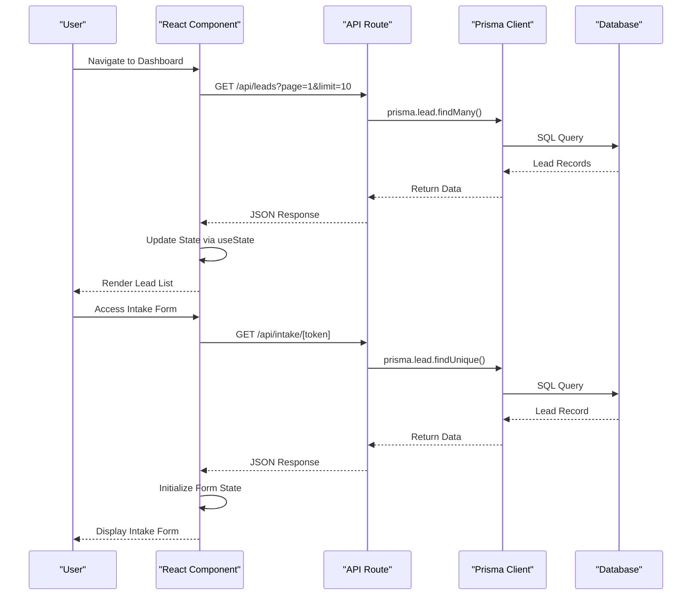
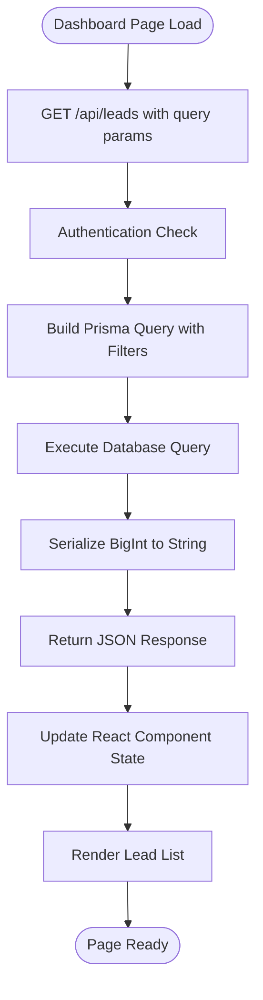
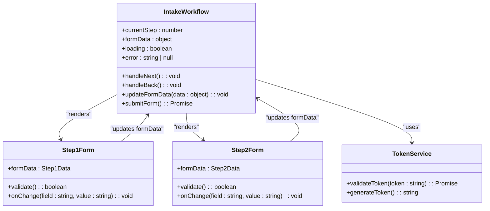
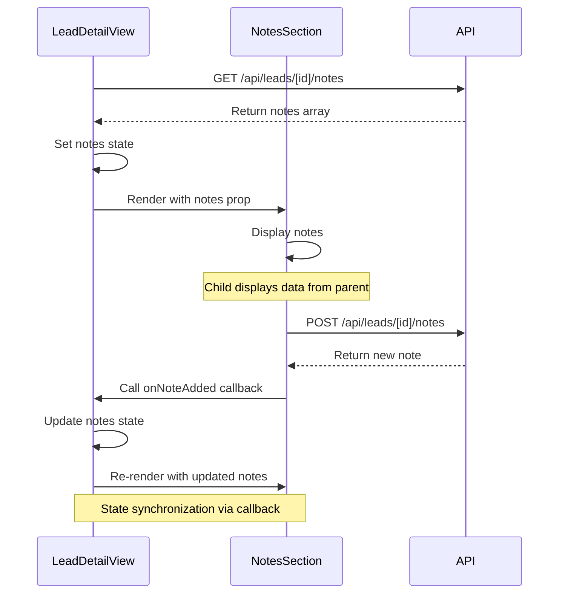
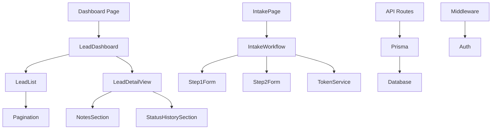

# State Management and Data Flow

<cite>
**Referenced Files in This Document**   
- [route.ts](file://src/app/api/leads/route.ts)
- [page.tsx](file://src/app/dashboard/page.tsx)
- [LeadDashboard.tsx](file://src/components/dashboard/LeadDashboard.tsx)
- [LeadList.tsx](file://src/components/dashboard/LeadList.tsx)
- [TokenService.ts](file://src/services/TokenService.ts)
- [page.tsx](file://src/app/application/[token]/page.tsx)
- [IntakeWorkflow.tsx](file://src/components/intake/IntakeWorkflow.tsx)
- [Step1Form.tsx](file://src/components/intake/Step1Form.tsx)
- [Step2Form.tsx](file://src/components/intake/Step2Form.tsx)
- [LeadDetailView.tsx](file://src/components/dashboard/LeadDetailView.tsx)
- [NotesSection.tsx](file://src/components/dashboard/NotesSection.tsx)
</cite>

## Table of Contents
1. [Introduction](#introduction)
2. [Project Structure](#project-structure)
3. [Core Components](#core-components)
4. [Architecture Overview](#architecture-overview)
5. [Detailed Component Analysis](#detailed-component-analysis)
6. [Dependency Analysis](#dependency-analysis)
7. [Performance Considerations](#performance-considerations)
8. [Troubleshooting Guide](#troubleshooting-guide)
9. [Conclusion](#conclusion)

## Introduction
This document provides a comprehensive analysis of state management and data flow within the fund-track frontend application. It details how server-side data from API routes is consumed by React components using modern async patterns, and how React hooks manage local state and side effects. The document also explains the integration between Prisma-backed API endpoints and key UI components such as dashboards and intake forms, including state synchronization, form handling, and real-time updates.

## Project Structure
The fund-track application follows a Next.js App Router architecture with a clear separation of concerns. The frontend components are organized under `src/components`, while API routes reside in `src/app/api`. Data access is abstracted through Prisma ORM, and business logic is encapsulated in services under `src/services`.

Key directories include:
- `src/app`: Page components and API routes
- `src/components`: Reusable UI components for dashboard and intake workflows
- `src/lib`: Utility functions, authentication, logging, and error handling
- `src/services`: Business logic services (e.g., TokenService, NotificationService)
- `prisma`: Database schema and migrations

This structure supports scalable state management by isolating data fetching, presentation, and business logic.

```mermaid
graph TB
subgraph "Frontend"
Dashboard[Dashboard Page]
Intake[Intake Page]
LeadList[LeadList Component]
IntakeWorkflow[IntakeWorkflow Component]
end
subgraph "API Layer"
LeadsAPI[/api/leads]
LeadDetailAPI[/api/leads/[id]]
IntakeAPI[/api/intake/[token]]
end
subgraph "Data Layer"
Prisma[Prisma Client]
Database[(PostgreSQL)]
end
Dashboard --> LeadsAPI
Intake --> IntakeAPI
LeadList --> LeadDetailAPI
LeadsAPI --> Prisma
IntakeAPI --> Prisma
Prisma --> Database
```

**Diagram sources**
- [route.ts](file://src/app/api/leads/route.ts)
- [page.tsx](file://src/app/dashboard/page.tsx)
- [page.tsx](file://src/app/application/[token]/page.tsx)

## Core Components
The core components involved in state management and data flow are:
- **LeadDashboard**: Main dashboard container that orchestrates data display
- **LeadList**: Displays paginated leads with filtering capabilities
- **IntakeWorkflow**: Manages multi-step form state for user onboarding
- **TokenService**: Handles secure token generation and validation for intake sessions
- **API Routes**: Server-side endpoints that expose Prisma-managed data to the frontend

These components work together to provide a seamless user experience with proper state synchronization and error handling.

**Section sources**
- [LeadDashboard.tsx](file://src/components/dashboard/LeadDashboard.tsx)
- [IntakeWorkflow.tsx](file://src/components/intake/IntakeWorkflow.tsx)
- [TokenService.ts](file://src/services/TokenService.ts)

## Architecture Overview
The application follows a client-server architecture where the Next.js frontend consumes REST-like API routes that interface with a PostgreSQL database via Prisma. Data flows from the server to the client through fetch operations, with React managing component state using hooks.

Authentication is handled via NextAuth, with middleware protecting routes. The intake workflow uses token-based authentication that allows unauthenticated access to specific forms while maintaining security.



**Diagram sources**
- [route.ts](file://src/app/api/leads/route.ts)
- [page.tsx](file://src/app/dashboard/page.tsx)
- [page.tsx](file://src/app/application/[token]/page.tsx)

## Detailed Component Analysis

### Lead Dashboard Data Flow
The dashboard page fetches lead data from the `/api/leads` endpoint using server-side rendering. This ensures data is available before the page renders, eliminating loading states on initial load.



**Section sources**
- [page.tsx](file://src/app/dashboard/page.tsx)
- [route.ts](file://src/app/api/leads/route.ts)

### Intake Workflow State Management
The intake workflow uses a multi-step form pattern with state managed through React's `useState` hook. Each step's data is collected and temporarily stored before submission.



**Diagram sources**
- [IntakeWorkflow.tsx](file://src/components/intake/IntakeWorkflow.tsx)
- [Step1Form.tsx](file://src/components/intake/Step1Form.tsx)
- [Step2Form.tsx](file://src/components/intake/Step2Form.tsx)
- [TokenService.ts](file://src/services/TokenService.ts)

### Parent-Child State Synchronization
Components like `LeadDetailView` and `NotesSection` demonstrate effective parent-child state synchronization. The parent component manages the overall state and passes down data and update functions to children.



**Diagram sources**
- [LeadDetailView.tsx](file://src/components/dashboard/LeadDetailView.tsx)
- [NotesSection.tsx](file://src/components/dashboard/NotesSection.tsx)

## Dependency Analysis
The application has a well-defined dependency hierarchy that prevents circular dependencies and promotes maintainability.



**Diagram sources**
- [page.tsx](file://src/app/dashboard/page.tsx)
- [LeadDashboard.tsx](file://src/components/dashboard/LeadDashboard.tsx)
- [IntakeWorkflow.tsx](file://src/components/intake/IntakeWorkflow.tsx)
- [route.ts](file://src/app/api/leads/route.ts)

## Performance Considerations
The application implements several performance optimizations:
- **Server-side rendering**: Data is fetched on the server to minimize client-side loading
- **Pagination**: Large datasets are paginated to reduce payload size
- **BigInt serialization**: Proper handling of BigInt values prevents JSON serialization errors
- **Error boundaries**: Components are wrapped in error boundaries to prevent crashes
- **Loading states**: Components display loading indicators during async operations

The API includes comprehensive logging and monitoring to identify performance bottlenecks.

## Troubleshooting Guide
Common issues and their solutions:

**Issue**: Data not loading on dashboard
- **Check**: Authentication status and session validity
- **Verify**: API endpoint `/api/leads` returns data when tested directly
- **Inspect**: Network tab for 401/403 errors indicating authentication problems

**Issue**: Intake form not loading
- **Check**: Token validity and expiration
- **Verify**: Database record has matching `intakeToken`
- **Test**: `TokenService.validateToken()` returns expected data

**Issue**: Form state not persisting between steps
- **Check**: State management in `IntakeWorkflow` component
- **Verify**: `formData` object is properly updated and passed to children
- **Inspect**: React DevTools for state changes

**Issue**: Pagination not working correctly
- **Check**: Query parameters (`page`, `limit`) in API request
- **Verify**: Total count and pagination metadata in response
- **Test**: Edge cases like page 1, last page, invalid page numbers

**Section sources**
- [route.ts](file://src/app/api/leads/route.ts)
- [page.tsx](file://src/app/dashboard/page.tsx)
- [IntakeWorkflow.tsx](file://src/components/intake/IntakeWorkflow.tsx)

## Conclusion
The fund-track application demonstrates robust state management and data flow patterns. It effectively combines server-side data fetching with client-side state management to create a responsive user interface. The use of React hooks, proper error handling, and well-structured component hierarchies makes the codebase maintainable and scalable. The integration between Prisma, API routes, and React components is seamless, with clear data flow and state synchronization patterns that support both dashboard and intake workflows.