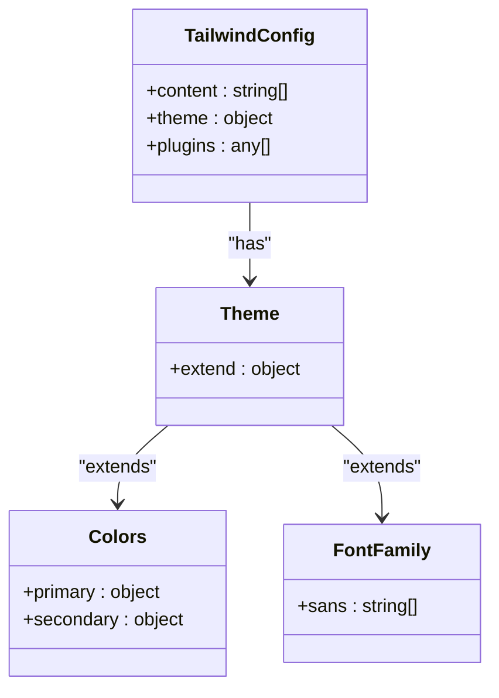
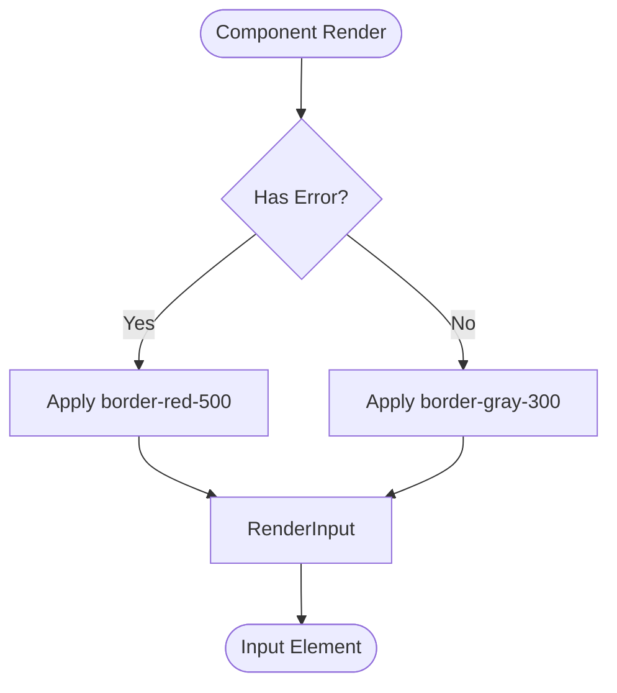
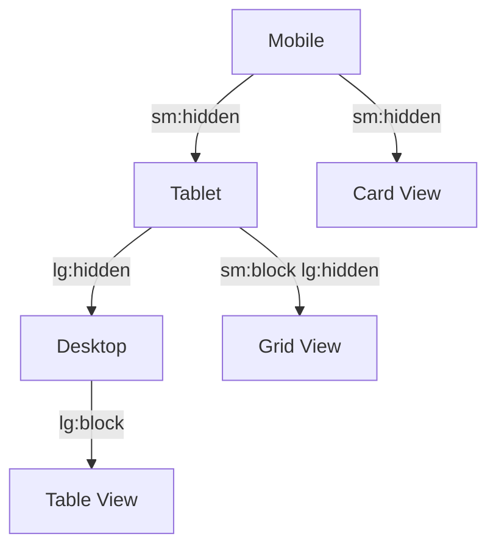

# Styling Strategy and UX Patterns

<cite>
**Referenced Files in This Document**   
- [tailwind.config.ts](file://tailwind.config.ts)
- [globals.css](file://src/app/globals.css)
- [InputField.tsx](file://src/components/intake/InputField.tsx)
- [SelectField.tsx](file://src/components/intake/SelectField.tsx)
- [LeadList.tsx](file://src/components/dashboard/LeadList.tsx)
- [StatusHistorySection.tsx](file://src/components/dashboard/StatusHistorySection.tsx)
- [SettingsCard.tsx](file://src/components/admin/SettingsCard.tsx)
- [SettingInput.tsx](file://src/components/admin/SettingInput.tsx)
- [PageLoading.tsx](file://src/components/PageLoading.tsx)
- [ConnectivityCheck.tsx](file://src/components/admin/ConnectivityCheck.tsx)
</cite>

## Table of Contents
1. [Introduction](#introduction)
2. [Tailwind CSS Configuration](#tailwind-css-configuration)
3. [Component-Level Styling Practices](#component-level-styling-practices)
4. [Responsive Design Implementation](#responsive-design-implementation)
5. [Form Components and UX Patterns](#form-components-and-ux-patterns)
6. [Data Display Components](#data-display-components)
7. [Admin Interface Components](#admin-interface-components)
8. [Accessibility Implementation](#accessibility-implementation)
9. [Animations and Transitions](#animations-and-transitions)
10. [Loading States and Visual Feedback](#loading-states-and-visual-feedback)

## Introduction
This document provides a comprehensive overview of the styling methodology and user experience patterns implemented in the fund-track application. The application leverages Tailwind CSS for utility-first styling, enabling rapid development of consistent and responsive UI components. The styling strategy emphasizes accessibility, responsive design, and consistent UX patterns across various interface types including forms, data displays, and administrative interfaces. This documentation details the implementation of Tailwind CSS, component-level styling practices, responsive layouts, accessibility features, and visual feedback mechanisms that contribute to a cohesive user experience.

## Tailwind CSS Configuration

The application's styling system is built on Tailwind CSS, configured through the `tailwind.config.ts` file. This configuration extends the default theme with custom colors and font families while maintaining the utility-first approach that enables rapid UI development.



**Diagram sources**
- [tailwind.config.ts](file://tailwind.config.ts#L1-L44)

**Section sources**
- [tailwind.config.ts](file://tailwind.config.ts#L1-L44)

The configuration specifies content paths to scan for Tailwind class usage, ensuring only relevant classes are included in the final CSS bundle:

```typescript
const config: Config = {
  content: [
    './src/pages/**/*.{js,ts,jsx,tsx,mdx}',
    './src/components/**/*.{js,ts,jsx,tsx,mdx}',
    './src/app/**/*.{js,ts,jsx,tsx,mdx}',
  ],
  theme: {
    extend: {
      colors: {
        primary: {
          50: '#eff6ff',
          100: '#dbeafe',
          200: '#bfdbfe',
          300: '#93c5fd',
          400: '#60a5fa',
          500: '#3b82f6',
          600: '#2563eb',
          700: '#1d4ed8',
          800: '#1e40af',
          900: '#1e3a8a',
        },
        secondary: {
          50: '#f8fafc',
          100: '#f1f5f9',
          200: '#e2e8f0',
          300: '#cbd5e1',
          400: '#94a3b8',
          500: '#64748b',
          600: '#475569',
          700: '#334155',
          800: '#1e293b',
          900: '#0f172a',
        },
      },
      fontFamily: {
        sans: ['var(--font-plus-jakarta-sans)', 'Plus Jakarta Sans', 'sans-serif'],
      },
    },
  },
  plugins: [],
}
```

The custom color palette defines primary and secondary color scales, providing a consistent color system across the application. The primary color is a blue spectrum, while the secondary color is a gray spectrum. The configuration also sets a custom sans-serif font stack, prioritizing the Plus Jakarta Sans font with appropriate fallbacks.

## Component-Level Styling Practices

The application implements a consistent approach to component-level styling using Tailwind CSS classes. Components leverage conditional classes and dynamic styling based on state, ensuring visual feedback for various UI states.

### Conditional Classes and State-Based Styling

Components use template literal expressions to apply different classes based on component state. This pattern is evident in form components like `InputField` and `SelectField`, where error states trigger visual changes:



**Diagram sources**
- [InputField.tsx](file://src/components/intake/InputField.tsx#L38-L42)
- [SelectField.tsx](file://src/components/intake/SelectField.tsx#L44-L48)

**Section sources**
- [InputField.tsx](file://src/components/intake/InputField.tsx#L1-L55)
- [SelectField.tsx](file://src/components/intake/SelectField.tsx#L1-L56)

The `InputField` component demonstrates this pattern:

```tsx
<input
  id={id}
  name={id}
  type={type}
  value={value}
  onChange={onChange}
  placeholder={placeholder}
  className={`w-full px-3 py-2 border rounded-md shadow-sm focus:outline-none focus:ring-2 focus:ring-blue-500 text-xs ${
    error ? 'border-red-500' : 'border-gray-300'
  }`}
  {...rest}
/>
```

This approach allows the input border to change color based on the presence of an error, providing immediate visual feedback to users. The same pattern is used in the `SelectField` component, ensuring consistency across form elements.

### Dynamic Styling Based on State

Data display components like `LeadList` use dynamic styling to represent different states. The component defines a `STATUS_COLORS` mapping that associates each lead status with specific Tailwind classes:

```typescript
const STATUS_COLORS: Record<LeadStatus, string> = {
  [LeadStatus.NEW]: "bg-blue-100 text-blue-800",
  [LeadStatus.PENDING]: "bg-yellow-100 text-yellow-800",
  [LeadStatus.IN_PROGRESS]: "bg-indigo-100 text-indigo-800",
  [LeadStatus.COMPLETED]: "bg-green-100 text-green-800",
  [LeadStatus.REJECTED]: "bg-red-100 text-red-800",
};
```

These classes are applied dynamically to status badges, creating a visual language that helps users quickly identify the state of each lead. This pattern ensures consistency across the application and makes it easy to update the visual representation of states by modifying a single mapping.

## Responsive Design Implementation

The application implements a comprehensive responsive design strategy using Tailwind CSS's responsive prefixes. The layout adapts to different screen sizes through a mobile-first approach with breakpoints at common device sizes.

### Responsive Layout Patterns

The `LeadList` component demonstrates a sophisticated responsive design with three distinct layouts for different screen sizes:



**Diagram sources**
- [LeadList.tsx](file://src/components/dashboard/LeadList.tsx#L288-L455)

**Section sources**
- [LeadList.tsx](file://src/components/dashboard/LeadList.tsx#L1-L462)

The component uses Tailwind's responsive prefixes (`sm:`, `md:`, `lg:`) to show and hide different layouts based on screen width:

```tsx
{/* Desktop Table */}
<div className="hidden lg:block">
  {/* Table layout */}
</div>

{/* Tablet View */}
<div className="hidden sm:block lg:hidden">
  {/* Grid layout */}
</div>

{/* Mobile Cards */}
<div className="sm:hidden">
  {/* Card layout */}
</div>
```

This approach ensures optimal user experience across devices, with desktop users benefiting from a data-dense table view, tablet users receiving a balanced grid view, and mobile users getting a simplified card-based interface.

### Breakpoint Strategy

The application uses Tailwind's default breakpoint system with the following responsive prefixes:

- No prefix: Applies to all screen sizes
- `sm:`: Applies to screens 640px and wider
- `md:`: Applies to screens 768px and wider
- `lg:`: Applies to screens 1024px and wider

This strategy is consistently applied across components, as seen in various layout implementations:

```tsx
<div className="grid grid-cols-1 sm:grid-cols-3 gap-4">
<div className="max-w-7xl mx-auto px-4 sm:px-6 lg:px-8 py-8">
<div className="flex flex-col sm:flex-row sm:items-center sm:justify-between">
```

The consistent use of these breakpoints ensures a cohesive responsive experience throughout the application.

## Form Components and UX Patterns

The application implements a consistent set of form components that follow established UX patterns for accessibility, validation, and user feedback.

### InputField Component

The `InputField` component provides a reusable input element with built-in validation and accessibility features:

**Section sources**
- [InputField.tsx](file://src/components/intake/InputField.tsx#L1-L55)

```tsx
const InputField: React.FC<InputFieldProps> = ({
  id,
  label,
  type = 'text',
  value,
  onChange,
  error,
  placeholder,
  required = false,
  className = '',
  ...rest
}) => {
  return (
    <div className={className}>
      <label htmlFor={id} className="block text-sm font-medium text-gray-700 mb-1">
        {label} {required && <span className="text-red-500">*</span>}
      </label>
      <input
        id={id}
        name={id}
        type={type}
        value={value}
        onChange={onChange}
        placeholder={placeholder}
        className={`w-full px-3 py-2 border rounded-md shadow-sm focus:outline-none focus:ring-2 focus:ring-blue-500 text-xs ${
          error ? 'border-red-500' : 'border-gray-300'
        }`}
        {...rest}
      />
      {error && (
        <p className="mt-1 text-sm text-red-600">{error}</p>
      )}
    </div>
  );
};
```

Key UX patterns in this component include:

- **Accessibility**: Proper label association with `htmlFor` and `id` attributes
- **Visual feedback**: Required field indicators with red asterisks
- **Error states**: Red border and error message display when validation fails
- **Focus states**: Blue ring effect when the input is focused
- **Consistent sizing**: Text size set to `text-xs` for form elements

### SelectField Component

The `SelectField` component follows the same patterns as `InputField`, ensuring consistency across form elements:

**Section sources**
- [SelectField.tsx](file://src/components/intake/SelectField.tsx#L1-L56)

```tsx
const SelectField: React.FC<SelectFieldProps> = ({
  id,
  label,
  value,
  onChange,
  options,
  error,
  required = false,
  className = '',
}) => {
  return (
    <div className={className}>
      <label htmlFor={id} className="block text-sm font-medium text-gray-700 mb-1">
        {label} {required && <span className="text-red-500">*</span>}
      </label>
      <select
        id={id}
        name={id}
        value={value}
        onChange={onChange}
        className={`w-full px-3 py-2 border rounded-md shadow-sm focus:outline-none focus:ring-2 focus:ring-blue-500 text-xs ${
          error ? 'border-red-500' : 'border-gray-300'
        }`}
      >
        {options.map(option => (
          <option key={option.value} value={option.value}>{option.label}</option>
        ))}
      </select>
      {error && (
        <p className="mt-1 text-sm text-red-600">{error}</p>
      )}
    </div>
  );
};
```

The component maintains the same visual language as `InputField`, with identical styling for labels, error states, and focus states. This consistency reduces cognitive load for users as they interact with different form elements.

## Data Display Components

The application implements sophisticated data display components that effectively present information in a clear and organized manner.

### LeadList Component

The `LeadList` component demonstrates advanced data display patterns with sorting functionality and responsive layouts:

**Section sources**
- [LeadList.tsx](file://src/components/dashboard/LeadList.tsx#L1-L462)

```tsx
const SortButton = ({
  field,
  children,
}: {
  field: string;
  children: React.ReactNode;
}) => (
  <button
    onClick={() => onSort(field)}
    className="group inline-flex items-center space-x-1 text-left font-medium text-gray-900 hover:text-gray-700"
  >
    <span>{children}</span>
    <span className="ml-2 flex-none rounded text-gray-400 group-hover:text-gray-500">
      {sortBy === field ? (
        sortOrder === "asc" ? (
          <svg className="h-4 w-4" fill="currentColor" viewBox="0 0 20 20">
            <path
              fillRule="evenodd"
              d="M14.707 12.707a1 1 0 01-1.414 0L10 9.414l-3.293 3.293a1 1 0 01-1.414-1.414l4-4a1 1 0 011.414 0l4 4a1 1 0 010 1.414z"
              clipRule="evenodd"
            />
          </svg>
        ) : (
          <svg className="h-4 w-4" fill="currentColor" viewBox="0 0 20 20">
            <path
              fillRule="evenodd"
              d="M5.293 7.293a1 1 0 011.414 0L10 10.586l3.293-3.293a1 1 0 111.414 1.414l-4 4a1 1 0 01-1.414 0l-4-4a1 1 0 010-1.414z"
              clipRule="evenodd"
            />
          </svg>
        )
      ) : (
        <svg
          className="h-4 w-4 opacity-0 group-hover:opacity-100"
          fill="currentColor"
          viewBox="0 0 20 20"
        >
          <path
            fillRule="evenodd"
            d="M5.293 7.293a1 1 0 011.414 0L10 10.586l3.293-3.293a1 1 0 111.414 1.414l-4 4a1 1 0 01-1.414 0l-4-4a1 1 0 010-1.414z"
            clipRule="evenodd"
          />
        </svg>
      )}
    </span>
  </button>
);
```

The `SortButton` component provides visual feedback for sorting state:
- Default state: Invisible sort icon that appears on hover
- Active sort field: Visible sort icon indicating direction (ascending or descending)
- Hover effects: Text color changes and icon visibility for interactive feedback

### StatusHistorySection Component

The `StatusHistorySection` component implements a timeline visualization for lead status changes:

**Section sources**
- [StatusHistorySection.tsx](file://src/components/dashboard/StatusHistorySection.tsx#L1-L375)

```tsx
<div className="flow-root">
  <ul className="-mb-8">
    {history.map((item, itemIdx) => (
      <li key={item.id}>
        <div className="relative pb-6">
          {itemIdx !== history.length - 1 ? (
            <span
              className="absolute top-3 left-3 -ml-px h-full w-0.5 bg-gray-200"
              aria-hidden="true"
            />
          ) : null}
          <div className="relative flex space-x-3">
            <div>
              <span className="h-6 w-6 rounded-full bg-gray-400 flex items-center justify-center ring-4 ring-white">
                <svg
                  className="h-3 w-3 text-white"
                  fill="currentColor"
                  viewBox="0 0 20 20"
                >
                  <path
                    fillRule="evenodd"
                    d="M10 18a8 8 0 100-16 8 8 0 000 16zm3.707-9.293a1 1 0 00-1.414-1.414L9 10.586 7.707 9.293a1 1 0 00-1.414 1.414l2 2a1 1 0 001.414 0l4-4z"
                    clipRule="evenodd"
                  />
                </svg>
              </span>
            </div>
            <div className="min-w-0 flex-1 pt-1 flex justify-between space-x-4">
              <div>
                <p className="text-xs text-gray-500">
                  Status changed from {item.previousStatus ? (
                    <span
                      className={`inline-flex items-center px-1.5 py-0.5 rounded text-xs font-medium ${
                        statusColors[item.previousStatus]
                      }`}
                    >
                      {statusLabels[item.previousStatus]}
                    </span>
                  ) : (
                    <span className="text-gray-400">—</span>
                  )} to{" "}
                  <span
                    className={`inline-flex items-center px-1.5 py-0.5 rounded text-xs font-medium ${
                      statusColors[item.newStatus]
                    }`}
                  >
                    {statusLabels[item.newStatus]}
                  </span>
                </p>
                {item.reason && (
                  <p className="mt-1 text-xs text-gray-600">
                    <span className="font-medium">Reason:</span> {item.reason}
                  </p>
                )}
                <p className="mt-0.5 text-xs text-gray-400">
                  by {item.user.email}
                </p>
              </div>
              <div className="text-right text-xs whitespace-nowrap text-gray-500">
                {new Date(item.createdAt).toLocaleString()}
              </div>
            </div>
          </div>
        </div>
      </li>
    ))}
  </ul>
</div>
```

This component creates a vertical timeline with:
- Connecting lines between status changes
- Status change indicators with checkmark icons
- Color-coded status badges using the same `statusColors` mapping as other components
- Timestamps aligned to the right
- Reason and user information for additional context

## Admin Interface Components

The application's admin interface components follow consistent patterns for settings management and system monitoring.

### SettingsCard Component

The `SettingsCard` component provides a structured interface for managing system settings:

**Section sources**
- [SettingsCard.tsx](file://src/components/admin/SettingsCard.tsx#L1-L140)

```tsx
export function SettingsCard({ category, settings, onUpdate, onReset }: SettingsCardProps) {
  const [updatingSettings, setUpdatingSettings] = useState<Set<string>>(new Set());
  const [errors, setErrors] = useState<Record<string, string>>({});

  const handleUpdate = async (key: string, value: string) => {
    setUpdatingSettings(prev => new Set(prev).add(key));
    setErrors(prev => ({ ...prev, [key]: '' }));

    try {
      await onUpdate(key, value);
    } catch (error) {
      setErrors(prev => ({
        ...prev,
        [key]: error instanceof Error ? error.message : 'Failed to update setting'
      }));
    } finally {
      setUpdatingSettings(prev => {
        const newSet = new Set(prev);
        newSet.delete(key);
        return newSet;
      });
    }
  };

  const handleReset = async (key: string) => {
    setUpdatingSettings(prev => new Set(prev).add(key));
    setErrors(prev => ({ ...prev, [key]: '' }));

    try {
      await onReset(key);
    } catch (error) {
      setErrors(prev => ({
        ...prev,
        [key]: error instanceof Error ? error.message : 'Failed to reset setting'
      }));
    } finally {
      setUpdatingSettings(prev => {
        const newSet = new Set(prev);
        newSet.delete(key);
        return newSet;
      });
    }
  };

  return (
    <div className="bg-white shadow rounded-lg">
      <div className="px-6 py-4 border-b border-gray-200">
        <h3 className="text-lg font-medium text-gray-900">
          {category.replace(/_/g, ' ').replace(/\b\w/g, l => l.toUpperCase())}
        </h3>
        <p className="mt-1 text-sm text-gray-600">
          {CATEGORY_DESCRIPTIONS[category]}
        </p>
      </div>

      <div className="p-6">
        <div className="space-y-6">
          {settings.map((setting) => (
            <div key={setting.key} className="border-b border-gray-100 pb-6 last:border-b-0 last:pb-0">
              <div className="flex items-start justify-between">
                <div className="flex-1 min-w-0">
                  <div className="flex items-center space-x-3 mb-2">
                    <h4 className="text-sm font-medium text-gray-900">
                      {setting.key.replace(/_/g, ' ').replace(/\b\w/g, l => l.toUpperCase())}
                    </h4>
                    <span className="inline-flex items-center px-2.5 py-0.5 rounded-full text-xs font-medium bg-gray-100 text-gray-800">
                      {setting.type.toLowerCase()}
                    </span>
                  </div>
                  <p className="text-sm text-gray-600 mb-3">
                    {setting.description}
                  </p>
                  
                  <SettingInput
                    setting={setting}
                    onUpdate={(value) => handleUpdate(setting.key, value)}
                    isUpdating={updatingSettings.has(setting.key)}
                    error={errors[setting.key]}
                  />

                  {errors[setting.key] && (
                    <div className="mt-2 text-sm text-red-600">
                      {errors[setting.key]}
                    </div>
                  )}

                  <div className="mt-3 flex items-center space-x-4 text-xs text-gray-500">
                    <span>Default: {setting.defaultValue}</span>
                    {setting.updatedAt && (
                      <span>
                        Last updated: {new Date(setting.updatedAt).toLocaleString()}
                      </span>
                    )}
                  </div>
                </div>

                <div className="ml-4 flex-shrink-0">
                  <button
                    onClick={() => handleReset(setting.key)}
                    disabled={updatingSettings.has(setting.key)}
                    className="inline-flex items-center px-3 py-1 border border-gray-300 shadow-sm text-xs font-medium rounded text-gray-700 bg-white hover:bg-gray-50 disabled:opacity-50 disabled:cursor-not-allowed"
                  >
                    {updatingSettings.has(setting.key) ? 'Resetting...' : 'Reset'}
                  </button>
                </div>
              </div>
            </div>
          ))}
        </div>
      </div>
    </div>
  );
}
```

Key features of this component include:
- Category-based organization of settings
- Type indicators for each setting
- Inline editing with the `SettingInput` component
- Reset functionality with loading states
- Error handling and display
- Metadata display (default values, last updated timestamps)

### ConnectivityCheck Component

The `ConnectivityCheck` component provides system monitoring functionality with visual status indicators:

**Section sources**
- [ConnectivityCheck.tsx](file://src/components/admin/ConnectivityCheck.tsx#L1-L231)

```tsx
return (
  <div className="bg-white shadow rounded-lg">
    <div className="px-4 py-5 sm:p-6">
      <div className="sm:flex sm:items-start sm:justify-between">
        <div>
          <h3 className="text-lg leading-6 font-medium text-gray-900">
            Legacy Database Connectivity
          </h3>
          <div className="mt-2 max-w-xl text-sm text-gray-500">
            <p>Check the connection status to the legacy MS SQL Server database.</p>
          </div>
        </div>
        <div className="mt-5 sm:mt-0 sm:ml-6 sm:flex-shrink-0 sm:flex sm:items-center">
          <button
            type="button"
            onClick={checkLegacyDbConnection}
            disabled={loading}
            className="inline-flex items-center px-4 py-2 border border-transparent text-sm font-medium rounded-md shadow-sm text-white bg-blue-600 hover:bg-blue-700 focus:outline-none focus:ring-2 focus:ring-offset-2 focus:ring-blue-500 disabled:opacity-50 disabled:cursor-not-allowed"
          >
            {loading ? (
              <>
                <svg className="animate-spin -ml-1 mr-3 h-4 w-4 text-white" xmlns="http://www.w3.org/2000/svg" fill="none" viewBox="0 0 24 24">
                  <circle className="opacity-25" cx="12" cy="12" r="10" stroke="currentColor" strokeWidth="4"></circle>
                  <path className="opacity-75" fill="currentColor" d="M4 12a8 8 0 018-8V0C5.373 0 0 5.373 0 12h4zm2 5.291A7.962 7.962 0 014 12H0c0 3.042 1.135 5.824 3 7.938l3-2.647z"></path>
                </svg>
                Testing...
              </>
            ) : (
              'Test Connection'
            )}
          </button>
        </div>
      </div>

      {status && (
        <div className="mt-6">
          <div className="border rounded-lg p-4">
            {/* Status Header */}
            <div className="flex items-center mb-4">
              {getStatusIcon()}
              <span className={`ml-2 text-sm font-medium text-${getStatusColor()}-600`}>
                {getStatusText()}
              </span>
              <span className="ml-auto text-xs text-gray-500">
                {new Date(status.timestamp).toLocaleString()}
              </span>
            </div>
            {/* Connection Details and Configuration */}
          </div>
        </div>
      )}
    </div>
  </div>
);
```

This component demonstrates:
- Action buttons with loading states
- Visual status indicators (icons and colored text)
- Detailed information display in a structured layout
- Responsive design with flexbox for different screen sizes
- Error handling and display

## Accessibility Implementation

The application implements comprehensive accessibility features to ensure usability for all users, including those using assistive technologies.

### ARIA Labels and Semantic HTML

Components use semantic HTML elements and ARIA attributes to enhance accessibility:

**Section sources**
- [InputField.tsx](file://src/components/intake/InputField.tsx#L28-L30)
- [SelectField.tsx](file://src/components/intake/SelectField.tsx#L28-L30)
- [StatusHistorySection.tsx](file://src/components/dashboard/StatusHistorySection.tsx#L154-L156)

The `InputField` and `SelectField` components use proper label associations:

```tsx
<label htmlFor={id} className="block text-sm font-medium text-gray-700 mb-1">
  {label} {required && <span className="text-red-500">*</span>}
</label>
<input id={id} name={id} /* ... */ />
```

This ensures screen readers can properly associate labels with their corresponding form controls. The `StatusHistorySection` component uses `aria-hidden="true"` for decorative elements:

```tsx
<span
  className="absolute top-3 left-3 -ml-px h-full w-0.5 bg-gray-200"
  aria-hidden="true"
/>
```

This prevents screen readers from announcing purely visual elements that don't convey meaningful information.

### Keyboard Navigation and Focus Management

The application implements proper focus management and keyboard navigation support:

**Section sources**
- [InputField.tsx](file://src/components/intake/InputField.tsx#L38-L42)
- [SelectField.tsx](file://src/components/intake/SelectField.tsx#L44-L48)
- [ConnectivityCheck.tsx](file://src/components/admin/ConnectivityCheck.tsx#L112-L118)

Form elements include focus styles for keyboard navigation:

```tsx
className="w-full px-3 py-2 border rounded-md shadow-sm focus:outline-none focus:ring-2 focus:ring-blue-500 text-xs"
```

Interactive elements like buttons include focus rings:

```tsx
className="inline-flex items-center px-4 py-2 border border-transparent text-sm font-medium rounded-md shadow-sm text-white bg-blue-600 hover:bg-blue-700 focus:outline-none focus:ring-2 focus:ring-offset-2 focus:ring-blue-500 disabled:opacity-50 disabled:cursor-not-allowed"
```

These focus styles ensure users can navigate the interface using only a keyboard, with clear visual indicators of the currently focused element.

### Screen Reader Support

The application includes specific support for screen readers through the use of visually hidden text:

**Section sources**
- [LeadList.tsx](file://src/components/dashboard/LeadList.tsx#L312-L314)

```tsx
<th scope="col" className="relative px-4 py-3">
  <span className="sr-only">Actions</span>
</th>
```

The `sr-only` class (defined in Tailwind CSS) hides content visually while keeping it available to screen readers. This pattern is used for actions columns in tables, providing context for screen reader users while maintaining a clean visual design.

## Animations and Transitions

The application implements subtle animations and transitions to provide visual feedback and enhance the user experience.

### Transition Implementation

Components use Tailwind's transition utilities to create smooth state changes:

**Section sources**
- [globals.css](file://src/app/globals.css#L40-L54)

The global CSS file defines component classes with transitions:

```css
@layer components {
  .btn-primary {
    @apply bg-primary-600 hover:bg-primary-700 text-white font-medium py-2 px-4 rounded-lg transition-colors duration-200;
  }
  
  .btn-secondary {
    @apply bg-secondary-200 hover:bg-secondary-300 text-secondary-800 font-medium py-2 px-4 rounded-lg transition-colors duration-200;
  }
}
```

These classes use `transition-colors duration-200` to create smooth color transitions when hovering over buttons. The 200ms duration provides a subtle but noticeable effect that enhances interactivity without being distracting.

### Interactive Feedback

Buttons and interactive elements include hover and focus effects:

```tsx
className="inline-flex items-center px-3 py-2 border border-transparent text-sm leading-4 font-medium rounded-md text-white bg-indigo-600 hover:bg-indigo-700 focus:outline-none focus:ring-2 focus:ring-offset-2 focus:ring-indigo-500"
```

The combination of `hover:bg-indigo-700` and `focus:ring-2 focus:ring-offset-2 focus:ring-indigo-500` creates a consistent interactive experience across different input methods (mouse, keyboard, touch).

## Loading States and Visual Feedback

The application implements comprehensive loading states and visual feedback mechanisms to keep users informed about system status.

### PageLoading Component

The `PageLoading` component provides a global loading indicator:

**Section sources**
- [PageLoading.tsx](file://src/components/PageLoading.tsx#L1-L19)

```tsx
export default function PageLoading({ message = "" }: PageLoadingProps) {
  return (
    <div className="min-h-screen flex items-center justify-center">
      <div className="flex items-center space-x-3">
        <div className="h-6 w-6 animate-spin rounded-full border-2 border-gray-300 border-t-transparent dark:border-gray-600" />
        <div className="text-lg text-gray-900 dark:text-gray-100">
          {message}
        </div>
      </div>
    </div>
  );
}
```

This component features:
- Centered layout using flexbox
- Animated spinner using `animate-spin`
- Optional message display
- Dark mode support with `dark:` variants

### Skeleton Loading States

Data components use skeleton loading states to provide immediate feedback:

**Section sources**
- [LeadList.tsx](file://src/components/dashboard/LeadList.tsx#L99-L120)
- [StatusHistorySection.tsx](file://src/components/dashboard/StatusHistorySection.tsx#L131-L147)

```tsx
if (loading) {
  return (
    <div className="animate-pulse">
      <div className="px-6 py-4 border-b border-gray-200">
        <div className="h-4 bg-gray-200 rounded w-1/4"></div>
      </div>
      {[...Array(5)].map((_, i) => (
        <div key={i} className="px-6 py-4 border-b border-gray-200">
          <div className="flex items-center space-x-4">
            <div className="h-4 bg-gray-200 rounded w-1/7"></div>
            <div className="h-4 bg-gray-200 rounded w-1/7"></div>
            <div className="h-4 bg-gray-200 rounded w-1/7"></div>
            <div className="h-4 bg-gray-200 rounded w-1/7"></div>
            <div className="h-4 bg-gray-200 rounded w-1/7"></div>
            <div className="h-4 bg-gray-200 rounded w-1/7"></div>
            <div className="h-4 bg-gray-200 rounded w-1/7"></div>
          </div>
        </div>
      ))}
    </div>
  );
}
```

The skeleton loading state uses:
- `animate-pulse` for a subtle pulsing animation
- Gray background elements (`bg-gray-200`) to represent content areas
- Appropriate shapes and sizes to mimic the final content layout
- Consistent spacing to maintain the overall structure

This approach provides users with immediate feedback that content is loading while giving them an expectation of the final layout.

### Button Loading States

Interactive elements display loading states during asynchronous operations:

**Section sources**
- [ConnectivityCheck.tsx](file://src/components/admin/ConnectivityCheck.tsx#L112-L118)
- [SettingsCard.tsx](file://src/components/admin/SettingsCard.tsx#L80-L85)

```tsx
{loading ? (
  <>
    <svg className="animate-spin -ml-1 mr-3 h-4 w-4 text-white" xmlns="http://www.w3.org/2000/svg" fill="none" viewBox="0 0 24 24">
      <circle className="opacity-25" cx="12" cy="12" r="10" stroke="currentColor" strokeWidth="4"></circle>
      <path className="opacity-75" fill="currentColor" d="M4 12a8 8 0 018-8V0C5.373 0 0 5.373 0 12h4zm2 5.291A7.962 7.962 0 014 12H0c0 3.042 1.135 5.824 3 7.938l3-2.647z"></path>
    </svg>
    Testing...
  </>
) : (
  'Test Connection'
)}
```

This pattern replaces button text with a loading spinner and status message, preventing multiple submissions and providing clear feedback about the operation in progress.