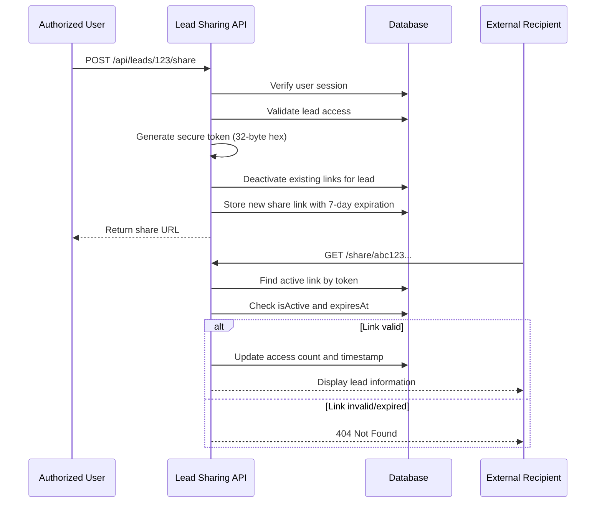

# Lead Sharing API Endpoints

<cite>
**Referenced Files in This Document**   
- [route.ts](file://src/app/api/leads/[id]/share/route.ts)
- [TokenService.ts](file://src/services/TokenService.ts)
- [page.tsx](file://src/app/share/[token]/page.tsx)
- [migration.sql](file://prisma/migrations/20250917154515_add_lead_share_links/migration.sql)
- [auth.ts](file://src/lib/auth.ts)
</cite>

## Table of Contents
1. [Introduction](#introduction)
2. [Lead Sharing API Endpoints](#lead-sharing-api-endpoints)
3. [Authentication and Token Model](#authentication-and-token-model)
4. [Integration Patterns](#integration-patterns)
5. [Security Considerations](#security-considerations)
6. [Usage Examples](#usage-examples)
7. [Data Model](#data-model)
8. [Access Flow Diagram](#access-flow-diagram)
9. [Conclusion](#conclusion)

## Introduction
The Lead Sharing API enables secure, time-limited sharing of lead information and documents with external parties. This system allows authorized users to generate shareable links that provide read-only access to specific lead data without requiring authentication from the recipient. All shared links are secured with cryptographic tokens, have a 7-day expiration, and can be deactivated at any time.

**Section sources**
- [route.ts](file://src/app/api/leads/[id]/share/route.ts#L0-L196)

## Lead Sharing API Endpoints

### POST /api/leads/[id]/share
Generates a new secure share link for a specific lead.

**Request**
- Method: POST
- Path: `/api/leads/{leadId}/share`
- Authentication: Required (valid user session)

**Response (Success - 200)**
```json
{
  "success": true,
  "shareLink": {
    "id": 123,
    "token": "a1b2c3d4e5f6...",
    "url": "https://app.fundtrack.com/share/a1b2c3d4e5f6...",
    "expiresAt": "2025-09-24T10:00:00.000Z",
    "createdAt": "2025-09-17T10:00:00.000Z"
  }
}
```

**Response (Error)**
- 401: Unauthorized
- 400: Invalid lead ID
- 404: Lead not found
- 500: Failed to create share link

### GET /api/leads/[id]/share
Retrieves all active share links for a specific lead.

**Request**
- Method: GET
- Path: `/api/leads/{leadId}/share`
- Authentication: Required (valid user session)

**Response (Success - 200)**
```json
{
  "success": true,
  "shareLinks": [
    {
      "id": 123,
      "token": "a1b2c3d4e5f6...",
      "url": "https://app.fundtrack.com/share/a1b2c3d4e5f6...",
      "expiresAt": "2025-09-24T10:00:00.000Z",
      "createdAt": "2025-09-17T10:00:00.000Z",
      "accessCount": 5,
      "accessedAt": "2025-09-18T14:30:00.000Z",
      "createdBy": "user@company.com"
    }
  ]
}
```

### DELETE /api/leads/[id]/share?linkId={id}
Deactivates a specific share link.

**Request**
- Method: DELETE
- Path: `/api/leads/{leadId}/share?linkId={linkId}`
- Authentication: Required (valid user session)

**Response (Success - 200)**
```json
{
  "success": true,
  "message": "Share link deactivated"
}
```

**Section sources**
- [route.ts](file://src/app/api/leads/[id]/share/route.ts#L0-L196)

## Authentication and Token Model

The Lead Sharing API uses time-limited cryptographic tokens for secure access. When a share link is created, a 256-bit secure token is generated using `crypto.randomBytes(32).toString('hex')`. Each token:

- Expires after 7 days
- Is automatically deactivated when a new link is generated for the same lead
- Cannot be renewed or extended
- Is stored in the database with creation time, expiration, and access tracking

The system ensures that only one active share link exists per lead at any time by deactivating existing links when a new one is created.

**Section sources**
- [route.ts](file://src/app/api/leads/[id]/share/route.ts#L35-L50)
- [TokenService.ts](file://src/services/TokenService.ts#L15-L25)

## Integration Patterns

### Frontend Integration
The dashboard UI integrates with the Lead Sharing API through JavaScript fetch calls. When a user clicks "Generate New Share Link", the frontend:

1. Calls POST `/api/leads/{id}/share`
2. Copies the generated URL to clipboard
3. Displays success message
4. Refreshes the list of active share links

```javascript
const generateShareLink = async () => {
  const response = await fetch(`/api/leads/${leadId}/share`, {
    method: "POST",
  });
  // Handle response and update UI
}
```

### External Access Pattern
External parties access shared leads through the public share URL (`/share/{token}`). The system:

1. Validates the token against the database
2. Checks if the link is active and not expired
3. Grants read-only access to lead information and documents
4. Updates access tracking (count and timestamp)

**Section sources**
- [route.ts](file://src/app/api/leads/[id]/share/route.ts#L0-L196)
- [page.tsx](file://src/app/share/[token]/page.tsx#L0-L103)

## Security Considerations

### Access Control
- Only authenticated users with appropriate permissions can create, view, or deactivate share links
- Recipients of share links do not need authentication
- All share links are read-only; no modification capabilities are exposed

### Data Protection
- Share links are excluded from search engine indexing via `robots: "noindex, nofollow"`
- URLs contain cryptographically secure tokens (256-bit entropy)
- No sensitive authentication tokens are exposed in shared URLs
- System prevents enumeration attacks by returning generic 404 responses for invalid tokens

### Expiration and Revocation
- All share links expire after 7 days
- Links can be manually deactivated at any time
- Generating a new link automatically invalidates previous links
- Access is denied if the link is expired or marked as inactive

### Rate Limiting
- The API enforces rate limiting at the middleware level
- Maximum of 100 requests per 15-minute window per IP
- Returns 429 status code when limit is exceeded

**Section sources**
- [route.ts](file://src/app/api/leads/[id]/share/route.ts#L0-L196)
- [page.tsx](file://src/app/share/[token]/page.tsx#L63-L103)
- [middleware.ts](file://src/middleware.ts#L47-L85)

## Usage Examples

### Generate a Share Link
```bash
curl -X POST \
  https://api.fundtrack.com/api/leads/123/share \
  -H "Authorization: Bearer <user_session_token>"
```

### Retrieve Active Share Links
```bash
curl -X GET \
  https://api.fundtrack.com/api/leads/123/share \
  -H "Authorization: Bearer <user_session_token>"
```

### Deactivate a Share Link
```bash
curl -X DELETE \
  "https://api.fundtrack.com/api/leads/123/share?linkId=456" \
  -H "Authorization: Bearer <user_session_token>"
```

### Access Shared Lead (External)
```bash
curl https://app.fundtrack.com/share/a1b2c3d4e5f6...
```

**Section sources**
- [route.ts](file://src/app/api/leads/[id]/share/route.ts#L0-L196)

## Data Model

The lead sharing functionality is backed by the `lead_share_links` database table with the following schema:

```sql
CREATE TABLE "lead_share_links" (
    "id" SERIAL NOT NULL,
    "lead_id" INTEGER NOT NULL,
    "token" TEXT NOT NULL,
    "created_by" INTEGER NOT NULL,
    "expires_at" TIMESTAMP(3) NOT NULL,
    "accessed_at" TIMESTAMP(3),
    "access_count" INTEGER NOT NULL DEFAULT 0,
    "is_active" BOOLEAN NOT NULL DEFAULT true,
    "created_at" TIMESTAMP(3) NOT NULL DEFAULT CURRENT_TIMESTAMP,
    CONSTRAINT "lead_share_links_pkey" PRIMARY KEY ("id")
);
```

Key constraints:
- Foreign key to `leads(id)` with cascade delete
- Foreign key to `users(id)` with restrict delete
- Unique index on `token`

**Section sources**
- [migration.sql](file://prisma/migrations/20250917154515_add_lead_share_links/migration.sql#L0-L23)

## Access Flow Diagram



**Diagram sources**
- [route.ts](file://src/app/api/leads/[id]/share/route.ts#L0-L196)
- [page.tsx](file://src/app/share/[token]/page.tsx#L0-L103)

## Conclusion
The Lead Sharing API provides a secure, auditable mechanism for sharing lead information with external parties. By using time-limited tokens, access tracking, and automatic deactivation, the system balances usability with security requirements. The integration pattern allows seamless sharing from the dashboard while maintaining strict controls over data access and exposure.

**Section sources**
- [route.ts](file://src/app/api/leads/[id]/share/route.ts#L0-L196)
- [page.tsx](file://src/app/share/[token]/page.tsx#L0-L103)
- [TokenService.ts](file://src/services/TokenService.ts#L15-L25)