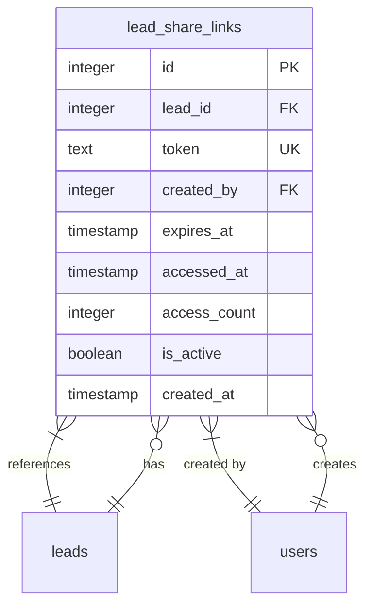
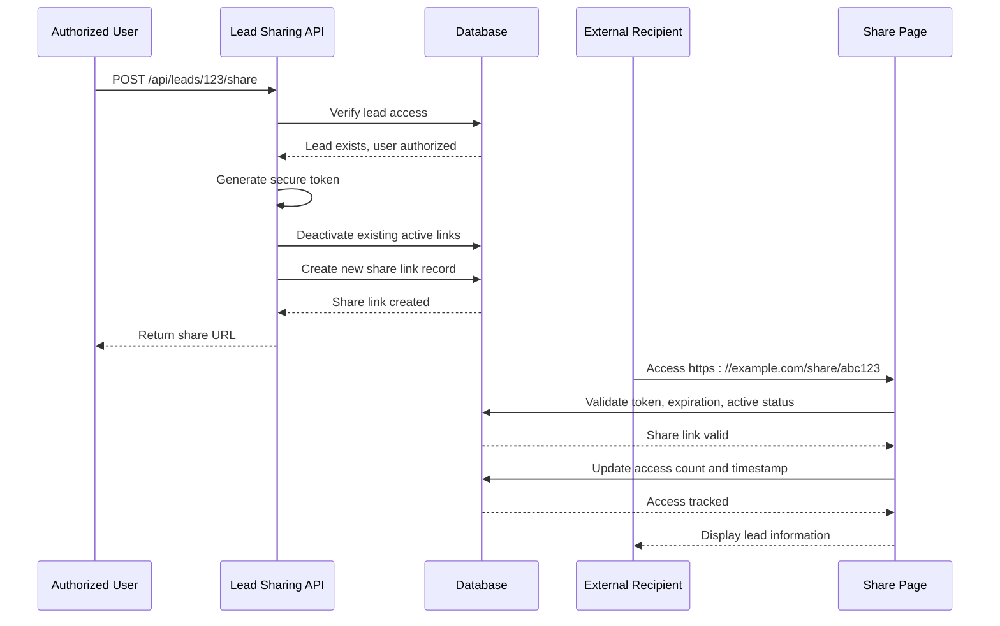
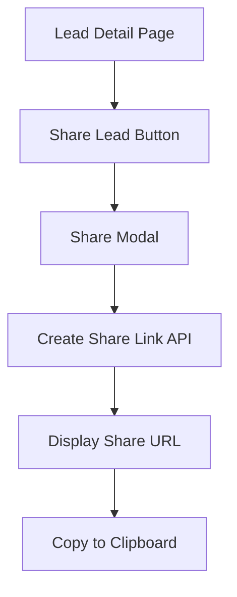
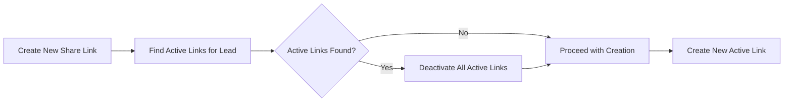

# Lead Sharing Feature

<cite>
**Referenced Files in This Document**   
- [lead_share_links.sql](file://prisma/migrations/20250917154515_add_lead_share_links/migration.sql)
- [route.ts](file://src/app/api/leads/[id]/share/route.ts)
- [ShareView.tsx](file://src/components/share/ShareView.tsx)
- [page.tsx](file://src/app/share/[token]/page.tsx)
- [LeadDetailView.tsx](file://src/components/dashboard/LeadDetailView.tsx)
</cite>

## Table of Contents
1. [Introduction](#introduction)
2. [Feature Overview](#feature-overview)
3. [Database Schema](#database-schema)
4. [API Interface](#api-interface)
5. [Sharing Workflow](#sharing-workflow)
6. [Security and Access Control](#security-and-access-control)
7. [User Interface Components](#user-interface-components)
8. [Integration Patterns](#integration-patterns)
9. [Practical Examples](#practical-examples)
10. [Troubleshooting Guide](#troubleshooting-guide)

## Introduction
The Lead Sharing feature enables secure, time-limited sharing of lead information with external parties without requiring authentication. This document details the implementation, API interfaces, and integration patterns for the feature, providing practical examples and troubleshooting guidance.

## Feature Overview
The Lead Sharing feature allows authorized users to generate secure, time-limited URLs for sharing lead information with external parties. These URLs provide read-only access to comprehensive lead data, including contact information, business details, financial data, documents, and status history. Each shared link is secured with a cryptographically random token, expires after 7 days, and can be deactivated at any time.

The feature supports three primary operations:
- Creating new share links
- Viewing shared lead information
- Managing existing share links

External recipients access the shared information through a dedicated public route that validates the token, tracks access, and presents the lead data in a user-friendly format.

**Section sources**
- [route.ts](file://src/app/api/leads/[id]/share/route.ts#L1-L197)
- [ShareView.tsx](file://src/components/share/ShareView.tsx#L1-L653)

## Database Schema
The lead sharing functionality is supported by the `lead_share_links` database table, which stores metadata about each shared link. The table maintains referential integrity with the leads and users tables through foreign key constraints.



**Diagram sources**
- [lead_share_links.sql](file://prisma/migrations/20250917154515_add_lead_share_links/migration.sql#L1-L24)

**Section sources**
- [lead_share_links.sql](file://prisma/migrations/20250917154515_add_lead_share_links/migration.sql#L1-L24)

## API Interface
The Lead Sharing API provides RESTful endpoints for managing share links through POST, GET, and DELETE operations on the `/api/leads/[id]/share` route.

### API Endpoints

| Endpoint | Method | Purpose | Authentication Required |
|---------|--------|---------|------------------------|
| `/api/leads/[id]/share` | POST | Create a new share link for a lead | Yes |
| `/api/leads/[id]/share` | GET | Retrieve active share links for a lead | Yes |
| `/api/leads/[id]/share` | DELETE | Deactivate a specific share link | Yes |
| `/api/share/[token]/documents/[documentId]` | GET | Download a document from a shared lead | Token-based |

### Request/Response Examples

**Creating a Share Link (POST)**
```json
// Request: POST /api/leads/123/share
// Response:
{
  "success": true,
  "shareLink": {
    "id": 456,
    "token": "a1b2c3d4e5f6...",
    "url": "https://example.com/share/a1b2c3d4e5f6...",
    "expiresAt": "2025-09-24T15:30:00.000Z",
    "createdAt": "2025-09-17T15:30:00.000Z"
  }
}
```

**Retrieving Share Links (GET)**
```json
// Request: GET /api/leads/123/share
// Response:
{
  "success": true,
  "shareLinks": [
    {
      "id": 456,
      "token": "a1b2c3d4e5f6...",
      "url": "https://example.com/share/a1b2c3d4e5f6...",
      "expiresAt": "2025-09-24T15:30:00.000Z",
      "createdAt": "2025-09-17T15:30:00.000Z",
      "accessCount": 3,
      "accessedAt": "2025-09-18T10:15:00.000Z",
      "createdBy": "user@example.com"
    }
  ]
}
```

**Deactivating a Share Link (DELETE)**
```json
// Request: DELETE /api/leads/123/share?linkId=456
// Response:
{
  "success": true,
  "message": "Share link deactivated"
}
```

**Section sources**
- [route.ts](file://src/app/api/leads/[id]/share/route.ts#L1-L197)

## Sharing Workflow
The lead sharing process follows a secure workflow that ensures data protection while providing convenient access to authorized recipients.



**Diagram sources**
- [route.ts](file://src/app/api/leads/[id]/share/route.ts#L1-L197)
- [page.tsx](file://src/app/share/[token]/page.tsx#L1-L104)

**Section sources**
- [route.ts](file://src/app/api/leads/[id]/share/route.ts#L1-L197)
- [page.tsx](file://src/app/share/[token]/page.tsx#L1-L104)

## Security and Access Control
The Lead Sharing feature implements multiple security measures to protect sensitive lead information:

1. **Authentication**: All API operations require user authentication via Next-Auth
2. **Authorization**: Users must have access to the lead to create or manage share links
3. **Token Security**: Share tokens are generated using cryptographically secure random bytes (32 bytes, hex-encoded)
4. **Expiration**: All share links expire after 7 days
5. **Deactivation**: Existing active links are automatically deactivated when a new link is created for the same lead
6. **Access Tracking**: Each access is recorded with timestamp and incrementing access count
7. **Robots Exclusion**: Shared pages include `noindex, nofollow` metadata to prevent search engine indexing

The system also enforces referential integrity through database foreign key constraints, ensuring that share links are automatically removed if the associated lead is deleted.

**Section sources**
- [route.ts](file://src/app/api/leads/[id]/share/route.ts#L1-L197)
- [page.tsx](file://src/app/share/[token]/page.tsx#L1-L104)

## User Interface Components
The Lead Sharing feature includes two primary UI components that handle the sharing functionality and presentation of shared data.

### Dashboard Integration
The `LeadDetailView` component in the dashboard includes a "Share Lead" button that triggers the sharing modal. This integration allows users to create and manage share links directly from the lead detail page.



**Diagram sources**
- [LeadDetailView.tsx](file://src/components/dashboard/LeadDetailView.tsx#L490-L493)

### Share View Component
The `ShareView` component renders the public-facing page that external recipients see when accessing a shared lead. It presents comprehensive lead information in a structured format with the following sections:
- Lead Summary (status, amount requested, business info)
- Contact Information
- Business Information
- Personal Information
- Financial Information
- Digital Signature (if present)
- Application Timeline
- Application Progress (step completion)
- Documents (with download functionality)
- Recent Status Changes

The component also displays expiration information and warns when a link is nearing expiration.

**Section sources**
- [ShareView.tsx](file://src/components/share/ShareView.tsx#L1-L653)
- [LeadDetailView.tsx](file://src/components/dashboard/LeadDetailView.tsx#L460-L493)

## Integration Patterns
The Lead Sharing feature can be integrated into various workflows and extended for additional functionality.

### Single Active Link Policy
The system enforces a policy where only one active share link can exist per lead at any time. When a new link is created, all existing active links for that lead are automatically deactivated:



**Diagram sources**
- [route.ts](file://src/app/api/leads/[id]/share/route.ts#L65-L75)

### Access Analytics
The access tracking fields (`accessCount`, `accessedAt`) enable basic analytics on how often and when shared leads are viewed. This data can be used to:
- Monitor engagement with shared leads
- Identify frequently accessed leads
- Understand recipient behavior patterns
- Generate usage reports for compliance

### Document Sharing
The feature integrates with the document management system to allow secure download of lead documents. Document access is protected by the same token-based authentication as the lead information, ensuring that only recipients with the valid share URL can download documents.

**Section sources**
- [route.ts](file://src/app/api/leads/[id]/share/route.ts#L1-L197)
- [ShareView.tsx](file://src/components/share/ShareView.tsx#L619-L652)

## Practical Examples
### Creating a Share Link
```javascript
// Example using fetch API
async function createShareLink(leadId) {
  const response = await fetch(`/api/leads/${leadId}/share`, {
    method: 'POST',
    headers: {
      'Content-Type': 'application/json',
    },
  });

  const data = await response.json();
  if (data.success) {
    console.log('Share URL:', data.shareLink.url);
    // Copy to clipboard or display to user
  }
}
```

### Embedding in Email Communications
Shared links can be included in email communications with partners or clients:

```
Subject: Lead Information for Review

Dear Partner,

Please review the following lead information:
${shareUrl}

The link will expire on ${expiresAt}. 
All documents can be downloaded directly from the page.

Best regards,
Your Team
```

### Programmatic Access Tracking
```javascript
// Example: Get share link analytics
async function getShareAnalytics(leadId) {
  const response = await fetch(`/api/leads/${leadId}/share`);
  const data = await response.json();
  
  if (data.success) {
    data.shareLinks.forEach(link => {
      console.log(`Link created by: ${link.createdBy}`);
      console.log(`Accessed ${link.accessCount} times`);
      if (link.accessedAt) {
        console.log(`Last accessed: ${link.accessedAt}`);
      }
    });
  }
}
```

**Section sources**
- [route.ts](file://src/app/api/leads/[id]/share/route.ts#L1-L197)

## Troubleshooting Guide
This section addresses common issues encountered with the Lead Sharing feature and provides solutions.

### Common Issues and Solutions

| Issue | Possible Cause | Solution |
|------|---------------|---------|
| "Unauthorized" error when creating share link | User not authenticated or session expired | Ensure user is logged in and has valid session |
| "Lead not found" error | Invalid lead ID or user lacks access | Verify lead ID and user permissions |
| Shared link returns 404 | Token invalid, expired, or deactivated | Check if link has expired (7 days), been deactivated, or contains correct token |
| Documents not downloading | Token validation failure or document ID mismatch | Verify the document ID and share token are correct |
| Multiple active share links | Race condition during creation | Implement client-side loading states to prevent multiple rapid requests |

### Debugging Steps
1. **Verify API responses**: Check the full response from the share API endpoints for error messages
2. **Inspect network requests**: Use browser developer tools to examine request headers, payloads, and responses
3. **Check token validity**: Ensure the token in the share URL matches the one returned by the API
4. **Validate expiration**: Confirm the current date is before the `expiresAt` timestamp
5. **Review database records**: Query the `lead_share_links` table to verify the link status and metadata

### Monitoring and Logging
The system includes comprehensive logging for debugging purposes:
- API errors are logged with `console.error` statements
- Share link creation and access are recorded in the database
- Authentication failures are logged for security monitoring

Administrators can use these logs to troubleshoot issues and audit access to shared leads.

**Section sources**
- [route.ts](file://src/app/api/leads/[id]/share/route.ts#L1-L197)
- [page.tsx](file://src/app/share/[token]/page.tsx#L1-L104)