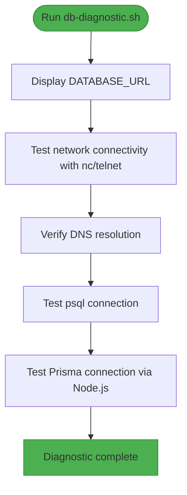
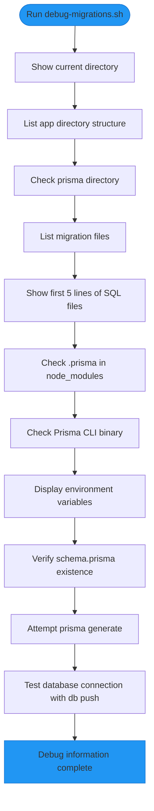
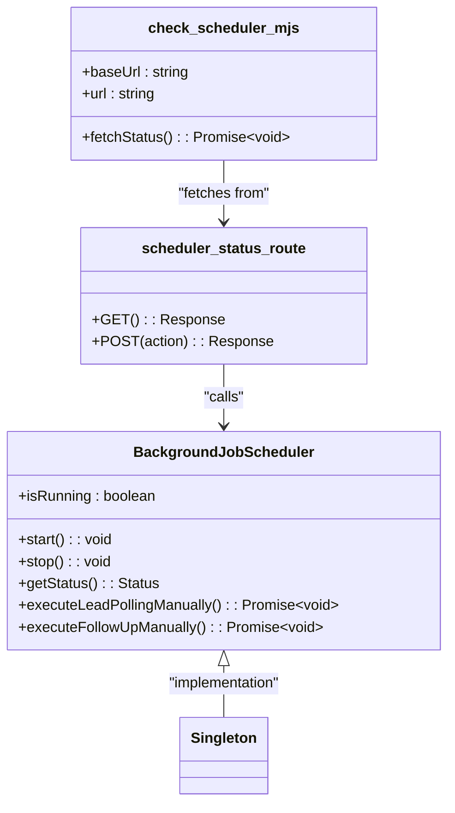
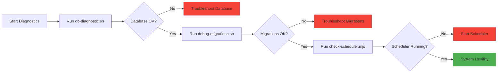

# Diagnostic Scripts

<cite>
**Referenced Files in This Document**   
- [db-diagnostic.sh](file://scripts/db-diagnostic.sh)
- [debug-migrations.sh](file://scripts/debug-migrations.sh)
- [check-scheduler.mjs](file://scripts/check-scheduler.mjs)
- [BackgroundJobScheduler.ts](file://src/services/BackgroundJobScheduler.ts)
- [prisma.ts](file://src/lib/prisma.ts)
- [scheduler-status/route.ts](file://src/app/api/dev/scheduler-status/route.ts)
- [server-init.ts](file://src/lib/server-init.ts)
</cite>

## Table of Contents
1. [Introduction](#introduction)
2. [Database Diagnostic Script](#database-diagnostic-script)
3. [Migration Debug Script](#migration-debug-script)
4. [Scheduler Status Check Script](#scheduler-status-check-script)
5. [Troubleshooting Workflows](#troubleshooting-workflows)

## Introduction
This document provides comprehensive operational documentation for the diagnostic scripts in the fund-track repository. These scripts are essential tools for verifying system health, diagnosing connectivity issues, and troubleshooting background job execution. The three primary diagnostic scripts—db-diagnostic.sh, debug-migrations.sh, and check-scheduler.mjs—enable developers and operations teams to validate critical components of the application infrastructure, including database connectivity, Prisma migration integrity, and background job scheduler status.

**Section sources**
- [db-diagnostic.sh](file://scripts/db-diagnostic.sh)
- [debug-migrations.sh](file://scripts/debug-migrations.sh)
- [check-scheduler.mjs](file://scripts/check-scheduler.mjs)

## Database Diagnostic Script

### Purpose and Functionality
The **db-diagnostic.sh** script performs a comprehensive assessment of database connectivity and performance. It systematically verifies network connectivity, DNS resolution, PostgreSQL client access, and Prisma-based database connections. The script is designed to identify common database connectivity issues in both development and production environments.

### Execution Requirements
- **Environment**: Unix-like shell environment (Bash)
- **Dependencies**: netcat (nc), telnet, psql, Node.js, and Prisma client
- **Environment Variables**: DATABASE_URL must be set
- **Execution Path**: Run from the project root directory

### Step-by-Step Execution
```bash
chmod +x scripts/db-diagnostic.sh
./scripts/db-diagnostic.sh
```

### Expected Output and Interpretation
The script produces a detailed diagnostic report with the following sections:

1. **Environment Variables**: Displays the DATABASE_URL value
2. **Network Connectivity**: Tests connection to the database host (merchant-funding-fundtrackdb-ghvfoz) on port 5432 using netcat or telnet
3. **DNS Resolution**: Verifies DNS resolution of the database host using nslookup or getent
4. **PostgreSQL Client Test**: Attempts direct connection using psql with the DATABASE_URL
5. **Node.js/Prisma Test**: Tests connection using the Prisma client through Node.js

**Common Output Patterns**:
- ✅ Success indicators show green checkmarks for successful connections
- ❌ Failure indicators show red crosses for failed connections
- "Neither nc nor telnet available" indicates missing network diagnostic tools
- "psql not available in container" suggests PostgreSQL client is not installed
- "Failed to load Prisma" indicates missing or corrupted Prisma dependencies

### Error Messages and Resolution
- **"Cannot connect to host:port"**: Check network connectivity, firewall rules, and database server status
- **"DNS lookup failed"**: Verify DNS configuration and host name spelling
- **"psql connection failed"**: Validate DATABASE_URL format and credentials
- **"Prisma connection failed"**: Check Node.js environment, package installation, and database permissions



**Diagram sources**
- [db-diagnostic.sh](file://scripts/db-diagnostic.sh#L1-L78)

**Section sources**
- [db-diagnostic.sh](file://scripts/db-diagnostic.sh#L1-L78)
- [prisma.ts](file://src/lib/prisma.ts#L1-L60)

## Migration Debug Script

### Purpose and Functionality
The **debug-migrations.sh** script diagnoses Prisma migration issues by examining the migration file system, environment configuration, and Prisma client setup. It helps identify why migrations might fail during deployment by verifying file integrity, directory structure, and database connectivity.

### Execution Requirements
- **Environment**: Unix-like shell environment (sh)
- **Dependencies**: ls, find, npx, Prisma CLI
- **Execution Path**: Run from project root or within container environment

### Step-by-Step Execution
```bash
chmod +x scripts/debug-migrations.sh
./scripts/debug-migrations.sh
```

### Expected Output and Interpretation
The script generates a comprehensive debug report with:

1. **Directory Structure**: Current working directory and app structure
2. **Prisma Directory**: Contents of the prisma directory
3. **Migration Files**: List of migration files with first 5 lines of each SQL file
4. **Node Modules**: Status of .prisma directory and Prisma CLI in node_modules
5. **Environment Variables**: Key environment variables (DATABASE_URL, NODE_ENV)
6. **Schema Check**: Verification of schema.prisma file existence
7. **Client Generation**: Attempt to generate Prisma client
8. **Database Connection**: Test connection using prisma db push

**Common Output Patterns**:
- ✅ "Schema file found" confirms schema.prisma exists
- ❌ "Migration directory not found" indicates missing migrations
- ✅ "Prisma client generated successfully" shows client generation works
- ❌ "Database connection failed" suggests DATABASE_URL or network issues

### Error Messages and Resolution
- **"Prisma directory not found"**: Verify prisma directory exists in correct location
- **"Schema file not found"**: Check for schema.prisma in prisma directory
- **"Failed to generate Prisma client"**: Run `npx prisma generate` manually
- **"Database connection failed"**: Validate DATABASE_URL and database server status



**Diagram sources**
- [debug-migrations.sh](file://scripts/debug-migrations.sh#L1-L95)

**Section sources**
- [debug-migrations.sh](file://scripts/debug-migrations.sh#L1-L95)
- [prisma-migrate-and-start.mjs](file://scripts/prisma-migrate-and-start.mjs#L1-L88)

## Scheduler Status Check Script

### Purpose and Functionality
The **check-scheduler.mjs** script verifies the status of the background job scheduler by querying the development API endpoint. It provides real-time information about scheduler operation, job patterns, and next execution times. The script also offers troubleshooting tips based on the current configuration.

### Execution Requirements
- **Environment**: Node.js runtime
- **Dependencies**: fetch API (available in Node.js 18+)
- **Environment Variables**: NEXTAUTH_URL (defaults to http://localhost:3000)
- **Server Requirement**: Application server must be running

### Step-by-Step Execution
```bash
node scripts/check-scheduler.mjs
```

### Expected Output and Interpretation
The script produces a detailed status report:

1. **Scheduler Status**: Running state, lead polling pattern, follow-up pattern
2. **Next Execution Times**: Calculated time until next lead polling and follow-up
3. **Environment Configuration**: Node environment, background jobs enabled status
4. **Troubleshooting Tips**: Contextual advice based on current status
5. **Manual Testing Options**: Commands for manual testing

**Common Output Patterns**:
- ✅ "Running: YES" indicates scheduler is active
- ❌ "Running: NO" shows scheduler is stopped
- "Next Lead Polling: [time] (in X minutes)" shows upcoming job
- "Scheduler is not running" tip suggests checking ENABLE_BACKGROUND_JOBS

### Error Messages and Resolution
- **"Network error"**: Server is not running or unreachable
- **"Error: Unauthorized"**: Development endpoints not enabled
- **"Failed to get scheduler status"**: Internal server error
- **"Make sure your development server is running"**: Start server with `npm run dev`



**Diagram sources**
- [check-scheduler.mjs](file://scripts/check-scheduler.mjs#L1-L71)
- [BackgroundJobScheduler.ts](file://src/services/BackgroundJobScheduler.ts#L1-L462)
- [scheduler-status/route.ts](file://src/app/api/dev/scheduler-status/route.ts#L1-L82)

**Section sources**
- [check-scheduler.mjs](file://scripts/check-scheduler.mjs#L1-L71)
- [BackgroundJobScheduler.ts](file://src/services/BackgroundJobScheduler.ts#L1-L462)
- [scheduler-status/route.ts](file://src/app/api/dev/scheduler-status/route.ts#L1-L82)

## Troubleshooting Workflows

### Database Connectivity Issues
When experiencing database connectivity problems:

1. Run **db-diagnostic.sh** to identify the failure point
2. Check network connectivity and DNS resolution
3. Verify DATABASE_URL format and credentials
4. Test psql connection directly
5. Validate Prisma client installation and configuration

```bash
./scripts/db-diagnostic.sh
# If psql connection fails:
psql $DATABASE_URL -c "SELECT version();"
# If Prisma connection fails:
node -e "require('@prisma/client')"
```

### Prisma Migration Failures
When migrations fail during deployment:

1. Execute **debug-migrations.sh** to gather diagnostic information
2. Verify migration files exist and are properly formatted
3. Check schema.prisma file for syntax errors
4. Attempt manual client generation: `npx prisma generate`
5. Test database connection: `npx prisma db push --accept-data-loss`

```bash
./scripts/debug-migrations.sh
# Manual verification steps:
ls -la prisma/migrations/
npx prisma format
npx prisma validate
```

### Background Job Scheduler Problems
When the scheduler is not running or jobs are not executing:

1. Run **check-scheduler.mjs** to check current status
2. Verify ENABLE_BACKGROUND_JOBS=true in environment
3. Check server logs for scheduler initialization errors
4. Manually start scheduler: `node scripts/start-scheduler.mjs`
5. Test manual job execution: `node scripts/check-scheduler.mjs` with POST actions

```bash
node scripts/check-scheduler.mjs
# If scheduler is not running:
export ENABLE_BACKGROUND_JOBS=true
node scripts/start-scheduler.mjs
# Test manual polling:
curl -X POST http://localhost:3000/api/dev/scheduler-status -H "Content-Type: application/json" -d '{"action":"poll"}'
```

### Integrated Diagnostic Workflow
For comprehensive system validation:



**Diagram sources**
- [db-diagnostic.sh](file://scripts/db-diagnostic.sh#L1-L78)
- [debug-migrations.sh](file://scripts/debug-migrations.sh#L1-L95)
- [check-scheduler.mjs](file://scripts/check-scheduler.mjs#L1-L71)

**Section sources**
- [db-diagnostic.sh](file://scripts/db-diagnostic.sh#L1-L78)
- [debug-migrations.sh](file://scripts/debug-migrations.sh#L1-L95)
- [check-scheduler.mjs](file://scripts/check-scheduler.mjs#L1-L71)
- [server-init.ts](file://src/lib/server-init.ts#L1-L177)