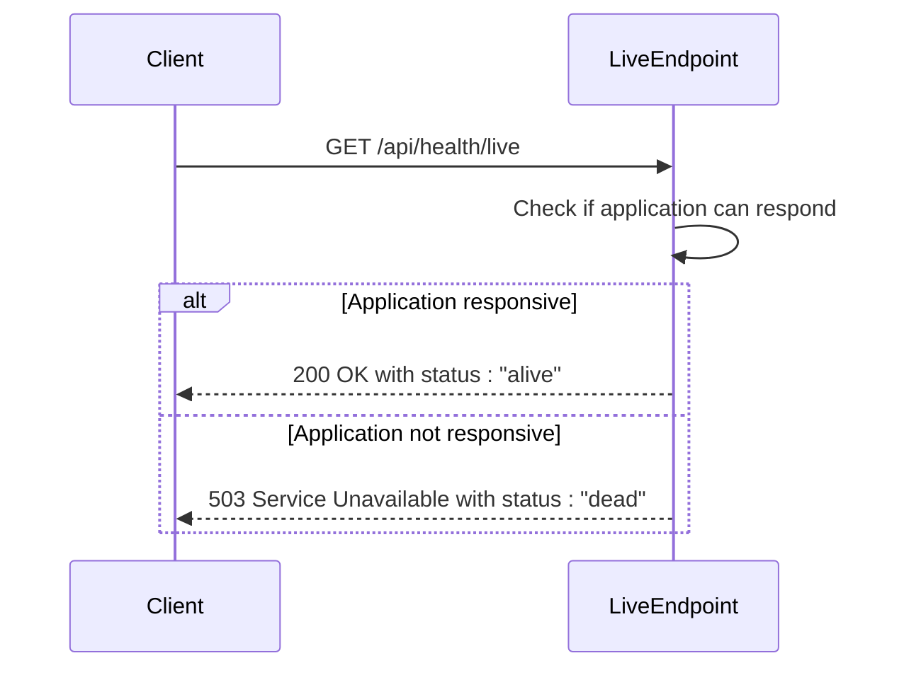
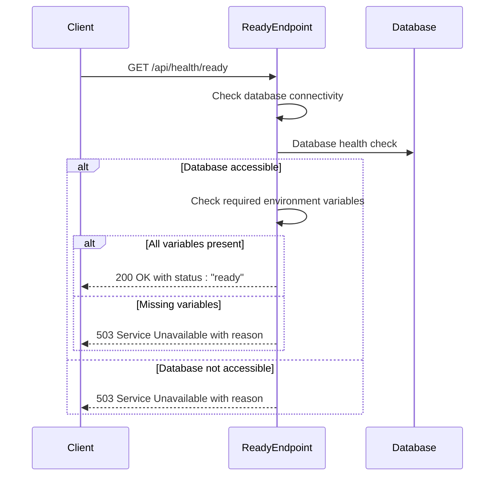
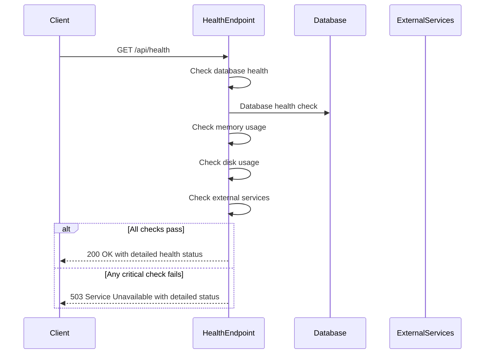
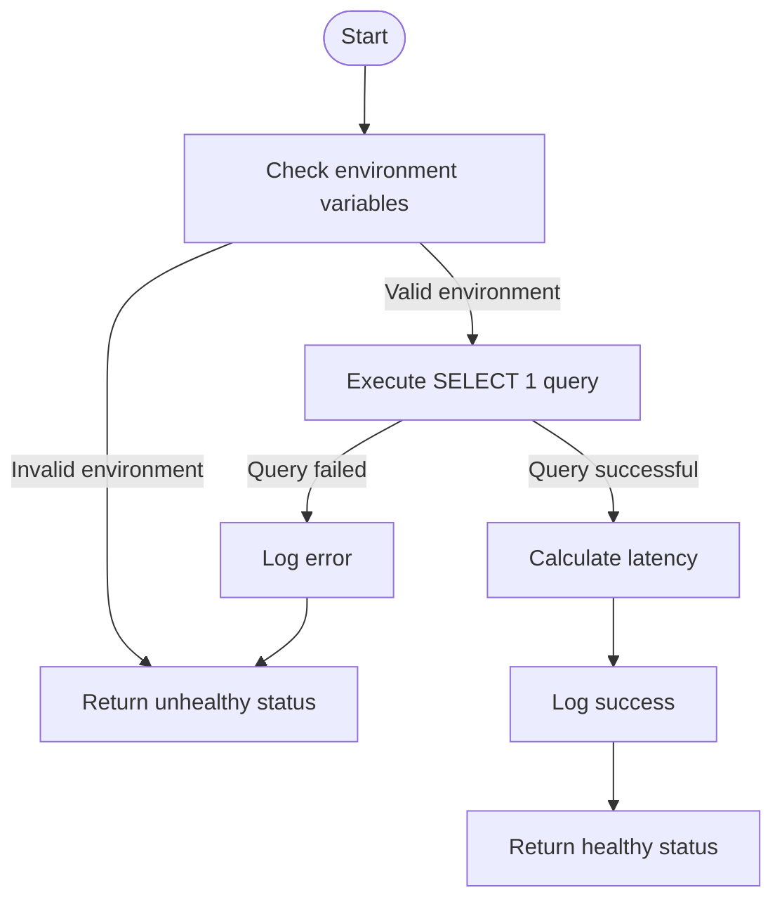
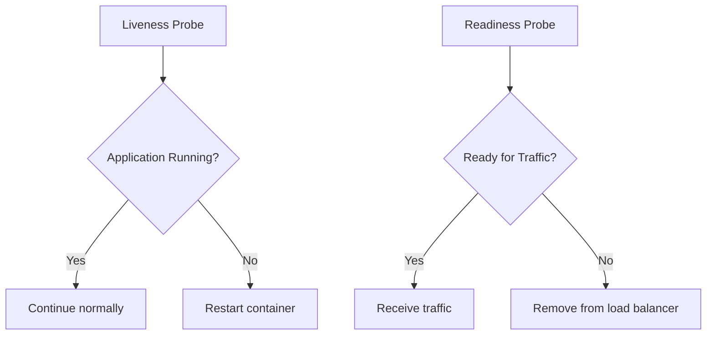
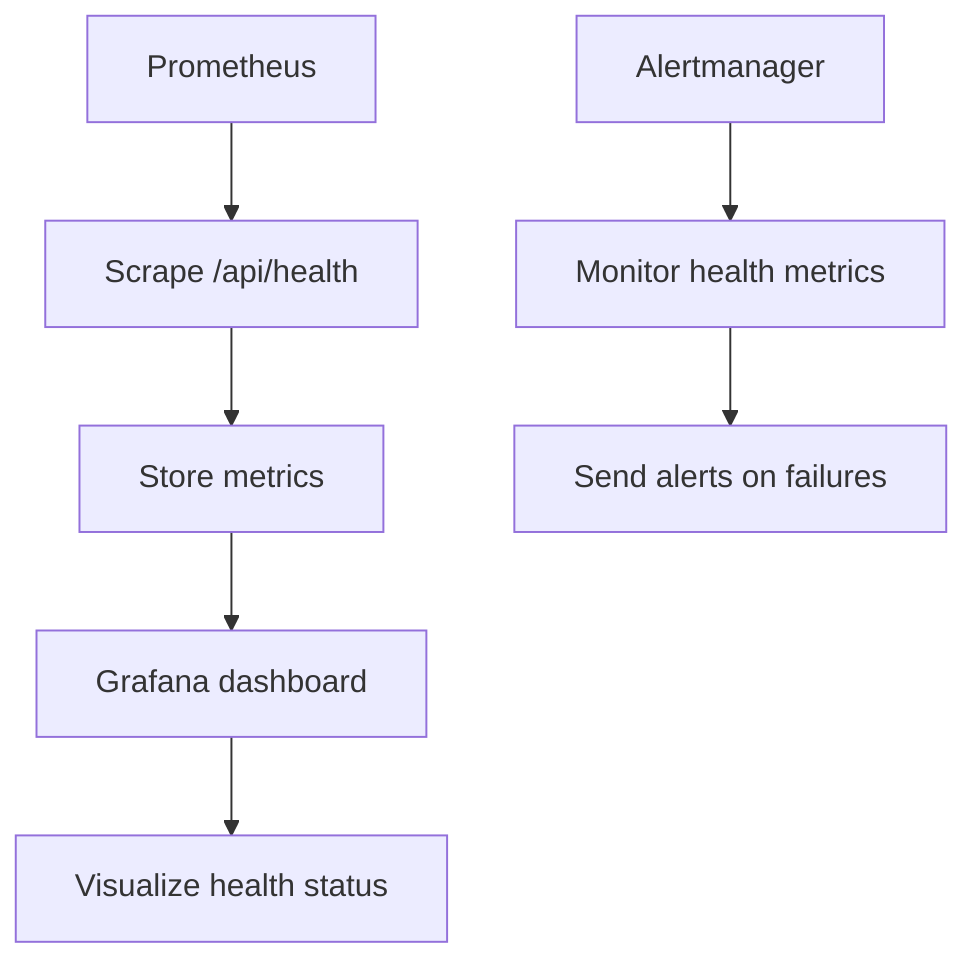
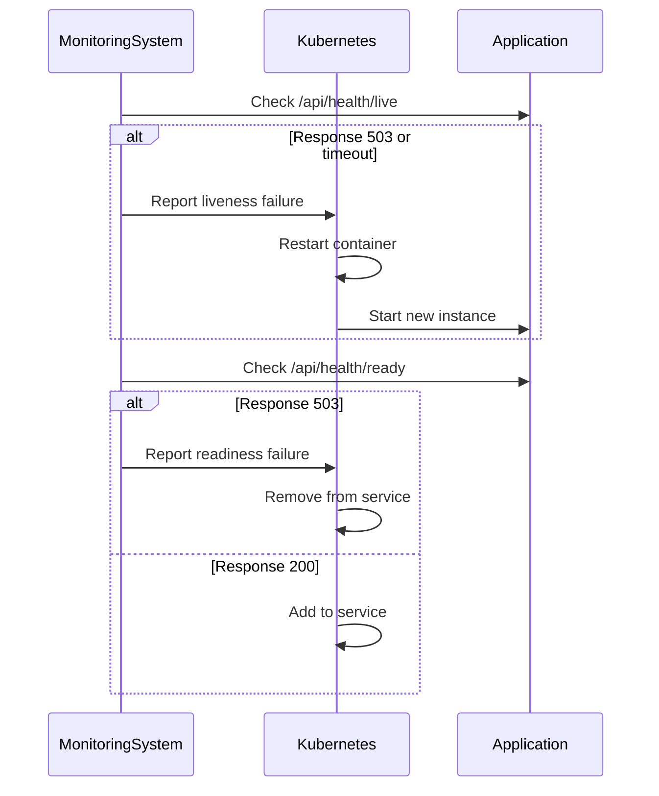
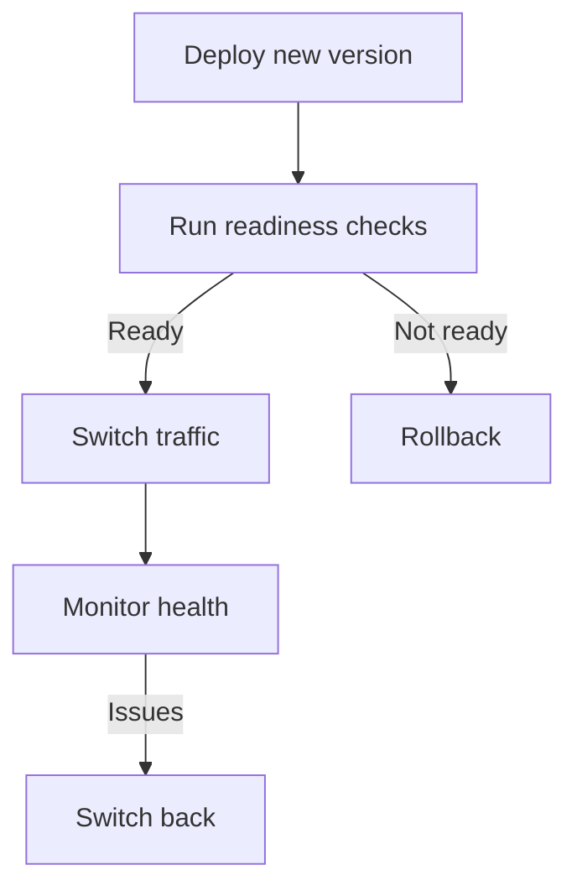

# Health Checks

<cite>
**Referenced Files in This Document**   
- [route.ts](file://src/app/api/health/route.ts)
- [live/route.ts](file://src/app/api/health/live/route.ts)
- [ready/route.ts](file://src/app/api/health/ready/route.ts)
- [database-error-handler.ts](file://src/lib/database-error-handler.ts)
- [health-check.sh](file://scripts/health-check.sh)
- [monitoring.ts](file://src/lib/monitoring.ts)
- [status/route.ts](file://src/app/api/monitoring/status/route.ts)
</cite>

## Table of Contents
1. [Introduction](#introduction)
2. [Health Check Endpoints Overview](#health-check-endpoints-overview)
3. [Liveness Probe](#liveness-probe)
4. [Readiness Probe](#readiness-probe)
5. [Comprehensive Health Check](#comprehensive-health-check)
6. [Internal Health Checks](#internal-health-checks)
7. [Testing Health Endpoints](#testing-health-endpoints)
8. [Integration with Orchestration Platforms](#integration-with-orchestration-platforms)
9. [Monitoring and Auto-healing Systems](#monitoring-and-auto-healing-systems)
10. [Deployment Pipeline Integration](#deployment-pipeline-integration)

## Introduction
The fund-track application implements a comprehensive health check system to ensure reliability and availability in production environments. This documentation details the implementation and usage of health check endpoints, which are critical for container orchestration, monitoring, and auto-healing systems. The health check system consists of three main endpoints: liveness, readiness, and a comprehensive health check that provides detailed system status information.

**Section sources**
- [route.ts](file://src/app/api/health/route.ts)
- [live/route.ts](file://src/app/api/health/live/route.ts)
- [ready/route.ts](file://src/app/api/health/ready/route.ts)

## Health Check Endpoints Overview
The application exposes three health check endpoints, each serving a specific purpose in the application lifecycle:

- **/api/health/live**: Liveness probe to determine if the application is running
- **/api/health/ready**: Readiness probe to determine if the application can serve traffic
- **/api/health**: Comprehensive health check with detailed system status

These endpoints follow RESTful principles and return JSON responses with appropriate HTTP status codes to indicate system health.

```mermaid
graph TD
A[Client] --> B[/api/health/live]
A --> C[/api/health/ready]
A --> D[/api/health]
B --> E{Application Running?}
C --> F{Ready for Traffic?}
D --> G{Comprehensive System Check}
E --> |Yes| H[200 OK]
E --> |No| I[503 Service Unavailable]
F --> |Yes| J[200 OK]
F --> |No| K[503 Service Unavailable]
G --> |Healthy| L[200 OK]
G --> |Unhealthy/Degraded| M[503 Service Unavailable]
```

**Diagram sources**
- [live/route.ts](file://src/app/api/health/live/route.ts)
- [ready/route.ts](file://src/app/api/health/ready/route.ts)
- [route.ts](file://src/app/api/health/route.ts)

## Liveness Probe
The liveness probe endpoint determines whether the application is running and should be restarted if it fails.

### Purpose and Functionality
The liveness endpoint `/api/health/live` performs a minimal check to verify that the application process is responsive. This endpoint is designed to be lightweight and fast, as it is typically called frequently by container orchestration platforms.



**Diagram sources**
- [live/route.ts](file://src/app/api/health/live/route.ts)

### Response Schema
The liveness endpoint returns a simple JSON response with basic process information:

```json
{
  "status": "alive",
  "timestamp": "2025-08-28T10:30:00.000Z",
  "uptime": 3600,
  "pid": 12345
}
```

When the application is not responsive, it returns:

```json
{
  "status": "dead",
  "error": "Error message"
}
```

### Example Responses
**Healthy State:**
```json
{
  "status": "alive",
  "timestamp": "2025-08-28T10:30:00.000Z",
  "uptime": 3600,
  "pid": 12345
}
```

**Unhealthy State:**
```json
{
  "status": "dead",
  "error": "Application is not responding"
}
```

### Usage in Kubernetes
In Kubernetes, the liveness probe is configured to restart the container if it fails. This helps recover from situations where the application becomes unresponsive due to deadlocks or resource exhaustion.

```yaml
livenessProbe:
  httpGet:
    path: /api/health/live
    port: 3000
  initialDelaySeconds: 30
  periodSeconds: 10
  failureThreshold: 3
```

**Section sources**
- [live/route.ts](file://src/app/api/health/live/route.ts)

## Readiness Probe
The readiness probe endpoint determines whether the application is ready to receive and serve traffic.

### Purpose and Functionality
The readiness endpoint `/api/health/ready` performs more comprehensive checks than the liveness probe to ensure the application can handle requests. Unlike the liveness probe, failing the readiness check does not cause the application to restart but rather removes it from the load balancer rotation.



**Diagram sources**
- [ready/route.ts](file://src/app/api/health/ready/route.ts)

### Response Schema
The readiness endpoint returns a JSON response indicating readiness status:

```json
{
  "status": "ready",
  "timestamp": "2025-08-28T10:30:00.000Z"
}
```

When the application is not ready, it returns:

```json
{
  "status": "not ready",
  "reason": "Reason for unavailability",
  "error": "Error details"
}
```

### Internal Checks
The readiness probe performs the following checks:

1. **Database connectivity**: Verifies that the application can connect to the database using the `checkDatabaseHealth` function
2. **Required environment variables**: Ensures critical environment variables are set, including:
   - DATABASE_URL
   - NEXTAUTH_SECRET

### Example Responses
**Ready State:**
```json
{
  "status": "ready",
  "timestamp": "2025-08-28T10:30:00.000Z"
}
```

**Not Ready State (Database Issue):**
```json
{
  "status": "not ready",
  "reason": "database not accessible",
  "error": "Connection refused"
}
```

**Not Ready State (Missing Environment Variable):**
```json
{
  "status": "not ready",
  "reason": "missing required environment variable: DATABASE_URL"
}
```

### Usage in Kubernetes
In Kubernetes, the readiness probe is configured to determine when the application should receive traffic:

```yaml
readinessProbe:
  httpGet:
    path: /api/health/ready
    port: 3000
  initialDelaySeconds: 10
  periodSeconds: 5
  failureThreshold: 3
```

**Section sources**
- [ready/route.ts](file://src/app/api/health/ready/route.ts)
- [database-error-handler.ts](file://src/lib/database-error-handler.ts)

## Comprehensive Health Check
The main health endpoint provides detailed information about the application's health status.

### Purpose and Functionality
The `/api/health` endpoint returns comprehensive information about the system's health, including database connectivity, memory usage, disk usage, and external service availability. This endpoint is typically used by monitoring systems for detailed health assessment.



**Diagram sources**
- [route.ts](file://src/app/api/health/route.ts)

### Response Schema
The comprehensive health check returns a detailed JSON response:

```json
{
  "status": "healthy",
  "timestamp": "2025-08-28T10:30:00.000Z",
  "version": "1.0.0",
  "uptime": 3600,
  "checks": {
    "database": {
      "status": "healthy",
      "latency": 15,
      "connectionPool": {
        "active": 2,
        "idle": 3,
        "total": 5
      }
    },
    "memory": {
      "status": "healthy",
      "usage": {
        "used": 150,
        "total": 500,
        "percentage": 30,
        "heapUsed": 120,
        "heapTotal": 400,
        "external": 30
      }
    },
    "disk": {
      "status": "healthy",
      "usage": {
        "free": 50,
        "total": 100,
        "percentage": 50
      }
    },
    "externalServices": {
      "twilio": {
        "status": "healthy",
        "latency": 120
      },
      "mailgun": {
        "status": "healthy"
      },
      "backblaze": {
        "status": "healthy"
      }
    },
    "environment": {
      "nodeEnv": "production",
      "nodeVersion": "v18.17.0",
      "platform": "linux",
      "arch": "x64"
    }
  }
}
```

### Status Determination
The overall status is determined based on the following rules:

- **Healthy**: All critical systems are functioning normally
- **Degraded**: The application is operational but experiencing issues (e.g., high memory usage)
- **Unhealthy**: Critical systems are failing (e.g., database connectivity issues)

The status code returned depends on the overall status:
- Healthy: 200 OK
- Degraded: 200 OK (application still serves traffic)
- Unhealthy: 503 Service Unavailable

### Example Responses
**Healthy State:**
```json
{
  "status": "healthy",
  "timestamp": "2025-08-28T10:30:00.000Z",
  "version": "1.0.0",
  "uptime": 3600,
  "checks": {
    "database": {
      "status": "healthy",
      "latency": 15
    },
    "memory": {
      "status": "healthy",
      "usage": {
        "used": 150,
        "total": 500,
        "percentage": 30
      }
    },
    "disk": {
      "status": "healthy",
      "usage": {
        "free": 50,
        "total": 100,
        "percentage": 50
      }
    },
    "externalServices": {
      "twilio": {
        "status": "healthy"
      },
      "mailgun": {
        "status": "healthy"
      },
      "backblaze": {
        "status": "healthy"
      }
    },
    "environment": {
      "nodeEnv": "production",
      "nodeVersion": "v18.17.0",
      "platform": "linux",
      "arch": "x64"
    }
  }
}
```

**Degraded State:**
```json
{
  "status": "degraded",
  "timestamp": "2025-08-28T10:30:00.000Z",
  "version": "1.0.0",
  "uptime": 3600,
  "checks": {
    "database": {
      "status": "healthy",
      "latency": 25
    },
    "memory": {
      "status": "unhealthy",
      "usage": {
        "used": 450,
        "total": 500,
        "percentage": 90
      }
    },
    "disk": {
      "status": "healthy",
      "usage": {
        "free": 30,
        "total": 100,
        "percentage": 70
      }
    },
    "externalServices": {
      "twilio": {
        "status": "healthy"
      },
      "mailgun": {
        "status": "unknown"
      },
      "backblaze": {
        "status": "unknown"
      }
    },
    "environment": {
      "nodeEnv": "production",
      "nodeVersion": "v18.17.0",
      "platform": "linux",
      "arch": "x64"
    }
  }
}
```

**Unhealthy State:**
```json
{
  "status": "unhealthy",
  "timestamp": "2025-08-28T10:30:00.000Z",
  "version": "1.0.0",
  "uptime": 3600,
  "checks": {
    "database": {
      "status": "unhealthy",
      "error": "Connection refused"
    },
    "memory": {
      "status": "unhealthy",
      "usage": {
        "used": 0,
        "total": 0,
        "percentage": 0
      }
    },
    "disk": {
      "status": "unhealthy",
      "error": "Unable to check disk usage"
    },
    "externalServices": {
      "twilio": {
        "status": "unknown"
      },
      "mailgun": {
        "status": "unknown"
      },
      "backblaze": {
        "status": "unknown"
      }
    },
    "environment": {
      "nodeEnv": "production",
      "nodeVersion": "v18.17.0",
      "platform": "linux",
      "arch": "x64"
    }
  }
}
```

**Section sources**
- [route.ts](file://src/app/api/health/route.ts)

## Internal Health Checks
The health check system performs several internal checks to assess the application's health.

### Database Connectivity Check
The `checkDatabaseHealth` function verifies database connectivity by executing a simple query.



**Diagram sources**
- [database-error-handler.ts](file://src/lib/database-error-handler.ts)

The function checks for:
- Valid environment configuration
- Ability to import Prisma client
- Successful execution of a simple database query

### Memory Usage Check
The health check monitors memory usage by examining Node.js process memory metrics:

- **Heap used**: Memory used by the JavaScript heap
- **Heap total**: Total heap memory allocated
- **External memory**: Memory used by C++ addons
- **Memory percentage**: Percentage of heap memory used

If memory usage exceeds 90%, the system is considered degraded.

### Disk Usage Check
The disk usage check evaluates available disk space:

```typescript
const stats = await fs.statfs('./');
const free = stats.bavail * stats.bsize;
const total = stats.blocks * stats.bsize;
const percentage = (used / total) * 100;
```

If disk usage exceeds 90%, the system is considered unhealthy.

### External Service Checks
The health check verifies connectivity to external services when enabled by the `ENABLE_DETAILED_HEALTH_CHECKS` environment variable:

- **Twilio**: Makes an API call to verify account accessibility
- **Mailgun**: Checks for configuration presence
- **Backblaze**: Checks for configuration presence

These checks are only performed when detailed health checks are enabled to avoid unnecessary external calls.

**Section sources**
- [route.ts](file://src/app/api/health/route.ts)
- [database-error-handler.ts](file://src/lib/database-error-handler.ts)

## Testing Health Endpoints
The application provides multiple ways to test health endpoints.

### curl Command Examples
Test the liveness probe:
```bash
curl -X GET http://localhost:3000/api/health/live
```

Test the readiness probe:
```bash
curl -X GET http://localhost:3000/api/health/ready
```

Test the comprehensive health check:
```bash
curl -X GET http://localhost:3000/api/health
```

Include response headers:
```bash
curl -X GET -i http://localhost:3000/api/health
```

Test with specific timeout:
```bash
curl -X GET --max-time 5 http://localhost:3000/api/health/live
```

### Health Check Script
The application includes a shell script for automated health checks:

```bash
#!/bin/bash
# Health Check Script for Production Monitoring

HEALTH_URL="${HEALTH_URL:-http://localhost:3000/api/health}"
TIMEOUT="${HEALTH_CHECK_TIMEOUT:-5}"
RETRY_COUNT="${HEALTH_CHECK_RETRIES:-3}"
RETRY_DELAY="${HEALTH_CHECK_RETRY_DELAY:-2}"

# Make HTTP request with timeout and retries
response=$(curl -s -f --max-time $TIMEOUT "$HEALTH_URL")
```

The script supports configuration through environment variables:
- **HEALTH_URL**: Health check endpoint URL
- **HEALTH_CHECK_TIMEOUT**: Request timeout in seconds
- **HEALTH_CHECK_RETRIES**: Number of retry attempts
- **HEALTH_CHECK_RETRY_DELAY**: Delay between retries in seconds

The script returns different exit codes based on health status:
- 0: Healthy
- 1: Degraded
- 2: Unhealthy
- 3: Unknown status
- 4: Connection failed

**Section sources**
- [health-check.sh](file://scripts/health-check.sh)
- [route.ts](file://src/app/api/health/route.ts)

## Integration with Orchestration Platforms
The health check endpoints are designed to integrate with container orchestration platforms like Kubernetes.

### Kubernetes Configuration
The endpoints can be configured in Kubernetes deployments:

```yaml
apiVersion: apps/v1
kind: Deployment
metadata:
  name: fund-track
spec:
  template:
    spec:
      containers:
      - name: fund-track
        ports:
        - containerPort: 3000
        livenessProbe:
          httpGet:
            path: /api/health/live
            port: 3000
          initialDelaySeconds: 30
          periodSeconds: 10
          failureThreshold: 3
        readinessProbe:
          httpGet:
            path: /api/health/ready
            port: 3000
          initialDelaySeconds: 10
          periodSeconds: 5
          failureThreshold: 3
```

### Difference Between Liveness and Readiness Probes
**Liveness Probes:**
- Purpose: Determine if the application should be restarted
- Failure consequence: Container restart
- Check type: Basic application responsiveness
- Frequency: Called frequently (e.g., every 10 seconds)

**Readiness Probes:**
- Purpose: Determine if the application can serve traffic
- Failure consequence: Remove from load balancer rotation
- Check type: Comprehensive system checks
- Frequency: Called regularly (e.g., every 5 seconds)

The key difference is that liveness probe failures trigger container restarts, while readiness probe failures only affect traffic routing. This distinction prevents unnecessary restarts during temporary issues like database connection problems.



**Diagram sources**
- [live/route.ts](file://src/app/api/health/live/route.ts)
- [ready/route.ts](file://src/app/api/health/ready/route.ts)

## Monitoring and Auto-healing Systems
The health check system integrates with monitoring and auto-healing systems.

### Monitoring Integration
The health endpoints provide data for monitoring systems:



The comprehensive health check includes performance monitoring:

```typescript
export const GET = withPerformanceMonitoring('health_check', healthCheckHandler);
```

This wraps the health check handler with performance monitoring that tracks:
- Execution duration
- Success/failure status
- Error details

### Error Tracking
Health check failures are tracked using the monitoring system:

```typescript
trackError({
  name: 'health_check_failed',
  error: error as Error,
  timestamp: Date.now(),
  metadata: {
    duration: Date.now() - startTime,
  },
});
```

This ensures that health check failures are logged and can be investigated.

### Auto-healing Workflow
The auto-healing system follows this workflow:



**Section sources**
- [route.ts](file://src/app/api/health/route.ts)
- [monitoring.ts](file://src/lib/monitoring.ts)

## Deployment Pipeline Integration
The health check system integrates with deployment pipelines and CI/CD systems.

### Pre-deployment Checks
Before deployment, the system can verify health:

```bash
# In deployment script
if ! ./scripts/health-check.sh --verbose; then
    echo "Pre-deployment health check failed"
    exit 1
fi
```

### Post-deployment Verification
After deployment, verify the application is ready:

```bash
# Wait for application to be ready
until curl -f http://localhost:3000/api/health/ready; do
    echo "Waiting for application to be ready..."
    sleep 5
done
echo "Application is ready"
```

### Blue-Green Deployment
In blue-green deployments, health checks ensure the new version is ready before traffic switching:



### Canary Releases
For canary releases, health checks monitor the new version with a small percentage of traffic:

```bash
# Deploy canary version
kubectl apply -f canary-deployment.yaml

# Monitor health for 10 minutes
for i in {1..20}; do
    if ! curl -f http://canary.fund-track/api/health; then
        echo "Canary health check failed"
        kubectl apply -f rollback.yaml
        exit 1
    fi
    sleep 30
done

# Promote to full deployment
kubectl apply -f production-deployment.yaml
```

The health check system enables reliable deployment strategies by providing clear signals about application health and readiness.

**Section sources**
- [health-check.sh](file://scripts/health-check.sh)
- [route.ts](file://src/app/api/health/route.ts)
- [ready/route.ts](file://src/app/api/health/ready/route.ts)