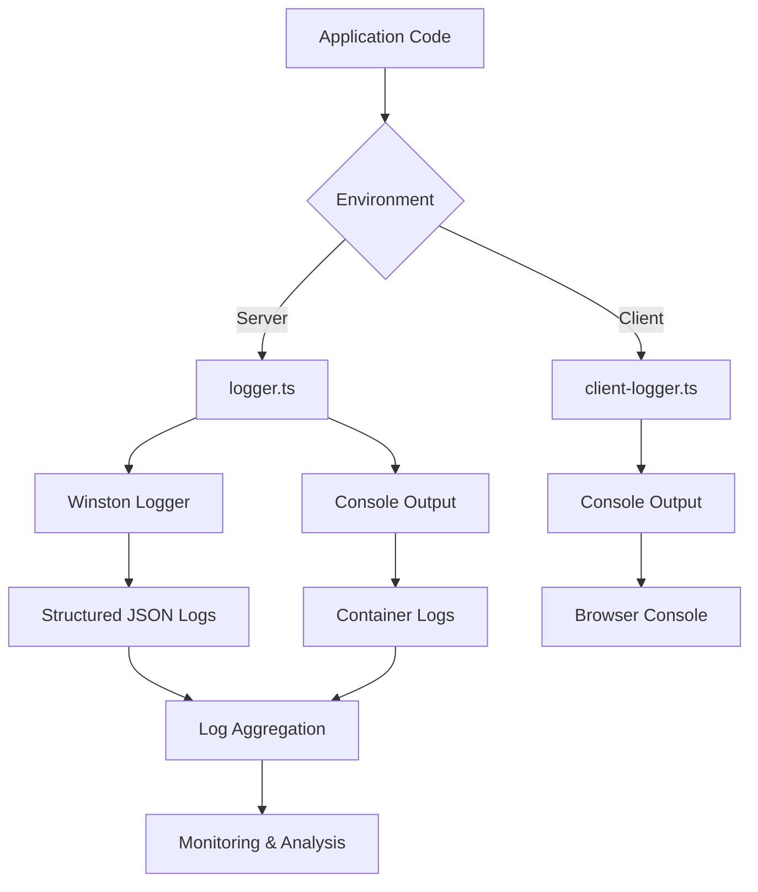
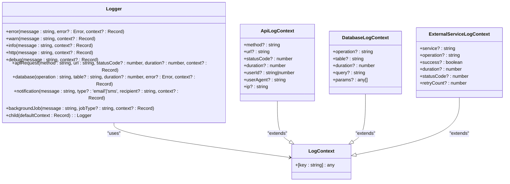
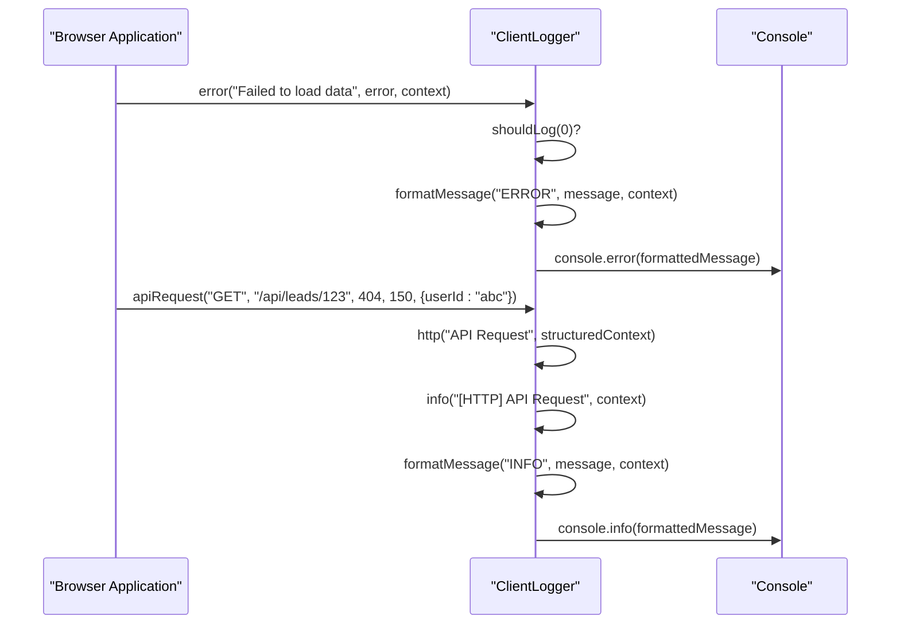
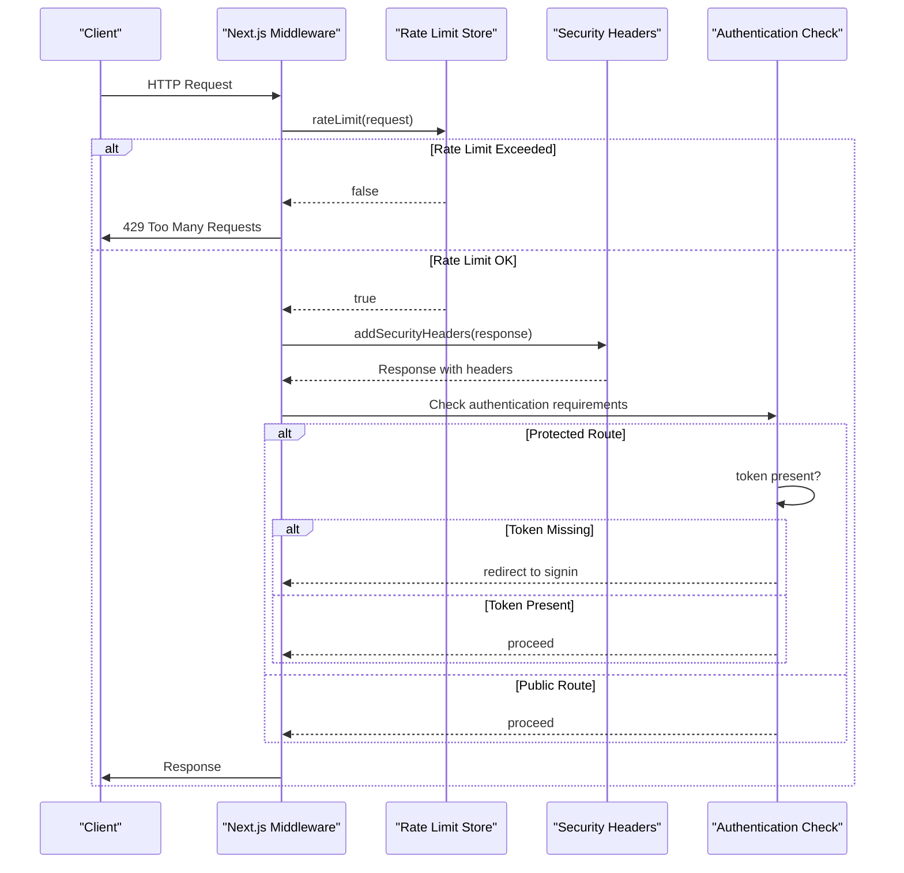
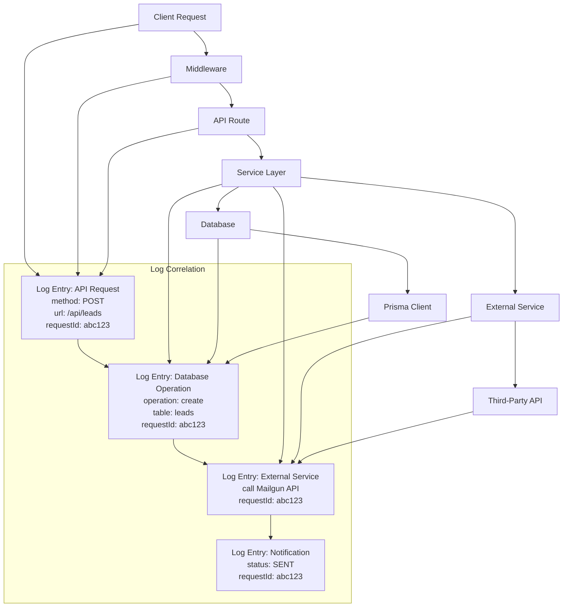
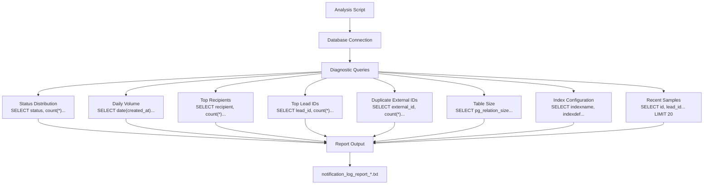

# Logging and Troubleshooting

<cite>
**Referenced Files in This Document**   
- [logger.ts](file://src/lib/logger.ts)
- [client-logger.ts](file://src/lib/client-logger.ts)
- [middleware.ts](file://src/middleware.ts)
- [run_notification_log_analysis.sh](file://scripts/analysis/run_notification_log_analysis.sh)
- [schema.prisma](file://prisma/schema.prisma)
- [errors.ts](file://src/lib/errors.ts)
- [server-init.ts](file://src/lib/server-init.ts)
</cite>

## Table of Contents
1. [Logging Infrastructure Overview](#logging-infrastructure-overview)
2. [Structured Server-Side Logging](#structured-server-side-logging)
3. [Client-Side Error Capture](#client-side-error-capture)
4. [Request Logging and Middleware Integration](#request-logging-and-middleware-integration)
5. [End-to-End Request Tracing](#end-to-end-request-tracing)
6. [Notification Log Analysis](#notification-log-analysis)
7. [Common Failure Patterns](#common-failure-patterns)
8. [Systematic Troubleshooting Approach](#systematic-troubleshooting-approach)

## Logging Infrastructure Overview

The fund-track application implements a comprehensive logging infrastructure that spans both server and client environments. The system uses structured logging principles to ensure consistent, searchable, and analyzable log output across all components. The logging framework is designed to work seamlessly in both browser and server contexts, providing unified logging capabilities regardless of execution environment.

The architecture employs Winston for server-side logging while maintaining a compatible interface for client-side operations. Log entries are structured with consistent fields and metadata, enabling effective filtering, searching, and analysis. The system supports multiple log levels and specialized logging methods for different operational domains such as authentication, database operations, and external service calls.



**Diagram sources**
- [logger.ts](file://src/lib/logger.ts)
- [client-logger.ts](file://src/lib/client-logger.ts)

**Section sources**
- [logger.ts](file://src/lib/logger.ts)
- [client-logger.ts](file://src/lib/client-logger.ts)

## Structured Server-Side Logging

The server-side logging implementation in `logger.ts` provides structured logging capabilities using the Winston library. The logger supports five custom log levels: error (0), warn (1), info (2), http (3), and debug (4). These levels are color-coded for easy visual identification in development environments.

The logging system formats output as structured JSON in production environments while using a human-readable colored format during development. All log entries include timestamps in the format YYYY-MM-DD HH:mm:ss:ms and automatically capture error stack traces when error objects are provided.



**Diagram sources**
- [logger.ts](file://src/lib/logger.ts#L0-L350)

**Section sources**
- [logger.ts](file://src/lib/logger.ts#L0-L350)

The logger provides specialized methods for different operational domains:
- **API Request Logging**: The `apiRequest` method captures HTTP method, URL, status code, and duration
- **Database Operations**: The `database` method logs operations with timing and optional query details
- **Notifications**: The `notification` method tracks notification attempts with type and recipient
- **Background Jobs**: The `backgroundJob` method monitors scheduled task execution
- **External Services**: The `externalService` method logs interactions with third-party APIs

The logger automatically handles uncaught exceptions and unhandled rejections in production environments, ensuring critical errors are captured even when they might otherwise crash the application.

## Client-Side Error Capture

The client-side logging system implemented in `client-logger.ts` provides a simplified but consistent logging interface for browser environments. The client logger maintains compatibility with the server-side logger's API, allowing for uniform logging patterns across the application.



**Diagram sources**
- [client-logger.ts](file://src/lib/client-logger.ts#L0-L132)

**Section sources**
- [client-logger.ts](file://src/lib/client-logger.ts#L0-L132)

The client logger implements the following key features:
- **Configurable Log Levels**: Controlled by the `NEXT_PUBLIC_LOG_LEVEL` environment variable or environment defaults
- **Structured Error Capture**: Automatically extracts error name, message, and stack trace from Error objects
- **Consistent Formatting**: All log messages include ISO timestamps and structured context data
- **Performance Consideration**: Log level checks prevent unnecessary string formatting for disabled levels

Client-side logs are transmitted to monitoring systems through browser console capture or dedicated error reporting services. The logger ensures that sensitive information is not inadvertently exposed in client logs while still providing sufficient context for debugging.

## Request Logging and Middleware Integration

The application's middleware, defined in `middleware.ts`, plays a crucial role in request logging and error capture. The middleware implements several security and monitoring features that generate log entries for important system events.



**Diagram sources**
- [middleware.ts](file://src/middleware.ts#L0-L189)

**Section sources**
- [middleware.ts](file://src/middleware.ts#L0-L189)

The middleware performs the following logging-relevant functions:
- **Rate Limiting**: Tracks request frequency and logs excessive requests
- **Security Enforcement**: Adds security headers and logs security-related decisions
- **Authentication Control**: Manages access to protected routes and generates authentication events
- **Bot Detection**: Identifies and blocks suspicious automated requests

When rate limiting is enabled, the middleware tracks requests by IP address and returns appropriate HTTP 429 responses when limits are exceeded. The rate limiting configuration is controlled by environment variables `RATE_LIMIT_WINDOW_MS` and `RATE_LIMIT_MAX_REQUESTS`.

The middleware also enforces HTTPS in production environments, redirecting HTTP requests to HTTPS when the `FORCE_HTTPS` environment variable is set to 'true'. This ensures secure communication and prevents mixed-content issues.

## End-to-End Request Tracing

The logging system enables comprehensive request tracing across multiple system components. Each request can be correlated through various components using consistent context data and request identifiers.



**Diagram sources**
- [logger.ts](file://src/lib/logger.ts)
- [middleware.ts](file://src/middleware.ts)
- [errors.ts](file://src/lib/errors.ts)

**Section sources**
- [logger.ts](file://src/lib/logger.ts#L0-L350)
- [errors.ts](file://src/lib/errors.ts#L0-L339)

To trace a user request through the system:
1. **Client Initiation**: The request begins in the browser, potentially generating client-side logs
2. **Middleware Processing**: The request passes through middleware, which may log rate limiting or authentication events
3. **API Route Handling**: The API route generates an `apiRequest` log entry with method, URL, and a generated request ID
4. **Service Layer Operations**: Business logic services generate additional logs for database operations, external service calls, and other activities
5. **Database Interaction**: Prisma client operations are logged with timing and query information
6. **External Service Calls**: Integrations with third-party services generate external service logs
7. **Response Generation**: The final response status is logged, completing the request trace

The `requestId` field, generated in the error handling middleware, provides a consistent correlation ID across all log entries for a single request. This enables developers to search for all logs related to a specific request by its ID.

## Notification Log Analysis

The application includes a dedicated script for analyzing notification logs, located at `run_notification_log_analysis.sh`. This script executes a series of diagnostic queries against the production database to assess notification system performance and identify potential issues.



**Diagram sources**
- [run_notification_log_analysis.sh](file://scripts/analysis/run_notification_log_analysis.sh#L0-L65)
- [schema.prisma](file://prisma/schema.prisma#L200-L215)

**Section sources**
- [run_notification_log_analysis.sh](file://scripts/analysis/run_notification_log_analysis.sh#L0-L65)
- [schema.prisma](file://prisma/schema.prisma#L200-L215)

The notification log table structure includes the following key fields:
- **id**: Primary key (Int)
- **leadId**: Foreign key to leads table (Int, nullable)
- **type**: NotificationType enum (EMAIL or SMS)
- **recipient**: Target email or phone number (String)
- **subject**: Message subject (String, nullable)
- **content**: Message body (String, nullable)
- **status**: NotificationStatus enum (PENDING, SENT, FAILED)
- **externalId**: Identifier from external service (String, nullable)
- **errorMessage**: Error details if failed (String, nullable)
- **sentAt**: Timestamp when sent (DateTime, nullable)
- **createdAt**: Creation timestamp (DateTime)

The analysis script generates a comprehensive report that includes:
- Status distribution (sent vs. failed notifications)
- Daily notification volume over the past 30 days
- Top recipients by notification count
- Top lead IDs by notification count
- Duplicate external IDs that may indicate retry issues
- Table and index size metrics
- Index configuration details
- Sample recent log entries

This information helps identify delivery issues, performance bottlenecks, and configuration problems in the notification system.

## Common Failure Patterns

The logging system captures several common failure patterns that can be identified through specific diagnostic signatures in the logs.

### Database Connection Issues
```json
{
  "timestamp": "2025-08-26 12:00:00:000",
  "level": "error",
  "message": "Database operation failed: query",
  "context": {
    "operation": "query",
    "table": "leads",
    "category": "database"
  },
  "error": {
    "name": "PrismaClientInitializationError",
    "message": "Can't reach database server",
    "stack": "..."
  }
}
```
**Diagnostic Signature**: Repeated database errors with connection-related error messages, often occurring across multiple requests simultaneously.

### Authentication Token Expiration
```json
{
  "timestamp": "2025-08-26 12:05:00:000",
  "level": "warn",
  "message": "Operational error occurred",
  "context": {
    "code": "AUTHENTICATION_ERROR",
    "message": "Authentication required",
    "statusCode": 401,
    "requestId": "xyz789"
  }
}
```
**Diagnostic Signature**: HTTP 401 errors with authentication error codes, often followed by redirect to signin page.

### External Service Rate Limiting
```json
{
  "timestamp": "2025-08-26 12:10:00:000",
  "level": "error",
  "[EXTERNAL_SERVICE]": "Mailgun API send",
  "context": {
    "service": "Mailgun",
    "operation": "send",
    "success": false,
    "statusCode": 429,
    "retryCount": 3
  }
}
```
**Diagnostic Signature**: External service errors with HTTP 429 status codes and increasing retry counts.

### Notification Delivery Failures
```json
{
  "timestamp": "2025-08-26 12:15:00:000",
  "level": "info",
  "message": "[NOTIFICATION] Failed to send email",
  "context": {
    "type": "email",
    "recipient": "user@example.com",
    "category": "notification",
    "errorMessage": "Email address not found"
  }
}
```
**Diagnostic Signature**: Notification logs with FAILED status and specific error messages about invalid addresses or content filtering.

### Background Job Processing Errors
```json
{
  "timestamp": "2025-08-26 12:20:00:000",
  "level": "error",
  "message": "[BACKGROUND_JOB] Polling failed",
  "context": {
    "jobType": "poll-leads",
    "category": "background_job",
    "error": {
      "name": "LegacyDatabaseError",
      "message": "Connection timeout"
    }
  }
}
```
**Diagnostic Signature**: Background job errors that repeat at scheduled intervals, indicating systemic issues with job execution.

**Section sources**
- [logger.ts](file://src/lib/logger.ts#L0-L350)
- [errors.ts](file://src/lib/errors.ts#L0-L339)
- [schema.prisma](file://prisma/schema.prisma#L200-L215)

## Systematic Troubleshooting Approach

A systematic approach to troubleshooting based on log evidence involves the following steps:

### Step 1: Identify the Symptom
Determine the user-visible issue or system behavior that requires investigation. Common symptoms include:
- Failed API requests with error responses
- Missing or delayed notifications
- Slow application performance
- Authentication failures
- Data inconsistencies

### Step 2: Gather Correlation Information
Collect identifying information to trace related log entries:
- Request ID from API responses
- User ID or email address
- Timestamp of the issue
- Specific URL or endpoint
- Error code or message

### Step 3: Search for Correlated Logs
Use the correlation information to find relevant log entries:
- Search for the request ID across all log entries
- Filter by timestamp range around the incident
- Look for entries with the specific user ID
- Identify the first error in a sequence of related events

### Step 4: Analyze the Error Chain
Examine the sequence of events leading to and following the error:
- Trace the request through middleware, API routes, and services
- Identify any database or external service failures
- Check for cascading errors that may have multiple causes
- Determine whether the error is isolated or systemic

### Step 5: Evaluate Contextual Information
Examine the context data in log entries for clues:
- Review database query parameters for invalid values
- Check external service request payloads for correctness
- Verify authentication tokens and permissions
- Assess system load and resource utilization

### Step 6: Formulate and Test Hypotheses
Develop potential causes based on the evidence:
- Reproduce the issue in a controlled environment
- Check configuration settings that may affect behavior
- Verify external service availability and credentials
- Review recent code changes that might introduce the issue

### Step 7: Implement and Verify Resolution
Apply fixes and validate their effectiveness:
- Monitor logs for resolution of the specific error
- Confirm that related functionality is working correctly
- Check for any new or unexpected errors
- Document the root cause and resolution for future reference

This systematic approach ensures thorough investigation of issues while minimizing the risk of overlooking contributing factors. By following the evidence in the logs, developers can efficiently diagnose and resolve problems in the fund-track application.

**Section sources**
- [logger.ts](file://src/lib/logger.ts#L0-L350)
- [errors.ts](file://src/lib/errors.ts#L0-L339)
- [middleware.ts](file://src/middleware.ts#L0-L189)
- [client-logger.ts](file://src/lib/client-logger.ts#L0-L132)