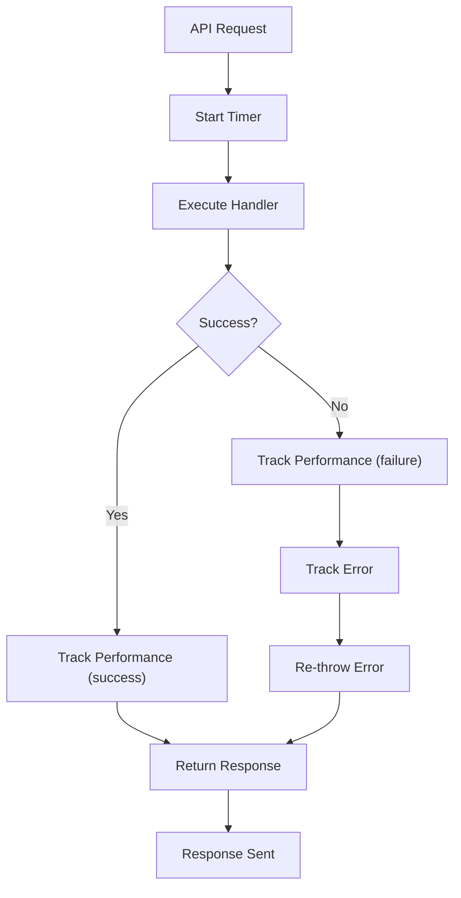
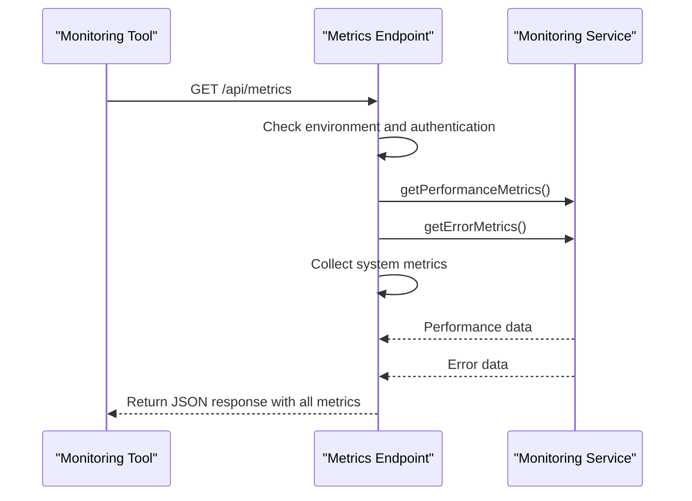
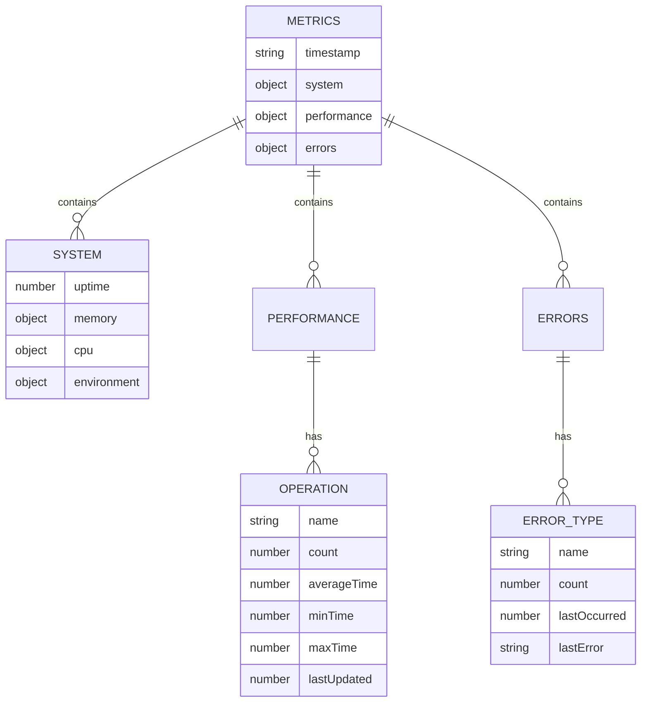
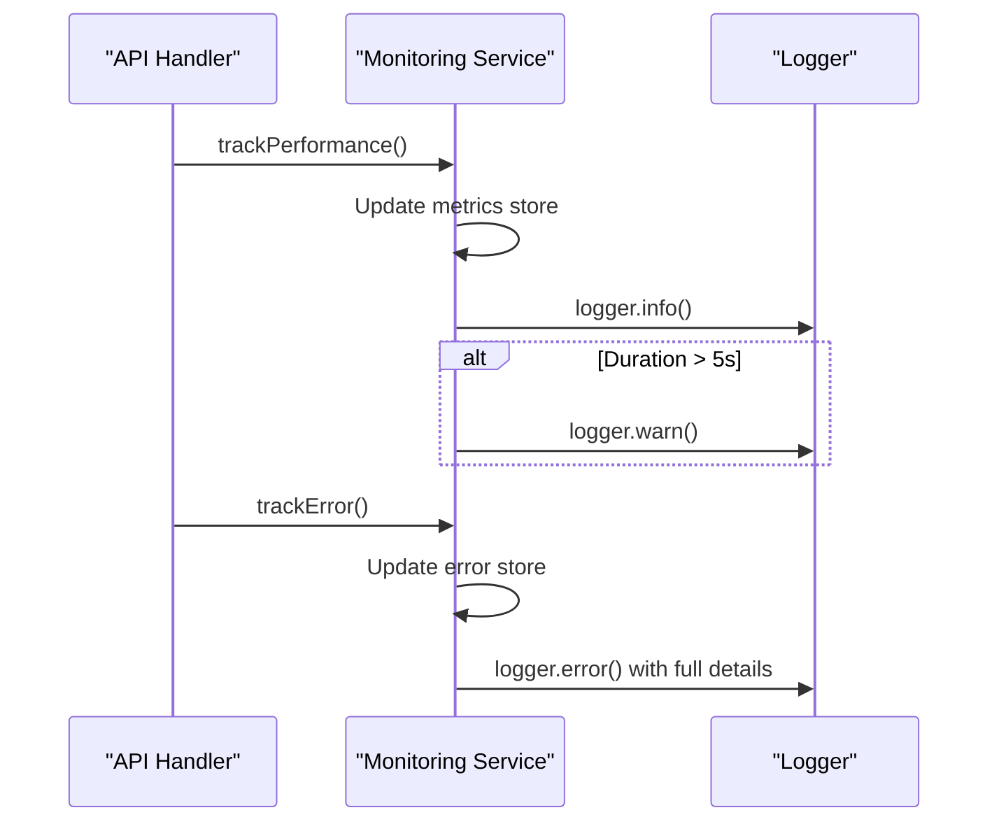

# Monitoring Utilities

<cite>
**Referenced Files in This Document**   
- [src/lib/monitoring.ts](file://src/lib/monitoring.ts)
- [src/app/api/metrics/route.ts](file://src/app/api/metrics/route.ts)
- [src/app/api/monitoring/status/route.ts](file://src/app/api/monitoring/status/route.ts)
- [src/lib/logger.ts](file://src/lib/logger.ts)
- [README.md](file://README.md)
</cite>

## Table of Contents
1. [Introduction](#introduction)
2. [Monitoring Service Implementation](#monitoring-service-implementation)
3. [Metrics Endpoint for External Monitoring](#metrics-endpoint-for-external-monitoring)
4. [Data Structure of Monitoring Output](#data-structure-of-monitoring-output)
5. [Integration with Logging and Error Tracking](#integration-with-logging-and-error-tracking)
6. [Visualization and Dashboard Examples](#visualization-and-dashboard-examples)
7. [Alerting Best Practices](#alerting-best-practices)
8. [Conclusion](#conclusion)

## Introduction
The fund-track application implements a comprehensive monitoring system to collect system metrics, error rates, and performance data. This documentation details the monitoring utilities used throughout the application, focusing on the implementation of the monitoring service, the metrics endpoint for external observability tools, and integration with logging infrastructure. The system is designed to provide real-time insights into application health, performance trends, and error patterns, enabling proactive maintenance and optimization.

## Monitoring Service Implementation

The monitoring service is implemented in `src/lib/monitoring.ts` and provides utilities for tracking performance metrics and errors. The service uses in-memory data structures to store metrics, which can be extended to use Redis or similar persistent storage in production environments.

The monitoring system includes two primary data stores:
- **Performance metrics store**: Tracks request latency, operation counts, and timing statistics
- **Error tracking store**: Records error occurrences, frequencies, and contextual information

The service implements a middleware pattern through the `withPerformanceMonitoring` function, which wraps API handlers to automatically track execution time and error conditions. This approach ensures consistent monitoring across all API endpoints without requiring repetitive instrumentation code.



**Diagram sources**
- [src/lib/monitoring.ts](file://src/lib/monitoring.ts#L130-L167)

**Section sources**
- [src/lib/monitoring.ts](file://src/lib/monitoring.ts#L0-L276)

## Metrics Endpoint for External Monitoring

The application exposes a metrics endpoint at `/api/metrics` that provides telemetry data in a structured JSON format suitable for consumption by monitoring tools like Prometheus. The endpoint is implemented in `src/app/api/metrics/route.ts`.

In production environments, the endpoint requires authentication via a Bearer token that must match the `METRICS_API_KEY` environment variable. This security measure prevents unauthorized access to sensitive performance data.

The metrics endpoint collects and returns:
- System-level metrics (uptime, memory usage, CPU usage)
- Performance metrics from the monitoring service
- Error metrics from the error tracking store
- Environment information (Node.js version, platform, architecture)



**Diagram sources**
- [src/app/api/metrics/route.ts](file://src/app/api/metrics/route.ts#L0-L59)

**Section sources**
- [src/app/api/metrics/route.ts](file://src/app/api/metrics/route.ts#L0-L59)

## Data Structure of Monitoring Output

The monitoring system exposes a comprehensive data structure through the metrics endpoint, providing detailed insights into application performance and health.

### System Metrics
The system metrics include:
- **Uptime**: Application uptime in seconds
- **Memory**: Detailed memory usage statistics in MB
  - heapUsed: Memory used by the JavaScript heap
  - heapTotal: Total heap memory allocated
  - external: Memory used by C++ objects bound to JavaScript objects
  - rss: Resident Set Size (total memory allocated for the process)
- **CPU**: CPU usage statistics
- **Environment**: Node.js version, platform, and architecture

### Performance Metrics
Performance metrics are organized by operation name and include:
- **count**: Number of times the operation was executed
- **averageTime**: Average execution time in milliseconds
- **minTime**: Minimum execution time recorded
- **maxTime**: Maximum execution time recorded
- **lastUpdated**: Timestamp of the last update

### Error Metrics
Error metrics track error occurrences by error type and include:
- **count**: Number of times this error type occurred
- **lastOccurred**: Timestamp of the most recent occurrence
- **lastError**: Message from the most recent error instance



**Diagram sources**
- [src/app/api/metrics/route.ts](file://src/app/api/metrics/route.ts#L0-L59)
- [src/lib/monitoring.ts](file://src/lib/monitoring.ts#L0-L276)

**Section sources**
- [src/app/api/metrics/route.ts](file://src/app/api/metrics/route.ts#L0-L59)
- [src/lib/monitoring.ts](file://src/lib/monitoring.ts#L0-L276)

## Integration with Logging and Error Tracking

The monitoring system is tightly integrated with the application's logging infrastructure, implemented in `src/lib/logger.ts`. This integration ensures that all monitoring events are properly recorded and available for analysis.

### Performance Monitoring Integration
When performance metrics are tracked via `trackPerformance()`, the system:
1. Updates the in-memory metrics store with timing data
2. Logs the performance event at the "info" level
3. Generates a warning log if the operation exceeds 5 seconds

This dual approach allows for both real-time monitoring and historical analysis of performance trends.

### Error Tracking Integration
Error tracking is implemented through the `trackError()` function, which:
1. Updates the error store with occurrence statistics
2. Logs detailed error information including message, stack trace, and context
3. Preserves user context (userId, userAgent, url) when available

The logger uses Winston for server-side logging with structured JSON output, while falling back to console logging in browser environments. Custom log levels (error, warn, info, http, debug) provide granular control over log verbosity.



**Diagram sources**
- [src/lib/monitoring.ts](file://src/lib/monitoring.ts#L0-L276)
- [src/lib/logger.ts](file://src/lib/logger.ts#L0-L350)

**Section sources**
- [src/lib/monitoring.ts](file://src/lib/monitoring.ts#L0-L276)
- [src/lib/logger.ts](file://src/lib/logger.ts#L0-L350)

## Visualization and Dashboard Examples

While the application does not include built-in dashboard components for monitoring data, the exposed metrics endpoint can be integrated with external visualization tools.

### Prometheus and Grafana Integration
The `/api/metrics` endpoint can be scraped by Prometheus, which can then feed data into Grafana for visualization. Example dashboards could include:

- **Performance Overview**: Line charts showing average request latency over time, with alerts for spikes above thresholds
- **Error Rate Monitoring**: Bar charts displaying error counts by type, with drill-down capabilities
- **System Health**: Gauges showing memory usage percentages and uptime statistics

### Custom Dashboard Implementation
To create a custom admin dashboard, developers could:
1. Create an API route that transforms the metrics data into a format optimized for frontend consumption
2. Implement a React component that fetches and visualizes the monitoring data
3. Use charting libraries like Chart.js or Recharts to render performance trends

Example code for consuming metrics data:
```typescript
// Example: Fetching metrics for dashboard visualization
const response = await fetch('/api/metrics', {
  headers: {
    'Authorization': `Bearer ${process.env.METRICS_API_KEY}`
  }
});
const metrics = await response.json();

// Process metrics for visualization
const performanceData = Object.entries(metrics.performance).map(([name, data]) => ({
  operation: name,
  avgDuration: data.averageTime,
  count: data.count
}));
```

**Section sources**
- [src/app/api/metrics/route.ts](file://src/app/api/metrics/route.ts#L0-L59)
- [README.md](file://README.md#L66-L119)

## Alerting Best Practices

### Setting Up Alerts
Based on the available metrics, recommended alerts include:

- **High Error Rates**: Alert when error counts exceed thresholds (e.g., > 10 errors of the same type in 5 minutes)
- **Performance Degradation**: Alert when average request latency exceeds 2 seconds or maximum latency exceeds 10 seconds
- **Memory Pressure**: Alert when heap memory usage exceeds 80% of total allocation
- **Service Unavailability**: Alert when the metrics endpoint returns non-200 status codes

### Interpreting Trends
When analyzing monitoring data over time:

- **Performance Trends**: Look for gradual increases in average latency, which may indicate memory leaks or database performance issues
- **Error Patterns**: Correlate error spikes with deployment times to identify regression issues
- **Usage Patterns**: Analyze request volume patterns to plan for scaling needs
- **Resource Utilization**: Monitor memory and CPU trends to determine optimal instance sizing

### Alert Configuration Example
```yaml
# Example Prometheus alert rules
- alert: HighErrorRate
  expr: sum(rate(errors_count[5m])) by (error_type) > 10
  for: 5m
  labels:
    severity: critical
  annotations:
    summary: "High error rate for {{ $labels.error_type }}"
    description: "{{ $value }} errors in the last 5 minutes"

- alert: SlowRequests
  expr: avg(rate(performance_duration_seconds[5m])) > 2
  for: 10m
  labels:
    severity: warning
  annotations:
    summary: "Application performance degradation"
    description: "Average request duration is {{ $value }} seconds"
```

**Section sources**
- [src/lib/monitoring.ts](file://src/lib/monitoring.ts#L0-L276)
- [src/app/api/metrics/route.ts](file://src/app/api/metrics/route.ts#L0-L59)

## Conclusion
The monitoring utilities in the fund-track application provide a robust foundation for observability, combining performance tracking, error monitoring, and system metrics collection. The implementation leverages in-memory data stores for efficiency while providing a standardized interface for external monitoring tools through the `/api/metrics` endpoint. Integration with the logging system ensures comprehensive telemetry collection, enabling both real-time monitoring and historical analysis. While the application currently lacks built-in visualization components, the exposed metrics format is compatible with industry-standard monitoring tools like Prometheus and Grafana, allowing teams to establish effective monitoring and alerting practices.