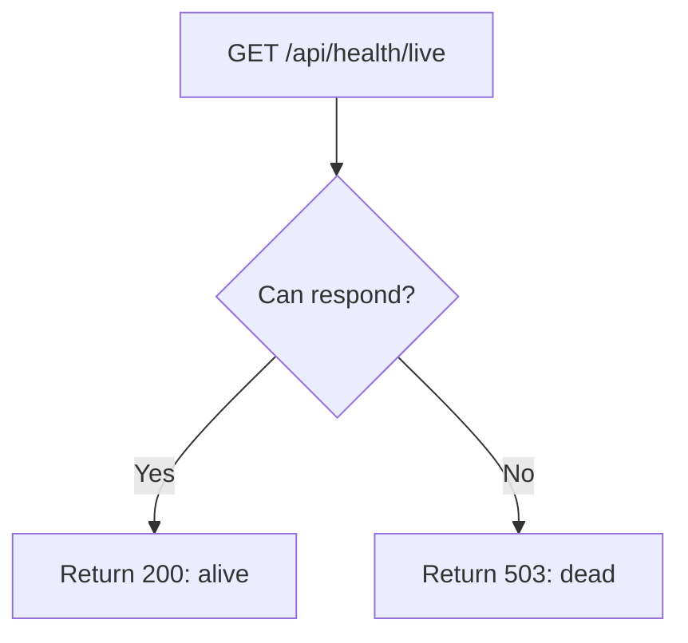
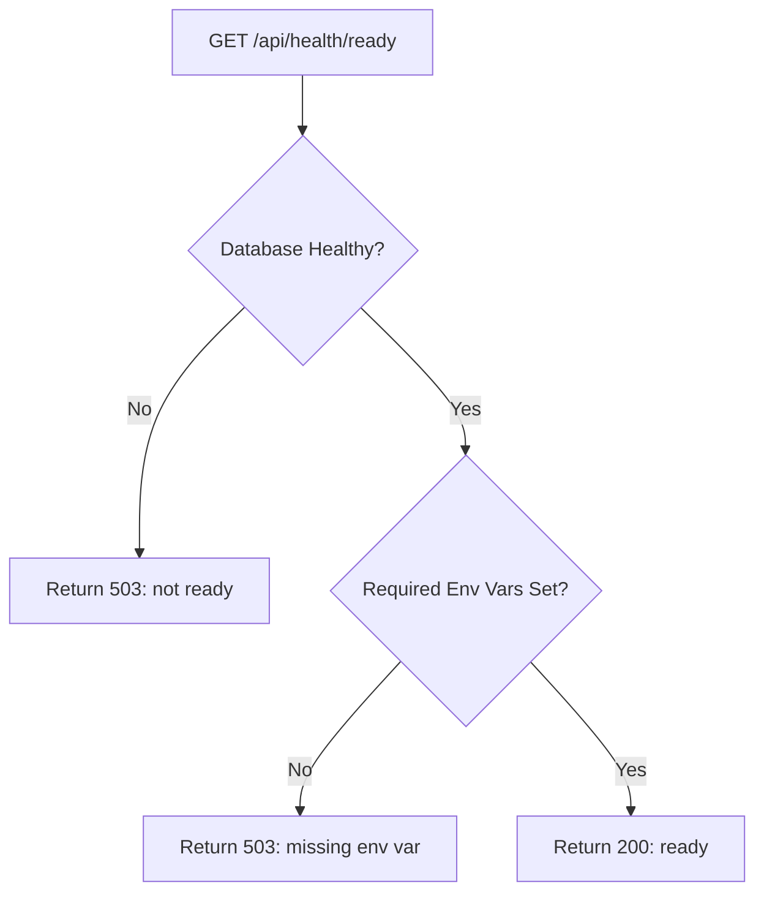
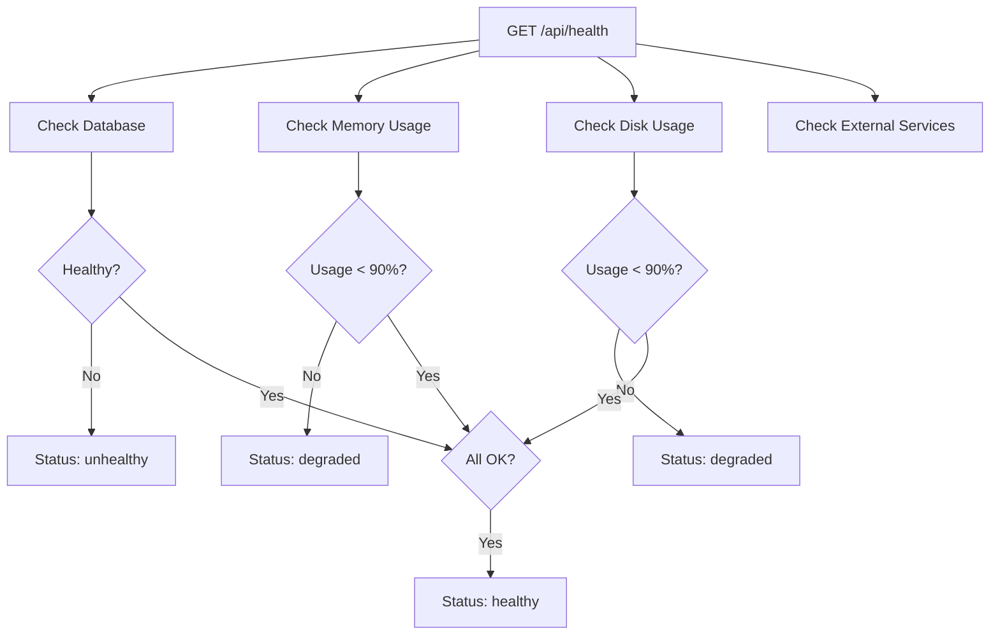
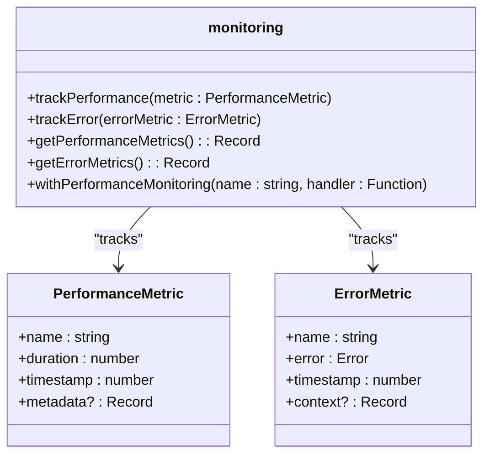
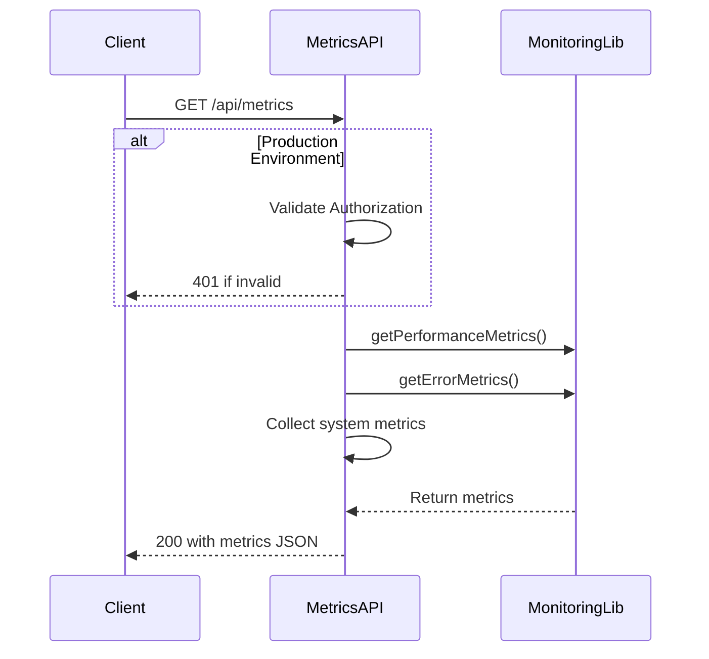
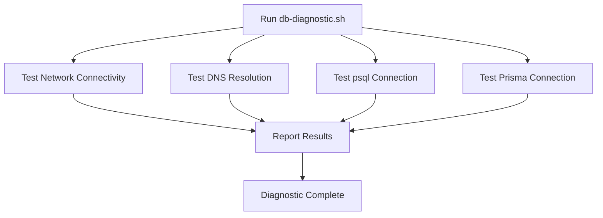
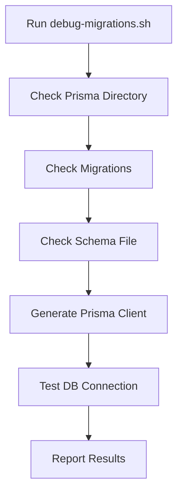
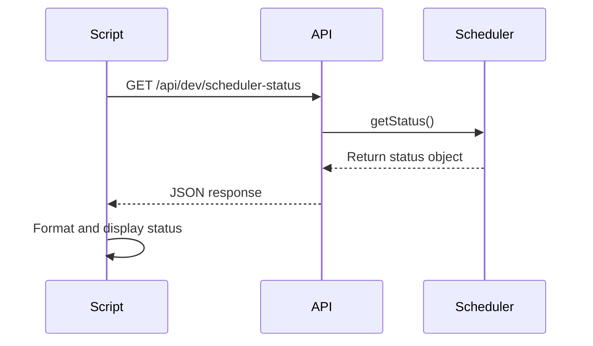
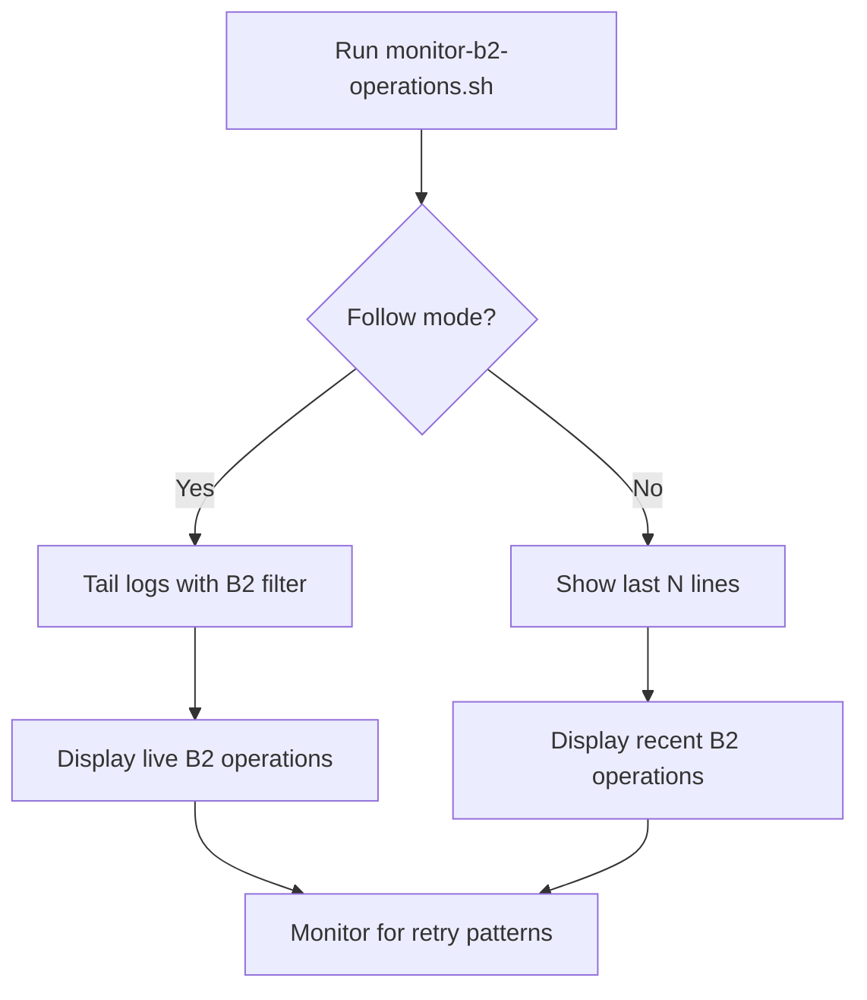
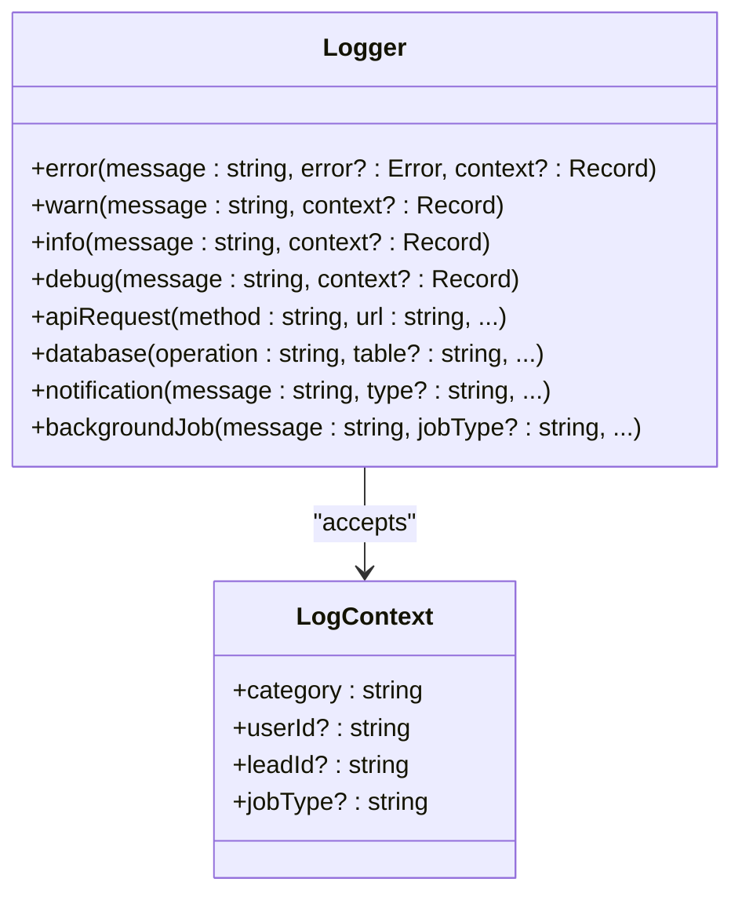

# Monitoring and Diagnostics

<cite>
**Referenced Files in This Document**   
- [health-check.sh](file://scripts/health-check.sh) - *Updated in recent commit*
- [live/route.ts](file://src/app/api/health/live/route.ts)
- [ready/route.ts](file://src/app/api/health/ready/route.ts)
- [route.ts](file://src/app/api/health/route.ts) - *Updated in recent commit*
- [monitoring.ts](file://src/lib/monitoring.ts) - *Refactored to remove Sentry*
- [route.ts](file://src/app/api/metrics/route.ts)
- [BackgroundJobScheduler.ts](file://src/services/BackgroundJobScheduler.ts)
- [check-scheduler.mjs](file://scripts/check-scheduler.mjs)
- [db-diagnostic.sh](file://scripts/db-diagnostic.sh)
- [debug-migrations.sh](file://scripts/debug-migrations.sh)
- [logger.ts](file://src/lib/logger.ts)
- [monitor-b2-operations.sh](file://scripts/monitor-b2-operations.sh) - *Newly added script*
</cite>

## Update Summary
- Updated **Monitoring Utilities** section to reflect removal of Sentry error reporting
- Added new section for **Backblaze B2 Operations Monitoring**
- Removed references to Sentry functions in monitoring implementation
- Updated health check endpoint details to reflect current implementation
- Added new diagnostic script for B2 operations monitoring

## Table of Contents
1. [Health Check Endpoints](#health-check-endpoints)  
2. [Monitoring Utilities](#monitoring-utilities)  
3. [Diagnostic Scripts](#diagnostic-scripts)  
4. [Log Collection and Structure](#log-collection-and-structure)  
5. [Interpreting Monitoring Data](#interpreting-monitoring-data)  
6. [Operational Procedures](#operational-procedures)

## Health Check Endpoints

The fund-track application implements two distinct health check endpoints—`live` and `ready`—to support container orchestration systems like Kubernetes. These endpoints provide different levels of health assessment for liveness and readiness probes.

### Liveness Probe (`/api/health/live`)

The liveness endpoint determines whether the application process is running. It performs a minimal check and returns success if the server can respond to HTTP requests.



**Section sources**  
- [live/route.ts](file://src/app/api/health/live/route.ts#L1-L28)

### Readiness Probe (`/api/health/ready`)

The readiness endpoint verifies whether the application is ready to serve traffic. It checks critical dependencies such as database connectivity and required environment variables.



**Section sources**  
- [ready/route.ts](file://src/app/api/health/ready/route.ts#L1-L58)

### Comprehensive Health Check (`/api/health`)

The main health endpoint provides a detailed system status report, including checks for database, memory, disk, and external services (Twilio, Mailgun, Backblaze). It returns a structured JSON response with an overall status of `healthy`, `degraded`, or `unhealthy`.



**Diagram sources**  
- [route.ts](file://src/app/api/health/route.ts#L1-L294)

**Section sources**  
- [route.ts](file://src/app/api/health/route.ts#L1-L294)

## Monitoring Utilities

The application includes built-in utilities for tracking system performance, error rates, and service availability.

### Performance and Error Tracking

The `monitoring.ts` module provides functions to track performance metrics and errors. It uses in-memory stores to record operation durations and error occurrences, which are exposed via the `/api/metrics` endpoint. The legacy Sentry integration has been removed, and error reporting is now handled through local logging only.



**Diagram sources**  
- [monitoring.ts](file://src/lib/monitoring.ts#L1-L245)

**Section sources**  
- [monitoring.ts](file://src/lib/monitoring.ts#L1-L245)

### Metrics Endpoint (`/api/metrics`)

This endpoint exposes system, performance, and error metrics in a structured format suitable for monitoring tools. In production, access requires authentication via a bearer token.



**Section sources**  
- [route.ts](file://src/app/api/metrics/route.ts#L1-L60)

## Diagnostic Scripts

A suite of shell and JavaScript scripts are provided for diagnosing common issues in development and production environments.

### Database Diagnostic Script (`db-diagnostic.sh`)

This script performs connectivity tests to the PostgreSQL database using multiple methods: network connectivity (nc/telnet), DNS resolution, direct psql connection, and Prisma client connection.



**Section sources**  
- [db-diagnostic.sh](file://scripts/db-diagnostic.sh#L1-L79)

### Migration Debugging Script (`debug-migrations.sh`)

This script checks the integrity of Prisma migration files and configuration. It verifies the presence of migration directories, schema files, and attempts to generate the Prisma client and test database connectivity.



**Section sources**  
- [debug-migrations.sh](file://scripts/debug-migrations.sh#L1-L96)

### Scheduler Verification (`check-scheduler.mjs`)

This script queries the `/api/dev/scheduler-status` endpoint to verify the status of background job schedulers. It displays whether the scheduler is running, cron patterns, and next execution times.



**Section sources**  
- [check-scheduler.mjs](file://scripts/check-scheduler.mjs#L1-L72)

### Backblaze B2 Operations Monitoring (`monitor-b2-operations.sh`)

This script monitors Backblaze B2 operations by filtering application logs for external service calls related to B2. It supports various filtering options for errors, authorization events, and download operations.



**Section sources**  
- [monitor-b2-operations.sh](file://scripts/monitor-b2-operations.sh#L1-L112)

## Log Collection and Structure

The application uses a structured logging system based on Winston for server-side logging and console fallback for client-side.

### Logger Implementation

The `logger.ts` module provides a unified interface for logging across environments. It supports structured context, error stack traces, and specialized log methods for different categories.



**Diagram sources**  
- [logger.ts](file://src/lib/logger.ts#L1-L351)

**Section sources**  
- [logger.ts](file://src/lib/logger.ts#L1-L351)

### Log Categories and Structure

Logs are categorized and tagged for easy filtering:
- `[AUTH]` - Authentication events
- `[LEAD_IMPORT]` - Lead import operations
- `[NOTIFICATION]` - Email/SMS notifications
- `[BACKGROUND_JOB]` - Scheduled job execution
- `[EXTERNAL_SERVICE]` - Third-party API calls
- `[FILE]` - File upload/download operations

All logs include timestamp, level, message, and structured context in JSON format in production.

## Interpreting Monitoring Data

### Health Status Interpretation

| Status | Meaning | Action |
|--------|-------|--------|
| `healthy` | All systems operational | No action needed |
| `degraded` | Non-critical issue (high memory/disk) | Monitor and investigate |
| `unhealthy` | Critical failure (DB down) | Immediate investigation required |

### Performance Metrics

The `/api/metrics` endpoint provides:
- **Performance metrics**: Average, min, max durations for key operations
- **Error metrics**: Frequency of different error types
- **System metrics**: Memory usage, uptime, CPU usage

Slow operations (>5 seconds) are automatically logged as warnings.

### Alert Response Guidelines

- **Database unreachable**: Check `DATABASE_URL`, network connectivity, and PostgreSQL status
- **High memory usage**: Investigate for memory leaks; restart service if necessary
- **Scheduler not running**: Verify `ENABLE_BACKGROUND_JOBS=true` and restart
- **External service failure**: Check API keys and service status
- **B2 authorization failures**: Monitor with `monitor-b2-operations.sh --auth` and check retry patterns

## Operational Procedures

### System Verification

1. Run `scripts/health-check.sh` to verify overall health
2. Check scheduler status with `scripts/check-scheduler.mjs`
3. Verify database connectivity with `scripts/db-diagnostic.sh`
4. Monitor B2 operations with `scripts/monitor-b2-operations.sh`
5. Review recent logs for errors or warnings

### Issue Diagnosis

For database issues:
```bash
./scripts/db-diagnostic.sh
```

For migration issues:
```bash
./scripts/debug-migrations.sh
```

For scheduler issues:
```bash
node scripts/check-scheduler.mjs
```

For B2 operations issues:
```bash
./scripts/monitor-b2-operations.sh --errors --follow
```

For general health:
```bash
./scripts/health-check.sh --verbose
```

### Recovery Procedures

- **Restart scheduler**: `node scripts/force-start-scheduler.mjs`
- **Emergency cleanup**: `node scripts/emergency-cleanup.mjs`
- **Database backup**: `scripts/backup-database.sh`
- **Disaster recovery**: `scripts/disaster-recovery.sh`

These tools and procedures provide comprehensive monitoring and diagnostic capabilities for maintaining the reliability and performance of the fund-track application in production environments.

**Section sources**  
- [health-check.sh](file://scripts/health-check.sh#L1-L118)
- [check-scheduler.mjs](file://scripts/check-scheduler.mjs#L1-L72)
- [db-diagnostic.sh](file://scripts/db-diagnostic.sh#L1-L79)
- [debug-migrations.sh](file://scripts/debug-migrations.sh#L1-L96)
- [monitor-b2-operations.sh](file://scripts/monitor-b2-operations.sh#L1-L112)