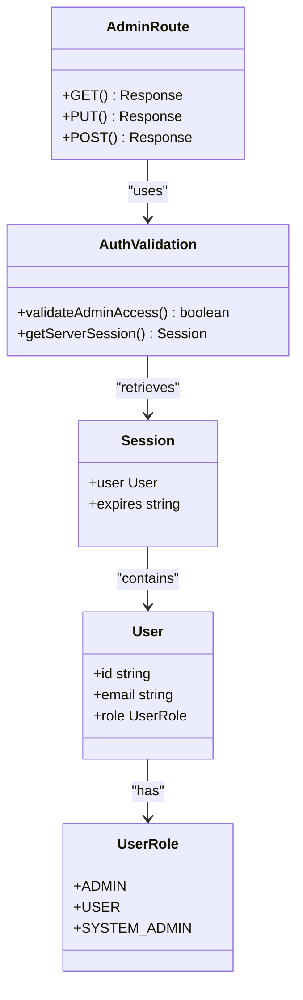
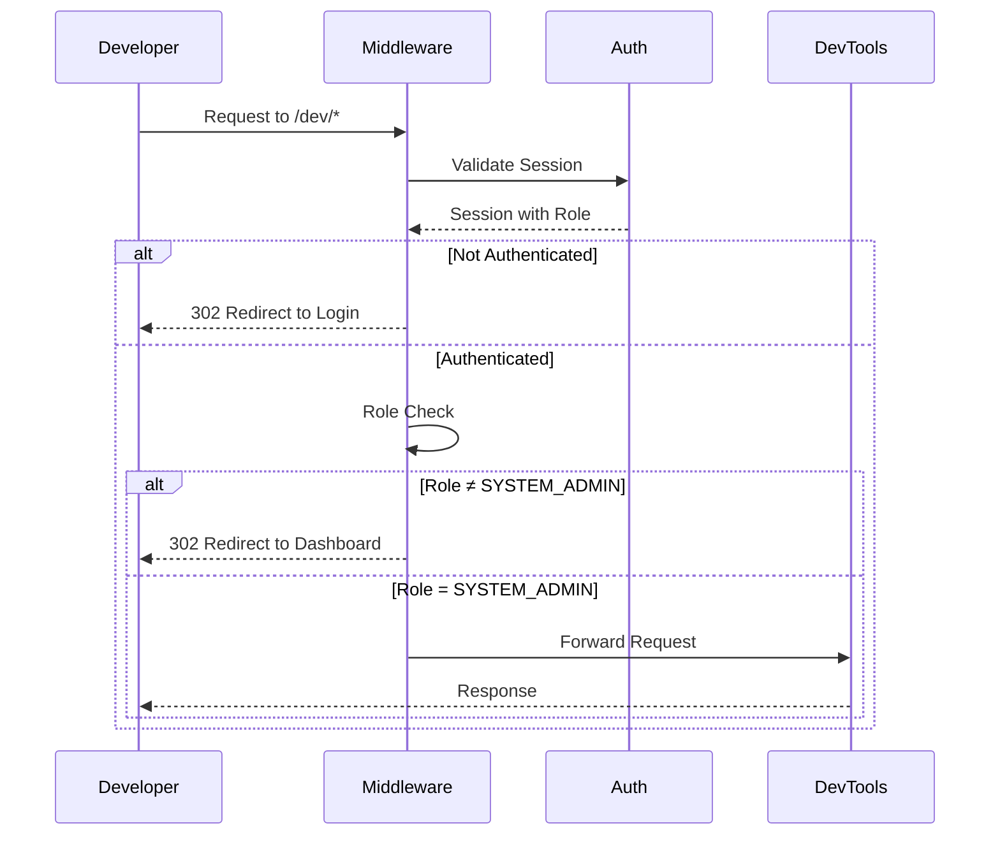
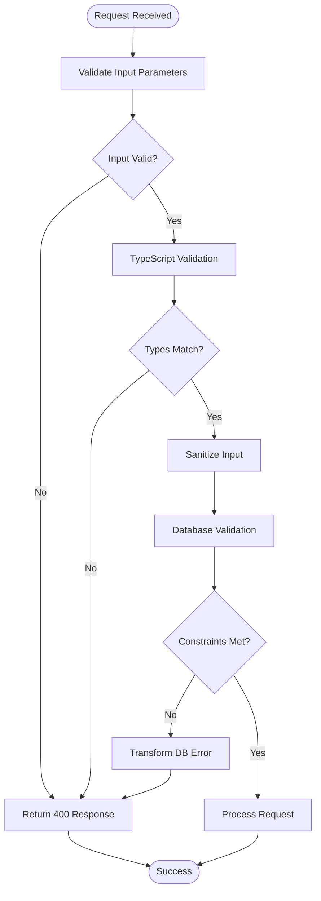
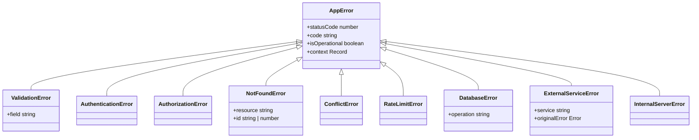
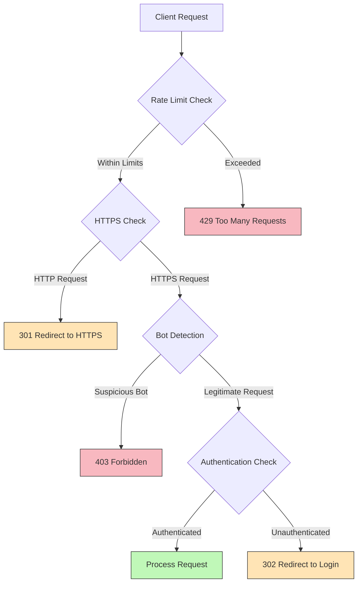
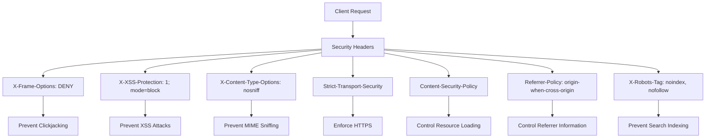

# API Security

<cite>
**Referenced Files in This Document**   
- [middleware.ts](file://src/middleware.ts#L1-L226) - *Updated to enforce SYSTEM_ADMIN role for dev tools*
- [RoleGuard.tsx](file://src/components/auth/RoleGuard.tsx#L1-L75) - *Updated with SYSTEM_ADMIN role support*
- [schema.prisma](file://prisma/schema.prisma#L1-L249) - *Added SYSTEM_ADMIN role enum value*
- [users/route.ts](file://src/app/api/admin/users/route.ts#L48-L97) - *Updated with SYSTEM_ADMIN role checks*
- [dev/layout.tsx](file://src/app/dev/layout.tsx#L1-L38) - *Server-side role validation for dev tools*
</cite>

## Update Summary
**Changes Made**   
- Updated role-based access control sections to include the new SYSTEM_ADMIN role
- Added documentation for enhanced protection of development tools
- Updated code examples and diagrams to reflect new authorization logic
- Added section on SYSTEM_ADMIN role capabilities and restrictions
- Enhanced source tracking with annotations for updated files

## Table of Contents
1. [Introduction](#introduction)
2. [Authentication and Authorization with Next.js Middleware](#authentication-and-authorization-with-nextjs-middleware)
3. [Role-Based Access Control in Admin Endpoints](#role-based-access-control-in-admin-endpoints)
4. [SYSTEM_ADMIN Role and Development Tool Protection](#system_admin-role-and-development-tool-protection)
5. [Input Validation and Injection Prevention](#input-validation-and-injection-prevention)
6. [Resource Ownership Validation and IDOR Prevention](#resource-ownership-validation-and-idor-prevention)
7. [Secure Error Handling and Information Leakage Prevention](#secure-error-handling-and-information-leakage-prevention)
8. [CORS and Rate Limiting Configuration](#cors-and-rate-limiting-configuration)
9. [Security Headers and Response Protection](#security-headers-and-response-protection)

## Introduction
This document provides a comprehensive analysis of the API security implementation in the Fund Track application. The system employs a multi-layered security approach that includes authentication, authorization, input validation, error handling, and infrastructure-level protections. The application uses Next.js middleware for centralized request processing, implements role-based access control for administrative functions, and follows secure coding practices to prevent common vulnerabilities such as injection attacks and Insecure Direct Object References (IDOR). The security architecture is designed to protect sensitive data, ensure proper access controls, and provide robust error handling that doesn't expose sensitive information.

## Authentication and Authorization with Next.js Middleware

The application implements a comprehensive authentication and authorization system using Next.js middleware, which processes requests before they reach API endpoints. The middleware serves as a central security gateway that handles authentication, rate limiting, and request validation.

```mermaid
sequenceDiagram
participant Client
participant Middleware
participant Auth
participant API
Client->>Middleware : HTTP Request
Middleware->>Middleware : Rate Limit Check
alt Rate Limited
Middleware-->>Client : 429 Too Many Requests
deactivate Middleware
else Not Limited
Middleware->>Middleware : HTTPS Enforcement
Middleware->>Middleware : Bot Detection
Middleware->>Auth : Session Validation
Auth-->>Middleware : Token Verification
alt Unauthenticated
Middleware-->>Client : 302 Redirect to Login
else Authenticated
Middleware->>API : Forward Request
API-->>Client : Response
end
end
```

**Diagram sources**
- [middleware.ts](file://src/middleware.ts#L1-L226) - *Updated with enhanced role checks*

The middleware implementation includes several key security features:

- **Authentication Flow**: Uses `next-auth/middleware` to validate user sessions and tokens
- **Authorization Checks**: Verifies user roles for protected routes, particularly admin endpoints
- **Request Filtering**: Blocks suspicious user agents and bots from accessing sensitive API routes
- **HTTPS Enforcement**: Redirects HTTP requests to HTTPS in production environments
- **Secure Cookies**: Sets Secure and SameSite attributes on cookies in production

The middleware configuration uses a matcher to specify which routes should be processed:

```typescript
export const config = {
  matcher: [
    "/dashboard/:path*",
    "/api/:path*",
    "/application/:path*",
    "/admin/:path*",
    "/dev/:path*"
  ]
}
```

This ensures that all API routes, dashboard pages, application intake pages, admin routes, and development tools are subject to the security checks implemented in the middleware.

**Section sources**
- [middleware.ts](file://src/middleware.ts#L1-L226) - *Updated with dev tool protection*

## Role-Based Access Control in Admin Endpoints

The application implements strict role-based access control (RBAC) for administrative endpoints, ensuring that only users with the appropriate privileges can access sensitive functionality. This is enforced at both the middleware level and within individual API routes.



**Diagram sources**
- [settings/[key]/route.ts](file://src/app/api/admin/settings/[key]/route.ts#L1-L129)
- [middleware.ts](file://src/middleware.ts#L1-L226) - *Updated with SYSTEM_ADMIN role*

The admin settings endpoint demonstrates the RBAC implementation:

```typescript
export async function GET(
  request: NextRequest,
  { params }: { params: Promise<{ key: string }> }
) {
  try {
    const session = await getServerSession(authOptions);

    if (!session?.user || session.user.role !== UserRole.ADMIN) {
      return NextResponse.json(
        { error: "Unauthorized - Admin access required" },
        { status: 403 }
      );
    }
    
    // ... rest of implementation
  } catch (error) {
    // ... error handling
  }
}
```

Key aspects of the RBAC implementation:

- **Role Verification**: Each admin endpoint explicitly checks if the user has the ADMIN role
- **Consistent Error Responses**: Unauthorized access attempts receive a standardized 403 response
- **Middleware Integration**: The middleware also enforces role-based access for admin routes
- **Granular Permissions**: Different admin endpoints can implement specific permission requirements

The system uses the `UserRole` enum defined in the Prisma schema, which includes ADMIN, USER, and SYSTEM_ADMIN roles. This ensures type safety and prevents invalid role values from being stored in the database.

**Section sources**
- [settings/[key]/route.ts](file://src/app/api/admin/settings/[key]/route.ts#L1-L129)
- [schema.prisma](file://prisma/schema.prisma#L1-L249) - *Updated with SYSTEM_ADMIN enum*

## SYSTEM_ADMIN Role and Development Tool Protection

The application has introduced a new SYSTEM_ADMIN role with elevated privileges for system-level administration and development tool access. This role provides enhanced capabilities while implementing additional security controls to prevent misuse.



**Diagram sources**
- [middleware.ts](file://src/middleware.ts#L127-L167) - *Dev tool protection logic*
- [dev/layout.tsx](file://src/app/dev/layout.tsx#L1-L38) - *Server-side validation*

The middleware enforces SYSTEM_ADMIN role requirements for development tools:

```typescript
// Protect dev endpoints - require SYSTEM_ADMIN role
if (pathname.startsWith("/api/dev/")) {
  // Require SYSTEM_ADMIN role
  if (!token) {
    return NextResponse.redirect(new URL("/auth/signin", req.url));
  }
  
  if (token.role !== "SYSTEM_ADMIN") {
    return NextResponse.redirect(new URL("/dashboard", req.url));
  }
  
  return addSecurityHeaders(NextResponse.next());
}

// Protect dev pages - require SYSTEM_ADMIN role
if (pathname.startsWith("/dev/")) {
  // Require authentication and SYSTEM_ADMIN role
  if (!token) {
    return NextResponse.redirect(new URL("/auth/signin", req.url));
  }
  
  if (token.role !== "SYSTEM_ADMIN") {
    return NextResponse.redirect(new URL("/dashboard", req.url));
  }
  
  return addSecurityHeaders(NextResponse.next());
}
```

Additional server-side validation is implemented in the dev layout:

```typescript
// Double-check authorization on the server side
if (!session?.user || session.user.role !== "SYSTEM_ADMIN") {
  redirect("/dashboard")
}
```

Key features of the SYSTEM_ADMIN role implementation:

- **Exclusive Access**: Development tools are restricted to SYSTEM_ADMIN users only
- **Dual Validation**: Both middleware and server-side components validate role requirements
- **Security Warnings**: Development interfaces display prominent security warnings
- **Role Hierarchy**: SYSTEM_ADMIN has all ADMIN privileges plus additional system-level access
- **UI Protection**: The RoleGuard component supports SYSTEM_ADMIN role checks

The RoleGuard component has been updated to support the new role:

```typescript
export function AdminOnly({
  children,
  fallback = null,
}: {
  children: ReactNode;
  fallback?: ReactNode;
}) {
  return (
    <RoleGuard allowedRoles={["ADMIN" as UserRole, "SYSTEM_ADMIN" as UserRole]} fallback={fallback}>
      {children}
    </RoleGuard>
  );
}
```

**Section sources**
- [middleware.ts](file://src/middleware.ts#L127-L167) - *Dev endpoint protection*
- [RoleGuard.tsx](file://src/components/auth/RoleGuard.tsx#L1-L75) - *Updated with SYSTEM_ADMIN support*
- [dev/layout.tsx](file://src/app/dev/layout.tsx#L1-L38) - *Server-side validation*

## Input Validation and Injection Prevention

The application implements comprehensive input validation to prevent injection attacks and ensure data integrity. Validation occurs at multiple levels: runtime checks in API routes, TypeScript type safety, and database-level constraints.



**Diagram sources**
- [leads/[id]/route.ts](file://src/app/api/leads/[id]/route.ts#L1-L303)
- [errors.ts](file://src/lib/errors.ts#L1-L339)

The leads API route demonstrates several input validation techniques:

```typescript
export async function PUT(request: NextRequest, { params }: RouteParams) {
  // ... authentication checks
  
  const body = await request.json();
  const { status, firstName, lastName, email, phone, businessName, reason } = body;

  // Validate status if provided
  if (status && !Object.values(LeadStatus).includes(status)) {
    return NextResponse.json(
      { error: "Invalid status value" },
      { status: 400 }
    );
  }

  // Validate email format if provided
  if (email && !/^[^\s@]+@[^\s@]+\.[^\s@]+$/.test(email)) {
    return NextResponse.json(
      { error: "Invalid email format" },
      { status: 400 }
    );
  }
  
  // ... rest of implementation
}
```

Additional validation occurs in the SystemSettingsService for type-specific validation:

```typescript
private validateSettingValue(value: string, type: SystemSettingType): void {
  try {
    switch (type) {
      case SystemSettingType.BOOLEAN:
        if (!['true', 'false'].includes(value.toLowerCase())) {
          throw new Error('Boolean value must be "true" or "false"');
        }
        break;
      case SystemSettingType.NUMBER:
        if (isNaN(Number(value))) {
          throw new Error('Number value must be a valid number');
        }
        break;
      case SystemSettingType.JSON:
        JSON.parse(value);
        break;
      // ... other cases
    }
  } catch (error) {
    throw new Error(`Invalid value for ${type} setting: ${error instanceof Error ? error.message : String(error)}`);
  }
}
```

The Prisma schema also enforces data integrity through constraints:

```prisma
model User {
  id           Int      @id @default(autoincrement())
  email        String   @unique
  passwordHash String   @map("password_hash")
  role         UserRole @default(USER)
  createdAt    DateTime @default(now()) @map("created_at")
  updatedAt    DateTime @updatedAt @map("updated_at")
}
```

Key validation strategies include:

- **Runtime Validation**: Checking input values against expected formats and ranges
- **Type Safety**: Using TypeScript interfaces and enums to ensure correct data types
- **Database Constraints**: Enforcing uniqueness, required fields, and referential integrity
- **Sanitization**: Converting BigInt values to strings for JSON serialization
- **Pattern Matching**: Using regular expressions to validate email formats

**Section sources**
- [leads/[id]/route.ts](file://src/app/api/leads/[id]/route.ts#L1-L303)
- [SystemSettingsService.ts](file://src/services/SystemSettingsService.ts#L241-L289)
- [schema.prisma](file://prisma/schema.prisma#L1-L249)

## Resource Ownership Validation and IDOR Prevention

The application implements robust resource ownership validation to prevent Insecure Direct Object Reference (IDOR) vulnerabilities. This ensures that users can only access resources they are authorized to view or modify.

```mermaid
sequenceDiagram
participant Client
participant API
participant Database
participant Authorization
Client->>API : GET /api/leads/123
API->>Authorization : Verify User Session
alt Unauthenticated
API-->>Client : 401 Unauthorized
deactivate API
else Authenticated
API->>Database : Find Lead by ID
Database-->>API : Lead Record
alt Lead Not Found
API-->>Client : 404 Not Found
else Lead Found
API->>Authorization : Validate Access Rights
alt Authorized
API-->>Client : 200 OK with Lead Data
else Unauthorized
API-->>Client : 403 Forbidden
end
end
end
```

**Diagram sources**
- [leads/[id]/route.ts](file://src/app/api/leads/[id]/route.ts#L1-L303)
- [documents/[documentId]/download/route.ts](file://src/app/api/leads/[id]/documents/[documentId]/download/route.ts#L1-L80)

The leads API route demonstrates IDOR prevention:

```typescript
export async function GET(request: NextRequest, { params }: RouteParams) {
  try {
    // Check authentication
    const session = await getServerSession(authOptions);
    if (!session) {
      return NextResponse.json({ error: "Unauthorized" }, { status: 401 });
    }

    const { id } = await params;
    const leadId = parseInt(id);
    if (isNaN(leadId)) {
      return NextResponse.json({ error: "Invalid lead ID" }, { status: 400 });
    }

    const lead = await prisma.lead.findUnique({
      where: { id: leadId },
      // ... include relations
    });

    if (!lead) {
      return NextResponse.json({ error: "Lead not found" }, { status: 404 });
    }
    
    // ... return lead data
  } catch (error) {
    // ... error handling
  }
}
```

The document download endpoint provides an additional layer of protection by validating both the lead ID and document ID:

```typescript
export async function GET(request: NextRequest, { params }: RouteParams) {
  try {
    // Check authentication
    const session = await getServerSession(authOptions);
    if (!session) {
      return NextResponse.json({ error: "Unauthorized" }, { status: 401 });
    }

    const { id, documentId } = await params;
    const leadId = parseInt(id);
    const docId = parseInt(documentId);

    if (isNaN(leadId) || isNaN(docId)) {
      return NextResponse.json(
        { error: "Invalid lead ID or document ID" },
        { status: 400 }
      );
    }

    // Find the document with lead association
    const document = await prisma.document.findFirst({
      where: {
        id: docId,
        leadId: leadId,
      },
    });

    if (!document) {
      return NextResponse.json(
        { error: "Document not found" },
        { status: 404 }
      );
    }
    
    // ... generate download URL
  } catch (error) {
    // ... error handling
  }
}
```

Key IDOR prevention strategies:

- **Authentication Check**: All endpoints verify user authentication before processing requests
- **Input Validation**: IDs are parsed and validated as integers to prevent injection
- **Existence Verification**: Resources are checked for existence before access is granted
- **Association Validation**: Related resources (like documents) are validated against their parent (leads)
- **Error Obfuscation**: Generic error messages are used to avoid information leakage

**Section sources**
- [leads/[id]/route.ts](file://src/app/api/leads/[id]/route.ts#L1-L303)
- [documents/[documentId]/download/route.ts](file://src/app/api/leads/[id]/documents/[documentId]/download/route.ts#L1-L80)

## Secure Error Handling and Information Leakage Prevention

The application implements a comprehensive error handling system designed to prevent information leakage and provide consistent, secure error responses. The system uses a custom error hierarchy and standardized response formatting.



**Diagram sources**
- [errors.ts](file://src/lib/errors.ts#L1-L339)

The error handling system is built around the `AppError` base class and its specialized subclasses:

```typescript
/**
 * Base application error class
 */
export abstract class AppError extends Error {
  abstract readonly statusCode: number;
  abstract readonly code: string;
  abstract readonly isOperational: boolean;

  constructor(message: string, public readonly context?: Record<string, any>) {
    super(message);
    this.name = this.constructor.name;
    Error.captureStackTrace(this, this.constructor);
  }
}
```

The `createErrorResponse` function standardizes error responses:

```typescript
export function createErrorResponse(
  error: AppError | Error,
  requestId?: string
): NextResponse<ApiErrorResponse> {
  const timestamp = new Date().toISOString();
  
  if (error instanceof AppError) {
    const response: ApiErrorResponse = {
      error: {
        code: error.code,
        message: error.message,
        details: error.context,
        timestamp,
        requestId,
      },
    };

    // Log operational errors as warnings, non-operational as errors
    if (error.isOperational) {
      logger.warn('Operational error occurred', {
        code: error.code,
        message: error.message,
        statusCode: error.statusCode,
        context: error.context,
        requestId,
      });
    } else {
      logger.error('Non-operational error occurred', error, {
        code: error.code,
        statusCode: error.statusCode,
        context: error.context,
        requestId,
      });
    }

    return NextResponse.json(response, { status: error.statusCode });
  }

  // Handle unexpected errors
  const response: ApiErrorResponse = {
    error: {
      code: 'INTERNAL_SERVER_ERROR',
      message: process.env.NODE_ENV === 'production' 
        ? 'An unexpected error occurred' 
        : error.message,
      timestamp,
      requestId,
    },
  };
```

Key error handling features:

- **Error Classification**: Distinguishes between operational (expected) and non-operational (unexpected) errors
- **Environment-Specific Messages**: In production, generic messages are used to prevent information leakage
- **Structured Logging**: Errors are logged with context for debugging and monitoring
- **Request Tracking**: Each error response includes a request ID for correlation
- **Prisma Error Translation**: Database errors are transformed into appropriate application errors
- **Consistent Response Format**: All error responses follow the same structure

The system also includes an error handler middleware that wraps API routes:

```typescript
export function withErrorHandler<T extends any[], R>(
  handler: (...args: T) => Promise<R>
) {
  return async (...args: T): Promise<R | NextResponse<ApiErrorResponse>> => {
    try {
      return await handler(...args);
    } catch (error) {
      // Generate request ID for tracking
      const requestId = Math.random().toString(36).substring(2, 15);
      
      if (error instanceof AppError) {
        return createErrorResponse(error, requestId);
      }

      // Handle Prisma errors
      if (error && typeof error === 'object' && 'code' in error) {
        const prismaError = error as any;
        
        switch (prismaError.code) {
          case 'P2002':
            return createErrorResponse(
              new ConflictError('Resource already exists', { 
                field: prismaError.meta?.target?.[0] 
              }),
              requestId
            );
          // ... other cases
        }
      }

      // Handle other known error types
      if (error instanceof Error) {
        return createErrorResponse(new InternalServerError(error.message), requestId);
      }

      // Handle unknown errors
      return createErrorResponse(
        new InternalServerError('An unexpected error occurred'),
        requestId
      );
    }
  };
}
```

**Section sources**
- [errors.ts](file://src/lib/errors.ts#L1-L339)

## CORS and Rate Limiting Configuration

The application implements rate limiting to protect against abuse and denial-of-service attacks, while CORS is configured through Next.js security headers to control cross-origin requests.



**Diagram sources**
- [middleware.ts](file://src/middleware.ts#L1-L226) - *Updated with enhanced protection*

The rate limiting implementation uses an in-memory store (which would be replaced with Redis in production):

```typescript
// Rate limiting store (in production, use Redis or similar)
const rateLimitStore = new Map<string, { count: number; resetTime: number }>();

// Rate limiting function
function rateLimit(req: NextRequest): boolean {
  if (process.env.ENABLE_RATE_LIMITING !== 'true') {
    return true; // Rate limiting disabled
  }

  const ip = req.headers.get('x-forwarded-for') || req.headers.get('x-real-ip') || 'unknown';
  const windowMs = parseInt(process.env.RATE_LIMIT_WINDOW_MS || '900000'); // 15 minutes
  const maxRequests = parseInt(process.env.RATE_LIMIT_MAX_REQUESTS || '100');
  
  const now = Date.now();
  const windowStart = now - windowMs;
  
  // Clean up old entries
  Array.from(rateLimitStore.entries()).forEach(([key, value]) => {
    if (value.resetTime < windowStart) {
      rateLimitStore.delete(key);
    }
  });
  
  const current = rateLimitStore.get(ip);
  
  if (!current) {
    rateLimitStore.set(ip, { count: 1, resetTime: now });
    return true;
  }
  
  if (current.resetTime < windowStart) {
    rateLimitStore.set(ip, { count: 1, resetTime: now });
    return true;
  }
  
  if (current.count >= maxRequests) {
    return false;
  }
  
  current.count++;
  return true;
}
```

When rate limits are exceeded, the middleware returns a standardized 429 response:

```typescript
if (!rateLimit(req)) {
  return new NextResponse('Too Many Requests', { 
    status: 429,
    headers: {
      'Retry-After': '900', // 15 minutes
      'X-RateLimit-Limit': process.env.RATE_LIMIT_MAX_REQUESTS || '100',
      'X-RateLimit-Remaining': '0',
      'X-RateLimit-Reset': String(Math.ceil(Date.now() / 1000) + 900)
    }
  });
}
```

CORS and other security headers are configured in the Next.js configuration:

```javascript
// Security headers for production
async headers() {
  return [
    {
      // Apply security headers to all routes
      source: "/(.*)",
      headers: [
        {
          key: "X-DNS-Prefetch-Control",
          value: "on",
        },
        {
          key: "Strict-Transport-Security",
          value: "max-age=63072000; includeSubDomains; preload",
        },
        {
          key: "X-XSS-Protection",
          value: "1; mode=block",
        },
        {
          key: "X-Frame-Options",
          value: "DENY",
        },
        {
          key: "X-Content-Type-Options",
          value: "nosniff",
        },
        {
          key: "Referrer-Policy",
          value: "origin-when-cross-origin",
        },
        {
          key: "Content-Security-Policy",
          value: [
            "default-src 'self'",
            "script-src 'self' 'unsafe-eval' 'unsafe-inline'",
            "style-src 'self' 'unsafe-inline'",
            "img-src 'self' data: https:",
            "font-src 'self'",
            "connect-src 'self' https://*.backblazeb2.com",
            "object-src 'none'",
            "base-uri 'self'",
            "form-action 'self'",
            "frame-ancestors 'none'",
            "upgrade-insecure-requests",
          ].join("; "),
        },
      ],
    },
  ];
},
```

Key security features:

- **Rate Limiting**: Configurable limits based on IP address to prevent abuse
- **Security Headers**: Comprehensive headers to prevent XSS, clickjacking, and MIME type sniffing
- **CORS Control**: Restricts which domains can access the API
- **HTTPS Enforcement**: Redirects HTTP requests to HTTPS in production
- **Bot Protection**: Blocks suspicious user agents from accessing sensitive routes

**Section sources**
- [middleware.ts](file://src/middleware.ts#L1-L226) - *Updated with enhanced protection*
- [next.config.mjs](file://next.config.mjs#L1-L107)

## Security Headers and Response Protection

The application implements a comprehensive set of security headers to protect against common web vulnerabilities and ensure secure communication between clients and servers.



**Diagram sources**
- [next.config.mjs](file://next.config.mjs#L1-L107)
- [middleware.ts](file://src/middleware.ts#L1-L226) - *Updated with additional headers*

The security headers are configured in the Next.js configuration file:

```javascript
async headers() {
  return [
    {
      // Apply security headers to all routes
      source: "/(.*)",
      headers: [
        {
          key: "X-DNS-Prefetch-Control",
          value: "on",
        },
        {
          key: "Strict-Transport-Security",
          value: "max-age=63072000; includeSubDomains; preload",
        },
        {
          key: "X-XSS-Protection",
          value: "1; mode=block",
        },
        {
          key: "X-Frame-Options",
          value: "DENY",
        },
        {
          key: "X-Content-Type-Options",
          value: "nosniff",
        },
        {
          key: "Referrer-Policy",
          value: "origin-when-cross-origin",
        },
        {
          key: "Content-Security-Policy",
          value: [
            "default-src 'self'",
            "script-src 'self' 'unsafe-eval' 'unsafe-inline'",
            "style-src 'self' 'unsafe-inline'",
            "img-src 'self' data: https:",
            "font-src 'self'",
            "connect-src 'self' https://*.backblazeb2.com",
            "object-src 'none'",
            "base-uri 'self'",
            "form-action 'self'",
            "frame-ancestors 'none'",
            "upgrade-insecure-requests",
          ].join("; "),
        },
      ],
    },
  ];
},
```

Additionally, the middleware adds security headers to responses:

```typescript
function addSecurityHeaders(response: NextResponse): NextResponse {
  // Additional security headers not covered by next.config.mjs
  response.headers.set('X-Robots-Tag', 'noindex, nofollow');
  
  // HTTPS enforcement
  if (process.env.NODE_ENV === 'production' && process.env.FORCE_HTTPS === 'true') {
    response.headers.set('Strict-Transport-Security', 'max-age=63072000; includeSubDomains; preload');
  }
  
  // Secure cookies in production
  if (process.env.NODE_ENV === 'production' && process.env.SECURE_COOKIES === 'true') {
    const cookies = response.headers.get('set-cookie');
    if (cookies) {
      const secureCookies = cookies.replace(/; secure/gi, '').replace(/$/g, '; Secure; SameSite=Strict');
      response.headers.set('set-cookie', secureCookies);
    }
  }
  
  return response;
}
```

The key security headers and their purposes:

- **X-Frame-Options: DENY**: Prevents the page from being embedded in iframes, protecting against clickjacking attacks
- **X-XSS-Protection: 1; mode=block**: Enables XSS filtering in browsers and blocks the page if an attack is detected
- **X-Content-Type-Options: nosniff**: Prevents MIME type sniffing, ensuring files are interpreted with their declared content type
- **Strict-Transport-Security**: Enforces HTTPS connections and prevents downgrade attacks
- **Content-Security-Policy**: Controls which resources can be loaded, preventing XSS and data injection attacks
- **Referrer-Policy**: Controls how much referrer information is included in requests
- **X-Robots-Tag**: Instructs search engines not to index the site
- **X-DNS-Prefetch-Control**: Controls DNS prefetching behavior

The Content Security Policy (CSP) is particularly comprehensive, allowing:

- Scripts and styles from the same origin, with support for inline scripts and styles
- Images from the same origin, data URLs, and HTTPS sources
- Fonts from the same origin
- AJAX requests to the same origin and Backblaze B2 storage
- No plugins or embedded content
- Forms can only be submitted to the same origin
- Pages cannot be framed by other sites

**Section sources**
- [next.config.mjs](file://next.config.mjs#L1-L107)
- [middleware.ts](file://src/middleware.ts#L1-L226) - *Updated with additional headers*