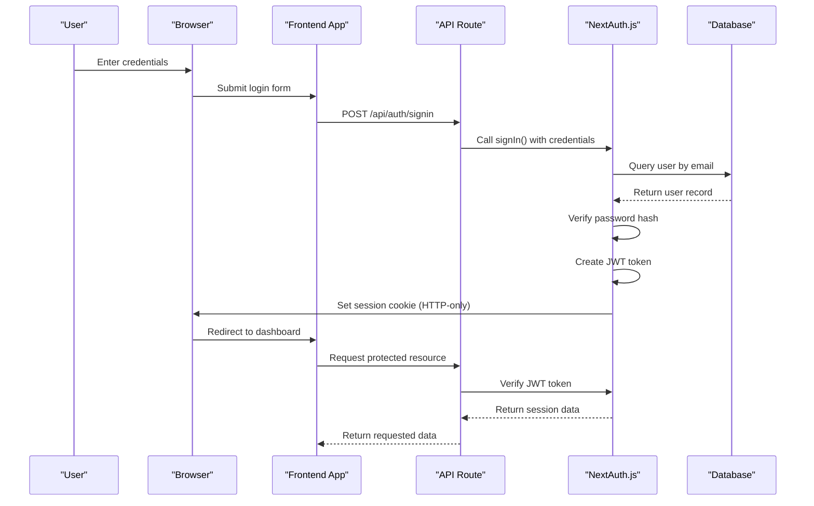
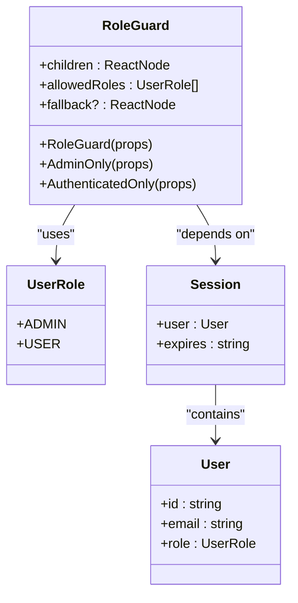
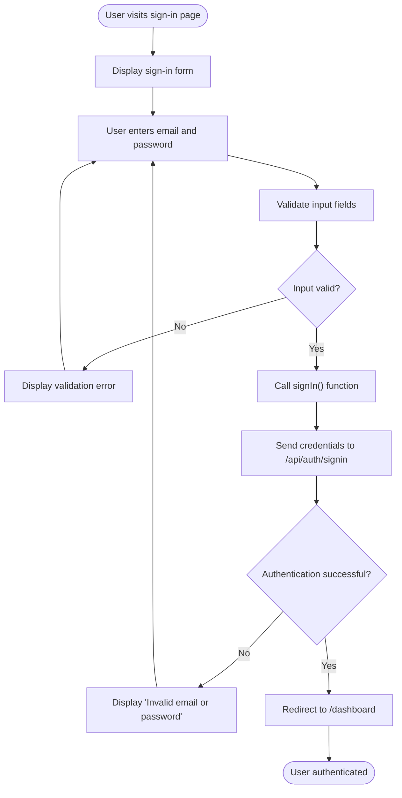

# Authentication System

<cite>
**Referenced Files in This Document**   
- [auth.ts](file://src/lib/auth.ts)
- [RoleGuard.tsx](file://src/components/auth/RoleGuard.tsx)
- [route.ts](file://src/app/api/auth/session/route.ts)
- [page.tsx](file://src/app/auth/signin/page.tsx)
- [schema.prisma](file://prisma/schema.prisma)
- [middleware.ts](file://src/middleware.ts)
</cite>

## Table of Contents
1. [Authentication System Overview](#authentication-system-overview)
2. [NextAuth.js Configuration](#nextauthjs-configuration)
3. [Session Management](#session-management)
4. [User Roles and Access Control](#user-roles-and-access-control)
5. [Sign-in Flow Implementation](#sign-in-flow-implementation)
6. [Security Considerations](#security-considerations)
7. [Database Integration](#database-integration)
8. [Troubleshooting Guide](#troubleshooting-guide)

## Authentication System Overview

The authentication system in the Fund Track application is built on NextAuth.js, providing a secure and flexible solution for user authentication and authorization. The system implements credential-based authentication with JWT session strategy, role-based access control, and secure session management across frontend and backend components.

The authentication architecture follows a modern pattern where NextAuth.js handles the core authentication logic, while custom components and middleware enforce access policies and security measures. The system integrates with the PostgreSQL database through Prisma ORM, storing user credentials securely with bcrypt hashing.

**Section sources**
- [auth.ts](file://src/lib/auth.ts#L1-L70)
- [schema.prisma](file://prisma/schema.prisma#L20-L50)

## NextAuth.js Configuration

The NextAuth.js configuration is centralized in the `authOptions` object defined in `src/lib/auth.ts`. This configuration specifies the authentication providers, session strategy, and callback functions that govern the authentication flow.

```typescript
export const authOptions: NextAuthOptions = {
  adapter: PrismaAdapter(prisma),
  providers: [
    CredentialsProvider({
      name: "credentials",
      credentials: {
        email: { label: "Email", type: "email" },
        password: { label: "Password", type: "password" }
      },
      async authorize(credentials) {
        // Authentication logic
      }
    })
  ],
  session: {
    strategy: "jwt",
  },
  callbacks: {
    async jwt({ token, user }) {
      // JWT token manipulation
    },
    async session({ session, token }) {
      // Session object enrichment
    },
  },
  pages: {
    signIn: "/auth/signin",
  },
}
```

The system uses the Prisma adapter to connect NextAuth.js with the application's database, enabling persistent user data storage and retrieval. The Credentials provider allows users to authenticate with email and password, with the `authorize` callback handling the credential validation against the database.

The session strategy is configured to use JWT (JSON Web Tokens), which means session data is stored in an encrypted token rather than in a database. This approach reduces database queries and improves scalability, while maintaining security through token signing.

**Section sources**
- [auth.ts](file://src/lib/auth.ts#L1-L70)

## Session Management

### JWT Session Strategy

The authentication system employs a JWT-based session strategy, where session information is encoded in a signed JSON Web Token. This token is stored in an HTTP-only cookie, providing protection against XSS attacks.



**Diagram sources**
- [auth.ts](file://src/lib/auth.ts#L1-L70)
- [route.ts](file://src/app/api/auth/session/route.ts#L1-L31)

### Session Callbacks

The JWT and session callbacks are used to customize the token and session objects. The `jwt` callback adds user ID and role information to the token when a user first signs in:

```typescript
async jwt({ token, user }) {
  if (user) {
    token.id = user.id
    token.role = user.role
  }
  return token
}
```

The `session` callback then extracts this information from the token and adds it to the session object available to the application:

```typescript
async session({ session, token }) {
  if (token) {
    session.user.id = token.id as string
    session.user.role = token.role as UserRole
  }
  return session
}
```

This pattern ensures that critical user information is available throughout the application without requiring additional database queries.

**Section sources**
- [auth.ts](file://src/lib/auth.ts#L50-L65)

## User Roles and Access Control

### Role-Based Access Control Implementation

The system implements role-based access control through the `RoleGuard` component and user role enumeration. User roles are defined in the Prisma schema as an enum with two values: ADMIN and USER.



**Diagram sources**
- [RoleGuard.tsx](file://src/components/auth/RoleGuard.tsx#L1-L75)
- [schema.prisma](file://prisma/schema.prisma#L200-L205)

### RoleGuard Component

The `RoleGuard` component provides a reusable way to protect routes and UI elements based on user roles. It uses the `useSession` hook from NextAuth.js to access the current user's session and role information.

```typescript
export function RoleGuard({
  children,
  allowedRoles,
  fallback,
}: RoleGuardProps) {
  const { data: session, status } = useSession();

  if (status === "loading") return <PageLoading />;

  if (!session || !allowedRoles.includes(session.user.role)) {
    if (fallback !== undefined) return <>{fallback}</>;

    return (
      <div className="min-h-screen bg-gray-50 p-6 flex items-center justify-center">
        <div className="max-w-xl w-full bg-white border border-gray-100 rounded-md shadow-sm p-6">
          <h2 className="text-lg font-semibold text-gray-900">Access denied</h2>
          <p className="mt-2 text-sm text-gray-600">
            You do not have permission to view this page. If you believe this is
            a mistake, contact an administrator.
          </p>
        </div>
      </div>
    );
  }

  return <>{children}</>;
}
```

The component also provides convenience wrappers for common use cases:

- `AdminOnly`: Restricts access to ADMIN users only
- `AuthenticatedOnly`: Allows access to both ADMIN and USER roles

These components can be used to wrap routes or UI elements that require specific permission levels.

**Section sources**
- [RoleGuard.tsx](file://src/components/auth/RoleGuard.tsx#L1-L75)

## Sign-in Flow Implementation

### Frontend Sign-in Component

The sign-in flow begins with the `SignInPage` component, which renders a form for users to enter their credentials. The component handles form validation, submission, and error states.



**Diagram sources**
- [page.tsx](file://src/app/auth/signin/page.tsx#L1-L119)

### API Authentication Flow

When the sign-in form is submitted, the `signIn` function from NextAuth.js is called with the user's credentials. This triggers the authentication flow on the server side:

1. The Credentials provider's `authorize` callback is invoked
2. The system queries the database for a user with the provided email
3. If a user is found, the password is verified using bcrypt
4. Upon successful authentication, a JWT token is created and stored in a secure cookie

The sign-in process includes client-side validation to ensure required fields are filled and the email is in a valid format, providing immediate feedback to users.

**Section sources**
- [page.tsx](file://src/app/auth/signin/page.tsx#L1-L119)
- [auth.ts](file://src/lib/auth.ts#L10-L40)

## Security Considerations

### Secure Cookie Configuration

The application implements multiple security measures to protect authentication tokens and prevent common web vulnerabilities. In production environments, cookies are configured with secure attributes through middleware:

```typescript
// Secure cookies in production
if (process.env.NODE_ENV === 'production' && process.env.SECURE_COOKIES === 'true') {
  const cookies = response.headers.get('set-cookie');
  if (cookies) {
    const secureCookies = cookies.replace(/; secure/gi, '').replace(/$/g, '; Secure; SameSite=Strict');
    response.headers.set('set-cookie', secureCookies);
  }
}
```

This configuration ensures that cookies are:
- **Secure**: Only transmitted over HTTPS connections
- **SameSite=Strict**: Prevents CSRF attacks by blocking cross-site requests
- **HTTP-only**: Not accessible via JavaScript, mitigating XSS attacks

### CSRF Protection

While NextAuth.js with JWT strategy provides inherent protection against CSRF attacks (since tokens are stored in HTTP-only cookies and not exposed to JavaScript), the application adds additional protection through:

1. **SameSite cookie attribute**: Set to "Strict" to prevent cross-site requests
2. **HTTPS enforcement**: Redirects HTTP requests to HTTPS in production
3. **Rate limiting**: Prevents brute force attacks on authentication endpoints
4. **Input validation**: Validates credentials on both client and server sides

The middleware also blocks suspicious user agents from accessing API routes, reducing the risk of automated attacks.

### JWT Signing and Environment Secrets

NextAuth.js automatically handles JWT signing using the `NEXTAUTH_SECRET` environment variable. This secret should be a cryptographically secure random string and is used to sign and verify JWT tokens. The secret is not explicitly configured in the code but is required in the environment for production deployments.

The system also uses bcrypt to hash passwords before storing them in the database, ensuring that even if the database is compromised, user passwords remain protected.

**Section sources**
- [middleware.ts](file://src/middleware.ts#L47-L85)
- [auth.ts](file://src/lib/auth.ts#L1-L70)

## Database Integration

### User Model Structure

The User model is defined in the Prisma schema with the following structure:

```prisma
model User {
  id           Int      @id @default(autoincrement())
  email        String   @unique
  passwordHash String   @map("password_hash")
  role         UserRole @default(USER)
  createdAt    DateTime @default(now()) @map("created_at")
  updatedAt    DateTime @updatedAt @map("updated_at")

  // Relations
  leadNotes         LeadNote[]
  documents         Document[]
  statusChanges     LeadStatusHistory[]
  systemSettings    SystemSetting[]

  @@map("users")
}

enum UserRole {
  ADMIN @map("admin")
  USER  @map("user")
}
```

The model includes:
- **id**: Auto-incrementing integer primary key
- **email**: Unique email address used for authentication
- **passwordHash**: Bcrypt-hashed password stored in the database
- **role**: User role with default value of USER
- **createdAt/updatedAt**: Timestamps for record management

The Prisma adapter automatically maps these fields to the NextAuth.js expected schema, enabling seamless integration between the authentication system and the database.

### Prisma Adapter Integration

The Prisma adapter is configured in the `authOptions` to connect NextAuth.js with the application's database:

```typescript
adapter: PrismaAdapter(prisma)
```

This adapter handles all database operations for user creation, retrieval, and session management. When a user authenticates, the adapter queries the database using the Prisma client to find the user record and verify credentials.

The integration allows the application to leverage Prisma's type safety and query optimization while maintaining compatibility with NextAuth.js requirements.

**Section sources**
- [schema.prisma](file://prisma/schema.prisma#L20-L50)
- [auth.ts](file://src/lib/auth.ts#L4-L6)

## Troubleshooting Guide

### Common Authentication Issues

#### Session Persistence Problems
**Symptoms**: Users are frequently logged out or session data is lost.

**Solutions**:
1. Ensure `NEXTAUTH_SECRET` is set in environment variables
2. Verify that cookies are being set with correct attributes (Secure, HttpOnly, SameSite)
3. Check that the `session.strategy` is consistently set to "jwt" across environments
4. Ensure the clock on the server is synchronized (JWT validation is time-sensitive)

#### Token Refresh Issues
**Symptoms**: Users need to re-authenticate frequently despite active sessions.

**Solutions**:
1. Verify JWT expiration settings (default is 30 days for access token)
2. Check that the `next-auth.session-token` cookie is being properly set and sent with requests
3. Ensure HTTPS is properly configured in production, as secure cookies won't work over HTTP

#### Role Synchronization Problems
**Symptoms**: User role changes are not reflected in the application.

**Solutions**:
1. Understand that role changes require re-authentication to update the JWT token
2. Implement a mechanism to refresh the session after role updates:
   ```typescript
   // After updating user role in database
   await signIn('credentials', { 
     email: user.email, 
     password: user.password,
     redirect: false 
   });
   ```
3. Consider using database sessions instead of JWT if real-time role updates are critical

#### Authentication Flow Debugging
To debug authentication issues, check:
1. Browser developer tools for network requests to `/api/auth/*` endpoints
2. Console logs for errors in the `authorize` callback
3. Database queries to ensure user records exist and passwords are correctly hashed
4. Environment variables, especially `NEXTAUTH_URL` and `NEXTAUTH_SECRET`

**Section sources**
- [auth.ts](file://src/lib/auth.ts#L1-L70)
- [middleware.ts](file://src/middleware.ts#L47-L85)
- [schema.prisma](file://prisma/schema.prisma#L20-L50)