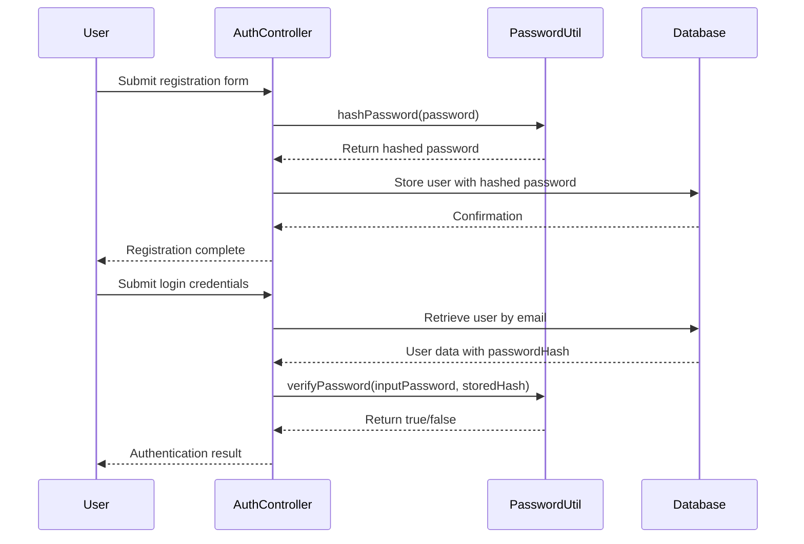
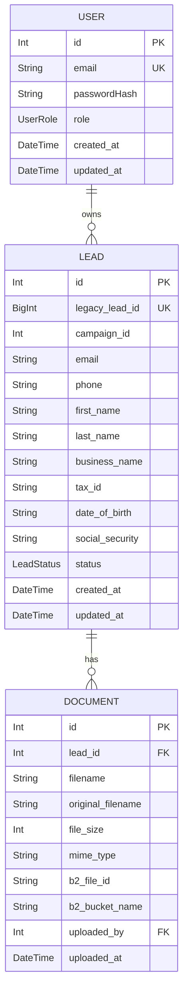
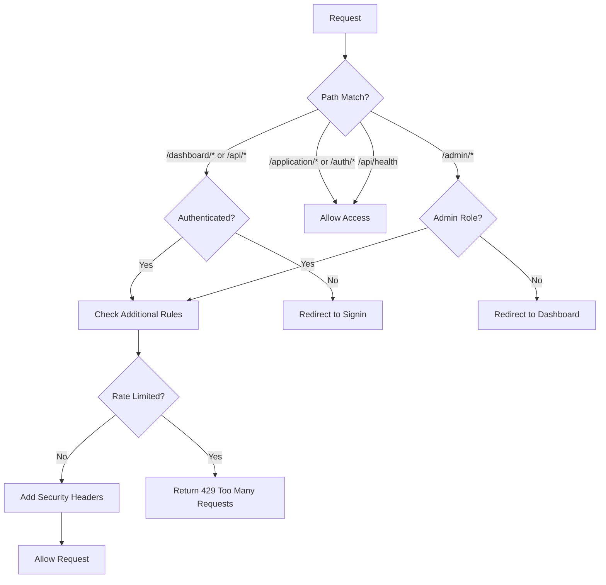
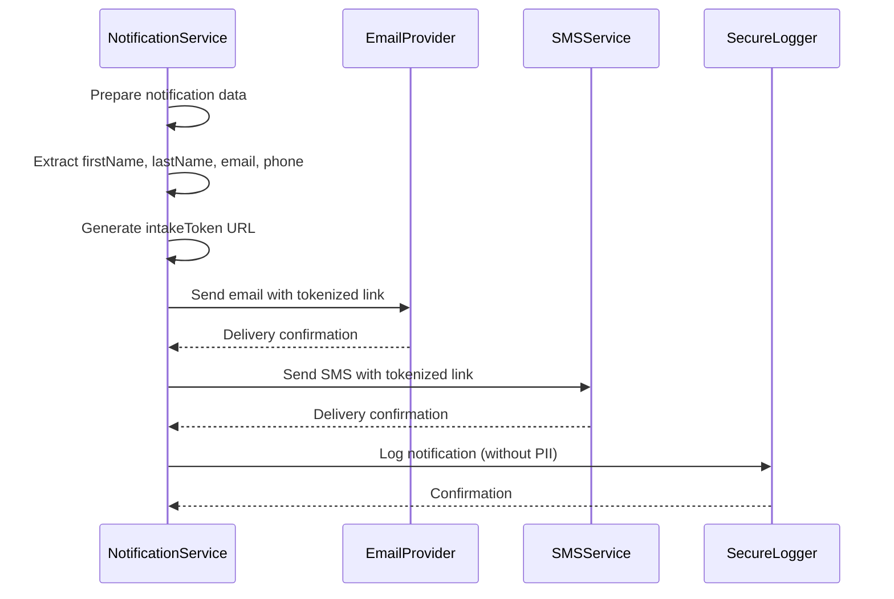
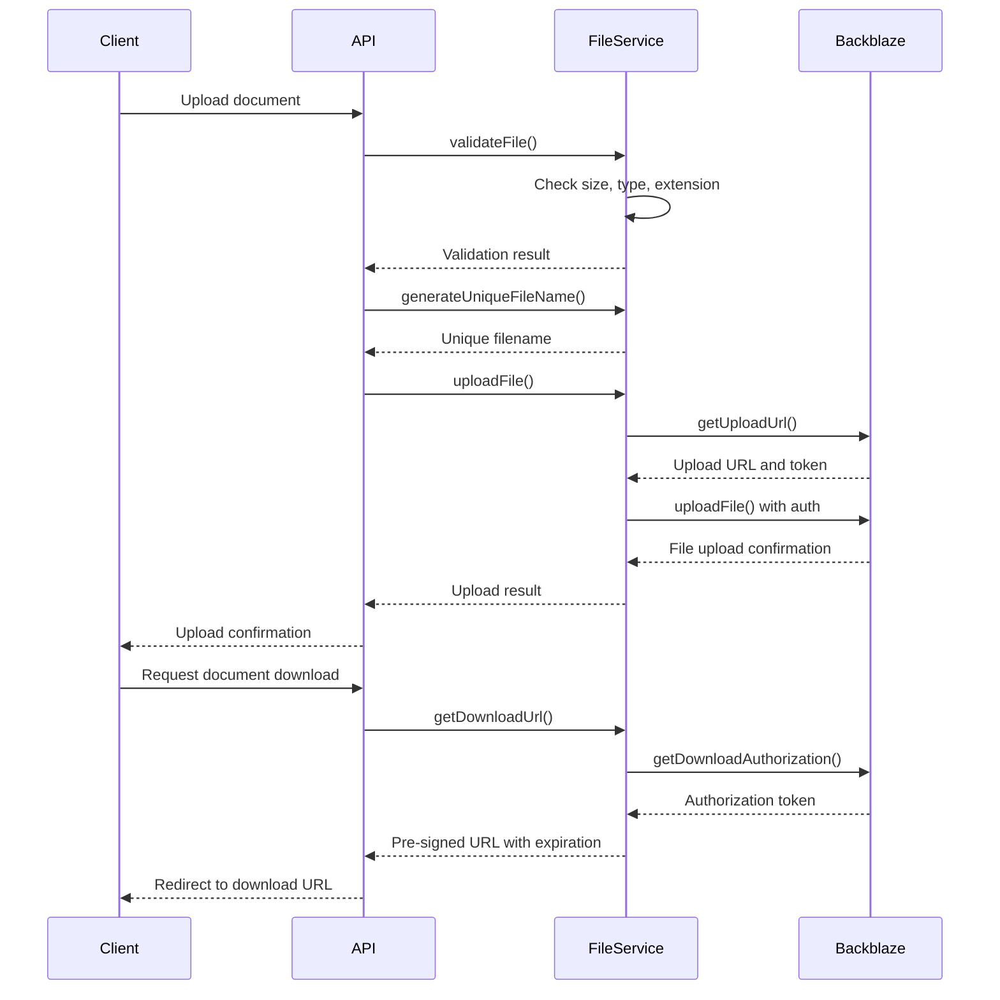
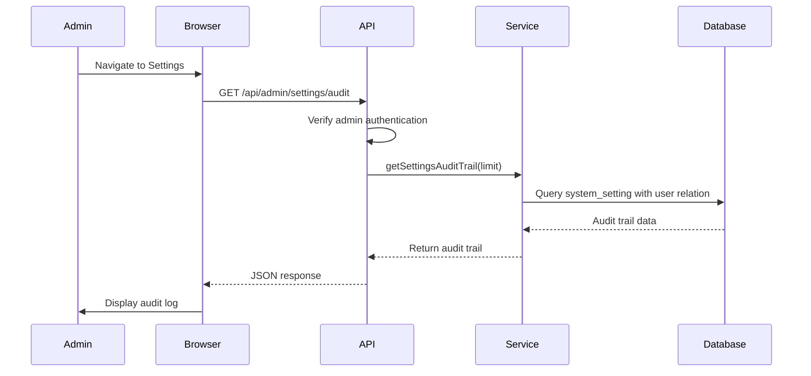

# Data Protection

<cite>
**Referenced Files in This Document**   
- [password.ts](file://src/lib/password.ts)
- [schema.prisma](file://prisma/schema.prisma)
- [logger.ts](file://src/lib/logger.ts)
- [FileUploadService.ts](file://src/services/FileUploadService.ts)
- [middleware.ts](file://src/middleware.ts)
- [notifications.ts](file://src/lib/notifications.ts)
- [system-settings.ts](file://prisma/seeds/system-settings.ts)
- [SystemSettingsService.ts](file://src/services/SystemSettingsService.ts)
- [route.ts](file://src/app/api/admin/settings/audit/route.ts)
</cite>

## Table of Contents
1. [Data Protection](#data-protection)
2. [Password Security](#password-security)
3. [Field-Level Security and PII Handling](#field-level-security-and-pii-handling)
4. [Access Controls](#access-controls)
5. [PII Handling in Notifications and Logs](#pii-handling-in-notifications-and-logs)
6. [Secure File Storage](#secure-file-storage)
7. [Compliance and Audit Logging](#compliance-and-audit-logging)
8. [Secure Data Disposal](#secure-data-disposal)
9. [Developer Best Practices](#developer-best-practices)

## Password Security

The application implements secure password hashing using the bcrypt algorithm through the `password.ts` utility module. This ensures that plaintext passwords are never stored in the database, protecting user credentials even in the event of a data breach.

The password utility provides two main functions:
- `hashPassword(password: string)`: Hashes a plaintext password using bcrypt with 12 salt rounds
- `verifyPassword(password: string, hashedPassword: string)`: Compares a plaintext password with a hashed password for authentication

**Diagram sources**
- [password.ts](file://src/lib/password.ts#L1-L10)
- [schema.prisma](file://prisma/schema.prisma#L15-L22)

**Section sources**
- [password.ts](file://src/lib/password.ts#L1-L10)

## Field-Level Security and PII Handling

The application's data model, defined in the Prisma schema, includes comprehensive field-level security for Personally Identifiable Information (PII). Sensitive fields are clearly identified and protected through database-level constraints and application design.

The `Lead` model contains numerous PII fields that are marked as optional (using `?`) to ensure data minimization. These include:
- **Contact Information**: email, phone, firstName, lastName
- **Business Information**: businessName, businessAddress, taxId, stateOfInc
- **Personal Information**: dateOfBirth, socialSecurity, personalAddress, legalName

**Diagram sources**
- [schema.prisma](file://prisma/schema.prisma#L45-L120)

**Section sources**
- [schema.prisma](file://prisma/schema.prisma#L45-L120)

## Access Controls

The application implements robust access controls through Next.js middleware, ensuring that only authorized users can access sensitive operations and data. The middleware enforces authentication, role-based access, and rate limiting across the application.

Key access control features include:
- **Authentication Enforcement**: All dashboard and API routes (except public ones) require authentication
- **Role-Based Access**: Admin-only routes are protected, redirecting non-admin users
- **Public Route Exceptions**: Intake pages, authentication routes, and health checks are accessible without authentication
- **Rate Limiting**: Protection against abuse with configurable request limits

**Diagram sources**
- [middleware.ts](file://src/middleware.ts#L100-L189)

**Section sources**
- [middleware.ts](file://src/middleware.ts#L100-L189)

## PII Handling in Notifications and Logs

The application implements strict policies for handling PII in notifications and logs to prevent accidental exposure of sensitive information.

### Notification Security
The notification system in `notifications.ts` handles PII carefully by:
- Using tokenized URLs instead of including sensitive data in messages
- Personalizing messages with minimal necessary information
- Sending notifications through secure channels (TLS)

**Diagram sources**
- [notifications.ts](file://src/lib/notifications.ts#L1-L221)

### Logging Security
The logger implementation in `logger.ts` ensures PII protection through:
- Structured logging with separate context objects
- No automatic logging of request bodies that might contain PII
- Categorization of log entries for easier monitoring
- Environment-specific logging levels

All log entries are structured as JSON and include context objects that can be monitored for sensitive data patterns. The logger avoids logging complete request objects that might contain PII.

**Section sources**
- [notifications.ts](file://src/lib/notifications.ts#L1-L221)
- [logger.ts](file://src/lib/logger.ts#L1-L351)

## Secure File Storage

The application uses Backblaze B2 for secure file storage, implemented in the `FileUploadService.ts`. This service provides enterprise-grade security for document storage with multiple layers of protection.

Key security features include:
- **File Validation**: Before upload, files are validated for size, MIME type, and extension
- **Unique File Naming**: Files are stored with generated names to prevent conflicts and directory traversal
- **Pre-Signed URLs**: Time-limited download URLs with restricted access
- **Secure Configuration**: Credentials stored in environment variables

**Diagram sources**
- [FileUploadService.ts](file://src/services/FileUploadService.ts#L1-L307)

**Section sources**
- [FileUploadService.ts](file://src/services/FileUploadService.ts#L1-L307)

## Compliance and Audit Logging

The application implements comprehensive compliance features, including audit logging for system settings changes and configurable data retention policies.

### Audit Logging
The system maintains an audit trail for all system settings changes through:
- **Settings Audit Trail**: All changes to system settings are logged with user information
- **Admin-Only Access**: Only administrators can view the audit log
- **Timestamped Records**: Each change is recorded with precise timestamps

The audit log is accessible via the admin interface and through the `/api/admin/settings/audit` endpoint, which verifies admin privileges before returning audit data.

**Diagram sources**
- [route.ts](file://src/app/api/admin/settings/audit/route.ts#L1-L32)
- [SystemSettingsService.ts](file://src/services/SystemSettingsService.ts#L300-L351)

### Data Retention
The system settings seed file defines retention-related configurations, though specific data retention rules are not explicitly defined in the current configuration. The system is designed to support retention policies through its configurable settings framework.

**Section sources**
- [system-settings.ts](file://prisma/seeds/system-settings.ts#L1-L73)
- [SystemSettingsService.ts](file://src/services/SystemSettingsService.ts#L300-L351)
- [route.ts](file://src/app/api/admin/settings/audit/route.ts#L1-L32)

## Secure Data Disposal

The application implements secure data disposal practices, particularly evident in the seeding and cleanup operations. When data needs to be removed, the application follows a systematic approach that respects database constraints.

The seeding process in `seed.ts` demonstrates secure disposal by:
- **Orderly Deletion**: Removing data in the correct order to respect foreign key constraints
- **Comprehensive Cleanup**: Clearing all relevant tables including notification logs, documents, and user data
- **Production Safeguards**: Including warnings and confirmation delays when operating in production

The cleanup process follows this sequence:
1. Notification logs
2. Follow-up queue
3. Documents
4. Lead notes
5. Lead status history
6. Leads
7. System settings
8. Users

This ensures referential integrity is maintained during data disposal and prevents orphaned records.

**Section sources**
- [seed.ts](file://prisma/seed.ts#L45-L122)

## Developer Best Practices

Developers should follow these best practices when handling sensitive data in the application:

### Environment Variables
- Store all sensitive configuration in environment variables
- Never commit `.env` files to version control
- Use different values for development, staging, and production

### Code-Level Security
- Always validate and sanitize user input
- Use parameterized queries to prevent SQL injection
- Implement proper error handling without exposing sensitive information
- Regularly update dependencies to address security vulnerabilities

### Debugging and Logging
- Never log sensitive data such as passwords, PII, or tokens
- Use structured logging with separate context objects
- Ensure log files are protected with appropriate file permissions
- Avoid using console.log in production code

### Secure Development Practices
- Conduct regular security reviews of code changes
- Use static analysis tools to detect security issues
- Implement automated tests for security-critical functionality
- Follow the principle of least privilege in access controls

These practices ensure that sensitive data remains protected throughout the development lifecycle and that security is maintained as a core aspect of the application architecture.

**Section sources**
- [password.ts](file://src/lib/password.ts#L1-L10)
- [logger.ts](file://src/lib/logger.ts#L1-L351)
- [middleware.ts](file://src/middleware.ts#L1-L189)
- [FileUploadService.ts](file://src/services/FileUploadService.ts#L1-L307)