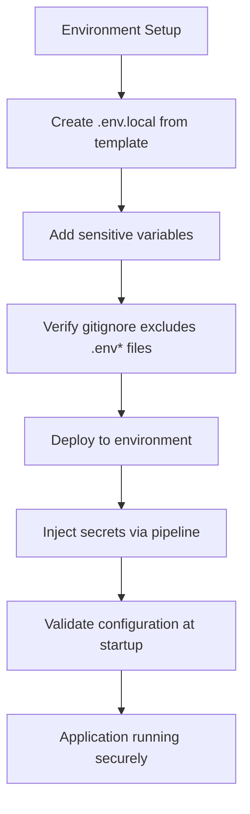
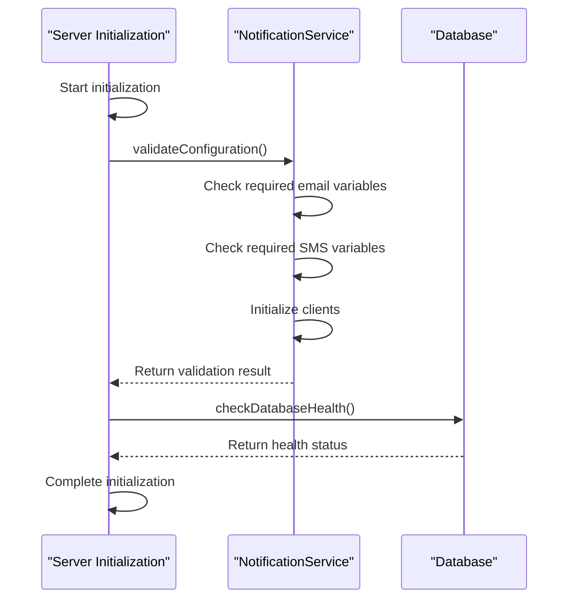
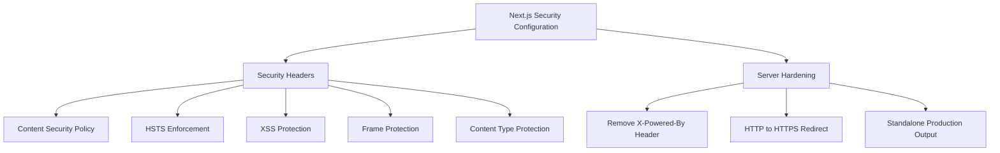
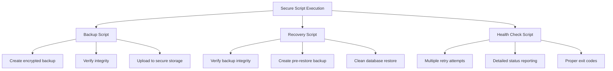
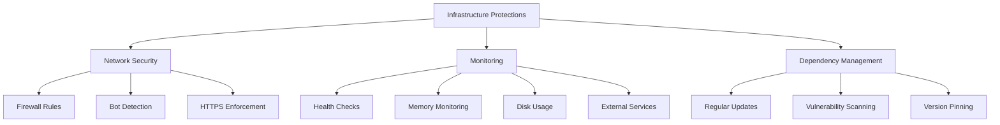

# Secure Configuration

<cite>
**Referenced Files in This Document**   
- [next.config.mjs](file://next.config.mjs)
- [server-init.ts](file://src/lib/server-init.ts)
- [prisma.ts](file://src/lib/prisma.ts)
- [database-error-handler.ts](file://src/lib/database-error-handler.ts)
- [NotificationService.ts](file://src/services/NotificationService.ts)
- [backup-database.sh](file://scripts/backup-database.sh)
- [disaster-recovery.sh](file://scripts/disaster-recovery.sh)
- [health-check.sh](file://scripts/health-check.sh)
- [system-settings.ts](file://prisma/seeds/system-settings.ts)
- [middleware.ts](file://src/middleware.ts)
- [route.ts](file://src/app/api/health/route.ts)
- [test-mailgun.ts](file://test/test-mailgun.ts)
</cite>

## Table of Contents
1. [Secure Environment Management](#secure-environment-management)
2. [Security Configuration Validation](#security-configuration-validation)
3. [Next.js Security Settings](#nextjs-security-settings)
4. [Server Hardening and Script Security](#server-hardening-and-script-security)
5. [Infrastructure-Level Protections](#infrastructure-level-protections)

## Secure Environment Management

The application implements a comprehensive environment management strategy across development, staging, and production environments. Environment variables are managed through `.env.local` files that are excluded from version control via gitignore rules, ensuring sensitive data is never committed to the repository.

Critical security-related environment variables include:
- **NEXTAUTH_SECRET**: Used for NextAuth.js authentication, must be a cryptographically secure random string
- **DATABASE_URL**: PostgreSQL connection string containing credentials
- **TWILIO_AUTH_TOKEN**: Authentication token for Twilio SMS services
- **MAILGUN_API_KEY**: API key for MailGun email services
- **B2_CREDENTIALS**: Backblaze B2 storage credentials including B2_APPLICATION_KEY_ID and B2_APPLICATION_KEY

These sensitive variables follow strict rotation policies and are injected into deployment pipelines through secure secret management systems. The application validates the presence of required environment variables at startup, particularly for external services like Twilio, MailGun, and Backblaze B2.

**Diagram sources**
- [next.config.mjs](file://next.config.mjs)
- [server-init.ts](file://src/lib/server-init.ts)
- [NotificationService.ts](file://src/services/NotificationService.ts)

**Section sources**
- [README.md](file://README.md)
- [server-init.ts](file://src/lib/server-init.ts)
- [NotificationService.ts](file://src/services/NotificationService.ts)

## Security Configuration Validation

The application implements robust configuration validation at startup to prevent misconfigurations. The server initialization process in `server-init.ts` validates notification service configuration by checking for required environment variables and attempting to initialize service clients.

Configuration validation includes:
- Verification of required environment variables for external services
- Validation of database connection parameters
- Type checking and format validation for system settings
- Runtime validation of API keys and authentication tokens

The `NotificationService` class performs comprehensive validation of its configuration, checking for the presence of essential variables like MAILGUN_API_KEY, MAILGUN_DOMAIN, MAILGUN_FROM_EMAIL, TWILIO_ACCOUNT_SID, TWILIO_AUTH_TOKEN, and TWILIO_PHONE_NUMBER. If SMS notifications are enabled, the corresponding Twilio variables are validated.

**Diagram sources**
- [server-init.ts](file://src/lib/server-init.ts)
- [NotificationService.ts](file://src/services/NotificationService.ts)
- [database-error-handler.ts](file://src/lib/database-error-handler.ts)

**Section sources**
- [server-init.ts](file://src/lib/server-init.ts)
- [NotificationService.ts](file://src/services/NotificationService.ts)
- [database-error-handler.ts](file://src/lib/database-error-handler.ts)

## Next.js Security Settings

The application implements multiple security measures through Next.js configuration in `next.config.mjs`. These settings enhance the application's security posture by implementing industry-standard security headers and server hardening techniques.

Key security configurations include:
- **Content Security Policy (CSP)**: Restricts resource loading to trusted sources only
- **Strict-Transport-Security**: Enforces HTTPS connections with a 2-year max-age
- **X-Frame-Options**: Set to DENY to prevent clickjacking attacks
- **X-XSS-Protection**: Enabled with block mode to prevent XSS attacks
- **X-Content-Type-Options**: Set to nosniff to prevent MIME type sniffing
- **Referrer-Policy**: Set to origin-when-cross-origin for privacy protection

The configuration also removes the X-Powered-By header to prevent information disclosure about the server technology. In production environments, the application redirects HTTP traffic to HTTPS when FORCE_HTTPS is enabled.

**Diagram sources**
- [next.config.mjs](file://next.config.mjs)
- [middleware.ts](file://src/middleware.ts)

**Section sources**
- [next.config.mjs](file://next.config.mjs)
- [middleware.ts](file://src/middleware.ts)

## Server Hardening and Script Security

The application includes comprehensive server hardening techniques and secure script execution practices. Shell scripts in the `scripts/` directory implement proper permissions, audit logging, and error handling to ensure secure operation.

Key security practices for scripts include:
- **Backup procedures**: The `backup-database.sh` script creates encrypted database backups with integrity verification using pg_restore
- **Disaster recovery**: The `disaster-recovery.sh` script implements safety measures including pre-restore backups and integrity verification
- **Health monitoring**: The `health-check.sh` script provides robust health checking with retry logic and detailed status reporting
- **Audit logging**: All critical scripts maintain detailed logs of operations and outcomes

Scripts implement security best practices such as:
- Using set -e to exit on any error
- Proper input validation and error handling
- Secure handling of sensitive credentials
- Comprehensive logging of operations
- Verification of backup integrity before restoration

**Diagram sources**
- [backup-database.sh](file://scripts/backup-database.sh)
- [disaster-recovery.sh](file://scripts/disaster-recovery.sh)
- [health-check.sh](file://scripts/health-check.sh)

**Section sources**
- [backup-database.sh](file://scripts/backup-database.sh)
- [disaster-recovery.sh](file://scripts/disaster-recovery.sh)
- [health-check.sh](file://scripts/health-check.sh)

## Infrastructure-Level Protections

The application implements multiple infrastructure-level protections to enhance security and reliability. These protections span firewall rules, intrusion detection, and regular dependency updates to mitigate vulnerabilities.

Key infrastructure protections include:
- **Firewall rules**: The middleware implements request filtering based on user-agent patterns, blocking suspicious bots on sensitive routes
- **Intrusion detection**: The health check system monitors for unusual patterns and service degradation
- **Dependency management**: The package-lock.json file ensures consistent dependency versions
- **Regular updates**: The application uses current versions of all dependencies with regular security updates

The health check system provides comprehensive monitoring of application health, including database connectivity, memory usage, disk space, and external service availability. This allows for early detection of potential issues before they impact users.

**Diagram sources**
- [middleware.ts](file://src/middleware.ts)
- [route.ts](file://src/app/api/health/route.ts)
- [package-lock.json](file://package-lock.json)

**Section sources**
- [middleware.ts](file://src/middleware.ts)
- [route.ts](file://src/app/api/health/route.ts)
- [package-lock.json](file://package-lock.json)