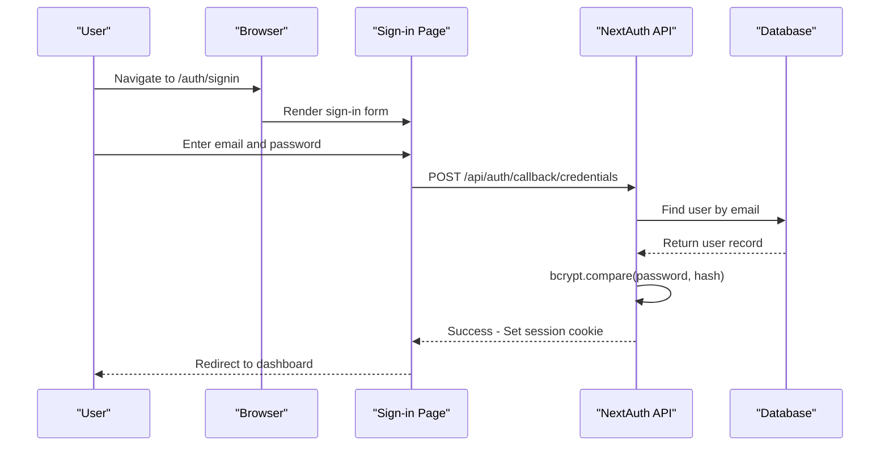
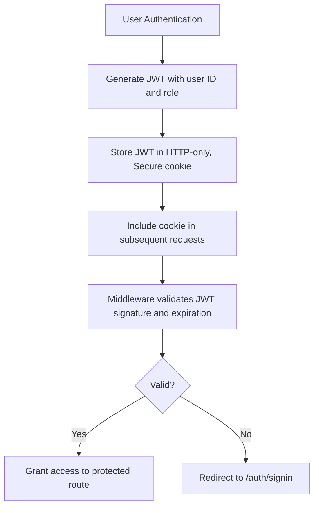
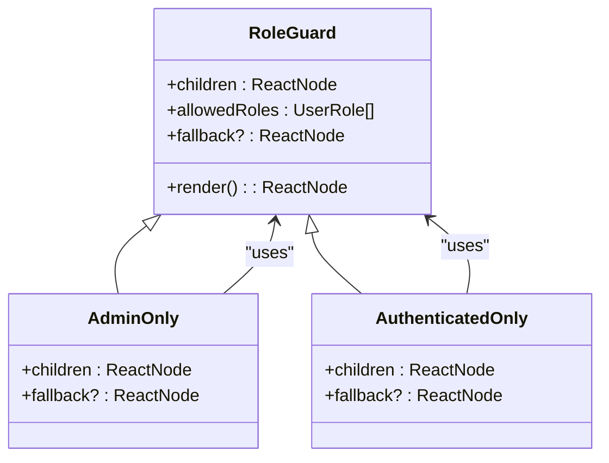
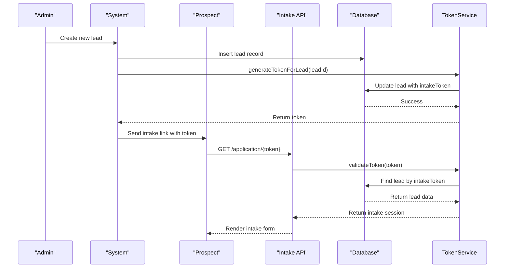
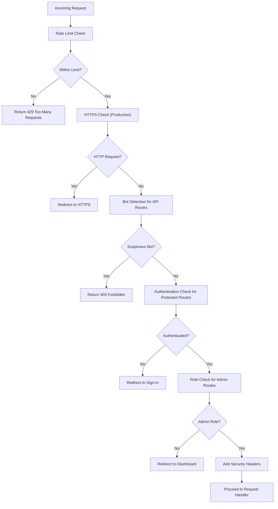
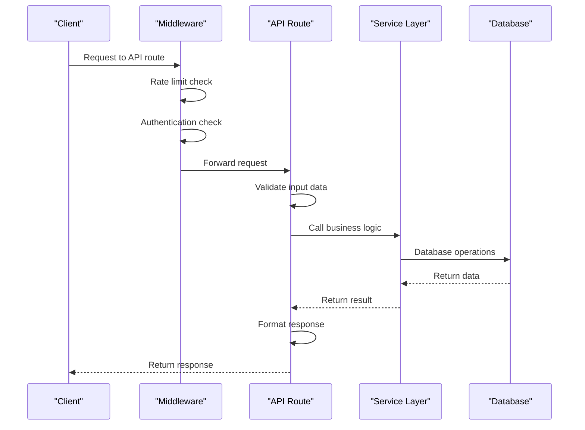
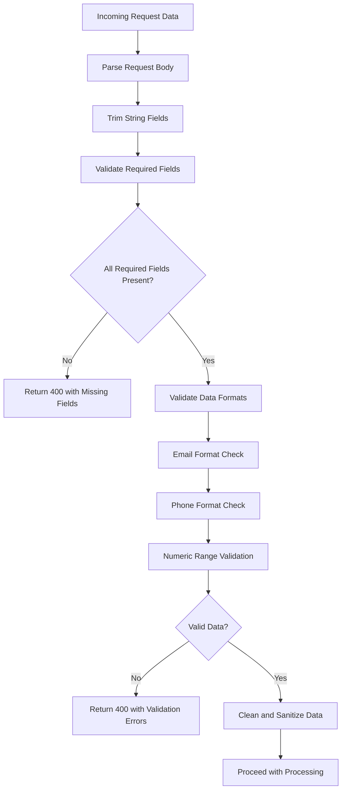
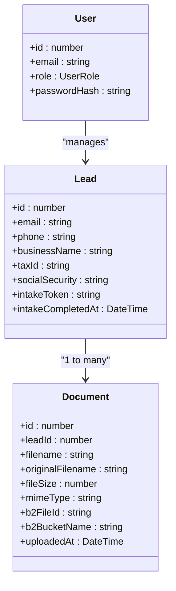

# Security Considerations

<cite>
**Referenced Files in This Document**   
- [auth.ts](file://src/lib/auth.ts) - *Updated in recent commit*
- [middleware.ts](file://src/middleware.ts) - *Enhanced with CSP and role-based protections*
- [TokenService.ts](file://src/services/TokenService.ts)
- [RoleGuard.tsx](file://src/components/auth/RoleGuard.tsx)
- [password.ts](file://src/lib/password.ts)
- [route.ts](file://src/app/api/auth/[...nextauth]/route.ts)
- [route.ts](file://src/app/api/intake/[token]/route.ts)
- [route.ts](file://src/app/api/intake/[token]/step1/route.ts)
- [route.ts](file://src/app/api/intake/[token]/step2/route.ts)
- [route.ts](file://src/app/api/intake/[token]/save/route.ts)
- [schema.prisma](file://prisma/schema.prisma) - *Added SYSTEM_ADMIN role*
- [next.config.mjs](file://next.config.mjs) - *Enhanced security headers*
</cite>

## Update Summary
**Changes Made**   
- Updated Role-Based Access Control section to include SYSTEM_ADMIN role
- Enhanced Middleware Protections with Content Security Policy (CSP) details
- Added protection for development tools requiring SYSTEM_ADMIN role
- Updated security headers implementation across middleware and next.config.mjs
- Added references to new database schema changes for user roles

## Table of Contents
1. [Authentication System](#authentication-system)
2. [Session Management](#session-management)
3. [Role-Based Access Control](#role-based-access-control)
4. [Token-Based Authorization for Intake Process](#token-based-authorization-for-intake-process)
5. [Middleware Protections](#middleware-protections)
6. [API Route Security](#api-route-security)
7. [Input Validation Practices](#input-validation-practices)
8. [Data Protection Measures](#data-protection-measures)
9. [Secure Configuration and Environment Variables](#secure-configuration-and-environment-variables)
10. [Secure Deployment Practices](#secure-deployment-practices)
11. [Common Attack Vectors and Mitigations](#common-attack-vectors-and-mitigations)

## Authentication System

The fund-track application implements a secure authentication system using **NextAuth.js**, a popular authentication library for Next.js applications. The system is configured to use **credentials-based login** with email and password, backed by a Prisma database adapter for persistent user session management.

Authentication is handled through the `authOptions` configuration in `src/lib/auth.ts`, which defines the **CredentialsProvider** for email/password login. User credentials are validated against the database, where passwords are securely hashed using bcrypt. The system does not store plain-text passwords, ensuring that even database breaches cannot directly expose user credentials.

The authentication flow begins at `/auth/signin`, where users submit their email and password. These credentials are verified by querying the database for a matching user and comparing the provided password with the stored bcrypt hash using `bcrypt.compare()`. On successful authentication, a JWT (JSON Web Token) is issued and stored in an HTTP-only cookie for session management.

**Section sources**
- [auth.ts](file://src/lib/auth.ts#L15-L70)
- [route.ts](file://src/app/api/auth/[...nextauth]/route.ts#L1-L6)

## Session Management

The application uses **JWT-based session management** with a "jwt" strategy configured in NextAuth.js. When a user successfully authenticates, a JWT is created containing the user's ID and role, which is then stored in an HTTP-only, secure cookie. This approach eliminates the need for server-side session storage while maintaining security.

The session lifecycle is managed through NextAuth.js callbacks:
- `jwt` callback: Adds user ID and role to the JWT token
- `session` callback: Transfers user ID and role from the token to the session object

Sessions are validated on each request to protected routes through the middleware system. The middleware extracts the token from the request and verifies its validity. If the token is missing or invalid, users are redirected to the sign-in page.

For enhanced security, the application configures secure cookies in production environments by setting the `Secure` and `SameSite=Strict` attributes. This prevents cookie transmission over HTTP and protects against CSRF attacks.

**Section sources**
- [auth.ts](file://src/lib/auth.ts#L55-L65)
- [middleware.ts](file://src/middleware.ts#L130-L180)

## Role-Based Access Control

The application implements **role-based access control (RBAC)** to enforce different permission levels for users. Three roles are defined: `ADMIN`, `USER`, and `SYSTEM_ADMIN`, with `ADMIN` and `SYSTEM_ADMIN` having elevated privileges for managing system settings, users, and notifications.

The `SYSTEM_ADMIN` role was added in a recent migration to provide enhanced administrative capabilities while maintaining separation from standard ADMIN users. This role is required for accessing development tools and performing system-level operations.

Role-based access is enforced through two mechanisms:
1. **Middleware-level protection**: The middleware checks user roles when accessing admin routes and redirects non-admin users to the dashboard.
2. **Component-level protection**: The `RoleGuard` component wraps UI elements to conditionally render content based on user roles.

The `RoleGuard` component (located in `src/components/auth/RoleGuard.tsx`) accepts a list of allowed roles and renders its children only if the current user's role is included in the allowed list. It provides convenience components like `AdminOnly` and `AuthenticatedOnly` for common use cases.

**Section sources**
- [RoleGuard.tsx](file://src/components/auth/RoleGuard.tsx#L1-L75)
- [middleware.ts](file://src/middleware.ts#L160-L165)
- [schema.prisma](file://prisma/schema.prisma#L241-L246) - *SYSTEM_ADMIN role definition*

## Token-Based Authorization for Intake Process

The intake process uses a **token-based authorization system** that allows prospective clients to complete their application without requiring authentication. This system generates secure, random tokens that are associated with specific leads in the database.

The `TokenService` class (in `src/services/TokenService.ts`) manages the entire token lifecycle:
- **Token generation**: Uses `crypto.randomBytes(32)` to create cryptographically secure 64-character hexadecimal tokens
- **Token validation**: Checks if a token exists in the database and is associated with a valid lead
- **Token expiration**: Tokens are implicitly expired when the intake process is completed (marked by `intakeCompletedAt` timestamp)
- **Step tracking**: Tracks completion of intake steps (step1CompletedAt, step2CompletedAt)

When a new lead is created, a token is generated and stored in the `intakeToken` field of the lead record. The prospective client receives a link containing this token, which grants temporary access to complete the intake process.

**Section sources**
- [TokenService.ts](file://src/services/TokenService.ts#L15-L50)
- [route.ts](file://src/app/api/intake/[token]/route.ts#L1-L37)

## Middleware Protections

The application implements comprehensive security protections through Next.js middleware (located in `src/middleware.ts`). This middleware acts as a gatekeeper for all incoming requests, enforcing various security policies before requests reach their destination.

Key middleware protections include:
- **Rate limiting**: Prevents brute force attacks by limiting requests from a single IP address (configurable via environment variables)
- **HTTPS enforcement**: Redirects HTTP requests to HTTPS in production environments
- **Bot protection**: Blocks automated scripts and scrapers from accessing sensitive API endpoints
- **Security headers**: Adds security headers like `X-Robots-Tag` and enforces secure cookie attributes
- **Route protection**: Controls access to different parts of the application based on authentication status and user roles
- **Content Security Policy (CSP)**: Implemented through next.config.mjs to prevent XSS attacks by restricting resource loading

The middleware uses a flexible configuration that allows certain routes to be publicly accessible (like intake forms and health checks) while protecting others (dashboard and API routes). Development endpoints can be enabled/disabled via environment variables for security during deployment. Access to development tools is now restricted to users with the `SYSTEM_ADMIN` role.

**Section sources**
- [middleware.ts](file://src/middleware.ts#L1-L189)
- [next.config.mjs](file://next.config.mjs#L21-L79) - *CSP implementation*

## API Route Security

API routes are secured through a multi-layered approach that combines middleware protection, input validation, and authentication checks. The security model varies by route type:

- **Public routes**: Health checks and intake endpoints that don't require authentication
- **Authenticated routes**: Dashboard and most API endpoints requiring valid sessions
- **Admin-only routes**: Administrative endpoints restricted to ADMIN users
- **SYSTEM_ADMIN-only routes**: Development tools and system-level endpoints restricted to SYSTEM_ADMIN users

Each API route implements appropriate security measures:
- **Authentication validation**: Checking for valid sessions before processing requests
- **Input validation**: Validating and sanitizing all incoming data
- **Error handling**: Providing generic error messages to avoid information leakage
- **Rate limiting**: Inherited from middleware to prevent abuse

For example, the intake step endpoints (`/api/intake/[token]/step1` and `/api/intake/[token]/step2`) first validate the token, then check if the intake process is already completed before accepting any data. This prevents replay attacks and ensures data integrity.

**Section sources**
- [middleware.ts](file://src/middleware.ts#L1-L189)
- [step1/route.ts](file://src/app/api/intake/[token]/step1/route.ts#L1-L303)
- [step2/route.ts](file://src/app/api/intake/[token]/step2/route.ts#L1-L151)

## Input Validation Practices

The application implements rigorous input validation at multiple levels to prevent common security vulnerabilities like injection attacks and data corruption.

**Client-side validation**: Basic validation is performed in the intake forms to provide immediate feedback to users.

**Server-side validation**: Comprehensive validation is implemented in API routes:
- **Required fields**: All mandatory fields are checked for presence and non-empty values
- **Data types**: String fields are trimmed, and numeric fields are parsed and validated
- **Format validation**: Email and phone number formats are validated using regular expressions
- **Range validation**: Numeric values like ownership percentage and years in business are checked against acceptable ranges
- **File validation**: Document uploads validate file count, size, and type

For example, the step1 intake endpoint validates that:
- Email addresses match a proper format
- Phone numbers contain only valid characters
- Ownership percentage is between 0-100
- Years in business is between 0-100
- All required fields are present and non-empty

**Section sources**
- [step1/route.ts](file://src/app/api/intake/[token]/step1/route.ts#L100-L250)
- [step2/route.ts](file://src/app/api/intake/[token]/step2/route.ts#L50-L80)
- [save/route.ts](file://src/app/api/intake/[token]/save/route.ts#L50-L100)

## Data Protection Measures

The application implements multiple data protection measures to safeguard sensitive information throughout its lifecycle.

**Password security**: User passwords are never stored in plain text. Instead, they are hashed using bcrypt with 12 salt rounds, making them resistant to brute force attacks. The `password.ts` utility provides functions for hashing and verifying passwords.

**Sensitive data handling**: Personal and financial information collected during the intake process is stored in the database with appropriate field types. While the data is stored in plain text in the database, access is strictly controlled through authentication and authorization mechanisms.

**File storage security**: Document uploads are stored in Backblaze B2 cloud storage with the following security measures:
- Files are stored with generated filenames to prevent directory traversal
- File metadata is stored in the database with references to B2 file IDs
- Access to documents is controlled through authenticated API endpoints
- Uploads are limited to exactly 3 files with validation on size and type

**Audit logging**: The system logs important operations, particularly around document uploads and status changes, to provide an audit trail for security monitoring.

**Section sources**
- [password.ts](file://src/lib/password.ts#L1-L10)
- [TokenService.ts](file://src/services/TokenService.ts#L10-L50)
- [step2/route.ts](file://src/app/api/intake/[token]/step2/route.ts#L80-L120)

## Secure Configuration and Environment Variables

The application uses environment variables for secure configuration, keeping sensitive credentials and configuration options out of the codebase.

Key security-related environment variables include:
- `ENABLE_RATE_LIMITING`: Enables or disables rate limiting
- `RATE_LIMIT_WINDOW_MS`: Time window for rate limiting (default 15 minutes)
- `RATE_LIMIT_MAX_REQUESTS`: Maximum requests allowed per window
- `FORCE_HTTPS`: Enforces HTTPS redirection in production
- `SECURE_COOKIES`: Enables Secure and SameSite attributes for cookies
- `ENABLE_DEV_ENDPOINTS`: Controls access to development endpoints
- `NODE_ENV`: Determines whether the application is running in development, staging, or production mode

Database credentials and third-party service keys (like Backblaze B2 and Mailgun) are also configured through environment variables, preventing them from being exposed in the codebase. The application follows the principle of least privilege in its configuration, enabling security features by default and requiring explicit opt-in for potentially risky features like development endpoints.

**Section sources**
- [middleware.ts](file://src/middleware.ts#L1-L189)
- [next.config.mjs](file://next.config.mjs#L1-L117)

## Secure Deployment Practices

The application is designed with secure deployment practices in mind:

**HTTPS enforcement**: The middleware automatically redirects HTTP requests to HTTPS in production environments, ensuring all communication is encrypted.

**Security headers**: The application sets appropriate security headers, including HSTS (HTTP Strict Transport Security) in production to prevent SSL stripping attacks. Content Security Policy (CSP) is implemented to mitigate XSS attacks.

**Environment separation**: Different configurations are applied based on the environment (development vs production), with stricter security controls enabled in production.

**Dependency management**: The application uses standard Node.js dependency management with regular updates to address known vulnerabilities.

**Monitoring and logging**: Comprehensive logging is implemented for security-critical operations, allowing for monitoring and incident response.

**Regular backups**: Database backup scripts are included in the repository, enabling regular data backups as part of the deployment process.

**Section sources**
- [middleware.ts](file://src/middleware.ts#L1-L189)
- [next.config.mjs](file://next.config.mjs#L21-L117)

## Common Attack Vectors and Mitigations

The application addresses several common attack vectors through specific mitigations:

**Brute force attacks**: Mitigated through rate limiting in the middleware, which limits the number of requests from a single IP address within a time window.

**Credential stuffing**: Prevented by using bcrypt for password hashing, making it computationally expensive to reverse-engineer passwords from database breaches.

**Session hijacking**: Reduced risk through the use of HTTP-only, secure cookies that cannot be accessed by client-side JavaScript.

**Cross-site scripting (XSS)**: Mitigated by Next.js's built-in XSS protection, React's automatic escaping of variables in JSX, and the implementation of Content Security Policy (CSP) headers.

**Cross-site request forgery (CSRF)**: Prevented by using SameSite=Strict cookie attributes and the stateful nature of the JWT authentication flow.

**SQL injection**: Eliminated by using Prisma ORM, which automatically parameterizes all database queries.

**File upload vulnerabilities**: Addressed by validating file count, type, and size, and storing files with generated names in cloud storage rather than the application server.

**Information disclosure**: Prevented by returning generic error messages in production and avoiding detailed error information in responses.

**Insecure direct object references**: Mitigated by always validating that the authenticated user has permission to access the requested resource, particularly in API routes that accept IDs as parameters.

**Privilege escalation**: Prevented by the introduction of the `SYSTEM_ADMIN` role with specific protections for development tools and system-level operations, ensuring proper separation of duties.

**Section sources**
- [middleware.ts](file://src/middleware.ts#L1-L189)
- [next.config.mjs](file://next.config.mjs#L21-L79)
- [schema.prisma](file://prisma/schema.prisma#L241-L246)