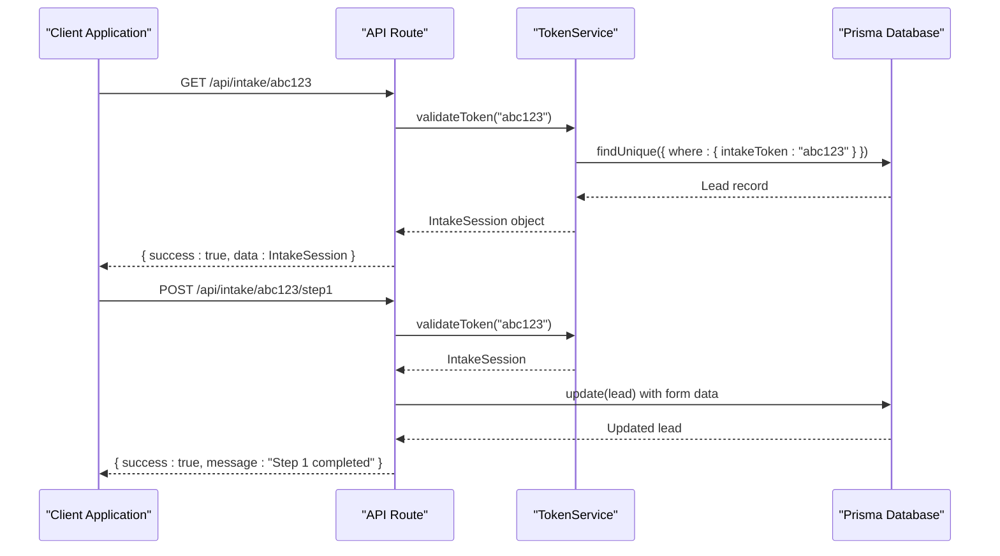
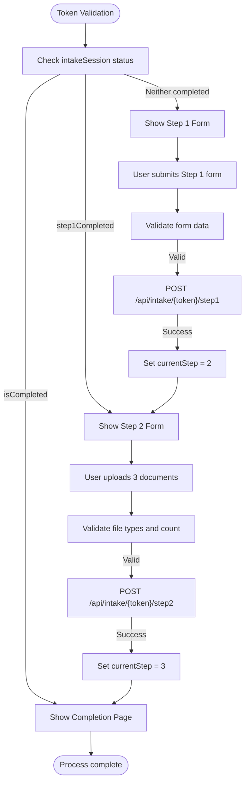
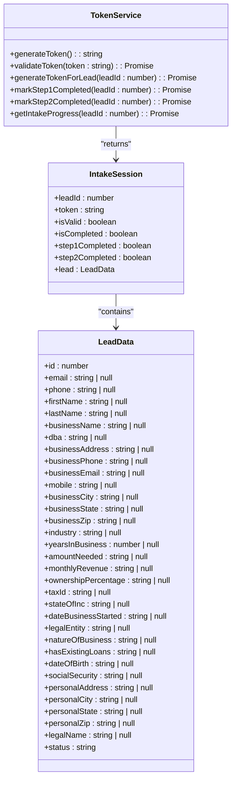
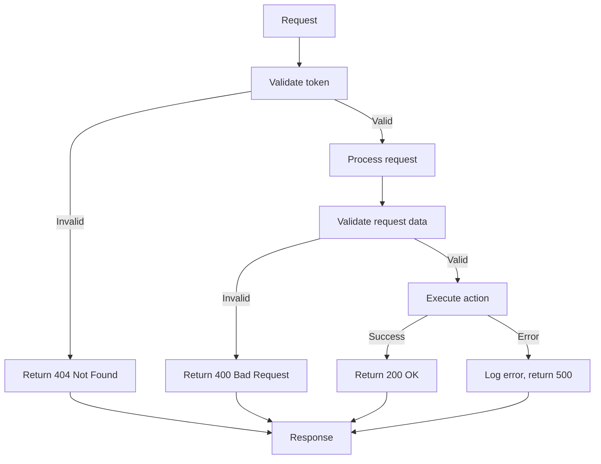

# Token-Based Authorization

<cite>
**Referenced Files in This Document**   
- [TokenService.ts](file://src/services/TokenService.ts)
- [page.tsx](file://src/app/application/[token]/page.tsx)
- [route.ts](file://src/app/api/intake/[token]/route.ts)
- [step1/route.ts](file://src/app/api/intake/[token]/step1/route.ts)
- [step2/route.ts](file://src/app/api/intake/[token]/step2/route.ts)
- [save/route.ts](file://src/app/api/intake/[token]/save/route.ts)
- [IntakeWorkflow.tsx](file://src/components/intake/IntakeWorkflow.tsx)
- [Step1Form.tsx](file://src/components/intake/Step1Form.tsx)
- [Step2Form.tsx](file://src/components/intake/Step2Form.tsx)
- [CompletionPage.tsx](file://src/components/intake/CompletionPage.tsx)
</cite>

## Table of Contents
1. [Introduction](#introduction)
2. [Token Generation and Storage](#token-generation-and-storage)
3. [Token Validation and API Integration](#token-validation-and-api-integration)
4. [Intake Workflow and State Management](#intake-workflow-and-state-management)
5. [TokenService Class Implementation](#tokenservice-class-implementation)
6. [Security Measures and Best Practices](#security-measures-and-best-practices)
7. [Error Handling and Token Expiration](#error-handling-and-token-expiration)
8. [Frontend Token Flow](#frontend-token-flow)
9. [Conclusion](#conclusion)

## Introduction
The token-based authorization system in the intake process provides secure, stateless access to the business funding application. This system enables prospective applicants to complete their funding application through a secure, token-authenticated workflow without requiring traditional login credentials. The implementation uses cryptographically secure tokens that are associated with lead records in the database and validated across API routes and frontend components. This document details the architecture, implementation, and security considerations of this authorization mechanism.

## Token Generation and Storage
The token-based authorization system generates cryptographically secure tokens using Node.js's built-in crypto module. These tokens are 32-byte random values converted to hexadecimal strings, providing 256 bits of entropy for each token.

Tokens are stored in the database as part of the lead record, specifically in the `intakeToken` field of the `lead` table. When a new intake process is initiated for a lead, a token is generated and assigned to the lead record through the `generateTokenForLead` method in the TokenService class. The token is stored in plain text in the database (as it functions as a password-equivalent secret), but access to this field is strictly controlled through the application's authorization mechanisms.

The system does not implement explicit token expiration timestamps in the database schema. Instead, token validity is determined by the presence of the token on the lead record and the status of the intake process. A token becomes effectively invalid when the intake process is completed (indicated by the `intakeCompletedAt` timestamp) or if the lead record is otherwise modified to remove or replace the token.

**Section sources**
- [TokenService.ts](file://src/services/TokenService.ts#L15-L30)
- [TokenService.ts](file://src/services/TokenService.ts#L100-L115)

## Token Validation and API Integration
Token validation occurs through API routes that intercept requests containing intake tokens in the URL path. The primary validation endpoint is implemented in `/src/app/api/intake/[token]/route.ts`, which handles GET requests to validate tokens and return associated intake session data.

The validation process follows these steps:
1. Extract the token from the URL parameter
2. Call the TokenService.validateToken method to verify the token
3. Return the intake session data if valid, or an error response if invalid

The API routes are designed to be stateless, with each request containing the token necessary for authorization. This approach eliminates the need for server-side session storage and makes the system more scalable. The validation process retrieves the complete lead record associated with the token, including current completion status for each step of the intake process.

Multiple API endpoints consume the validated token to authorize different actions:
- `/api/intake/[token]/step1` - Processes submission of the first step
- `/api/intake/[token]/step2` - Handles document uploads for the second step
- `/api/intake/[token]/save` - Saves partial progress

Each of these endpoints performs token validation as the first step in their processing logic, ensuring that only authorized requests can modify lead data.

**Diagram sources**
- [route.ts](file://src/app/api/intake/[token]/route.ts#L5-L37)
- [step1/route.ts](file://src/app/api/intake/[token]/step1/route.ts#L5-L303)
- [TokenService.ts](file://src/services/TokenService.ts#L35-L98)

**Section sources**
- [route.ts](file://src/app/api/intake/[token]/route.ts#L5-L37)
- [step1/route.ts](file://src/app/api/intake/[token]/step1/route.ts#L5-L303)
- [step2/route.ts](file://src/app/api/intake/[token]/step2/route.ts#L5-L151)

## Intake Workflow and State Management
The intake workflow is a two-step process managed through client-side state in the IntakeWorkflow component. The workflow state is determined by the intake session data retrieved during token validation, which includes boolean flags for `step1Completed`, `step2Completed`, and `isCompleted`.

The workflow progresses through three main states:
1. **Step 1**: Collection of business and personal information through a multi-field form
2. **Step 2**: Upload of three required financial documents
3. **Completion**: Confirmation page displayed after successful document upload

The IntakeWorkflow component uses React's useState hook to manage the current step, initializing it based on the intake session data. If the intake is already completed, the workflow starts at step 3. If step 1 is completed but step 2 is not, it starts at step 2. Otherwise, it begins at step 1.

Navigation between steps is controlled by callback functions passed to each step component. When step 1 is successfully submitted, the `handleStep1Complete` function is called, which updates the state to display step 2. Similarly, successful document upload triggers `handleStep2Complete`, advancing to the completion page.

A visual progress indicator shows the status of each step (upcoming, current, or completed) using color-coded circles and connecting lines, providing clear feedback to the user about their progress through the application process.

**Diagram sources**
- [IntakeWorkflow.tsx](file://src/components/intake/IntakeWorkflow.tsx#L10-L95)
- [Step1Form.tsx](file://src/components/intake/Step1Form.tsx#L271-L323)
- [Step2Form.tsx](file://src/components/intake/Step2Form.tsx#L130-L180)

**Section sources**
- [IntakeWorkflow.tsx](file://src/components/intake/IntakeWorkflow.tsx#L10-L95)
- [Step1Form.tsx](file://src/components/intake/Step1Form.tsx#L0-L398)
- [Step2Form.tsx](file://src/components/intake/Step2Form.tsx#L0-L311)

## TokenService Class Implementation
The TokenService class is a static utility class that provides methods for token generation, validation, and intake process management. It serves as the central authority for all token-related operations in the application.

### Core Methods

**generateToken()**: Creates a cryptographically secure random token using Node.js's crypto.randomBytes method. The method generates 32 bytes of random data and converts it to a hexadecimal string, resulting in a 64-character token with 256 bits of entropy.

**validateToken(token)**: Validates a token by querying the database for a lead record with a matching intakeToken. If found, it returns an IntakeSession object containing the lead data and completion status. If not found or if the token is invalid, it returns null.

**generateTokenForLead(leadId)**: Generates a new token and assigns it to a specific lead record in the database. This method also updates the lead's status to "PENDING" to indicate that the intake process has been initiated.

**markStep1Completed(leadId)**: Updates the lead record to mark step 1 as completed by setting the step1CompletedAt timestamp.

**markStep2Completed(leadId)**: Marks step 2 as completed by setting both step2CompletedAt and intakeCompletedAt timestamps. It also triggers follow-up actions, including canceling any pending follow-ups for the lead and changing the lead status to "IN_PROGRESS" to alert staff that the application is ready for review.

### IntakeSession Interface
The IntakeSession interface defines the structure of the data returned by token validation. It includes:
- Basic token and lead identifiers
- Boolean flags for completion status of each step
- Complete lead data including business, personal, and contact information
- Current status of the lead

This comprehensive data structure allows the frontend to render the appropriate UI state and pre-fill form fields with existing data, providing a seamless user experience even if the user navigates away and returns later.

**Diagram sources**
- [TokenService.ts](file://src/services/TokenService.ts#L15-L312)

**Section sources**
- [TokenService.ts](file://src/services/TokenService.ts#L15-L312)

## Security Measures and Best Practices
The token-based authorization system implements several security measures to protect sensitive application data and prevent unauthorized access.

### Cryptographic Security
Tokens are generated using Node.js's crypto module, which provides cryptographically secure pseudorandom number generation. The 256-bit entropy (32 bytes) ensures that tokens are practically impossible to guess through brute force attacks. The use of the operating system's cryptographically secure random number generator (CSPRNG) ensures that the tokens are unpredictable and resistant to prediction attacks.

### Secure Transmission
The application enforces HTTPS for all token-based routes, ensuring that tokens are never transmitted over unencrypted connections. The frontend displays security indicators (SSL badge, "256-bit Secure Application" text) to reassure users that their data is protected during transmission.

### Input Validation
All API endpoints perform rigorous validation of input data:
- Token presence and format validation
- Required field validation for form submissions
- Email format validation using regular expressions
- Phone number format validation
- Numerical range validation for fields like ownership percentage and years in business
- File type and size validation for document uploads

### Rate Limiting and Abuse Prevention
While not explicitly shown in the code, the system architecture supports rate limiting on token validation attempts to prevent brute force attacks. The stateless nature of the token system allows for easy integration with rate limiting middleware that can track and limit requests by IP address or other identifiers.

### Token Revocation
Tokens are effectively revoked when the intake process is completed by setting the intakeCompletedAt timestamp. The system also supports generating new tokens for leads, which would invalidate any previous tokens by overwriting the intakeToken field in the database.

### Secure Storage
Although tokens are stored in plain text in the database (as they function as passwords), access to the database is restricted through standard security practices. The application uses Prisma as an ORM, which helps prevent SQL injection attacks. Additionally, the database should be configured with appropriate access controls and encryption at rest.

**Section sources**
- [TokenService.ts](file://src/services/TokenService.ts#L15-L312)
- [step1/route.ts](file://src/app/api/intake/[token]/step1/route.ts#L50-L150)
- [step2/route.ts](file://src/app/api/intake/[token]/step2/route.ts#L50-L100)
- [page.tsx](file://src/app/application/[token]/page.tsx#L10-L50)

## Error Handling and Token Expiration
The system implements comprehensive error handling for token validation and intake process operations. When a token is invalid or expired, the system responds with appropriate HTTP status codes and error messages to guide the user experience.

### Token Validation Errors
The validateToken method returns null for invalid tokens, which the API routes translate into 404 Not Found responses. This prevents information leakage about why a token is invalid (whether it doesn't exist, has expired, or was never valid). The frontend handles this by redirecting to a notFound page, providing a clean user experience without revealing system details.

### Expired Token Handling
The system does not implement time-based token expiration. Instead, tokens become invalid when:
1. The intake process is completed (intakeCompletedAt is set)
2. The lead record is deleted or modified to remove the token
3. A new token is generated for the same lead

This approach ensures that tokens are only valid for the duration of the intake process, minimizing the window of opportunity for unauthorized access.

### API Error Responses
API endpoints return standardized error responses with appropriate HTTP status codes:
- 400 Bad Request: For missing tokens, invalid data, or business logic errors
- 404 Not Found: For invalid or expired tokens
- 500 Internal Server Error: For unexpected server-side errors

Error messages are designed to be user-friendly while avoiding disclosure of sensitive system information. In development mode, additional error details may be included for debugging purposes, but these are stripped in production.

### Graceful Degradation
When errors occur during the intake process, the system attempts to preserve user data and allow recovery:
- Step 1 data is saved without marking the step as completed, allowing users to resume
- Document uploads are atomic, with all three documents required for success
- Network errors are handled with user-friendly messages and the ability to retry

**Diagram sources**
- [route.ts](file://src/app/api/intake/[token]/route.ts#L5-L37)
- [step1/route.ts](file://src/app/api/intake/[token]/step1/route.ts#L5-L303)
- [step2/route.ts](file://src/app/api/intake/[token]/step2/route.ts#L5-L151)

**Section sources**
- [route.ts](file://src/app/api/intake/[token]/route.ts#L5-L37)
- [step1/route.ts](file://src/app/api/intake/[token]/step1/route.ts#L5-L303)
- [step2/route.ts](file://src/app/api/intake/[token]/step2/route.ts#L5-L151)

## Frontend Token Flow
The frontend implementation of the token-based authorization system begins with the application page at `/application/[token]`, which serves as the entry point for the intake process. This page uses Next.js's server-side rendering to validate the token before rendering any content.

When a user accesses a URL like `/application/abc123`, the page component extracts the token from the route parameters and calls TokenService.validateToken. If validation fails, the page calls Next.js's notFound() function, which returns a 404 response. This server-side validation prevents the page from ever rendering with an invalid token, enhancing security.

Once validated, the intake session data is passed to the IntakeWorkflow component, which manages the multi-step form interface. The workflow uses the completion status from the intake session to determine the initial state, allowing users to resume their application from where they left off.

Form submissions are handled through fetch requests to the appropriate API endpoints, with the token included in the URL path. The frontend provides real-time validation feedback, showing error messages for invalid fields and displaying progress indicators during form submission and document upload.

The document upload interface supports both drag-and-drop and traditional file selection, with client-side validation of file types and sizes before upload. During upload, progress bars provide visual feedback, and error handling allows users to correct issues and retry failed uploads.

**Section sources**
- [page.tsx](file://src/app/application/[token]/page.tsx#L0-L218)
- [IntakeWorkflow.tsx](file://src/components/intake/IntakeWorkflow.tsx#L0-L95)
- [Step1Form.tsx](file://src/components/intake/Step1Form.tsx#L0-L398)
- [Step2Form.tsx](file://src/components/intake/Step2Form.tsx#L0-L311)

## Conclusion
The token-based authorization system provides a secure, user-friendly mechanism for prospective applicants to complete their business funding application. By using cryptographically secure tokens associated with lead records, the system enables stateless authentication without requiring users to create accounts or remember passwords.

The implementation demonstrates several best practices in secure application design:
- Use of cryptographically secure random token generation
- Server-side token validation before rendering sensitive content
- Comprehensive input validation at both frontend and backend
- Clear separation of concerns between token management and business logic
- Graceful error handling that maintains security while providing good user experience

The system could be enhanced with additional security features such as:
- Time-based token expiration
- One-time use tokens
- Rate limiting on token validation attempts
- Token revocation lists
- Enhanced logging of token usage patterns

Overall, the token-based authorization system effectively balances security requirements with usability goals, providing a seamless application experience while protecting sensitive financial data.