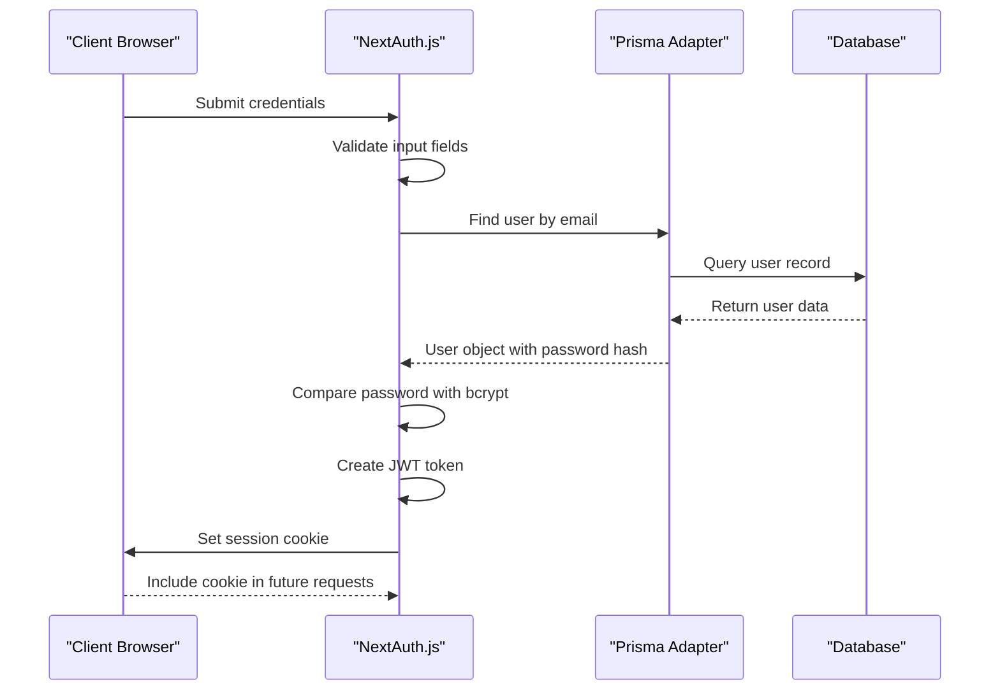
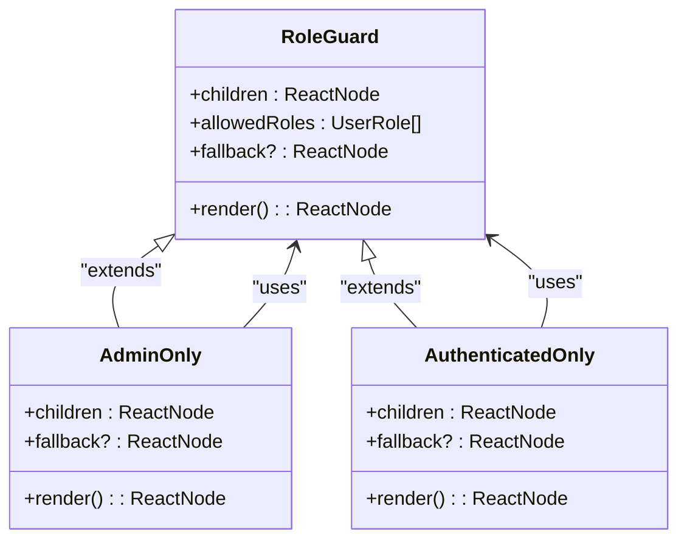
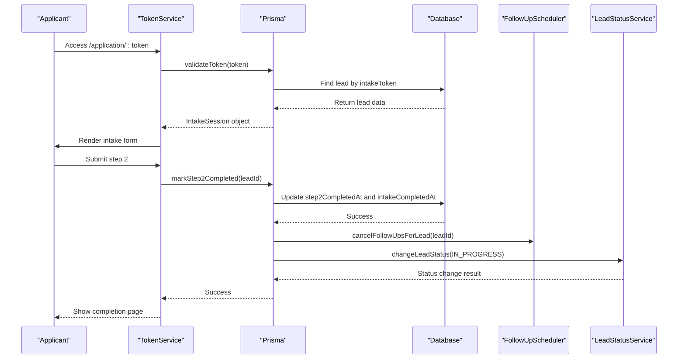
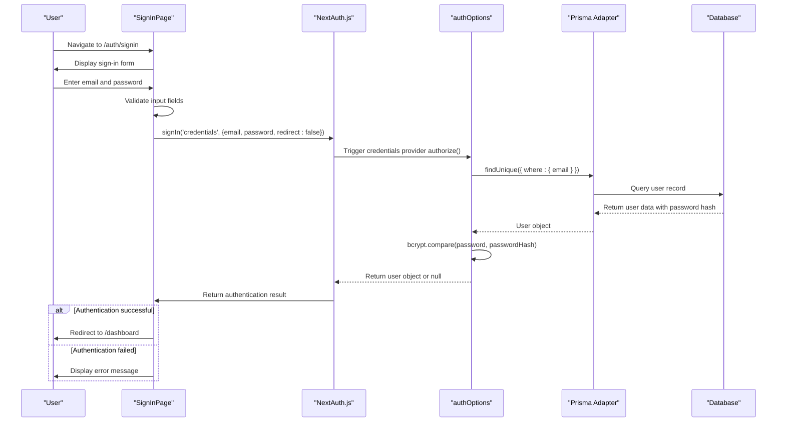
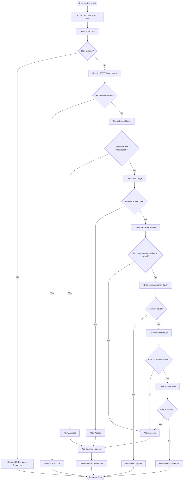
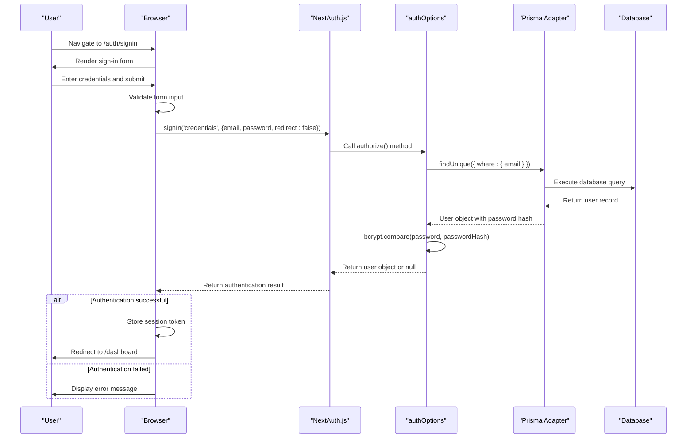
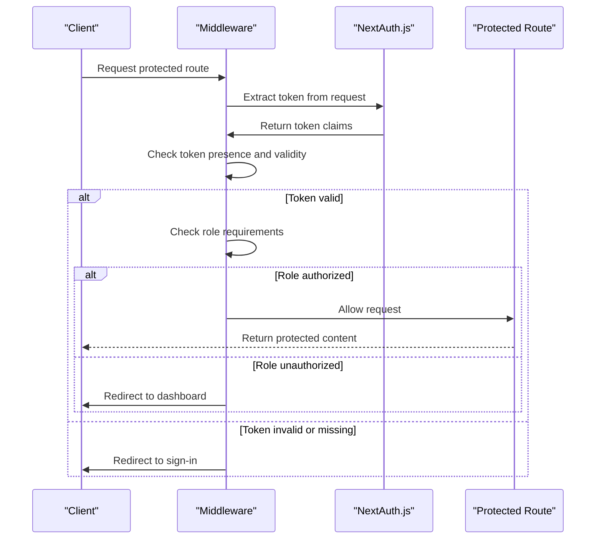
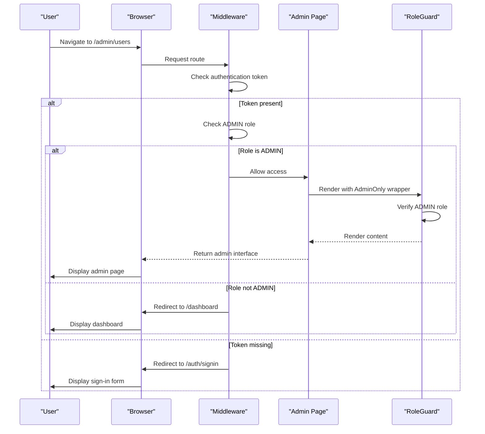

# Authentication and Authorization

<cite>
**Referenced Files in This Document**   
- [src/lib/auth.ts](file://src/lib/auth.ts#L1-L70)
- [src/components/auth/RoleGuard.tsx](file://src/components/auth/RoleGuard.tsx#L1-L75)
- [src/services/TokenService.ts](file://src/services/TokenService.ts#L1-L312)
- [src/app/api/auth/signin/route.ts](file://src/app/api/auth/signin/route.ts#L1-L26)
- [src/app/auth/signin/page.tsx](file://src/app/auth/signin/page.tsx#L1-L119)
- [src/middleware.ts](file://src/middleware.ts#L1-L189)
- [src/lib/password.ts](file://src/lib/password.ts#L1-L20)
</cite>

## Table of Contents
1. [Introduction](#introduction)
2. [Core Authentication Implementation](#core-authentication-implementation)
3. [Session Management and JWT Handling](#session-management-and-jwt-handling)
4. [Role-Based Access Control System](#role-based-access-control-system)
5. [Secure Token Generation and Validation](#secure-token-generation-and-validation)
6. [Authentication Flow](#authentication-flow)
7. [Security Measures](#security-measures)
8. [Middleware Protection for Admin Routes](#middleware-protection-for-admin-routes)
9. [Sequence Diagrams](#sequence-diagrams)
10. [Advanced Security Considerations](#advanced-security-considerations)

## Introduction
The fund-track application implements a robust authentication and authorization system using NextAuth.js with a custom credentials provider. This system handles user authentication, session management, role-based access control, and secure token generation for intake workflows. The architecture combines server-side security practices with client-side protection mechanisms to ensure comprehensive security across all application layers.

The system supports staff portal access with role differentiation between ADMIN and USER roles, while also providing unauthenticated access to intake forms via secure tokens. Security measures include bcrypt password hashing, CSRF protection, rate limiting, and secure cookie configuration. The implementation follows modern security best practices while maintaining usability for both staff members and applicants.

**Section sources**
- [src/lib/auth.ts](file://src/lib/auth.ts#L1-L70)
- [src/middleware.ts](file://src/middleware.ts#L1-L189)

## Core Authentication Implementation

The authentication system is built on NextAuth.js with a custom credentials provider configured in `authOptions`. The implementation uses Prisma as the database adapter to persist user data and sessions. The credentials provider accepts email and password inputs, validates them against the database, and returns user information upon successful authentication.

Password verification is performed using bcrypt, ensuring that passwords are securely hashed and compared. The system retrieves user data from the database using Prisma ORM, checking for email uniqueness and validating the password hash. Upon successful authentication, the system returns a user object containing the user ID, email, and role, which is then used to create a session.

```typescript
export const authOptions: NextAuthOptions = {
  adapter: PrismaAdapter(prisma),
  providers: [
    CredentialsProvider({
      name: "credentials",
      credentials: {
        email: { label: "Email", type: "email" },
        password: { label: "Password", type: "password" }
      },
      async authorize(credentials) {
        if (!credentials?.email || !credentials?.password) {
          return null
        }

        const user = await prisma.user.findUnique({
          where: {
            email: credentials.email
          }
        })

        if (!user) {
          return null
        }

        const isPasswordValid = await bcrypt.compare(
          credentials.password,
          user.passwordHash
        )

        if (!isPasswordValid) {
          return null
        }

        return {
          id: user.id.toString(),
          email: user.email,
          role: user.role,
        }
      }
    })
  ],
}
```

**Section sources**
- [src/lib/auth.ts](file://src/lib/auth.ts#L1-L70)
- [src/lib/password.ts](file://src/lib/password.ts#L1-L20)

## Session Management and JWT Handling

The authentication system uses JWT (JSON Web Token) as the session strategy, which provides stateless session management and improved scalability. When a user successfully authenticates, the system creates a JWT token containing user information, which is then stored in an HTTP-only cookie for security.

The JWT handling is implemented through NextAuth.js callbacks that manage the token creation and session population process. The `jwt` callback is triggered during authentication and adds user-specific claims (ID and role) to the token payload. The `session` callback then reads these claims from the token and attaches them to the session object available to the application.

Token expiration policies are configured through NextAuth.js defaults, with refresh tokens automatically managed by the framework. The JWT strategy ensures that sensitive user information is cryptographically signed and cannot be tampered with, while also allowing for efficient session validation without database queries on each request.



**Diagram sources**
- [src/lib/auth.ts](file://src/lib/auth.ts#L1-L70)

**Section sources**
- [src/lib/auth.ts](file://src/lib/auth.ts#L1-L70)

## Role-Based Access Control System

The role-based access control (RBAC) system implements fine-grained permission management through the `RoleGuard` component and middleware protection. The system defines two roles: ADMIN and USER, with different levels of access to application features and routes.

The `RoleGuard` component is a React component that conditionally renders children based on the user's role. It uses the NextAuth.js `useSession` hook to retrieve the current session and checks if the user's role is included in the allowed roles array. The component handles three states: loading (displaying a loading indicator), unauthorized (showing access denied or fallback content), and authorized (rendering the protected content).

For convenience, the system provides specialized components like `AdminOnly` and `AuthenticatedOnly` that wrap the `RoleGuard` with predefined role configurations. This abstraction simplifies role-based protection across the application while maintaining consistency in access control logic.

```typescript
export function RoleGuard({
  children,
  allowedRoles,
  fallback,
}: RoleGuardProps) {
  const { data: session, status } = useSession();

  if (status === "loading") return <PageLoading />;

  if (!session || !allowedRoles.includes(session.user.role)) {
    if (fallback !== undefined) return <>{fallback}</>;

    return (
      <div className="min-h-screen bg-gray-50 p-6 flex items-center justify-center">
        <div className="max-w-xl w-full bg-white border border-gray-100 rounded-md shadow-sm p-6">
          <h2 className="text-lg font-semibold text-gray-900">Access denied</h2>
          <p className="mt-2 text-sm text-gray-600">
            You do not have permission to view this page. If you believe this is
            a mistake, contact an administrator.
          </p>
        </div>
      </div>
    );
  }

  return <>{children}</>;
}
```



**Diagram sources**
- [src/components/auth/RoleGuard.tsx](file://src/components/auth/RoleGuard.tsx#L1-L75)

**Section sources**
- [src/components/auth/RoleGuard.tsx](file://src/components/auth/RoleGuard.tsx#L1-L75)

## Secure Token Generation and Validation

The intake workflow uses a secure token system implemented in the `TokenService` class to provide temporary, unauthenticated access to application forms. This system generates cryptographically secure random tokens using Node.js crypto module and associates them with lead records in the database.

The token generation process creates a 32-byte random value converted to hexadecimal format, providing 256 bits of entropy for strong security. These tokens are stored in the database as `intakeToken` field on lead records and used as URL parameters for intake form access. The system validates tokens by checking their existence in the database and ensuring they are associated with active leads.

The `TokenService` also manages intake workflow state by tracking completion of individual steps (step1 and step2) and overall intake completion. When step 2 is completed, the system automatically updates the lead status to "IN_PROGRESS" and cancels any pending follow-ups, creating a seamless transition from data collection to review process.

```typescript
static generateToken(): string {
  return crypto.randomBytes(32).toString('hex');
}

static async validateToken(token: string): Promise<IntakeSession | null> {
  try {
    const lead = await prisma.lead.findUnique({
      where: { intakeToken: token },
      select: {
        id: true,
        // Contact Information
        email: true,
        phone: true,
        firstName: true,
        lastName: true,
        // ... other fields
      },
    });

    if (!lead || !lead.intakeToken) {
      return null;
    }

    const isCompleted = lead.intakeCompletedAt !== null;
    const step1Completed = lead.step1CompletedAt !== null;
    const step2Completed = lead.step2CompletedAt !== null;

    return {
      leadId: lead.id,
      token: lead.intakeToken,
      isValid: true,
      isCompleted,
      step1Completed,
      step2Completed,
      lead: {
        id: lead.id,
        // ... mapped lead data
      },
    };
  } catch (error) {
    console.error('Error validating token:', error);
    return null;
  }
}
```



**Diagram sources**
- [src/services/TokenService.ts](file://src/services/TokenService.ts#L1-L312)

**Section sources**
- [src/services/TokenService.ts](file://src/services/TokenService.ts#L1-L312)

## Authentication Flow

The authentication flow begins with the user accessing the sign-in page, where they enter their email and password credentials. The sign-in form performs client-side validation before submitting the credentials to the NextAuth.js authentication system. The flow is designed to provide clear feedback for various error conditions while maintaining security best practices.

When the user submits the form, the client-side code calls the NextAuth.js `signIn` function with the credentials provider, passing the email and password. The `redirect: false` option ensures that the authentication process happens via API calls rather than page redirects, allowing for better error handling and user experience. Upon successful authentication, the user is redirected to the dashboard; otherwise, appropriate error messages are displayed.

The API route at `/api/auth/signin` serves as an endpoint for API consistency, although the actual authentication logic is handled by NextAuth.js. This endpoint performs basic validation of input parameters and returns appropriate HTTP status codes for different error conditions, providing a standardized API interface for authentication operations.



**Diagram sources**
- [src/app/auth/signin/page.tsx](file://src/app/auth/signin/page.tsx#L1-L119)
- [src/lib/auth.ts](file://src/lib/auth.ts#L1-L70)
- [src/app/api/auth/signin/route.ts](file://src/app/api/auth/signin/route.ts#L1-L26)

**Section sources**
- [src/app/auth/signin/page.tsx](file://src/app/auth/signin/page.tsx#L1-L119)
- [src/app/api/auth/signin/route.ts](file://src/app/api/auth/signin/route.ts#L1-L26)

## Security Measures

The authentication system implements multiple security measures to protect against common web vulnerabilities. Password security is ensured through bcrypt hashing with appropriate salt rounds, preventing rainbow table attacks and making brute force attacks computationally expensive. The system never stores or transmits passwords in plain text, and all password comparisons are performed using secure cryptographic functions.

CSRF (Cross-Site Request Forgery) protection is provided by NextAuth.js, which includes anti-CSRF tokens in forms and validates them on submission. The session cookies are configured with secure attributes, including HttpOnly (preventing client-side JavaScript access), Secure (ensuring transmission over HTTPS only), and SameSite (mitigating cross-site request forgery attacks).

Additional security measures include rate limiting to prevent brute force attacks, implemented through an in-memory store with configurable window and request limits. The system also includes user agent filtering to block suspicious bots from accessing sensitive API endpoints, while allowing legitimate search engine crawlers.

```typescript
// Password hashing with bcrypt
import bcrypt from "bcrypt"

const hashPassword = async (password: string): Promise<string> => {
  const saltRounds = 12
  return await bcrypt.hash(password, saltRounds)
}

const verifyPassword = async (password: string, hash: string): Promise<boolean> => {
  return await bcrypt.compare(password, hash)
}
```

**Section sources**
- [src/lib/password.ts](file://src/lib/password.ts#L1-L20)
- [src/middleware.ts](file://src/middleware.ts#L1-L189)

## Middleware Protection for Admin Routes

The application uses Next.js middleware to protect admin routes and enforce security policies across the entire application. The middleware is configured with a matcher that includes dashboard, API, application, and admin routes, ensuring comprehensive protection for all sensitive endpoints.

The middleware implementation uses NextAuth.js `withAuth` function to handle authentication and authorization logic. It implements a callback-based authorization system that determines whether a request should be allowed based on the user's authentication status and role. The system allows unauthenticated access to intake forms and authentication pages while protecting dashboard and API routes.

For admin-specific routes, the middleware checks if the user has the ADMIN role and redirects unauthorized users to the dashboard. The middleware also implements rate limiting to prevent abuse, with configurable limits and time windows. Security headers are added to responses to enhance protection against various attacks, including HSTS (HTTP Strict Transport Security) in production environments.

```typescript
export default withAuth(
  function middleware(req) {
    const token = req.nextauth.token
    const { pathname } = req.nextUrl

    // Rate limiting check
    if (!rateLimit(req)) {
      return new NextResponse('Too Many Requests', { status: 429 })
    }

    // HTTPS enforcement
    if (process.env.NODE_ENV === 'production' && 
        process.env.FORCE_HTTPS === 'true' && 
        req.headers.get('x-forwarded-proto') === 'http') {
      return NextResponse.redirect(`https://${req.headers.get('host')}${req.nextUrl.pathname}${req.nextUrl.search}`, 301);
    }

    // Allow access to intake pages without authentication
    if (pathname.startsWith("/application/")) {
      return addSecurityHeaders(NextResponse.next());
    }

    // Protect dashboard and API routes
    if (pathname.startsWith("/dashboard") || 
        (pathname.startsWith("/api") && !pathname.startsWith("/api/auth"))) {
      
      if (!token) {
        return NextResponse.redirect(new URL("/auth/signin", req.url));
      }

      // Admin-only routes
      if (pathname.startsWith("/admin") && token.role !== "ADMIN") {
        return NextResponse.redirect(new URL("/dashboard", req.url));
      }
    }

    return addSecurityHeaders(NextResponse.next());
  },
  {
    callbacks: {
      authorized: ({ token, req }) => {
        const { pathname } = req.nextUrl
        
        // Allow access to intake pages without authentication
        if (pathname.startsWith("/application/")) {
          return true
        }
        
        // Allow access to auth pages
        if (pathname.startsWith("/auth/")) {
          return true
        }

        // For protected routes, require authentication
        if (pathname.startsWith("/dashboard") || 
            (pathname.startsWith("/api") && !pathname.startsWith("/api/auth"))) {
          return !!token
        }
        
        return true
      },
    },
  }
)
```



**Diagram sources**
- [src/middleware.ts](file://src/middleware.ts#L1-L189)

**Section sources**
- [src/middleware.ts](file://src/middleware.ts#L1-L189)

## Sequence Diagrams

### Login Process Sequence Diagram


**Diagram sources**
- [src/app/auth/signin/page.tsx](file://src/app/auth/signin/page.tsx#L1-L119)
- [src/lib/auth.ts](file://src/lib/auth.ts#L1-L70)

### Session Validation Sequence Diagram


**Diagram sources**
- [src/middleware.ts](file://src/middleware.ts#L1-L189)

### Protected Route Access Sequence Diagram


**Diagram sources**
- [src/middleware.ts](file://src/middleware.ts#L1-L189)
- [src/components/auth/RoleGuard.tsx](file://src/components/auth/RoleGuard.tsx#L1-L75)

## Advanced Security Considerations

### OAuth2 Considerations
While the current implementation uses a credentials provider, the NextAuth.js framework supports OAuth2 integration for third-party authentication. Future enhancements could include social login providers or enterprise identity providers using OAuth2 protocols. The adapter pattern used by NextAuth.js would allow seamless integration of OAuth2 providers alongside the existing credentials provider, enabling multiple authentication methods within the same system.

### Multi-Factor Authentication Potential
The architecture supports the addition of multi-factor authentication (MFA) through NextAuth.js callbacks and custom pages. MFA could be implemented by extending the sign-in flow to include a second verification step, such as TOTP (Time-based One-Time Password) or SMS verification. The session management system would need to be updated to track MFA status, and the middleware would require modification to handle partially authenticated states during the MFA process.

### Session Revocation Mechanisms
The current JWT-based session system relies on token expiration for session termination. For enhanced security, the system could implement session revocation through a server-side session store that maintains a list of active sessions. This would allow immediate invalidation of sessions through administrative actions or user requests. The middleware would need to check against this store on each request, adding a small performance overhead but significantly improving security posture.

### Security Monitoring and Logging
The system includes basic error logging for authentication failures, but could be enhanced with comprehensive security monitoring. This would include logging successful and failed login attempts, tracking suspicious patterns, and integrating with security information and event management (SIEM) systems. Rate limiting data could be used to detect potential brute force attacks, and anomalous behavior could trigger automated alerts for administrative review.

**Section sources**
- [src/lib/auth.ts](file://src/lib/auth.ts#L1-L70)
- [src/middleware.ts](file://src/middleware.ts#L1-L189)
- [src/services/TokenService.ts](file://src/services/TokenService.ts#L1-L312)