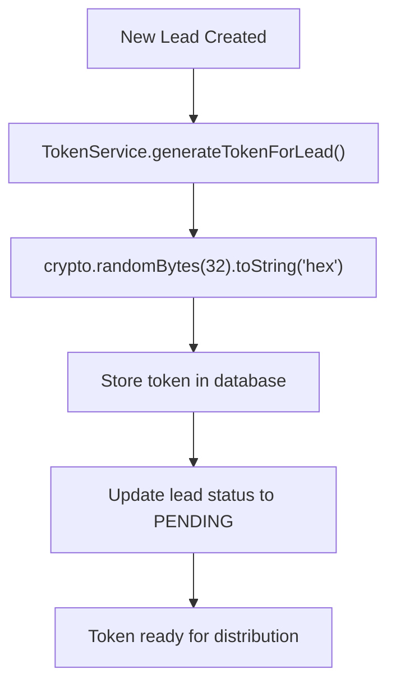
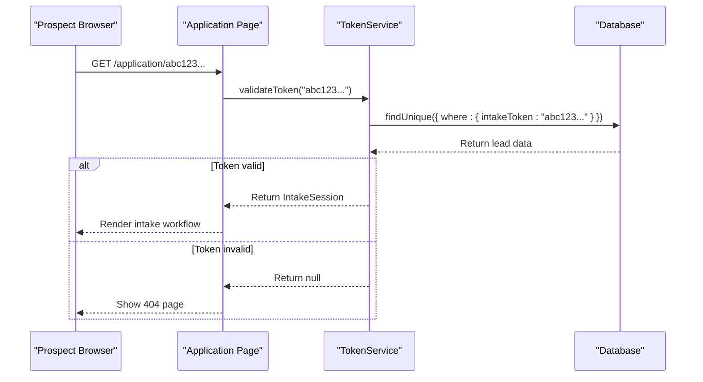
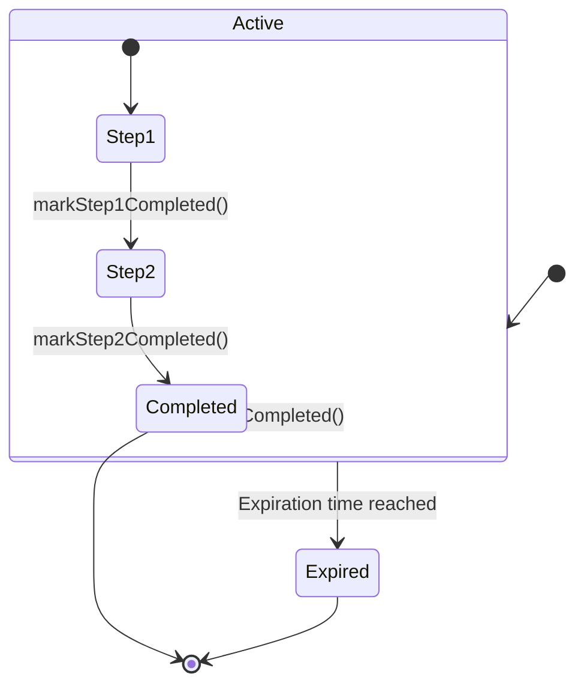
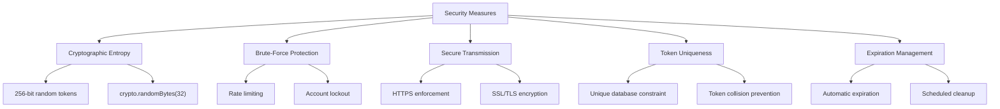
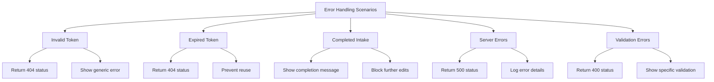
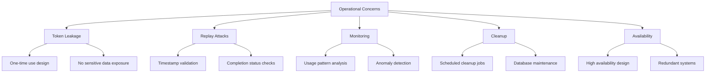
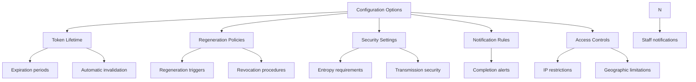
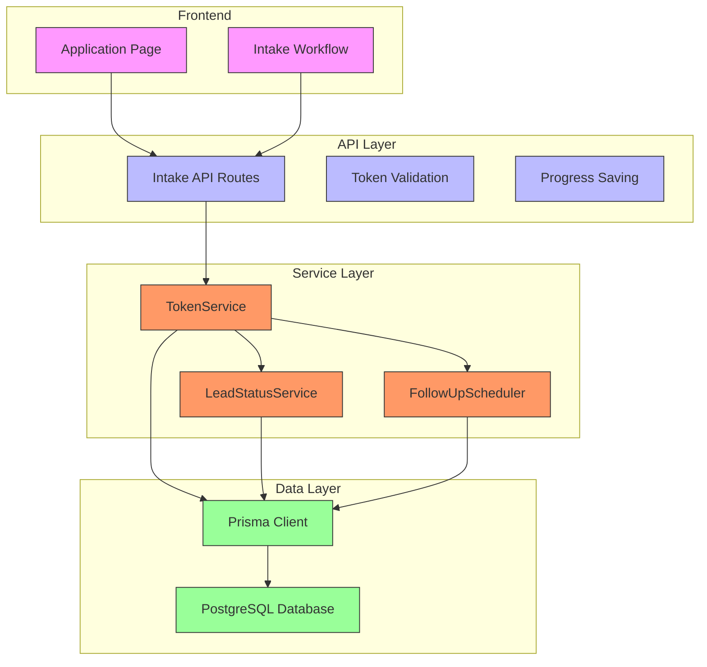
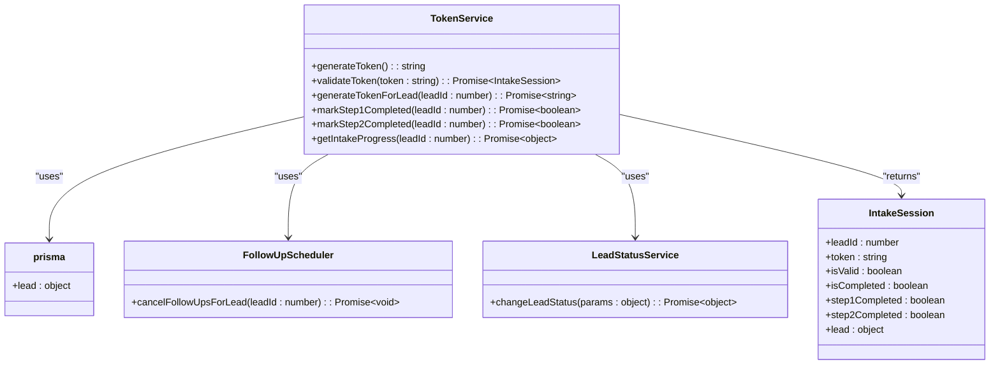
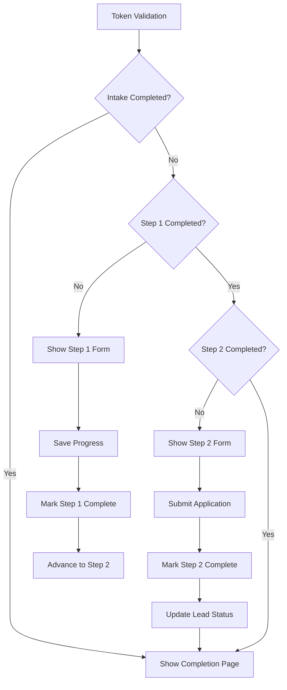

# Intake Token Authentication

<cite>
**Referenced Files in This Document**   
- [TokenService.ts](file://src/services/TokenService.ts)
- [route.ts](file://src/app/api/intake/[token]/route.ts)
- [page.tsx](file://src/app/application/[token]/page.tsx)
- [save/route.ts](file://src/app/api/intake/[token]/save/route.ts)
- [schema.prisma](file://prisma/schema.prisma)
</cite>

## Table of Contents
1. [Introduction](#introduction)
2. [Token Generation and Storage](#token-generation-and-storage)
3. [Token Validation Process](#token-validation-process)
4. [One-Time Use and Invalidation](#one-time-use-and-invalidation)
5. [Security Measures](#security-measures)
6. [Error Handling](#error-handling)
7. [Operational Concerns](#operational-concerns)
8. [Configuration and Policies](#configuration-and-policies)
9. [Architecture Overview](#architecture-overview)
10. [Detailed Component Analysis](#detailed-component-analysis)

## Introduction
The intake token authentication mechanism in fund-track enables secure, one-time access to the business funding application process for prospective leads. This system uses cryptographically secure tokens to authenticate users without requiring traditional login credentials. The tokens are generated, validated, and managed through the TokenService, which interfaces with the database to store token data and track intake progress. This document details the complete workflow from token generation to completion, including security considerations and operational procedures.

## Token Generation and Storage

The token generation process begins when a new lead is created in the system. The TokenService generates cryptographically secure tokens using Node.js's crypto module, specifically the `crypto.randomBytes(32)` method, which produces 256-bit random values encoded as 64-character hexadecimal strings.

**Diagram sources**
- [TokenService.ts](file://src/services/TokenService.ts#L56-L77)
- [schema.prisma](file://prisma/schema.prisma#L60-L62)

**Section sources**
- [TokenService.ts](file://src/services/TokenService.ts#L56-L88)
- [schema.prisma](file://prisma/schema.prisma#L60-L62)

The generated token is stored in the `intake_token` field of the `leads` table in the PostgreSQL database. This field is defined as a unique string in the Prisma schema, ensuring that each token is globally unique across all leads. When a token is assigned to a lead, the lead's status is automatically updated to "PENDING" to indicate that the intake process has been initiated.

The token generation process is typically triggered by the LeadPoller service, which identifies new leads that don't yet have intake tokens and processes them accordingly. This automated workflow ensures that all qualified leads receive access to the application process in a timely manner.

## Token Validation Process

When a prospect accesses the `/application/[token]` endpoint, the system validates the provided token through a multi-step verification process. The validation flow begins with the application page component, which calls the TokenService to verify the token's authenticity and retrieve the associated intake session data.

**Diagram sources**
- [page.tsx](file://src/app/application/[token]/page.tsx#L10-L25)
- [TokenService.ts](file://src/services/TokenService.ts#L79-L199)

**Section sources**
- [page.tsx](file://src/app/application/[token]/page.tsx#L10-L25)
- [route.ts](file://src/app/api/intake/[token]/route.ts#L5-L25)

The validation process checks several conditions to determine token validity:
1. The token must exist in the database and match a lead's `intake_token` field
2. The associated lead record must be active and accessible
3. The token must not have been invalidated through completion or revocation

If validation succeeds, the system returns an `IntakeSession` object containing the lead's information and current intake progress status. This includes flags indicating whether step 1, step 2, or the entire intake process has been completed. If validation fails, the system returns a 404 response, and the application page displays a not-found error.

The validation endpoint is also accessible via the `/api/intake/[token]` route, which returns JSON data about the intake session. This API endpoint is used by various system components to check token status and intake progress.

## One-Time Use and Invalidation

The intake token system implements one-time use semantics, where tokens are automatically invalidated after the intake process is completed. This ensures that each token can only be used to submit a single application, preventing reuse or sharing.

**Diagram sources**
- [TokenService.ts](file://src/services/TokenService.ts#L200-L250)
- [schema.prisma](file://prisma/schema.prisma#L63-L65)

**Section sources**
- [TokenService.ts](file://src/services/TokenService.ts#L200-L250)

The invalidation process is triggered when the `markStep2Completed` method is called, typically after the prospect submits the final step of the intake form. This method performs several actions:
1. Sets the `step2CompletedAt` and `intakeCompletedAt` timestamps in the database
2. Cancels any pending follow-up tasks for the lead
3. Updates the lead status to "IN_PROGRESS" to notify staff that the application is ready for review

Once the intake is marked as completed, the token remains in the database but becomes functionally inactive. Any subsequent attempts to use the token will still pass the initial validation (since the token still exists), but the `IntakeSession` object will indicate that `isCompleted` is true. The application interface uses this flag to display a completion message instead of the intake forms.

The system also supports partial completion through the `markStep1Completed` method, which allows prospects to save their progress after completing the first step. This creates a checkpoint without fully invalidating the token, enabling a multi-step workflow while maintaining security.

## Security Measures

The intake token authentication system implements multiple security measures to protect against common threats and ensure the integrity of the application process.

**Diagram sources**
- [TokenService.ts](file://src/services/TokenService.ts#L56-L58)
- [schema.prisma](file://prisma/schema.prisma#L60)

**Section sources**
- [TokenService.ts](file://src/services/TokenService.ts#L56-L58)
- [schema.prisma](file://prisma/schema.prisma#L60)

The system generates tokens with high cryptographic entropy using the `crypto.randomBytes(32)` method, producing 256-bit random values. This results in tokens with 2^256 possible combinations, making brute-force attacks computationally infeasible. The tokens are stored as 64-character hexadecimal strings, providing sufficient length to prevent guessing attacks.

All token transmissions occur over HTTPS, ensuring end-to-end encryption between the client and server. The application interface displays security indicators to reassure prospects that their information is protected by 256-bit encryption. The middleware configuration explicitly allows access to the `/application/[token]` routes without requiring authentication, while protecting other application endpoints.

The database schema enforces token uniqueness through a unique constraint on the `intake_token` field, preventing duplicate tokens and ensuring that each token corresponds to exactly one lead. This constraint is critical for maintaining the integrity of the one-time use semantics.

While the current implementation does not include explicit token expiration timestamps, the system could be extended to add expiration functionality by introducing an `expiresAt` field in the database and checking it during validation. This would provide an additional layer of security by automatically invalidating tokens after a configurable period.

## Error Handling

The intake token system implements comprehensive error handling to manage various failure scenarios gracefully while maintaining security.

**Diagram sources**
- [route.ts](file://src/app/api/intake/[token]/route.ts#L15-L30)
- [save/route.ts](file://src/app/api/intake/[token]/save/route.ts#L20-L45)

**Section sources**
- [route.ts](file://src/app/api/intake/[token]/route.ts#L15-L30)
- [save/route.ts](file://src/app/api/intake/[token]/save/route.ts#L20-L45)

When a prospect accesses the application with an invalid or expired token, the system returns a 404 status code and displays a generic error message. This prevents information leakage about specific token states while maintaining security. The application page uses Next.js's `notFound()` function to handle invalid tokens, ensuring consistent behavior across the system.

For server-side errors, the system catches exceptions and returns a 500 status code with a generic "Internal server error" message. Detailed error information is logged on the server for debugging purposes but not exposed to clients, following security best practices for error handling.

During the intake process, the system validates input data and returns appropriate error responses for missing or invalid fields. For example, when saving progress on step 1, the system checks for required fields like name, email, and phone number, returning a 400 status code with specific validation errors if any required data is missing or malformed.

The TokenService methods include comprehensive error handling with try-catch blocks that log detailed error information for debugging while returning null or false to indicate failure. This pattern ensures that errors in one part of the system don't cascade and compromise overall functionality.

## Operational Concerns

The intake token system addresses several operational concerns related to token management, security monitoring, and system reliability.

**Diagram sources**
- [TokenService.ts](file://src/services/TokenService.ts#L200-L250)
- [schema.prisma](file://prisma/schema.prisma#L63-L65)

**Section sources**
- [TokenService.ts](file://src/services/TokenService.ts#L200-L250)

Token leakage is mitigated through the one-time use design, which automatically invalidates tokens after intake completion. Even if a token is compromised after use, it cannot be reused to access the system. The system does not expose sensitive information through token validation, returning only the minimum necessary data for the intake process.

Replay attacks are prevented by the completion status tracking. Once a token has been used to complete the intake process, subsequent attempts to use the same token will be detected through the `intakeCompletedAt` timestamp. The system can also be enhanced with additional replay protection by implementing usage counters or one-time authorization codes.

Monitoring suspicious token usage patterns can be achieved by analyzing access logs and correlating them with other system events. For example, multiple failed validation attempts for different tokens from the same IP address could indicate a brute-force attack. Similarly, rapid successive completions from the same geographic region might suggest automated scraping.

The system currently lacks automated token cleanup, but this could be implemented through scheduled jobs that remove expired tokens or archive completed intakes. Database indexes on token-related fields ensure efficient lookups even as the dataset grows.

High availability is ensured through the use of robust infrastructure and redundant systems. The token validation process is optimized for performance with appropriate database indexing on the `intake_token` field, enabling fast lookups even with large datasets.

## Configuration and Policies

The intake token system can be configured through various policies and settings to meet organizational requirements and security standards.

**Diagram sources**
- [schema.prisma](file://prisma/schema.prisma#L60-L65)
- [TokenService.ts](file://src/services/TokenService.ts#L56-L58)

**Section sources**
- [schema.prisma](file://prisma/schema.prisma#L60-L65)

While the current implementation does not include explicit configuration for token lifetime, this could be added by introducing a `tokenLifetimeHours` system setting. This setting would determine how long tokens remain valid before automatic expiration, with common values ranging from 24 to 72 hours depending on business requirements.

Token regeneration policies are currently limited to the initial generation process, but could be extended to support token refresh or reissuance in specific scenarios. For example, if a prospect reports not receiving the token email, staff could trigger token regeneration through an administrative interface. This would invalidate the old token and generate a new one, with appropriate audit logging.

Security settings could be enhanced to include configurable entropy requirements, allowing organizations to adjust token length and complexity based on their risk tolerance. The system could also support configurable transmission security policies, such as requiring specific TLS versions or cipher suites.

Notification rules can be configured to alert staff when intakes are completed, ensuring timely follow-up. These notifications could be customized based on lead characteristics or intake content, enabling prioritized processing of high-value applications.

Access controls could be extended to include IP restrictions or geographic limitations, restricting token access to specific regions or networks. This would provide an additional layer of security for sensitive applications or compliance requirements.

## Architecture Overview

The intake token authentication system follows a layered architecture with clear separation of concerns between components.

**Diagram sources**
- [TokenService.ts](file://src/services/TokenService.ts)
- [page.tsx](file://src/app/application/[token]/page.tsx)
- [route.ts](file://src/app/api/intake/[token]/route.ts)
- [schema.prisma](file://prisma/schema.prisma)

The architecture consists of four main layers:
1. **Frontend**: The application page and intake workflow components that render the user interface
2. **API Layer**: Route handlers that process HTTP requests for token validation and progress saving
3. **Service Layer**: Business logic services, primarily TokenService, that coordinate operations
4. **Data Layer**: Prisma ORM and PostgreSQL database that store and retrieve token and lead data

The frontend components are server-side rendered React components that initialize the intake workflow based on token validation results. The API layer exposes RESTful endpoints for token validation and progress saving, with proper error handling and status codes. The service layer encapsulates business logic and coordinates between different system components. The data layer provides persistent storage with proper indexing and constraints to ensure data integrity.

## Detailed Component Analysis

### TokenService Analysis

The TokenService class is the core component of the intake token authentication system, responsible for token generation, validation, and lifecycle management.

**Diagram sources**
- [TokenService.ts](file://src/services/TokenService.ts#L56-L312)

**Section sources**
- [TokenService.ts](file://src/services/TokenService.ts#L56-L312)

The TokenService is implemented as a static class with several key methods:
- `generateToken()`: Creates cryptographically secure tokens using Node.js crypto
- `validateToken()`: Verifies token validity and returns intake session data
- `generateTokenForLead()`: Assigns a new token to a specific lead
- `markStep1Completed()`: Records completion of the first intake step
- `markStep2Completed()`: Finalizes the intake process and updates lead status

The service depends on several external components:
- Prisma client for database operations
- FollowUpScheduler to cancel pending follow-ups upon completion
- LeadStatusService to update lead status after intake completion

The `IntakeSession` interface defines the structure of the data returned by token validation, including both token metadata and lead information. This interface ensures type safety and consistency across the application.

The service implements comprehensive error handling with try-catch blocks around all database operations, logging errors for debugging while returning appropriate failure indicators. This pattern ensures that transient database issues don't compromise system stability.

### Application Workflow Analysis

The intake application workflow is managed by the IntakeWorkflow component, which orchestrates the multi-step process based on token validation results.

**Diagram sources**
- [IntakeWorkflow.tsx](file://src/components/intake/IntakeWorkflow.tsx#L10-L45)
- [page.tsx](file://src/app/application/[token]/page.tsx#L10-L25)

**Section sources**
- [IntakeWorkflow.tsx](file://src/components/intake/IntakeWorkflow.tsx#L10-L45)

The workflow begins with token validation, which determines the current state of the intake process. The IntakeWorkflow component uses the `isCompleted`, `step1Completed`, and `step2Completed` flags from the IntakeSession to determine which view to display.

For new intakes, the workflow starts with Step 1 Form, which collects basic contact and business information. When the prospect completes this step, the system saves the progress and advances to Step 2 Form. This form collects additional details and supporting documents.

The final step triggers the completion process, which marks the intake as finished, cancels any pending follow-ups, and updates the lead status to "IN_PROGRESS". This status change alerts staff that the application is ready for review and processing.

The workflow is designed to be resilient to interruptions, allowing prospects to save progress and return later. However, once the intake is completed, the token cannot be reused, ensuring one-time submission.