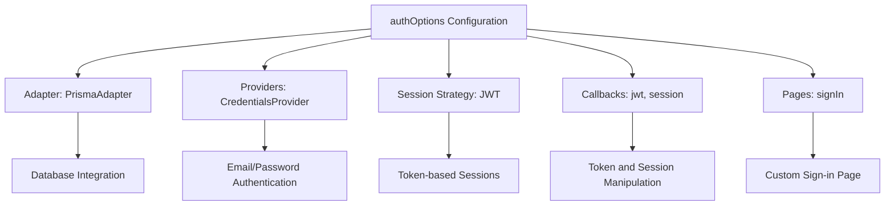
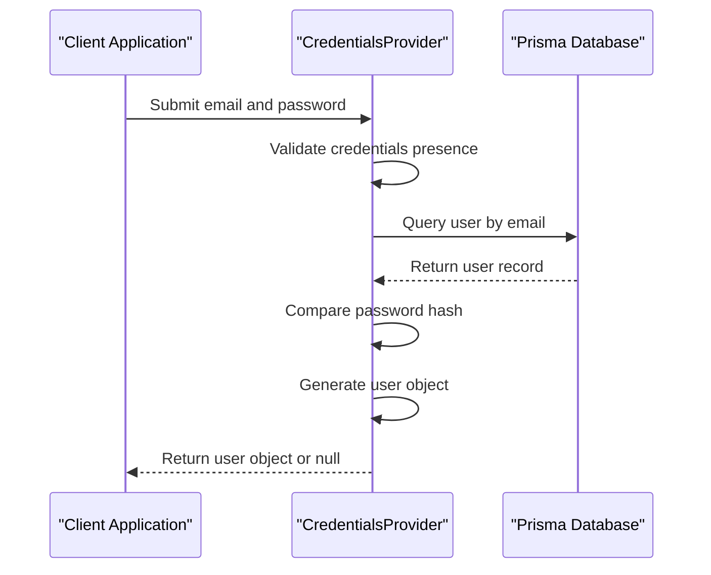
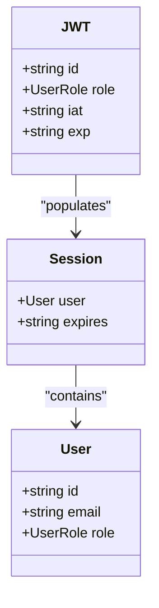
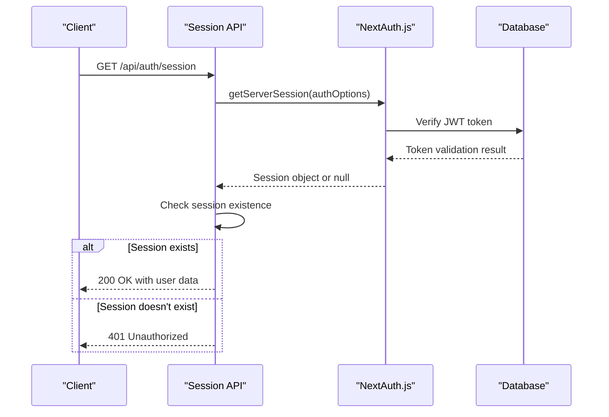
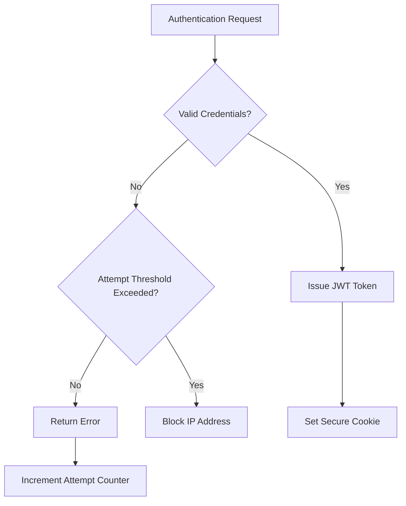

# NextAuth.js Implementation

<cite>
**Referenced Files in This Document**   
- [auth.ts](file://src/lib/auth.ts)
- [...nextauth]/route.ts](file://src/app/api/auth/[...nextauth]/route.ts)
- [signin/route.ts](file://src/app/api/auth/signin/route.ts)
- [session/route.ts](file://src/app/api/auth/session/route.ts)
- [schema.prisma](file://prisma/schema.prisma)
- [next-auth.d.ts](file://src/types/next-auth.d.ts)
- [password.ts](file://src/lib/password.ts)
</cite>

## Table of Contents
1. [Introduction](#introduction)
2. [Core Authentication Configuration](#core-authentication-configuration)
3. [Custom Credentials Provider](#custom-credentials-provider)
4. [Session Management and JWT Structure](#session-management-and-jwt-structure)
5. [Prisma Integration and User Model](#prisma-integration-and-user-model)
6. [Authentication Request Handling](#authentication-request-handling)
7. [User Data Serialization](#user-data-serialization)
8. [Security Considerations](#security-considerations)
9. [Extensibility and Future Enhancements](#extensibility-and-future-enhancements)

## Introduction
This document provides a comprehensive analysis of the NextAuth.js implementation in the fund-track application. The authentication system is built around a custom credentials provider that handles user authentication through email and password. The implementation leverages the Prisma adapter for database integration, uses JWT for session management, and incorporates secure password hashing with bcrypt. The system is designed to be extensible, allowing for future integration of additional authentication providers while maintaining security and type safety.

## Core Authentication Configuration

The core authentication configuration is defined in the `auth.ts` file, which exports the `authOptions` object used by NextAuth.js. This configuration establishes the foundation for the entire authentication system, including the adapter, providers, session strategy, and callbacks.



**Diagram sources**
- [auth.ts](file://src/lib/auth.ts#L1-L70)

**Section sources**
- [auth.ts](file://src/lib/auth.ts#L1-L70)

## Custom Credentials Provider

The custom credentials provider is configured to authenticate users using email and password. The provider is defined with specific credentials fields and an authorize callback that handles the authentication logic.

### Authentication Logic

The authentication process follows a secure sequence of validation and verification steps:



The authorization process begins with validating that both email and password are provided. If either is missing, the function returns null, indicating authentication failure.

```typescript
async authorize(credentials) {
  if (!credentials?.email || !credentials?.password) {
    return null
  }
```

The system then queries the database for a user with the provided email address. If no user is found, authentication fails by returning null.

```typescript
const user = await prisma.user.findUnique({
  where: {
    email: credentials.email
  }
})

if (!user) {
  return null
}
```

When a user is found, the system verifies the password using bcrypt's comparison function. This approach prevents timing attacks by using a constant-time comparison algorithm.

```typescript
const isPasswordValid = await bcrypt.compare(
  credentials.password,
  user.passwordHash
)

if (!isPasswordValid) {
  return null
}
```

Upon successful authentication, the provider returns a user object containing the user's ID, email, and role. The ID is converted to a string to comply with NextAuth.js requirements.

```typescript
return {
  id: user.id.toString(),
  email: user.email,
  role: user.role,
}
```

### User Validation

User validation occurs at multiple levels in the system. The credentials provider performs basic validation by ensuring required fields are present. The database schema enforces additional constraints, such as email uniqueness.

The Prisma schema defines the User model with essential fields for authentication:

```prisma
model User {
  id           Int      @id @default(autoincrement())
  email        String   @unique
  passwordHash String   @map("password_hash")
  role         UserRole @default(USER)
  createdAt    DateTime @default(now()) @map("created_at")
  updatedAt    DateTime @updatedAt @map("updated_at")
}
```

The `@unique` attribute on the email field ensures that no two users can have the same email address, preventing duplicate accounts. The `passwordHash` field stores the bcrypt hash of the user's password, not the password itself, following security best practices.

**Section sources**
- [auth.ts](file://src/lib/auth.ts#L10-L38)
- [schema.prisma](file://prisma/schema.prisma#L14-L22)

## Session Management and JWT Structure

The authentication system uses JWT (JSON Web Tokens) for session management, providing a stateless and secure way to maintain user sessions across requests.

### JWT Configuration

The session strategy is explicitly set to "jwt" in the authentication options:

```typescript
session: {
  strategy: "jwt",
},
```

This configuration instructs NextAuth.js to use JWT for session management rather than database sessions. JWTs are signed using a secret key from environment variables, ensuring that tokens cannot be tampered with.

### JWT Callback

The `jwt` callback is responsible for adding custom claims to the JWT token. When a user successfully authenticates, this callback adds the user's ID and role to the token:

```typescript
async jwt({ token, user }) {
  if (user) {
    token.id = user.id
    token.role = user.role
  }
  return token
}
```

This callback executes when a user first signs in, allowing the system to include additional user information in the token payload. The token object is then signed and sent to the client.

### Session Callback

The `session` callback processes the JWT token and adds the custom claims to the session object that is available to the application:

```typescript
async session({ session, token }) {
  if (token) {
    session.user.id = token.id as string
    session.user.role = token.role as UserRole
  }
  return session
}
```

This callback ensures that the user's ID and role are available in the session object, making them accessible throughout the application without requiring additional database queries.

### Token Structure

The resulting JWT token contains the following claims:

- `id`: The user's ID as a string
- `role`: The user's role (ADMIN or USER)
- Standard JWT claims (iss, sub, aud, exp, nbf, iat, jti)

The token is signed using a secret key from environment variables, which is not visible in the codebase for security reasons. The signing algorithm is likely HS256 (HMAC with SHA-256), which is the default for NextAuth.js when using JWT.



**Diagram sources**
- [auth.ts](file://src/lib/auth.ts#L50-L65)

**Section sources**
- [auth.ts](file://src/lib/auth.ts#L45-L65)
- [next-auth.d.ts](file://src/types/next-auth.d.ts#L0-L23)

## Prisma Integration and User Model

The authentication system integrates with the database through the Prisma adapter, which provides a seamless connection between NextAuth.js and the PostgreSQL database.

### Prisma Adapter Configuration

The Prisma adapter is configured in the authentication options:

```typescript
adapter: PrismaAdapter(prisma),
```

This line connects NextAuth.js to the Prisma client instance, enabling the authentication system to perform database operations through Prisma's type-safe query builder. The adapter handles all necessary database operations for authentication, including user creation, retrieval, and updates.

### User Model Definition

The User model in the Prisma schema defines the structure of user records in the database:

```prisma
model User {
  id           Int      @id @default(autoincrement())
  email        String   @unique
  passwordHash String   @map("password_hash")
  role         UserRole @default(USER)
  createdAt    DateTime @default(now()) @map("created_at")
  updatedAt    DateTime @updatedAt @map("updated_at")
}
```

Key aspects of the User model include:

- **id**: Auto-incrementing integer primary key
- **email**: Unique string field for user identification
- **passwordHash**: Stores the bcrypt hash of the user's password
- **role**: Enum field with ADMIN and USER values, defaulting to USER
- **createdAt**: Timestamp of record creation
- **updatedAt**: Timestamp automatically updated on record changes

The `@map` attributes ensure proper mapping between Prisma field names and database column names, following snake_case convention in the database.

### Role-Based Access Control

The system implements role-based access control through the UserRole enum:

```prisma
enum UserRole {
  ADMIN @map("admin")
  USER  @map("user")
}
```

This enum is used in both the Prisma schema and the NextAuth.js configuration to manage user permissions. The role is included in the JWT token and session, allowing the application to enforce authorization rules based on user roles.

**Section sources**
- [auth.ts](file://src/lib/auth.ts#L3-L5)
- [schema.prisma](file://prisma/schema.prisma#L14-L22)
- [schema.prisma](file://prisma/schema.prisma#L241-L246)

## Authentication Request Handling

The system handles authentication requests through multiple endpoints, each serving a specific purpose in the authentication flow.

### API Route Handler

The main authentication endpoint is implemented in `[...nextauth]/route.ts`:

```typescript
import NextAuth from "next-auth"
import { authOptions } from "@/lib/auth"

const handler = NextAuth(authOptions)

export { handler as GET, handler as POST }
```

This file creates a NextAuth.js handler using the configured `authOptions` and exports it as both GET and POST handlers. This single endpoint handles all NextAuth.js operations, including sign-in, sign-out, session management, and callback processing.

### Sign-in Endpoint

The custom sign-in endpoint provides API consistency and additional validation:

```typescript
export async function POST(request: NextRequest) {
  try {
    const { email, password } = await request.json()

    if (!email || !password) {
      return NextResponse.json(
        { error: "Email and password are required" },
        { status: 400 }
      )
    }

    return NextResponse.json(
      { message: "Use NextAuth signin endpoint" },
      { status: 200 }
    )
  } catch (error) {
    return NextResponse.json(
      { error: "Internal server error" },
      { status: 500 }
    )
  }
}
```

This endpoint validates that email and password are provided, returning a 400 error if either is missing. However, it doesn't perform the actual authentication, instead directing clients to use the standard NextAuth.js sign-in flow.

### Session Endpoint

The session endpoint allows clients to retrieve current session information:

```typescript
export async function GET(request: NextRequest) {
  try {
    const session = await getServerSession(authOptions)

    if (!session) {
      return NextResponse.json(
        { error: "Not authenticated" },
        { status: 401 }
      )
    }

    return NextResponse.json({
      user: {
        id: session.user.id,
        email: session.user.email,
        role: session.user.role,
      }
    })
  } catch (error) {
    return NextResponse.json(
      { error: "Internal server error" },
      { status: 500 }
    )
  }
}
```

This endpoint uses `getServerSession` to retrieve the current session based on the authentication options. If no session exists, it returns a 401 Unauthorized response. Otherwise, it returns the user's ID, email, and role.



**Diagram sources**
- [...nextauth]/route.ts](file://src/app/api/auth/[...nextauth]/route.ts#L1-L6)
- [signin/route.ts](file://src/app/api/auth/signin/route.ts#L1-L26)
- [session/route.ts](file://src/app/api/auth/session/route.ts#L1-L31)

**Section sources**
- [...nextauth]/route.ts](file://src/app/api/auth/[...nextauth]/route.ts#L1-L6)
- [signin/route.ts](file://src/app/api/auth/signin/route.ts#L1-L26)
- [session/route.ts](file://src/app/api/auth/session/route.ts#L1-L31)

## User Data Serialization

The system handles user data serialization through the JWT and session callbacks, ensuring that user information is properly formatted and available throughout the application.

### Type Definitions

Custom type definitions extend the default NextAuth.js types to include additional user properties:

```typescript
declare module "next-auth" {
  interface Session {
    user: {
      id: string
      email: string
      role: UserRole
    }
  }

  interface User {
    id: string
    email: string
    role: UserRole
  }
}

declare module "next-auth/jwt" {
  interface JWT {
    role: UserRole
  }
}
```

These type extensions ensure type safety throughout the application by defining the exact structure of the session, user, and JWT objects.

### Data Flow

The user data flows through the system in the following sequence:

1. User authenticates with email and password
2. Credentials provider verifies credentials and returns user object
3. JWT callback adds ID and role to token
4. Session callback adds token data to session
5. Session is available to the application with complete user information

This flow ensures that user data is consistently formatted and available wherever needed in the application.

**Section sources**
- [next-auth.d.ts](file://src/types/next-auth.d.ts#L0-L23)

## Security Considerations

The authentication system incorporates several security measures to protect user data and prevent common vulnerabilities.

### Password Security

Passwords are securely hashed using bcrypt with 12 salt rounds:

```typescript
const SALT_ROUNDS = 12

export async function hashPassword(password: string): Promise<string> {
  return bcrypt.hash(password, SALT_ROUNDS)
}
```

Bcrypt is a password hashing function specifically designed for secure password storage. The 12-round configuration provides a good balance between security and performance, making brute force attacks computationally expensive.

### Environment Secrets

The JWT signing key is stored in environment variables, keeping it out of the codebase. While the specific environment variable name is not visible in the provided code, NextAuth.js typically uses `NEXTAUTH_SECRET` for this purpose.

### Session Security

The middleware enforces secure cookies in production:

```typescript
// Secure cookies in production
if (process.env.NODE_ENV === 'production' && process.env.SECURE_COOKIES === 'true') {
  const cookies = response.headers.get('set-cookie');
  if (cookies) {
    const secureCookies = cookies.replace(/; secure/gi, '').replace(/$/g, '; Secure; SameSite=Strict');
    response.headers.set('set-cookie', secureCookies);
  }
}
```

This ensures that authentication cookies are marked as Secure and SameSite=Strict, preventing transmission over HTTP and protecting against cross-site request forgery attacks.

### Potential Security Issues

#### Session Fixation
The JWT-based session system is inherently resistant to session fixation attacks because each token is unique and tied to a specific user. However, proper token expiration and rotation policies should be implemented to further mitigate this risk.

#### Token Leakage
JWT tokens, once issued, cannot be easily revoked. To mitigate token leakage risks:
- Implement short token expiration times
- Use refresh tokens for long-lived sessions
- Maintain a token blacklist for compromised tokens
- Educate users about logging out on shared devices

#### Brute Force Protection
The current implementation does not include rate limiting for authentication attempts. Adding rate limiting to the sign-in endpoint would prevent brute force attacks.



**Section sources**
- [auth.ts](file://src/lib/auth.ts#L1-L70)
- [password.ts](file://src/lib/password.ts#L1-L10)
- [middleware.ts](file://src/middleware.ts#L47-L85)

## Extensibility and Future Enhancements

The authentication system is designed to be extensible, allowing for the addition of new authentication providers while maintaining security and type safety.

### Adding OAuth Providers

To add an OAuth provider such as Google or GitHub, the configuration would be extended:

```typescript
providers: [
  CredentialsProvider({ /* existing config */ }),
  GoogleProvider({
    clientId: process.env.GOOGLE_CLIENT_ID,
    clientSecret: process.env.GOOGLE_CLIENT_SECRET,
  }),
  GitHubProvider({
    clientId: process.env.GITHUB_CLIENT_ID,
    clientSecret: process.env.GITHUB_CLIENT_SECRET,
  })
]
```

The existing JWT and session callbacks would continue to work, automatically incorporating user data from the OAuth providers.

### Multi-Factor Authentication

The system could be extended to support multi-factor authentication by:

1. Adding a `twoFactorEnabled` field to the User model
2. Implementing a verification code system
3. Modifying the authorization flow to require a second factor for sensitive operations

### Role-Based Access Control Enhancement

The current role system could be enhanced with more granular permissions:

```prisma
model Permission {
  id   Int    @id @default(autoincrement())
  name String @unique
}

model RolePermission {
  roleId       Int @unique
  permissionId Int @unique
  
  role       Role       @relation(fields: [roleId], references: [id])
  permission Permission @relation(fields: [permissionId], references: [id])
  
  @@id([roleId, permissionId])
}
```

This would allow for more fine-grained control over user capabilities within the application.

**Section sources**
- [auth.ts](file://src/lib/auth.ts#L10-L20)
- [schema.prisma](file://prisma/schema.prisma#L14-L22)