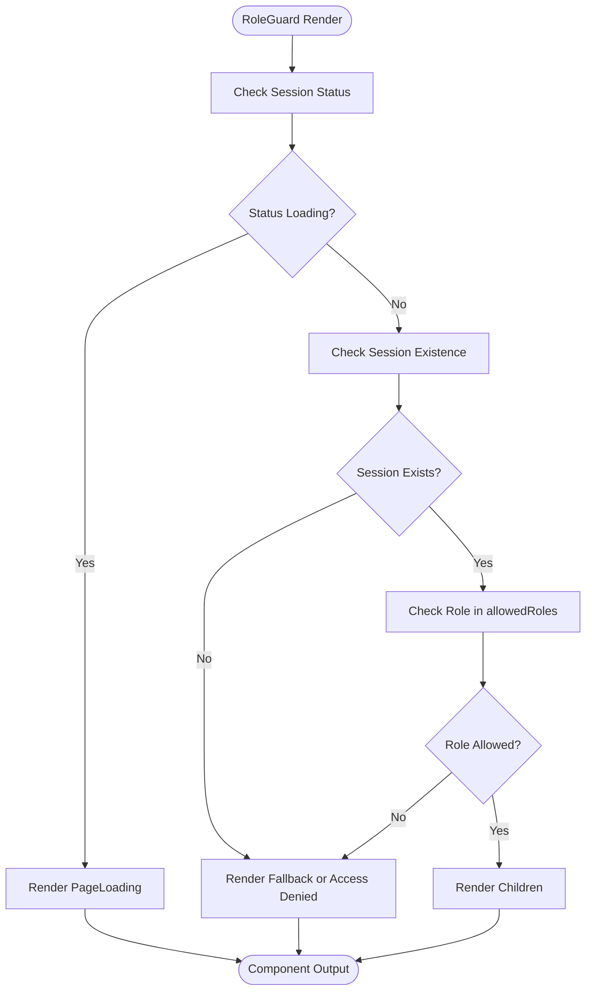
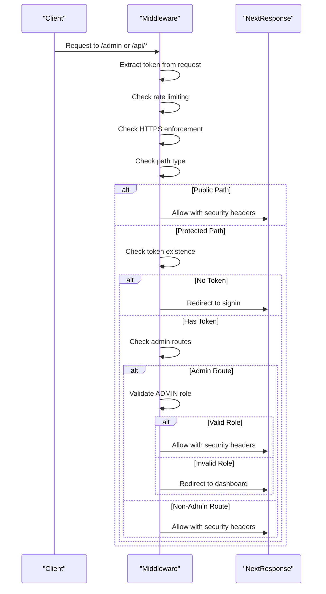
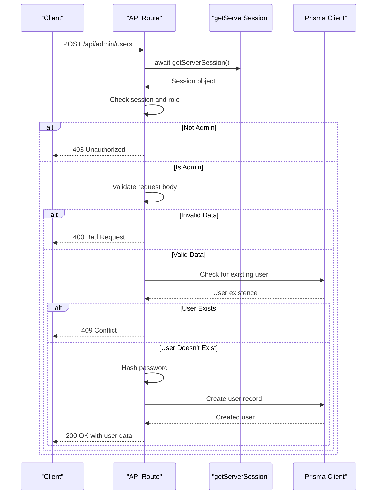
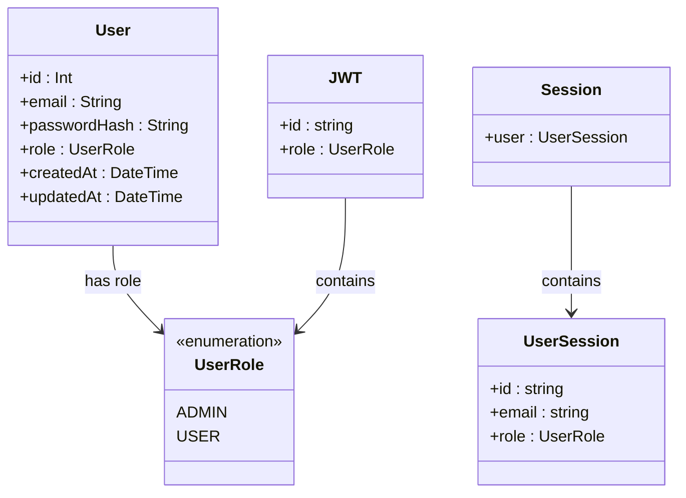
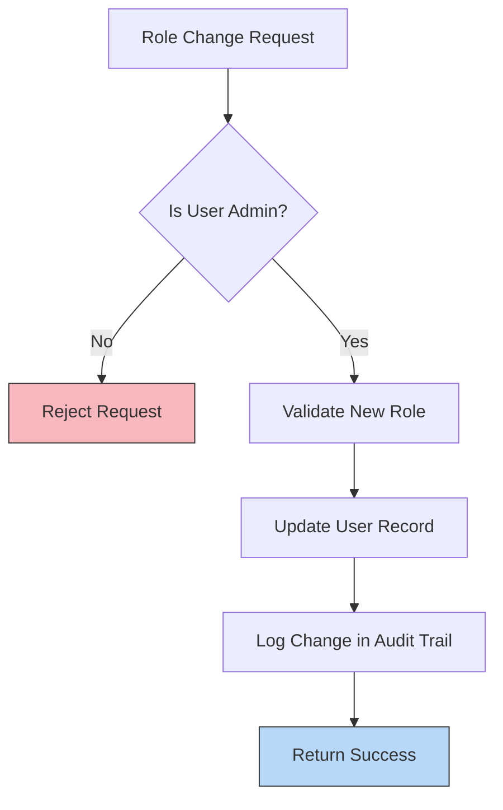

# Role-Based Access Control

<cite>
**Referenced Files in This Document**   
- [RoleGuard.tsx](file://src/components/auth/RoleGuard.tsx)
- [middleware.ts](file://src/middleware.ts)
- [schema.prisma](file://prisma/schema.prisma)
- [auth.ts](file://src/lib/auth.ts)
- [page.tsx](file://src/app/admin/page.tsx)
- [users/route.ts](file://src/app/api/admin/users/route.ts)
- [next-auth.d.ts](file://src/types/next-auth.d.ts)
- [SettingsAuditLog.tsx](file://src/components/admin/SettingsAuditLog.tsx)
- [settings/audit/route.ts](file://src/app/api/admin/settings/audit/route.ts)
</cite>

## Table of Contents
1. [Introduction](#introduction)
2. [Core Components](#core-components)
3. [Architecture Overview](#architecture-overview)
4. [Detailed Component Analysis](#detailed-component-analysis)
5. [Role Enforcement in API Routes](#role-enforcement-in-api-routes)
6. [User Role Management and Security](#user-role-management-and-security)
7. [Extending Role System and Backward Compatibility](#extending-role-system-and-backward-compatibility)
8. [Security Implications and Audit Requirements](#security-implications-and-audit-requirements)
9. [Troubleshooting Access Issues](#troubleshooting-access-issues)

## Introduction
The Role-Based Access Control (RBAC) system in fund-track ensures that users can only access resources and functionality appropriate to their assigned roles. This document details how roles are defined, stored, retrieved, and enforced across both frontend and backend components. The system uses a combination of client-side React components, server-side middleware, and database-level role definitions to provide comprehensive access control. The implementation supports role checks during session creation, route protection, and granular UI rendering based on user privileges.

## Core Components
The RBAC system in fund-track consists of several interconnected components that work together to enforce access control policies. These include the RoleGuard component for frontend protection, middleware for server-side route protection, Prisma schema definitions for role storage, and authentication logic that extends user sessions with role information. The system is designed to be both secure and user-friendly, providing clear access denial messages while preventing unauthorized access to sensitive functionality.

**Section sources**
- [RoleGuard.tsx](file://src/components/auth/RoleGuard.tsx#L1-L75)
- [middleware.ts](file://src/middleware.ts#L1-L189)
- [schema.prisma](file://prisma/schema.prisma#L1-L257)
- [auth.ts](file://src/lib/auth.ts#L1-L70)

## Architecture Overview
The RBAC architecture in fund-track follows a layered approach with role enforcement at multiple levels. User roles are stored in the database, retrieved during authentication, and propagated through the application via JWT tokens. Frontend components use the RoleGuard to conditionally render content, while server-side middleware protects routes and API endpoints. The system ensures that both client and server perform role validation, providing defense in depth against unauthorized access.

```mermaid
graph TB
subgraph "Database"
UserTable[(User Table)]
UserRoleEnum[UserRole Enum]
end
subgraph "Authentication"
AuthProvider[Credentials Provider]
SessionCallback[Session Callback]
JwTCallback[JWT Callback]
end
subgraph "Frontend"
RoleGuard[RoleGuard Component]
AdminOnly[AdminOnly Wrapper]
UI[Protected UI Components]
end
subgraph "Backend"
Middleware[Route Middleware]
APIRoutes[Protected API Routes]
end
UserTable --> AuthProvider: Retrieves role
AuthProvider --> JwTCallback: Adds role to token
JwTCallback --> SessionCallback: Propagates to session
SessionCallback --> RoleGuard: Provides role data
RoleGuard --> UI: Conditional rendering
Middleware --> APIRoutes: Route protection
SessionCallback --> Middleware: Token validation
```

**Diagram sources**
- [schema.prisma](file://prisma/schema.prisma#L1-L257)
- [auth.ts](file://src/lib/auth.ts#L1-L70)
- [RoleGuard.tsx](file://src/components/auth/RoleGuard.tsx#L1-L75)
- [middleware.ts](file://src/middleware.ts#L1-L189)

## Detailed Component Analysis

### RoleGuard Component Analysis
The RoleGuard component is a React component that wraps protected UI sections and conditionally renders content based on user roles. It uses Next-Auth's useSession hook to retrieve the current user's session and role information. The component accepts a list of allowed roles and optional fallback content to display when access is denied.



**Diagram sources**
- [RoleGuard.tsx](file://src/components/auth/RoleGuard.tsx#L1-L75)

**Section sources**
- [RoleGuard.tsx](file://src/components/auth/RoleGuard.tsx#L1-L75)

### Middleware Role Enforcement
The middleware component implements server-side route protection by intercepting requests and validating user roles before allowing access to privileged endpoints. It uses Next-Auth's withAuth function to extend the request with authentication token information, then applies role-based access rules based on the requested path.



**Diagram sources**
- [middleware.ts](file://src/middleware.ts#L1-L189)

**Section sources**
- [middleware.ts](file://src/middleware.ts#L1-L189)

## Role Enforcement in API Routes
API routes implement role-based access control by checking the user's role in each request handler. The system uses getServerSession to retrieve the current user's session and validate their role before allowing access to sensitive operations. This approach provides fine-grained control over who can perform specific actions like creating, updating, or deleting users.



**Diagram sources**
- [users/route.ts](file://src/app/api/admin/users/route.ts#L1-L226)

**Section sources**
- [users/route.ts](file://src/app/api/admin/users/route.ts#L1-L226)

## User Role Management and Security
User roles in fund-track are defined as an enum in the Prisma schema, ensuring type safety and database-level constraints. The system currently supports two roles: ADMIN and USER. These roles are stored in the User table and retrieved during the authentication process. The authentication flow extends the JWT token and session objects with role information, making it available throughout the application.



**Diagram sources**
- [schema.prisma](file://prisma/schema.prisma#L1-L257)
- [next-auth.d.ts](file://src/types/next-auth.d.ts#L1-L23)
- [auth.ts](file://src/lib/auth.ts#L1-L70)

**Section sources**
- [schema.prisma](file://prisma/schema.prisma#L1-L257)
- [next-auth.d.ts](file://src/types/next-auth.d.ts#L1-L23)
- [auth.ts](file://src/lib/auth.ts#L1-L70)

## Extending Role System and Backward Compatibility
The role system can be extended by modifying the UserRole enum in the Prisma schema and applying a database migration. When adding new roles, the system maintains backward compatibility by defaulting to the USER role for existing users. The RoleGuard component accepts an array of allowed roles, making it easy to grant access to multiple roles without modifying existing components.

To add a new role:
1. Update the UserRole enum in schema.prisma
2. Generate and apply a Prisma migration
3. Update any role-specific logic to handle the new role
4. Modify RoleGuard usage where the new role should have access

The system handles unknown roles gracefully by defaulting to USER role when creating new users, ensuring that invalid role values don't compromise security.

**Section sources**
- [schema.prisma](file://prisma/schema.prisma#L1-L257)
- [users/route.ts](file://src/app/api/admin/users/route.ts#L141-L195)
- [RoleGuard.tsx](file://src/components/auth/RoleGuard.tsx#L1-L75)

## Security Implications and Audit Requirements
The RBAC system addresses several security concerns related to role elevation and privilege escalation. The system prevents privilege escalation by validating roles on both client and server sides, ensuring that frontend role checks cannot be bypassed. Admin-only routes require explicit role validation, and sensitive operations like user deletion include additional safeguards (e.g., preventing admins from deleting their own accounts).

The system includes audit requirements for role changes through the settings audit log functionality. When system settings are modified, the changes are recorded with information about what was changed, who changed it, and when. This provides an audit trail for security-sensitive configuration changes.



**Diagram sources**
- [settings/audit/route.ts](file://src/app/api/admin/settings/audit/route.ts#L1-L32)
- [SettingsAuditLog.tsx](file://src/components/admin/SettingsAuditLog.tsx#L1-L112)

**Section sources**
- [settings/audit/route.ts](file://src/app/api/admin/settings/audit/route.ts#L1-L32)
- [SettingsAuditLog.tsx](file://src/components/admin/SettingsAuditLog.tsx#L1-L112)

## Troubleshooting Access Issues
When debugging access denial issues in the RBAC system, consider the following steps:

1. **Verify session state**: Check if the user is properly authenticated and the session contains role information
2. **Inspect RoleGuard usage**: Ensure the RoleGuard component is correctly configured with the appropriate allowedRoles
3. **Check middleware configuration**: Verify that the middleware matcher includes the protected routes
4. **Review API route protection**: Confirm that server-side routes implement proper role validation
5. **Test role transitions**: Use different user accounts with various roles to verify role-based access works as expected

Common issues include:
- Session not loading properly (shows loading state indefinitely)
- Role not being propagated from database to session
- Middleware not protecting expected routes
- API routes missing role validation

To test role transitions, create test users with different roles and verify access to protected resources. Use browser developer tools to inspect the session object and confirm the role value matches expectations.

**Section sources**
- [RoleGuard.tsx](file://src/components/auth/RoleGuard.tsx#L1-L75)
- [middleware.ts](file://src/middleware.ts#L1-L189)
- [users/route.ts](file://src/app/api/admin/users/route.ts#L1-L226)
- [auth.ts](file://src/lib/auth.ts#L1-L70)