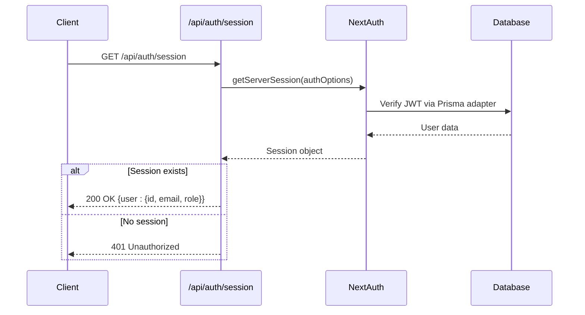
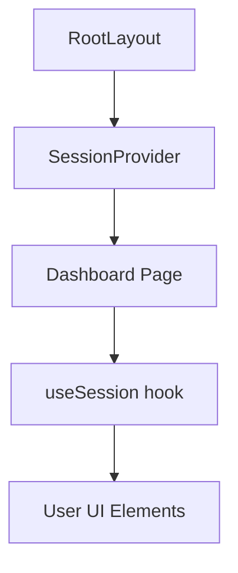
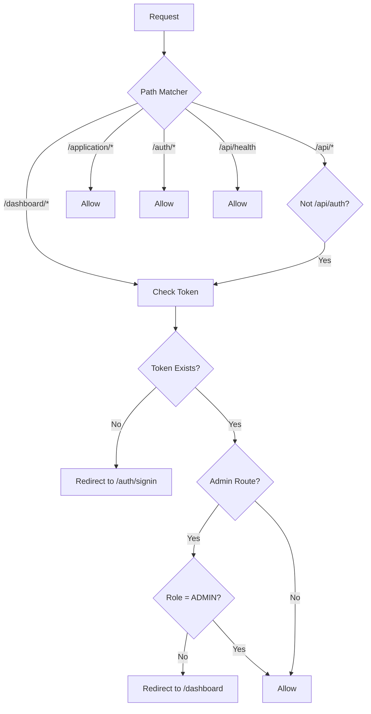
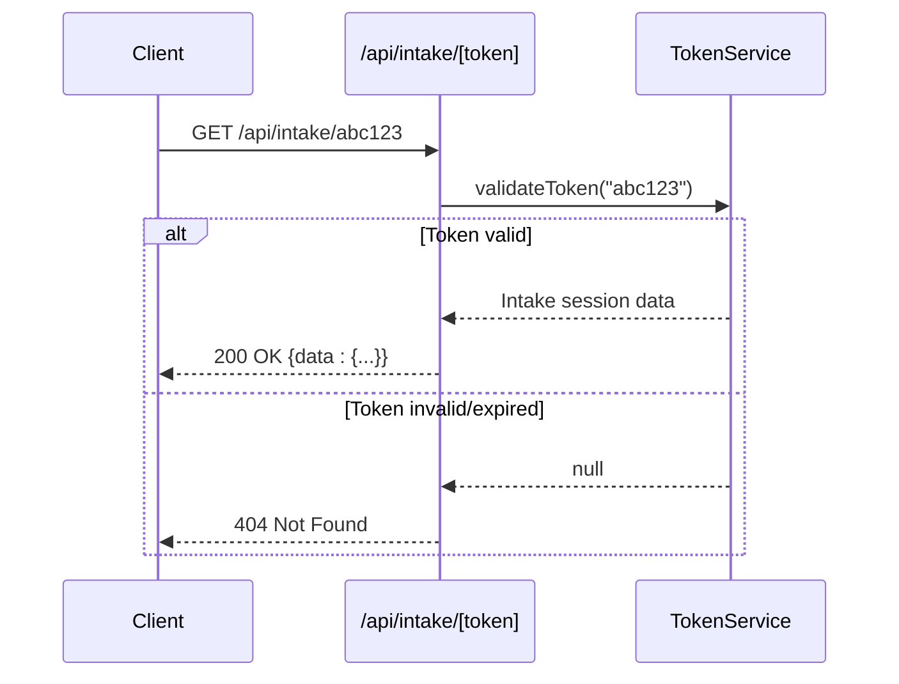

# Session Management

<cite>
**Referenced Files in This Document**   
- [src/app/api/auth/session/route.ts](file://src/app/api/auth/session/route.ts)
- [src/lib/auth.ts](file://src/lib/auth.ts)
- [src/middleware.ts](file://src/middleware.ts)
- [src/components/auth/SessionProvider.tsx](file://src/components/auth/SessionProvider.tsx)
- [src/app/layout.tsx](file://src/app/layout.tsx)
- [src/lib/prisma.ts](file://src/lib/prisma.ts)
- [src/app/api/auth/signin/route.ts](file://src/app/api/auth/signin/route.ts)
- [src/app/dashboard/page.tsx](file://src/app/dashboard/page.tsx)
- [src/services/TokenService.ts](file://src/services/TokenService.ts)
</cite>

## Table of Contents
1. [Introduction](#introduction)
2. [Session Retrieval and Validation](#session-retrieval-and-validation)
3. [Client and Server Access Patterns](#client-and-server-access-patterns)
4. [Middleware Route Protection](#middleware-route-protection)
5. [Session Persistence and Cookie Security](#session-persistence-and-cookie-security)
6. [Logout and Session Invalidation](#logout-and-session-invalidation)
7. [Session Expiration and Refresh Mechanism](#session-expiration-and-refresh-mechanism)
8. [Edge Cases and Security Considerations](#edge-cases-and-security-considerations)
9. [Performance and Caching](#performance-and-caching)
10. [Troubleshooting Common Issues](#troubleshooting-common-issues)

## Introduction
Session management in the fund-track application is implemented using NextAuth.js with a JWT-based strategy. The system ensures secure authentication, role-based access control, and persistent user sessions across requests. This document details the complete session lifecycle, from login to logout, including validation, protection mechanisms, and error handling.

**Section sources**
- [src/lib/auth.ts](file://src/lib/auth.ts#L1-L70)
- [src/app/api/auth/session/route.ts](file://src/app/api/auth/session/route.ts#L1-L31)

## Session Retrieval and Validation

The `/api/auth/session` endpoint is responsible for retrieving and validating the current user session. This endpoint uses NextAuth.js's `getServerSession` utility to extract session data from HTTP-only cookies.



**Diagram sources**
- [src/app/api/auth/session/route.ts](file://src/app/api/auth/session/route.ts#L1-L31)
- [src/lib/auth.ts](file://src/lib/auth.ts#L1-L70)

**Section sources**
- [src/app/api/auth/session/route.ts](file://src/app/api/auth/session/route.ts#L1-L31)

### Implementation Details
The session endpoint forces dynamic rendering to prevent caching issues:
```typescript
export const dynamic = 'force-dynamic';
```

It returns a sanitized user object containing only essential fields:
- `id`: User identifier
- `email`: User email address
- `role`: User role for authorization

Error handling is implemented for both authentication failures (401) and server errors (500).

## Client and Server Access Patterns

### Client-Side Session Access
Client components access session data through the `useSession` hook from `next-auth/react`. The `SessionProvider` component wraps the entire application, making session data available globally.



**Diagram sources**
- [src/components/auth/SessionProvider.tsx](file://src/components/auth/SessionProvider.tsx#L1-L15)
- [src/app/layout.tsx](file://src/app/layout.tsx#L1-L34)

The `SessionProvider` is integrated at the root layout level, ensuring all pages have access to authentication context.

### Server-Side Session Access
Server components and API routes use `getServerSession` with the configured `authOptions` to access session data. This function parses the JWT from cookies and validates it against the database via the Prisma adapter.

**Section sources**
- [src/components/auth/SessionProvider.tsx](file://src/components/auth/SessionProvider.tsx#L1-L15)
- [src/app/layout.tsx](file://src/app/layout.tsx#L1-L34)

## Middleware Route Protection

The application uses Next.js middleware to protect routes based on session existence and user roles. The `withAuth` higher-order function wraps the middleware with authorization callbacks.



**Diagram sources**
- [src/middleware.ts](file://src/middleware.ts#L1-L189)

### Protected Routes
The middleware protects the following routes:
- `/dashboard/*`: All dashboard pages
- `/api/*` (except `/api/auth`): All API endpoints
- `/admin/*`: Admin-specific routes requiring ADMIN role

### Public Routes
The following routes are accessible without authentication:
- `/application/*`: Intake application flows
- `/auth/*`: Authentication pages
- `/api/health`: Health check endpoint
- `/api/dev/*`: Development endpoints (when enabled)

**Section sources**
- [src/middleware.ts](file://src/middleware.ts#L1-L189)

## Session Persistence and Cookie Security

Sessions are persisted using HTTP-only, secure cookies containing JWT tokens. The JWT strategy is configured in `authOptions`:

```typescript
session: {
  strategy: "jwt",
},
```

### Cookie Security Features
- **HTTP-only**: Prevents client-side JavaScript access
- **Secure flag**: Ensures transmission over HTTPS only
- **SameSite=Strict**: Protects against CSRF attacks
- **JWT-based**: Stateless session tokens with embedded user data

The middleware enhances cookie security in production:
```typescript
if (process.env.NODE_ENV === 'production' && process.env.SECURE_COOKIES === 'true') {
  const secureCookies = cookies.replace(/; secure/gi, '').replace(/$/g, '; Secure; SameSite=Strict');
  response.headers.set('set-cookie', secureCookies);
}
```

**Section sources**
- [src/lib/auth.ts](file://src/lib/auth.ts#L1-L70)
- [src/middleware.ts](file://src/middleware.ts#L65-L75)

## Logout and Session Invalidation

Logout is implemented using the `signOut` function from `next-auth/react`. When a user clicks the sign-out button, they are redirected to the sign-in page.

```typescript
<button
  onClick={() => signOut({ callbackUrl: "/auth/signin" })}
  className="bg-red-600 hover:bg-red-700 text-white px-4 py-2 rounded-md text-sm font-medium"
>
  Sign Out
</button>
```

The `signOut` function:
1. Clears the JWT cookie
2. Invalidates the session on the server
3. Redirects to the specified callback URL

For password changes, sessions are automatically invalidated because the JWT contains user data that would become stale. The Prisma adapter ensures that any subsequent session validation will fail if the underlying user record has changed.

**Section sources**
- [src/app/dashboard/page.tsx](file://src/app/dashboard/page.tsx#L128-L149)

## Session Expiration and Refresh Mechanism

The application uses JWT-based sessions with a default expiration period. While the codebase does not implement an explicit token refresh mechanism, NextAuth.js automatically handles session persistence and renewal during active use.

### Token Validation
For intake-specific tokens (not user sessions), the `TokenService` handles validation and expiration:



**Diagram sources**
- [src/app/api/intake/[token]/route.ts](file://src/app/api/intake/[token]/route.ts#L1-L36)
- [src/services/TokenService.ts](file://src/services/TokenService.ts)

The JWT session tokens are automatically renewed by NextAuth.js when they are close to expiration, provided the user remains active.

## Edge Cases and Security Considerations

### Concurrent Sessions
The application allows multiple concurrent sessions for the same user. Each session is independent and can be used from different devices or browsers.

### Session Invalidation on Password Change
When a user changes their password, existing sessions remain valid until expiration. This is because the JWT is stateless and not directly tied to the password hash. To fully invalidate sessions on password change, a token blacklist or database session store would be required.

### Security Headers
The middleware adds security headers to protect sessions:
- `X-Robots-Tag`: Prevents indexing of sensitive pages
- `Strict-Transport-Security`: Enforces HTTPS in production
- Secure cookie flags: Prevent cookie theft

### Rate Limiting
The middleware implements rate limiting to prevent brute force attacks:
- 100 requests per 15 minutes per IP
- Configurable via environment variables
- Disabled in development

**Section sources**
- [src/middleware.ts](file://src/middleware.ts#L1-L189)

## Performance and Caching

### Session Lookup Performance
Session validation involves:
1. Cookie parsing
2. JWT verification
3. Database lookup via Prisma adapter

The Prisma client is configured with appropriate logging and error handling, but no explicit caching is implemented for session lookups.

### Optimization Opportunities
- Implement Redis caching for frequent session lookups
- Use short-lived JWTs with refresh tokens for better security
- Add database indexes on user lookup fields (email, id)

The Prisma client uses connection pooling and efficient query generation, minimizing database overhead.

**Section sources**
- [src/lib/prisma.ts](file://src/lib/prisma.ts#L1-L60)

## Troubleshooting Common Issues

### "Session Not Found" Errors
**Symptoms**: 401 Unauthorized responses despite valid login
**Causes**:
- Expired JWT token
- Incorrect cookie configuration
- HTTPS/HTTP protocol mismatch
- Browser blocking third-party cookies

**Solutions**:
1. Clear browser cookies and log in again
2. Ensure consistent protocol (HTTP vs HTTPS)
3. Check browser cookie settings
4. Verify `NEXTAUTH_URL` environment variable

### "Unauthenticated Despite Valid Login"
**Symptoms**: Redirected to sign-in page after successful login
**Causes**:
- Middleware configuration issues
- Incorrect callback URL
- Cookie domain mismatch

**Solutions**:
1. Verify middleware matcher configuration
2. Check that `NEXTAUTH_URL` matches the application URL
3. Ensure secure cookies are properly configured in production

### Development vs Production Differences
**Issue**: Sessions work in development but fail in production
**Solution**: Ensure `SECURE_COOKIES=true` and `FORCE_HTTPS=true` are set in production, and that the server is accessible via HTTPS.

**Section sources**
- [src/middleware.ts](file://src/middleware.ts#L1-L189)
- [src/lib/auth.ts](file://src/lib/auth.ts#L1-L70)
- [src/app/api/auth/session/route.ts](file://src/app/api/auth/session/route.ts#L1-L31)