# API Routes Architecture

<cite>
**Referenced Files in This Document**   
- [route.ts](file://src/app/api/leads/route.ts)
- [route.ts](file://src/app/api/leads/[id]/route.ts)
- [route.ts](file://src/app/api/leads/[id]/status/route.ts)
- [route.ts](file://src/app/api/leads/[id]/notes/route.ts)
- [route.ts](file://src/app/api/leads/[id]/files/route.ts)
- [route.ts](file://src/app/api/auth/[...nextauth]/route.ts)
- [route.ts](file://src/app/api/health/live/route.ts)
- [route.ts](file://src/app/api/health/ready/route.ts)
- [route.ts](file://src/app/api/admin/settings/[key]/route.ts)
- [route.ts](file://src/app/api/cron/poll-leads/route.ts)
- [middleware.ts](file://src/middleware.ts)
- [errors.ts](file://src/lib/errors.ts)
- [monitoring.ts](file://src/lib/monitoring.ts)
- [LeadStatusService.ts](file://src/services/LeadStatusService.ts)
</cite>

## Table of Contents
1. [Introduction](#introduction)
2. [Project Structure](#project-structure)
3. [Core Components](#core-components)
4. [Architecture Overview](#architecture-overview)
5. [Detailed Component Analysis](#detailed-component-analysis)
6. [Dependency Analysis](#dependency-analysis)
7. [Performance Considerations](#performance-considerations)
8. [Troubleshooting Guide](#troubleshooting-guide)
9. [Conclusion](#conclusion)

## Introduction
This document provides comprehensive architectural documentation for the API routes layer in the fund-track application using Next.js App Router. It explains the file-based routing system, route handlers, request/response objects, and RESTful endpoint design. The documentation covers dynamic routing, nested segments, TypeScript integration, error handling patterns, middleware integration for authentication and monitoring, and best practices for API development within the Next.js framework.

## Project Structure

The API routes in the fund-track application follow a well-organized directory structure that reflects the application's functional domains and access levels. The structure implements a logical grouping of endpoints by their purpose and security requirements.

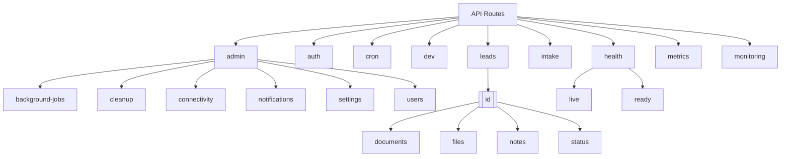

**Diagram sources**
- [src/app/api](file://src/app/api)

**Section sources**
- [src/app/api](file://src/app/api)

## Core Components

The API routes architecture is built around several core components that work together to provide a robust, secure, and maintainable API layer. These components include route handlers, middleware, error handling utilities, and service classes that encapsulate business logic.

The architecture follows a clear separation of concerns:
- **Route Handlers**: Handle HTTP requests and responses, implementing the API contract
- **Middleware**: Manage cross-cutting concerns like authentication, authorization, and rate limiting
- **Error Handling**: Provide consistent error responses and logging
- **Service Layer**: Encapsulate business logic and data operations
- **Monitoring**: Track performance and system health

This separation ensures that route handlers remain focused on request/response processing while delegating complex business logic to dedicated service classes.

**Section sources**
- [src/app/api](file://src/app/api)
- [src/middleware.ts](file://src/middleware.ts)
- [src/lib/errors.ts](file://src/lib/errors.ts)
- [src/lib/monitoring.ts](file://src/lib/monitoring.ts)

## Architecture Overview

The API routes architecture in the fund-track application implements a layered approach that leverages Next.js App Router features while maintaining clean separation between concerns. The architecture follows RESTful principles with well-defined endpoints for resource management.

```mermaid
graph TD
Client[Client Application] --> |HTTP Request| Router[Next.js App Router]
Router --> |Request| Middleware[Middleware Layer]
Middleware --> |Authentication| Auth[Authentication Check]
Middleware --> |Rate Limiting| RateLimit[Rate Limiting]
Middleware --> |Security Headers| Security[Security Headers]
Auth --> |Validated Request| RouteHandler[Route Handler]
RateLimit --> |Validated Request| RouteHandler
Security --> |Enhanced Response| RouteHandler
RouteHandler --> |Business Logic| Service[Service Layer]
Service --> |Data Operations| Database[Prisma ORM]
Database --> |Data| PostgreSQL[(PostgreSQL)]
Service --> |External Services| External[External Services]
External --> |Email| Mailgun[(Mailgun)]
External --> |File Storage| Backblaze[(Backblaze B2)]
RouteHandler --> |Response| Middleware
Middleware --> |Final Response| Client
Logger[(Logging)] < --> |Log Events| All[All Components]
Monitoring[(Monitoring)] < --> |Track Metrics| All
```

**Diagram sources**
- [src/middleware.ts](file://src/middleware.ts)
- [src/app/api](file://src/app/api)
- [src/lib/monitoring.ts](file://src/lib/monitoring.ts)
- [src/services](file://src/services)

## Detailed Component Analysis

### RESTful Endpoints Implementation

The API routes implement RESTful principles for resource management, with clear endpoints for CRUD operations on leads and other entities. The implementation follows consistent patterns for request handling, validation, and response formatting.

```mermaid
classDiagram
class NextRequest {
+url : string
+method : string
+headers : Headers
+body : ReadableStream
}
class NextResponse {
+json(body : any) : NextResponse
+redirect(url : string) : NextResponse
+status : number
+headers : Headers
}
class RouteHandler {
+GET(request : NextRequest) : Promise<NextResponse>
+POST(request : NextRequest) : Promise<NextResponse>
+PUT(request : NextRequest) : Promise<NextResponse>
+DELETE(request : NextRequest) : Promise<NextResponse>
}
class LeadRouteHandler {
-prisma : PrismaClient
-authOptions : AuthOptions
+GET(request : NextRequest) : Promise<NextResponse>
+POST(request : NextRequest) : Promise<NextResponse>
+PUT(request : NextRequest) : Promise<NextResponse>
+DELETE(request : NextRequest) : Promise<NextResponse>
}
class Service {
+execute() : Promise<any>
}
class LeadStatusService {
-statusTransitions : StatusTransitionRule[]
+changeLeadStatus(request : StatusChangeRequest) : Promise<StatusChangeResult>
+getLeadStatusHistory(leadId : number) : Promise<any>
+getAvailableTransitions(currentStatus : LeadStatus) : Array<{status : LeadStatus, description : string}>
}
NextRequest <|-- RouteHandler
NextResponse <|-- RouteHandler
RouteHandler <|-- LeadRouteHandler
Service <|-- LeadStatusService
LeadRouteHandler --> LeadStatusService : "delegates"
LeadRouteHandler --> prisma : "uses"
```

**Diagram sources**
- [src/app/api/leads/route.ts](file://src/app/api/leads/route.ts)
- [src/app/api/leads/[id]/route.ts](file://src/app/api/leads/[id]/route.ts)
- [src/services/LeadStatusService.ts](file://src/services/LeadStatusService.ts)

**Section sources**
- [src/app/api/leads/route.ts](file://src/app/api/leads/route.ts)
- [src/app/api/leads/[id]/route.ts](file://src/app/api/leads/[id]/route.ts)

#### Leads Collection Endpoint Analysis

The `/api/leads` endpoint implements a comprehensive GET handler for retrieving paginated and filtered lead data. This endpoint demonstrates several key patterns in the API architecture:

```mermaid
sequenceDiagram
participant Client as "Client"
participant Route as "Leads Route Handler"
participant Auth as "Authentication"
participant Filter as "Filter Builder"
participant DB as "Prisma/Database"
participant Logger as "Logger"
Client->>Route : GET /api/leads?page=1&limit=10&search=john
Route->>Auth : getServerSession(authOptions)
Auth-->>Route : Session data or null
alt No session
Route-->>Client : 401 Unauthorized
stop
end
Route->>Logger : Log API request
Route->>Filter : Parse query parameters
Filter-->>Route : where clause, orderBy, pagination
Route->>DB : prisma.lead.findMany() with filters
DB-->>Route : Array of leads
Route->>DB : prisma.lead.count() with same filters
DB-->>Route : Total count
Route->>Route : Calculate totalPages, hasNext, hasPrev
Route->>Route : Serialize BigInt values to strings
Route->>Logger : Log successful request with metrics
Route-->>Client : 200 OK with leads and pagination info
```

**Diagram sources**
- [src/app/api/leads/route.ts](file://src/app/api/leads/route.ts)

**Section sources**
- [src/app/api/leads/route.ts](file://src/app/api/leads/route.ts)

### Dynamic Routes with [id] Parameters

The API implements dynamic routing using Next.js App Router's bracket notation for parameterized routes. This allows for RESTful resource access with individual lead identification.

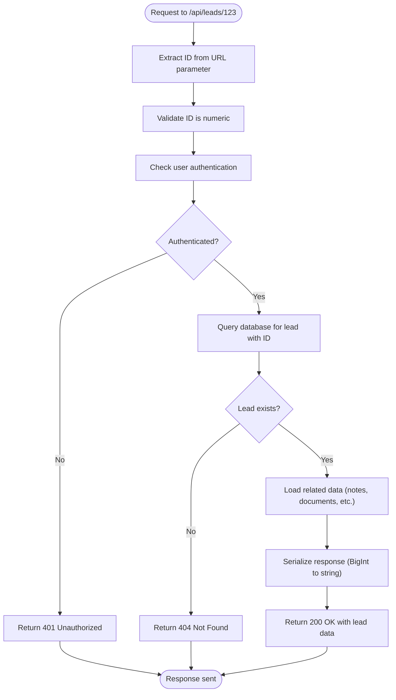

**Diagram sources**
- [src/app/api/leads/[id]/route.ts](file://src/app/api/leads/[id]/route.ts)

**Section sources**
- [src/app/api/leads/[id]/route.ts](file://src/app/api/leads/[id]/route.ts)

#### Individual Lead Route Handler

The individual lead route handler (`/api/leads/[id]/route.ts`) demonstrates the implementation of dynamic routing with comprehensive error handling and data serialization:

```typescript
// Example implementation pattern
export async function GET(request: NextRequest, { params }: RouteParams) {
  try {
    // Check authentication
    const session = await getServerSession(authOptions);
    if (!session) {
      return NextResponse.json({ error: "Unauthorized" }, { status: 401 });
    }

    const { id } = await params;
    const leadId = parseInt(id);
    if (isNaN(leadId)) {
      return NextResponse.json({ error: "Invalid lead ID" }, { status: 400 });
    }

    // Fetch lead with related data
    const lead = await prisma.lead.findUnique({
      where: { id: leadId },
      include: {
        notes: { orderBy: { createdAt: "desc" } },
        documents: { orderBy: { uploadedAt: "desc" } },
        statusHistory: { orderBy: { createdAt: "desc" }, take: 10 },
        _count: { select: { notes: true, documents: true } }
      }
    });

    if (!lead) {
      return NextResponse.json({ error: "Lead not found" }, { status: 404 });
    }

    // Convert BigInt to string for JSON serialization
    const serializedLead = {
      ...lead,
      legacyLeadId: lead.legacyLeadId ? lead.legacyLeadId.toString() : null,
    };

    return NextResponse.json({ lead: serializedLead });
  } catch (error) {
    console.error("Error fetching lead:", error);
    return NextResponse.json(
      { error: "Internal server error" },
      { status: 500 }
    );
  }
}
```

### Nested Route Segments

The API architecture implements nested route segments to organize related functionality under resource endpoints. This creates a logical hierarchy that reflects the domain model.

```mermaid
graph TD
A[/api/leads] --> B[/api/leads/[id]]
B --> C[/api/leads/[id]/status]
B --> D[/api/leads/[id]/notes]
B --> E[/api/leads/[id]/files]
B --> F[/api/leads/[id]/documents/[documentId]/download]
C --> C1[GET: Current status, history, available transitions]
D --> D1[GET: All notes for lead]
D --> D2[POST: Create new note]
E --> E1[GET: All files for lead]
E --> E2[POST: Upload new file]
E --> E3[DELETE: Remove file]
F --> F1[GET: Download document]
```

**Diagram sources**
- [src/app/api/leads/[id]/status/route.ts](file://src/app/api/leads/[id]/status/route.ts)
- [src/app/api/leads/[id]/notes/route.ts](file://src/app/api/leads/[id]/notes/route.ts)
- [src/app/api/leads/[id]/files/route.ts](file://src/app/api/leads/[id]/files/route.ts)

**Section sources**
- [src/app/api/leads/[id]/status/route.ts](file://src/app/api/leads/[id]/status/route.ts)
- [src/app/api/leads/[id]/notes/route.ts](file://src/app/api/leads/[id]/notes/route.ts)
- [src/app/api/leads/[id]/files/route.ts](file://src/app/api/leads/[id]/files/route.ts)

#### Lead Status Management Flow

The nested `/status` endpoint demonstrates how the API routes interact with service classes to manage complex business logic:

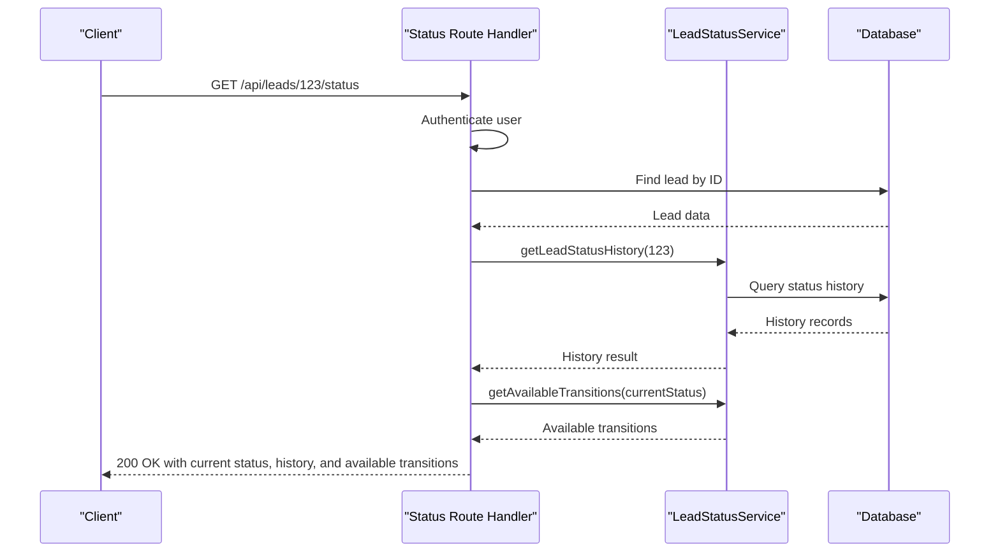

**Diagram sources**
- [src/app/api/leads/[id]/status/route.ts](file://src/app/api/leads/[id]/status/route.ts)
- [src/services/LeadStatusService.ts](file://src/services/LeadStatusService.ts)

### TypeScript for Type-Safe API Development

The API routes leverage TypeScript extensively to ensure type safety throughout the application. This includes type definitions for request parameters, response structures, and service interfaces.

```mermaid
classDiagram
class RouteParams {
+params : Promise<{id : string}>
}
class StatusChangeRequest {
+leadId : number
+newStatus : LeadStatus
+changedBy : number
+reason? : string
}
class StatusChangeResult {
+success : boolean
+lead? : any
+error? : string
+followUpsCancelled? : boolean
+staffNotificationSent? : boolean
}
class ApiErrorResponse {
+error : {
+code : string
+message : string
+details? : Record<string, any>
+timestamp : string
+requestId? : string
}
}
class LeadStatus {
+NEW
+PENDING
+IN_PROGRESS
+COMPLETED
+REJECTED
}
RouteParams <|-- LeadRouteHandler
StatusChangeRequest <|-- LeadStatusService
StatusChangeResult <|-- LeadStatusService
ApiErrorResponse <|-- ErrorHandling
LeadStatus <|-- LeadStatusService
```

**Diagram sources**
- [src/app/api/leads/[id]/route.ts](file://src/app/api/leads/[id]/route.ts)
- [src/services/LeadStatusService.ts](file://src/services/LeadStatusService.ts)
- [src/lib/errors.ts](file://src/lib/errors.ts)

**Section sources**
- [src/lib/errors.ts](file://src/lib/errors.ts)
- [src/services/LeadStatusService.ts](file://src/services/LeadStatusService.ts)

### Error Handling Patterns

The API implements a comprehensive error handling system that provides consistent responses and proper logging across all endpoints.

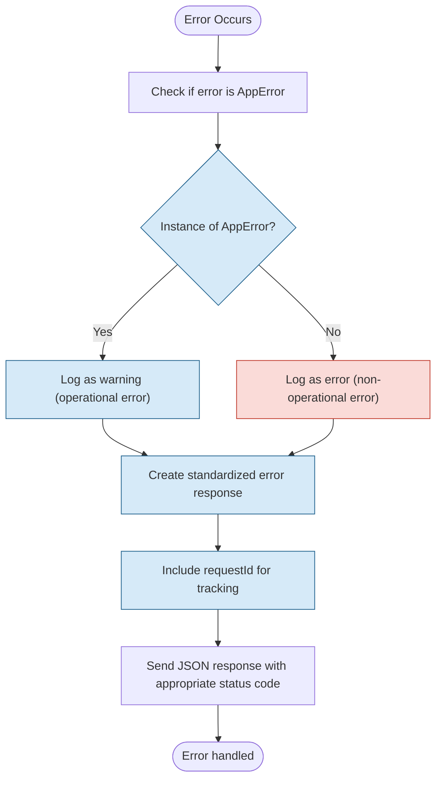

**Diagram sources**
- [src/lib/errors.ts](file://src/lib/errors.ts)

**Section sources**
- [src/lib/errors.ts](file://src/lib/errors.ts)

#### Error Handling Implementation

The error handling system is implemented through a combination of custom error classes and middleware functions:

```typescript
// Base error class
export abstract class AppError extends Error {
  abstract readonly statusCode: number;
  abstract readonly code: string;
  abstract readonly isOperational: boolean;
}

// Specific error types
export class ValidationError extends AppError {
  readonly statusCode = 400;
  readonly code = 'VALIDATION_ERROR';
  readonly isOperational = true;
}

export class AuthenticationError extends AppError {
  readonly statusCode = 401;
  readonly code = 'AUTHENTICATION_ERROR';
  readonly isOperational = true;
}

// Error handling middleware
export function withErrorHandler<T extends any[], R>(
  handler: (...args: T) => Promise<R>
) {
  return async (...args: T): Promise<R | NextResponse<ApiErrorResponse>> => {
    try {
      return await handler(...args);
    } catch (error) {
      const requestId = Math.random().toString(36).substring(2, 15);
      
      if (error instanceof AppError) {
        return createErrorResponse(error, requestId);
      }
      
      // Handle unexpected errors
      return createErrorResponse(
        new InternalServerError('An unexpected error occurred'),
        requestId
      );
    }
  };
}
```

### Middleware Integration

The API routes integrate with Next.js middleware for authentication, authorization, rate limiting, and security header management.

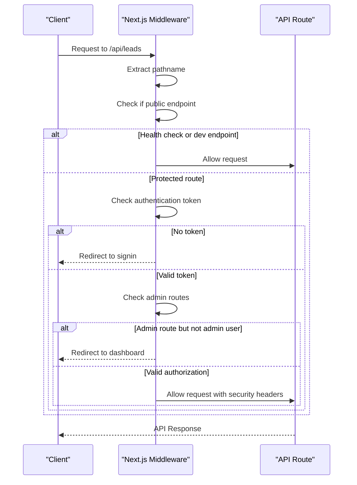

**Diagram sources**
- [src/middleware.ts](file://src/middleware.ts)

**Section sources**
- [src/middleware.ts](file://src/middleware.ts)

#### Authentication and Authorization Flow

The middleware implements a comprehensive authentication and authorization system:

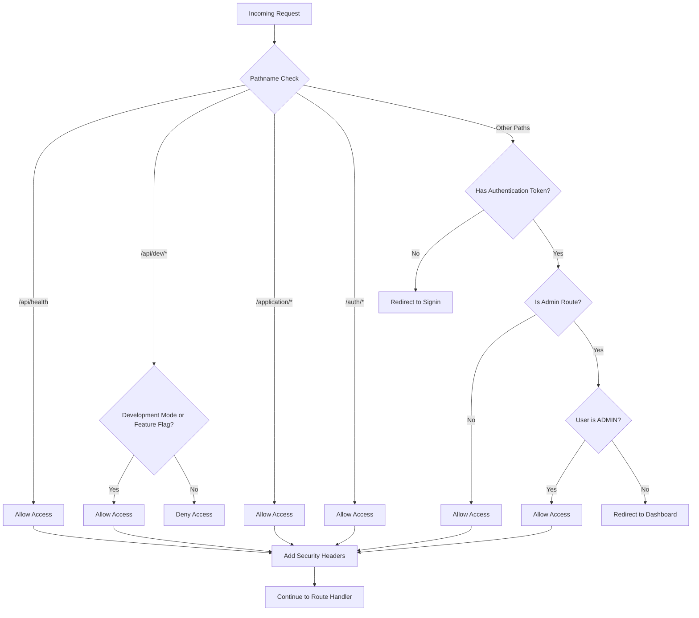

**Diagram sources**
- [src/middleware.ts](file://src/middleware.ts)

### Common Response Patterns

The API follows consistent patterns for responses across all endpoints, ensuring predictability for clients.

```mermaid
classDiagram
class SuccessResponse {
+data : any
+message? : string
+pagination? : {
+page : number
+limit : number
+totalCount : number
+totalPages : number
+hasNext : boolean
+hasPrev : boolean
}
}
class ErrorResponse {
+error : {
+code : string
+message : string
+details? : Record<string, any>
+timestamp : string
+requestId? : string
}
}
class LeadResponse {
+lead : Lead
+pagination? : Pagination
}
class LeadsResponse {
+leads : Lead[]
+pagination : Pagination
}
class StatusResponse {
+currentStatus : LeadStatus
+history : StatusHistory[]
+availableTransitions : Transition[]
}
SuccessResponse <|-- LeadResponse
SuccessResponse <|-- LeadsResponse
SuccessResponse <|-- StatusResponse
ErrorResponse <|-- AllErrorResponses
```

**Diagram sources**
- [src/app/api/leads/route.ts](file://src/app/api/leads/route.ts)
- [src/app/api/leads/[id]/route.ts](file://src/app/api/leads/[id]/route.ts)
- [src/lib/errors.ts](file://src/lib/errors.ts)

**Section sources**
- [src/app/api/leads/route.ts](file://src/app/api/leads/route.ts)
- [src/lib/errors.ts](file://src/lib/errors.ts)

#### Status Codes and JSON Serialization

The API uses standard HTTP status codes and handles JSON serialization challenges:

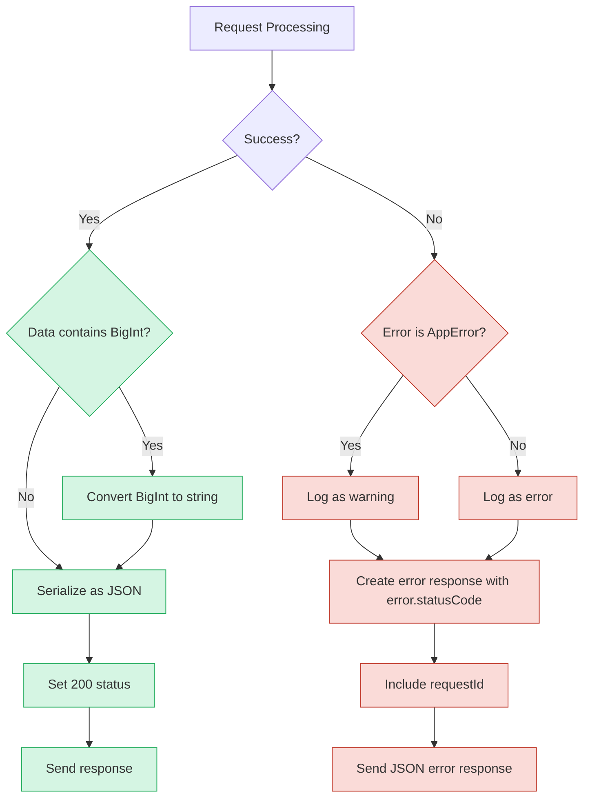

**Diagram sources**
- [src/app/api/leads/route.ts](file://src/app/api/leads/route.ts)
- [src/lib/errors.ts](file://src/lib/errors.ts)

### Route Organization Best Practices

The API routes follow several best practices for organization and maintainability:

```mermaid
graph TD
A[Route Organization Principles] --> B[Feature-Based Grouping]
A --> C[Consistent Naming]
A --> D[Separation of Concerns]
A --> E[Error Handling Consistency]
A --> F[Type Safety]
A --> G[Documentation]
B --> B1[Group related endpoints together]
B --> B2[Use descriptive directory names]
B --> B3[Nest related resources]
C --> C1[Use RESTful conventions]
C --> C2[Consistent parameter naming]
C --> C3[Standardized response formats]
D --> D1[Route handlers handle HTTP concerns]
D --> D2[Service classes handle business logic]
D --> D3[Utilities handle cross-cutting concerns]
E --> E1[Use standardized error classes]
E --> E2[Consistent error response format]
E --> E3[Comprehensive logging]
F --> F1[Use TypeScript interfaces]
F --> F2[Type-safe database operations]
F --> F3[Validate input types]
G --> G1[Inline code documentation]
G --> G2[Clear function names]
G --> G3[Comment complex logic]
```

**Section sources**
- [src/app/api](file://src/app/api)

### Error Logging and Monitoring

The API implements comprehensive error logging and performance monitoring to ensure reliability and aid in troubleshooting.

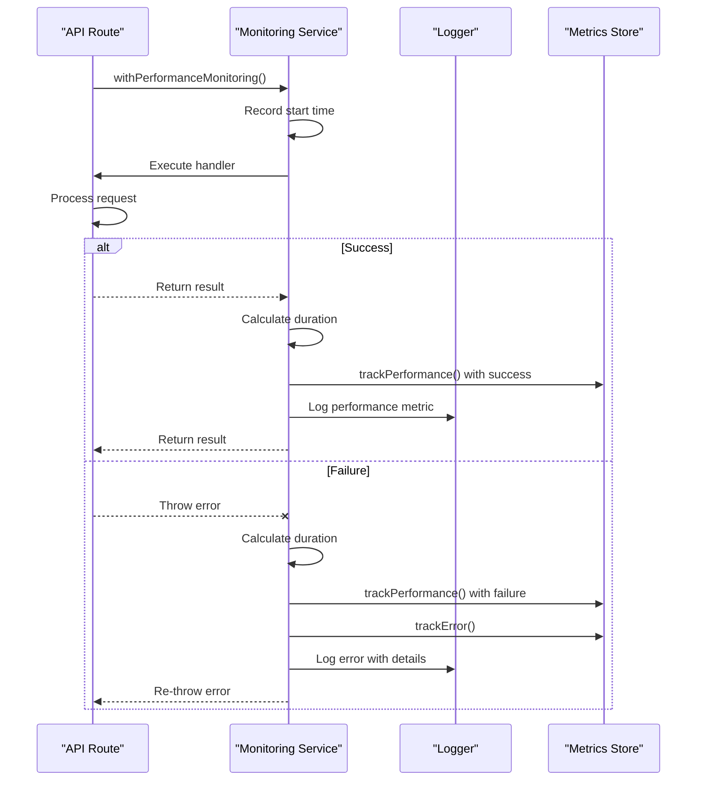

**Diagram sources**
- [src/lib/monitoring.ts](file://src/lib/monitoring.ts)

**Section sources**
- [src/lib/monitoring.ts](file://src/lib/monitoring.ts)

### Performance Monitoring

The performance monitoring system tracks key metrics for API endpoints to identify performance issues and optimize critical paths.

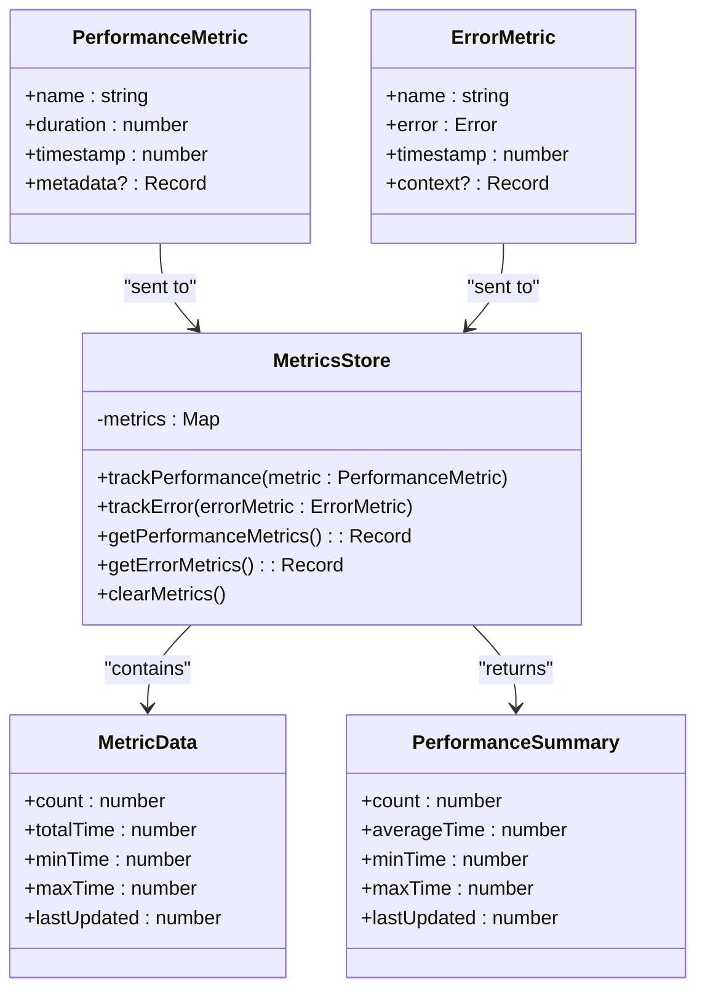

**Diagram sources**
- [src/lib/monitoring.ts](file://src/lib/monitoring.ts)

**Section sources**
- [src/lib/monitoring.ts](file://src/lib/monitoring.ts)

## Dependency Analysis

The API routes have well-defined dependencies that follow the dependency inversion principle, with higher-level modules depending on abstractions rather than concrete implementations.

```mermaid
graph TD
A[API Route Handlers] --> B[Next.js Runtime]
A --> C[Prisma ORM]
A --> D[Authentication]
A --> E[Service Layer]
A --> F[Error Handling]
A --> G[Monitoring]
B --> H[NextRequest]
B --> I[NextResponse]
C --> J[PostgreSQL Database]
D --> K[NextAuth]
E --> L[Business Logic Services]
E --> M[External Services]
F --> N[Error Classes]
F --> O[Logger]
G --> P[Performance Tracking]
G --> Q[Error Tracking]
style A fill:#3498DB,stroke:#2980B9
style B fill:#2ECC71,stroke:#27AE60
style C fill:#9B59B6,stroke:#8E44AD
style D fill:#F39C12,stroke:#D35400
style E fill:#1ABC9C,stroke:#16A085
style F fill:#E74C3C,stroke:#C0392B
style G fill:#34495E,stroke:#2C3E50
```

**Diagram sources**
- [package.json](file://package.json)
- [src/app/api](file://src/app/api)

**Section sources**
- [src/app/api](file://src/app/api)

## Performance Considerations

The API architecture incorporates several performance considerations to ensure responsiveness and scalability:

1. **Caching Strategy**: While not explicitly implemented in the provided code, the architecture allows for caching at multiple levels:
   - HTTP caching headers
   - Database query caching
   - In-memory caching of frequently accessed data

2. **Database Optimization**: The use of Prisma ORM with proper indexing and query optimization:
   - Efficient pagination with skip/take
   - Selective field loading with `include` and `select`
   - Batch operations where appropriate

3. **Rate Limiting**: Implemented at the middleware level to prevent abuse:
   - Configurable window and limit
   - IP-based tracking
   - Proper HTTP 429 responses with retry information

4. **Connection Management**: Proper handling of database connections and external service calls:
   - Use of connection pooling
   - Timeout handling
   - Retry mechanisms for transient failures

5. **Memory Management**: Considerations for large payloads:
   - Stream processing for file uploads
   - Pagination for large result sets
   - Proper cleanup of resources

These performance considerations ensure that the API can handle expected loads while maintaining responsiveness and reliability.

## Troubleshooting Guide

When troubleshooting issues with the API routes, consider the following common problems and their solutions:

**Authentication Issues**
- **Symptom**: 401 Unauthorized responses
- **Check**: Session validity, authentication token, route protection rules
- **Solution**: Verify user is signed in, check middleware configuration

**Database Connection Problems**
- **Symptom**: 500 Internal Server Error, timeouts
- **Check**: DATABASE_URL environment variable, database server status, connection limits
- **Solution**: Verify connection string, check database server, implement retry logic

**Rate Limiting**
- **Symptom**: 429 Too Many Requests
- **Check**: Rate limiting configuration, client request patterns
- **Solution**: Adjust rate limit settings, implement client-side throttling

**File Upload Issues**
- **Symptom**: 400 Bad Request for file uploads
- **Check**: File size, type restrictions, storage service connectivity
- **Solution**: Verify file meets requirements, check Backblaze B2 credentials

**Serialization Problems**
- **Symptom**: 500 Internal Server Error with BigInt values
- **Check**: Proper conversion of BigInt to strings before JSON serialization
- **Solution**: Ensure all BigInt fields are converted to strings

**Service Dependencies**
- **Symptom**: Intermittent failures in specific functionality
- **Check**: External service availability (email, file storage)
- **Solution**: Implement proper error handling and fallbacks

**Section sources**
- [src/middleware.ts](file://src/middleware.ts)
- [src/lib/errors.ts](file://src/lib/errors.ts)
- [src/lib/monitoring.ts](file://src/lib/monitoring.ts)

## Conclusion

The API routes architecture in the fund-track application demonstrates a well-structured, maintainable approach to building RESTful APIs with Next.js App Router. The architecture successfully implements several best practices:

1. **Clear Separation of Concerns**: Route handlers focus on HTTP concerns while delegating business logic to service classes.

2. **Consistent Error Handling**: A standardized error system provides predictable responses and comprehensive logging.

3. **Robust Security**: Middleware handles authentication, authorization, and rate limiting across all endpoints.

4. **Type Safety**: Extensive use of TypeScript ensures type safety throughout the API layer.

5. **Comprehensive Monitoring**: Performance and error tracking enable proactive issue detection and resolution.

6. **RESTful Design**: The API follows REST principles with logical resource organization and proper HTTP semantics.

7. **Scalable Structure**: The file-based routing system with nested segments allows for organized growth as new features are added.

The architecture balances developer productivity with production readiness, providing a solid foundation for the application's API layer. By following these patterns, the team can maintain consistency across endpoints while ensuring reliability, security, and performance.