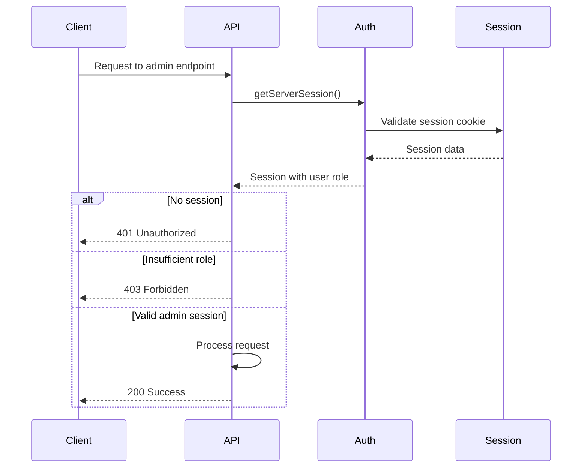
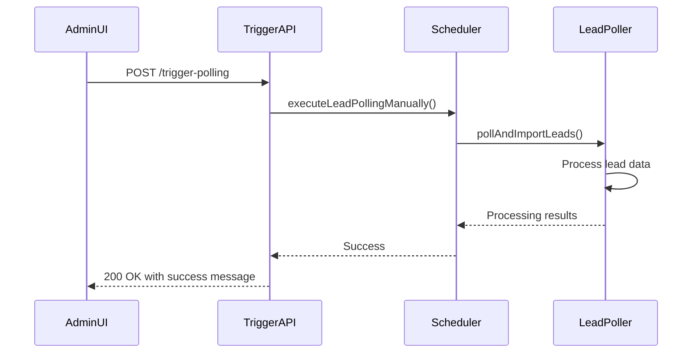
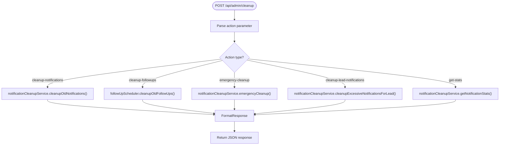
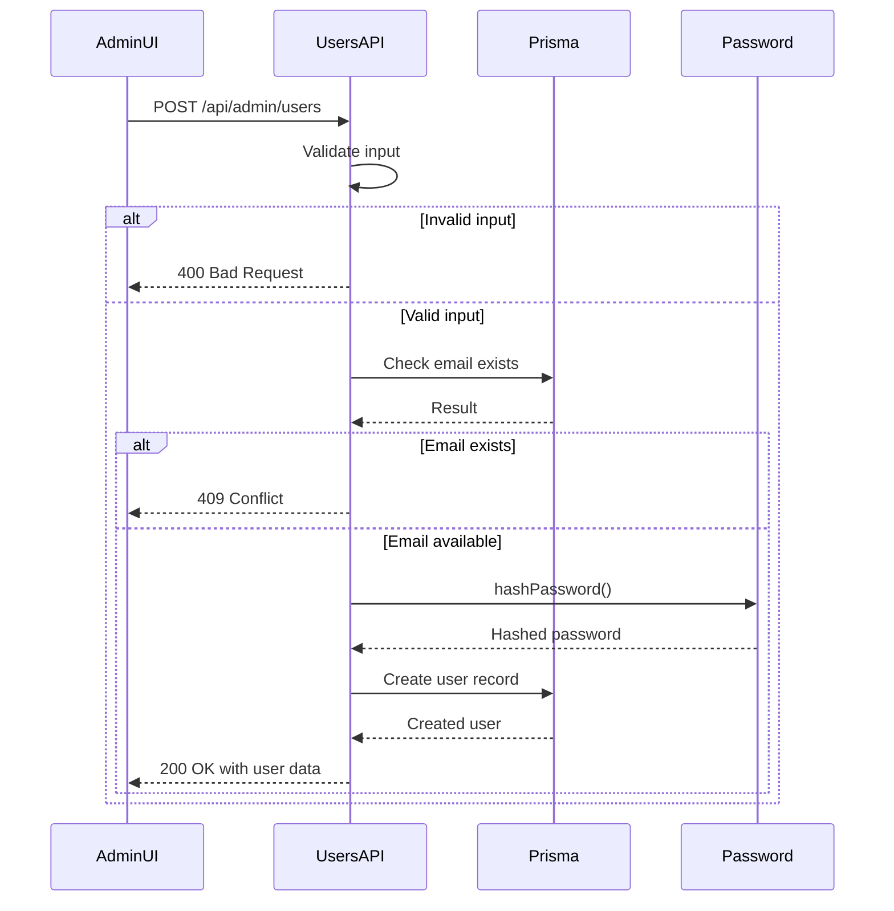
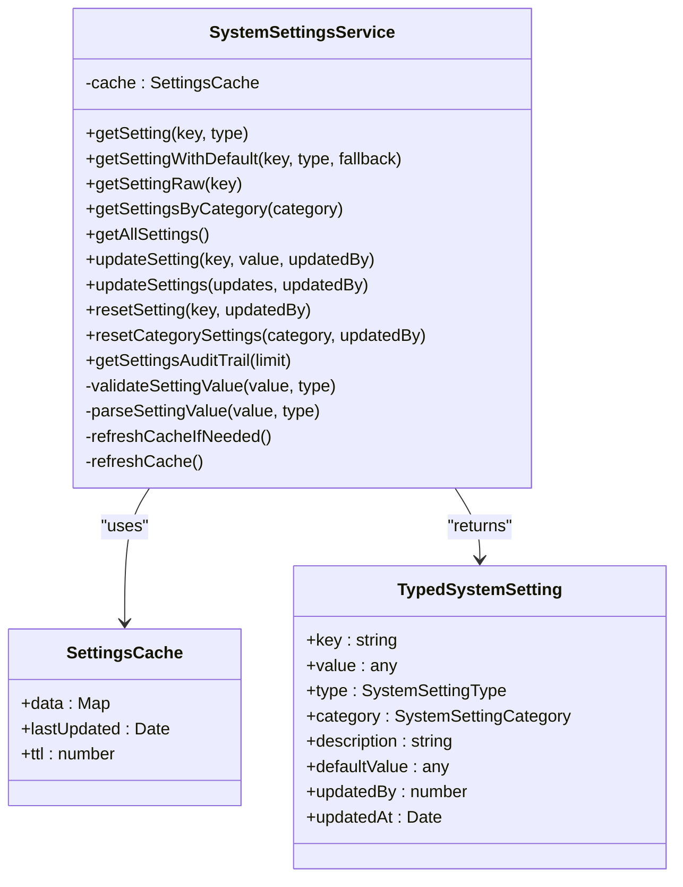
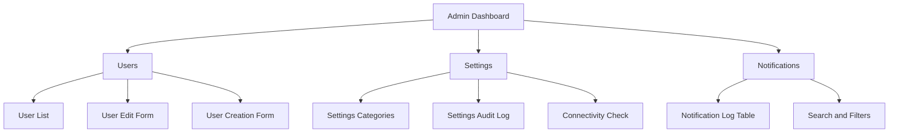

# Admin API Endpoints

<cite>
**Referenced Files in This Document**   
- [route.ts](file://src/app/api/admin/background-jobs/status/route.ts)
- [route.ts](file://src/app/api/admin/background-jobs/trigger-polling/route.ts)
- [route.ts](file://src/app/api/admin/cleanup/route.ts)
- [route.ts](file://src/app/api/admin/connectivity/legacy-db/route.ts)
- [route.ts](file://src/app/api/admin/notifications/route.ts)
- [route.ts](file://src/app/api/admin/settings/route.ts)
- [route.ts](file://src/app/api/admin/settings/[key]/route.ts)
- [route.ts](file://src/app/api/admin/settings/audit/route.ts)
- [route.ts](file://src/app/api/admin/users/route.ts)
- [BackgroundJobScheduler.ts](file://src/services/BackgroundJobScheduler.ts)
- [NotificationCleanupService.ts](file://src/services/NotificationCleanupService.ts)
- [SystemSettingsService.ts](file://src/services/SystemSettingsService.ts)
- [page.tsx](file://src/app/admin/page.tsx)
- [page.tsx](file://src/app/admin/settings/page.tsx)
- [page.tsx](file://src/app/admin/notifications/page.tsx)
- [page.tsx](file://src/app/admin/users/page.tsx)
</cite>

## Table of Contents
1. [Introduction](#introduction)
2. [Authentication and Access Control](#authentication-and-access-control)
3. [Background Job Management](#background-job-management)
4. [System Cleanup Operations](#system-cleanup-operations)
5. [Legacy Database Connectivity Testing](#legacy-database-connectivity-testing)
6. [Notification Log Access](#notification-log-access)
7. [User Management](#user-management)
8. [System Settings CRUD Operations](#system-settings-crud-operations)
9. [Relationship to Admin UI Components](#relationship-to-admin-ui-components)

## Introduction
This document provides comprehensive documentation for all administrative API endpoints in the fund-track application. These endpoints enable system administrators to monitor and manage background processes, perform system maintenance, test external connectivity, view notification logs, manage users, and configure system settings. All endpoints require administrative authentication and are designed to support both automated operations and manual administrative tasks through the admin interface.

## Authentication and Access Control
All admin endpoints enforce role-based access control requiring the ADMIN role. Authentication is handled through NextAuth.js session management. Unauthorized requests return 401 status codes, while authenticated users without proper permissions receive 403 status codes.



**Diagram sources**
- [authOptions](file://src/lib/auth.ts#L1-L50)
- [route.ts](file://src/app/api/admin/background-jobs/status/route.ts#L1-L47)

## Background Job Management
The background job management endpoints provide monitoring and manual control over scheduled system processes including lead polling and follow-up processing.

### Status Check Endpoint
Retrieves the current status of background job schedulers.

**Endpoint**: `GET /api/admin/background-jobs/status`  
**Authentication**: Required (ADMIN role)  
**Rate Limiting**: Standard API limits apply

**Response Schema**:
```json
{
  "success": true,
  "scheduler": {
    "isRunning": true,
    "leadPollingPattern": "*/15 * * * *",
    "followUpPattern": "*/5 * * * *",
    "nextLeadPolling": "2025-08-26T14:45:00Z",
    "nextFollowUp": "2025-08-26T14:35:00Z"
  },
  "environment": {
    "nodeEnv": "production",
    "enableBackgroundJobs": "true",
    "leadPollingPattern": "*/15 * * * *",
    "followUpPattern": "*/5 * * * *",
    "campaignIds": "123,456",
    "batchSize": "100",
    "timezone": "America/New_York"
  },
  "timestamp": "2025-08-26T14:30:00Z"
}
```

**Error Responses**:
- `500 Internal Server Error`: { "success": false, "error": "Error message" }

### Polling Trigger Endpoint
Manually triggers the lead polling process outside of the scheduled cron jobs.

**Endpoint**: `POST /api/admin/background-jobs/trigger-polling`  
**Authentication**: Required (ADMIN role)  
**Rate Limiting**: Limited to prevent abuse (5 requests per hour)

**Request Body**: None (empty POST body)

**Success Response**:
```json
{
  "success": true,
  "message": "Lead polling executed successfully",
  "timestamp": "2025-08-26T14:30:00Z",
  "triggeredBy": "admin@fund-track.com"
}
```

**Error Responses**:
- `500 Internal Server Error`: { "success": false, "error": "Error message", "message": "Failed to execute lead polling" }



**Diagram sources**
- [route.ts](file://src/app/api/admin/background-jobs/trigger-polling/route.ts#L1-L39)
- [BackgroundJobScheduler.ts](file://src/services/BackgroundJobScheduler.ts#L1-L463)

**Section sources**
- [route.ts](file://src/app/api/admin/background-jobs/trigger-polling/route.ts#L1-L39)
- [BackgroundJobScheduler.ts](file://src/services/BackgroundJobScheduler.ts#L1-L463)

## System Cleanup Operations
The cleanup endpoint provides various maintenance operations for managing system data and preventing database bloat.

### Cleanup Endpoint
Performs various cleanup operations based on the action parameter.

**Endpoint**: `POST /api/admin/cleanup`  
**Authentication**: Required (ADMIN role)  
**Rate Limiting**: Strict limits (1 request per 5 minutes)

**Request Body**:
```json
{
  "action": "cleanup-notifications",
  "daysToKeep": 30
}
```

**Supported Actions**:

| Action | Parameters | Description |
|-------|-----------|-------------|
| `cleanup-notifications` | `daysToKeep` (number, default: 30) | Removes notification logs older than specified days |
| `cleanup-followups` | `daysToKeep` (number, default: 30) | Removes follow-up records older than specified days |
| `emergency-cleanup` | None | Removes all notifications older than 7 days |
| `cleanup-lead-notifications` | `leadId` (required), `maxToKeep` (number, default: 10) | Removes excess notifications for a specific lead |
| `get-stats` | None | Retrieves notification statistics |

**Success Responses**:
- `cleanup-notifications`: { "message": "Cleaned up notifications older than 30 days", "deletedCount": 150, "success": true }
- `get-stats`: { "message": "Notification statistics retrieved", "stats": { "total": 1250, "byStatus": { "SENT": 1100, "FAILED": 150 }, "byType": { "EMAIL": 800, "SMS": 450 } } }

**Error Responses**:
- `400 Bad Request`: Invalid action or missing required parameters
- `500 Internal Server Error`: Cleanup operation failed

**Endpoint**: `GET /api/admin/cleanup`  
Retrieves available cleanup actions and current notification statistics.

**Response Schema**:
```json
{
  "message": "Notification statistics",
  "stats": {
    "total": 1250,
    "byStatus": {
      "SENT": 1100,
      "FAILED": 150
    },
    "byType": {
      "EMAIL": 800,
      "SMS": 450
    }
  },
  "actions": [
    {
      "action": "cleanup-notifications",
      "description": "Clean up old notification logs",
      "parameters": { "daysToKeep": "number (default: 30)" }
    }
  ]
}
```



**Diagram sources**
- [route.ts](file://src/app/api/admin/cleanup/route.ts#L1-L144)
- [NotificationCleanupService.ts](file://src/services/NotificationCleanupService.ts#L1-L200)

**Section sources**
- [route.ts](file://src/app/api/admin/cleanup/route.ts#L1-L144)

## Legacy Database Connectivity Testing
Tests connectivity to the external legacy database system used for lead data integration.

**Endpoint**: `GET /api/admin/connectivity/legacy-db`  
**Authentication**: Required (ADMIN role)  
**Rate Limiting**: Limited to prevent excessive testing (10 requests per hour)

**Success Response**:
```json
{
  "connected": true,
  "message": "Successfully connected to legacy database",
  "databaseInfo": {
    "serverVersion": "15.0.4073.23",
    "databaseName": "MerchantLeads",
    "schemaVersion": "2.1.0",
    "tableCount": 15
  },
  "testTimestamp": "2025-08-26T14:30:00Z",
  "responseTimeMs": 45
}
```

**Error Response**:
```json
{
  "connected": false,
  "message": "Connection failed: Login timeout expired",
  "errorDetails": "Failed to establish connection to 192.168.1.100:1433",
  "testTimestamp": "2025-08-26T14:30:00Z"
}
```

This endpoint uses the `legacy-db.ts` service to establish a connection and execute a simple query to verify connectivity and authentication.

**Section sources**
- [route.ts](file://src/app/api/admin/connectivity/legacy-db/route.ts#L1-L35)
- [lib/legacy-db.ts](file://src/lib/legacy-db.ts#L1-L150)

## Notification Log Access
Provides access to the system's notification delivery history for monitoring and troubleshooting.

**Endpoint**: `GET /api/admin/notifications`  
**Authentication**: Required (ADMIN role)  
**Rate Limiting**: Standard API limits apply

**Query Parameters**:
- `limit`: Number of records to return (1-100, default: 25)
- `cursor`: Pagination cursor for next page
- `search`: Text search across recipient, subject, and content fields

**Response Schema**:
```json
{
  "logs": [
    {
      "id": 12345,
      "type": "EMAIL",
      "recipient": "merchant@example.com",
      "subject": "Complete Your Merchant Funding Application",
      "status": "SENT",
      "createdAt": "2025-08-26T14:25:30Z",
      "errorMessage": null
    }
  ],
  "hasMore": true,
  "nextCursor": "12345",
  "total": 1250
}
```

The endpoint supports cursor-based pagination for efficient navigation through large datasets and includes search functionality to help administrators find specific notification records.

**Section sources**
- [route.ts](file://src/app/api/admin/notifications/route.ts#L1-L45)
- [page.tsx](file://src/app/admin/notifications/page.tsx#L1-L297)

## User Management
CRUD operations for managing application users with role-based access control.

### List Users
**Endpoint**: `GET /api/admin/users`  
**Query Parameters**:
- `page`: Page number (default: 1)
- `limit`: Records per page (1-100, default: 25)
- `search`: Email search filter

**Response Schema**:
```json
{
  "users": [
    {
      "id": 1,
      "email": "admin@fund-track.com",
      "role": "ADMIN",
      "createdAt": "2025-01-15T10:30:00Z",
      "updatedAt": "2025-08-20T09:15:00Z"
    }
  ],
  "total": 25,
  "page": 1,
  "limit": 25
}
```

### Create User
**Endpoint**: `POST /api/admin/users`  
**Request Body**:
```json
{
  "email": "newuser@fund-track.com",
  "role": "USER",
  "password": "securepassword123"
}
```
**Validation**: Email format, password minimum 8 characters, unique email

### Update User
**Endpoint**: `PUT /api/admin/users`  
**Request Body**:
```json
{
  "id": 5,
  "email": "updated@fund-track.com",
  "role": "ADMIN",
  "newPassword": "newsecurepassword"
}
```

### Delete User
**Endpoint**: `DELETE /api/admin/users`  
**Request Body**:
```json
{
  "id": 5
}
```
**Restriction**: Users cannot delete their own accounts

**Error Handling**: Comprehensive validation with appropriate HTTP status codes (400 for validation, 403 for authorization, 409 for conflicts, 500 for server errors)



**Diagram sources**
- [route.ts](file://src/app/api/admin/users/route.ts#L1-L226)
- [lib/password.ts](file://src/lib/password.ts#L1-L30)

**Section sources**
- [route.ts](file://src/app/api/admin/users/route.ts#L1-L226)

## System Settings CRUD Operations
Endpoints for managing system configuration settings with audit logging.

### List All Settings
**Endpoint**: `GET /api/admin/settings`  
**Response Schema**:
```json
{
  "settings": [
    {
      "key": "email_notifications_enabled",
      "value": "true",
      "type": "BOOLEAN",
      "category": "NOTIFICATIONS",
      "description": "Enable email notifications for new leads",
      "defaultValue": "true",
      "updatedAt": "2025-08-20T10:30:00Z",
      "updatedBy": 1
    }
  ]
}
```

### Update Setting
**Endpoint**: `PUT /api/admin/settings/{key}`  
**Request Body**:
```json
{
  "value": "false"
}
```
**Validation**: Value format matches setting type (boolean, number, string, json)

### Reset Setting
**Endpoint**: `POST /api/admin/settings/{key}`  
**Request Body**:
```json
{
  "action": "reset"
}
```
Resets the setting to its default value.

### Get Settings Audit Trail
**Endpoint**: `GET /api/admin/settings/audit`  
**Query Parameters**: `limit` (default: 50)  
**Response Schema**:
```json
[
  {
    "key": "email_notifications_enabled",
    "value": "false",
    "updatedAt": "2025-08-20T10:30:00Z",
    "updatedBy": 1,
    "user": {
      "id": 1,
      "email": "admin@fund-track.com"
    }
  }
]
```

The SystemSettingsService implements caching with a 5-minute TTL to reduce database load while ensuring settings changes propagate quickly across the application.



**Diagram sources**
- [SystemSettingsService.ts](file://src/services/SystemSettingsService.ts#L1-L352)
- [prisma/schema.prisma](file://prisma/schema.prisma#L100-L120)

**Section sources**
- [SystemSettingsService.ts](file://src/services/SystemSettingsService.ts#L1-L352)
- [route.ts](file://src/app/api/admin/settings/route.ts#L1-L85)
- [route.ts](file://src/app/api/admin/settings/[key]/route.ts#L1-L65)
- [route.ts](file://src/app/api/admin/settings/audit/route.ts#L1-L25)

## Relationship to Admin UI Components
The admin API endpoints are directly integrated with the React-based admin interface components, providing a seamless administrative experience.

### Admin Dashboard Navigation
The main admin dashboard (`/admin`) provides navigation to all administrative sections. The UI conditionally renders links based on the user's admin role.



**Section sources**
- [page.tsx](file://src/app/admin/page.tsx#L1-L110)

### Settings Management Interface
The settings UI component (`/admin/settings`) directly consumes the settings API endpoints, providing a user-friendly interface for configuration management.

- **GET /api/admin/settings**: Loads all settings on component mount
- **PUT /api/admin/settings/{key}**: Updates setting value when user modifies input
- **POST /api/admin/settings/{key}**: Resets setting to default when reset button clicked
- **GET /api/admin/settings/audit**: Displays audit trail when requested

The UI organizes settings by category (Notifications, Connectivity) and includes real-time feedback for operations.

### Notifications Interface
The notification logs UI (`/admin/notifications`) provides a paginated, searchable view of notification history using the notifications API endpoint with cursor-based pagination for optimal performance with large datasets.

### User Management Interface
The user management UI (`/admin/users`) implements a complete CRUD interface with:
- Server-side pagination and search
- Inline editing with form validation
- Confirmation dialogs for destructive operations
- Real-time feedback for all operations

All UI components implement proper error handling and loading states to provide a responsive user experience.

**Section sources**
- [page.tsx](file://src/app/admin/settings/page.tsx#L1-L264)
- [page.tsx](file://src/app/admin/notifications/page.tsx#L1-L297)
- [page.tsx](file://src/app/admin/users/page.tsx#L1-L492)