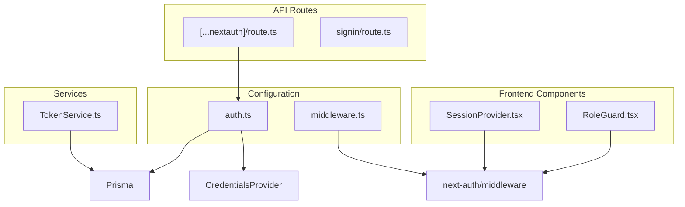
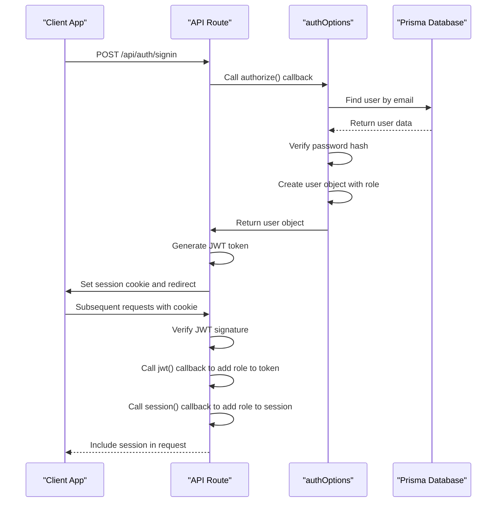
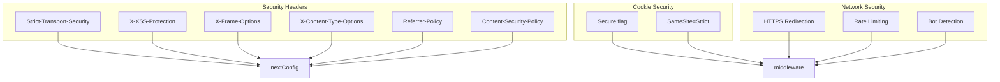
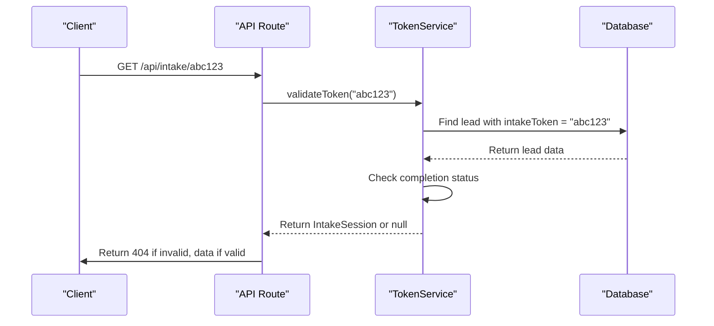

# Authentication System

<cite>
**Referenced Files in This Document**   
- [src/app/api/auth/[...nextauth]/route.ts](file://src/app/api/auth/[...nextauth]/route.ts)
- [src/lib/auth.ts](file://src/lib/auth.ts)
- [src/components/auth/RoleGuard.tsx](file://src/components/auth/RoleGuard.tsx)
- [src/components/auth/SessionProvider.tsx](file://src/components/auth/SessionProvider.tsx)
- [src/middleware.ts](file://src/middleware.ts)
- [src/services/TokenService.ts](file://src/services/TokenService.ts)
- [next.config.mjs](file://next.config.mjs)
</cite>

## Table of Contents
1. [Introduction](#introduction)
2. [Project Structure](#project-structure)
3. [Core Components](#core-components)
4. [Authentication Configuration](#authentication-configuration)
5. [Session Management and JWT Handling](#session-management-and-jwt-handling)
6. [Role-Based Access Control](#role-based-access-control)
7. [Route Protection and Authorization](#route-protection-and-authorization)
8. [Security Configuration](#security-configuration)
9. [Token Handling and Expiration](#token-handling-and-expiration)
10. [Integration and Usage Patterns](#integration-and-usage-patterns)
11. [Troubleshooting Guide](#troubleshooting-guide)

## Introduction
The authentication system in the fund-track application is built on NextAuth.js, providing a secure and flexible solution for user authentication and authorization. This documentation details the implementation of the authentication system, including the configuration of authentication providers, session management, role-based access control, and security measures. The system supports both API routes and frontend components, ensuring consistent authentication across the application.

## Project Structure
The authentication system is organized within the Next.js App Router structure, with key components located in specific directories:

- **API Routes**: Authentication endpoints are defined in `src/app/api/auth/`
- **Configuration**: Authentication options are centralized in `src/lib/auth.ts`
- **Components**: Frontend authentication components are located in `src/components/auth/`
- **Middleware**: Route protection logic is implemented in `src/middleware.ts`
- **Services**: Token management is handled by `src/services/TokenService.ts`



**Diagram sources**
- [src/app/api/auth/[...nextauth]/route.ts](file://src/app/api/auth/[...nextauth]/route.ts)
- [src/lib/auth.ts](file://src/lib/auth.ts)
- [src/components/auth/RoleGuard.tsx](file://src/components/auth/RoleGuard.tsx)
- [src/components/auth/SessionProvider.tsx](file://src/components/auth/SessionProvider.tsx)
- [src/middleware.ts](file://src/middleware.ts)
- [src/services/TokenService.ts](file://src/services/TokenService.ts)

**Section sources**
- [src/app/api/auth/[...nextauth]/route.ts](file://src/app/api/auth/[...nextauth]/route.ts)
- [src/lib/auth.ts](file://src/lib/auth.ts)
- [src/components/auth/RoleGuard.tsx](file://src/components/auth/RoleGuard.tsx)
- [src/components/auth/SessionProvider.tsx](file://src/components/auth/SessionProvider.tsx)
- [src/middleware.ts](file://src/middleware.ts)

## Core Components
The authentication system consists of several core components that work together to provide secure user authentication and authorization:

- **NextAuth API Route**: The entry point for authentication requests
- **Authentication Configuration**: Centralized configuration for providers and callbacks
- **Session Provider**: Context provider for session state in the frontend
- **Role Guard**: Component for role-based access control
- **Middleware**: Server-side route protection
- **Token Service**: Service for managing temporary tokens

These components form a cohesive system that handles user authentication, session management, and access control throughout the application.

**Section sources**
- [src/app/api/auth/[...nextauth]/route.ts](file://src/app/api/auth/[...nextauth]/route.ts)
- [src/lib/auth.ts](file://src/lib/auth.ts)
- [src/components/auth/RoleGuard.tsx](file://src/components/auth/RoleGuard.tsx)
- [src/components/auth/SessionProvider.tsx](file://src/components/auth/SessionProvider.tsx)
- [src/middleware.ts](file://src/middleware.ts)
- [src/services/TokenService.ts](file://src/services/TokenService.ts)

## Authentication Configuration
The authentication system is configured using NextAuth.js with a credentials provider for email/password authentication. The configuration is centralized in the `authOptions` object in `src/lib/auth.ts`.

```typescript
import { NextAuthOptions } from "next-auth"
import CredentialsProvider from "next-auth/providers/credentials"
import { PrismaAdapter } from "@next-auth/prisma-adapter"
import { prisma } from "@/lib/prisma"
import bcrypt from "bcrypt"
import { UserRole } from "@prisma/client"

export const authOptions: NextAuthOptions = {
  adapter: PrismaAdapter(prisma),
  providers: [
    CredentialsProvider({
      name: "credentials",
      credentials: {
        email: { label: "Email", type: "email" },
        password: { label: "Password", type: "password" }
      },
      async authorize(credentials) {
        if (!credentials?.email || !credentials?.password) {
          return null
        }

        const user = await prisma.user.findUnique({
          where: {
            email: credentials.email
          }
        })

        if (!user) {
          return null
        }

        const isPasswordValid = await bcrypt.compare(
          credentials.password,
          user.passwordHash
        )

        if (!isPasswordValid) {
          return null
        }

        return {
          id: user.id.toString(),
          email: user.email,
          role: user.role,
        }
      }
    })
  ],
  session: {
    strategy: "jwt",
  },
  callbacks: {
    async jwt({ token, user }) {
      if (user) {
        token.id = user.id
        token.role = user.role
      }
      return token
    },
    async session({ session, token }) {
      if (token) {
        session.user.id = token.id as string
        session.user.role = token.role as UserRole
      }
      return session
    },
  },
  pages: {
    signIn: "/auth/signin",
  },
}
```

The configuration includes:

- **Prisma Adapter**: Integrates with the Prisma ORM for user data storage
- **Credentials Provider**: Implements email/password authentication
- **JWT Session Strategy**: Uses JSON Web Tokens for session management
- **Custom Callbacks**: Extends the token and session objects with user role information
- **Custom Sign-in Page**: Redirects to a custom sign-in page

The `authorize` callback validates user credentials by checking the email against the database and verifying the password hash using bcrypt. Upon successful authentication, it returns a user object containing the user ID, email, and role.

**Section sources**
- [src/lib/auth.ts](file://src/lib/auth.ts#L1-L70)

## Session Management and JWT Handling
The authentication system uses JWT (JSON Web Token) for session management, with tokens stored in secure HTTP-only cookies. The session flow involves several key components:



**Diagram sources**
- [src/lib/auth.ts](file://src/lib/auth.ts#L1-L70)
- [src/app/api/auth/[...nextauth]/route.ts](file://src/app/api/auth/[...nextauth]/route.ts#L1-L6)

The JWT handling process includes:

1. **Token Generation**: When a user successfully authenticates, NextAuth.js generates a JWT containing the user's ID and role
2. **Token Signing**: The token is signed using a secret key for integrity verification
3. **Cookie Storage**: The token is stored in an HTTP-only, secure cookie to prevent XSS attacks
4. **Token Verification**: On subsequent requests, the token is verified and parsed
5. **Session Enrichment**: The `jwt` and `session` callbacks add the user's role to the token and session objects

The session strategy is configured to use JWT, which means session data is encoded in the token itself rather than being stored server-side. This reduces database load and improves scalability.

**Section sources**
- [src/lib/auth.ts](file://src/lib/auth.ts#L1-L70)

## Role-Based Access Control
The system implements role-based access control (RBAC) through the `RoleGuard` component, which restricts access to components based on user roles. The `RoleGuard` is located in `src/components/auth/RoleGuard.tsx`.

```typescript
"use client";

import { useSession } from "next-auth/react";
import { UserRole } from "@prisma/client";
import { ReactNode } from "react";
import PageLoading from "@/components/PageLoading";

interface RoleGuardProps {
  children: ReactNode;
  allowedRoles: UserRole[];
  fallback?: ReactNode;
}

export function RoleGuard({
  children,
  allowedRoles,
  fallback,
}: RoleGuardProps) {
  const { data: session, status } = useSession();

  if (status === "loading") return <PageLoading />;

  if (!session || !allowedRoles.includes(session.user.role)) {
    if (fallback !== undefined) return <>{fallback}</>;

    return (
      <div className="min-h-screen bg-gray-50 p-6 flex items-center justify-center">
        <div className="max-w-xl w-full bg-white border border-gray-100 rounded-md shadow-sm p-6">
          <h2 className="text-lg font-semibold text-gray-900">Access denied</h2>
          <p className="mt-2 text-sm text-gray-600">
            You do not have permission to view this page. If you believe this is
            a mistake, contact an administrator.
          </p>
        </div>
      </div>
    );
  }

  return <>{children}</>;
}
```

The `RoleGuard` component provides several key features:

- **Role Checking**: Verifies if the user's role is included in the allowed roles array
- **Loading State**: Displays a loading indicator while the session is being fetched
- **Fallback Support**: Allows custom fallback content for unauthorized users
- **Default Denial UI**: Provides a default "Access denied" page when no fallback is specified

The component also exports convenience wrappers for common use cases:

```typescript
export function AdminOnly({
  children,
  fallback = null,
}: {
  children: ReactNode;
  fallback?: ReactNode;
}) {
  return (
    <RoleGuard allowedRoles={[UserRole.ADMIN]} fallback={fallback}>
      {children}
    </RoleGuard>
  );
}

export function AuthenticatedOnly({
  children,
  fallback = null,
}: {
  children: ReactNode;
  fallback?: ReactNode;
}) {
  return (
    <RoleGuard
      allowedRoles={[UserRole.ADMIN, UserRole.USER]}
      fallback={fallback}
    >
      {children}
    </RoleGuard>
  );
}
```

These wrappers simplify role-based access control in the application, allowing developers to easily restrict components to specific user roles.

**Section sources**
- [src/components/auth/RoleGuard.tsx](file://src/components/auth/RoleGuard.tsx#L1-L75)

## Route Protection and Authorization
Route protection is implemented at multiple levels using Next.js middleware and API route authorization. The primary mechanism is the `withAuth` middleware in `src/middleware.ts`.

```typescript
export default withAuth(
  function middleware(req) {
    const token = req.nextauth.token
    const { pathname } = req.nextUrl

    // Rate limiting check
    if (!rateLimit(req)) {
      return new NextResponse('Too Many Requests', { 
        status: 429,
        headers: {
          'Retry-After': '900',
          'X-RateLimit-Limit': process.env.RATE_LIMIT_MAX_REQUESTS || '100',
          'X-RateLimit-Remaining': '0',
          'X-RateLimit-Reset': String(Math.ceil(Date.now() / 1000) + 900)
        }
      });
    }

    // HTTPS enforcement
    if (process.env.NODE_ENV === 'production' && 
        process.env.FORCE_HTTPS === 'true' && 
        req.headers.get('x-forwarded-proto') === 'http') {
      return NextResponse.redirect(`https://${req.headers.get('host')}${req.nextUrl.pathname}${req.nextUrl.search}`, 301);
    }

    // Allow access to intake pages without authentication
    if (pathname.startsWith("/application/")) {
      return addSecurityHeaders(NextResponse.next());
    }

    // Allow health check endpoint
    if (pathname === "/api/health") {
      return addSecurityHeaders(NextResponse.next());
    }

    // Allow dev endpoints in development or when explicitly enabled
    if (pathname.startsWith("/api/dev/") && 
        (process.env.NODE_ENV === 'development' || process.env.ENABLE_DEV_ENDPOINTS === 'true')) {
      return addSecurityHeaders(NextResponse.next());
    }

    // Protect dashboard and API routes (except auth routes)
    if (pathname.startsWith("/dashboard") || 
        (pathname.startsWith("/api") && !pathname.startsWith("/api/auth"))) {
      
      if (!token) {
        return NextResponse.redirect(new URL("/auth/signin", req.url));
      }

      // Admin-only routes (if needed in the future)
      if (pathname.startsWith("/admin") && token.role !== "ADMIN") {
        return NextResponse.redirect(new URL("/dashboard", req.url));
      }
    }

    return addSecurityHeaders(NextResponse.next());
  },
  {
    callbacks: {
      authorized: ({ token, req }) => {
        const { pathname } = req.nextUrl
        
        // Allow access to intake pages without authentication
        if (pathname.startsWith("/application/")) {
          return true
        }
        
        // Allow access to auth pages
        if (pathname.startsWith("/auth/")) {
          return true
        }

        // Allow health check endpoint
        if (pathname === "/api/health") {
          return true
        }

        // Allow dev endpoints in development or when explicitly enabled
        if (pathname.startsWith("/api/dev/") && 
            (process.env.NODE_ENV === 'development' || process.env.ENABLE_DEV_ENDPOINTS === 'true')) {
          return true
        }
        
        // For protected routes, require authentication
        if (pathname.startsWith("/dashboard") || 
            (pathname.startsWith("/api") && !pathname.startsWith("/api/auth"))) {
          return !!token
        }
        
        return true
      },
    },
  }
)

export const config = {
  matcher: [
    "/dashboard/:path*",
    "/api/:path*",
    "/application/:path*",
    "/admin/:path*"
  ]
}
```

The middleware implements the following authorization rules:

- **Public Routes**: Intake pages (`/application/*`), authentication pages (`/auth/*`), health checks (`/api/health`), and dev endpoints (in development) are accessible without authentication
- **Protected Routes**: Dashboard and API routes (except auth routes) require authentication
- **Admin Routes**: Routes under `/admin` require ADMIN role
- **Rate Limiting**: All requests are subject to rate limiting to prevent abuse
- **HTTPS Enforcement**: Redirects HTTP requests to HTTPS in production

The `authorized` callback is used by NextAuth.js to determine if a request should be allowed to proceed, while the main middleware function handles redirects and additional security checks.

**Section sources**
- [src/middleware.ts](file://src/middleware.ts#L1-L189)

## Security Configuration
The application implements multiple layers of security through configuration files and middleware. The security configuration is defined in both `next.config.mjs` and `src/middleware.ts`.



**Diagram sources**
- [next.config.mjs](file://next.config.mjs#L1-L108)
- [src/middleware.ts](file://src/middleware.ts#L1-L189)

The `next.config.mjs` file configures security headers that are applied to all responses:

- **HSTS**: Enforces HTTPS connections
- **XSS Protection**: Enables browser XSS filtering
- **Frame Options**: Prevents clickjacking with DENY
- **Content Type Options**: Prevents MIME type sniffing
- **Referrer Policy**: Controls referrer information
- **Content Security Policy**: Restricts resource loading to trusted sources

The middleware enhances security with:

- **Secure Cookies**: Adds Secure and SameSite=Strict attributes to cookies in production
- **HTTPS Redirection**: Redirects HTTP requests to HTTPS
- **Rate Limiting**: Limits requests per IP address to prevent abuse
- **Bot Detection**: Blocks suspicious bot traffic to sensitive endpoints

These security measures work together to protect against common web vulnerabilities including XSS, clickjacking, MIME sniffing, and brute force attacks.

**Section sources**
- [next.config.mjs](file://next.config.mjs#L1-L108)
- [src/middleware.ts](file://src/middleware.ts#L1-L189)

## Token Handling and Expiration
The system uses temporary tokens for specific workflows, particularly the intake process, through the `TokenService` in `src/services/TokenService.ts`. These tokens are separate from authentication tokens and are used for time-limited access to specific functionality.

```typescript
export class TokenService {
  /**
   * Generate a secure random token for intake workflow
   */
  static generateToken(): string {
    return crypto.randomBytes(32).toString('hex');
  }

  /**
   * Validate if a token exists and is valid for intake
   */
  static async validateToken(token: string): Promise<IntakeSession | null> {
    try {
      const lead = await prisma.lead.findUnique({
        where: { intakeToken: token },
        select: {
          id: true,
          // Contact Information
          email: true,
          phone: true,
          firstName: true,
          lastName: true,
          // ... other fields
          status: true,
          intakeToken: true,
          intakeCompletedAt: true,
          step1CompletedAt: true,
          step2CompletedAt: true,
        },
      });

      if (!lead || !lead.intakeToken) {
        return null;
      }

      const isCompleted = lead.intakeCompletedAt !== null;
      const step1Completed = lead.step1CompletedAt !== null;
      const step2Completed = lead.step2CompletedAt !== null;

      return {
        leadId: lead.id,
        token: lead.intakeToken,
        isValid: true,
        isCompleted,
        step1Completed,
        step2Completed,
        lead: {
          // ... mapped lead data
          status: lead.status,
        },
      };
    } catch (error) {
      console.error('Error validating token:', error);
      return null;
    }
  }
}
```

The token handling system includes:

- **Secure Generation**: Uses Node.js crypto module to generate cryptographically secure tokens
- **Database Storage**: Tokens are stored in the database as part of the lead record
- **Validation Endpoint**: The `/api/intake/[token]` route validates tokens and returns associated data
- **Expiration**: Tokens are effectively expired when the intake process is completed or the lead status changes

The token service is used in the intake workflow to provide temporary access to application forms without requiring full authentication. This allows potential customers to complete application forms while maintaining security.



**Diagram sources**
- [src/services/TokenService.ts](file://src/services/TokenService.ts#L1-L312)
- [src/app/api/intake/[token]/route.ts](file://src/app/api/intake/[token]/route.ts#L1-L36)

**Section sources**
- [src/services/TokenService.ts](file://src/services/TokenService.ts#L1-L312)
- [src/app/api/intake/[token]/route.ts](file://src/app/api/intake/[token]/route.ts#L1-L36)

## Integration and Usage Patterns
The authentication system is integrated throughout the application using consistent patterns for both frontend and backend components.

### Frontend Integration
The `SessionProvider` wraps the application to make session data available to all components:

```typescript
"use client"

import { SessionProvider as NextAuthSessionProvider } from "next-auth/react"
import { ReactNode } from "react"

interface SessionProviderProps {
  children: ReactNode
}

export function SessionProvider({ children }: SessionProviderProps) {
  return (
    <NextAuthSessionProvider>
      {children}
    </NextAuthSessionProvider>
  )
}
```

This provider is typically used in the root layout to wrap the entire application, making session data accessible via the `useSession` hook in any component.

### Protected Route Examples
The system provides several patterns for implementing protected routes:

1. **Component-Level Protection** using RoleGuard:
```jsx
<AdminOnly fallback={<Unauthorized />}>
  <AdminDashboard />
</AdminOnly>
```

2. **Page-Level Protection** using middleware:
Routes under `/dashboard` and `/admin` are automatically protected by the middleware, redirecting unauthenticated users to the sign-in page.

3. **API Route Protection**:
API routes under `/api/` (except `/api/auth`) require authentication, with the session token available in the request.

### API Endpoint Authorization
For API routes that need to check user roles, the session token is available in the request:

```typescript
import { withAuth } from "next-auth/middleware"

export default withAuth(
  function middleware(req) {
    const token = req.nextauth.token
    // Access token properties like token.role for authorization
  }
)
```

This allows API routes to implement fine-grained authorization based on user roles and other token properties.

**Section sources**
- [src/components/auth/SessionProvider.tsx](file://src/components/auth/SessionProvider.tsx#L1-L15)
- [src/components/auth/RoleGuard.tsx](file://src/components/auth/RoleGuard.tsx#L1-L75)
- [src/middleware.ts](file://src/middleware.ts#L1-L189)

## Troubleshooting Guide
This section addresses common issues with the authentication system and provides solutions.

### Session Expiration
**Issue**: Users are frequently logged out or sessions expire too quickly.

**Solution**: The session duration is controlled by NextAuth.js configuration. To adjust session expiration:

1. Add session maxAge to authOptions in `src/lib/auth.ts`:
```typescript
session: {
  strategy: "jwt",
  maxAge: 30 * 24 * 60 * 60, // 30 days
}
```

2. Ensure the NEXTAUTH_SECRET environment variable is set and consistent across deployments.

### Token Refresh Issues
**Issue**: JWT tokens are not refreshing automatically.

**Solution**: NextAuth.js handles token refresh automatically when using the JWT strategy. Ensure:

1. The `jwt` callback properly updates the token
2. The `session` callback properly maps token data to the session
3. The client-side session is updated after token refresh

### CSRF Protection
**Issue**: Concerns about CSRF attacks.

**Solution**: The system has multiple CSRF protections:

1. **SameSite Cookies**: The middleware sets SameSite=Strict on authentication cookies
2. **CSRF Tokens**: NextAuth.js automatically includes CSRF protection for form submissions
3. **State Parameter**: OAuth flows use state parameters to prevent CSRF

### Authentication Flow Debugging
**Issue**: Users cannot sign in or authentication fails.

**Debugging steps**:

1. Check the browser developer tools for network errors
2. Verify the NEXTAUTH_URL environment variable is correctly set
3. Check that the database connection is working
4. Verify user credentials and password hashing
5. Ensure the NEXTAUTH_SECRET is set and consistent

### Role-Based Access Not Working
**Issue**: RoleGuard is not properly restricting access.

**Solution**:

1. Verify that the user role is correctly stored in the database
2. Check that the jwt and session callbacks are properly including the role in the token and session
3. Ensure the RoleGuard component is receiving the correct allowedRoles prop
4. Verify that the session is fully loaded before role checking

### Secure Cookie Issues in Development
**Issue**: Secure cookies not working in development with HTTP.

**Solution**: The middleware only sets Secure cookies in production. For development:

1. Set SECURE_COOKIES=false in development environment
2. Use HTTPS in development with tools like ngrok or local SSL
3. Never disable SameSite=Strict as it reduces security

These troubleshooting steps should resolve most common authentication issues in the system.

**Section sources**
- [src/lib/auth.ts](file://src/lib/auth.ts#L1-L70)
- [src/components/auth/RoleGuard.tsx](file://src/components/auth/RoleGuard.tsx#L1-L75)
- [src/middleware.ts](file://src/middleware.ts#L1-L189)