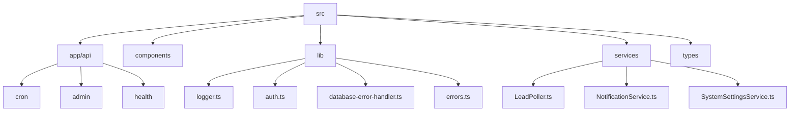
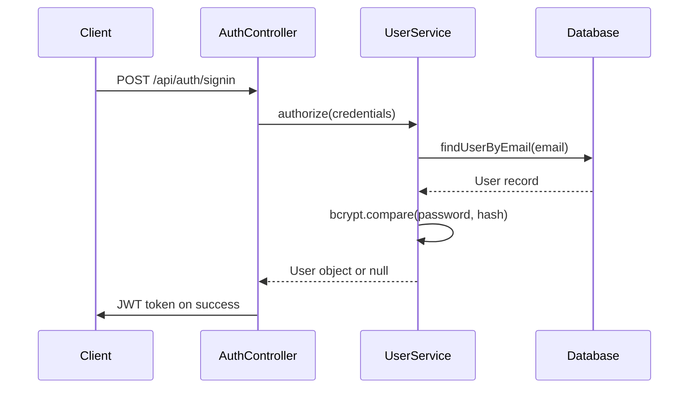
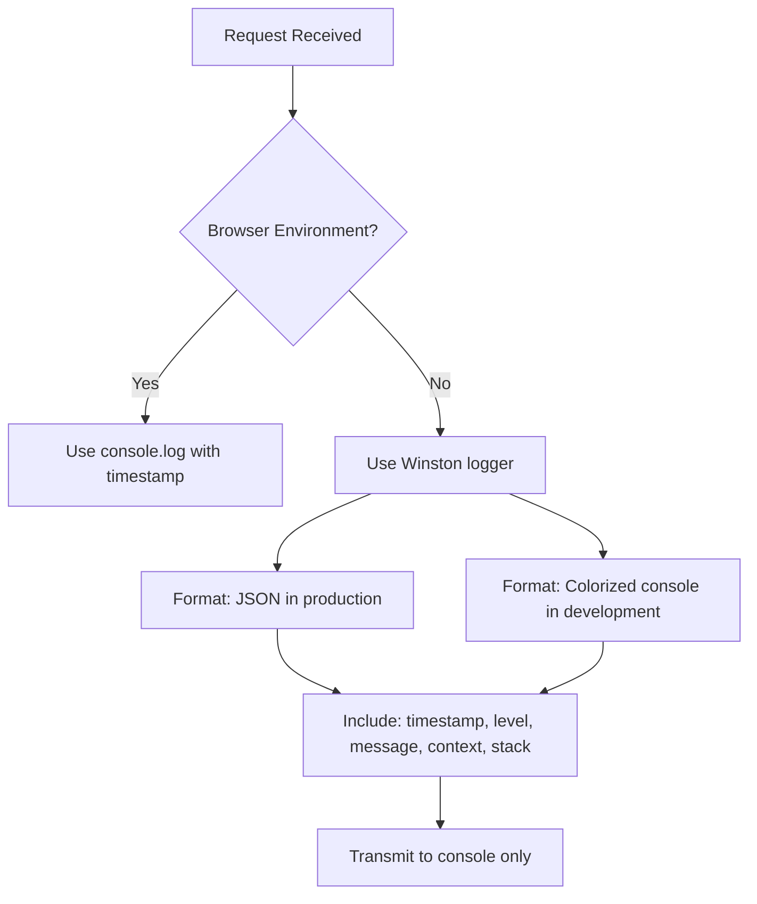
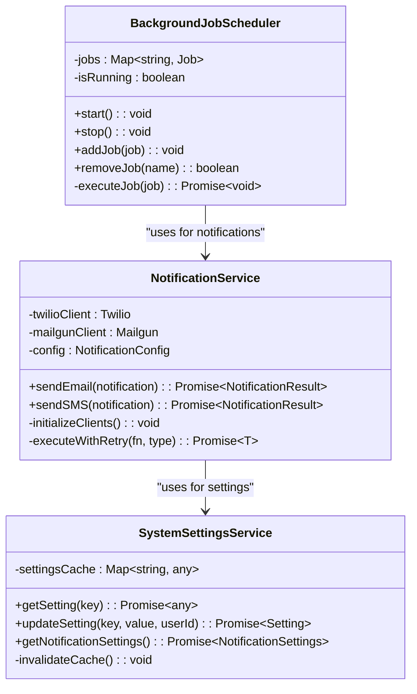
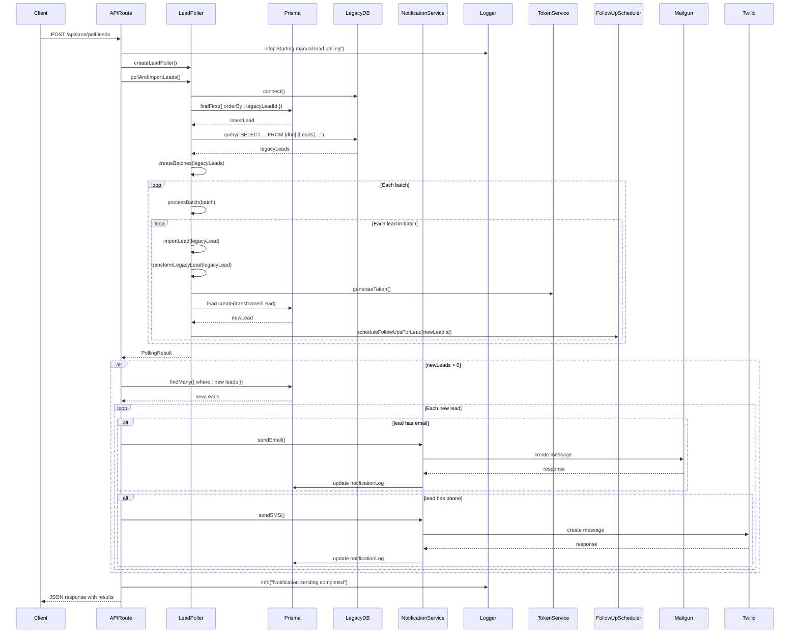
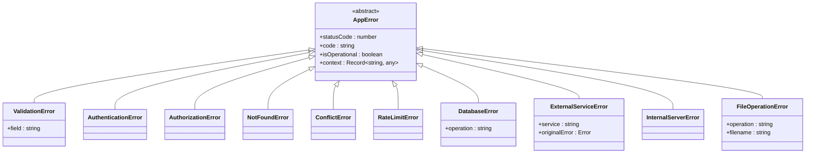
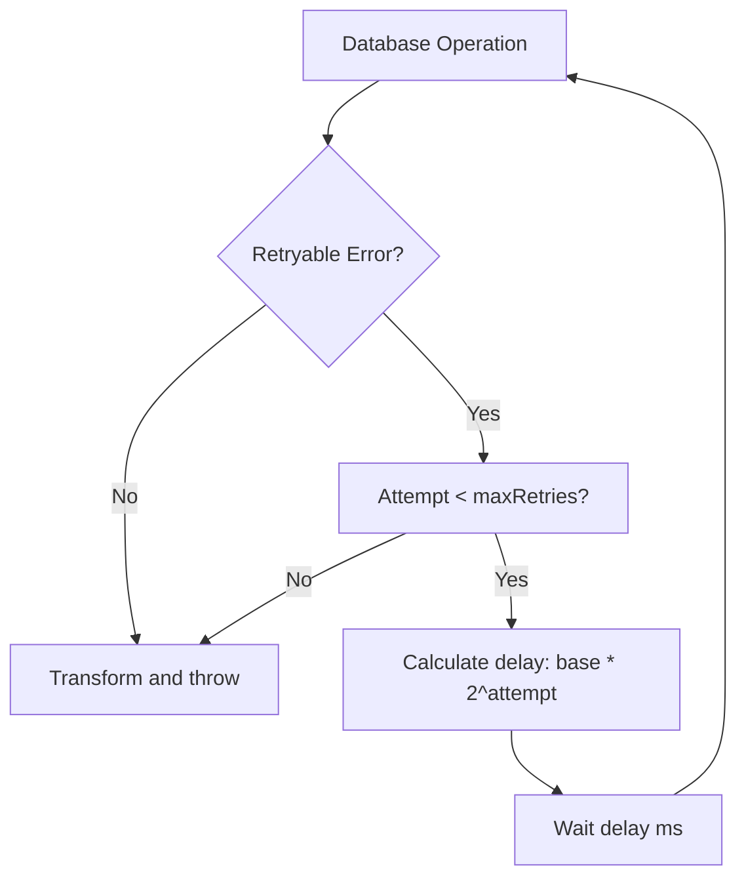
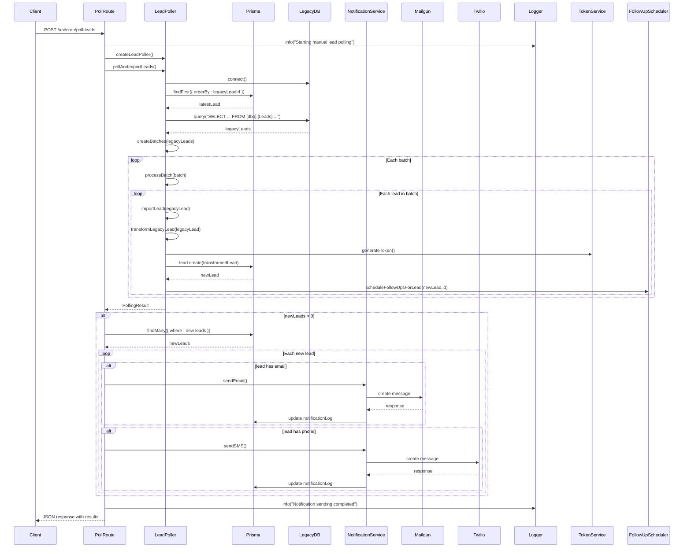
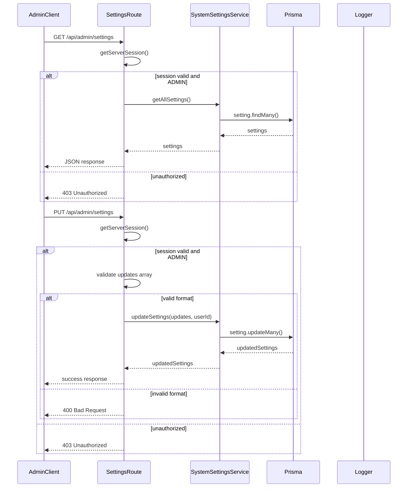

# Backend Architecture

<cite>
**Referenced Files in This Document**   
- [logger.ts](file://src/lib/logger.ts)
- [auth.ts](file://src/lib/auth.ts)
- [route.ts](file://src/app/api/cron/poll-leads/route.ts)
- [route.ts](file://src/app/api/admin/settings/route.ts)
- [live/route.ts](file://src/app/api/health/live/route.ts)
- [ready/route.ts](file://src/app/api/health/ready/route.ts)
- [database-error-handler.ts](file://src/lib/database-error-handler.ts)
- [errors.ts](file://src/lib/errors.ts)
- [LeadPoller.ts](file://src/services/LeadPoller.ts)
- [NotificationService.ts](file://src/services/NotificationService.ts)
- [SystemSettingsService.ts](file://src/services/SystemSettingsService.ts)
- [prisma.ts](file://src/lib/prisma.ts)
</cite>

## Table of Contents
1. [Introduction](#introduction)
2. [Project Structure](#project-structure)
3. [API Route Structure and RESTful Design](#api-route-structure-and-restful-design)
4. [Authentication and Authorization](#authentication-and-authorization)
5. [Middleware Pipeline](#middleware-pipeline)
6. [Service Layer Architecture](#service-layer-architecture)
7. [Request Flow and Execution Pipeline](#request-flow-and-execution-pipeline)
8. [Error Management and Monitoring](#error-management-and-monitoring)
9. [Security Considerations](#security-considerations)
10. [Sequence Diagrams](#sequence-diagrams)

## Introduction
The fund-track application is a Next.js-based backend system designed to manage merchant funding leads, intake processes, and notification workflows. This document provides a comprehensive architectural overview of the backend layer, focusing on API design, service architecture, authentication, error handling, and monitoring systems. The application follows a layered architecture with clear separation between API routes (controllers), business logic (services), and data access (Prisma ORM). The system implements robust logging, monitoring, and error management patterns to ensure reliability and maintainability.

## Project Structure
The project follows a Next.js App Router structure with a clear separation of concerns. The backend functionality is organized into API routes under `src/app/api`, services in `src/services`, and utility libraries in `src/lib`. The Prisma ORM manages database interactions with migrations stored in the `prisma` directory.



**Diagram sources**
- [src/app/api](file://src/app/api)
- [src/lib](file://src/lib)
- [src/services](file://src/services)

**Section sources**
- [src](file://src)

## API Route Structure and RESTful Design
The API follows RESTful design patterns using Next.js App Router conventions. Routes are organized by functionality with clear naming and HTTP method usage.

### Route Organization
API endpoints are structured in a hierarchical manner:
- `/api/cron` - Scheduled job triggers
- `/api/admin` - Administrative functions
- `/api/health` - System monitoring
- `/api/intake` - Application intake workflow
- `/api/leads` - Lead management

### HTTP Method Usage
The API follows standard REST conventions:
- `GET` for data retrieval
- `POST` for data creation and processing
- `PUT` for data updates
- `DELETE` for data removal

### Example: Poll Leads Endpoint
The `/api/cron/poll-leads` endpoint demonstrates the RESTful approach for triggering background jobs:

```typescript
export async function POST(request: NextRequest) {
  try {
    logger.info("Starting manual lead polling process via API endpoint");
    const leadPoller = createLeadPoller();
    const pollingResult = await leadPoller.pollAndImportLeads();
    // ... processing and response
  } catch (error) {
    // Error handling
  }
}
```

**Section sources**
- [src/app/api/cron/poll-leads/route.ts](file://src/app/api/cron/poll-leads/route.ts)
- [src/app/api/admin/settings/route.ts](file://src/app/api/admin/settings/route.ts)

## Authentication and Authorization
The system implements a robust authentication and authorization model using NextAuth.js with JWT-based sessions.

### Authentication Flow
The authentication system uses credential-based login with password hashing via bcrypt:



**Diagram sources**
- [src/lib/auth.ts](file://src/lib/auth.ts)

### Role-Based Access Control
The system implements role-based access control (RBAC) with ADMIN role enforcement:

```typescript
const session = await getServerSession(authOptions);
if (!session?.user || session.user.role !== UserRole.ADMIN) {
  return NextResponse.json(
    { error: "Unauthorized - Admin access required" },
    { status: 403 }
  );
}
```

This pattern is consistently applied across administrative endpoints to ensure only authorized users can access sensitive functionality.

**Section sources**
- [src/lib/auth.ts](file://src/lib/auth.ts)
- [src/app/api/admin/settings/route.ts](file://src/app/api/admin/settings/route.ts)

## Middleware Pipeline
The application implements a comprehensive middleware pipeline for logging, monitoring, and error handling.

### Request Logging
The logger middleware provides structured logging with environment-specific formatting:



**Diagram sources**
- [src/lib/logger.ts](file://src/lib/logger.ts)

### Monitoring and Health Checks
The system implements Kubernetes-style health checks:

#### Liveness Probe
The `/api/health/live` endpoint checks if the application process is running:

```typescript
export async function GET() {
  return NextResponse.json({ 
    status: 'alive',
    timestamp: new Date().toISOString(),
    uptime: process.uptime(),
    pid: process.pid
  });
}
```

#### Readiness Probe
The `/api/health/ready` endpoint verifies dependencies are available:

```typescript
export async function GET() {
  const dbHealth = await checkDatabaseHealth();
  if (!dbHealth.healthy) {
    return NextResponse.json(
      { status: 'not ready', reason: 'database not accessible' },
      { status: 503 }
    );
  }
  
  const requiredEnvVars = ['DATABASE_URL', 'NEXTAUTH_SECRET'];
  for (const envVar of requiredEnvVars) {
    if (!process.env[envVar]) {
      return NextResponse.json(
        { status: 'not ready', reason: `missing required environment variable: ${envVar}` },
        { status: 503 }
      );
    }
  }
  
  return NextResponse.json({ status: 'ready' });
}
```

**Section sources**
- [src/app/api/health/live/route.ts](file://src/app/api/health/live/route.ts)
- [src/app/api/health/ready/route.ts](file://src/app/api/health/ready/route.ts)
- [src/lib/database-error-handler.ts](file://src/lib/database-error-handler.ts)

## Service Layer Architecture
The service layer implements a singleton pattern with dependency injection for core services.

### Singleton Services
Key services are exported as singleton instances:

```typescript
// NotificationService.ts
export const notificationService = new NotificationService();

// SystemSettingsService.ts
export const systemSettingsService = new SystemSettingsService();

// BackgroundJobScheduler.ts
export const backgroundJobScheduler = new BackgroundJobScheduler();
```

This ensures consistent state and configuration across the application.

### Dependency Management
Services are designed with minimal external dependencies and lazy initialization:



**Diagram sources**
- [src/services/NotificationService.ts](file://src/services/NotificationService.ts)
- [src/services/SystemSettingsService.ts](file://src/services/SystemSettingsService.ts)

**Section sources**
- [src/services/NotificationService.ts](file://src/services/NotificationService.ts)
- [src/services/SystemSettingsService.ts](file://src/services/SystemSettingsService.ts)

## Request Flow and Execution Pipeline
The request flow follows a consistent pattern from HTTP endpoint through authentication to service execution.

### Lead Polling Request Flow
The complete flow for the lead polling endpoint:



**Diagram sources**
- [src/app/api/cron/poll-leads/route.ts](file://src/app/api/cron/poll-leads/route.ts)
- [src/services/LeadPoller.ts](file://src/services/LeadPoller.ts)
- [src/services/NotificationService.ts](file://src/services/NotificationService.ts)

**Section sources**
- [src/app/api/cron/poll-leads/route.ts](file://src/app/api/cron/poll-leads/route.ts)

## Error Management and Monitoring
The system implements a comprehensive error management strategy with standardized error types and logging.

### Error Hierarchy
The application defines a structured error hierarchy:



**Diagram sources**
- [src/lib/errors.ts](file://src/lib/errors.ts)

### Error Handling Middleware
The `withErrorHandler` wrapper provides consistent error response formatting:

```typescript
export function withErrorHandler<T extends any[], R>(
  handler: (...args: T) => Promise<R>
) {
  return async (...args: T): Promise<R | NextResponse<ApiErrorResponse>> => {
    try {
      return await handler(...args);
    } catch (error) {
      const requestId = Math.random().toString(36).substring(2, 15);
      
      if (error instanceof AppError) {
        return createErrorResponse(error, requestId);
      }
      
      // Handle Prisma errors
      if (error && typeof error === 'object' && 'code' in error) {
        // Transform Prisma errors to AppError
      }
      
      // Handle other errors
      return createErrorResponse(
        new InternalServerError('An unexpected error occurred'),
        requestId
      );
    }
  };
}
```

### Database Error Handling
The system implements retry logic for transient database errors:



The retryable errors include connection timeouts, network issues, and temporary failures.

**Section sources**
- [src/lib/errors.ts](file://src/lib/errors.ts)
- [src/lib/database-error-handler.ts](file://src/lib/database-error-handler.ts)

## Security Considerations
The application implements multiple security layers to protect data and prevent abuse.

### Input Validation
All API endpoints validate input data:

```typescript
export async function PUT(request: NextRequest) {
  const body = await request.json();
  const { updates } = body;
  
  if (!Array.isArray(updates)) {
    return NextResponse.json(
      { error: "Updates must be an array" },
      { status: 400 }
    );
  }
  
  for (const update of updates) {
    if (!update.key || update.value === undefined) {
      return NextResponse.json(
        { error: "Each update must have key and value" },
        { status: 400 }
      );
    }
  }
}
```

### Rate Limiting
The NotificationService implements rate limiting to prevent spam:

```typescript
private async checkRateLimit(
  recipient: string,
  type: 'EMAIL' | 'SMS',
  leadId?: number
): Promise<{ allowed: boolean; reason?: string }> {
  const oneHourAgo = new Date(Date.now() - 60 * 60 * 1000);
  const recentNotifications = await prisma.notificationLog.count({
    where: {
      recipient,
      type: type as any,
      status: 'SENT',
      createdAt: { gte: oneHourAgo },
    },
  });
  
  // Allow max 2 notifications per hour per recipient
  if (recentNotifications >= 2) {
    return {
      allowed: false,
      reason: `Rate limit exceeded: ${recentNotifications} notifications sent to ${recipient} in the last hour`,
    };
  }
}
```

### Environment Validation
The readiness check validates critical environment variables:

```typescript
const requiredEnvVars = [
  'DATABASE_URL',
  'NEXTAUTH_SECRET',
];

for (const envVar of requiredEnvVars) {
  if (!process.env[envVar]) {
    return NextResponse.json(
      { status: 'not ready', reason: `missing required environment variable: ${envVar}` },
      { status: 503 }
    );
  }
}
```

**Section sources**
- [src/app/api/admin/settings/route.ts](file://src/app/api/admin/settings/route.ts)
- [src/services/NotificationService.ts](file://src/services/NotificationService.ts)
- [src/app/api/health/ready/route.ts](file://src/app/api/health/ready/route.ts)

## Sequence Diagrams

### Lead Polling and Notification Processing
The complete sequence for lead polling and notification:



**Diagram sources**
- [src/app/api/cron/poll-leads/route.ts](file://src/app/api/cron/poll-leads/route.ts)
- [src/services/LeadPoller.ts](file://src/services/LeadPoller.ts)
- [src/services/NotificationService.ts](file://src/services/NotificationService.ts)

### System Settings Management
The flow for retrieving and updating system settings:



**Diagram sources**
- [src/app/api/admin/settings/route.ts](file://src/app/api/admin/settings/route.ts)
- [src/services/SystemSettingsService.ts](file://src/services/SystemSettingsService.ts)