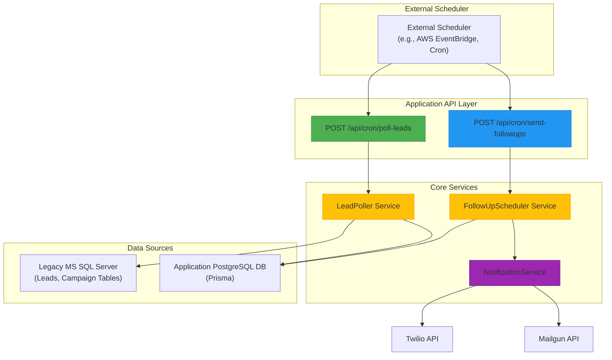
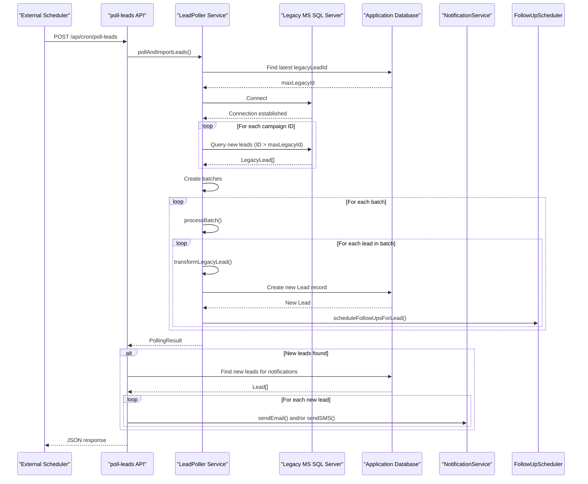
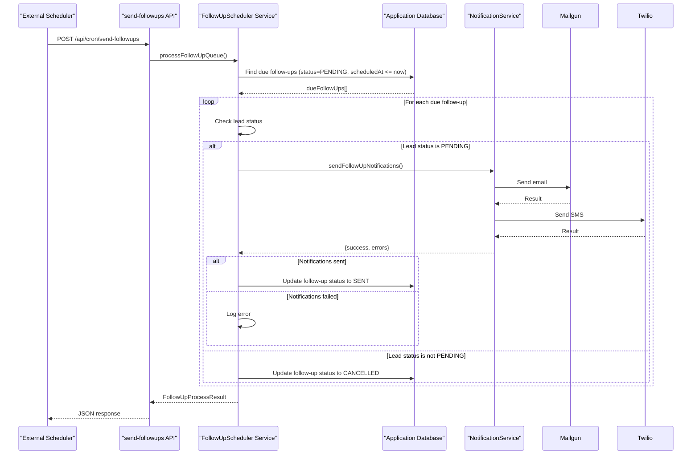

# Cron Job Endpoints

<cite>
**Referenced Files in This Document**   
- [poll-leads/route.ts](file://src/app/api/cron/poll-leads/route.ts)
- [send-followups/route.ts](file://src/app/api/cron/send-followups/route.ts)
- [LeadPoller.ts](file://src/services/LeadPoller.ts)
- [FollowUpScheduler.ts](file://src/services/FollowUpScheduler.ts)
- [legacy-db.ts](file://src/lib/legacy-db.ts)
- [NotificationService.ts](file://src/services/NotificationService.ts)
- [prisma.ts](file://src/lib/prisma.ts)
- [BackgroundJobScheduler.ts](file://src/services/BackgroundJobScheduler.ts)
</cite>

## Table of Contents
1. [Introduction](#introduction)
2. [Cron Job Architecture Overview](#cron-job-architecture-overview)
3. [poll-leads Endpoint](#poll-leads-endpoint)
4. [send-followups Endpoint](#send-followups-endpoint)
5. [Security and Authentication](#security-and-authentication)
6. [Testing and Development](#testing-and-development)
7. [Monitoring and Operations](#monitoring-and-operations)
8. [Error Handling and Recovery](#error-handling-and-recovery)

## Introduction
The fund-track application utilizes two critical cron job endpoints to power its background processing system: `poll-leads` and `send-followups`. These endpoints handle the import of leads from a legacy MS SQL Server database and the delivery of scheduled follow-up notifications through Twilio and MailGun, respectively. The `poll-leads` endpoint is responsible for batch processing new leads, ensuring duplicate detection, and initiating notification workflows. The `send-followups` endpoint manages a queue of scheduled notifications with retry mechanisms and rate limiting to ensure reliable delivery. Both endpoints are designed to be invoked by an external scheduler and include comprehensive error recovery, logging, and monitoring capabilities. This documentation provides a detailed technical overview of these endpoints, including their invocation patterns, payload structures, processing timeouts, and security considerations.

## Cron Job Architecture Overview



**Diagram sources**
- [poll-leads/route.ts](file://src/app/api/cron/poll-leads/route.ts)
- [send-followups/route.ts](file://src/app/api/cron/send-followups/route.ts)
- [LeadPoller.ts](file://src/services/LeadPoller.ts)
- [FollowUpScheduler.ts](file://src/services/FollowUpScheduler.ts)
- [NotificationService.ts](file://src/services/NotificationService.ts)

**Section sources**
- [poll-leads/route.ts](file://src/app/api/cron/poll-leads/route.ts)
- [send-followups/route.ts](file://src/app/api/cron/send-followups/route.ts)
- [LeadPoller.ts](file://src/services/LeadPoller.ts)
- [FollowUpScheduler.ts](file://src/services/FollowUpScheduler.ts)

## poll-leads Endpoint

The `poll-leads` endpoint is responsible for importing new leads from the legacy MS SQL Server database into the application's PostgreSQL database. It is designed to be invoked by an external scheduler at regular intervals (default: every 15 minutes). The endpoint processes leads in batches to optimize performance and resource utilization, with a default batch size of 100 leads. The process begins by connecting to the legacy database using configuration from environment variables (`LEGACY_DB_SERVER`, `LEGACY_DB_DATABASE`, etc.). It queries the `Leads` table and corresponding campaign-specific tables (e.g., `Leads_11302`) to retrieve leads that have not been previously imported, identified by comparing the `LeadID` against the highest `legacyLeadId` already present in the application database.



**Diagram sources**
- [poll-leads/route.ts](file://src/app/api/cron/poll-leads/route.ts#L1-L192)
- [LeadPoller.ts](file://src/services/LeadPoller.ts#L1-L521)
- [legacy-db.ts](file://src/lib/legacy-db.ts#L1-L157)

**Section sources**
- [poll-leads/route.ts](file://src/app/api/cron/poll-leads/route.ts#L1-L192)
- [LeadPoller.ts](file://src/services/LeadPoller.ts#L1-L521)
- [legacy-db.ts](file://src/lib/legacy-db.ts#L1-L157)

### Processing Logic and Duplicate Detection
The `poll-leads` endpoint employs a robust mechanism for duplicate detection and error recovery. Instead of relying on application-level deduplication, it prevents duplicates at the source by querying the legacy database for leads with `LeadID` greater than the maximum `legacyLeadId` already stored in the application database. This approach ensures that each lead is processed exactly once. The `LeadPoller` service handles batch processing, dividing the retrieved leads into configurable batches (default: 100) to prevent memory issues and allow for incremental progress. Each batch is processed sequentially, with individual lead import failures logged but not causing the entire batch to fail. The transformation process sanitizes string fields, formats phone numbers, and generates a unique `intakeToken` for each new lead, which is used to create a secure application link. After a lead is successfully imported, the `FollowUpScheduler` is immediately called to schedule a series of follow-up notifications (3-hour, 9-hour, 24-hour, and 72-hour reminders).

### Payload Structures and Response Codes
The `poll-leads` endpoint accepts an empty POST request body and returns a JSON response with detailed processing information. A successful response (HTTP 200) includes a `success: true` flag, a descriptive message, and a `pollingResult` object containing statistics about the import process. If new leads were imported, a `notificationResults` object is also included, detailing the number of emails and SMS messages sent and any errors encountered. In the event of a failure, the endpoint returns an HTTP 500 status code with `success: false`, an error message, and a description of the failure. The endpoint also supports a GET request for health checking, which returns a simple availability message and timestamp.

**Success Response (200 OK)**
```json
{
  "success": true,
  "message": "Lead polling and notifications completed successfully",
  "pollingResult": {
    "totalProcessed": 50,
    "newLeads": 50,
    "duplicatesSkipped": 0,
    "errors": [],
    "processingTime": "2500ms"
  },
  "notificationResults": {
    "emailsSent": 45,
    "smsSent": 30,
    "emailErrors": 0,
    "smsErrors": 0
  }
}
```

**Failure Response (500 Internal Server Error)**
```json
{
  "success": false,
  "error": "Legacy database connection failed: Connection timeout",
  "message": "Lead polling process failed"
}
```

## send-followups Endpoint

The `send-followups` endpoint is responsible for processing a queue of scheduled follow-up notifications for leads in the `PENDING` status. It is designed to be invoked frequently by an external scheduler (default: every 5 minutes) to ensure timely delivery of reminders. The endpoint queries the `followupQueue` table for all pending follow-ups where the `scheduledAt` timestamp is less than or equal to the current time. For each due follow-up, it checks that the associated lead is still in the `PENDING` status before sending the notification. If the lead's status has changed (e.g., to `COMPLETED` or `REJECTED`), the follow-up is automatically cancelled to prevent unnecessary communication.



**Diagram sources**
- [send-followups/route.ts](file://src/app/api/cron/send-followups/route.ts#L1-L103)
- [FollowUpScheduler.ts](file://src/services/FollowUpScheduler.ts#L1-L490)
- [NotificationService.ts](file://src/services/NotificationService.ts#L1-L471)

**Section sources**
- [send-followups/route.ts](file://src/app/api/cron/send-followups/route.ts#L1-L103)
- [FollowUpScheduler.ts](file://src/services/FollowUpScheduler.ts#L1-L490)

### Queue Management and Retry Mechanisms
The `send-followups` endpoint implements a sophisticated queue management system with built-in retry mechanisms. The `FollowUpScheduler` service manages the `followupQueue` table, which stores follow-up tasks with their scheduled time and status. When a follow-up is due, the `NotificationService` attempts to send both an email and an SMS notification. The `NotificationService` itself implements a retry mechanism with exponential backoff for transient failures from the Twilio or MailGun APIs. The retry configuration (maximum retries, base delay) can be dynamically adjusted based on system settings. If a notification fails after all retry attempts, the error is logged in the `notificationLog` table, and the follow-up processing continues with the next item in the queue. The endpoint returns a 207 Multi-Status response if some follow-ups were processed successfully while others failed, providing detailed error information for troubleshooting.

### Rate Limiting and Payload Structures
The `send-followups` endpoint incorporates rate limiting to prevent spamming recipients. The `NotificationService` checks two limits before sending a notification: a per-recipient limit (maximum 2 notifications per hour) and a per-lead limit (maximum 10 notifications per day). These limits are enforced by querying the `notificationLog` table for recent successful deliveries. The endpoint accepts an empty POST request body and returns a JSON response with processing statistics. A successful response (HTTP 200) indicates all follow-ups were processed without errors. A 207 Multi-Status response indicates partial success, and a 500 Internal Server Error indicates a complete failure of the processing job. The endpoint also supports a GET request to retrieve queue statistics, including the total number of pending follow-ups and those due within the next hour.

**Success Response (200 OK)**
```json
{
  "success": true,
  "message": "Follow-up processing completed",
  "data": {
    "processed": 10,
    "sent": 8,
    "cancelled": 2,
    "processingTime": "1200ms",
    "errors": []
  }
}
```

**Partial Success Response (207 Multi-Status)**
```json
{
  "success": false,
  "message": "Follow-up processing completed with errors",
  "data": {
    "processed": 5,
    "sent": 3,
    "cancelled": 1,
    "processingTime": "800ms",
    "errors": [
      "Failed to send follow-up 123: Email failed: Mailgun API error",
      "Failed to send follow-up 124: SMS failed: Twilio API error"
    ]
  }
}
```

## Security and Authentication

The `poll-leads` and `send-followups` endpoints are currently designed to be invoked by a trusted external scheduler and do not implement authentication or authorization checks within their API routes. This design decision is based on the assumption that the endpoints are only accessible from a secure internal network or through a scheduler with restricted access. However, the codebase includes a more secure alternative for manual execution. The `trigger-polling` endpoint in the admin section (`/api/admin/background-jobs/trigger-polling`) requires authentication via NextAuth and verifies that the user has the `ADMIN` role before executing the lead polling job. This demonstrates the application's capability for secure administrative actions but highlights a potential security gap in the cron endpoints.

To secure the cron endpoints against unauthorized access, several strategies can be implemented:
1. **API Key Authentication**: Add a required `X-API-Key` header to both endpoints and validate it against a secret stored in environment variables.
2. **IP Whitelisting**: Configure the web server or reverse proxy to only allow requests from the IP address of the external scheduler.
3. **JWT Tokens**: Have the scheduler generate a short-lived JWT token signed with a shared secret, which the endpoints would validate.
4. **Network Isolation**: Deploy the application in a private subnet and ensure the scheduler runs within the same secure network.

The lack of authentication on these endpoints represents a significant security risk, as an attacker who discovers the endpoint URLs could trigger resource-intensive database operations or disrupt the notification system. Implementing at least one of the above measures is strongly recommended for production environments.

**Section sources**
- [poll-leads/route.ts](file://src/app/api/cron/poll-leads/route.ts)
- [send-followups/route.ts](file://src/app/api/cron/send-followups/route.ts)
- [BackgroundJobScheduler.ts](file://src/services/BackgroundJobScheduler.ts)
- [trigger-polling/route.ts](file://src/app/api/admin/background-jobs/trigger-polling/route.ts)

## Testing and Development

The application provides several tools and endpoints to facilitate testing and development of the cron job functionality. For the `poll-leads` endpoint, a dedicated test service (`createTestLeadPoller`) is available, which is configured to query a specific test campaign table (`Leads_11302`) with a smaller batch size. This allows developers to safely test the import logic without affecting production data. The `test-lead-polling` API endpoint (`/api/dev/test-lead-polling`) exposes this test poller, allowing manual triggering of the polling process via a POST request with an action parameter.

Similarly, for the `send-followups` endpoint, the `FollowUpScheduler` service includes a `getFollowUpStats` method that returns detailed queue statistics, which can be accessed via the `GET /api/cron/send-followups` endpoint. This allows developers to monitor the state of the follow-up queue during testing. The `test-notifications` endpoint (`/api/dev/test-notifications`) can be used to manually send test notifications to verify the integration with Twilio and MailGun.

Several shell and MJS scripts in the `scripts/` directory support operational testing:
- `test-lead-polling.mjs`: A script to manually trigger and test the lead polling process.
- `test-notifications.mjs`: A script to test the notification delivery system.
- `check-scheduler.mjs`: A script to check the status of the background job scheduler.
- `ensure-scheduler-running.sh`: A shell script to verify and start the scheduler if it is not running.

These tools enable comprehensive testing of the cron job workflows in development and staging environments before deployment to production.

**Section sources**
- [LeadPoller.ts](file://src/services/LeadPoller.ts#L499-L521)
- [test-lead-polling/route.ts](file://src/app/api/dev/test-lead-polling/route.ts)
- [send-followups/route.ts](file://src/app/api/cron/send-followups/route.ts#L70-L103)
- [test-notifications.mjs](file://scripts/test-notifications.mjs)
- [check-scheduler.mjs](file://scripts/check-scheduler.mjs)
- [ensure-scheduler-running.sh](file://scripts/ensure-scheduler-running.sh)

## Monitoring and Operations

The cron job endpoints are designed with comprehensive monitoring and operational considerations. Both endpoints include extensive logging using the application's `logger` service, which records key events such as job start, completion, processing statistics, and errors. The logs are structured to include relevant context (e.g., processing time, number of leads processed) to facilitate debugging and performance analysis. The `poll-leads` endpoint logs the connection to the legacy database, the number of leads fetched, and the results of each batch, while the `send-followups` endpoint logs the number of follow-ups processed, sent, and cancelled.

The system includes several mechanisms for operational oversight:
- **Health Checks**: The endpoints support GET requests for health checking, allowing monitoring systems to verify their availability.
- **Queue Statistics**: The `send-followups` endpoint provides real-time statistics on the follow-up queue, including the number of pending items and those due soon.
- **Error Notifications**: The `BackgroundJobScheduler` service is configured to send email notifications to an admin address if a scheduled job fails, ensuring prompt awareness of issues.
- **Database Logging**: All notification attempts are logged in the `notificationLog` table, providing a complete audit trail for delivery attempts.

The `BackgroundJobScheduler` service, which manages the scheduling of these cron jobs, can be monitored via the `/api/dev/scheduler-status` endpoint. This endpoint returns the current status of the scheduler, including whether it is running and the next scheduled execution time for each job. The `ensure-scheduler-running.sh` script can be used as a cron job itself to periodically verify that the scheduler is active, providing a self-healing mechanism for production environments.

**Section sources**
- [poll-leads/route.ts](file://src/app/api/cron/poll-leads/route.ts)
- [send-followups/route.ts](file://src/app/api/cron/send-followups/route.ts)
- [BackgroundJobScheduler.ts](file://src/services/BackgroundJobScheduler.ts)
- [logger.ts](file://src/lib/logger.ts)
- [NotificationService.ts](file://src/services/NotificationService.ts)

## Error Handling and Recovery

Both cron job endpoints implement robust error handling and recovery mechanisms to ensure system reliability. The `poll-leads` endpoint uses a try-catch block at the top level to catch any unhandled exceptions, logging the error and returning a 500 status code. Within the `LeadPoller` service, individual batch processing failures are caught and logged, allowing the overall job to continue processing subsequent batches. Similarly, failures to import individual leads are caught and recorded in the `errors` array of the `PollingResult`, preventing a single bad record from halting the entire import process. The connection to the legacy database is properly managed in a try-finally block, ensuring it is closed even if an error occurs.

The `send-followups` endpoint follows a similar pattern, with top-level error handling and granular error management within the follow-up processing loop. Each follow-up is processed independently, so a failure to send one notification does not affect the processing of others. The `NotificationService` implements its own retry mechanism with exponential backoff for transient API failures from Twilio and MailGun. Failed notification attempts are logged in the `notificationLog` table with the error message, providing a complete record for debugging. The system also includes automatic cleanup functionality via the `cleanupOldFollowUps` method, which removes completed or cancelled follow-up records older than 30 days to prevent database bloat.

These layered error handling strategies ensure that transient issues (e.g., network timeouts, API rate limits) do not cause permanent job failures, while persistent issues are logged and reported for investigation. The combination of retry mechanisms, independent processing units, and comprehensive logging creates a resilient background processing system.

**Section sources**
- [poll-leads/route.ts](file://src/app/api/cron/poll-leads/route.ts#L1-L192)
- [LeadPoller.ts](file://src/services/LeadPoller.ts#L1-L521)
- [send-followups/route.ts](file://src/app/api/cron/send-followups/route.ts#L1-L103)
- [FollowUpScheduler.ts](file://src/services/FollowUpScheduler.ts#L1-L490)
- [NotificationService.ts](file://src/services/NotificationService.ts#L1-L471)