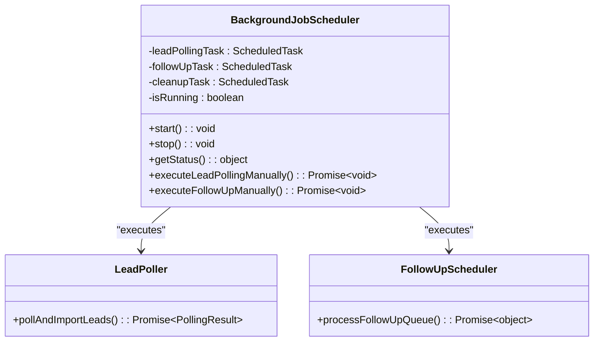
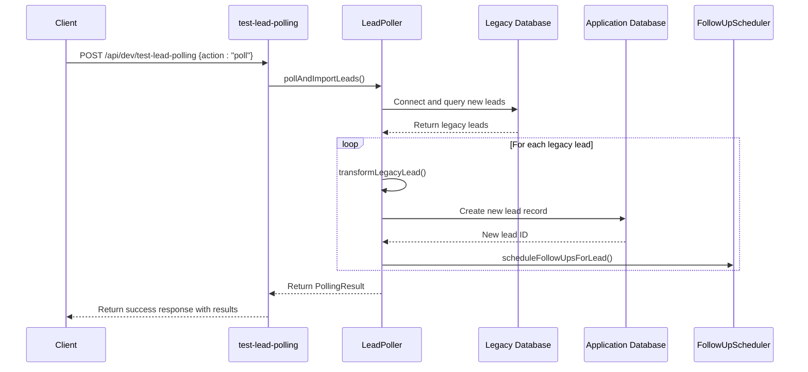
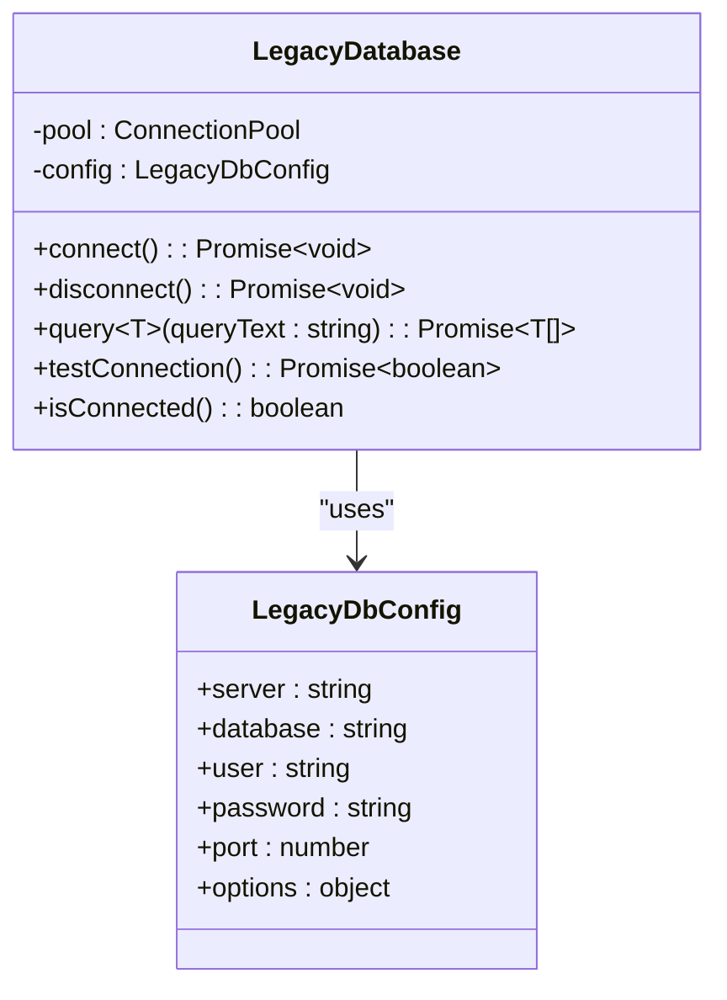
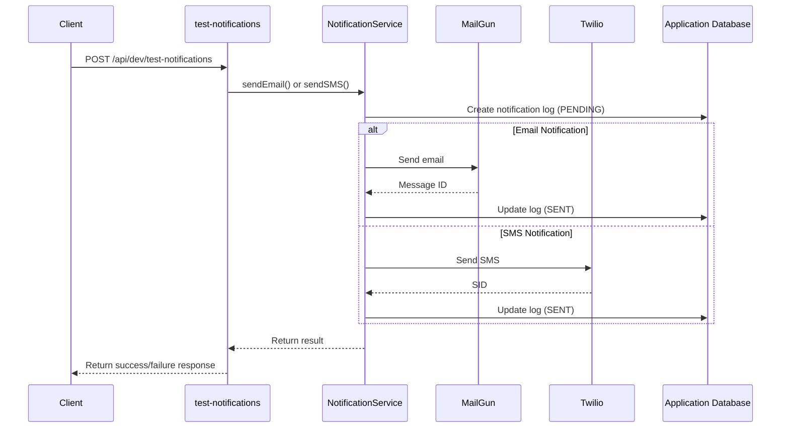

# Development Utility APIs

<cite>
**Referenced Files in This Document**   
- [reset-intake/page.tsx](file://src/app/dev/reset-intake/page.tsx)
- [reset-intake/route.ts](file://src/app/api/dev/reset-intake/route.ts)
- [scheduler-status/route.ts](file://src/app/api/dev/scheduler-status/route.ts)
- [BackgroundJobScheduler.ts](file://src/services/BackgroundJobScheduler.ts)
- [test-lead-polling/route.ts](file://src/app/api/dev/test-lead-polling/route.ts)
- [LeadPoller.ts](file://src/services/LeadPoller.ts)
- [test-legacy-db/route.ts](file://src/app/api/dev/test-legacy-db/route.ts)
- [legacy-db.ts](file://src/lib/legacy-db.ts)
- [test-notifications/route.ts](file://src/app/api/dev/test-notifications/route.ts)
- [NotificationService.ts](file://src/services/NotificationService.ts)
- [test-lead-polling.mjs](file://scripts/test-lead-polling.mjs)
- [test-legacy-db.mjs](file://scripts/test-legacy-db.mjs)
- [test-notifications.mjs](file://scripts/test-notifications.mjs)
- [test-legacy-db/page.tsx](file://src/app/dev/test-legacy-db/page.tsx)
- [test-notifications/page.tsx](file://src/app/dev/test-notifications/page.tsx)
</cite>

## Table of Contents
1. [Introduction](#introduction)
2. [reset-intake Endpoint](#reset-intake-endpoint)
3. [scheduler-status Endpoint](#scheduler-status-endpoint)
4. [test-lead-polling Endpoint](#test-lead-polling-endpoint)
5. [test-legacy-db Endpoint](#test-legacy-db-endpoint)
6. [test-notifications Endpoint](#test-notifications-endpoint)
7. [Integration with Shell Scripts](#integration-with-shell-scripts)
8. [Security and Environment Controls](#security-and-environment-controls)

## Introduction
This document details the development utility APIs designed for debugging and system validation in the Fund Track application. These endpoints provide essential tools for developers to test and validate various system components during development and testing phases. The APIs are strictly restricted to development environments and include multiple safeguards to prevent accidental use in production. Each endpoint serves a specific purpose: clearing test data, checking background job status, simulating lead import processes, verifying database connectivity, and sending test notifications through external services.

## reset-intake Endpoint

The reset-intake endpoint provides functionality to reset the intake process completion status for leads in the system. This tool is essential for developers who need to re-test the application intake workflow without creating new leads.

### Functionality and Purpose
The reset-intake endpoint allows developers to reset the intake process for selected leads, effectively allowing them to go through the entire intake process again. This is particularly useful for testing the application workflow, form validation, and data persistence without needing to create new test leads.

### Request Parameters
The endpoint supports both GET and POST requests:
- **GET request**: Retrieves a list of all leads for selection
- **POST request**: Performs the reset operation with the following parameters:
  - `action`: Must be "reset-intake" or "reset-intake-all"
  - `leadIds`: Array of lead IDs to reset (required for "reset-intake" action)
  - `filters`: Optional object containing status and search filters (used with "reset-intake-all")

### Expected Responses
**Success Response (200 OK):**
```json
{
  "success": true,
  "message": "Reset intake process completion for leads",
  "resetCount": 2,
  "totalTargeted": 2,
  "resetLeads": [
    {
      "id": 123,
      "firstName": "John",
      "lastName": "Doe",
      "status": "PENDING",
      "intakeToken": "abc123",
      "step1CompletedAt": null,
      "step2CompletedAt": null,
      "intakeCompletedAt": null
    }
  ],
  "timestamp": "2025-08-27T10:30:00.000Z"
}
```

**Error Response (400 Bad Request):**
```json
{
  "error": "Action must be \"reset-intake\" or \"reset-intake-all\""
}
```

**Error Response (500 Internal Server Error):**
```json
{
  "error": "Internal server error",
  "details": "Database connection failed"
}
```

### Side Effects
When a lead's intake process is reset, several system changes occur:
- Clear the `step1_completed_at` and `step2_completed_at` timestamps
- Clear the `intake_completed_at` timestamp
- Reset lead status to PENDING if currently IN_PROGRESS or COMPLETED
- Create a record in the lead status history for audit purposes
- Allow the lead to access the intake workflow again using their existing intake token

The endpoint also provides a web interface at `/dev/reset-intake` that allows for bulk operations and filtering of leads based on status and search criteria.

**Section sources**
- [reset-intake/page.tsx](file://src/app/dev/reset-intake/page.tsx#L0-L209)
- [reset-intake/route.ts](file://src/app/api/dev/reset-intake/route.ts#L54-L324)

## scheduler-status Endpoint

The scheduler-status endpoint provides monitoring and control capabilities for the background job scheduler, which manages critical system processes like lead polling and follow-up processing.

### Functionality and Purpose
This endpoint serves as a control panel for the background job scheduler, allowing developers to:
- Check the current status of scheduled jobs
- Manually start or stop the scheduler
- Trigger lead polling jobs manually for testing
- Verify scheduler configuration and environment settings

### Request Parameters
The endpoint supports both GET and POST requests:
- **GET request**: Retrieves the current scheduler status and configuration
- **POST request**: Controls the scheduler with the following parameter:
  - `action`: Must be "start", "stop", or "poll"

### Expected Responses
**GET Success Response (200 OK):**
```json
{
  "success": true,
  "action": "scheduler-status",
  "result": {
    "scheduler": {
      "isRunning": true,
      "leadPollingPattern": "*/15 * * * *",
      "followUpPattern": "*/5 * * * *",
      "nextLeadPolling": "2025-08-27T10:45:00.000Z",
      "nextFollowUp": "2025-08-27T10:35:00.000Z"
    },
    "environment": {
      "nodeEnv": "development",
      "backgroundJobsEnabled": "true",
      "leadPollingPattern": "*/15 * * * *",
      "campaignIds": "11302,11303"
    },
    "timestamp": "2025-08-27T10:30:00.000Z"
  }
}
```

**POST Success Response (200 OK):**
```json
{
  "success": true,
  "message": "Background job scheduler started manually",
  "timestamp": "2025-08-27T10:30:00.000Z"
}
```

**Error Response (500 Internal Server Error):**
```json
{
  "success": false,
  "error": "Failed to get scheduler status",
  "details": "Scheduler not initialized"
}
```

### Side Effects
The POST actions have the following effects:
- **start**: Initializes and starts all scheduled background jobs (lead polling, follow-up processing, cleanup)
- **stop**: Stops all running background jobs and releases resources
- **poll**: Triggers the lead polling job immediately, bypassing the normal schedule

The endpoint integrates with the BackgroundJobScheduler service, which uses cron expressions to schedule recurring tasks. The scheduler manages three primary jobs: lead polling (every 15 minutes), follow-up processing (every 5 minutes), and notification cleanup (daily at 2 AM).



**Diagram sources**
- [BackgroundJobScheduler.ts](file://src/services/BackgroundJobScheduler.ts#L1-L463)

**Section sources**
- [scheduler-status/route.ts](file://src/app/api/dev/scheduler-status/route.ts#L0-L82)
- [BackgroundJobScheduler.ts](file://src/services/BackgroundJobScheduler.ts#L1-L463)

## test-lead-polling Endpoint

The test-lead-polling endpoint simulates the lead import process by polling the legacy database for new leads and importing them into the application.

### Functionality and Purpose
This endpoint allows developers to test the lead ingestion pipeline, which connects to a legacy MS SQL Server database to retrieve new leads. It's essential for verifying that the data import process works correctly and that leads are properly transformed and stored in the application database.

### Request Parameters
The endpoint supports both GET and POST requests:
- **GET request**: Retrieves the current configuration and available actions
- **POST request**: Executes actions with the following parameter:
  - `action`: Must be "poll" (to trigger lead polling)

### Expected Responses
**GET Success Response (200 OK):**
```json
{
  "campaignIds": [11302],
  "batchSize": 10,
  "availableActions": ["poll"],
  "usage": {
    "poll": "Trigger test lead polling for campaign 11302"
  }
}
```

**POST Success Response (200 OK):**
```json
{
  "success": true,
  "action": "poll",
  "timestamp": "2025-08-27T10:30:00.000Z",
  "result": {
    "totalProcessed": 5,
    "newLeads": 5,
    "duplicatesSkipped": 0,
    "errors": [],
    "processingTime": 1250
  }
}
```

**Error Response (500 Internal Server Error):**
```json
{
  "error": "Internal server error",
  "details": "Legacy database connection failed"
}
```

### Side Effects
When the poll action is executed:
- Connects to the legacy MS SQL Server database
- Queries for new leads from the configured campaign (ID 11302 for testing)
- Transforms the legacy lead data into the application's data model
- Creates new lead records in the application database
- Generates intake tokens for new leads
- Schedules follow-up tasks for the new leads
- Logs the import results for debugging

The endpoint uses the LeadPoller service, which handles the complete lead import workflow, including data transformation, database operations, and error handling.



**Diagram sources**
- [test-lead-polling/route.ts](file://src/app/api/dev/test-lead-polling/route.ts)
- [LeadPoller.ts](file://src/services/LeadPoller.ts#L1-L522)

**Section sources**
- [test-lead-polling/route.ts](file://src/app/api/dev/test-lead-polling/route.ts)
- [LeadPoller.ts](file://src/services/LeadPoller.ts#L1-L522)

## test-legacy-db Endpoint

The test-legacy-db endpoint provides functionality to verify connectivity with the legacy MS SQL Server database and test data operations between systems.

### Functionality and Purpose
This endpoint allows developers to:
- Test connectivity to the legacy database
- Insert test records into the legacy database
- Delete test records from the legacy database
- Clean up related records in the application database
- Check the current status of test records in both databases

### Request Parameters
The endpoint supports both GET and POST requests:
- **GET request**: Retrieves the current status of test records in both databases
- **POST request**: Executes actions with the following parameters:
  - `action`: Must be "insert", "delete", "cleanup"
  - `customValues`: Object containing the test record data (for insert action)

### Expected Responses
**GET Success Response (200 OK):**
```json
{
  "existingLegacyRecords": [
    {
      "LeadID": 1001,
      "PostDT": "2025-08-27T10:30:00.000Z",
      "CampaignID": 11302,
      "FirstName": "TEST",
      "LastName": "TEST"
    }
  ],
  "relatedAppRecords": [
    {
      "id": 501,
      "legacyLeadId": "1001",
      "campaignId": 11302,
      "firstName": "TEST",
      "lastName": "TEST",
      "status": "PENDING"
    }
  ]
}
```

**POST Success Response (200 OK):**
```json
{
  "success": true,
  "action": "insert",
  "timestamp": "2025-08-27T10:30:00.000Z",
  "result": {
    "message": "Test record inserted successfully",
    "legacyLeadId": 1001
  }
}
```

**Error Response (500 Internal Server Error):**
```json
{
  "error": "Internal server error",
  "details": "Failed to connect to legacy database"
}
```

### Side Effects
Each action has specific effects:
- **insert**: Creates a new test record in the legacy database with the provided values
- **delete**: Removes test records from both the legacy database and related records in the application database
- **cleanup**: Removes only the related records from the application database, leaving the legacy record intact

The endpoint uses the legacy-db library to establish connections and execute queries against the MS SQL Server database. It's configured to use environment variables for database credentials and connection settings.



**Diagram sources**
- [test-legacy-db/route.ts](file://src/app/api/dev/test-legacy-db/route.ts)
- [legacy-db.ts](file://src/lib/legacy-db.ts#L1-L158)

**Section sources**
- [test-legacy-db/route.ts](file://src/app/api/dev/test-legacy-db/route.ts)
- [legacy-db.ts](file://src/lib/legacy-db.ts#L1-L158)

## test-notifications Endpoint

The test-notifications endpoint enables developers to send test messages through external notification services like Twilio (SMS) and MailGun (email).

### Functionality and Purpose
This endpoint allows testing of the notification system by:
- Sending test email messages via MailGun
- Sending test SMS messages via Twilio
- Verifying notification configuration and credentials
- Testing message templates and formatting
- Checking rate limiting and retry logic

### Request Parameters
The endpoint supports POST requests with the following parameters:
- `type`: Must be "email" or "sms"
- `recipient`: Email address (for email) or phone number (for SMS)
- `subject`: Subject line for email messages
- `message`: Content of the message
- `leadId`: Optional lead ID to associate with the notification

### Expected Responses
**Success Response (200 OK):**
```json
{
  "success": true,
  "externalId": "msg_1234567890",
  "timestamp": "2025-08-27T10:30:00.000Z"
}
```

**Error Response (400 Bad Request):**
```json
{
  "error": "Missing required fields: recipient, message"
}
```

**Error Response (500 Internal Server Error):**
```json
{
  "error": "Failed to send notification",
  "details": "MailGun API authentication failed"
}
```

### Side Effects
When a notification is sent:
- Creates a notification log entry in the database with status PENDING
- Attempts to send the message through the appropriate external service
- Updates the log entry with status SENT and external ID on success
- Updates the log entry with status FAILED and error message on failure
- Applies rate limiting to prevent spam (max 2 notifications per hour per recipient)
- Implements exponential backoff retry logic for failed attempts

The endpoint integrates with the NotificationService, which handles the actual communication with Twilio and MailGun APIs, as well as local logging and rate limiting.



**Diagram sources**
- [test-notifications/route.ts](file://src/app/api/dev/test-notifications/route.ts)
- [NotificationService.ts](file://src/services/NotificationService.ts#L1-L472)

**Section sources**
- [test-notifications/route.ts](file://src/app/api/dev/test-notifications/route.ts)
- [NotificationService.ts](file://src/services/NotificationService.ts#L1-L472)

## Integration with Shell Scripts

The development utility APIs are designed to work seamlessly with command-line interface (CLI) scripts, providing both web-based and terminal-based access to testing functionality.

### Script Overview
The following shell scripts integrate with the corresponding API endpoints:

- **test-lead-polling.mjs**: CLI interface for the test-lead-polling endpoint
- **test-legacy-db.mjs**: CLI interface for the test-legacy-db endpoint  
- **test-notifications.mjs**: CLI interface for the test-notifications endpoint

### Integration Pattern
Each script follows a consistent pattern:
1. Parse command-line arguments
2. Construct the appropriate API request based on the command
3. Make HTTP requests to the development API endpoints
4. Format and display the results in the terminal
5. Handle errors and network issues gracefully

### Example Usage
**test-lead-polling.mjs:**
```bash
# Trigger lead polling
node scripts/test-lead-polling.mjs poll

# Check poller status
node scripts/test-lead-polling.mjs status
```

**test-legacy-db.mjs:**
```bash
# Insert a test record
node scripts/test-legacy-db.mjs insert

# Delete test records
node scripts/test-legacy-db.mjs delete

# Check current status
node scripts/test-legacy-db.mjs status
```

**test-notifications.mjs:**
```bash
# Send test email
node scripts/test-notifications.mjs email "test@example.com" "Test Subject" "Test message"

# Send test SMS
node scripts/test-notifications.mjs sms "+1234567890" "Test SMS message"
```

The scripts use the `fetch` API to communicate with the development endpoints and provide formatted output with success/error indicators and detailed results. They also include comprehensive usage instructions and validate required environment variables before making requests.

**Section sources**
- [test-lead-polling.mjs](file://scripts/test-lead-polling.mjs#L0-L105)
- [test-legacy-db.mjs](file://scripts/test-legacy-db.mjs#L0-L105)
- [test-notifications.mjs](file://scripts/test-notifications.mjs#L0-L102)

## Security and Environment Controls

The development utility APIs include multiple security measures to prevent accidental use in production environments.

### Environment Detection
All development endpoints check for development environment conditions before allowing access:
```typescript
function isDevEnvironment() {
    return process.env.NODE_ENV === 'development' || process.env.ENABLE_DEV_ENDPOINTS === 'true';
}
```

### Access Restrictions
The endpoints are only accessible when:
- Running in development mode (NODE_ENV=development)
- Or when explicitly enabled via ENABLE_DEV_ENDPOINTS environment variable
- They are excluded from production builds through routing configuration

### Security Measures
Key security features include:
- **Environment checks**: All endpoints verify they are running in a development environment
- **No authentication required**: In development mode, no authentication is needed for convenience
- **Explicit enablement**: Production use requires explicit opt-in through environment variables
- **Comprehensive logging**: All operations are logged for audit purposes
- **Error handling**: Detailed error responses are only provided in development mode

### Deployment Safeguards
Additional safeguards prevent accidental exposure:
- Development API routes are not documented in production API documentation
- The endpoints are not included in OpenAPI/Swagger specifications
- Automated tests verify that endpoints are inaccessible in production-like environments
- Code comments clearly warn against production use

These security measures ensure that the powerful development tools remain available for debugging and testing while minimizing the risk of accidental use in production, where they could compromise data integrity or system security.

**Section sources**
- [scheduler-status/route.ts](file://src/app/api/dev/scheduler-status/route.ts#L5-L10)
- [reset-intake/route.ts](file://src/app/api/dev/reset-intake/route.ts)
- [test-lead-polling/route.ts](file://src/app/api/dev/test-lead-polling/route.ts)
- [test-legacy-db/route.ts](file://src/app/api/dev/test-legacy-db/route.ts) 
- [test-notifications/route.ts](file://src/app/api/dev/test-notifications/route.ts)