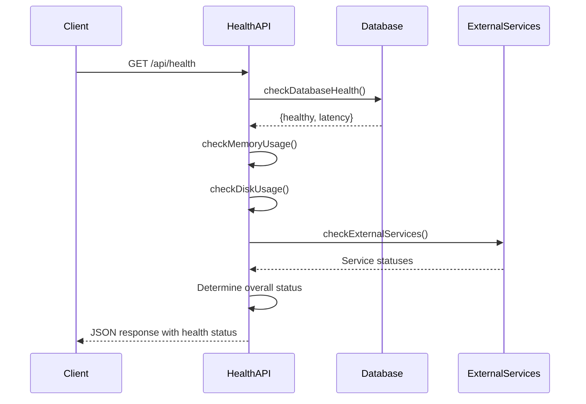
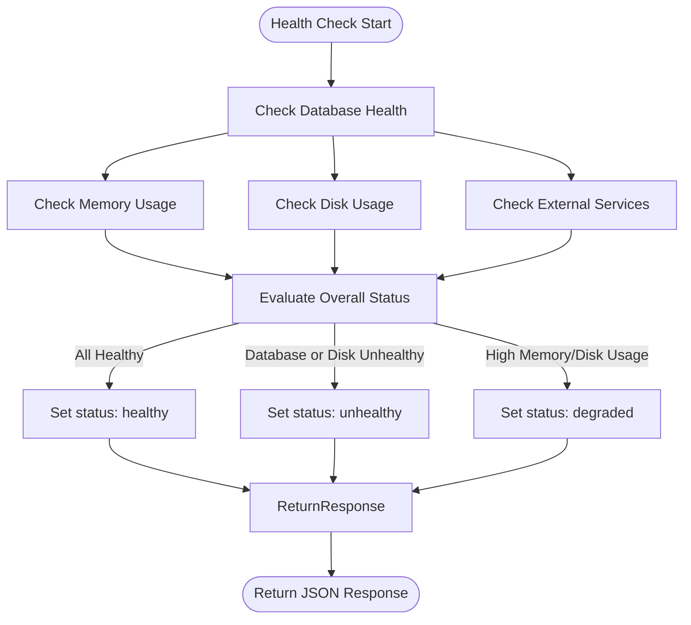
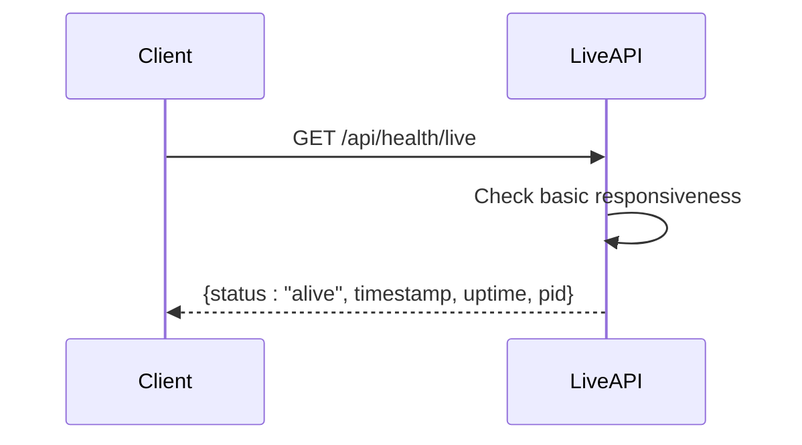
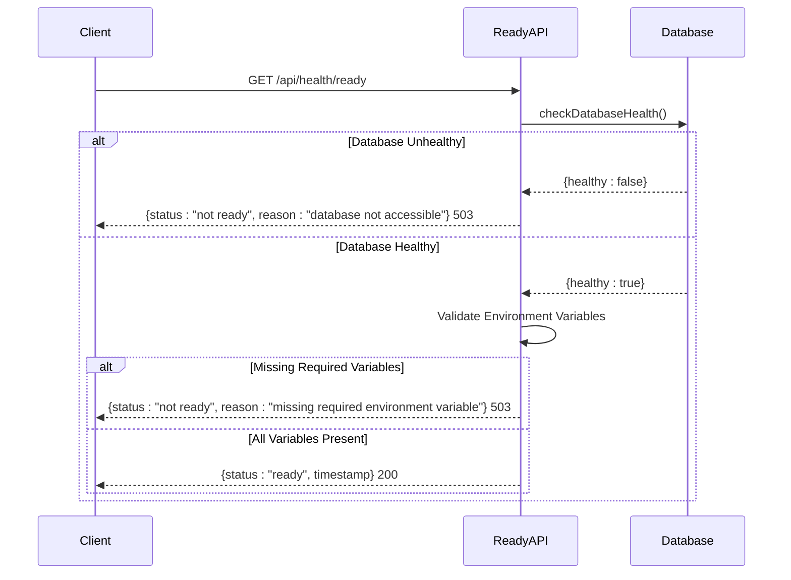
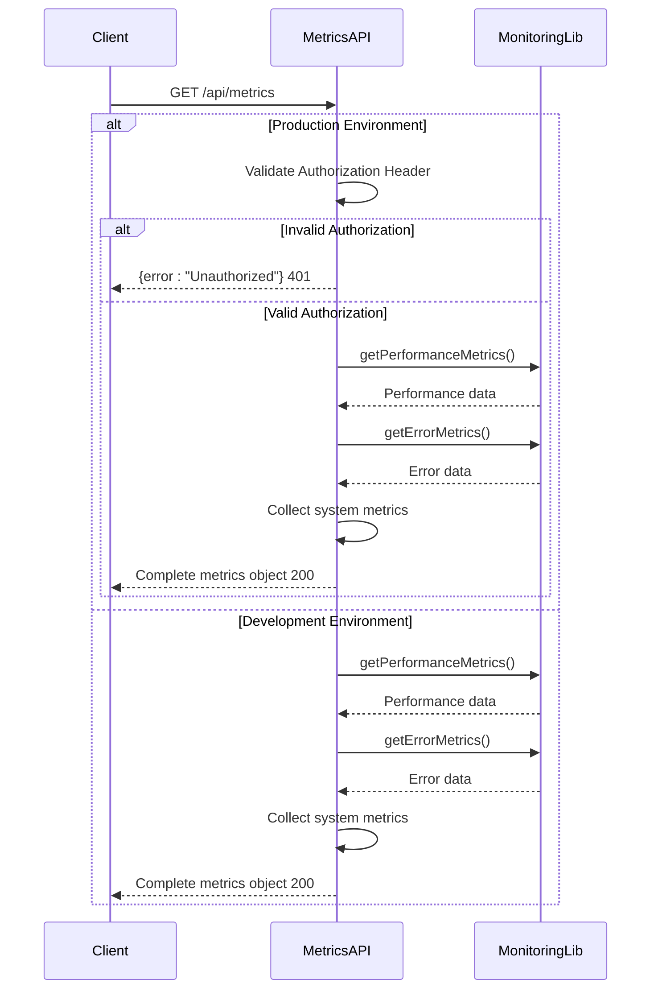
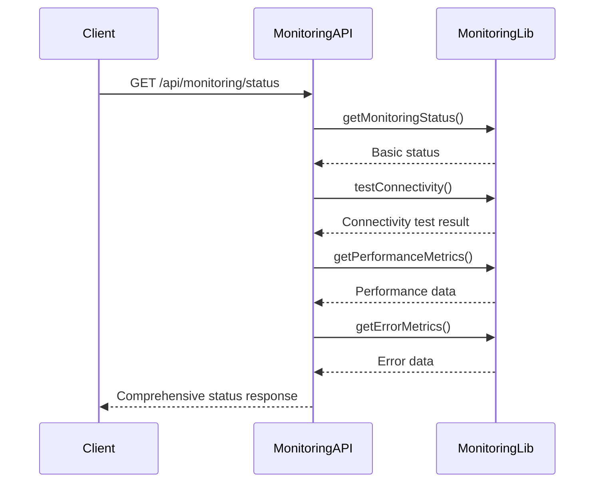
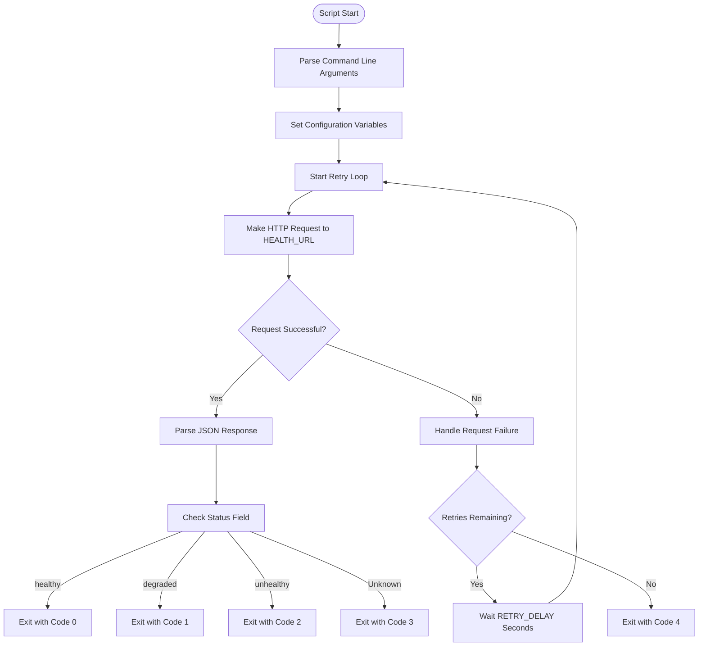

# Health and Monitoring APIs

<cite>
**Referenced Files in This Document**   
- [src/app/api/health/route.ts](file://src/app/api/health/route.ts)
- [src/app/api/health/live/route.ts](file://src/app/api/health/live/route.ts)
- [src/app/api/health/ready/route.ts](file://src/app/api/health/ready/route.ts)
- [src/app/api/metrics/route.ts](file://src/app/api/metrics/route.ts)
- [src/app/api/monitoring/status/route.ts](file://src/app/api/monitoring/status/route.ts)
- [scripts/health-check.sh](file://scripts/health-check.sh)
- [src/lib/database-error-handler.ts](file://src/lib/database-error-handler.ts)
- [src/lib/monitoring.ts](file://src/lib/monitoring.ts)
- [src/lib/logger.ts](file://src/lib/logger.ts)
</cite>

## Table of Contents
1. [Introduction](#introduction)
2. [Health Check Endpoints](#health-check-endpoints)
   - [/health](#health)
   - [/health/live](#healthlive)
   - [/health/ready](#healthready)
3. [Metrics Endpoint](#metrics-endpoint)
4. [Monitoring Status Endpoint](#monitoring-status-endpoint)
5. [System Integration and Automation](#system-integration-and-automation)
6. [Response Formats and Success Criteria](#response-formats-and-success-criteria)
7. [External Monitoring Integration](#external-monitoring-integration)

## Introduction
The health and monitoring API endpoints provide comprehensive observability for the application in production environments. These endpoints support liveness and readiness probes, expose performance metrics, and report system status including database connectivity and external service availability. The system is designed to integrate with container orchestration platforms like Kubernetes and external monitoring tools to ensure high availability and rapid incident response.

**Section sources**
- [src/app/api/health/route.ts](file://src/app/api/health/route.ts#L1-L293)
- [src/app/api/health/live/route.ts](file://src/app/api/health/live/route.ts#L1-L27)
- [src/app/api/health/ready/route.ts](file://src/app/api/health/ready/route.ts#L1-L57)

## Health Check Endpoints

### /health
The `/health` endpoint provides a comprehensive health check that evaluates multiple system components including database connectivity, memory usage, disk space, and external services. This endpoint returns detailed diagnostic information and is designed for use by monitoring systems to assess overall system health.



**Diagram sources**
- [src/app/api/health/route.ts](file://src/app/api/health/route.ts#L150-L290)
- [src/lib/database-error-handler.ts](file://src/lib/database-error-handler.ts#L239-L282)

**Section sources**
- [src/app/api/health/route.ts](file://src/app/api/health/route.ts#L1-L293)

#### Response Format
```json
{
  "status": "healthy",
  "timestamp": "2025-08-28T10:00:00.000Z",
  "version": "1.0.0",
  "uptime": 3600,
  "checks": {
    "database": {
      "status": "healthy",
      "latency": 12
    },
    "memory": {
      "status": "healthy",
      "usage": {
        "used": 150,
        "total": 512,
        "percentage": 29
      }
    },
    "disk": {
      "status": "healthy",
      "usage": {
        "free": 50,
        "total": 100,
        "percentage": 50
      }
    },
    "externalServices": {
      "twilio": {"status": "healthy", "latency": 45},
      "mailgun": {"status": "healthy"},
      "backblaze": {"status": "healthy"}
    }
  }
}
```

#### Success Criteria
- **Healthy**: All checks pass (status code 200)
- **Degraded**: Application functional but resource constraints exist (status code 200)
- **Unhealthy**: Critical component failure (status code 503)

The endpoint uses the `withPerformanceMonitoring` middleware to track performance and errors automatically.



**Diagram sources**
- [src/app/api/health/route.ts](file://src/app/api/health/route.ts#L150-L290)
- [src/lib/monitoring.ts](file://src/lib/monitoring.ts#L162-L201)

### /health/live
The `/health/live` endpoint serves as a liveness probe to determine if the application process is running and responsive. This endpoint performs minimal checks and should always succeed if the application is alive.



**Diagram sources**
- [src/app/api/health/live/route.ts](file://src/app/api/health/live/route.ts#L1-L27)

**Section sources**
- [src/app/api/health/live/route.ts](file://src/app/api/health/live/route.ts#L1-L27)

#### Response Format
```json
{
  "status": "alive",
  "timestamp": "2025-08-28T10:00:00.000Z",
  "uptime": 3600,
  "pid": 12345
}
```

#### Success Criteria
- Returns 200 if the application can respond to HTTP requests
- Returns 503 if the application cannot respond (indicating process failure)

This endpoint is used by container orchestration systems to determine if the application process should be restarted.

### /health/ready
The `/health/ready` endpoint serves as a readiness probe to determine if the application is ready to serve traffic. This endpoint checks critical dependencies and configuration.



**Diagram sources**
- [src/app/api/health/ready/route.ts](file://src/app/api/health/ready/route.ts#L1-L57)
- [src/lib/database-error-handler.ts](file://src/lib/database-error-handler.ts#L239-L282)

**Section sources**
- [src/app/api/health/ready/route.ts](file://src/app/api/health/ready/route.ts#L1-L57)

#### Response Format
```json
{
  "status": "ready",
  "timestamp": "2025-08-28T10:00:00.000Z"
}
```

#### Success Criteria
- Returns 200 if database is accessible and required environment variables are set
- Returns 503 if database is inaccessible or required environment variables are missing

The endpoint verifies the presence of critical environment variables:
- **DATABASE_URL**: Database connection string
- **NEXTAUTH_SECRET**: Authentication secret for NextAuth

## Metrics Endpoint

The `/metrics` endpoint exposes application performance data in a format suitable for monitoring tools like Prometheus.



**Diagram sources**
- [src/app/api/metrics/route.ts](file://src/app/api/metrics/route.ts#L1-L59)
- [src/lib/monitoring.ts](file://src/lib/monitoring.ts#L87-L158)

**Section sources**
- [src/app/api/metrics/route.ts](file://src/app/api/metrics/route.ts#L1-L59)

### Response Format
```json
{
  "timestamp": "2025-08-28T10:00:00.000Z",
  "system": {
    "uptime": 3600,
    "memory": {
      "heapUsed": 150,
      "heapTotal": 512,
      "external": 25,
      "rss": 200
    },
    "cpu": {
      "usage": {
        "user": 1000000,
        "system": 500000
      }
    }
  },
  "performance": {
    "totalOperations": 5,
    "operations": {
      "health_check": {
        "count": 10,
        "averageTime": 45,
        "minTime": 12,
        "maxTime": 120,
        "lastUpdated": 1724848800000
      }
    }
  },
  "errors": {
    "totalErrorTypes": 2,
    "errors": {
      "database_connection_error": {
        "count": 3,
        "lastOccurred": 1724848700000,
        "lastError": "Connection timeout"
      }
    }
  }
}
```

### Authentication
In production environments, access requires a Bearer token:
- **Header**: `Authorization: Bearer <METRICS_API_KEY>`
- **Environment Variable**: `METRICS_API_KEY` must be set

## Monitoring Status Endpoint

The `/monitoring/status` endpoint provides comprehensive system status including monitoring functionality and performance metrics.



**Diagram sources**
- [src/app/api/monitoring/status/route.ts](file://src/app/api/monitoring/status/route.ts#L1-L68)
- [src/lib/monitoring.ts](file://src/lib/monitoring.ts#L203-L276)

**Section sources**
- [src/app/api/monitoring/status/route.ts](file://src/app/api/monitoring/status/route.ts#L1-L68)

### Response Format
```json
{
  "status": "healthy",
  "timestamp": "2025-08-28T10:00:00.000Z",
  "monitoring": {
    "errorReportingEnabled": false,
    "environment": "production",
    "metricsStoreSize": 5,
    "errorStoreSize": 2,
    "uptime": 3600,
    "memoryUsage": {
      "rss": 200000000,
      "heapTotal": 150000000,
      "heapUsed": 100000000,
      "external": 25000000
    },
    "logging": {
      "enabled": true,
      "error": null
    }
  },
  "metrics": {
    "performance": {
      "totalOperations": 5,
      "operations": { /* ... */ }
    },
    "errors": {
      "totalErrorTypes": 2,
      "errors": { /* ... */ }
    }
  }
}
```

## System Integration and Automation

### health-check.sh Script
The `health-check.sh` script provides automated system diagnostics and can be integrated with monitoring systems.



**Diagram sources**
- [scripts/health-check.sh](file://scripts/health-check.sh#L1-L117)

**Section sources**
- [scripts/health-check.sh](file://scripts/health-check.sh#L1-L117)

#### Script Features
- **Retry Logic**: Configurable retry attempts with delay
- **Colorized Output**: Visual indicators for health status
- **Exit Codes**: Standardized exit codes for automation
- **Environment Variables**: Configurable parameters

#### Configuration
- **HEALTH_URL**: Target health endpoint (default: http://localhost:3000/api/health)
- **HEALTH_CHECK_TIMEOUT**: Request timeout in seconds (default: 5)
- **HEALTH_CHECK_RETRIES**: Number of retry attempts (default: 3)
- **HEALTH_CHECK_RETRY_DELAY**: Delay between retries in seconds (default: 2)

#### Exit Codes
- **0**: Healthy
- **1**: Degraded
- **2**: Unhealthy
- **3**: Unknown status
- **4**: Connection failed

Example usage:
```bash
# Basic usage
./scripts/health-check.sh

# Verbose output
./scripts/health-check.sh --verbose

# Custom configuration
HEALTH_URL=https://api.example.com/health \
HEALTH_CHECK_TIMEOUT=10 \
./scripts/health-check.sh
```

## Response Formats and Success Criteria

### Health Status Definitions
**Healthy**: All critical systems operational with adequate resources
- Database accessible
- Memory usage < 90%
- Disk usage < 90%
- Required services available

**Degraded**: System operational but under resource pressure
- Memory usage > 90% OR
- Disk usage > 90%

**Unhealthy**: Critical failure preventing normal operation
- Database inaccessible
- Disk check fails
- Health check handler throws exception

### HTTP Status Codes
- **200 OK**: Healthy or degraded state
- **503 Service Unavailable**: Unhealthy state
- **401 Unauthorized**: Invalid credentials for metrics endpoint
- **400 Bad Request**: Malformed request

## External Monitoring Integration

### Kubernetes Integration
The health endpoints are designed for Kubernetes liveness and readiness probes:

```yaml
livenessProbe:
  httpGet:
    path: /api/health/live
    port: 3000
  initialDelaySeconds: 30
  periodSeconds: 10

readinessProbe:
  httpGet:
    path: /api/health/ready
    port: 3000
  initialDelaySeconds: 10
  periodSeconds: 5
  failureThreshold: 3
```

### Monitoring System Integration
The metrics endpoint can be scraped by Prometheus with appropriate authentication:

```yaml
- job_name: 'fund-track-app'
  metrics_path: '/api/metrics'
  scheme: https
  authorization:
    credentials: 'your-metrics-api-key'
  static_configs:
    - targets: ['api.example.com:443']
```

### Alerting Configuration
Example alert rules based on health status:

```yaml
# Alert on unhealthy status
- alert: ApplicationUnhealthy
  expr: up{job="fund-track-app"} == 0
  for: 5m
  labels:
    severity: critical
  annotations:
    summary: "Application is unhealthy"
    description: "The health check endpoint is returning 503"

# Alert on degraded performance
- alert: HighErrorRate
  expr: rate(error_count_total[5m]) > 10
  for: 10m
  labels:
    severity: warning
  annotations:
    summary: "High error rate detected"
    description: "The application is experiencing elevated error rates"
```

The monitoring system provides comprehensive observability through multiple endpoints that serve different purposes in the system lifecycle, from container orchestration to performance monitoring and incident response.