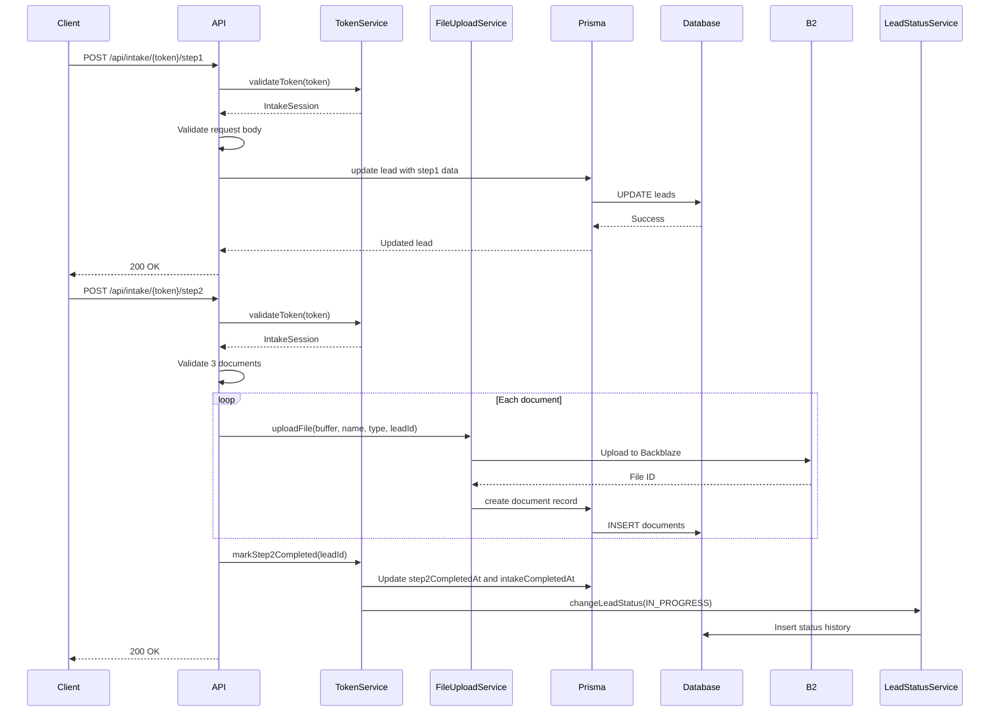
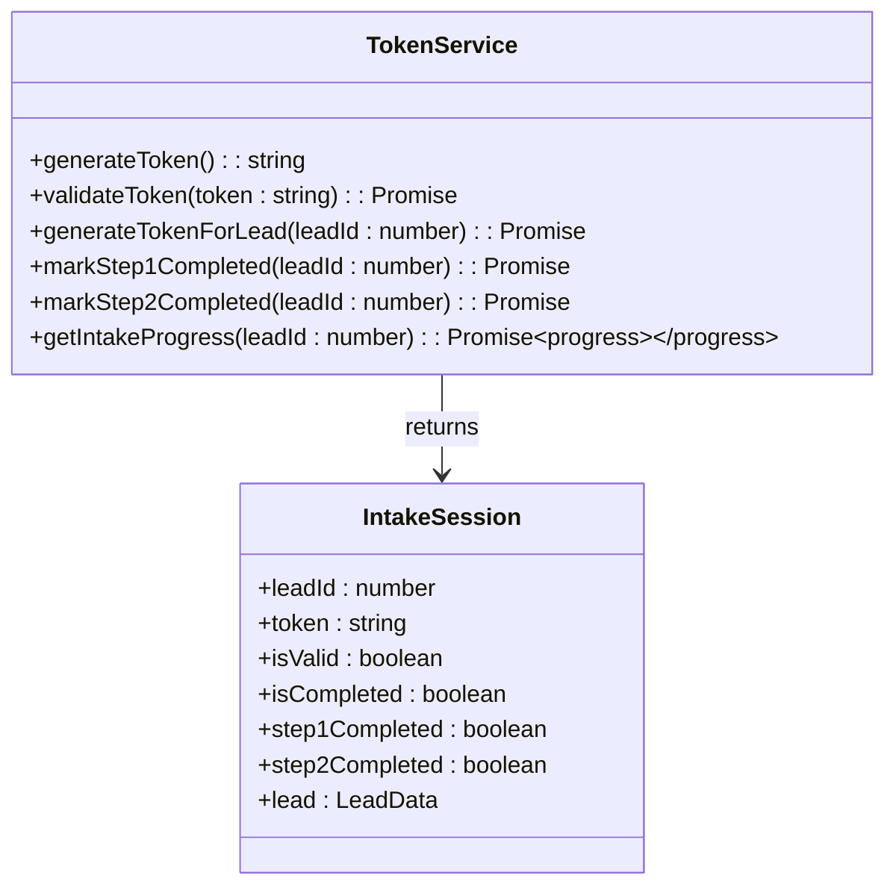
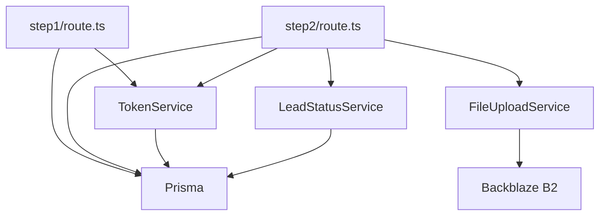

# Intake API Workflow

<cite>
**Referenced Files in This Document**   
- [TokenService.ts](file://src/services/TokenService.ts)
- [step1/route.ts](file://src/app/api/intake/[token]/step1/route.ts)
- [step2/route.ts](file://src/app/api/intake/[token]/step2/route.ts)
- [route.ts](file://src/app/api/intake/[token]/route.ts)
- [save/route.ts](file://src/app/api/intake/[token]/save/route.ts)
- [schema.prisma](file://prisma/schema.prisma)
- [FileUploadService.ts](file://src/services/FileUploadService.ts)
- [LeadStatusService.ts](file://src/services/LeadStatusService.ts)
</cite>

## Table of Contents
1. [Introduction](#introduction)
2. [Project Structure](#project-structure)
3. [Core Components](#core-components)
4. [Architecture Overview](#architecture-overview)
5. [Detailed Component Analysis](#detailed-component-analysis)
6. [Dependency Analysis](#dependency-analysis)
7. [Performance Considerations](#performance-considerations)
8. [Troubleshooting Guide](#troubleshooting-guide)
9. [Conclusion](#conclusion)

## Introduction
The Intake API Workflow manages a multi-step application process for prospects seeking funding. It uses a secure token-based system to control access and maintain state across steps. The workflow consists of two primary steps: Step 1 collects business and personal information, while Step 2 handles document uploads. Each step is validated and persisted via Prisma to a PostgreSQL database. This document details the entire workflow, including token management, request/response schemas, validation rules, and integration with external services like Backblaze B2 for file storage.

## Project Structure
The project follows a Next.js App Router structure with API routes under `src/app/api`. The intake workflow is located in `src/app/api/intake/[token]`, where dynamic routing enables token-based access. Key directories include:
- `src/services`: Contains business logic (e.g., TokenService, FileUploadService)
- `src/lib`: Utilities and database client
- `prisma`: Database schema and migrations
- `src/components`: Reusable UI components for intake forms

```mermaid
graph TB
subgraph "API Endpoints"
A[/api/intake/[token]]
A --> B[/api/intake/[token]/step1]
A --> C[/api/intake/[token]/step2]
A --> D[/api/intake/[token]/save]
end
subgraph "Services"
E[TokenService]
F[FileUploadService]
G[LeadStatusService]
end
subgraph "Data Layer"
H[Prisma Client]
I[PostgreSQL Database]
end
B --> E
C --> E
C --> F
E --> H
F --> H
G --> H
H --> I
```

**Diagram sources**
- [TokenService.ts](file://src/services/TokenService.ts#L1-L313)
- [step1/route.ts](file://src/app/api/intake/[token]/step1/route.ts#L1-L304)
- [step2/route.ts](file://src/app/api/intake/[token]/step2/route.ts#L1-L152)
- [schema.prisma](file://prisma/schema.prisma#L1-L258)

**Section sources**
- [TokenService.ts](file://src/services/TokenService.ts#L1-L313)
- [step1/route.ts](file://src/app/api/intake/[token]/step1/route.ts#L1-L304)
- [step2/route.ts](file://src/app/api/intake/[token]/step2/route.ts#L1-L152)
- [schema.prisma](file://prisma/schema.prisma#L1-L258)

## Core Components
The core components of the intake workflow are:
- **TokenService**: Manages secure token generation, validation, and step completion tracking
- **Intake API Routes**: Handle step submission, validation, and persistence
- **FileUploadService**: Interfaces with Backblaze B2 for document storage
- **Prisma ORM**: Provides type-safe database access
- **LeadStatusService**: Updates lead status and triggers notifications upon completion

These components work together to ensure a secure, stateful, and auditable intake process.

**Section sources**
- [TokenService.ts](file://src/services/TokenService.ts#L1-L313)
- [FileUploadService.ts](file://src/services/FileUploadService.ts#L1-L307)
- [LeadStatusService.ts](file://src/services/LeadStatusService.ts#L1-L452)

## Architecture Overview
The intake workflow follows a service-oriented architecture with clear separation of concerns. The API routes handle HTTP requests and validation, while services encapsulate business logic. Data persistence is managed through Prisma, which maps to a PostgreSQL database.



**Diagram sources**
- [TokenService.ts](file://src/services/TokenService.ts#L1-L313)
- [step1/route.ts](file://src/app/api/intake/[token]/step1/route.ts#L1-L304)
- [step2/route.ts](file://src/app/api/intake/[token]/step2/route.ts#L1-L152)
- [FileUploadService.ts](file://src/services/FileUploadService.ts#L1-L307)
- [LeadStatusService.ts](file://src/services/LeadStatusService.ts#L1-L452)
- [schema.prisma](file://prisma/schema.prisma#L1-L258)

## Detailed Component Analysis

### Token-Based Access Control
The intake workflow uses secure tokens to authenticate and authorize access. Tokens are generated using `crypto.randomBytes(32).toString('hex')`, providing 256 bits of entropy.



**Diagram sources**
- [TokenService.ts](file://src/services/TokenService.ts#L1-L313)

**Section sources**
- [TokenService.ts](file://src/services/TokenService.ts#L1-L313)

### Step 1: Business and Personal Information
The first step collects comprehensive business and personal details. The endpoint validates all required fields and formats.

**Request Schema (POST /api/intake/{token}/step1)**
```json
{
  "businessName": "string",
  "dba": "string",
  "businessAddress": "string",
  "businessPhone": "string",
  "businessEmail": "string",
  "mobile": "string",
  "businessCity": "string",
  "businessState": "string",
  "businessZip": "string",
  "ownershipPercentage": "string",
  "taxId": "string",
  "stateOfInc": "string",
  "dateBusinessStarted": "string",
  "legalEntity": "string",
  "natureOfBusiness": "string",
  "hasExistingLoans": "string",
  "industry": "string",
  "yearsInBusiness": "string",
  "monthlyRevenue": "string",
  "amountNeeded": "string",
  "firstName": "string",
  "lastName": "string",
  "dateOfBirth": "string",
  "socialSecurity": "string",
  "personalAddress": "string",
  "personalCity": "string",
  "personalState": "string",
  "personalZip": "string",
  "legalName": "string",
  "email": "string"
}
```

**Validation Rules**
- All fields marked with * are required
- Email format must match `^[^'''\s@]+@[^'''\s@]+\.[^'''\s@]+$`
- Phone numbers must have at least 10 digits
- Ownership percentage must be 0-100
- Years in business must be 0-100

**Response Schema (Success)**
```json
{
  "success": true,
  "message": "Step 1 completed successfully",
  "data": {
    "step1Completed": true,
    "nextStep": 2
  }
}
```

**Error Responses**
- `400 Bad Request`: Missing token, invalid token, missing required fields, invalid email/phone format
- `500 Internal Server Error`: Database or server error

Upon successful validation, the data is persisted to the `leads` table and `step1CompletedAt` is set.

**Section sources**
- [step1/route.ts](file://src/app/api/intake/[token]/step1/route.ts#L1-L304)
- [schema.prisma](file://prisma/schema.prisma#L1-L258)

### Step 2: Document Upload
The second step handles document uploads. Exactly three documents must be uploaded.

**Request (multipart/form-data)**
- `documents`: Array of 3 files

**Validation Rules**
- Exactly 3 files required
- Each file must be non-empty
- Allowed types: PDF, JPEG, PNG, DOCX
- Maximum size: 10MB per file

**File Upload Process**
1. Convert File to Buffer
2. Validate file (size, type, extension)
3. Generate unique filename: `leads/{leadId}/{timestamp}-{hash}-{originalName}`
4. Upload to Backblaze B2
5. Store metadata in `documents` table
6. Mark step 2 as completed

**Response Schema (Success)**
```json
{
  "success": true,
  "message": "Documents uploaded successfully",
  "documents": [
    {
      "id": 123,
      "originalFilename": "doc1.pdf",
      "fileSize": 10240,
      "mimeType": "application/pdf",
      "uploadedAt": "2025-08-26T10:00:00Z"
    }
  ]
}
```

**Post-Completion Actions**
- `intakeCompletedAt` and `step2CompletedAt` are set
- Any pending follow-ups are cancelled
- Lead status is changed to `IN_PROGRESS`
- Admins are notified via email

**Section sources**
- [step2/route.ts](file://src/app/api/intake/[token]/step2/route.ts#L1-L152)
- [FileUploadService.ts](file://src/services/FileUploadService.ts#L1-L307)
- [LeadStatusService.ts](file://src/services/LeadStatusService.ts#L1-L452)

### Save Progress Functionality
Users can save partial progress before completing step 1.

**Request Schema (POST /api/intake/{token}/save)**
```json
{
  "step": 1,
  "data": {
    "firstName": "string",
    "lastName": "string",
    "email": "string",
    "phone": "string",
    "businessName": "string"
  }
}
```

This endpoint validates and saves basic contact information without marking the step as completed.

**Section sources**
- [save/route.ts](file://src/app/api/intake/[token]/save/route.ts#L1-L130)

## Dependency Analysis
The intake workflow has the following dependencies:



**Diagram sources**
- [step1/route.ts](file://src/app/api/intake/[token]/step1/route.ts#L1-L304)
- [step2/route.ts](file://src/app/api/intake/[token]/step2/route.ts#L1-L152)
- [TokenService.ts](file://src/services/TokenService.ts#L1-L313)
- [FileUploadService.ts](file://src/services/FileUploadService.ts#L1-L307)
- [LeadStatusService.ts](file://src/services/LeadStatusService.ts#L1-L452)
- [schema.prisma](file://prisma/schema.prisma#L1-L258)

## Performance Considerations
- Token validation uses indexed database queries on `intake_token`
- File uploads are streamed to Backblaze B2
- Database operations are optimized with Prisma
- Error handling ensures graceful degradation
- Logging is structured for monitoring and debugging

## Troubleshooting Guide
### Common Issues
**Invalid or Expired Token**
- Cause: Token not found or lead record missing
- Solution: Regenerate token via `generateTokenForLead`

**Missing Required Fields**
- Cause: Required field not provided or empty
- Solution: Ensure all * fields are filled

**Invalid Email Format**
- Cause: Email doesn't match regex pattern
- Solution: Provide valid email address

**Phone Number Validation Error**
- Cause: Phone number too short or invalid characters
- Solution: Provide 10+ digit number

**Document Upload Failure**
- Cause: Wrong file type, size too large, or network issue
- Solution: Check file type (PDF, JPEG, PNG, DOCX), size (<10MB), and retry

**Database Errors**
- Cause: Prisma or PostgreSQL error
- Solution: Check logs, verify database connection

### Debugging Tips
- Enable development error details by setting `NODE_ENV=development`
- Check server logs for detailed error messages
- Verify environment variables (B2 credentials, database URL)
- Use the `/api/intake/{token}` GET endpoint to inspect current state

**Section sources**
- [TokenService.ts](file://src/services/TokenService.ts#L1-L313)
- [step1/route.ts](file://src/app/api/intake/[token]/step1/route.ts#L1-L304)
- [step2/route.ts](file://src/app/api/intake/[token]/step2/route.ts#L1-L152)

## Conclusion
The Intake API Workflow provides a secure, multi-step application process with robust validation and state management. Using token-based authentication, it ensures only authorized access to the intake process. The two-step design separates data collection from document submission, with comprehensive validation at each stage. Integration with Backblaze B2 enables reliable document storage, while Prisma provides type-safe database access. The workflow is designed to be user-friendly, developer-friendly, and production-ready.