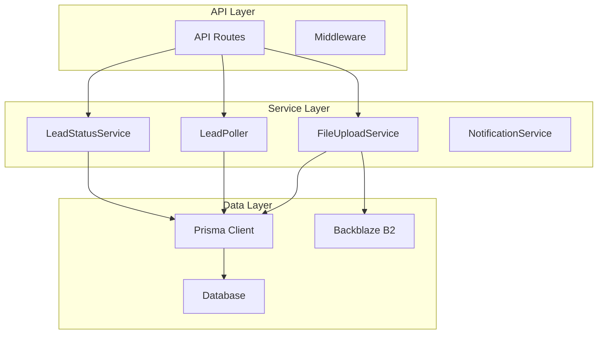
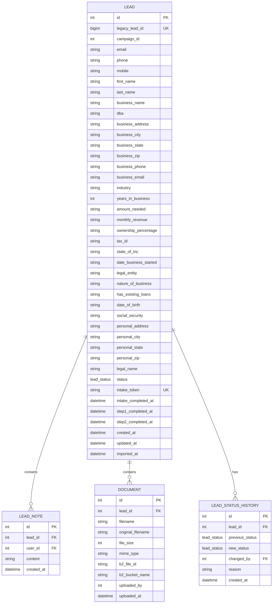
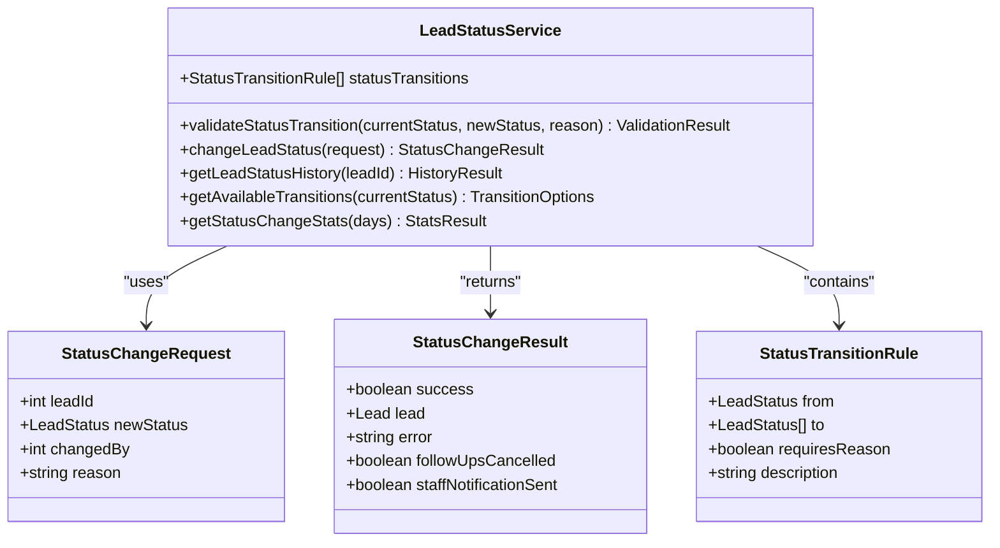
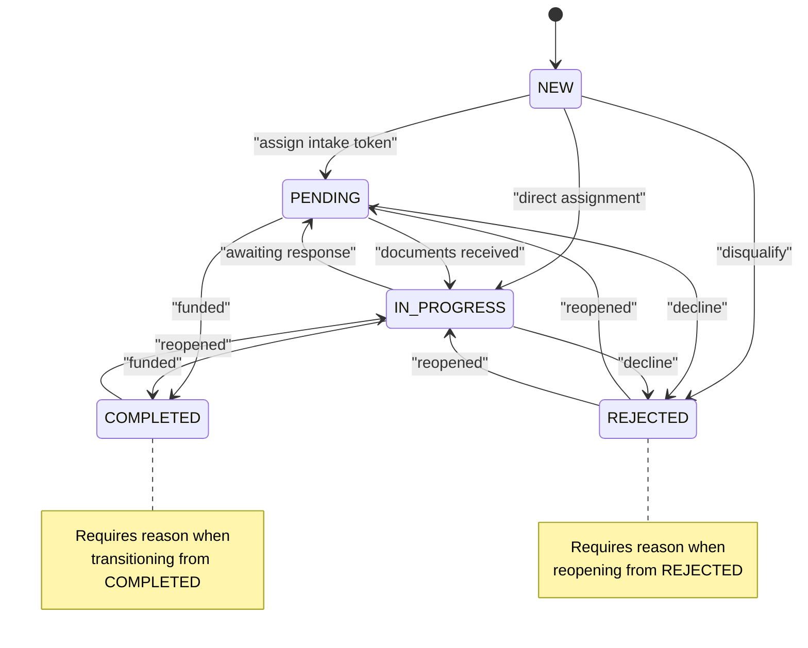
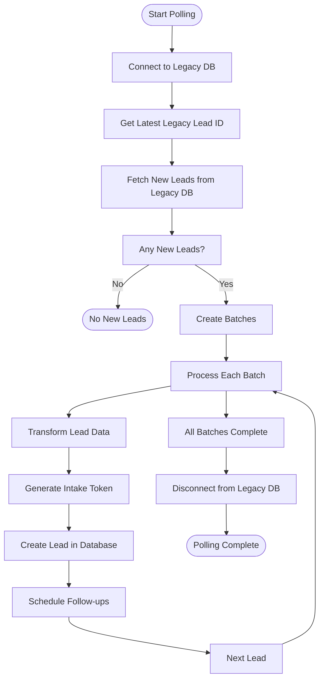
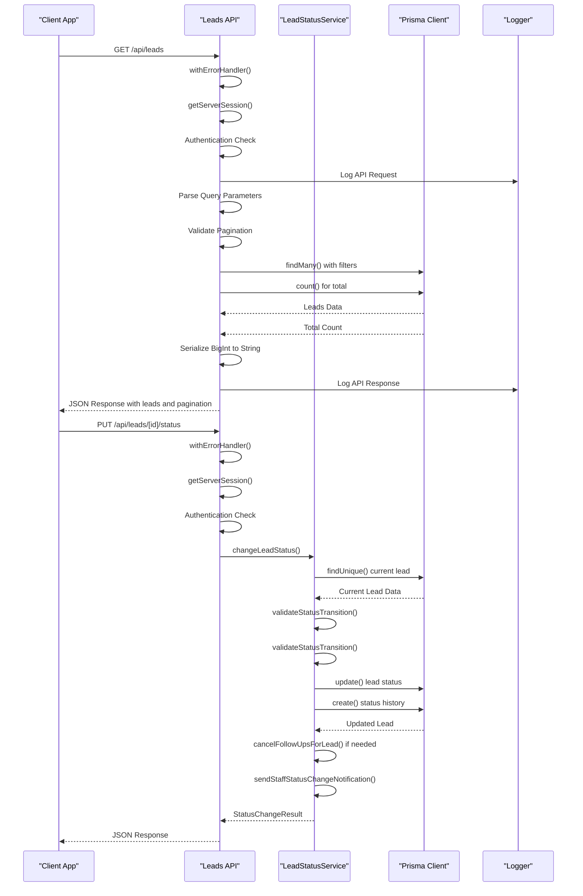
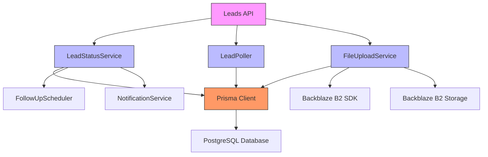

# Leads API Management

<cite>
**Referenced Files in This Document**   
- [route.ts](file://src/app/api/leads/route.ts)
- [LeadStatusService.ts](file://src/services/LeadStatusService.ts)
- [LeadPoller.ts](file://src/services/LeadPoller.ts)
- [schema.prisma](file://prisma/schema.prisma)
- [prisma.ts](file://src/lib/prisma.ts)
</cite>

## Table of Contents
1. [Introduction](#introduction)
2. [Project Structure](#project-structure)
3. [Core Components](#core-components)
4. [Architecture Overview](#architecture-overview)
5. [Detailed Component Analysis](#detailed-component-analysis)
6. [Dependency Analysis](#dependency-analysis)
7. [Performance Considerations](#performance-considerations)
8. [Troubleshooting Guide](#troubleshooting-guide)
9. [Conclusion](#conclusion)

## Introduction
This document provides comprehensive API documentation for the Leads Management System, a platform designed to manage lead data from acquisition through processing and status transitions. The system supports retrieving lead lists, creating new leads, updating lead status, adding notes, managing files, and downloading documents. It integrates with external legacy databases and Backblaze B2 for file storage. The API is built using Next.js with Prisma ORM for database operations, and follows RESTful principles with proper authentication and error handling.

## Project Structure
The project follows a modular structure with clear separation of concerns. The main components are organized into directories such as `prisma` for database schema and migrations, `src/app/api` for API routes, `src/services` for business logic, and `src/lib` for utility functions and database access.



**Diagram sources**
- [route.ts](file://src/app/api/leads/route.ts)
- [LeadStatusService.ts](file://src/services/LeadStatusService.ts)
- [LeadPoller.ts](file://src/services/LeadPoller.ts)
- [prisma.ts](file://src/lib/prisma.ts)

**Section sources**
- [route.ts](file://src/app/api/leads/route.ts)
- [schema.prisma](file://prisma/schema.prisma)

## Core Components
The core components of the Leads Management System include the Lead API endpoints, Lead Status Service for managing status transitions, Lead Poller for importing leads from legacy systems, and the Prisma data models that define the database schema. These components work together to provide a complete lead management solution with proper auditing, notifications, and integration capabilities.

**Section sources**
- [route.ts](file://src/app/api/leads/route.ts#L1-L166)
- [LeadStatusService.ts](file://src/services/LeadStatusService.ts#L1-L455)
- [LeadPoller.ts](file://src/services/LeadPoller.ts#L1-L521)
- [schema.prisma](file://prisma/schema.prisma#L1-L257)

## Architecture Overview
The Leads Management System follows a layered architecture with clear separation between API endpoints, business logic services, and data access layers. The system is designed to be scalable and maintainable, with proper error handling and logging throughout.

```mermaid
graph TD
Client[Client Application] --> API[API Layer]
API --> Service[Service Layer]
Service --> Data[Data Layer]
subgraph "API Layer"
API1[/api/leads GET/]
API2[/api/leads POST/]
API3[/api/leads/[id]/status PUT/]
API4[/api/leads/[id]/files POST/]
API5[/api/leads/[id]/documents/[id]/download GET/]
end
subgraph "Service Layer"
S1[LeadStatusService]
S2[LeadPoller]
S3[FileUploadService]
S4[NotificationService]
end
subgraph "Data Layer"
D1[Prisma Client]
D2[PostgreSQL Database]
D3[Backblaze B2 Storage]
end
API1 --> S1
API2 --> S2
API3 --> S1
API4 --> S3
API5 --> D3
S1 --> D1
S2 --> D1
S3 --> D1
S3 --> D3
D1 --> D2
```

**Diagram sources**
- [route.ts](file://src/app/api/leads/route.ts)
- [LeadStatusService.ts](file://src/services/LeadStatusService.ts)
- [LeadPoller.ts](file://src/services/LeadPoller.ts)
- [prisma.ts](file://src/lib/prisma.ts)

## Detailed Component Analysis

### Lead Data Model
The Lead data model is comprehensive, capturing both business and personal information for leads. It includes fields for contact information, business details, financial data, and system metadata.



**Diagram sources**
- [schema.prisma](file://prisma/schema.prisma#L58-L257)

**Section sources**
- [schema.prisma](file://prisma/schema.prisma#L58-L257)

### Lead Status Management
The Lead Status Service implements a state machine pattern to manage lead status transitions with validation rules, audit logging, and automated workflows.



**Diagram sources**
- [LeadStatusService.ts](file://src/services/LeadStatusService.ts#L1-L455)

**Section sources**
- [LeadStatusService.ts](file://src/services/LeadStatusService.ts#L1-L455)

### Lead Status Workflow
The lead status workflow follows a defined state transition pattern with business rules governing valid transitions between states.



**Diagram sources**
- [LeadStatusService.ts](file://src/services/LeadStatusService.ts#L1-L455)

**Section sources**
- [LeadStatusService.ts](file://src/services/LeadStatusService.ts#L1-L455)

### Lead Polling Process
The Lead Poller service handles the import of leads from legacy databases, transforming and loading them into the current system with proper error handling and batching.



**Diagram sources**
- [LeadPoller.ts](file://src/services/LeadPoller.ts#L1-L521)

**Section sources**
- [LeadPoller.ts](file://src/services/LeadPoller.ts#L1-L521)

### API Endpoint Flow
The API endpoint flow demonstrates how requests are processed from authentication through to response generation.



**Diagram sources**
- [route.ts](file://src/app/api/leads/route.ts)
- [LeadStatusService.ts](file://src/services/LeadStatusService.ts)

**Section sources**
- [route.ts](file://src/app/api/leads/route.ts#L1-L166)
- [LeadStatusService.ts](file://src/services/LeadStatusService.ts#L1-L455)

## Dependency Analysis
The Leads Management System has a well-defined dependency structure with clear boundaries between components. The API layer depends on service classes for business logic, which in turn depend on the Prisma client for data access.



**Diagram sources**
- [route.ts](file://src/app/api/leads/route.ts)
- [LeadStatusService.ts](file://src/services/LeadStatusService.ts)
- [LeadPoller.ts](file://src/services/LeadPoller.ts)
- [prisma.ts](file://src/lib/prisma.ts)

**Section sources**
- [route.ts](file://src/app/api/leads/route.ts#L1-L166)
- [LeadStatusService.ts](file://src/services/LeadStatusService.ts#L1-L455)
- [LeadPoller.ts](file://src/services/LeadPoller.ts#L1-L521)

## Performance Considerations
The system includes several performance optimizations:
- **Pagination**: The GET /api/leads endpoint supports pagination with configurable page size (1-100 items) to prevent excessive data transfer.
- **Batch Processing**: The Lead Poller processes leads in batches to minimize database transactions and improve import performance.
- **Indexing**: Database queries use indexed fields for filtering and sorting operations.
- **Caching**: While not explicitly implemented in the provided code, the architecture allows for caching layers to be added for frequently accessed data.
- **Error Handling**: Database operations are wrapped in error handling functions to prevent cascading failures and provide meaningful error messages.

The system also includes comprehensive logging for monitoring performance and troubleshooting issues, with timing information captured for API requests and database operations.

## Troubleshooting Guide
Common issues and their solutions:

**Invalid Status Transitions**: When attempting to change a lead's status, ensure the transition follows the defined rules. For example, transitioning from COMPLETED or REJECTED states requires a reason. Check the error message returned by the API for specific validation failures.

**Authentication Errors**: All API endpoints require authentication. Ensure the request includes valid session credentials. The system uses NextAuth for authentication, so verify the session is active.

**Database Connection Issues**: If the Lead Poller fails to connect to the legacy database, check the connection configuration and network connectivity. The system logs detailed error messages for database operations.

**File Upload Problems**: When uploading files, ensure the request includes proper authentication and the file size is within limits. The system integrates with Backblaze B2, so verify the storage credentials are correctly configured.

**Pagination Validation**: The API validates pagination parameters. Ensure page and limit values are positive integers, with limit not exceeding 100.

**Environment Variables**: Several features depend on environment variables (e.g., MERCHANT_FUNDING_CAMPAIGN_IDS for the Lead Poller). Verify all required environment variables are set.

**Section sources**
- [route.ts](file://src/app/api/leads/route.ts#L1-L166)
- [LeadStatusService.ts](file://src/services/LeadStatusService.ts#L1-L455)
- [LeadPoller.ts](file://src/services/LeadPoller.ts#L1-L521)

## Conclusion
The Leads Management System provides a comprehensive solution for managing leads through their lifecycle, from initial acquisition to final disposition. The API is well-structured with clear endpoints for retrieving lead lists, creating new leads, updating lead status, managing files, and accessing document downloads. The system implements robust business logic for status transitions with proper validation, audit logging, and notifications. The architecture is modular and maintainable, with clear separation of concerns between API endpoints, business services, and data access layers. The integration with legacy systems and cloud storage provides flexibility for real-world deployment scenarios.