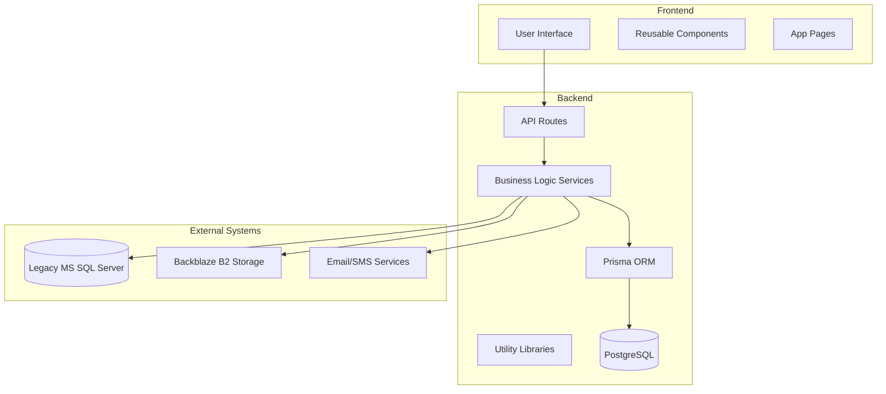
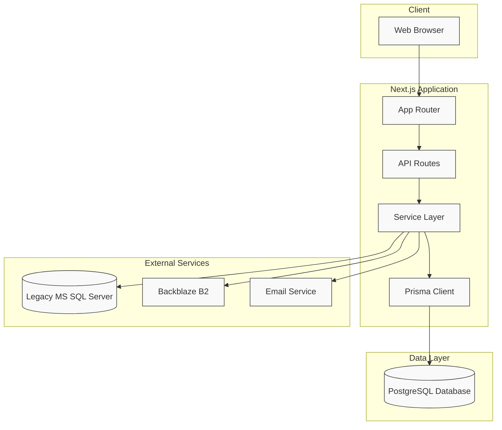
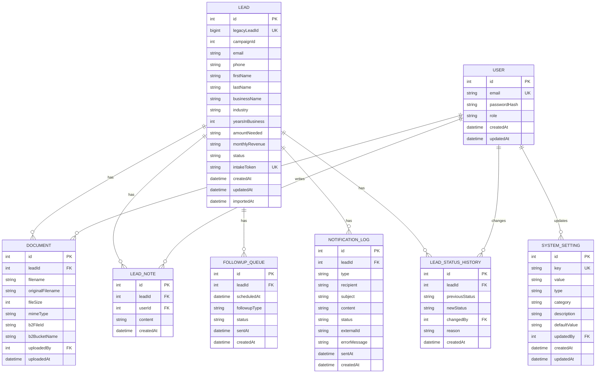
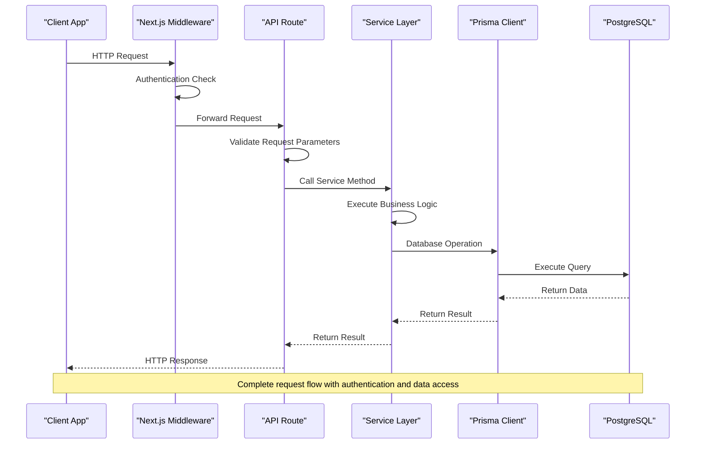
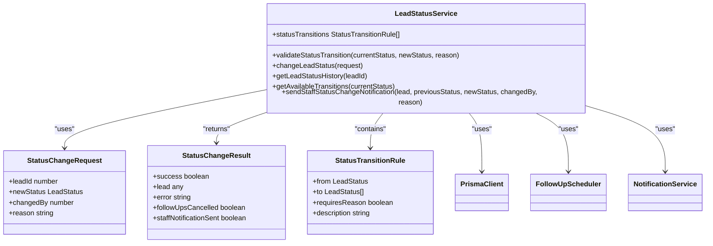
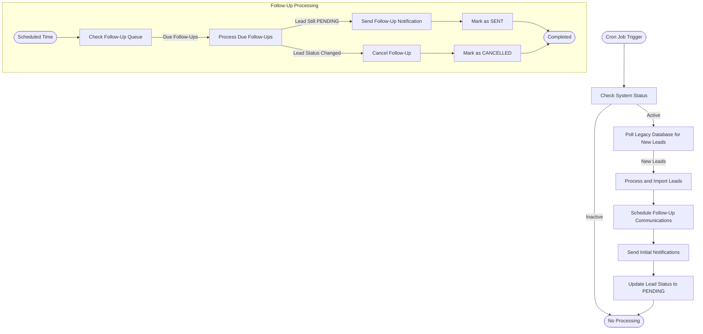
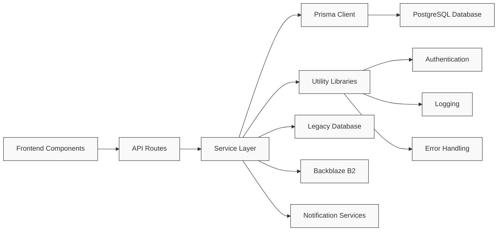

# Core Architecture

<cite>
**Referenced Files in This Document**   
- [schema.prisma](file://prisma/schema.prisma)
- [prisma.ts](file://src/lib/prisma.ts)
- [route.ts](file://src/app/api/leads/route.ts)
- [route.ts](file://src/app/api/leads/[id]/route.ts)
- [LeadStatusService.ts](file://src/services/LeadStatusService.ts)
- [LeadPoller.ts](file://src/services/LeadPoller.ts)
- [FollowUpScheduler.ts](file://src/services/FollowUpScheduler.ts)
- [route.ts](file://src/app/api/cron/poll-leads/route.ts)
- [route.ts](file://src/app/api/cron/send-followups/route.ts)
- [legacy-db.ts](file://src/lib/legacy-db.ts)
- [SystemSettingsService.ts](file://src/services/SystemSettingsService.ts)
- [route.ts](file://src/app/api/admin/settings/route.ts)
- [FileUploadService.ts](file://src/services/FileUploadService.ts)
- [route.ts](file://src/app/api/leads/[id]/files/route.ts)
- [middleware.ts](file://src/middleware.ts)
</cite>

## Table of Contents
1. [Introduction](#introduction)
2. [Project Structure](#project-structure)
3. [Core Components](#core-components)
4. [Architecture Overview](#architecture-overview)
5. [Detailed Component Analysis](#detailed-component-analysis)
6. [Dependency Analysis](#dependency-analysis)
7. [Performance Considerations](#performance-considerations)
8. [Troubleshooting Guide](#troubleshooting-guide)
9. [Conclusion](#conclusion)

## Introduction
The fund-track application is a comprehensive lead management system designed for merchant funding operations. This document provides a detailed analysis of its core architecture, which combines Next.js App Router, Prisma ORM, and TypeScript to create a robust hybrid MVC and service-oriented architecture. The system manages leads from initial intake through processing, follow-up scheduling, and final disposition, with integration to legacy databases and external notification services. The architecture emphasizes separation of concerns, with clear boundaries between frontend components, API routes as controllers, service layer for business logic, and Prisma for data access.

## Project Structure
The project follows a Next.js App Router structure with a well-organized component hierarchy. The application is divided into distinct layers: API routes under `src/app/api`, frontend components under `src/components`, business logic services under `src/services`, and data access utilities under `src/lib`. The Prisma ORM manages database interactions with a comprehensive schema that defines all data models and relationships. The structure supports both server-side rendering for dynamic content and API routes for backend functionality, creating a unified full-stack application within the Next.js framework.

**Diagram sources**
- [schema.prisma](file://prisma/schema.prisma)
- [prisma.ts](file://src/lib/prisma.ts)

## Core Components
The application's core components include the Prisma data model, API routes that serve as controllers, service classes that encapsulate business logic, and utility libraries that provide shared functionality. The Prisma schema defines a comprehensive data model with entities for leads, users, documents, follow-ups, and system settings. API routes handle HTTP requests and responses, acting as the interface between the frontend and backend. Service classes implement complex business logic such as lead status transitions, follow-up scheduling, and legacy database integration. Utility libraries provide essential functions for authentication, logging, and database error handling.

**Section sources**
- [schema.prisma](file://prisma/schema.prisma)
- [prisma.ts](file://src/lib/prisma.ts)
- [route.ts](file://src/app/api/leads/route.ts)
- [LeadStatusService.ts](file://src/services/LeadStatusService.ts)

## Architecture Overview
The fund-track application implements a hybrid architecture that combines elements of MVC (Model-View-Controller) and service-oriented architecture. Next.js App Router serves as the foundation, providing server components and API routes. The Prisma ORM acts as the data access layer, providing type-safe database operations. TypeScript ensures type safety throughout the application stack. The architecture separates concerns into distinct layers: frontend components handle presentation, API routes serve as controllers, service classes encapsulate business logic, and Prisma manages data persistence. This separation enables maintainability, testability, and scalability.

**Diagram sources**
- [schema.prisma](file://prisma/schema.prisma)
- [prisma.ts](file://src/lib/prisma.ts)
- [route.ts](file://src/app/api/leads/route.ts)

## Detailed Component Analysis

### Data Model Analysis
The application's data model is defined in the Prisma schema, which establishes a comprehensive structure for managing leads and related entities. The model includes entities for leads, users, documents, follow-ups, notifications, and system settings, with well-defined relationships between them. Each lead can have multiple notes, documents, follow-ups, and status history entries, creating a rich data structure that supports the application's business requirements.

**Diagram sources**
- [schema.prisma](file://prisma/schema.prisma)

### Request Flow Analysis
The request flow in the fund-track application follows a well-defined path from the client through middleware, authentication, API routes, service layer, and finally to the database. When a request is received, it first passes through Next.js middleware which handles authentication and routing. The API route then validates the request and checks user permissions. If authorized, the route calls the appropriate service method, which implements the business logic and interacts with the Prisma client for data operations. The response flows back through the same layers to the client.

**Diagram sources**
- [middleware.ts](file://src/middleware.ts)
- [route.ts](file://src/app/api/leads/route.ts)
- [LeadStatusService.ts](file://src/services/LeadStatusService.ts)
- [prisma.ts](file://src/lib/prisma.ts)

### Lead Status Management
The lead status management system implements a state machine pattern with defined transitions between status states. The LeadStatusService enforces business rules for valid status changes, maintains an audit trail of status history, and triggers automated actions such as follow-up scheduling and staff notifications. This component ensures data integrity and provides a clear history of lead progression through the funding pipeline.

**Diagram sources**
- [LeadStatusService.ts](file://src/services/LeadStatusService.ts)

### Background Processing System
The application implements a robust background processing system for handling time-sensitive operations such as lead polling and follow-up notifications. The system uses cron-style API endpoints that can be triggered by external schedulers. The LeadPoller service integrates with a legacy MS SQL Server database to import new leads, while the FollowUpScheduler manages automated communication with prospects at predefined intervals.

**Diagram sources**
- [route.ts](file://src/app/api/cron/poll-leads/route.ts)
- [route.ts](file://src/app/api/cron/send-followups/route.ts)
- [LeadPoller.ts](file://src/services/LeadPoller.ts)
- [FollowUpScheduler.ts](file://src/services/FollowUpScheduler.ts)

## Dependency Analysis
The fund-track application has a well-defined dependency structure with clear boundaries between components. The frontend components depend on API routes for data, which in turn depend on service classes for business logic. The service classes depend on the Prisma client for data access and utility libraries for shared functionality. External dependencies include the mssql package for legacy database connectivity, Backblaze B2 for file storage, and various Next.js and Prisma packages. The dependency graph shows a unidirectional flow from presentation to data access, preventing circular dependencies and promoting maintainability.

**Diagram sources**
- [package.json](file://package.json)
- [schema.prisma](file://prisma/schema.prisma)
- [prisma.ts](file://src/lib/prisma.ts)

## Performance Considerations
The application incorporates several performance optimizations to ensure responsiveness and scalability. The Prisma client is implemented as a singleton with connection pooling to minimize database connection overhead. The SystemSettingsService includes a caching mechanism with a 5-minute TTL to reduce database queries for frequently accessed configuration data. API routes implement pagination for list endpoints to prevent excessive data transfer. The background processing system uses batching and transactional operations to efficiently handle large volumes of leads. Database indexes are strategically applied to frequently queried fields such as lead status and creation date.

**Section sources**
- [prisma.ts](file://src/lib/prisma.ts)
- [SystemSettingsService.ts](file://src/services/SystemSettingsService.ts)
- [route.ts](file://src/app/api/leads/route.ts)

## Troubleshooting Guide
Common issues in the fund-track application typically relate to database connectivity, authentication, and external service integration. For database issues, verify the DATABASE_URL environment variable and check the Prisma connection status using the health check endpoint. Authentication problems may stem from incorrect NextAuth configuration or session management issues. When integrating with the legacy MS SQL Server database, ensure the connection parameters are correct and the server is accessible. File upload issues often relate to Backblaze B2 credentials or file size/type restrictions. The comprehensive logging system, accessible through the logger utility, provides detailed information for diagnosing and resolving issues.

**Section sources**
- [prisma.ts](file://src/lib/prisma.ts)
- [auth.ts](file://src/lib/auth.ts)
- [legacy-db.ts](file://src/lib/legacy-db.ts)
- [FileUploadService.ts](file://src/services/FileUploadService.ts)
- [logger.ts](file://src/lib/logger.ts)

## Conclusion
The fund-track application demonstrates a well-architected implementation of a modern full-stack application using Next.js, Prisma, and TypeScript. The hybrid MVC and service-oriented architecture provides a clear separation of concerns, making the codebase maintainable and extensible. The comprehensive data model supports the complex requirements of lead management, while the service layer encapsulates business logic and ensures data integrity. The integration with legacy systems and external services demonstrates the application's ability to operate in a heterogeneous environment. The architecture is scalable and production-ready, with appropriate considerations for performance, security, and reliability.