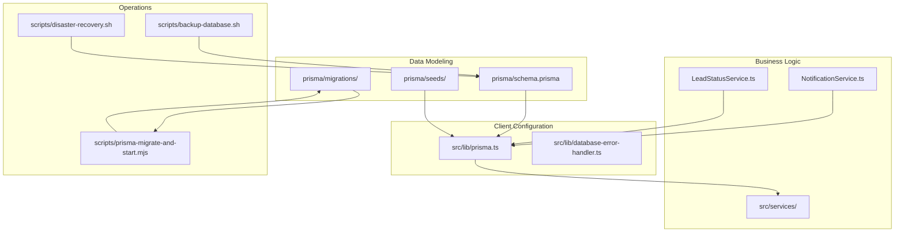
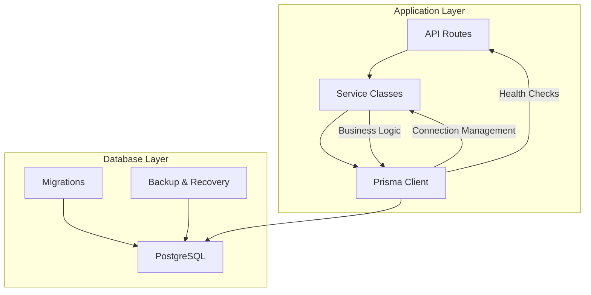
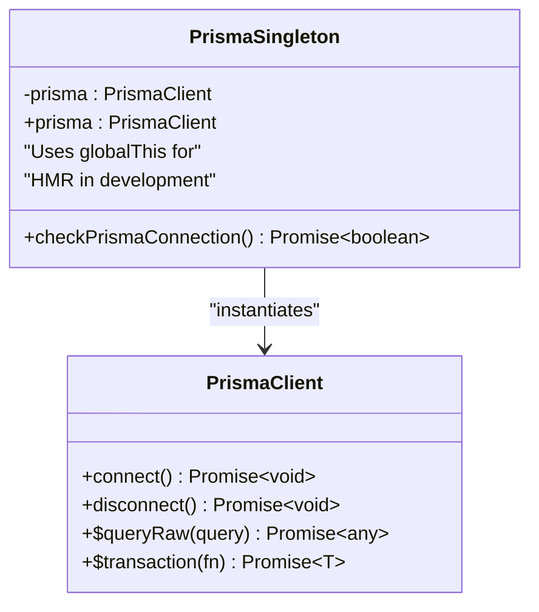
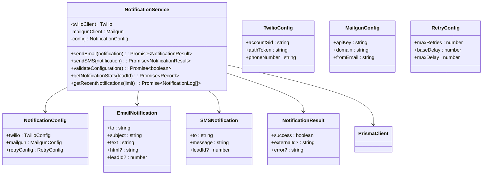
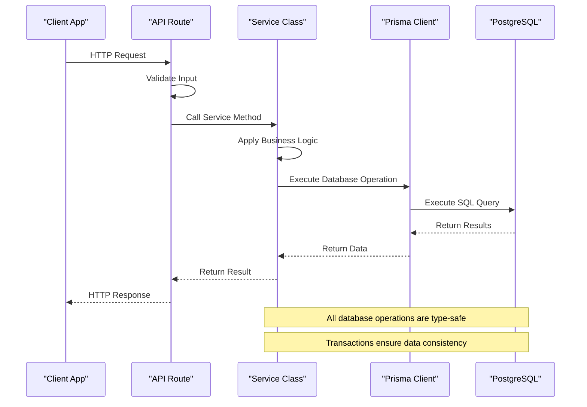
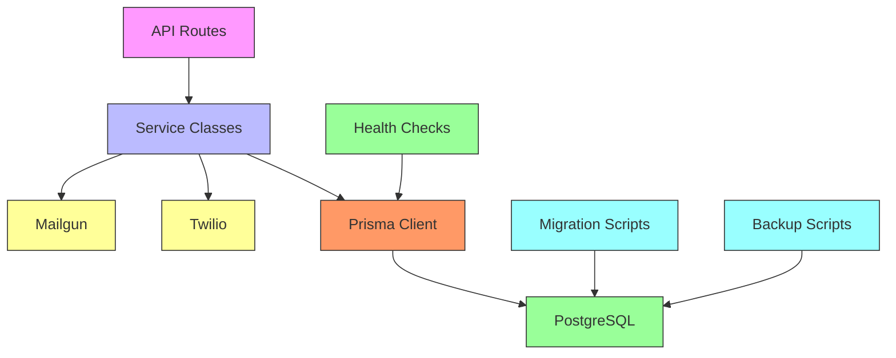
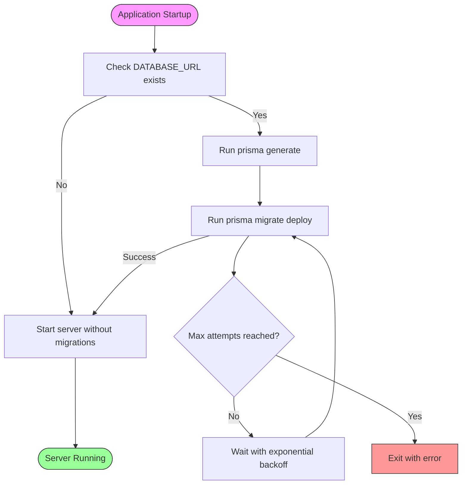

# Data Access Layer

<cite>
**Referenced Files in This Document**   
- [prisma.ts](file://src/lib/prisma.ts)
- [schema.prisma](file://prisma/schema.prisma)
- [NotificationService.ts](file://src/services/NotificationService.ts)
- [LeadStatusService.ts](file://src/services/LeadStatusService.ts)
- [backup-database.sh](file://scripts/backup-database.sh)
- [disaster-recovery.sh](file://scripts/disaster-recovery.sh)
- [add_notification_log_indexes/migration.sql](file://prisma/migrations/20250812120000_add_notification_log_indexes/migration.sql)
- [prisma-migrate-and-start.mjs](file://scripts/prisma-migrate-and-start.mjs)
</cite>

## Table of Contents
1. [Introduction](#introduction)
2. [Project Structure](#project-structure)
3. [Core Components](#core-components)
4. [Architecture Overview](#architecture-overview)
5. [Detailed Component Analysis](#detailed-component-analysis)
6. [Dependency Analysis](#dependency-analysis)
7. [Performance Considerations](#performance-considerations)
8. [Troubleshooting Guide](#troubleshooting-guide)
9. [Conclusion](#conclusion)

## Introduction
This document provides comprehensive architectural documentation for the data access layer of the fund-track application. The system leverages Prisma ORM with PostgreSQL as its primary data persistence mechanism, implementing a robust, type-safe, and maintainable approach to database interactions. The architecture follows established patterns including the repository pattern through service classes, singleton pattern for Prisma client instantiation, and production-safe migration practices. This documentation details the schema design, model relationships, query patterns, connection management, and operational procedures including backup and disaster recovery.

## Project Structure
The data access layer is organized across several key directories in the repository:
- **prisma/**: Contains the Prisma schema, migrations, and seed files
- **src/lib/**: Houses the Prisma client initialization and database utilities
- **src/services/**: Implements the repository pattern through service classes that encapsulate data access logic
- **scripts/**: Contains operational scripts for database management, backup, and recovery

The structure follows a clean separation of concerns, with data modeling, client configuration, business logic encapsulation, and operational procedures maintained in distinct locations for maintainability and clarity.



**Diagram sources**
- [prisma/schema.prisma](file://prisma/schema.prisma)
- [src/lib/prisma.ts](file://src/lib/prisma.ts)
- [src/services/NotificationService.ts](file://src/services/NotificationService.ts)
- [src/services/LeadStatusService.ts](file://src/services/LeadStatusService.ts)
- [scripts/backup-database.sh](file://scripts/backup-database.sh)
- [scripts/disaster-recovery.sh](file://scripts/disaster-recovery.sh)
- [scripts/prisma-migrate-and-start.mjs](file://scripts/prisma-migrate-and-start.mjs)

**Section sources**
- [prisma/schema.prisma](file://prisma/schema.prisma)
- [src/lib/prisma.ts](file://src/lib/prisma.ts)
- [src/services/](file://src/services/)
- [scripts/](file://scripts/)

## Core Components
The data access layer consists of several core components that work together to provide a robust and type-safe interface to the PostgreSQL database. The Prisma ORM serves as the foundation, providing type-safe database access through generated client code. The singleton pattern is implemented for the Prisma client to ensure a single connection instance across the application. Service classes implement the repository pattern, encapsulating data access logic and business rules. The migration strategy uses Prisma Migrate with production-safe practices, including retry logic and environment validation. Operational scripts provide backup, recovery, and diagnostic capabilities.

**Section sources**
- [src/lib/prisma.ts](file://src/lib/prisma.ts)
- [prisma/schema.prisma](file://prisma/schema.prisma)
- [src/services/](file://src/services/)
- [scripts/](file://scripts/)

## Architecture Overview
The data access layer architecture is designed for reliability, performance, and maintainability. At its core is the Prisma ORM, which generates a type-safe client based on the schema definition. The application uses a singleton pattern to instantiate the Prisma client, preventing multiple connections and ensuring efficient resource utilization. Service classes encapsulate data access logic, implementing the repository pattern to separate business logic from database operations. The architecture includes comprehensive error handling, connection management, and health checking capabilities. Migration operations are handled through Prisma Migrate with production-safe practices, including retry mechanisms and environment validation.



**Diagram sources**
- [src/lib/prisma.ts](file://src/lib/prisma.ts)
- [prisma/schema.prisma](file://prisma/schema.prisma)
- [src/services/](file://src/services/)

## Detailed Component Analysis

### Prisma Client Initialization and Singleton Pattern
The Prisma client is instantiated using the singleton pattern to ensure a single instance across the application lifecycle. This prevents connection leaks and ensures efficient resource utilization. The implementation includes special handling for build environments and client-side execution, preventing unnecessary database connections during static generation or in the browser.



**Diagram sources**
- [src/lib/prisma.ts](file://src/lib/prisma.ts#L0-L60)

**Section sources**
- [src/lib/prisma.ts](file://src/lib/prisma.ts#L0-L60)

### Schema Design and Model Relationships
The database schema is defined in the Prisma schema file, which describes all models, their fields, relationships, and constraints. The design follows a normalized structure with appropriate relationships between entities. The schema includes comprehensive model definitions for leads, users, notifications, documents, and system settings.

```mermaid
erDiagram
USER {
Int id PK
String email UK
String passwordHash
UserRole role
DateTime createdAt
DateTime updatedAt
}
LEAD {
Int id PK
BigInt legacyLeadId UK
Int campaignId
String? email
String? phone
String? firstName
String? lastName
String? businessName
LeadStatus status
String? intakeToken UK
DateTime? intakeCompletedAt
DateTime createdAt
DateTime updatedAt
DateTime importedAt
}
LEAD_NOTE {
Int id PK
Int leadId FK
Int userId FK
String content
DateTime createdAt
}
DOCUMENT {
Int id PK
Int leadId FK
String filename
String originalFilename
Int fileSize
String mimeType
String b2FileId
String b2BucketName
Int? uploadedBy FK
DateTime uploadedAt
}
FOLLOWUP_QUEUE {
Int id PK
Int leadId FK
DateTime scheduledAt
FollowupType followupType
FollowupStatus status
DateTime? sentAt
DateTime createdAt
}
NOTIFICATION_LOG {
Int id PK
Int? leadId FK
NotificationType type
String recipient
String? subject
String? content
NotificationStatus status
String? externalId
String? errorMessage
DateTime? sentAt
DateTime createdAt
}
LEAD_STATUS_HISTORY {
Int id PK
Int leadId FK
LeadStatus? previousStatus
LeadStatus newStatus
Int changedBy FK
String? reason
DateTime createdAt
}
SYSTEM_SETTING {
Int id PK
String key UK
String value
SystemSettingType type
SystemSettingCategory category
String description
String defaultValue
Int? updatedBy FK
DateTime createdAt
DateTime updatedAt
}
USER ||--o{ LEAD_NOTE : "writes"
USER ||--o{ DOCUMENT : "uploads"
USER ||--o{ LEAD_STATUS_HISTORY : "changes"
USER ||--o{ SYSTEM_SETTING : "updates"
LEAD ||--o{ LEAD_NOTE : "has"
LEAD ||--o{ DOCUMENT : "has"
LEAD ||--o{ FOLLOWUP_QUEUE : "has"
LEAD ||--o{ NOTIFICATION_LOG : "receives"
LEAD ||--o{ LEAD_STATUS_HISTORY : "has"
```

**Diagram sources**
- [prisma/schema.prisma](file://prisma/schema.prisma#L0-L257)

**Section sources**
- [prisma/schema.prisma](file://prisma/schema.prisma#L0-L257)

### Repository Pattern Implementation
The repository pattern is implemented through service classes that encapsulate data access logic. These services provide a clean interface for business logic while handling database operations, transactions, and error handling. The services leverage the type-safe Prisma client to ensure compile-time safety and reduce runtime errors.

#### Notification Service Analysis
The NotificationService class implements the repository pattern for handling notifications. It encapsulates the logic for sending emails and SMS messages, managing notification logs, and handling retries and rate limiting.



**Diagram sources**
- [src/services/NotificationService.ts](file://src/services/NotificationService.ts#L0-L471)

**Section sources**
- [src/services/NotificationService.ts](file://src/services/NotificationService.ts#L0-L471)

#### Lead Status Service Analysis
The LeadStatusService class implements the repository pattern for managing lead status transitions. It encapsulates business rules for valid status changes, audit logging, and automated follow-up actions.

```mermaid
classDiagram
class LeadStatusService {
-statusTransitions : StatusTransitionRule[]
+changeLeadStatus(request) : Promise~StatusChangeResult~
+getLeadStatusHistory(leadId) : Promise~{success, history}~
+getAvailableTransitions(currentStatus) : {status, description, requiresReason}[]
+getStatusChangeStats(days) : Promise~{success, totalChanges, transitions}~
}
class StatusChangeRequest {
+leadId : number
+newStatus : LeadStatus
+changedBy : number
+reason? : string
}
class StatusChangeResult {
+success : boolean
+lead? : any
+error? : string
+followUpsCancelled? : boolean
+staffNotificationSent? : boolean
}
class StatusTransitionRule {
+from : LeadStatus
+to : LeadStatus[]
+requiresReason? : boolean
+description : string
}
LeadStatusService --> StatusChangeRequest
LeadStatusService --> StatusChangeResult
LeadStatusService --> StatusTransitionRule
LeadStatusService --> PrismaClient
```

**Diagram sources**
- [src/services/LeadStatusService.ts](file://src/services/LeadStatusService.ts#L0-L455)

**Section sources**
- [src/services/LeadStatusService.ts](file://src/services/LeadStatusService.ts#L0-L455)

### Data Flow from API to Database
The data flow from API routes through services to the Prisma client and database follows a consistent pattern across the application. API routes receive requests, validate input, and delegate to service classes. Services encapsulate business logic, interact with the Prisma client for data access, and return results to the API routes.



**Diagram sources**
- [src/services/NotificationService.ts](file://src/services/NotificationService.ts#L0-L471)
- [src/services/LeadStatusService.ts](file://src/services/LeadStatusService.ts#L0-L455)
- [src/lib/prisma.ts](file://src/lib/prisma.ts#L0-L60)

## Dependency Analysis
The data access layer components have well-defined dependencies that follow the dependency inversion principle. Service classes depend on the Prisma client abstraction rather than directly on the database. The Prisma client is initialized as a singleton and made available to all components that require database access. External services like Twilio and Mailgun are injected through configuration, allowing for easy testing and replacement.



**Diagram sources**
- [src/services/](file://src/services/)
- [src/lib/prisma.ts](file://src/lib/prisma.ts)
- [scripts/](file://scripts/)

**Section sources**
- [src/services/](file://src/services/)
- [src/lib/prisma.ts](file://src/lib/prisma.ts)
- [scripts/](file://scripts/)

## Performance Considerations

### Indexing Strategies
The database includes strategic indexes to optimize query performance, particularly for frequently accessed data. The notification log table has a composite index on created_at and id columns to support efficient cursor-based pagination.

```sql
-- Add index to speed ORDER BY created_at DESC, id DESC for cursor pagination
CREATE INDEX idx_notification_log_created_at_id ON notification_log(created_at DESC, id DESC);
```

This composite index ensures optimal performance for queries that retrieve recent notifications, which is a common operation in the application's monitoring and administration interfaces.

**Section sources**
- [prisma/migrations/20250812120000_add_notification_log_indexes/migration.sql](file://prisma/migrations/20250812120000_add_notification_log_indexes/migration.sql#L0-L11)

### Query Optimization
The application employs several query optimization techniques:
- **Select field optimization**: Queries only retrieve needed fields using Prisma's select option
- **Batch operations**: Related data is loaded efficiently using include and relation queries
- **Connection pooling**: Prisma manages a connection pool to the PostgreSQL database
- **Transaction management**: Critical operations are wrapped in transactions to ensure data consistency

The Prisma client's built-in connection pooling automatically manages database connections, reusing connections and minimizing the overhead of establishing new connections for each request.

### Migration Strategy
The migration strategy uses Prisma Migrate with production-safe practices. Migrations are applied using a startup script that includes retry logic to handle temporary database connectivity issues.



**Diagram sources**
- [scripts/prisma-migrate-and-start.mjs](file://scripts/prisma-migrate-and-start.mjs#L0-L54)

**Section sources**
- [scripts/prisma-migrate-and-start.mjs](file://scripts/prisma-migrate-and-start.mjs#L0-L88)

## Troubleshooting Guide

### Database Security
Database security is maintained through several mechanisms:
- Environment variables for sensitive credentials (DATABASE_URL, API keys)
- Role-based access control through the UserRole enum
- Input validation and sanitization in service layers
- Parameterized queries through Prisma to prevent SQL injection

The application follows the principle of least privilege, with the database user having only the necessary permissions for application operations.

**Section sources**
- [src/lib/prisma.ts](file://src/lib/prisma.ts#L0-L60)
- [prisma/schema.prisma](file://prisma/schema.prisma#L0-L257)

### Backup Procedures
Regular backups are performed using the backup-database.sh script, which creates compressed PostgreSQL dumps and optionally uploads them to cloud storage.

Key features of the backup procedure:
- Daily backups with timestamped filenames
- Automatic cleanup of backups older than retention period (default: 30 days)
- Integrity verification using pg_restore
- Optional cloud storage upload (S3)
- Email notifications for backup status

```bash
# Example backup execution
./scripts/backup-database.sh
# Creates: backups/merchant_funding_backup_20250812_120000.sql
```

**Section sources**
- [scripts/backup-database.sh](file://scripts/backup-database.sh#L0-L119)

### Disaster Recovery
The disaster-recovery.sh script provides comprehensive recovery capabilities:
- Listing available backups
- Verifying backup integrity
- Creating pre-restore safety backups
- Restoring from specified or latest backup
- Running migrations after restore to ensure schema consistency

The recovery process includes multiple safety checks to prevent accidental data loss and provides clear feedback on the restoration status.

```bash
# Examples of recovery commands
./scripts/disaster-recovery.sh --list-backups
./scripts/disaster-recovery.sh --latest
./scripts/disaster-recovery.sh --restore-from ./backups/backup.sql
./scripts/disaster-recovery.sh --verify-backup ./backups/backup.sql
```

**Section sources**
- [scripts/disaster-recovery.sh](file://scripts/disaster-recovery.sh#L0-L258)

### Critical Constraints and Cascading Behaviors
The database schema includes several critical constraints and cascading behaviors to maintain data integrity:

- **Unique constraints**: Email on User, intakeToken on Lead, key on SystemSetting
- **Foreign key constraints**: All relationships between models
- **Cascade deletion**: When a Lead is deleted, related notes, documents, followups, notification logs, and status history are automatically deleted
- **Enum constraints**: Strict typing for status fields (LeadStatus, NotificationStatus, etc.)

These constraints ensure referential integrity and prevent orphaned records in the database.

**Section sources**
- [prisma/schema.prisma](file://prisma/schema.prisma#L0-L257)

## Conclusion
The data access layer of the fund-track application demonstrates a well-architected approach to database interactions using Prisma ORM with PostgreSQL. The implementation follows best practices including the singleton pattern for client instantiation, the repository pattern for business logic encapsulation, and production-safe migration strategies. The schema design is normalized with appropriate relationships and constraints to ensure data integrity. Performance is optimized through strategic indexing and query optimization techniques. Comprehensive operational procedures for backup and disaster recovery ensure data safety and business continuity. The type-safe nature of Prisma provides compile-time guarantees that reduce runtime errors and improve developer productivity. This architecture provides a solid foundation for a reliable and maintainable application.