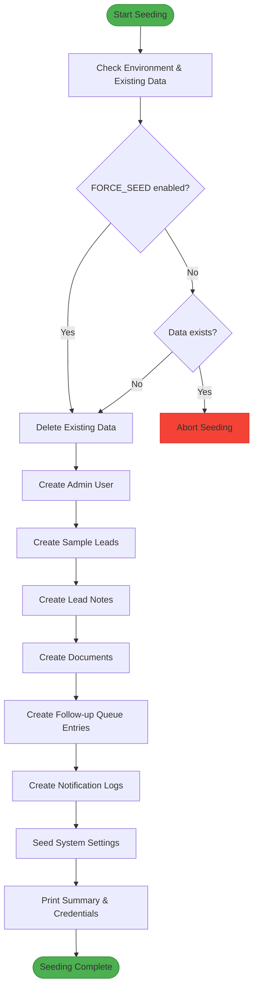
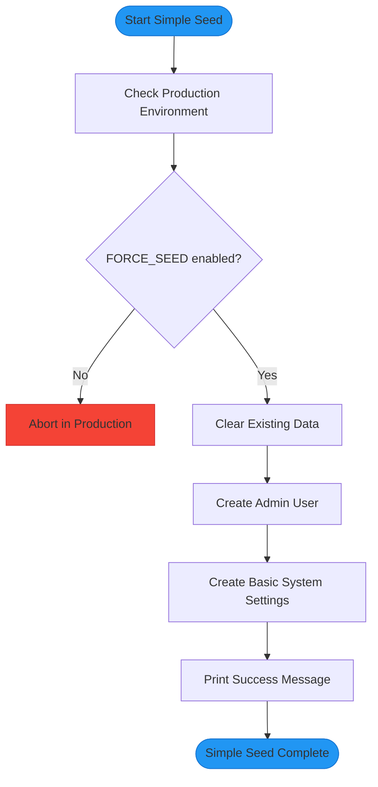
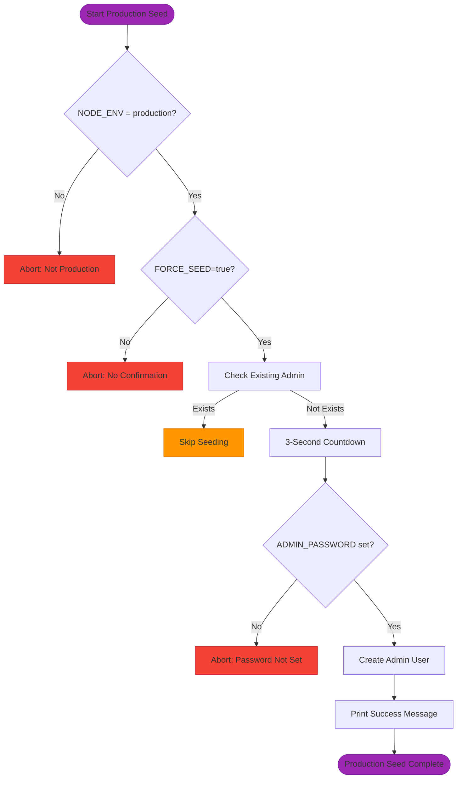
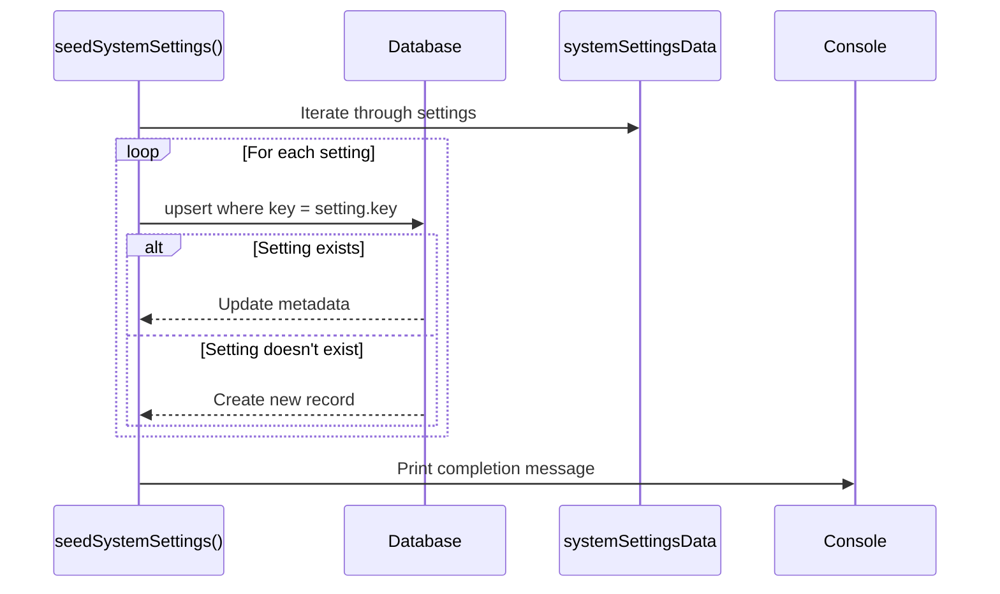
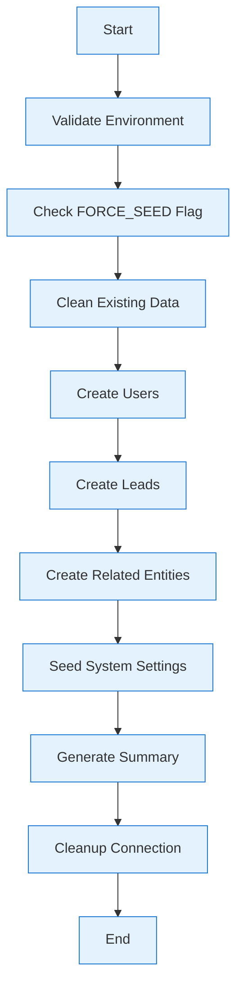
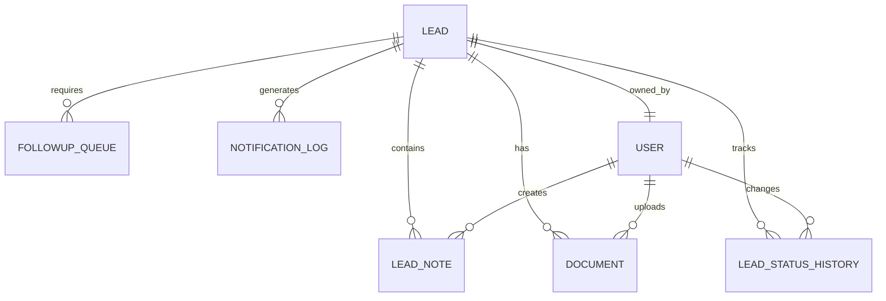
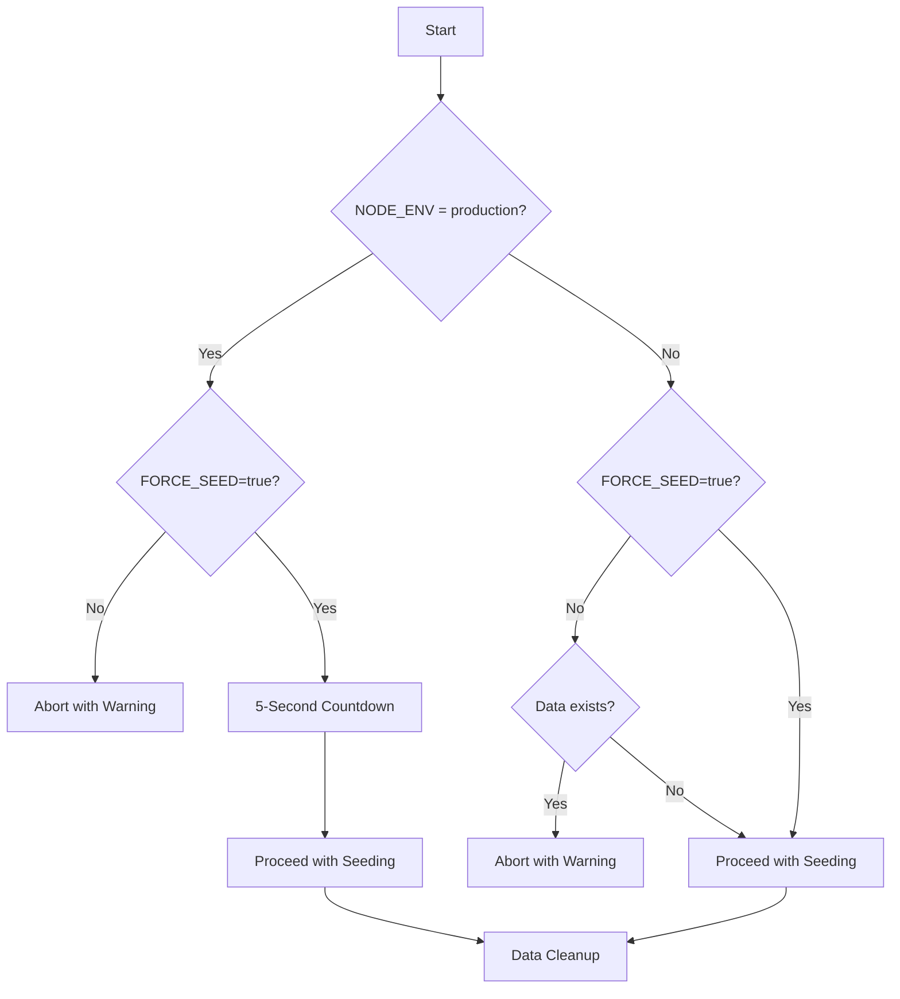

# Data Seeding

<cite>
**Referenced Files in This Document**   
- [prisma/seed.ts](file://prisma/seed.ts)
- [prisma/seed-simple.ts](file://prisma/seed-simple.ts)
- [prisma/seed-production.ts](file://prisma/seed-production.ts)
- [prisma/seeds/system-settings.ts](file://prisma/seeds/system-settings.ts)
- [package.json](file://package.json)
- [src/services/SystemSettingsService.ts](file://src/services/SystemSettingsService.ts)
</cite>

## Table of Contents
1. [Introduction](#introduction)
2. [Seed Script Overview](#seed-script-overview)
3. [System Settings Seeding](#system-settings-seeding)
4. [Seeding Workflow and Dependencies](#seeding-workflow-and-dependencies)
5. [Complex Relational Data Seeding](#complex-relational-data-seeding)
6. [Pipeline Integration](#pipeline-integration)
7. [Best Practices and Maintenance](#best-practices-and-maintenance)

## Introduction
The fund-track application implements a comprehensive data seeding mechanism to initialize the database with appropriate data for different environments. This documentation details the architecture, implementation, and best practices for the seeding system, which includes multiple seed scripts tailored for development, testing, and production environments. The system ensures referential integrity, provides type-safe defaults, and integrates seamlessly with the application's development and deployment pipelines.

## Seed Script Overview
The application provides three distinct seed scripts to accommodate different environments and use cases:

### Development Seed (seed.ts)
The primary development seed script (`prisma/seed.ts`) creates comprehensive test data for local development. It generates sample users, leads with various statuses, lead notes, documents, follow-up queue entries, and notification logs. The script includes robust safety checks to prevent accidental data deletion in production environments.



**Diagram sources**
- [prisma/seed.ts](file://prisma/seed.ts#L19-L199)

**Section sources**
- [prisma/seed.ts](file://prisma/seed.ts#L1-L511)

### Simple Seed (seed-simple.ts)
The simple seed script (`prisma/seed-simple.ts`) provides minimal test data for testing scenarios. It focuses on creating only essential entities - users and basic system settings - making it ideal for quick setup and integration tests.



**Diagram sources**
- [prisma/seed-simple.ts](file://prisma/seed-simple.ts#L1-L100)

**Section sources**
- [prisma/seed-simple.ts](file://prisma/seed-simple.ts#L1-L100)

### Production Seed (seed-production.ts)
The production seed script (`prisma/seed-production.ts`) is designed exclusively for production environments. It creates only the essential initial admin user and includes strict safety checks requiring explicit confirmation via environment variables.



**Diagram sources**
- [prisma/seed-production.ts](file://prisma/seed-production.ts#L1-L72)

**Section sources**
- [prisma/seed-production.ts](file://prisma/seed-production.ts#L1-L72)

## System Settings Seeding
The system settings seeding mechanism provides type-safe defaults for application configuration. Settings are defined with explicit types, categories, and default values to ensure consistency and prevent configuration errors.

### Settings Structure
The system settings follow a structured format with the following properties:

- **key**: Unique identifier for the setting
- **value**: Current value (stored as string)
- **type**: Data type (BOOLEAN, NUMBER, STRING, JSON)
- **category**: Functional grouping (NOTIFICATIONS, SECURITY, etc.)
- **description**: Human-readable explanation
- **defaultValue**: Fallback value if not explicitly set

```typescript
export const systemSettingsData = [
  {
    key: 'sms_notifications_enabled',
    value: 'false',
    type: SystemSettingType.BOOLEAN,
    category: SystemSettingCategory.NOTIFICATIONS,
    description: 'Enable or disable SMS notifications globally',
    defaultValue: 'true',
  },
  {
    key: 'email_notifications_enabled',
    value: 'false',
    type: SystemSettingType.BOOLEAN,
    category: SystemSettingCategory.NOTIFICATIONS,
    description: 'Enable or disable email notifications globally',
    defaultValue: 'true',
  },
  // Additional settings...
];
```

### Seeding Implementation
The `seedSystemSettings()` function uses Prisma's `upsert` operation to ensure settings exist with the correct configuration. This approach prevents duplication while allowing updates to metadata like descriptions and default values.



**Diagram sources**
- [prisma/seeds/system-settings.ts](file://prisma/seeds/system-settings.ts#L1-L74)

**Section sources**
- [prisma/seeds/system-settings.ts](file://prisma/seeds/system-settings.ts#L1-L74)

## Seeding Workflow and Dependencies
The seeding workflow follows a structured process that ensures data integrity and proper dependency management.

### Execution Flow
The seeding process begins with environment validation, followed by data cleanup, entity creation, and final summary reporting. Each step is designed to handle errors gracefully and provide clear feedback.



### Package.json Integration
The seed scripts are integrated into the application's npm scripts, providing convenient execution commands:

```json
"scripts": {
  "db:seed": "tsx prisma/seed.ts",
  "db:seed:force": "FORCE_SEED=true tsx prisma/seed.ts",
  "db:seed:simple": "FORCE_SEED=true tsx prisma/seed-simple.ts",
  "db:seed:prod": "tsx prisma/seed-production.ts"
}
```

This integration allows developers to execute seeding with simple commands:
- `npm run db:seed` - Standard development seeding
- `npm run db:seed:force` - Force seeding (deletes existing data)
- `npm run db:seed:simple` - Minimal test data
- `npm run db:seed:prod` - Production initialization

**Section sources**
- [package.json](file://package.json#L1-L70)
- [prisma/seed.ts](file://prisma/seed.ts#L78-L122)

## Complex Relational Data Seeding
The seeding mechanism demonstrates sophisticated handling of relational data, particularly with leads and their associated entities.

### Lead Entity Relationships
Each lead can have multiple related entities that form a rich data graph:



### Seeding Strategy
The seeding process follows a specific order to maintain referential integrity:

1. **Users**: Created first as they are referenced by other entities
2. **Leads**: Created with references to users
3. **Related Entities**: Created with references to leads and users
4. **System Settings**: Seeded last as they are independent

```typescript
// Example: Creating a lead with documents and notes
const lead = await prisma.lead.create({
  data: {
    legacyLeadId: 1001,
    email: "john.doe@example.com",
    firstName: "John",
    lastName: "Doe",
    status: LeadStatus.COMPLETED,
    // ... other fields
  },
});

// Create documents for the lead
await prisma.document.create({
  data: {
    leadId: lead.id,
    filename: "bank_statement.pdf",
    originalFilename: "January Statement.pdf",
    fileSize: 1024000,
    mimeType: "application/pdf",
    uploadedBy: null,
  },
});

// Create notes for the lead
await prisma.leadNote.create({
  data: {
    leadId: lead.id,
    userId: adminUser.id,
    content: "Initial review completed.",
  },
});
```

**Section sources**
- [prisma/seed.ts](file://prisma/seed.ts#L200-L399)

## Pipeline Integration
The seeding system is designed to integrate seamlessly with development and deployment pipelines through several key mechanisms.

### Safety Mechanisms
The system implements multiple safety checks to prevent accidental data loss:

- **Environment Detection**: Scripts check `NODE_ENV` to identify production
- **Force Confirmation**: Requires `FORCE_SEED=true` environment variable
- **User Confirmation**: Production seeding includes countdown with cancellation option
- **Data Existence Check**: Prevents seeding if data already exists



### Timeout Protection
All seed scripts include timeout protection to prevent hanging processes:

```typescript
// 5-minute timeout for main seed
const SEED_TIMEOUT = 5 * 60 * 1000;
const seedTimeout = setTimeout(() => {
  console.error("❌ Seed operation timed out after 5 minutes");
  process.exit(1);
}, SEED_TIMEOUT);

// Cleanup on completion
main()
  .then(() => {
    clearTimeout(seedTimeout);
  })
  .catch((e) => {
    clearTimeout(seedTimeout);
    process.exit(1);
  });
```

**Section sources**
- [prisma/seed.ts](file://prisma/seed.ts#L45-L76)
- [prisma/seed.ts](file://prisma/seed.ts#L489-L509)

## Best Practices and Maintenance
The seeding system follows several best practices to ensure reliability, maintainability, and safety.

### Referential Integrity
The system maintains referential integrity through:

- **Ordered Cleanup**: Entities are deleted in reverse order of dependencies
- **Transaction Safety**: Related operations use Prisma transactions
- **Foreign Key Enforcement**: Database constraints prevent orphaned records

```typescript
// Clean in dependency order (respecting foreign keys)
await prisma.notificationLog.deleteMany();
await prisma.followupQueue.deleteMany();
await prisma.document.deleteMany();
await prisma.leadNote.deleteMany();
await prisma.leadStatusHistory.deleteMany();
await prisma.lead.deleteMany();
await prisma.systemSetting.deleteMany();
await prisma.user.deleteMany();
```

### Conflict Avoidance with Migrations
The seeding system avoids conflicts with database migrations by:

- **Separate Concerns**: Migrations handle schema changes, seeding handles data
- **Migration Lock**: Prisma's migration lock prevents concurrent operations
- **Idempotent Operations**: Use `upsert` for settings to prevent duplication

### Extension Guidelines
To extend seed scripts for new environments or testing scenarios:

1. **Create New Script**: Copy existing script and modify for specific needs
2. **Add npm Script**: Register in `package.json` with descriptive name
3. **Implement Safety Checks**: Include appropriate environment validation
4. **Document Usage**: Add comments explaining the script's purpose

### Testing Considerations
For testing scenarios, consider:

- **Use seed-simple.ts**: For fast setup in CI/CD pipelines
- **Environment Variables**: Configure settings via environment variables
- **Data Isolation**: Ensure test data doesn't interfere with other environments

**Section sources**
- [prisma/seed.ts](file://prisma/seed.ts#L78-L122)
- [prisma/seed.ts](file://prisma/seed.ts#L453-L487)
- [src/services/SystemSettingsService.ts](file://src/services/SystemSettingsService.ts#L241-L289)