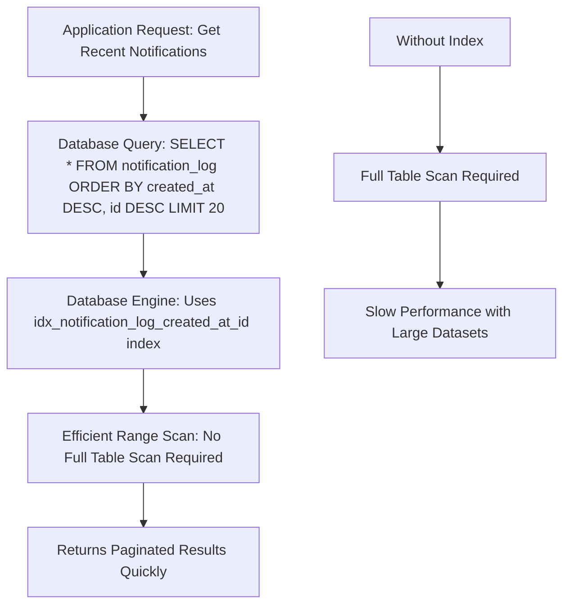
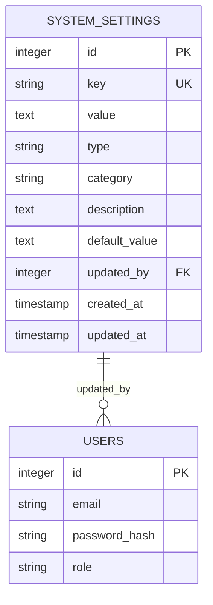
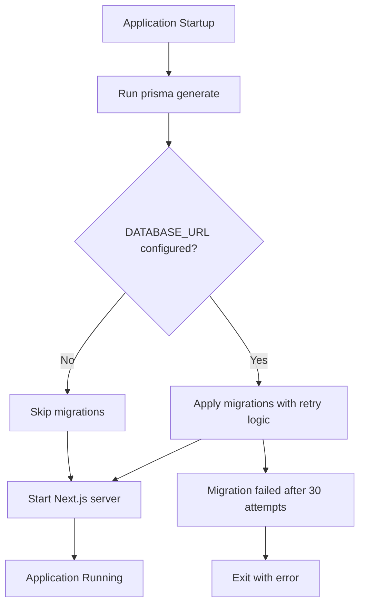
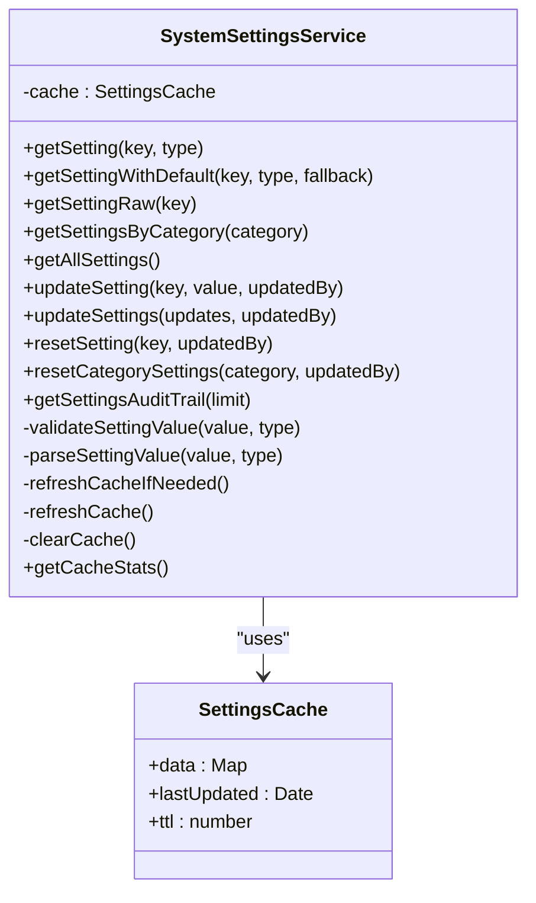
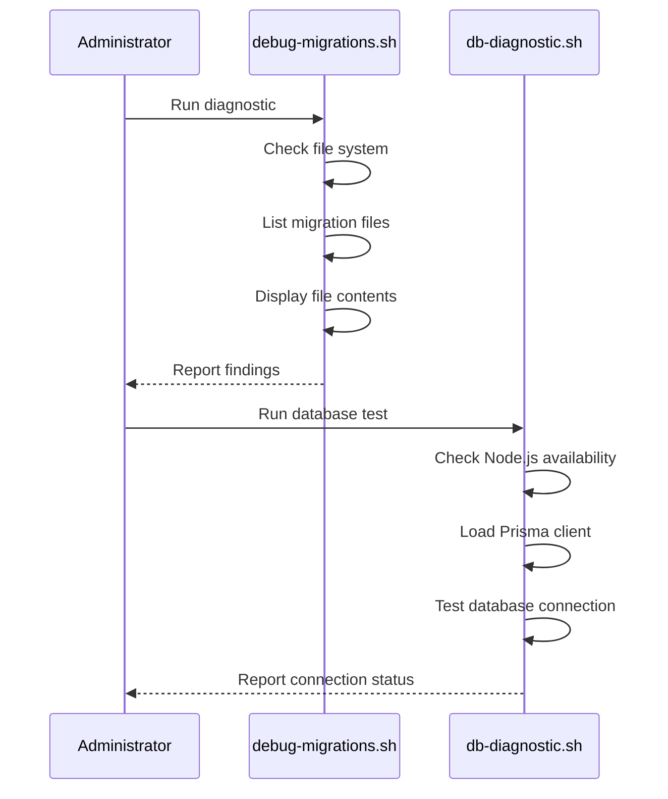

# Migration Strategy

<cite>
**Referenced Files in This Document**   
- [prisma/migrations/20240101000000_init/migration.sql](file://prisma/migrations/20240101000000_init/migration.sql)
- [prisma/migrations/20250728210021_initial_migration/migration.sql](file://prisma/migrations/20250728210021_initial_migration/migration.sql)
- [prisma/migrations/20250730060039_add_lead_status_history/migration.sql](file://prisma/migrations/20250730060039_add_lead_status_history/migration.sql)
- [prisma/migrations/20250811125856_add_system_settings/migration.sql](file://prisma/migrations/20250811125856_add_system_settings/migration.sql)
- [prisma/migrations/20250811140542_remove_security_settings/migration.sql](file://prisma/migrations/20250811140542_remove_security_settings/migration.sql)
- [prisma/migrations/20250811142825_remove_extra_categories/migration.sql](file://prisma/migrations/20250811142825_remove_extra_categories/migration.sql)
- [prisma/migrations/20250811152328_cleanup_unused_settings/migration.sql](file://prisma/migrations/20250811152328_cleanup_unused_settings/migration.sql)
- [prisma/migrations/20250812120000_add_notification_log_indexes/migration.sql](file://prisma/migrations/20250812120000_add_notification_log_indexes/migration.sql)
- [prisma/migrations/20250826082902_add_lead_business_fields/migration.sql](file://prisma/migrations/20250826082902_add_lead_business_fields/migration.sql)
- [prisma/migrations/20250826121117_add_comprehensive_lead_fields/migration.sql](file://prisma/migrations/20250826121117_add_comprehensive_lead_fields/migration.sql)
- [prisma/migrations/20250826125518_add_mobile_field/migration.sql](file://prisma/migrations/20250826125518_add_mobile_field/migration.sql)
- [prisma/migrations/20250826203101_change_amount_and_revenue_to_string/migration.sql](file://prisma/migrations/20250826203101_change_amount_and_revenue_to_string/migration.sql)
- [prisma/migrations/migration_lock.toml](file://prisma/migrations/migration_lock.toml)
- [scripts/prisma-migrate-and-start.mjs](file://scripts/prisma-migrate-and-start.mjs)
- [scripts/debug-migrations.sh](file://scripts/debug-migrations.sh)
- [scripts/db-diagnostic.sh](file://scripts/db-diagnostic.sh)
- [prisma/seeds/system-settings.ts](file://prisma/seeds/system-settings.ts)
- [prisma/seed.ts](file://prisma/seed.ts)
- [prisma/seed-simple.ts](file://prisma/seed-simple.ts)
- [src/services/SystemSettingsService.ts](file://src/services/SystemSettingsService.ts)
- [src/app/api/admin/settings/route.ts](file://src/app/api/admin/settings/route.ts)
- [src/app/api/admin/settings/audit/route.ts](file://src/app/api/admin/settings/audit/route.ts)
- [src/app/admin/settings/page.tsx](file://src/app/admin/settings/page.tsx)
- [src/components/admin/SettingsCard.tsx](file://src/components/admin/SettingsCard.tsx)
- [src/components/admin/SettingInput.tsx](file://src/components/admin/SettingInput.tsx)
- [src/components/admin/SettingsAuditLog.tsx](file://src/components/admin/SettingsAuditLog.tsx)
</cite>

## Table of Contents
1. [Migration Workflow Overview](#migration-workflow-overview)
2. [Migration Scripts and Directory Structure](#migration-scripts-and-directory-structure)
3. [Significant Migration Analysis](#significant-migration-analysis)
4. [Migration Lock File](#migration-lock-file)
5. [Production-Safe Practices](#production-safe-practices)
6. [Automated Deployment Process](#automated-deployment-process)
7. [Staging and Testing Environment](#staging-and-testing-environment)
8. [Migration Diagnostics and Troubleshooting](#migration-diagnostics-and-troubleshooting)
9. [Best Practices for Migration Development](#best-practices-for-migration-development)

## Migration Workflow Overview

The fund-track application implements a robust database migration strategy using Prisma Migrate to manage schema evolution from development through to production deployment. The workflow follows a structured process that ensures database schema changes are applied consistently and safely across environments. Developers create migration scripts locally using Prisma's migration commands, which are then committed to version control. These migrations are automatically applied during deployment through a dedicated startup script that handles database connectivity and migration execution with retry logic. The system incorporates multiple safety mechanisms including idempotent operations, rollback procedures, and comprehensive diagnostic tools to ensure migration reliability and data integrity.

**Section sources**
- [scripts/prisma-migrate-and-start.mjs](file://scripts/prisma-migrate-and-start.mjs#L1-L90)

## Migration Scripts and Directory Structure

The migration scripts are organized in the `prisma/migrations` directory, with each migration represented as a timestamped subdirectory containing a `migration.sql` file. This structure ensures chronological ordering and prevents naming conflicts. The directory contains a sequence of migrations that document the evolution of the database schema:

- `20240101000000_init`: Initial database schema
- `20250728210021_initial_migration`: Subsequent initial migration
- `20250730060039_add_lead_status_history`: Adds lead status history tracking
- `20250811125856_add_system_settings`: Introduces system settings functionality
- `20250811140542_remove_security_settings`: Removes security settings category
- `20250811142825_remove_extra_categories`: Removes additional unused categories
- `20250811152328_cleanup_unused_settings`: Cleans up unused settings
- `20250812120000_add_notification_log_indexes`: Adds performance indexes to notification logs
- `20250826082902_add_lead_business_fields`: Adds business-related lead fields
- `20250826121117_add_comprehensive_lead_fields`: Adds comprehensive lead fields
- `20250826125518_add_mobile_field`: Adds mobile field to leads
- `20250826203101_change_amount_and_revenue_to_string`: Changes amount and revenue fields to string type

Each migration directory contains a SQL file with the specific schema changes, allowing for precise control over the database modifications. This organized structure enables developers to understand the historical progression of the database schema and facilitates collaboration among team members.

**Section sources**
- [prisma/migrations/20240101000000_init/migration.sql](file://prisma/migrations/20240101000000_init/migration.sql)
- [prisma/migrations/20250728210021_initial_migration/migration.sql](file://prisma/migrations/20250728210021_initial_migration/migration.sql)
- [prisma/migrations/20250730060039_add_lead_status_history/migration.sql](file://prisma/migrations/20250730060039_add_lead_status_history/migration.sql)
- [prisma/migrations/20250811125856_add_system_settings/migration.sql](file://prisma/migrations/20250811125856_add_system_settings/migration.sql)
- [prisma/migrations/20250811140542_remove_security_settings/migration.sql](file://prisma/migrations/20250811140542_remove_security_settings/migration.sql)
- [prisma/migrations/20250811142825_remove_extra_categories/migration.sql](file://prisma/migrations/20250811142825_remove_extra_categories/migration.sql)
- [prisma/migrations/20250811152328_cleanup_unused_settings/migration.sql](file://prisma/migrations/20250811152328_cleanup_unused_settings/migration.sql)
- [prisma/migrations/20250812120000_add_notification_log_indexes/migration.sql](file://prisma/migrations/20250812120000_add_notification_log_indexes/migration.sql)
- [prisma/migrations/20250826082902_add_lead_business_fields/migration.sql](file://prisma/migrations/20250826082902_add_lead_business_fields/migration.sql)
- [prisma/migrations/20250826121117_add_comprehensive_lead_fields/migration.sql](file://prisma/migrations/20250826121117_add_comprehensive_lead_fields/migration.sql)
- [prisma/migrations/20250826125518_add_mobile_field/migration.sql](file://prisma/migrations/20250826125518_add_mobile_field/migration.sql)
- [prisma/migrations/20250826203101_change_amount_and_revenue_to_string/migration.sql](file://prisma/migrations/20250826203101_change_amount_and_revenue_to_string/migration.sql)

## Significant Migration Analysis

### Add Notification Log Indexes

The `20250812120000_add_notification_log_indexes` migration implements a critical performance optimization by adding an index to the `notification_log` table. This index is specifically designed to support efficient cursor-based pagination, which is essential for applications that display large datasets in a paginated manner. The migration creates a composite index on `created_at DESC, id DESC`, which aligns with the typical query pattern for retrieving the most recent notifications first. This optimization significantly improves query performance for operations that retrieve notifications in chronological order, reducing database load and improving response times for users accessing notification history.



**Diagram sources**
- [prisma/migrations/20250812120000_add_notification_log_indexes/migration.sql](file://prisma/migrations/20250812120000_add_notification_log_indexes/migration.sql)

**Section sources**
- [prisma/migrations/20250812120000_add_notification_log_indexes/migration.sql](file://prisma/migrations/20250812120000_add_notification_log_indexes/migration.sql)

### Add System Settings

The `20250811125856_add_system_settings` migration introduces a flexible system settings framework that allows for runtime configuration of application behavior. This migration creates a `system_settings` table with fields for key, value, type, category, description, and default value, enabling the storage of various configuration options. The migration also defines two ENUM types: `system_setting_type` (boolean, string, number, json) and `system_setting_category` (notifications, lead_management, security, file_uploads, performance, integrations), which provide type safety and organizational structure for settings. This schema design supports a wide range of configuration needs while maintaining data integrity through proper typing and constraints.



**Diagram sources**
- [prisma/migrations/20250811125856_add_system_settings/migration.sql](file://prisma/migrations/20250811125856_add_system_settings/migration.sql)

**Section sources**
- [prisma/migrations/20250811125856_add_system_settings/migration.sql](file://prisma/migrations/20250811125856_add_system_settings/migration.sql)
- [src/services/SystemSettingsService.ts](file://src/services/SystemSettingsService.ts#L0-L351)
- [src/app/admin/settings/page.tsx](file://src/app/admin/settings/page.tsx#L0-L264)

### Restructure System Settings

Following the initial implementation of system settings, a series of cleanup migrations were executed to refine the configuration structure:

- `20250811140542_remove_security_settings`: Removes the security settings category, likely due to a redesign of security configuration or migration to a different system
- `20250811142825_remove_extra_categories`: Removes additional unused categories, streamlining the settings organization
- `20250811152328_cleanup_unused_settings`: Cleans up any remaining unused settings, ensuring the configuration system remains lean and maintainable

These migrations demonstrate a commitment to maintaining a clean and purposeful database schema, removing obsolete elements to reduce complexity and potential confusion.

**Section sources**
- [prisma/migrations/20250811140542_remove_security_settings/migration.sql](file://prisma/migrations/20250811140542_remove_security_settings/migration.sql)
- [prisma/migrations/20250811142825_remove_extra_categories/migration.sql](file://prisma/migrations/20250811142825_remove_extra_categories/migration.sql)
- [prisma/migrations/20250811152328_cleanup_unused_settings/migration.sql](file://prisma/migrations/20250811152328_cleanup_unused_settings/migration.sql)

### Change Amount and Revenue to String

The `20250826203101_change_amount_and_revenue_to_string` migration represents a significant data model change, altering the `amount_needed` and `monthly_revenue` columns in the `leads` table from their previous data type to TEXT. This change suggests a shift in how financial data is handled, possibly to accommodate more flexible formatting, international currency symbols, or non-numeric values. While this provides greater flexibility in data entry, it requires additional validation and parsing logic in the application layer to ensure data consistency and enable proper calculations. This migration highlights the trade-offs between schema flexibility and data integrity, requiring careful consideration of the implications for data processing and reporting.

**Section sources**
- [prisma/migrations/20250826203101_change_amount_and_revenue_to_string/migration.sql](file://prisma/migrations/20250826203101_change_amount_and_revenue_to_string/migration.sql)

## Migration Lock File

The `migration_lock.toml` file plays a crucial role in ensuring migration consistency and preventing concurrent migration execution. Located in the `prisma/migrations` directory, this file is automatically generated and maintained by Prisma Migrate. It contains metadata about the migration system, including the database provider (postgresql in this case). The lock file serves several important purposes:

1. **Prevents Concurrent Execution**: By acting as a coordination mechanism, it helps prevent multiple instances of the application from attempting to run migrations simultaneously, which could lead to conflicts and database corruption.

2. **Ensures Migration Order**: The lock file helps maintain the correct order of migration execution, ensuring that migrations are applied in the sequence they were created.

3. **Version Control Integration**: As a file intended to be committed to version control, it provides a consistent reference point for all team members, ensuring everyone is working with the same migration state.

4. **Deployment Consistency**: During deployment, the lock file helps verify that the migration state matches what is expected, reducing the risk of deployment issues.

The presence of this file in version control (as indicated by the comment in the file) ensures that all developers and deployment environments have a consistent view of the migration state.

**Section sources**
- [prisma/migrations/migration_lock.toml](file://prisma/migrations/migration_lock.toml)

## Production-Safe Practices

The migration strategy incorporates several production-safe practices to minimize risk and ensure data integrity:

### Idempotent Migrations

The deployment process uses the `prisma migrate deploy` command within the `prisma-migrate-and-start.mjs` script, which is designed to be idempotent. This means that running the same migration multiple times will not cause errors or duplicate changes, as Prisma tracks which migrations have already been applied to the database. This is critical for production environments where deployment processes might be retried due to transient failures.

### Retry Logic and Connection Handling

The `prisma-migrate-and-start.mjs` script implements robust retry logic to handle temporary database connectivity issues during deployment. The script attempts to apply migrations up to 30 times (configurable via `PRISMA_MIGRATE_MAX_ATTEMPTS`) with a 2-second backoff (configurable via `PRISMA_MIGRATE_BACKOFF_MS`) between attempts. This approach accommodates scenarios where the database might not be immediately available when the application starts, such as during container orchestration or cloud deployment.

```mermaid
sequenceDiagram
participant App as Application Startup
participant Prisma as Prisma Migrate
participant DB as Database
App->>Prisma : Start migration process
loop Up to 30 attempts
Prisma->>DB : Attempt connection and migration
alt Connection successful
DB-->>Prisma : Migration applied
Prisma-->>App : Success
break Continue to application start
else Connection failed
Prisma->>Prisma : Wait 2 seconds
Note right of Prisma : Retry with exponential backoff
end
end
alt All attempts failed
Prisma-->>App : Error, exit process
end
```

**Diagram sources**
- [scripts/prisma-migrate-and-start.mjs](file://scripts/prisma-migrate-and-start.mjs#L1-L90)

**Section sources**
- [scripts/prisma-migrate-and-start.mjs](file://scripts/prisma-migrate-and-start.mjs#L1-L90)

### Rollback Procedures

While the documentation does not explicitly show rollback migration scripts, the system incorporates several mechanisms that support safe rollback:

1. **Migration History Tracking**: Prisma maintains a `_prisma_migrations` table that records all applied migrations, allowing for audit and potential manual rollback if necessary.

2. **Schema Version Control**: Since all migration scripts are stored in version control, rolling back to a previous application version typically involves reverting to the corresponding database schema state.

3. **Data Backup Procedures**: The presence of backup scripts like `backup-database.sh` suggests that regular database backups are performed, providing a safety net for catastrophic failures.

## Automated Deployment Process

The deployment process is automated through the `prisma-migrate-and-start.mjs` script, which orchestrates the entire startup sequence:

1. **Prisma Client Generation**: The script first runs `prisma generate` to ensure the Prisma client is up to date with the current schema. This step is idempotent and fast when the client is already generated.

2. **Database Migration**: If a `DATABASE_URL` is configured, the script proceeds to apply pending migrations using `prisma migrate deploy` with retry logic.

3. **Application Startup**: Once migrations are successfully applied (or skipped if no database is configured), the script starts the Next.js server.

This automated process ensures that database schema changes are seamlessly integrated into the deployment workflow, reducing the risk of human error and ensuring consistency across environments.



**Diagram sources**
- [scripts/prisma-migrate-and-start.mjs](file://scripts/prisma-migrate-and-start.mjs#L1-L90)

**Section sources**
- [scripts/prisma-migrate-and-start.mjs](file://scripts/prisma-migrate-and-start.mjs#L1-L90)

## Staging and Testing Environment

The system includes comprehensive tools for testing migrations in staging environments and diagnosing issues:

### System Settings Management

The application provides a complete system for managing configuration settings through both code and UI. The `SystemSettingsService` class implements a caching layer with a 5-minute TTL to balance performance and freshness. Settings are categorized (NOTIFICATIONS, CONNECTIVITY, etc.) and can be managed through an admin interface that includes audit logging.



**Diagram sources**
- [src/services/SystemSettingsService.ts](file://src/services/SystemSettingsService.ts#L0-L351)

**Section sources**
- [src/services/SystemSettingsService.ts](file://src/services/SystemSettingsService.ts#L0-L351)
- [src/app/api/admin/settings/route.ts](file://src/app/api/admin/settings/route.ts#L0-L107)
- [src/app/admin/settings/page.tsx](file://src/app/admin/settings/page.tsx#L0-L264)

### Seed Data Management

The system includes multiple seed scripts for initializing data in different environments:

- `seed.ts`: Comprehensive seeding for development, with safety checks to prevent accidental data deletion in production
- `seed-simple.ts`: Simplified seeding for testing, with FORCE_SEED protection
- `seed-production.ts`: Production-specific seeding
- `seeds/system-settings.ts`: System settings seed data

These scripts demonstrate a thoughtful approach to data initialization, with appropriate safeguards for production environments.

**Section sources**
- [prisma/seed.ts](file://prisma/seed.ts#L0-L509)
- [prisma/seed-simple.ts](file://prisma/seed-simple.ts#L0-L99)
- [prisma/seeds/system-settings.ts](file://prisma/seeds/system-settings.ts#L43-L73)

## Migration Diagnostics and Troubleshooting

The system provides several tools for diagnosing migration failures and database issues:

### Debug Scripts

The `debug-migrations.sh` script provides comprehensive diagnostic information about the migration environment, including:
- Current working directory
- Prisma directory contents
- Migration files and their details
- Node modules Prisma configuration

This script helps identify common deployment issues such as missing files or incorrect paths.

### Database Diagnostic Tools

The `db-diagnostic.sh` script includes a Node.js/Prisma test that verifies database connectivity by:
- Loading the Prisma client
- Establishing a database connection
- Reporting connection success or failure with detailed error information

Additionally, the `run_notification_log_analysis.sh` script provides read-only diagnostic queries for analyzing notification log data in production, with an option to include heavy COUNT queries.



**Diagram sources**
- [scripts/debug-migrations.sh](file://scripts/debug-migrations.sh#L0-L48)
- [scripts/db-diagnostic.sh](file://scripts/db-diagnostic.sh#L49-L77)

**Section sources**
- [scripts/debug-migrations.sh](file://scripts/debug-migrations.sh#L0-L48)
- [scripts/db-diagnostic.sh](file://scripts/db-diagnostic.sh#L49-L77)
- [scripts/analysis/run_notification_log_analysis.sh](file://scripts/analysis/run_notification_log_analysis.sh#L0-L40)

## Best Practices for Migration Development

Based on the analysis of the existing migration strategy, the following best practices are recommended:

### Write Reversible Migrations

While not explicitly demonstrated in the current migrations, reversible migrations are essential for safe development and deployment. Each migration should ideally include both the forward change and a corresponding rollback operation. This allows for safe experimentation and provides a recovery path in case of issues.

### Manage Schema Drift

Schema drift occurs when the database schema diverges from the Prisma schema definition. To prevent this:
- Always use Prisma Migrate to make schema changes
- Regularly compare the database schema with the Prisma schema
- Avoid making direct database modifications outside of migration scripts
- Use the `prisma db pull` command cautiously and only when necessary

### Test Migrations Thoroughly

Before deploying migrations to production:
- Test migrations in a staging environment that mirrors production
- Verify that migrations are idempotent and can be safely retried
- Check that rollback procedures work as expected
- Monitor application performance after migration

### Document Migration Purpose

Each migration should have a clear, descriptive name that indicates its purpose. The timestamp-based naming convention used here is standard, but additional documentation in comments or external documentation can help future developers understand the rationale behind schema changes.

### Consider Data Migration Impact

When making schema changes that affect existing data:
- Consider the performance impact on large datasets
- Implement batch processing for large data migrations
- Test with realistic data volumes
- Monitor database performance during and after migration

### Use Feature Flags for Large Changes

For significant schema changes, consider using feature flags to gradually enable new functionality. This allows for safer deployment and easier rollback if issues are discovered.