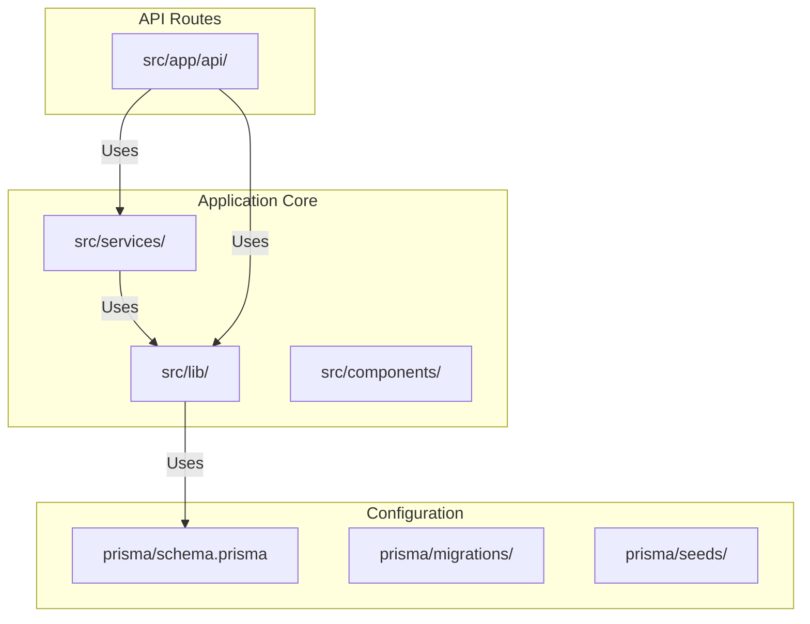
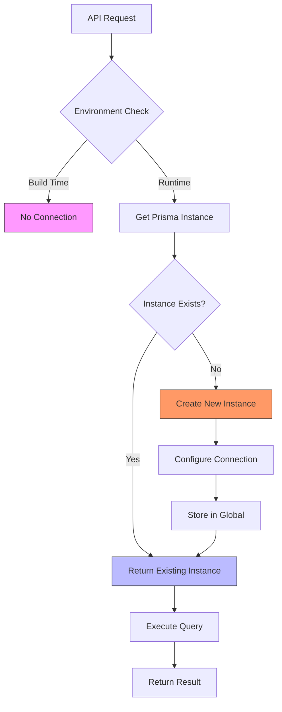
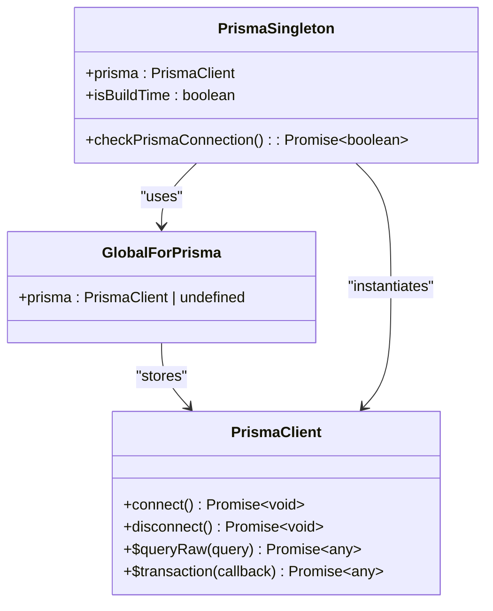
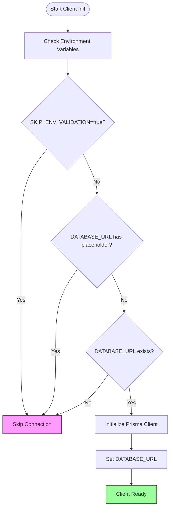
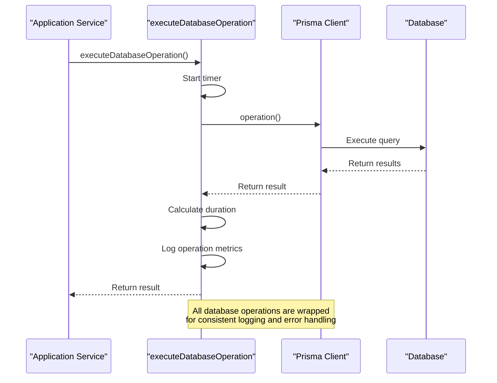
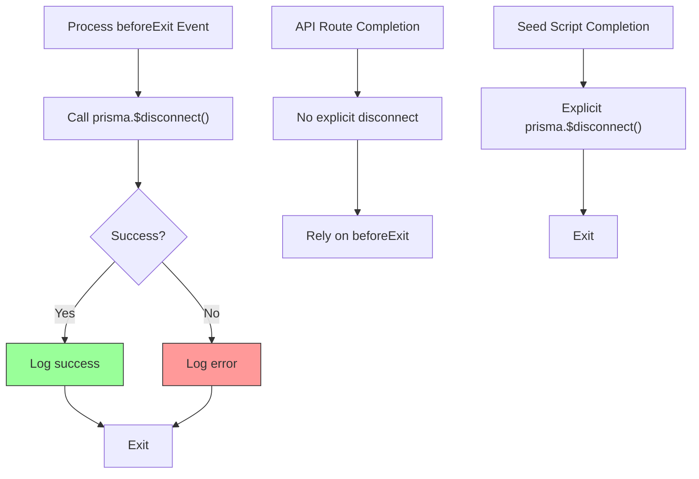
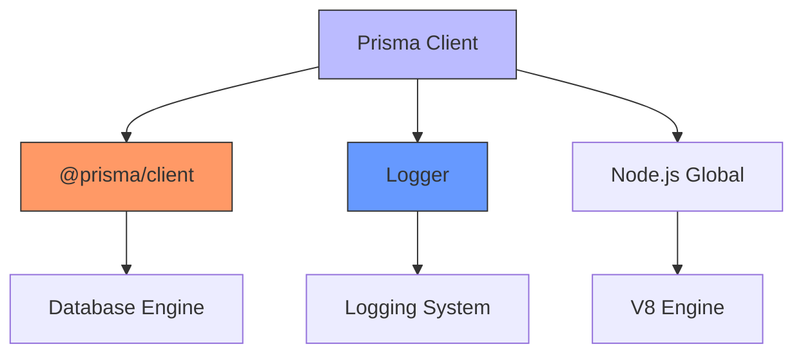
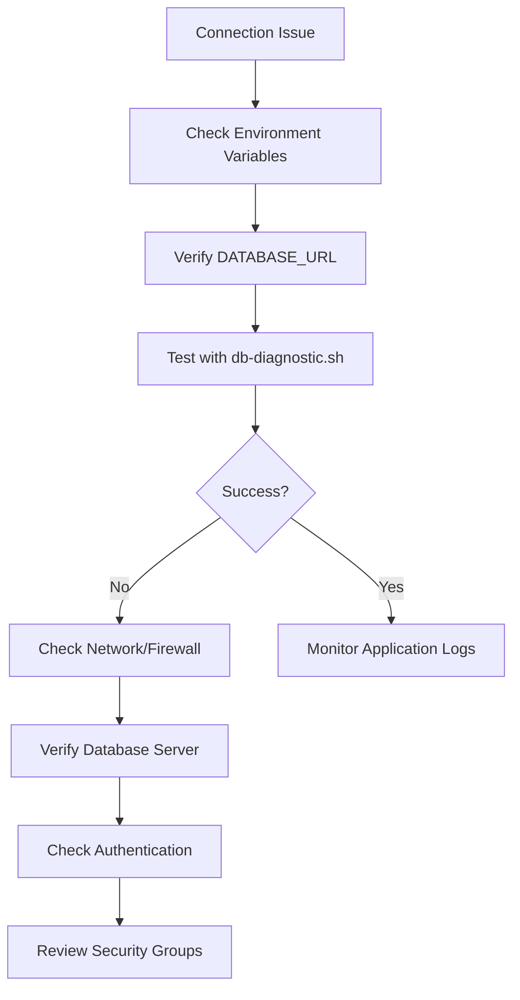

# Prisma Client Implementation

<cite>
**Referenced Files in This Document**   
- [prisma.ts](file://src/lib/prisma.ts)
- [database-error-handler.ts](file://src/lib/database-error-handler.ts)
- [seed.ts](file://prisma/seed.ts)
- [next.config.mjs](file://next.config.mjs)
</cite>

## Table of Contents
1. [Introduction](#introduction)
2. [Project Structure](#project-structure)
3. [Core Components](#core-components)
4. [Architecture Overview](#architecture-overview)
5. [Detailed Component Analysis](#detailed-component-analysis)
6. [Dependency Analysis](#dependency-analysis)
7. [Performance Considerations](#performance-considerations)
8. [Troubleshooting Guide](#troubleshooting-guide)
9. [Conclusion](#conclusion)

## Introduction
This document provides a comprehensive analysis of the Prisma client implementation in the fund-track application. It covers the singleton pattern used to manage database connections, environment configuration, error handling, logging, and production considerations. The implementation is designed to prevent multiple database connections in serverless environments while ensuring robust error recovery and performance monitoring.

## Project Structure
The project follows a standard Next.js application structure with clear separation of concerns. The Prisma client is centrally managed in the `src/lib` directory, with related utilities for error handling and database operations. Migration files are stored in the `prisma/migrations` directory, and seed scripts are located in `prisma/seeds`.



**Diagram sources**
- [prisma/schema.prisma](file://prisma/schema.prisma)
- [src/lib/prisma.ts](file://src/lib/prisma.ts)

**Section sources**
- [src/lib/prisma.ts](file://src/lib/prisma.ts)
- [prisma/schema.prisma](file://prisma/schema.prisma)

## Core Components
The core components of the Prisma implementation include the singleton client instance, connection management utilities, and error handling middleware. The implementation prevents multiple connections in serverless environments by using a global variable to store the client instance.

**Section sources**
- [src/lib/prisma.ts](file://src/lib/prisma.ts)
- [src/lib/database-error-handler.ts](file://src/lib/database-error-handler.ts)

## Architecture Overview
The Prisma client architecture implements a singleton pattern to ensure only one database connection is created per server instance. This is critical for serverless environments where multiple function instances might otherwise create redundant connections.



**Diagram sources**
- [src/lib/prisma.ts](file://src/lib/prisma.ts#L0-L44)

## Detailed Component Analysis

### Singleton Pattern Implementation
The singleton pattern prevents multiple database connections by checking for an existing instance in the global scope before creating a new one. This is essential for serverless environments where cold starts could otherwise create multiple connections.



**Diagram sources**
- [src/lib/prisma.ts](file://src/lib/prisma.ts#L0-L44)

**Section sources**
- [src/lib/prisma.ts](file://src/lib/prisma.ts#L0-L60)

### Connection String Configuration
The connection string is configured via environment variables, with special handling for build-time and development environments. The implementation checks for placeholder values and skips connection during build processes.



**Diagram sources**
- [src/lib/prisma.ts](file://src/lib/prisma.ts#L0-L44)
- [src/lib/database-error-handler.ts](file://src/lib/database-error-handler.ts#L232-L282)

**Section sources**
- [src/lib/prisma.ts](file://src/lib/prisma.ts#L0-L44)

### Error Handling Strategy
The error handling strategy includes retry logic with exponential backoff for transient failures. The system distinguishes between retryable and non-retryable errors, with specific handling for common database error codes.

```mermaid
classDiagram
class DatabaseErrorHandler {
+transformPrismaError(error, operation) : Error
+isRetryableError(error) : boolean
+withDatabaseRetry(operation, operationName, config) : Promise~T~
+executeDatabaseOperation(operation, operationName, tableName, enableRetry) : Promise~T~
+checkDatabaseHealth() : Promise~{healthy, latency, error}~
+closeDatabaseConnection() : Promise~void~
+withDatabaseTransaction(operation, operationName) : Promise~T~
}
class RetryConfig {
+maxRetries : number
+baseDelay : number
+maxDelay : number
+backoffMultiplier : number
}
class PrismaClientKnownRequestError {
+code : string
+meta : any
}
DatabaseErrorHandler --> RetryConfig : "uses"
DatabaseErrorHandler --> PrismaClientKnownRequestError : "handles"
DatabaseErrorHandler --> PrismaClient : "wraps"
```

**Diagram sources**
- [src/lib/database-error-handler.ts](file://src/lib/database-error-handler.ts#L0-L40)
- [src/lib/database-error-handler.ts](file://src/lib/database-error-handler.ts#L42-L92)

**Section sources**
- [src/lib/database-error-handler.ts](file://src/lib/database-error-handler.ts#L0-L92)

### Middleware Implementation
While Prisma middleware ($use) is not explicitly implemented, the system uses a wrapper pattern for logging and monitoring. Query performance is logged through the application's logger with duration metrics.



**Diagram sources**
- [src/lib/database-error-handler.ts](file://src/lib/database-error-handler.ts#L179-L230)
- [src/lib/database-error-handler.ts](file://src/lib/database-error-handler.ts#L232-L282)

**Section sources**
- [src/lib/database-error-handler.ts](file://src/lib/database-error-handler.ts#L179-L282)

### Connection Management
The system implements graceful connection cleanup through process event handlers. The beforeExit event ensures connections are properly closed during server shutdown.



**Diagram sources**
- [src/lib/prisma.ts](file://src/lib/prisma.ts#L35-L44)
- [prisma/seed.ts](file://prisma/seed.ts#L489-L509)
- [src/lib/database-error-handler.ts](file://src/lib/database-error-handler.ts#L275-L320)

**Section sources**
- [src/lib/prisma.ts](file://src/lib/prisma.ts#L35-L44)
- [prisma/seed.ts](file://prisma/seed.ts#L489-L509)

## Dependency Analysis
The Prisma client implementation has minimal external dependencies, relying primarily on the Prisma client library and the application's logger. The singleton pattern reduces memory overhead by preventing multiple client instances.



**Diagram sources**
- [package.json](file://package.json)
- [src/lib/prisma.ts](file://src/lib/prisma.ts)

**Section sources**
- [package.json](file://package.json)
- [src/lib/prisma.ts](file://src/lib/prisma.ts)

## Performance Considerations
The implementation addresses several performance considerations for production environments:

- **Connection Limits**: The singleton pattern inherently limits connections to one per server instance
- **Idle Timeouts**: No explicit idle timeout configuration, relying on database server defaults
- **Memory Usage**: Global storage prevents memory leaks from multiple client instances
- **Query Performance**: Logging includes duration metrics for monitoring

The system does not explicitly configure connection pooling, relying on Prisma's default pooling behavior. In serverless environments, this is typically managed by the hosting platform.

**Section sources**
- [src/lib/prisma.ts](file://src/lib/prisma.ts)
- [src/lib/database-error-handler.ts](file://src/lib/database-error-handler.ts)

## Troubleshooting Guide
Common connection issues and their solutions:

### Connection Failures
- **Error**: "Can't reach database server (P1001)"
  - **Solution**: Verify DATABASE_URL environment variable and network connectivity
- **Error**: "Database server timeout (P1002)"
  - **Solution**: Check database load and consider query optimization

### Diagnostic Scripts
The repository includes several diagnostic scripts:
- `db-diagnostic.sh`: Comprehensive database connectivity test
- `health-check.sh`: Application health check including database status
- `test-legacy-db.mjs`: Legacy database connectivity test



**Section sources**
- [scripts/db-diagnostic.sh](file://scripts/db-diagnostic.sh)
- [scripts/health-check.sh](file://scripts/health-check.sh)
- [src/lib/database-error-handler.ts](file://src/lib/database-error-handler.ts)

## Conclusion
The Prisma client implementation in the fund-track application effectively addresses the challenges of database connectivity in serverless environments. The singleton pattern prevents multiple connections, while comprehensive error handling ensures resilience to transient failures. The integration with Next.js lifecycle events and environment variable configuration provides a robust foundation for production deployment. Future improvements could include explicit connection pooling configuration and enhanced query performance monitoring.