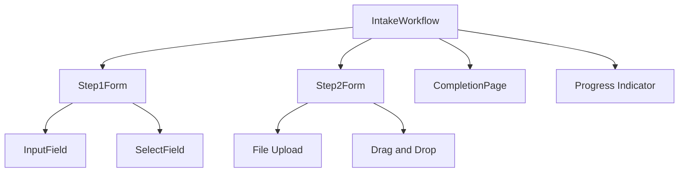
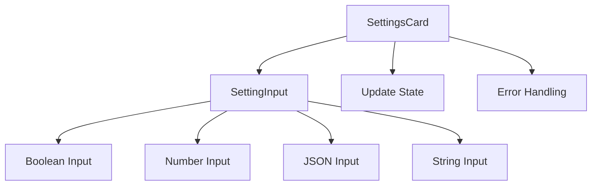
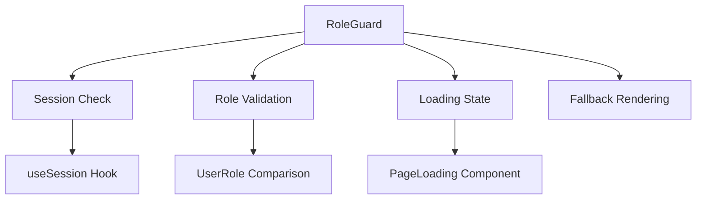

# Component Hierarchy

<cite>
**Referenced Files in This Document**   
- [LeadDashboard.tsx](file://src/components/dashboard/LeadDashboard.tsx)
- [LeadList.tsx](file://src/components/dashboard/LeadList.tsx)
- [LeadSearchFilters.tsx](file://src/components/dashboard/LeadSearchFilters.tsx)
- [Pagination.tsx](file://src/components/dashboard/Pagination.tsx)
- [types.ts](file://src/components/dashboard/types.ts)
- [IntakeWorkflow.tsx](file://src/components/intake/IntakeWorkflow.tsx)
- [Step1Form.tsx](file://src/components/intake/Step1Form.tsx)
- [Step2Form.tsx](file://src/components/intake/Step2Form.tsx)
- [InputField.tsx](file://src/components/intake/InputField.tsx)
- [SelectField.tsx](file://src/components/intake/SelectField.tsx)
- [RoleGuard.tsx](file://src/components/auth/RoleGuard.tsx)
- [SettingsCard.tsx](file://src/components/admin/SettingsCard.tsx)
- [SettingInput.tsx](file://src/components/admin/SettingInput.tsx)
- [ErrorBoundary.tsx](file://src/components/ErrorBoundary.tsx)
- [PageLoading.tsx](file://src/components/PageLoading.tsx)
- [ServerInitializer.tsx](file://src/components/ServerInitializer.tsx)
</cite>

## Table of Contents
1. [Component Hierarchy](#component-hierarchy)
2. [Feature-Based Component Organization](#feature-based-component-organization)
3. [Dashboard Components](#dashboard-components)
4. [Intake Workflow Components](#intake-workflow-components)
5. [Admin Interface Components](#admin-interface-components)
6. [Authentication Components](#authentication-components)
7. [Shared Infrastructure Components](#shared-infrastructure-components)
8. [Data Structures and Type Definitions](#data-structures-and-type-definitions)
9. [Component Composition Patterns](#component-composition-patterns)
10. [State Management and API Integration](#state-management-and-api-integration)

## Feature-Based Component Organization

The fund-track application organizes its frontend components by feature domain, creating a clear separation of concerns and improving maintainability. The component structure follows a modular approach with distinct directories for different functional areas: admin, dashboard, intake, and shared utilities.

The component hierarchy is organized under the `src/components` directory, which contains feature-specific subdirectories:
- `admin`: Components for administrative interfaces and system configuration
- `dashboard`: Components for lead management and data visualization
- `intake`: Components for the application intake workflow
- Root-level components: Shared infrastructure components used across the application

This organization enables focused development, reduces coupling between feature domains, and makes it easier for developers to locate relevant components based on functionality.

## Dashboard Components

The dashboard component suite provides a comprehensive interface for managing merchant funding leads. The primary container component, `LeadDashboard`, orchestrates several specialized subcomponents to deliver a complete lead management experience.

```mermaid
graph TD
A[LeadDashboard] --> B[LeadSearchFilters]
A --> C[LeadList]
A --> D[Pagination]
B --> E[Filter State Management]
C --> F[Sorting Functionality]
D --> G[Page Navigation]
A --> H[API Integration]
H --> I[/api/leads]
```

**Diagram sources**
- [LeadDashboard.tsx](file://src/components/dashboard/LeadDashboard.tsx)
- [LeadSearchFilters.tsx](file://src/components/dashboard/LeadSearchFilters.tsx)
- [LeadList.tsx](file://src/components/dashboard/LeadList.tsx)
- [Pagination.tsx](file://src/components/dashboard/Pagination.tsx)

**Section sources**
- [LeadDashboard.tsx](file://src/components/dashboard/LeadDashboard.tsx#L1-L216)
- [LeadSearchFilters.tsx](file://src/components/dashboard/LeadSearchFilters.tsx#L1-L325)
- [LeadList.tsx](file://src/components/dashboard/LeadList.tsx#L1-L462)
- [Pagination.tsx](file://src/components/dashboard/Pagination.tsx#L1-L134)

### LeadDashboard Component

The `LeadDashboard` component serves as the central container for lead management functionality. It manages state for leads, filters, pagination, and sorting, coordinating data flow between subcomponents.

Key features:
- **State management**: Uses React hooks (`useState`, `useCallback`, `useEffect`) to manage component state
- **API integration**: Fetches lead data from `/api/leads` endpoint with configurable parameters
- **Data processing**: Converts string dates from API response to Date objects for proper sorting and display
- **Error handling**: Implements try-catch pattern with user-friendly error display
- **Performance optimization**: Uses `useCallback` to memoize the fetch function and prevent unnecessary re-renders

The component implements a client-side data fetching pattern with automatic refresh on mount and when dependencies change. It handles loading states and provides retry functionality for failed requests.

### LeadList Component

The `LeadList` component renders a responsive table displaying lead information with sorting capabilities. It accepts props for lead data, loading state, and sorting controls.

Key implementation details:
- **Responsive design**: Uses Tailwind CSS to create different layouts for desktop and mobile views
- **Sorting UI**: Implements sortable table headers with visual indicators for current sort field and direction
- **Data formatting**: Includes utility functions for formatting dates and names consistently
- **Status visualization**: Uses color-coded badges to represent different lead statuses (NEW, PENDING, IN_PROGRESS, COMPLETED, REJECTED)
- **Loading state**: Displays skeleton loading animation during data fetch operations

The component handles both desktop (table) and mobile (card) views, ensuring usability across device types.

### LeadSearchFilters Component

The `LeadSearchFilters` component provides an interface for filtering leads by various criteria. It implements several UX optimizations:

- **Debounced search**: Applies a 500ms debounce to search input to reduce API calls during typing
- **Immediate filter updates**: Applies non-search filters immediately without debounce
- **Visual feedback**: Shows a loading spinner during search operations
- **Clear all functionality**: Allows users to reset all filters with a single click
- **Conditional rendering**: Only shows the "Clear All" button when filters are active

The component maintains local state for filters and synchronizes with parent components through callback props, implementing a controlled component pattern.

### Pagination Component

The `Pagination` component handles pagination controls and display. Key features include:

- **Results summary**: Shows the range of items displayed and total count
- **Page size selection**: Allows users to choose the number of items per page (10, 25, 50, 100)
- **Smart page numbering**: Implements ellipsis for large page counts to avoid overwhelming the UI
- **Navigation controls**: Provides previous/next buttons and direct page selection
- **State management**: Tracks current page, limit, and calculates derived values like start/end items

The component uses a flexible layout that adapts to different screen sizes, placing controls optimally for both mobile and desktop views.

## Intake Workflow Components

The intake workflow components facilitate the application process for new leads. This feature domain includes a multi-step form with progress tracking and document upload functionality.



**Diagram sources**
- [IntakeWorkflow.tsx](file://src/components/intake/IntakeWorkflow.tsx)
- [Step1Form.tsx](file://src/components/intake/Step1Form.tsx)
- [Step2Form.tsx](file://src/components/intake/Step2Form.tsx)

**Section sources**
- [IntakeWorkflow.tsx](file://src/components/intake/IntakeWorkflow.tsx#L1-L96)
- [Step1Form.tsx](file://src/components/intake/Step1Form.tsx#L1-L399)
- [Step2Form.tsx](file://src/components/intake/Step2Form.tsx#L1-L312)

### IntakeWorkflow Component

The `IntakeWorkflow` component manages the multi-step application process, providing a progress indicator and conditional rendering of step components based on the current state.

Key functionality:
- **State-based navigation**: Determines current step based on intake session status (isCompleted, step1Completed)
- **Progress visualization**: Displays a horizontal progress bar with step indicators
- **Conditional rendering**: Renders the appropriate step component (Step1Form, Step2Form, or CompletionPage)
- **Step completion handling**: Provides callback functions to advance to the next step

The component uses a simple state machine pattern to manage the workflow progression, with visual indicators showing completed, current, and upcoming steps.

### Step1Form Component

The `Step1Form` component implements the first step of the intake process, collecting business and personal information. It features:

- **Comprehensive form fields**: Collects business details, personal information, and financial data
- **Prefilled values**: Initializes form data with existing lead information from the intake session
- **Structured organization**: Groups related fields into logical sections
- **Dropdown components**: Uses predefined options for states, legal entities, and other categorical data
- **Form state management**: Maintains local state for all form fields

The form includes validation-ready structure with error state management, though specific validation logic would be implemented at the API level.

### Step2Form Component

The `Step2Form` component handles document upload functionality for the intake process. Key features include:

- **Multiple file upload**: Supports uploading exactly three documents
- **Drag and drop interface**: Allows users to drag files onto the upload area
- **File validation**: Validates file type, size (max 10MB), and emptiness
- **Upload progress**: Shows progress indicators during the upload process
- **Error handling**: Provides specific error messages for invalid files
- **File type icons**: Displays appropriate icons based on file MIME type

The component implements client-side validation before submission and provides visual feedback throughout the upload process.

## Admin Interface Components

The admin interface components provide system configuration capabilities with a focus on usability and feedback.



**Diagram sources**
- [SettingsCard.tsx](file://src/components/admin/SettingsCard.tsx)
- [SettingInput.tsx](file://src/components/admin/SettingInput.tsx)

**Section sources**
- [SettingsCard.tsx](file://src/components/admin/SettingsCard.tsx#L1-L140)
- [SettingInput.tsx](file://src/components/admin/SettingInput.tsx#L1-L165)

### SettingsCard Component

The `SettingsCard` component displays a group of related system settings within a category. It provides:

- **Category organization**: Groups settings by functional category
- **Update tracking**: Shows loading states during setting updates
- **Error display**: Presents error messages when setting updates fail
- **Reset functionality**: Allows individual settings to be reset to default values
- **Metadata display**: Shows default values and last updated timestamps

The component handles multiple settings of different types within a single interface, delegating input rendering to the `SettingInput` component.

### SettingInput Component

The `SettingInput` component renders appropriate input controls based on the setting type, implementing a polymorphic input pattern:

- **Boolean settings**: Renders toggle switches with immediate save behavior
- **Number settings**: Provides numeric input with save button
- **String settings**: Offers text input with save button
- **JSON settings**: Includes textarea with JSON formatting capability

The component implements change tracking to only show save controls when values have been modified, and provides instant feedback for boolean toggles while requiring explicit save for other types.

## Authentication Components

The authentication components implement role-based access control to protect application routes and functionality.



**Diagram sources**
- [RoleGuard.tsx](file://src/components/auth/RoleGuard.tsx)

**Section sources**
- [RoleGuard.tsx](file://src/components/auth/RoleGuard.tsx#L1-L76)

### RoleGuard Component

The `RoleGuard` component protects routes and UI elements based on user roles. It implements:

- **Session management**: Uses NextAuth's `useSession` hook to access authentication state
- **Role validation**: Checks if the user's role is included in the allowed roles array
- **Loading state**: Displays `PageLoading` component during authentication check
- **Flexible fallback**: Supports custom fallback content or default access denied UI
- **Convenience wrappers**: Provides `AdminOnly` and `AuthenticatedOnly` higher-order components

The component handles the three possible session states (loading, authenticated, unauthenticated) appropriately, ensuring a smooth user experience during authentication checks.

## Shared Infrastructure Components

The application includes several infrastructure components that enhance stability and user experience across the entire application.

### ErrorBoundary Component

The `ErrorBoundary` component provides a safety net for unhandled JavaScript errors in the component tree. While the specific implementation details are not available, ErrorBoundary components typically:

- Catch JavaScript errors anywhere in their child component tree
- Log error information for debugging
- Display a fallback UI instead of crashing the entire application
- Allow for error recovery and user continuation

This component helps maintain application stability by preventing unhandled exceptions from breaking the entire user interface.

### PageLoading Component

The `PageLoading` component displays a loading state during route transitions or data fetching operations. It likely:

- Shows a visual indicator (spinner, progress bar, skeleton)
- Prevents user interaction during loading
- Improves perceived performance by providing feedback
- Can be used standalone or within other components

This component enhances user experience by providing clear feedback during asynchronous operations.

### ServerInitializer Component

The `ServerInitializer` component likely handles server-side initialization tasks such as:

- Database connection setup
- Configuration loading
- Service initialization
- Health checks
- Environment validation

This component ensures the application server is properly configured before handling requests.

## Data Structures and Type Definitions

The application uses TypeScript interfaces to define data structures, ensuring type safety and providing documentation.

```mermaid
classDiagram
class Lead {
+id : number
+legacyLeadId : string | null
+campaignId : number
+email : string | null
+phone : string | null
+firstName : string | null
+lastName : string | null
+businessName : string | null
+status : LeadStatus
+createdAt : Date
+_count : { notes : number, documents : number }
}
class LeadFilters {
+search : string
+status : string
+dateFrom : string
+dateTo : string
}
class PaginationInfo {
+page : number
+limit : number
+totalCount : number
+totalPages : number
+hasNext : boolean
+hasPrev : boolean
}
Lead ..> LeadFilters : "filtered by"
Lead ..> PaginationInfo : "paginated with"
```

**Diagram sources**
- [types.ts](file://src/components/dashboard/types.ts)

**Section sources**
- [types.ts](file://src/components/dashboard/types.ts#L1-L65)

### Lead Interface

The `Lead` interface defines the structure of lead data with comprehensive business and personal information:

- **Core identifiers**: id, legacyLeadId, campaignId
- **Contact information**: email, phone, mobile
- **Personal details**: firstName, lastName, dateOfBirth, socialSecurity
- **Business information**: businessName, dba, legalEntity, industry
- **Financial data**: amountNeeded, monthlyRevenue, yearsInBusiness
- **Status tracking**: status, intake completion timestamps
- **Metadata**: createdAt, updatedAt, importedAt
- **Relationship counts**: _count with notes and documents

### LeadFilters Interface

The `LeadFilters` interface defines the filtering parameters for lead searches:

- **Text search**: search field for keyword matching
- **Status filter**: status field for filtering by lead status
- **Date range**: dateFrom and dateTo for filtering by creation date

### PaginationInfo Interface

The `PaginationInfo` interface provides metadata for paginated results:

- **Current page**: page number
- **Items per page**: limit
- **Total counts**: totalCount and totalPages
- **Navigation flags**: hasNext and hasPrev for determining available navigation

## Component Composition Patterns

The application demonstrates several effective component composition patterns that promote reusability and maintainability.

### Atomic Design Principles

The component hierarchy follows atomic design principles with:
- **Atoms**: Basic inputs like `InputField` and `SelectField`
- **Molecules**: Form fields with labels and validation
- **Organisms**: Complete forms like `Step1Form` and `Step2Form`
- **Templates**: Page layouts like `LeadDashboard`
- **Pages**: Complete views with data integration

### Prop-Driven Configuration

Components use props extensively for configuration, enabling reuse across different contexts:
- `RoleGuard` accepts `allowedRoles` and `fallback` props
- `SettingsCard` accepts category and settings array
- `LeadList` accepts sorting and loading state

### Callback Pattern

Parent components pass callback functions to children to handle events:
- `LeadDashboard` passes `handleFiltersChange` to `LeadSearchFilters`
- `Step1Form` receives `onComplete` callback from `IntakeWorkflow`
- `Pagination` receives `onPageChange` and `onLimitChange` callbacks

## State Management and API Integration

The application implements a client-side state management approach using React hooks, with direct API integration from components.

### Client-Side Data Fetching

Components use the native `fetch` API to retrieve data:
- `LeadDashboard` fetches from `/api/leads` with query parameters
- `Step2Form` uploads documents to `/api/intake/[token]/step2`
- Error handling with try-catch blocks and user feedback

### State Management Patterns

The application uses several React patterns for state management:
- **useState**: For local component state
- **useCallback**: For memoizing functions to prevent unnecessary re-renders
- **useEffect**: For side effects like data fetching
- **Controlled components**: Form inputs controlled by React state

### Performance Considerations

The implementation includes several performance optimizations:
- **Debouncing**: Search inputs are debounced to reduce API calls
- **Memoization**: `useCallback` prevents unnecessary function recreation
- **Conditional rendering**: Components only render when data is available
- **Skeleton loading**: Provides immediate feedback during data loading

These patterns ensure a responsive user interface while minimizing unnecessary network requests and re-renders.