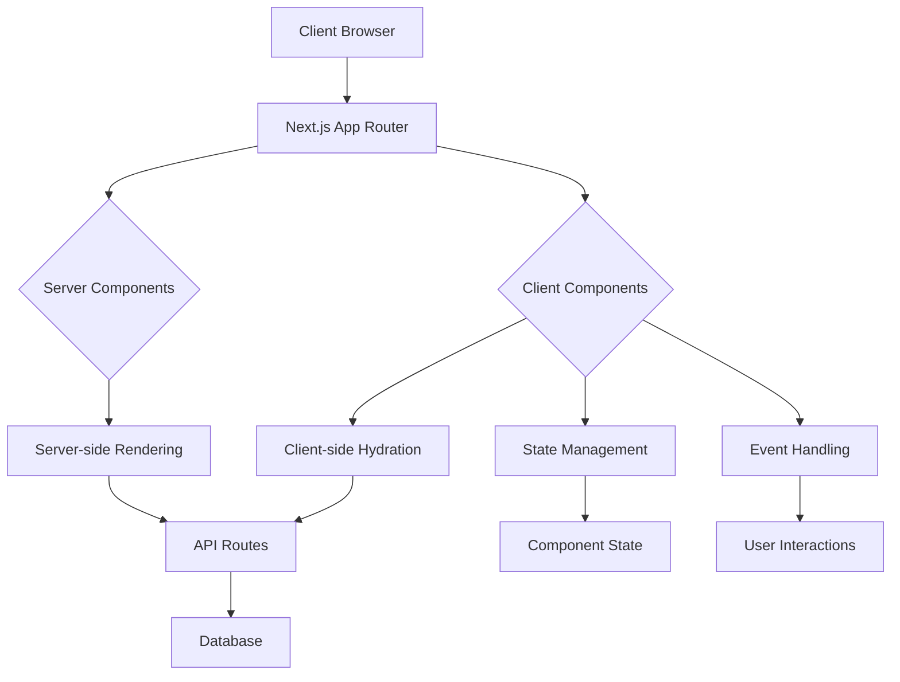
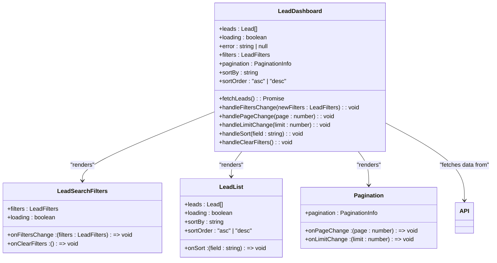
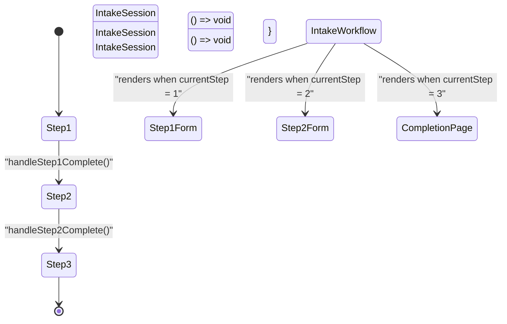
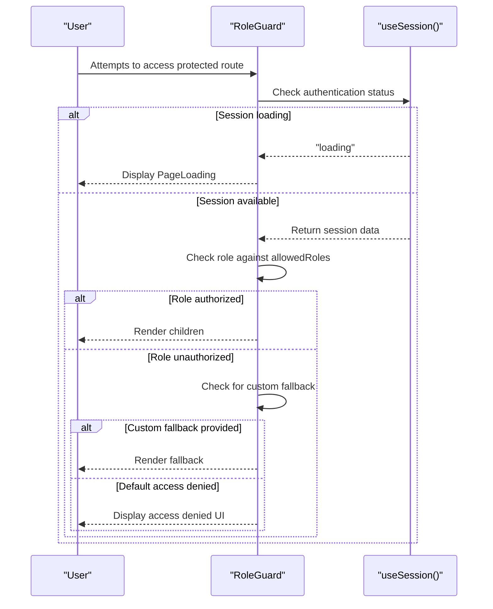
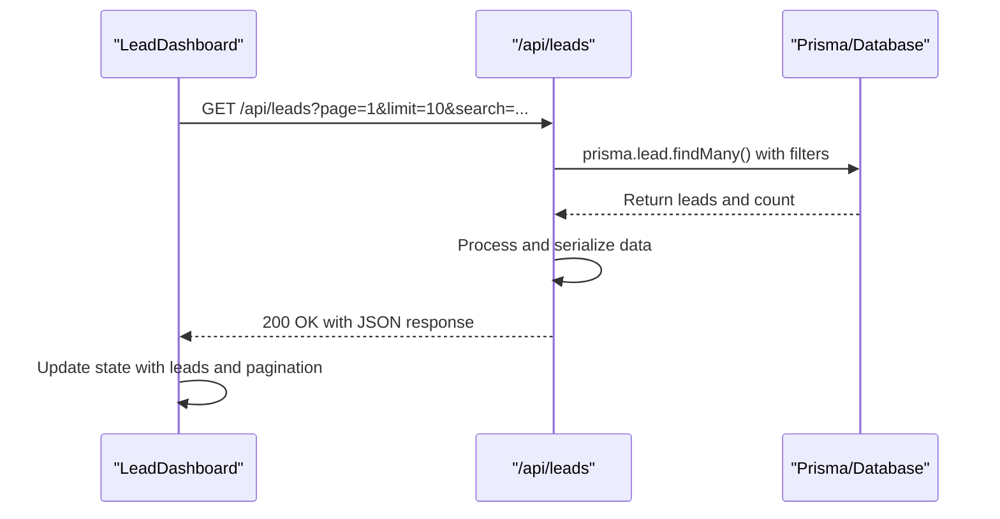
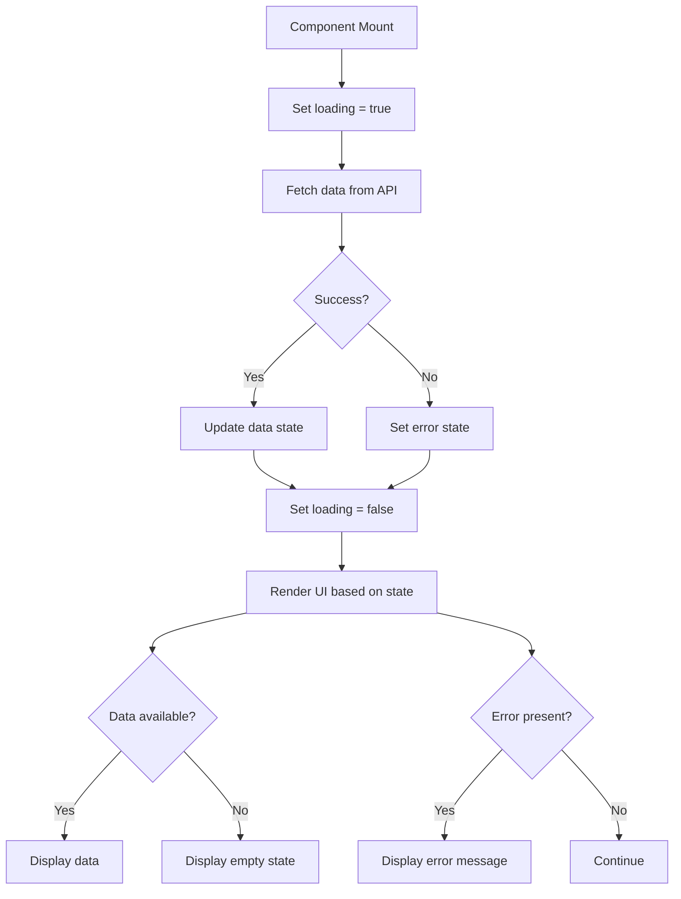

# Frontend Architecture

<cite>
**Referenced Files in This Document**   
- [layout.tsx](file://src/app/layout.tsx)
- [LeadDashboard.tsx](file://src/components/dashboard/LeadDashboard.tsx)
- [IntakeWorkflow.tsx](file://src/components/intake/IntakeWorkflow.tsx)
- [RoleGuard.tsx](file://src/components/auth/RoleGuard.tsx)
- [page.tsx](file://src/app/dashboard/page.tsx)
- [route.ts](file://src/app/api/leads/route.ts)
- [page.tsx](file://src/app/application/[token]/page.tsx)
</cite>

## Table of Contents
1. [Project Structure](#project-structure)
2. [Core Components](#core-components)
3. [Architecture Overview](#architecture-overview)
4. [Detailed Component Analysis](#detailed-component-analysis)
5. [Data Fetching and API Integration](#data-fetching-and-api-integration)
6. [UI State Management and Error Handling](#ui-state-management-and-error-handling)
7. [Accessibility and Responsive Design](#accessibility-and-responsive-design)
8. [Performance Optimization](#performance-optimization)

## Project Structure

The fund-track application follows a Next.js 14 App Router structure with a clear separation of concerns. The frontend layer is organized into distinct directories for pages, components, and utilities. The `src/app` directory contains the routing structure with nested folders for different application sections including `dashboard`, `admin`, `auth`, and `application`. Each route corresponds to a specific user interface, with `page.tsx` files defining the entry points.

Component organization follows a feature-based approach within the `src/components` directory, with subdirectories for `dashboard`, `intake`, `admin`, and `auth` components. This structure promotes reusability and maintains clear boundaries between different functional areas of the application. The `lib` directory contains shared utilities for authentication, logging, and error handling, while the `services` directory encapsulates business logic and API interactions.

```mermaid
graph TB
subgraph "App Router Structure"
A[src/app]
A --> B[dashboard]
A --> C[admin]
A --> D[auth]
A --> E[application/[token]]
A --> F[api]
A --> G[layout.tsx]
A --> H[page.tsx]
end
subgraph "Components"
I[src/components]
I --> J[dashboard]
I --> K[intake]
I --> L[admin]
I --> M[auth]
end
subgraph "Utilities"
N[src/lib]
O[src/services]
end
A --> I
A --> N
A --> O
```

**Diagram sources**
- [layout.tsx](file://src/app/layout.tsx)
- [LeadDashboard.tsx](file://src/components/dashboard/LeadDashboard.tsx)
- [IntakeWorkflow.tsx](file://src/components/intake/IntakeWorkflow.tsx)

## Core Components

The application's frontend architecture revolves around three core components: `LeadDashboard`, `IntakeWorkflow`, and `RoleGuard`. These components serve as the foundation for the application's primary interfaces and functionality.

The `LeadDashboard` component provides a comprehensive interface for managing merchant funding leads, featuring search, filtering, pagination, and data visualization capabilities. It serves as the central hub for the dashboard interface, aggregating multiple subcomponents to create a cohesive user experience.

The `IntakeWorkflow` component orchestrates the multi-step application process for new leads, managing state transitions between form steps and providing visual progress indicators. This component is designed to handle the complex user journey of completing a funding application.

The `RoleGuard` component implements role-based access control, ensuring that users can only access functionality appropriate to their permission level. It provides a reusable authorization mechanism that can be applied across different routes and components.

**Section sources**
- [LeadDashboard.tsx](file://src/components/dashboard/LeadDashboard.tsx)
- [IntakeWorkflow.tsx](file://src/components/intake/IntakeWorkflow.tsx)
- [RoleGuard.tsx](file://src/components/auth/RoleGuard.tsx)

## Architecture Overview

The frontend architecture follows a component-based design pattern with clear separation between server and client components. The Next.js App Router enables server-side rendering for initial page loads while leveraging client components for interactive features. This hybrid approach optimizes performance and user experience.

The application uses a layered architecture with the following key layers:
- **Presentation Layer**: React components that define the user interface
- **State Management Layer**: React hooks and component state for managing UI state
- **Data Access Layer**: API routes and service utilities for backend integration
- **Authorization Layer**: Role-based access control components



**Diagram sources**
- [layout.tsx](file://src/app/layout.tsx)
- [page.tsx](file://src/app/dashboard/page.tsx)
- [route.ts](file://src/app/api/leads/route.ts)

## Detailed Component Analysis

### LeadDashboard Component Analysis

The `LeadDashboard` component serves as the primary interface for lead management, integrating multiple subcomponents to provide a comprehensive view of all merchant funding leads. As a client component, it manages state locally using React hooks and fetches data from the backend API.

The component implements a sophisticated state management pattern using multiple `useState` hooks to track leads, loading status, errors, filters, pagination, and sorting preferences. The `useCallback` hook optimizes the `fetchLeads` function to prevent unnecessary re-creations, while `useEffect` ensures data is loaded when the component mounts.



**Diagram sources**
- [LeadDashboard.tsx](file://src/components/dashboard/LeadDashboard.tsx)
- [LeadSearchFilters.tsx](file://src/components/dashboard/LeadSearchFilters.tsx)
- [LeadList.tsx](file://src/components/dashboard/LeadList.tsx)
- [Pagination.tsx](file://src/components/dashboard/Pagination.tsx)

### IntakeWorkflow Component Analysis

The `IntakeWorkflow` component manages the multi-step application process for new leads, providing a guided user experience through the intake process. This client component maintains state to track the current step and renders different form components based on the user's progress.

The workflow follows a linear progression with three distinct states: Step 1 (Personal Information), Step 2 (Document Upload), and Step 3 (Completion). The component uses a callback pattern to notify parent components when steps are completed, enabling state transitions.



**Diagram sources**
- [IntakeWorkflow.tsx](file://src/components/intake/IntakeWorkflow.tsx)
- [Step1Form.tsx](file://src/components/intake/Step1Form.tsx)
- [Step2Form.tsx](file://src/components/intake/Step2Form.tsx)
- [CompletionPage.tsx](file://src/components/intake/CompletionPage.tsx)

### RoleGuard Component Analysis

The `RoleGuard` component implements a reusable authorization mechanism that restricts access to specific routes and components based on user roles. It leverages NextAuth for session management and provides a flexible interface for role-based access control.

The component offers convenience wrappers like `AdminOnly` and `AuthenticatedOnly` to simplify common authorization patterns. It handles loading states gracefully and provides customizable fallback UI for unauthorized access attempts.



**Diagram sources**
- [RoleGuard.tsx](file://src/components/auth/RoleGuard.tsx)
- [page.tsx](file://src/app/dashboard/page.tsx)

## Data Fetching and API Integration

The application implements a robust data fetching strategy that combines server-side rendering with client-side hydration. The `LeadDashboard` component demonstrates this pattern by fetching lead data from the `/api/leads` endpoint using the Fetch API.

The API integration follows RESTful principles with query parameters for filtering, pagination, and sorting. The client constructs URL parameters based on user input and sends requests to the backend, which returns paginated results with metadata.



**Diagram sources**
- [LeadDashboard.tsx](file://src/components/dashboard/LeadDashboard.tsx)
- [route.ts](file://src/app/api/leads/route.ts)

## UI State Management and Error Handling

The application employs a comprehensive state management strategy using React's built-in hooks. The `LeadDashboard` component manages multiple state variables including leads, loading status, errors, filters, pagination, and sorting preferences. This approach provides fine-grained control over the UI state while maintaining performance through optimized re-renders.

Error handling is implemented at both the component and application levels. The `LeadDashboard` includes a dedicated error state with user-friendly messaging and a retry mechanism. The application also uses an `ErrorBoundary` component at the root layout level to catch unhandled errors and prevent application crashes.

Loading states are handled through explicit loading flags that control the display of skeleton loaders and disable interactive elements during data fetching. This provides clear feedback to users about the application's state.



**Diagram sources**
- [LeadDashboard.tsx](file://src/components/dashboard/LeadDashboard.tsx)
- [layout.tsx](file://src/app/layout.tsx)

## Accessibility and Responsive Design

The application implements responsive design principles using Tailwind CSS, ensuring optimal user experience across different device sizes. The layout adapts to screen width with responsive breakpoints that modify component arrangement and styling.

Accessibility features include proper semantic HTML, ARIA attributes, keyboard navigation support, and sufficient color contrast. Form elements have associated labels, interactive elements have focus states, and error messages are announced to screen readers.

The `RoleGuard` component enhances accessibility by providing clear feedback when users lack permission to access certain features. Error states include descriptive messages and actionable buttons to help users recover from issues.

## Performance Optimization

The application incorporates several performance optimization techniques:

1. **Code Splitting**: Next.js automatically code-splits pages and components, loading only the necessary code for the current route.
2. **Dynamic Imports**: Components can be loaded dynamically when needed, reducing initial bundle size.
3. **Memoization**: The `useCallback` hook prevents unnecessary re-creation of functions in the `LeadDashboard` component.
4. **Efficient Data Fetching**: The API implements query optimization with proper indexing and pagination to minimize database load.
5. **Conditional Rendering**: Components are only rendered when needed, reducing the React reconciliation workload.

The use of server components for initial rendering reduces client-side JavaScript execution, while client components are optimized for interactivity. This hybrid approach balances performance and functionality effectively.